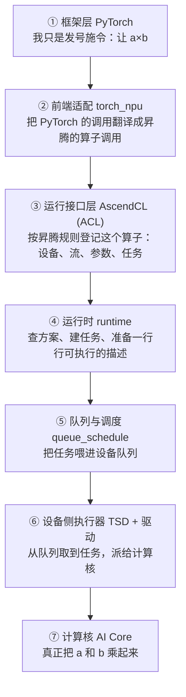
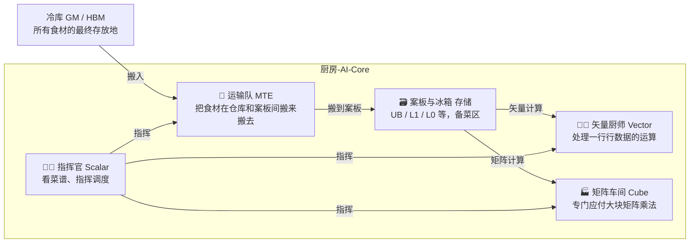

# 第1章 一段加法背后的整个软件栈

> 我不打算在第一章就扔给你一张满是名词的架构图。我们从你最熟悉的一行代码出发，一层一层往下看：每一次 `torch.add`，背后到底发生什么。看完这章，你会拥有两张「地图」——一张软件栈的纵向剖面图，一张 AI Core 的厨房模型图。之后整本书，都在为这两张图补充细节。

## 1.1 你会遇到的三台昇腾

在动手之前，先认识三台「机器」。昇腾不是一个型号，而是一个家族；书中你会反复遇到三个代号，现在给它们一张身份证：

| 代号 | 芯片 | 一句话性格 | 你会遇到它的地方 |
|---|---|---|---|
| **A2** | 昇腾 910B | 训练推理双修的「老黄牛」 | Atlas A2 系列，CANN 时代的老伙计 |
| **A3** | 昇腾 910C | A2 的升级版 | Atlas A3 系列，当前主力 |
| **A5（950 系列）** | 昇腾 950 / 950PR / 950DT | 新一代，能「边算边通信」 | 超节点（SuperPod）、大模型推理 |

为什么是这三台？因为昇腾的软件成熟度、硬件能力在这三代之间发生过一次「质变」：950 的架构版本号叫 **3510**，而 A2/A3 叫 **2201**[^gen]。架构版本号听起来像日期，其实是个暗号——它代表一代硬件的能力清单。当你看到某个特性写着「仅 NPU 架构版本 3510 支持」，就知道它是 950 的新玩具，别拿去 A2 上试。

::: tip 读法提示
本书几乎从不比较三代的「算力跑分」（这类营销数字在开源仓库里没有依据），只比较**可编程能力的差异**——因为工程师真正要回答的问题是：「同样的算子代码，在 A2 上能跑，搬到 950 上要不要改、为什么快/慢」。抓住这个视角，回想起来才不会跑偏。
:::

### 1.1.1 认识你的卡：第一次上机的三个命令

前面讲的都是「概念里的三台机」。真机上手后，先做一件事——用三个命令跟你的卡「报个到」[^smi]：

```bash
npu-smi info                                   # 1. 驱动/芯片是否可见、机上有几块卡（附录A 装完驱动后第一条）
python -c "import torch, torch_npu; print(torch_npu.npu_count())"  # 2. PyTorch 眼里有几张卡
npu-smi query -t info --board_id               # 3. 确认具体型号（950 还是 910B……能力菜单的页码）
```

这三行不复杂，但它们定义了你手里这张「能力菜单」翻到哪一页。配合开头那句军规零，上机后的第一优先就是：**先查支持表、再查型号、后动手。**

### 1.1.2 一份「产品支持表」，胜过十页宣传页

在昇腾世界，判断「一个特性/算子能不能在某台机器上用」，有一套通用的官方文档形态：**产品支持表**。几乎每个算子工程、每个技术说明里都有一张「产品支持情况」表，它比任何博客都权威[^ops]。以 Add 算子为例，仓库里它的支持表开头是这样：

```
Ascend 950PR / 950DT ······ √
Atlas A3 训练 / 推理系列 ······ √
Atlas A2 训练 / 推理系列 ······ √
Atlas 200I/500 A2 推理产品 ···· ×
Atlas 推理系列产品 ············ ×
```

这张表教会我们三件事：

1. **两套命名轴**：「Atlas A2/A3」说的是产品线（服务器形态），「Ascend 950PR/950DT」说的是芯片。两者混用是昇腾社区的常态，交流时先问清对方说的是哪套。
2. **算子有「能力矩阵」**：同一个 Add 在 950/A3/A2 全支持，但更老的 Atlas 训练/推理系列打了 ×。**拿到任何算子先查支持表**，这是昇腾工程的第一习惯。
3. **「支持」和「最优」是两回事**：表上打 √ 只保证能跑；同一算子可能在不同代数上有不同的推荐实现（第2章的 Regbase 就是一个例子）。

::: tip 军规零
**任何特性、任何算子，先看产品支持表，再看文档，最后动手。** 这一条能让你少踩一半的坑。
:::

## 1.2 十行 PyTorch 之后发生了什么

先看一段你非常熟悉的代码：

```python
import torch
import torch_npu                       # PyTorch 的昇腾适配层
a = torch.randn(4096, 4096, device="npu")
b = torch.randn(4096, 4096, device="npu")
c = torch.npu.matmul(a, b)             # 一次矩阵乘：a、b 在 NPU 上
```

你发出一条 `matmul` 的这一刻，一粒「执行请求」开始穿越一整条电梯井。这条电梯从上到下，就是昇腾的软件栈——我把每一层写成一个「接待员」，每层的台词就一句话：



七个接待员依次传话，最终这粒「请求团」落到 AI Core 上真的乘了出来。你可能注意到：**这七层里，只有最后一层在「算数」，其余六层都在「传话、登记、排队」**。这是个极其重要的第一印象——昇腾软件栈大部分代码量，都是在高效地「传话」。（各层的名字现在不必背，第二编会逐一上门拜访。）

将来的你会跟这七层里的哪几层打交道？看一张「相处之道」表：

| 层级 | 你会在什么时候遇到它 | 相处建议 |
|---|---|---|
| 框架层 PyTorch | 写模型时 | 保持熟悉感，别管下面 |
| 前端适配 torch_npu | 想弄清「torch 这步到底调了谁」时 | 第22章有对接全景 |
| ACL / runtime | 写 C 算子、追性能时 | 第4~5章重点学 |
| 队列 / TSD / 驱动 | 贴芯片侧原理时 | 第5~6章，按需精读 |
| AI Core | 写 Ascend C 算子时 | 第3编全部 |

顺路给每层认个「门牌号」——七层各能到哪儿去挖，看这一张就够（正文不展开，去向全量清单在章末与附录D）：

| 层 | 门牌（当前仓内路径） | 一句话观感 |
|---|---|---|
| ① 框架 PyTorch | 不在 CANN 仓，属 torch 生态 | 你熟悉的发令员 |
| ② torch_npu 适配 | 独立开源仓，本机未收录 | 把 torch 的方言翻成昇腾的话 |
| ③ ACL | `runtime/include/external/acl/`（头文件即词典） | 接口都声明在这 |
| ④ runtime 主实现 | `runtime/src/runtime/api/` + `runtime/src/runtime/core/` | 入口在 api/，机制在 core/ |
| ⑤ 队列调度 | `runtime/src/queue_schedule/server/` | 常驻的队列管家 |
| ⑥ TSD + 驱动 | `runtime/src/tsd/tsdclient/`（用户可观测）；`runtime/src/runtime/driver/`（驱动） | 客户端可读，内核不可见 |
| ⑦ AI Core | `asc-devkit/impl/`（Ascend C 实现） | 写算子的语言在这实现 |

对深挖党一句忠告：**③④⑤⑥ 都在 `runtime` 仓，⑦ 在 `asc-devkit` 仓**。以后你说「我去看看 runtime」，指的往往是 ③④⑤⑥ 这几层的总和。

::: tip 先记住一个词
这一路传话，在昇腾术语里叫一条 **执行链路（execution path）**。第3章我们专门给它写「传记」。
:::

### 1.2.1 概念户口本：CANN、AscendCL、runtime 谁是谁

「昇腾软件栈」不是单一产品，而是一整套软件的合称，名字最容易混。先用一张「户口本」把一家人对齐（各自细节第二编逐一展开）：

| 名字 | 它是谁 | 一句话 | 你去哪章见它 |
|---|---|---|---|
| CANN | 整套软件栈的总名（Compute Architecture for Neural Networks） | 下面的名字全住在它家里 | 全书的舞台背景 |
| AscendCL（ACL） | CANN 的编程接口层 | 你写 C 时 `#include "acl/acl.h"` 那层 | 第4章 |
| runtime | CANN 的调度库 | `aclInit` 之后真正干活的引擎 | 第5章 |
| 驱动 | 让主机与设备通信的通道 | 用户态在 `runtime/src/runtime/driver/`，内核态不在开源仓 | 第6章 |
| queue_schedule / TSD | 队列与片侧调度 | 「把任务送进芯片」的管道 | 第5、6章 |
| 算子库（aclnn 系列） | 官方写好的招牌菜 | `aclnnAdd` 就住在这一家 | 第13章 |
| Ascend C | 写算子的语言 | `add.asc` 就是它的菜谱 | 第9~14章 |

一个记忆法：**CANN 是家名，AscendCL 是前台，runtime 是管家，队列/TSD 是传菜生，后厨写 Ascend C。** 记不住也没关系，用到哪章翻哪章——但至少知道「昇腾软件」这个词名下住着这一家子。

顺带回答一个自然冒出来的问题：**为什么非要这么多层，不能并成一层？** 因为每层服务的顾客不同——框架要「好用」、ACL 要「通用」、runtime 要「稳」、驱动要「贴硬件」。层就是边界：每层可以独立升级、独立出问题独立修，你不小心把它用错时，也更容易定位是哪一层的锅。这个「分层即边界」的念头，会一路跟到第六编的编译后端。

### 1.2.2 这栋大楼还会「出错」

走下电梯之前，顺带认识一下大楼的「报错风格」——因为昇腾的错误码不是乱码，是分段编号的：

- `ACL_ERROR_RT_*`（**107000** 起）是「运行」层错误：参数非法、句柄失效、超时、设备忙……这类要检查你的调用方式与资源生命周期；
- `ACL_ERROR_GE_*`（**145000** 起）是「图执行」层错误：模型加载、动态 shape、AIPP……多在图模式/模型推理出现[^err]。

现在只要记住一句：**107xxx = 我的调用姿势不对，145xxx = 图/模型这层的锅**。分的段越多，排查越省事。第4章会系统教你读错。

展开一小步：错误码只是「摘要编号」，要真正看到「是谁、在哪、为什么」出错，还要靠 ACL 的三个查询函数。官方样例 `1_error_handling` 用一个「故意传错参数」的例子演示了完整读法（88 行，`[需真机验证]`）——先看一眼关键形态[^err2]：

```cpp
aclError lastError = aclrtGetLastError(ACL_RT_THREAD_LEVEL);    // 取"当前线程最近一次"错误码
aclError peekError = aclrtPeekAtLastError(ACL_RT_THREAD_LEVEL); // 只看一眼、不消耗"未读"错误/异常
aclrtErrorInfo errorInfo = {};
aclrtGetErrorVerbose(deviceId, &errorInfo);                     // 再去取设备侧的"详细错误"
// errorInfo 里带着 errorType（错误类型）/ tryRepair（能否自修复）/ hasDetail（还有没有详情）
```

这几行想教会你三件事：

1. **错误是「线程级」的**：ACL 会记住当前线程最近一次出错，`aclrtGetLastError` 取走，`aclrtPeekAtLastError` 只看不取；
2. **详细错误比编号值钱**：`aclrtGetErrorVerbose` 返回的结构里，`errorType` / `tryRepair` / `hasDetail` 才是排查入口，「107000」只是摘要编号；
3. 上面这三个函数及其完整分段表，是第4章错误码一节的清单——这里只认形状，不背参数。

到这儿，「看见报错」的第一步就算会了：

| 现象 | 第一动作 | 去往 |
|---|---|---|
| 返回 -1 / 直接崩 | 分辨错误码段（107xxx=调用姿势，145xxx=图/模型） | 第4章 |
| 只有码、还想要细节 | `aclrtGetErrorVerbose` → verbose 结构体 | 第4章 |
| 想自动捕捉最近错误 | `aclrtPeekAtLastError` / `aclrtGetLastError` | 第4章 |

## 1.3 第一个 C 程序：aclnn 加法

光看电梯剖面还不够踏实。昇腾官方仓库里有一个完整的加法程序，是全书的第一个标本。先看它「说了句什么」，再看它长什么样。

**这句人话说出来是**：「我要在设备 0 上加两个向量，先问问要多大的临时空间（workspace），然后开始执行，等流里的活干完，把结果拷回主机。」

Ascend C 接口把一次算子调用刻意拆成**两段**：先问尺寸、再执行。为什么这么别扭？因为算子需要一块临时工作区（workspace），大小取决于输入形状，得先探明再分配，否则大 shape 时可能爆内存。这不是设计失误，是稳健性设计[^hello]。

下面是把样板代码（约 250 行）剥到只剩骨架的「脊柱」（`[可在 NPU 运行]`，完整源码见章末）：

```cpp
aclError ret;
aclInit(nullptr);                       // 1. 点亮整条电梯井（ACL 初始化）
aclrtSetDevice(0);                     // 2. 指定 0 号设备
aclrtCreateStream(&stream);            // 3. 开一条流（传送带）

// 4. 构造三个张量描述：self / other / out（含 shape、数据类型、设备地址）

aclOpExecutor* executor = nullptr;
uint64_t wsSize = 0;
aclnnAddGetWorkspaceSize(self, other, alpha, out, &wsSize, &executor); // 5. 第一段：问尺寸
void* ws = nullptr;
if (wsSize > 0) { aclrtMalloc(&ws, wsSize, ACL_MEM_MALLOC_HUGE_FIRST); } // 6. 按尺寸给临时空间

aclnnAdd(ws, wsSize, executor, stream); // 7. 第二段：真正下发
aclrtSynchronizeStream(stream);        // 8. 等流里的活干完
// 9. aclrtMemcpy 把结果拷回主机
```

九个动作，大多数人都能凭直觉猜出七八个。这正是我要的：**昇腾的 C 接口不难认**，难的是搞懂第 5~7 步背后的机制——而这个机制，正是 1.2 电梯剖面里第 ③④⑤ 层接待员做的事。我们暂时不展开（第4章整章讲），先知道「两段式」这个形状即可。

再把这九步按「跟谁打交道」归归类，脑图就立体了：

| 程序动作 | 事实上在跟谁说话 | 一句解释 |
|---|---|---|
| `aclInit / aclrtSetDevice / aclrtCreateStream` | ACL + runtime | 点亮电梯、选电梯井、开传送带 |
| `aclCreateTensor` + `aclrtMalloc` | ACL | 定义「盘子」的形状，并在 GM 里分一块地方 |
| `aclnnAddGetWorkspaceSize` | 算子库 | 探明这道菜要不要工作空间、要多大 |
| `aclnnAdd` | 算子库→runtime | 真正下单、上流水线 |
| `aclrtSynchronizeStream` | runtime | 等传送带上的活干完 |
| `aclrtMemcpy(D2H)` | runtime/驱动 | 把答案端回主机 |

::: tip 顺带把「异步」的账结了
第 5~8 步你看到的是一种**异步天下**：`aclnnAdd` 只是「把单子递上流水线」就返回了，真正的加法在设备上慢慢做；`aclrtSynchronizeStream` 的职责是「等这条传送带上的活全部干完」，等完再 `aclrtMemcpy` 拷结果才不会拷到空数据。

也就是说：**昇腾的接口默认「下单即走、事后回执」，同步是你自己画上去的**。新手最先踩的坑，往往就是「忘了同步就直接读结果」——读到的是旧数据或全零。记住一句：**想读结果，先问自己「我同步了吗」**[^async]。异步的完整软件代价，是第3章（主链路）与第5章（runtime 实现）的主线。
:::

::: tip 两段式的三个理由（提前给个答案）
① **内存安全**：workspace 提前量好再分配，形状大也不会爆；② **复用**：同一算子同一 shape 的 executor 可以复用，省去重复编译/查询；③ **可观测**：`GetWorkspaceSize` 失败的形状，错误在被执行前就会被拦下，报错更友好。第4章会用裁剪过的源码再验证这三点。
:::

### 1.3.1 另一个 Hello：把你自己写的 kernel 发下去

`aclnnAdd` 用的是官方写好的算子库。但你要自己炒菜（自己写算子）怎么办？官方还有一个样例 `4_custom_kernel_launch`，它讲的是**自定义 kernel 的启动**。人话说，就是把你自己写的那个 `VectorAddKernel`，用一行**很像 CUDA 的三括号**发下去[^kern]。

kernel 本体约 34 行，核心骨架是这样（`[需真机验证]`）：

```cpp
extern "C" __global__ __aicore__ void VectorAddKernel(
    __gm__ float* srcA, __gm__ float* srcB, __gm__ float* dst, float alpha, uint32_t elementCount)
{
    for (uint32_t idx = 0; idx < elementCount; ++idx) {
        dst[idx] = srcA[idx] + alpha * srcB[idx];
    }
    // ...（3510 特有的 dcci 缓存回写，见下）
}

// 从 main 里像 CUDA 一样三括号调用：
VectorAddKernel<<<blockDim, nullptr, stream>>>(srcA, srcB, dst, alpha, elementCount);
```

CUDA 用户看到这三括号会心一笑——昇腾把它做成一样的形状，底层走 `aclrtLaunchKernel`。但请立刻问一句：**它和你刚学的 `aclnnAdd` 有什么不同？** 一张表说清：

| | `aclnnAdd`（算子库路） | `<<<>>>`（自定义 kernel 路） |
|---|---|---|
| 谁写的计算逻辑 | 官方算子库 | 你自己 |
| 你提供什么 | 张量描述（shape/数据类型/设备地址） | GM 指针 + 一个循环 |
| 分块（tiling） | 算子库/图引擎帮你做 | `blockDim` 你定，切块你亲自管 |
| 工作空间 | 要（两段式，先问尺寸） | 一般不要（直接传指针） |
| 适用 | 用现成算子、搭模型 | 写/改算子、做极致性能 |

一句话记住：**`aclnn` 是点菜，`<<<>>>` 是你进厨房亲自炒。** 本书第三编开始主要走第二条路，到头来两条路你都会走。

::: tip 一个补丁级的惊喜（值得慢慢读）
样例 kernel 尾部有一段 `#if __NPU_ARCH__ == 3510 dcci(...)`。它注释里讲的，正是昇腾的**存储一致性**第一课：A5 编译时生成器会在 kernel 尾部自动加 `dci()`（数据缓存无效指令），而 `scalar store` 写进缓存的脏数据还没回写 GM 就被 `dci()` 失效，会导致输出全 0——所以要显式 `dcci()` 先把脏行写回 GM。这段代码想教会你三件事：

1. **缓存（DCache）和 GM 是不同的状态**：数据写着写着其实还在片内缓存里，没「真正落地」；
2. **有些指令（dci/dcci）负责「让缓存和 GM 说话」**，它和同步一样有代价，不能乱插；
3. **看官方示例，先问「它为什么这样写」，再闭眼抄。** 这个习惯从第1章就要养成（第8章展开 DCache 与一致性，第15章教你用 dump/msprof 抓这类问题）。
:::

到这里你会发现：`aclnnAdd` 和 `VectorAddKernel<<<>>>` 两个 Hello 长得不一样，骨架却一模一样——**初始化 → 选卡 → 开流 → 分配 → 拷入 → 下单 → 同步 → 拷回 → 清理**。这段九步骨架，就是你以后写任何Ascend C 程序的模板；第2章的 Add 真码、第4章的完整剖析、第14章的算子工程，全都在给这九步填空。记住「九步骨架」四个字，以后看任何昇腾示例都不慌。

## 1.4 AI Core：一间分工明确的厨房

1.2 的电梯井最底层是 AI Core。它长什么样？官方文档习惯从「三类组件」讲起[^arch]，但第一次接触，用一个更生活化的模型更好记——**AI Core 是一间厨房**：



把每个角色翻译成正式术语：

| 厨房角色 | 正式名称 | 它管什么 |
|---|---|---|
| 指挥官 | **Scalar（标量单元）** | 看菜谱、算地址、指挥其他角色开工 |
| 矢量厨师 | **Vector（矢量单元）** | 逐元素/逐行地算（加、减、激活函数……） |
| 矩阵车间 | **Cube（矩阵单元）** | 干矩阵乘这种「重体力」 |
| 运输队 | **MTE（数据搬运引擎）** | 把数据在 GM 与片内存储之间搬进搬出 |
| 案板与冰箱 | **存储（GM→L1→UB→寄存器）** | 不同远近、不同大小的数据暂存区 |
| 冷库 | **GM / HBM（全局内存）** | 片外大容量，一切数据的最终家 |

::: tip 本章第一段真码：三拍子的原形（`[需真机验证]`）
上面都是比喻。仓库里 `asc-devkit/examples` 的 Add 样例，把「搬进 → 算 → 搬出」用三排代码写出来了，这就是整本书反复印刷的三拍子[^asc]：

```cpp
AscendC::GlobalTensor<float> xGm;                             // 指着 GM 冷库里的向量 x
xGm.SetGlobalBuffer(x + block_idx * blockLength, blockLength); // 本核负责的一段

AscendC::LocalTensor<float> xLocal = ubAllocator.Alloc<float, blockLength>(); // 在 UB 要块案板
AscendC::DataCopy(xLocal, xGm, blockLength);                  // ① 搬入：运输队（MTE2）把 x 搬上案板
AscendC::PipeBarrier<PIPE_ALL>();                             // 等运输队干完（同步）
AscendC::Add(zLocal, xLocal, yLocal, blockLength);            // ② 计算：矢量厨师在案板上相加
AscendC::PipeBarrier<PIPE_ALL>();                             // 等厨师炒完（同步）
AscendC::DataCopy(zGm, zLocal, blockLength);                  // ③ 搬出：运输队（MTE3）把结果端回冷库
```

一句人话：`DataCopy` 是「运输队的指令」，`Add` 是「矢量厨师的指令」，`PipeBarrier<PIPE_ALL>` 是「喊一嗓子让全场歇一下」。三个角色在这三排代码里各就各位——跟上面那张厨房图完全对得上。
:::

一个做饭的常识在这里完全成立：**备菜（搬运）往往比炒菜（计算）慢**。所以有经验的厨师不会等菜用完了才去取——他会提前把下一批菜搬到案板边（这叫「双缓冲/流水线」，第16章的主角）。**昇腾性能优化的本质，就是当个好厨师**。

::: tip 这一章的金句
**瓶颈在搬运，不在计算。** 这句话的硬件依据、软件体现，会贯穿第二编到第四编。
:::

### 1.4.1 三条流：厨房为什么能同时开火

这间厨房之所以快，是因为它不是「一人干完全程」，而是**三个小组各干各的、并行推进**。官方文档把这讲成**三条流**[^arch]：

- **异步指令流**：Scalar 把指令分别投到 Vector/Cube/搬运队的信箱，各自异步开干——投递≠完成；
- **计算数据流**：各组按需读取自己的案板数据；
- **同步信号流**：当一组的结果要被另一组消费时，scalar 才出面「喊」停靠顺序。

一句话：**三个小组只管自己那片流水线，只有在互相需要数据时才喊一嗓子（同步）**。这解释了为什么 Ascend C 满篇都是 `set_flag/barrier/enqueue/dequeue`——它们就是在实现第三条流（第10章展开）。

### 1.4.2 不同算子 = 不同的点菜方式

厨房开工的方式随菜式而变。同一个「厨房」，Add 和 MatMul 的流水不同：

```
Add（矢量菜）：GM → MTE2 搬入 → UB → Vector 算 → UB → MTE3 搬出 → GM
MatMul（矩阵菜）：GM → MTE2 搬入 → L1 中转 → MTE1 → L0A/L0B → Cube 算 → L0C → FixPipe → GM
```

Add 只需要矢量厨师登场；MatMul 要把食材先进 L1 中转货架，再由小推车（MTE1）送进矩阵车间的专用入口（L0A/L0B），算完从出口（L0C）运出。**同一间厨房，菜谱不同，走位就不同**——细节在下一章系统展开，这里是第一次见面。

### 1.4.3 一间厨房不够：多核与切块第一课

到目前为止我们假装芯片上只有一间厨房。真实的芯片上有很多个核，每个核都是「Scalar + Vector + Cube + MTE」的完整组合；大算子会被**切成很多块，分给多个核同时炒**——这件事叫 **tiling（分块）**，它是算子并行度的总开关。

其实你在前面早就见过它的影子：1.3.1 的 `blockDim`（块数），以及刚才真码里的 `block_idx`（这是第几块）。回看 add.asc 的这两处[^asc]：

```cpp
AscendC::GlobalTensor<float> xGm;
xGm.SetGlobalBuffer(x + block_idx * blockLength, blockLength); // 每个核只认自己的这一段
// ...（main 里启动时）
constexpr uint32_t numBlocks = 8;          // 敞开 8 间厨房
constexpr uint32_t blockLength = 2048;     // 每间厨房炒 2048 个元素这一格
add_custom<blockLength><<<numBlocks, 0, stream>>>(xDevice, yDevice, zDevice);
```

三句话讲透第一课：

1. **每间厨房管一块**：`block_idx` 从 0 数到 `numBlocks-1`，第 `i` 间只管 `[i*blockLength,(i+1)*blockLength)` 这段数据——这就是「切块」，对应 `x + block_idx * blockLength` 那一行的含义。
2. **块数 = 并行度**：`numBlocks=8` 就是 8 间厨房同时开火。但块数不是越大越好：块太多有「尾巴块」（末块数据不满、核在空转），块太少喂不满核——怎么定是第15章的课。
3. **写算子最烧脑的是切块不是炒菜**：Ascend C 工程师的日常，是把「整盘菜切得让搬运最省、同步最少」，这比单个元素怎么算难得多。第2章先把理论骨架立起来，第14章真刀真枪做一遍。

## 1.5 全书的吃法：两条路径 + 一张地图

现在你有两张图了：**软件栈七层剖面** 和 **AI Core 厨房**。这本书就是你手里这两张图的分集纪录片。怎么选路线，取决于你的目标：

- **上手线**（先跑通、建立手感）：第1章 → 第9章（API 怎么选）→ 第10章（核心能力）→ 第14章（端到端做算子）→ 附录A（环境搭建）。
- **深度线**（想做性能/底层/编译）：第1章 → 第2章（硬件）→ 第二编（runtime/驱动/内存）→ 第四编（性能）→ 第六编（PTO/PyPTO）。
- **攻坚线**（带着具体问题回来翻）：症状 → 套「三笔账」（第3章）判断卡在哪笔 → 按章索引精读——这是老手读书的方式，先把两条主线走起来再回来也不迟。

两句话把全书七编对齐到你的两张图：**第一编是「全景」（本编）**；**第二编是这栋楼的下半截和后厨管理**（runtime/驱动/内存）；**第三编是厨房里每个角色怎么指挥**（写算子）；**第四编是怎么让厨房又快又省**（性能）；**第五编是多间餐厅之间怎么上菜**（通信）；**第六编是请了个自动化总厨**（编译后端）；**第七编是下一代的菜单**（展望）。你随时知道自己在看楼的哪一层、厨房的哪个角色。

全书还有一个反复使用的阅读方法，叫**「同一个问题看三处」**：同一个 Add 算子，在 `runtime/example` 有 aclnn 直调程序，在 `ops-nn/examples/add_example` 有完整算子工程，在 `asc-devkit/examples` 有 Ascend C 的精简写法。三个视角各回答一个问题：**怎么调用 / 怎么实现 / 怎么写到极致**。第14章会把 MatMul、Flash Attention 用同样方法再走一遍。

现在就用这个方法收个尾——把「加法」在三个仓库里的三张面孔摆在一起：

| 视角 | 在哪 | 你看到的关键词 | 它回答 |
|---|---|---|---|
| 调用 | `runtime/example/0_quickstart/0_hello_cann/main.cpp` | aclnn 两段式、tensor/stream | 怎么从 C 调用它 |
| 实现 | `ops-nn/examples/add_example/` | op_host / op_kernel（Tiling、kernel） | 一个算子工程长什么样 |
| 极致 | `asc-devkit/examples` 的 Ascend C Add | UB、同步、多核 tiling | 怎么把这盘菜炒到最快 |

::: tip 本章可动手的小练习（三选一，做了不亏）
- **练习一（找支持表）**：在 `ops-nn/examples/add_example/README.md` 里找到 Add 的产品支持表，抄一遍，能立刻记住「Atlas 产品线 vs Ascend 芯片」两套命名轴；
- **练习二（读头文件）**：在 `runtime/include/external/acl/acl_rt.h` 里搜 `aclrtLaunchKernel`，看它旁边还躺着哪些 `Launch` 家族接口——为第4章「三种 Launch」预习；
- **练习三（画电梯）**：不翻 1.2 的图，仅凭文字把七层电梯画出来，再对 1.6 总图——画不出的地方，就是本章还没吃透的地方。
:::

### 1.5.1 常见疑问四连（先给自己打预防针）

- **Q：为什么不能直接在 GM 上算？** A：Vector 只认 UB、Cube 只认 L0，片内单元被设计成「就近取食」（第2章 2.3.1 有完整三句话）。
- **Q：三台机器必须都学吗？** A：入门以 A2/A3 为主，绝大多数 API 两者通用；950 的差异（Regbase、N-DMA、SHMEM/URMA 等）在需要优化与集群时再学，第2章 2.5 会给能力清单。
- **Q：这章没讲数字（比如 UB 多大）？** A：故意不给。存储容量、带宽这些数字随代际/规格变化且太容易过时，书的重点是**模型与机制**；真需要数字时，以你手上硬件规格书与 msprof 实测为准（第7、15章教你测）。
- **Q：`aclnn` 和 `<<<>>>` 我到底该学哪个？** A：用现成的、搭模型走 `aclnn`（官方算子库帮你把活干了）；要写/改算子、做极致性能才需要 `<<<>>>`（第三编）。**第一章只要认识两者的形状**：一个像点菜，一个像亲自下厨——都逃不出「初始化 → 建流 → 搬数据 → 下单 → 同步 → 拷结果」的骨架。

两句话交代「如何读」剩下的约定：

1. **代码有档位**。每段代码都标注能在哪跑：`[可在 NPU 运行]`、`[可用 CPU-SIM 运行]`、`[需真机验证]`、`[示意代码]`。本书写作环境无 NPU 真机，凡标「需真机验证」的，含义由源码保证，执行请你在有硬件时按附录A 跑一遍。
2. **凡事有出处，但不在正文打断你**。所有论断的出处用脚注 `[n]` 沉到章末；想较真随时翻，不想看也不影响阅读。

## 1.6 一页总图：把两张地图缝在一起

1.2 你得到「软件栈七层剖面」，1.4 你得到「AI Core 厨房」。现在把两张图缝成一张——看一次算子调用如何从「楼顶（你的代码）」一路走到「楼下厨房（AI Core）」，厨房内部再用三拍子做完。这一页就是你随身携带的全景拼图：

```mermaid
flowchart TB
    subgraph 软件栈·七层电梯井（楼）
    L1["① 框架 PyTorch<br/>torch.matmul(a,b)"] --> L2
    L2["② 适配 torch_npu<br/>翻译成算子调用"] --> L3
    L3["③ ACL 登记<br/>设备/流/张量描述"] --> L4
    L4["④ runtime 四步<br/>找菜谱/备料/递单/登记"] --> L5
    L5["⑤ BQS 队列<br/>满则响铃"] --> L6
    L6["⑥ TSD 派发"] --> L7
    L7["⑦ AI Core<br/>楼下厨房"]
    end
    L7 ==> K["AI Core 厨房内部<br/>一次加法 = 三拍子<br/>搬入 → 算 → 搬出"]
```

::: tip 一句话收走
**你的代码从楼顶写到楼下厨房，就这一张图。** 之后每一章，要么是这栋楼的某一层，要么是这间厨房的某位角色/某条走位——按图索骥即可。下面这张「名词 → 全书导航」总表把两张地图上出现过的每个名词送回它真正的家：

| 你在哪见过 | 名词 | 去哪深挖 |
|---|---|---|
| 1.2 / 1.3 | ACL / aclnn / runtime | 第4、5章 |
| 1.3.1 | `aclrtLaunchKernel` / 自定义 kernel | 第4、10章 |
| 1.4 | MTE / Vector / Scalar / Cube | 第2、8章 |
| 1.4 | UB / L1 / L0 | 第2、8章 |
| 1.4.1 | 同步 / 流水线 | 第2、16章 |
| 1.4.2 | 三拍子 / CopyIn-CopyOut | 第2、10章 |
| 1.3 / 3.2 | SQE / 流 / 任务 | 第3、5章 |
| 1.2 | BQS / TSD / 驱动 | 第5、6章 |
| 2.5 | N-DMA / RegBase / URMA | 第8、11、16、18章 |
:::

::: tip 随身带走的五句口头禅
第1章 = **一张地图 + 五句话**。先把五句背下来，后头每章都会回来打照面：

1. 「先看支持表」：任何特性/算子，先查产品支持表再动手（1.1.2）；
2. 「瓶颈在搬运，不在计算」：昇腾性能的底层底牌（1.4）；
3. 「两段式先问尺寸」：workspace 先量后配，稳健性的三个理由见 1.3；
4. 「搬进→算→搬出，三拍子」：再复杂的算子也逃不出这三拍（1.4.2）；
5. 「切块分核」：大算子切块交给多核，`blockDim` 就是块数（1.4.3）。

地图看图，口诀记心。忘细节没问题，把「地图 + 五句话」带走，这次读书就不亏。
:::

## 本章小结

::: tip 一句话总结
**一次 `torch.add`，是一粒请求沿「框架 → 适配 → ACL → runtime → 队列 → TSD/驱动 → AI Core」七层电梯井下行，被 Scalar 指挥、由 MTE 搬运、最终在 Vector/Cube 上算完的过程；昇腾优化的核心，是让传送带（搬运）和炒菜（计算）尽量同时转起来。**
:::

接下来第2章，我们把电梯井最底层 AI Core 的厨房彻底改装一遍——先改它的「硬件」，看一张搬运路线图。

## 本章来源与进一步阅读

[^gen]: 平台/代际述自 `asc-devkit/docs/zh/asc_950_feature_guide.md`（Ascend 950PR/950DT，NPU 架构版本 3510，相比 2201 的新特性导航）。
[^ops]: Add 算子产品支持表与完整工程：`ops-nn/examples/add_example/`（op_host / op_kernel / op_graph 三层；README 含产品支持表）。
[^hello]: aclnn 两段式与完整程序：`runtime/example/0_quickstart/0_hello_cann/main.cpp`（约 250 行，`[可在 NPU 运行]`，`0_quickstart/run.sh` 直接跑）。ACL 接口声明在 `runtime/include/external/acl/acl_rt.h`。
[^arch]: AI Core 三类型组件 + 三条流：`asc-devkit/docs/zh/guide/programming_guide/programming_model/ai_core_simd_programming/abstract_hardware_architecture.md`。
[^err]: 错误码分段：`runtime/include/external/acl/error_codes/`（`rt_error_codes.h`：ACL_ERROR_RT_* 107000 段；`ge_error_codes.h`：ACL_ERROR_GE_* 145000 段）；完整索引见 `runtime/docs/zh/error_code_ref/`。
[^smi]: npu-smi 常见用法与安装验证见仓库内 `附录/appA-env.md`（A.1–A.2 安装步骤后的验证命令）；命令细节属于驱动/工具侧文档（非开源仓内），真机型号以 `npu-smi` 实测为准。
[^err2]: 错误查询函数与「故意传错参数再读取」的演示：`runtime/example/0_quickstart/1_error_handling/main.cpp`（`aclrtGetErrorVerbose` / `aclrtPeekAtLastError` / `aclrtGetLastError`，88 行）。
[^kern]: 自定义 kernel 三括号启动（内部走 `aclrtLaunchKernel`）与 3510 上 `dcci()` 回写背景：`runtime/example/0_quickstart/4_custom_kernel_launch/{main.cpp,vector_add_kernel.cpp,vector_add_kernel.h}`；三括号 `<<<>>>` 与 `aclrtLaunchKernel` 声明见 `runtime/include/external/acl/acl_rt.h`。
[^asc]: 三拍子真码（CopyIn 用 `DataCopy`、计算用 `Add`、同步用 `PipeBarrier<PIPE_ALL>`）与 `<<<numBlocks,0,stream>>>` 启动：`asc-devkit/examples/01_simd_cpp_api/00_introduction/01_add/add/add.asc`（含 `aclrtMallocHost`/`VerifyResult` 完整闭环）。
[^async]: Ascend C 接口的异步语义（`aclnnAdd` 立即返回、`aclrtSynchronizeStream`/`aclrtSynchronizeDevice` 负责等待）与「读数据前先同步」的实践提醒：`runtime/example/0_quickstart/0_hello_cann/main.cpp`、`runtime/docs/zh/api_ref/06_stream_management.md`。
- 继续读：`runtime/example/0_quickstart/`（0~6 号样例族，第4章会用 4_custom_kernel_launch 做对照）；`asc-devkit/examples/01_simd_cpp_api/00_introduction/01_add/`（第2章三拍子实战、第3编会展开 API 层）；`ops-nn/examples/add_example/`（第2章会用到它的 Tiling 与 kernel 入口）。
