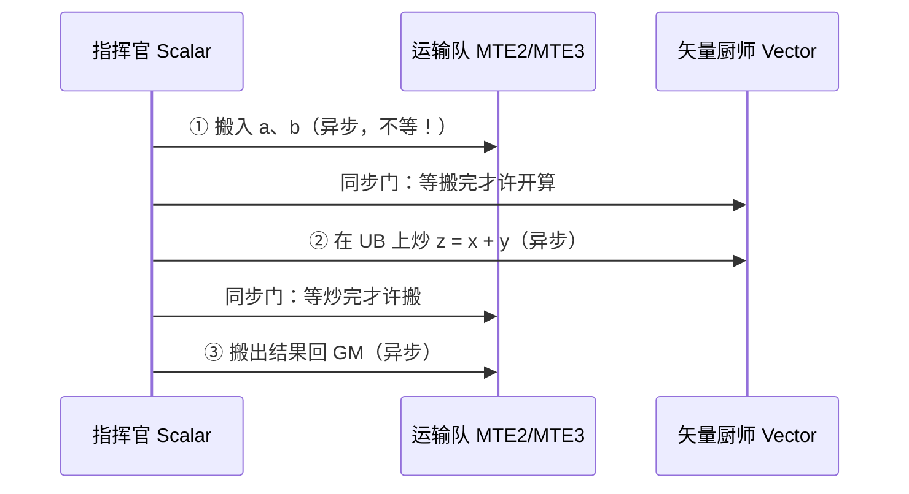
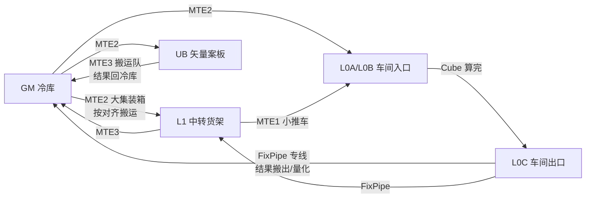
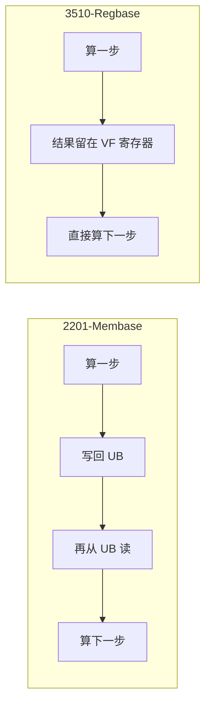
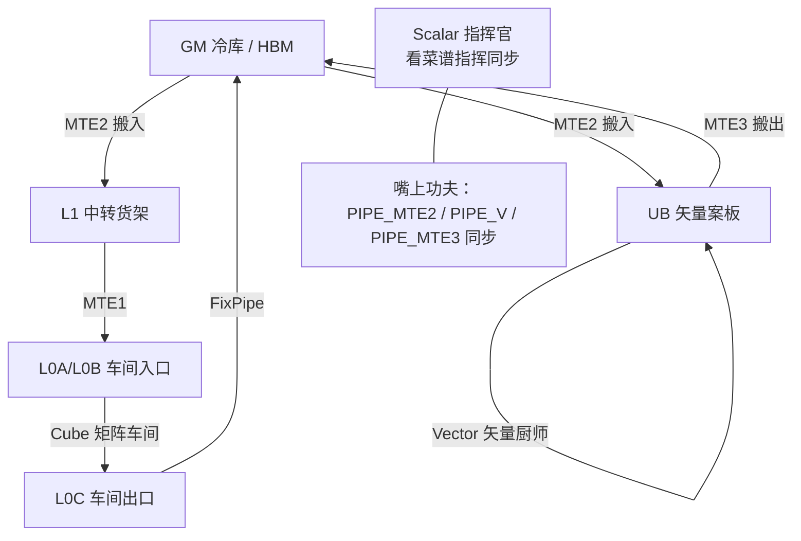

# 第2章 昇腾硬件：把「搬运-计算」模型刻进脑子

> 第1章给了你一张厨房全景图。这一章我们把这间厨房真正「装」起来：先回答一个反常识的问题——为什么瓶颈不在计算；然后把一个 Add 算子从 GM 到结果的每一段路走一遍；最后看清所有单元、所有存储、所有搬运队是怎么协同的。本章只追求一件事：**让「搬运-计算」这张路线图在你脑子里定稿**，后文所有性能优化都在这张图上做文章。

## 2.1 先破一个迷思：瓶颈在搬运，不在计算

第一次听说「AI 芯片瓶颈在搬运」的人都将信将疑。我们用手能算得过来的数字推一遍。

假设我们要算一个 `4096×4096` 的矩阵乘，输出也是 `4096×4096`。计算侧，Cube 是一次一口就把两个 `16×16` 小块乘掉的[^cube]——也就是说，**把活拆成小块喂给 Cube 很快**。搬运侧就惨了：输出就有 4096×4096 个浮点数，乘上输入，光把数据从片外的 GM 搬进片内、再把结果搬出去，就是巨大的字节数。

把两笔账摆到一起：

| 一侧 | 要处理的东西 | 性质 |
|---|---|---|
| 计算侧 | 浮点运算次数（FLOPs） | 由矩阵大小决定，Cube 吃得很猛 |
| 搬运侧 | 搬运的字节数 × 次数 | 数据要**反复**搬进搬出（搬进 L1→L0→算→L0C→搬出） |

一个关键事实：**数据在片内各层之间要来回搬很多趟**（先搬到案板、算完搬回、下一块再搬进来）。所以对大多数算子，总时间里「搬」的占比常常显著高于「算」[^nd].这不是谁拍脑袋讲的，而是昇腾硬件把计算单元设计得非常猛、把存储做了分层的结果——**计算太强，喂它数据的管子就变成了瓶颈**。

这带来昇腾编程的第一条军规：

::: tip 军规一
**做任何优化前，先问「数据在哪儿、怎么到位的」，再问「怎么算的」。** 算子慢，八成是搬运姿势不对或同步没插对地方，而不是计算本身。
:::

### 2.1.1 回到具体数字：为什么「搬」会贵

上面的论证停留在感觉。来做一个不求精确、只求量级的估算（目的在建立直觉，不是测基准）：

- 一个 `4096 × 4096` 的 fp16 矩阵乘：输入 `a`、`b` 各约 16M 元素、32MB，结果也是 32MB。
- 光「把数据从 GM 搬进片内、结果搬出」这个最小闭环，就要搬约 67MB 输入 + 32MB 结果，合计接近 100MB（还没算片内多跳与复用）。
- 对应地浮点算量约 2×4096³ ≈ 137G FLOPs。

对比没有意义吗？有——只要看一眼**数据要反复进出**这一点就够：如果每个小块都从 GM 现取现算，带宽一定先到头。这也是为什么，昇腾的算子库几乎都在做同一件事——**把数据先在片内囤起来（L1/UB），用尽量少的出入完成尽量多的计算**（第16章的全部奥义）。这个「复用好、少搬运」的直觉，就是本章要种下的种子[^nd]。

顺手把「怎么数搬运量」做成三步，以后谁都可以自己算：

1. **列数据**：这个算子的输入/输出/中间量各多大（字节 = 元素数 × 类型大小）；
2. **数趟数**：每个数据被搬几次——加/激活是「乘 1」（一次进出）；矩阵乘是「乘 N」（每个 A 元素被用 N 次，2.3.4 会算）；
3. **对带宽**：总字节 ÷ 硬件带宽，得到「搬运是唯一瓶颈时最少要多久」——再和估算的计算时间比，谁大谁就是瓶颈。

这套「搬运账」是第15章用 msprof 实测时会回来对答案的预估法，先在脑子里立个账本。

还有一种分类值得现在就种下：**计算密集（compute-bound）vs 搬运密集（memory-bound）**。像 MatMul、卷积这类 FLOPs 大的算子偏计算密集，瓶颈在 Cube 吃多快；像 Add、激活、Reshape 这类每元素只做几下运算的算子偏搬运密集，瓶颈在数据进出快不快。同一个算子在 950 上可能翻盘（算力涨得多而带宽没跟上，搬运密集的占比更大）——所以「谁是瓶颈」要按代际重新演算，不能背结论（第15章教实测）。现在先记住分类思想就好。

## 2.2 一个 Add：从 GM 到结果的一趟

第1章我们用 `aclnnAdd` 发过一次加法。现在把镜头推进 AI Core，看这盘菜具体怎么做。目标：把第1章的每一行程序，都对到一条硬件动作上。


三个动作翻译成 Ascend C 的「翻译腔」大概是：

1. **搬入（CopyIn）**：`copy_in`——MTE2 把 a、b 各搬一块到 UB。
2. **计算（compute）**：矢量计算接口在 UB 上做 `a[i] + b[i]`，结果仍放 UB。
3. **搬运（CopyOut）**：`copy_out`——MTE3 把结果搬回 GM。

对照真码，三拍子在代码里长这样（`asc-devkit/examples/01_simd_cpp_api/00_introduction/01_add/add/add.asc`，`[需真机验证]`）[^addasc]：

```cpp
AscendC::DataCopy(xLocal, xGm, blockLength);         // ① 搬入：MTE2 把 a 的一块搬上 UB 案板
AscendC::DataCopy(yLocal, yGm, blockLength);         //     b 也搬上来
AscendC::PipeBarrier<PIPE_ALL>();                    // 同步：等搬运队干完再开算
AscendC::Add(zLocal, xLocal, yLocal, blockLength);   // ② 计算：矢量厨师 z = x + y
AscendC::PipeBarrier<PIPE_ALL>();                    // 同步：等算完再端走
AscendC::DataCopy(zGm, zLocal, blockLength);         // ③ 搬出：MTE3 把结果端回 GM
```

第1章 1.4 的真码那页我们见过它一眼；这里把它当成「三拍子读法」的标准答案。留意真码里夹在中间的两处 `PipeBarrier<PIPE_ALL>`——一处是「搬完才许算」，一处是「算完才许搬」。它们就是本节开头说的「喊一嗓子」，2.4 会专门讲清楚同步为什么必须有、又有什么代价。以后看到任何 Ascend C 算子，先在脑内把它对回这三排：**搬进来 → 同步 → 算 → 同步 → 搬出去**。能找到这三排，算子大局就抓住了。

你有没有发现一件很「笨」的事？**数据先被搬进片内，算完又搬出去**。为什么不能直接在 GM 上算？因为 Vector 计算单元根本没有访问 GM 的通道——它的「工作台」就是 UB，源数据和目标数据都必须待在 UB 里[^vector]。这是硬件定死的约束，也是昇腾算子为什么满篇都是「搬进来→算→搬出去」三拍子的根本原因。

把这三拍子加上同步，就是一幅小小的时序图：



指挥官每一句都是异步下发，两个「同步门」把顺序稳住：**先搬完再算、先算完再搬**。记住这副时序图，就记住了同步的全部动机。

::: tip 一招鲜
以后你看到一个昇腾算子源码，先找它的 CopyIn / Compute / CopyOut 三处，整个算子的大局就在眼前了。这叫「三拍子读法」。
:::

## 2.3 厨房越开越大：更多单元、更多案板

一个 Add 只需要矢量厨师。可现实算子五花八门，于是厨房里慢慢长出了更多角色和更多案板。先认识全部案板，再认识各自的运输队。

### 2.3.1 案板为什么要分层：没有「中间商」的直送为何不行

读者第一反应往往是：能不能让编译单元直接读 GM 算？答案是**不能，而且也不该**。三句话讲清：

1. **硬件不允许**：Vector 没有访问 GM 的通道，它只认 UB（2.2 已提）；Cube 只认 L0A/L0B/L0C。片内计算单元被设计成「就近取食」。
2. **性能不允许**：GM 远、带宽有限、还带 Cache 一致性开销。如果每条指令都去 GM 取数，再强的 Cube 也只会饿着等菜。
3. **工程上必须**：层层缓冲给了编译器编排空间——它可以把「搬下一块」和「算上一块」重叠起来（第16章的流水线），这是性能的大头来源。
善待「中间商」吧，昇腾的性能秘密有一大半藏在 L1/L0/UB 这几位「中转站」身上。

这套分层的代价规律也顺势记住：**越小的存储越快越贵、越大越慢越便宜**——GM 大而远，UB 小而近，L1/L0 居中。昇腾的分层不是设计者的洁癖，而是「把最热的数据放在离计算最近的地方」的经典工程结构。以后看一个算子为什么慢，先想：是不是该放 L1 的却反复去 GM 拿（2.3.4 刚算过账），或是该留在寄存器的中间结果却回了 UB（2.5.1 的 Regbase）。

### 2.3.2 案板和冰箱：层层分明

| 案板 | 学名 | 谁在用 | 一句话定位 |
|---|---|---|---|
| 冰箱 | **GM / HBM** | 所有人 | 片外大容量，数据的家 |
| 中转货架 | **L1 Buffer** | Cube | 「比较大的一块数据中转区」，给矩阵车间备料，减少反复去冷库 |
| 车间进口 | **L0A / L0B** | Cube | 矩阵乘的左矩阵/右矩阵的专用入口 |
| 车间出口 | **L0C** | Cube | 矩阵乘结果与中间结果的出口 |
| 矢量案板 | **UB** | Vector / Scalar | 矢量与标量计算的输入输出，一切计算的中转站 |
| 临时编译器 | BiasTable / Fixpipe Buffer | 量化/卷积专用路径 | 附属案板 |

一句话记忆法：**GM 是冷库，L1 是给车间备料的中转货架，L0A/L0B/L0C 是车间自己的进料口跟出料口，UB 是矢量厨师的案板。**

案板边界再收紧一点：**谁的眼睛能看谁**，决定了谁能去哪取数。读一张「访问权」表[^access]：

| 谁 | 能直接访问哪块案板 | 一句话 |
|---|---|---|
| Scalar（指挥官） | GM、UB（标量读写/算地址） | 既能看冷库也能算地址 |
| Vector（Membase，2201） | 只认 UB | 矢量厨师只认自家案板 |
| Vector（Regbase，3510） | UB + 矢量寄存器 | 中间结果留寄存器免回写 |
| Cube（矩阵车间） | 只认 L0A / L0B / L0C | 车间只认自家进料口与出料口 |
| MTE（运输队） | GM、L1、L0、UB 全都可 | 唯一能满场跑的角色 |

这张表的推论很有用：**谁不能访问什么，往往决定了算子怎么写**——比如「Vector 不能碰 L0」，你就得靠运输队把矩阵结果从 L0C 搬去 UB 再做矢量处理；「Cube 不能碰 UB」，矩阵中间结果就得走 L0C/L1 中转（2.3.4 的 MatMul 路线就是这么逼出来的）。

### 2.3.3 运输队：谁能把谁搬去哪

数据不会自己长腿，每一段路都有专门的搬运队。这是一张值得背下来的「搬运队分工图」[^mte]：



四个编号和它们的活，一句话记：**MTE1 在核内把 L1 的车搬到 L0；MTE2 专管「从 GM 往片内搬」；MTE3 专管「从片内搬回 GM」；FixPipe 专管矩阵结果 L0C 的搬出与量化**。第8章会把每条路线的对齐规则（Cache Line、分形尺寸）展开，这里先把分工记住。

### 2.3.4 举一反三：矩阵菜为什么非要过 L1

回到 2.2 的 MatMul 路线，读者会问：明明 MTE2 可以直接从 GM 到 L0A/L0B，为何还要 GM→L1→MTE1→L0A/L0B 多跳？回答藏在「分形」二字里：矩阵乘要反复用同一块数据（左矩阵的列、右矩阵的行），先把它囤在 L1 中转货架就能多次复用，少去 GM 排队；直接 GM→L0 适合一次性消费、形状规整的场景。**什么时候走 L1、什么时候直送，是第16章权衡的重点**，这里记住「L1 是复用的仓库」即可[^mte]。

把「复用」算一笔账。矩阵乘 `C[M,N] = A[M,K] × B[K,N]`，一个 A 元素要跟 B 的 N 列各乘一次——**每个 A 元素会被用到 N 次**。两种做法差多少：

- **直送（GM→L0）**：每次要用 A 的一格都去 GM 现取，A 的搬运量 ≈ A 的大小 ×（它被读 N 次）；
- **过 L1（GM→L1→MTE1→L0A）**：先把 A 的一块面板囤进 L1，从 L1 反复喂给 L0A，A 的 GM 往返 ≈ A 的大小 × 1 次搬入，少了约 N 倍的 GM 流量。

省下来的正是 GM 的往返次数。L1 装不下整张 A 也没关系——一次囤一块面板（panel），用完换下一块，复用关系不变，只是块数变多。这就是「分形」的真实含义：**把大矩阵切成小面板，面板在 L1 反复使用**。至于 L0A/L0B 为什么在 L1 之外还要单独存在（它们更小、更近、是 Cube 的直接进料口），第8章把容量数字给全再细讲。

真码里再走一遭，把这些「走位」一、一对应起来（`matmul_basic_api.asc`，169 行，`[需真机验证]`）[^mmex]：

```cpp
aGM.SetGlobalBuffer((__gm__ half*)a + mIterIdx * singleCoreM * K); // 这块面板从 GM 的哪一行起
AscendC::DataCopy(aL1, aGM, size, 1);                       // ① MTE2：GM → L1（面板进中转货架）
AscendC::SetFlag<AscendC::HardEvent::MTE2_MTE1>(EVENT_ID0); // 同步：只等「MTE2 搬完」这一下
AscendC::WaitFlag<AscendC::HardEvent::MTE2_MTE1>(EVENT_ID0);//      然后才允许 MTE1 动手
AscendC::LoadData(aL0A, aL1Tensor, LoadData2DParams{...});  // ② MTE1：L1 → L0A（参数含义见第10章）
// ③ Mmad 矩阵乘在 L0A/L0B 上进行，结果落到 L0C（完整代码见 matmul_basic_api.asc）
```

这段真码把「面板起点、进 L1、L1→L0A」三件事全摆在眼前。注意同步用的是**同一流水事件的一对 `SetFlag/WaitFlag`**，而不是无差别的全量 barrier——因为这里只关心「MTE2 干完」这一个点，用事件把边界收窄，别的流水照跑。这正是 2.4 要讲的「同步粒度」课的现场预演。

### 2.3.5 还有一间「小厨房」：量化与卷积

案板表里有两个名字没细说：**BiasTable Buffer** 与 **FixPipe Buffer**。它们服务量化（加偏置、缩放）与卷积专用路径。现在只需知道：昇腾把「数据搬出顺便做类型/格式转换」也外包给了硬件（FixPipe），我们少写循环、硬件多出把力[^mte]。量化（FP8/MX 系列）会在第16章展开。

### 2.3.6 一种常见捷径：N-DMA 多维搬运

还有一个搬运队的「VIP 组」值得提前打招呼——**N-DMA（多维直接内存访问）**。普通搬运队只会「整箱搬」，而 N-DMA 可以在搬运的同时由硬件顺手完成 **Padding（填充）、转置、广播、切片** 等变形，一次调用顶过去几十行地址计算[^ndma]。但它不是到处都有：目前「完全支持」的口径是 Atlas 350 加速卡及后续产品，**A2/A3 暂不支持**——所以看到 N-DMA 用法先查产品支持表，别在 A2 上白忙活。这也再次验证第1章的提醒：**任何特性，先看能力菜单**。

为什么要折腾出 N-DMA？因为真实数据很少整整齐齐连续躺着：NCHW→NHWC 的转置、Padding 后的填充行、按 stride 切片的子块……用普通搬运要多条 `DataCopy` 加一堆地址计算，还可能把带宽浪费在不连续的空隙上。N-DMA 允许你在「下单」时一并描述变形，一次搬运把「搬 + 变形」都做完。

记住一条评判标准：**数据长得规整连续 → 普通搬运就够；数据要转置/填充/切片/广播 → 先查 N-DMA 在本平台的支持情况**，再决定使不使用。判断方法就是第1章的军规：查产品支持表。

### 2.3.7 搬运的潜规则：对齐与 Cache Line

三拍子之外，还有一个「搬运怎么搬」的潜规则：**对齐（alignment）**。搬数据不是随手搬，而是要**按格子搬**：

- **Cache Line 是 GM 侧的格子**：片外的缓存一致性，是按缓存行（Cache Line，常见 128/256/512 字节）管理的，整格搬运效率远高于零碎读取[^align]；
- **UB 是 Vector 侧的格子**：矢量读写 UB 通常要求 **32 字节对齐**，不凑整的尾数要单列处理；
- **搬运队按对齐块走**：MTE 把整块对齐数据搬进片内最高效；遇到不对齐/不满格的尾巴，要么补齐、要么拆开，都会付额外代价。

所以「搬多快」不止取决于带宽，还取决于**数据排得齐不齐、搬的块对不对格子**。这也是为什么处处强调「紧凑排布、tiling 切块尽量对齐」——等你在第8章看到完整的对齐规则表，会明白这张「格子图」支配着所有性能优化能发挥的下限。

此刻只需记住一句心法：**搬之前先问「对齐了吗」。不对齐是性能敌人，N-DMA 的填充/转置正是在帮你把数据对齐后再搬**（2.3.6 的「随路变形」，一部分就是替你凑格子）。

## 2.4 大家各干各的：异步与同步

厨房里的角色是**各干各的**：指挥官下了指令，矢量厨师、矩阵车间、运输队在自己的流水线上埋头干活，没人等别人。这就是昇腾的**异步执行**——它既是优势（并行），也是隐患（数据依赖）。

举个例子：`copy_in` 还没搬完，矢量计算就开算，就会算出垃圾。所以需要「喊一嗓子」让计算等搬运——这个动作在昇腾里叫**同步接口**（`set_flag/barrier/asc_lock` 这类）。Ascend C 里常见的流程就是「搬入→同步→计算→同步→搬出」。

在源码层面，同步是按**流水线类别**管理的：矢量搬运归 `PIPE_MTE2`，矢量计算归 `PIPE_V`，搬出归 `PIPE_MTE3`——NPU 架构版本 3510（950）还提供 `asc_lock/asc_unlock` 对某条流水线加锁做同步[^pipe]：

```cpp
// [示意代码] 三阶段各自占用/释放对应流水线，保证搬→算→搬的顺序
asc_lock(PIPE_MTE2, mutex_id);   // 占住「搬入」流水
// DataCopy GM→UB ...
asc_unlock(PIPE_MTE2, mutex_id);

asc_lock(PIPE_V, mutex_id);      // 占住「计算」流水
// Vector 计算 ...
asc_unlock(PIPE_V, mutex_id);

asc_lock(PIPE_MTE3, mutex_id);   // 占住「搬出」流水
// DataCopy UB→GM ...
asc_unlock(PIPE_MTE3, mutex_id);
```

同步接口其实有一个小家族，按「锁粒度」从粗到细：

| 接口/概念 | 锁的粒度 | 一句话 | 常用场合 |
|---|---|---|---|
| `barrier` / `set_flag` | 全流水线/信号位 | 等某条流水线干到某点 | 搬入→算→搬出的三拍子 |
| `enqueue/dequeue` | 队列深度 | 等某个队列腾出/填够 | 乒乓/环形缓冲推进 |
| `asc_lock/asc_unlock` | 指定流水线互斥 | 3510 提供的流水线级锁 | 精细同步（950） |
| DataCacheCleanAndInvalid | 存储一致性 | 让 DCache 脏行落回 GM | 跨核读共享数据 |

这里要补上「同步的代价」：每一次 `PipeBarrier` / `barrier` 都是一次**流水线气泡**——被等的流水线要整段停摆，直到信号抵达。所以同步不是免费的：**插得越密，各单元重叠得越少**；但插少了，数据依赖又会出错。高性能算子都在玩同一件事——在保证正确的前提下把同步点压到最少，用更细粒度的队列/事件（`enqueue/dequeue`）替代全量 barrier，让「算上一块」和「搬下一块」重叠起来[^pipebarrier]。这就是第16章双缓冲/流水线的伏笔，现在先立一个原则：**同步正确第一，密集第二。**

再把「从粗到细」落到三处真实源码里看一眼，记忆就立体了（三处都来自本章已见过的样例）：

| 真实现场 | 用的同步 | 粒度 | 出处 |
|---|---|---|---|
| Add 三拍子 | `PipeBarrier<PIPE_ALL>` | 全场：所有流水排空再审 | `01_add/add/add.asc`（2.2） |
| 矩阵乘 L1→L0A | `SetFlag/WaitFlag<MTE2_MTE1>` | 定点：只等「MTE2 搬完」这一件事 | `02_matrix/matmul_basic_api.asc`（2.3.4） |
| 950 流水线互斥 | `asc_lock/asc_unlock` | 单流水：占住 PIPE 才动 | `memory_vector_computation.md`（2.4 开头） |

同一组同步，量级从「全场歇菜」到「只盯一件事」。工程直觉：**能用定点（事件）就别用全场（barrier）**——先保证正确，再把同步从全场收紧到定点（第16章做流水线重叠时，这正是省时间的大头）。

::: tip 军规二
**先跑通再优化异步。** 新手最常见的「神秘错乱」，都是同步没插对。先按最保守的方式把功能跑通，再想哪里能省。第16章才教你怎么在保证正确的前提下把各单元重叠起来。
:::

## 2.5 三个世界再访：2201 → 3510

第1章说过 950 是「新世界」。现在我们有了足够的语言，可以说清楚差异的方向了。

### 2.5.1 案板 vs 寄存器：Membase 与 Regbase

A2/A3 时代（2201），矢量计算**每一小步结果都写回 UB**——我们一直把 UB 当唯一案板，这个模式叫 **Membase**。而 950（3510）引入了 **Regbase**：中间结果可以留在矢量寄存器里，减少对 UB 的读写[^mb]。



差别很小，收益很大：少几次 UB 读写，就少几次排队。这就是 `regbase_vec_add` 这类 950 样例的硬件基础[^rb]。

再用代码看一眼差别，省得只在嘴上。Membase 的 Add 是「UB 案板上直接做」（第1章 1.4 那排真码就是这样）；Regbase 的写法多出「搬进行」——先把数据 Load 进矢量寄存器，算完再 Store 回 UB[^regcode]：

```cpp
// Membase：全部在 UB 上做（2201）
AscendC::Add(zLocal, xLocal, yLocal, blockLength);

// Regbase（3510）：Load 进 VF 寄存器 → 在寄存器里算 → Store 回 UB
AscendC::Reg::RegTensor<float> srcReg, dstReg;
AscendC::Reg::LoadAlign(srcReg, dstAddr + i * inner + j * oneRepeatSize);                     // 搬进寄存器
AscendC::Reg::Add(dstReg, dstReg, srcReg, mask);                                             // 在寄存器里做加法
AscendC::Reg::StoreAlign(dstAddr + (i + 1) * inner + j * oneRepeatSize, dstReg, mask);       // 存回 UB
```

差别不在「能不能算」，而在**中间结果放哪**：Membase 每小步都回写 UB，Regbase 把结果留在寄存器，少几次 UB 排队。看懂这组对照，你就明白为什么 950 某些向量算子能再快一档——也明白第1章那句「能编译 ≠ 最优」具体指什么。

### 2.5.2 别忘了能力菜单思维

结合第1章，把 950 值得提前注册的新名字整理成一张「能力菜单」——它直接来自官方 950 新增特性总览（原文 13 项，每项还带对应 API 与算子实践链接）[^featmenu]：

| 特性 | 一句话 | 资料成熟度 | 在哪展开 |
|---|---|---|---|
| **RegBase 架构** | 矢量计算从「算式回写 UB」切到「中间结果留在寄存器」，少一次 UB 读写 | 成熟 | 第11章 |
| **SIMT 编程模型** | 新增 DCache / Warp Scheduler / 寄存器堆，支持线程级并行 | 成熟 | 第11章 |
| **SIMD+SIMT 混合** | 同一 kernel 里两组代码协同，兼得吞吐与灵活 | 成熟 | 第11章 |
| **ND-DMA 多维搬运** | 搬运同时做填充/转置/广播/切片 | 成熟 | 第8、16章 |
| **HiF8 / MX 数据类型** | Cube 新增 HiF8、MXFP4/8 低比特矩阵运算（配套 `loadmx/mmad_mx`） | 部分「资料开发中」 | 第11、16章 |
| **UB→L1、L0C→UB 直通** | 3510 新增片内直通，省去绕 GM 中转 | 已提供 API | 第8、16章 |
| **SSBuffer 核间存储** | 新增核内存储，AIC/AIV 可经 Scalar 共享访问 | 资料开发中 | 第11章 |
| **Mutex / CrossCore 同步** | 核内流水锁、核间 flag 同步（`asc_lock` 一族） | 部分成熟 | 第10、11章 |
| **UB bank 结构调整** | 16 bank group → 8 bank group，bank 变宽 | 有避撞指南 | 第16章 |
| **Fixpipe 随路转换** | L0C→GM 时随路完成 NZ→DN 格式转换 | 成熟 | 第16章 |
| **SHMEM（核间共享内存）** | 核与核共享一片内存，少一层往来 | 部分 | 第11、18章 |
| **URMA（统一远程内存访问）** | 让「算的核」自己发起跨卡读写 | 部分 | 第18章 |

这张表的价值不在背诵，而在**知道该去查什么**：迁移算子到 950 前，打开 `asc_950_feature_guide` 逐行核对你要用的特性是否影响实现（例如"资料开发中"的条目要另寻途径）。记住判断纲领：**凡是你看到「仅 3510」的特性，背后几乎都有一个性能/通信动机；「能编译」≠「最优」**[^feat]。

把「能力菜单思维」落成一张迁移核对单，迁移一个算子到 950 时逐条勾：

1. **查支持表**：目标算子在该代际打了 √ 没有（第1章军规零）；
2. **开能力菜单**：`asc_950_feature_guide` 总览里，本条算子涉及的维度有没有 3510 变更；
3. **对变更表**：`2201_to_3510_arch_changes` 的搬运/计算/存储三张表，逐条看你用到的通路/指令在 3510 是否被删除或新增（例如 **GM→L0A 直通被删**、**UB→L1 直通新增**——同一段算子代码，在 2201 与 3510 上的搬运走位可能完全不同）[^mig]；
4. **改搬运与同步**：把受影响的通路重排成合法规的两步（如 GM→L1→L0A），同步事件随通路调整；
5. **回测**：np 层结果一致 + msprof 再看一眼三笔账，确认「能编译」真的等于「最优」。

这套五步不是昇腾官方流程，是本书从 `asc_950_feature_guide` + 架构变更文档提炼的迁移方法论——但每一步都能在文档里查到对应物，够你当模板用。

## 陷阱与注意（汇总）

把这一章容易踩的坑集中放一起，标上「症状 → 对策」：

| 坑 | 症状 | 对策 |
|---|---|---|
| 拿 GM 当案板直接算 | 编译不过 / 性能极差 | 三拍子，先搬后算（2.2） |
| 三拍子之间漏同步 | 结果偶发不对、加打印就对 | 忠实「搬→同步→算→同步→搬」（2.2/2.4） |
| 把同步当万能药到处插 | 功能对但明显慢 | 细粒度 enqueue/dequeue 替代全量 barrier（2.4） |
| blockDim 乱填 | 大时有尾巴块、小时喂不满核 | 入门按核数均分，第15章教调（1.4.3） |
| 不查能力菜单就上 950 特性 | 在 A2 上行为诡异 | 任何「仅 3510」特性先查支持表（2.5、军规零） |
| 不数搬运账就优化 | 优化方向经常反 | 先「列数据→数趟数→对带宽」估一遍（2.1.1） |

## 本章小结

::: tip 一句话总结
**AI Core 是「一个 Scalar 指挥官 + Vector/Cube 两组厨师 + MTE 运输队 + 分层案板（GM→L1→UB→寄存器）」；所有算子都是「搬进→算→搬出」三拍子；瓶颈在搬运不在计算，同步管住的是「各干各的」单元的先后。** 950 的新世界，本质是在这条流水线上继续加「更快更聪明的搬运和更近的案板」。
:::

把本章打包成一张能背的总图（拿走不谢）：



### 常见疑问三连（先给自己打预防针）

- **Q：L1 和 UB 哪个大、哪个快？** A：一般 L1 偏大（给 Cube 备料）、UB 偏小但面向 Vector 高频读写，容量随代际/规格而变，本书不背书面上限。记职能即可，真需要时以规格书为准（第8章给查法）。
- **Q：blockDim 是不是越大越好？** A：绝不是。块太多会有尾巴块、负载不均，块太少喂不满多核。怎么定是第15章的性能课，入门先「按核数均匀切」。
- **Q：三拍子读法对矩阵算子（走 Cube 的）也适用吗？** A：适用，只是「案板」更多：矩阵菜是「搬进 L1 → 搬到 L0A/L0B → Cube 算 → L0C 出 → 搬回 GM」——本质还是「搬进→算→搬出」，只是把「算」换成 Cube，中间多几个中转站（容量与尺寸第8章给全）。所以三拍子读法对全类算子都成立，每拍内部的细节不同而已。

## 本章来源与进一步阅读

[^cube]: Cube 一次执行两个 float16 的 16×16 乘法、L0A/L0B/L0C 职责：`asc-devkit/docs/zh/guide/programming_guide/advanced_programming/hardware_implementation/basic_architecture.md`。
[^nd]: 「搬运与计算」「L2/L1/UB 缺省缓存」等结构性事实：同上 `basic_architecture.md` 的存储/搬运单元小节；L2 Cache Line（128/256/512B）与 Scalar 的 ICache/DCache 见同文档与 `technical_appendix/concepts_and_terms/memory_access/scalar_read_write.md`。
[^vector]: Vector 源/目标必须在 UB、通常 32B 对齐：`basic_architecture.md`。
[^mte]: MTE1（L1→L0A/L0B、L1→BT）、MTE2（GM→L1/L0、GM→UB）、MTE3（UB/L1→GM）、FixPipe（L0C→GM/L1）完整分工表：`basic_architecture.md` 搬运单元小节。
[^pipe]: 三阶段流水线命名与 `asc_lock/asc_unlock`：`asc-devkit/docs/zh/guide/programming_guide/programming_model/ai_core_simd_programming/c_pointer_programming/memory_vector_computation.md`。
[^addasc]: Add 三拍子真码（`DataCopy`/`Add`/`PipeBarrier<PIPE_ALL>`）与 `LocalMemAllocator` 用法：`asc-devkit/examples/01_simd_cpp_api/00_introduction/01_add/add/add.asc`。
[^mmex]: 矩阵乘最小样例（GM→L1 的 DataCopy / `SetFlag<MTE2_MTE1>` / `LoadData` L1→L0A / Mmad 到 L0C）：`asc-devkit/examples/01_simd_cpp_api/00_introduction/02_matrix/matmul_basic_api/matmul_basic_api.asc`。
[^pipebarrier]: 同步代价（PipeBarrier 等待被等流水线排空 → 气泡）与队列级同步（enqueue/dequeue）替代 barrier 的做法：`asc-devkit/docs/zh/guide/programming_guide/programming_model/ai_core_simd_programming/c_pointer_programming/memory_vector_computation.md`、`asc-devkit/docs/zh/guide/programming_guide/programming_model/ai_core_simd_programming/abstract_hardware_architecture.md`。
[^featmenu]: 950 新增特性 13 项总览（每项带 API/算子实践链接、部分"资料开发中"标注）：`asc-devkit/docs/zh/asc_950_feature_guide.md`。
[^mb]: Membase（2201，结果写回 UB）vs Regbase（3510，结果留 VF 寄存器）：`abstract_hardware_architecture.md` 末尾表格。
[^rb]: regbase 实操与收益：`cann-learning-hub/blogs/operator/regbase_vec_add/`。
[^regcode]: Regbase 代码形态（Load / Reg::Add / Store / mask）与四步曲（CreateMask→Load→Compute→Store）：`cann-learning-hub/blogs/operator/regbase_vec_add/从一个向量加法出发，深入理解Regbase编程范式.md`；API 见 `asc-devkit/docs/zh/api/SIMD-API/basic_api/reg_vector_compute/`。
[^access]: 各计算单元/搬运单元对存储的访问权限（谁可访问 GM/L1/L0/UB）：`asc-devkit/docs/zh/guide/programming_guide/programming_model/ai_core_simd_programming/abstract_hardware_architecture.md`、`asc-devkit/docs/zh/guide/programming_guide/advanced_programming/hardware_implementation/basic_architecture.md`。
[^ndma]: N-DMA 多维搬运、6 维、产品支持（Atlas 350 及后续全支持/A3/A2 暂不支持）、3~5 倍收益口径：`cann-learning-hub/blogs/operator/nddma_introduction/`。
[^align]: Cache Line（128/256/512 字节）与 Scalar 的 ICache/DCache；Vector 读取 UB 通常 32B 对齐：`asc-devkit/docs/zh/guide/programming_guide/advanced_programming/hardware_implementation/basic_architecture.md`、`asc-devkit/docs/zh/guide/technical_appendix/concepts_and_terms/memory_access/scalar_read_write.md`。
[^mig]: 3510 相对 2201 的搬运/计算/存储三张变更表（GM→L0A 直通删除、UB→L1 直通新增、L0C→UB 单向通路、Regbase 切换等）：`asc-devkit/docs/zh/guide/cross_gen_migration_guide/3510_arch_migration/2201_to_3510_arch_changes.md`。
[^feat]: 950/3510 全部新特性导航与样例链接：`asc-devkit/docs/zh/asc_950_feature_guide.md`。
- 继续读：第8章内存与数据通路、第11章 SIMD/SIMT 与高级特性、第16章优化专题；PTO 视角的机器模型（`pto-isa/docs/machine/abstract-machine_zh.md`）留给第20章对照。
