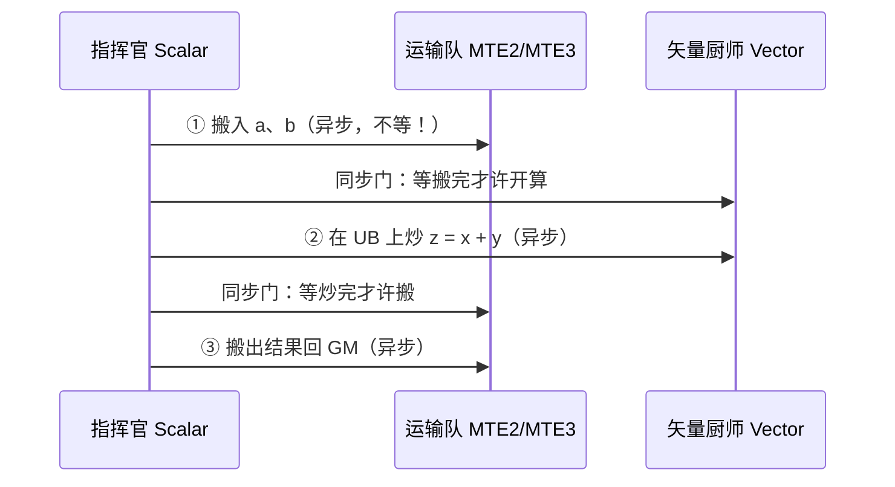
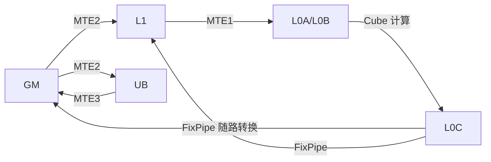
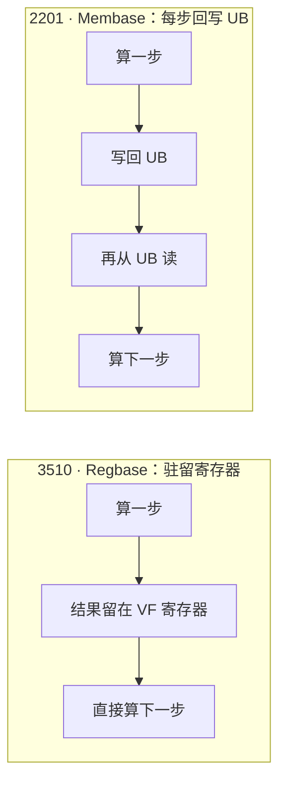
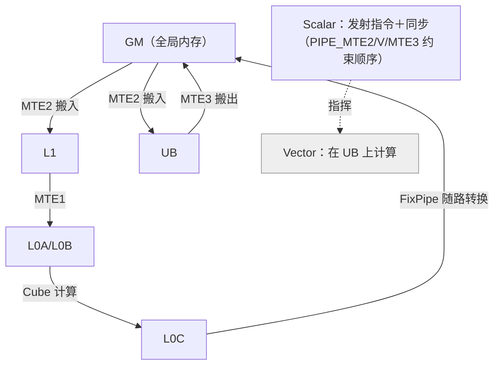

# 第2章 昇腾硬件：把「搬运-计算」模型刻进脑子

> 第1章给了你一张厨房全景图。这一章我们把这间厨房真正「装」起来：先回答一个反常识的问题——为什么瓶颈常常不在计算；然后把一个 Add 算子从 GM 到结果的每一段路走一遍；最后看清所有单元、所有存储、所有搬运队是怎么协同的。本章只追求一件事：**让「搬运-计算」这张路线图在你脑子里定稿**，后文所有性能优化都在这张图上做文章。

## 2.1 先破一个迷思：瓶颈常常在「搬运」

第一次听说「AI 芯片瓶颈在搬运」的人都将信将疑。我们用手能算得过来的数字推一遍。

假设我们要算一个 `4096×4096` 的矩阵乘，输出也是 `4096×4096`。计算侧，以 float16 为例，Cube 一次可完成两个 `16×16` 小块的乘法[^cube]（**精度/规格随代际与数据类型变化，见第16章**）——也就是说，**把活拆成小块喂给 Cube 很快**。搬运侧就惨了：输出就有 4096×4096 个浮点数，乘上输入，光把数据从片外的 GM 搬进片内、再把结果搬出去，就是巨大的字节数。

把两笔账摆到一起：

| 一侧 | 要处理的东西 | 性质 |
|---|---|---|
| 计算侧 | 浮点运算次数（FLOPs） | 由矩阵大小决定，Cube 吃得很猛 |
| 搬运侧 | 搬运的字节数 × 次数 | 数据要**反复**搬进搬出（搬进 L1→L0→算→L0C→搬出） |

一个关键事实：**数据在片内各层之间要来回搬很多趟**（先搬到案板、算完搬回、下一块再搬进来）。许多算子的总时间里「搬」的占比显著高于「算」——**是否如此，取决于算子的算术强度（FLOPs/字节）与本代「算力/带宽」配比**，判据见 2.1.1，结论须按代际与 shape 复算[^nd]。其根源是昇腾把计算单元做得强、把存储做了分层：计算相对强而搬运管子有限时，喂数据的搬运就会成为瓶颈。

这带来昇腾编程的第一条军规：

::: tip 军规一
**做任何优化前，先问「数据在哪儿、怎么到位的」，再问「怎么算的」。** 算子慢，先查搬运姿势与同步，再看计算——两类原因都常见，何者为主由算子与实现决定（判据见 2.1.1）。
:::

### 2.1.1 回到具体数字：为什么「搬」会贵

上面的论证停留在感觉。来做一个不求精确、只求量级的估算（目的在建立直觉，不是测基准）：

- 一个 `4096 × 4096` 的 fp16 矩阵乘：输入 `a`、`b` 各约 16.7M 元素，按 fp16 计各约 **33.5MB（≈32MiB；本节估算统一按十进制 1 MB = 10⁶ 字节）**，结果亦同量级（同样按 fp16）。
- 光「把数据从 GM 搬进片内、结果搬出」这个最小闭环，就要搬约 67MB 输入 + 33.5MB 结果，合计约 100MB（还没算片内多跳与复用）。
- 对应地浮点算量约 2×4096³ ≈ 137G FLOPs。

对比没有意义吗？有——只要看一眼**数据要反复进出**这一点就够：若无片内复用、每块现取现算，带宽先于算力到头的风险显著升高；是否真到头，按下面三步与实测判定。这也是为什么，昇腾的算子库几乎都在做同一件事——**把数据先在片内囤起来（L1/UB），用尽量少的出入完成尽量多的计算**（第20章的全部奥义）。这个「复用好、少搬运」的直觉，就是本章要种下的种子[^nd]。

顺手把「怎么数搬运量」做成三步，以后谁都可以自己算：

1. **列数据**：这个算子的输入/输出/中间量各多大（字节 = 元素数 × 类型大小）；
2. **数趟数**：每个数据被搬几次——加/激活是「乘 1」（一次进出）；矩阵乘**复用潜力大**：数学上每个 A 元素参与 N 次乘法，但 GM 实际读次数由 tile 复用/L2/分块与循环次序决定，**不等于 N**（2.3.4 已析）；
3. **对带宽**：总字节 ÷ 硬件带宽，得「搬运侧理想下界」；与计算侧理想下界（FLOPs ÷ 峰值算力）**仅用于提示可能的瓶颈侧**——实际还须经测量，并计入同步开销与单元利用率，两下界都不是实测。

这套「搬运账」是第19章用 msprof 实测时会回来对答案的预估法，先在脑子里立个账本。

还有一种分类值得现在就种下：**计算密集（compute-bound）vs 搬运密集（memory-bound）**。像 MatMul、卷积这类 FLOPs 大的算子偏计算密集，瓶颈在 Cube 吃多快；像 Add、激活、Reshape 这类每元素只做几下运算的算子偏搬运密集，瓶颈在数据进出快不快。同一算子的瓶颈侧会随代际的「算力/带宽配比」变化——所以「谁是瓶颈」要按代际重新演算，不能背结论（第19章教实测）。现在先记住分类思想就好。

## 2.2 一个 Add：从 GM 到结果的一趟

第1章我们用 `aclnnAdd` 发过一次加法。现在把镜头推进 AI Core，看这盘菜具体怎么做。目标：把第1章的每一行程序，都对到一条硬件动作上。

三个动作，Ascend C 的结构对应关系是：

1. **搬入（CopyIn）**：`copy_in`——MTE2 把 a、b 各搬一块到 UB。
2. **计算（compute）**：矢量计算接口在 UB 上做 `a[i] + b[i]`，结果仍放 UB。
3. **搬运（CopyOut）**：`copy_out`——MTE3 把结果搬回 GM。

对照真码，三拍子在代码里长这样（`asc-devkit/examples/01_simd_cpp_api/00_introduction/01_add/add/add.asc`，`[需真机验证]`）[^addasc]：

```cpp
AscendC::DataCopy(xLocal, xGm, blockLength);         // ① 搬入：MTE2 把 a 的一块搬上 UB 案板
AscendC::DataCopy(yLocal, yGm, blockLength);         //     b 也搬上来
AscendC::PipeBarrier<PIPE_ALL>();                    // 同步：等搬运队干完再开算
AscendC::Add(zLocal, xLocal, yLocal, blockLength);   // ② 计算：矢量厨师 z = x + y
AscendC::PipeBarrier<PIPE_ALL>();                    // 同步：等算完再端走
AscendC::DataCopy(zGm, zLocal, blockLength);         // ③ 搬出：MTE3 把结果端回 GM
```

第1章 1.4 的真码那页我们见过它一眼；这里把它当成「三拍子读法」的标准答案。留意真码里夹在中间的两处 `PipeBarrier<PIPE_ALL>`——一处是「搬完才许算」，一处是「算完才许搬」。它们就是本节开头说的「喊一嗓子」，2.4 会专门讲清楚同步为什么必须有、又有什么代价。以后看到任何 Ascend C 算子，先在脑内把它对回这三排：**搬进来 → 同步 → 算 → 同步 → 搬出去**。能找到这三排，算子大局就抓住了。

你有没有发现一件很「笨」的事？**数据先被搬进片内，算完又搬出去**。为什么不能直接在 GM 上算？因为在 2201 代规格里，Vector 计算的数据来自 UB 且有对齐要求[^vector]——它的「工作台」就是 UB，源数据和目标数据都必须待在 UB 里。这是 Membase 范式下的硬件约束，也是昇腾算子满篇「搬进来→算→搬出去」的根本原因；**3510 RegBase 范式下中间结果可驻留寄存器（数据仍经 UB 载入）**，边界见 2.5.1 与第11章，SIMT 线程访存走另一套 DCache 通路（第11章）——不要把本节结论外推到所有范式。

把这三拍子加上同步，就是一幅小小的时序图（**概念时序，表达同步动机；非指令 trace**）：


```mermaid
sequenceDiagram
    participant S as 指挥官 Scalar
    participant T as 运输队 MTE2/MTE3
    participant V as 矢量厨师 Vector
    S->>T: ① 搬入 a、b（异步，不等！）
    S->>V: 同步门：等搬完才许开算
    S->>V: ② 在 UB 上炒 z = x + y（异步）
    S->>T: 同步门：等炒完才许搬
    S->>T: ③ 搬出结果回 GM（异步）
```

指挥官每一句都是异步下发，两个「同步门」把顺序稳住：**先搬完再算、先算完再搬**。记住这副时序图，就记住了同步的全部动机。

::: tip 一招鲜
以后你看到一个昇腾算子源码，先找它的 CopyIn / Compute / CopyOut 三处，整个算子的大局就在眼前了。这叫「三拍子读法」。
:::

## 2.3 厨房越开越大：更多单元、更多案板

一个 Add 只需要矢量厨师。可现实算子五花八门，于是厨房里慢慢长出了更多角色和更多案板。先认识全部案板，再认识各自的运输队。

### 2.3.1 案板为什么要分层：没有「中间商」的直送为何不行

读者第一反应往往是：能不能让编译单元直接读 GM 算？答案是**不能，而且也不该**。三句话讲清：

1. **范式约束**：Membase（2201）下 Vector 的源/目标必须在 UB、无 GM 直连数据通路（2.2；3510 Regbase 与 SIMT DCache 通路另见 2.5.1/2.3.2）；Cube 的操作数/结果缓冲只认 L0A/L0B/L0C。片内计算单元被设计成「就近取食」。
2. **性能不允许**：GM 远、带宽有限、还带 Cache 一致性开销。如果每条指令都去 GM 取数，再强的 Cube 也只会饿着等菜。
3. **工程上必须**：层层缓冲给了编译器编排空间——它可以把「搬下一块」和「算上一块」重叠起来（第20章的流水线），这是性能的大头来源。
善待「中间商」吧，昇腾的性能秘密有一大半藏在 L1/L0/UB 这几位「中转站」身上。

这套分层的代价规律也顺势记住：**越小的存储越快越贵、越大越慢越便宜**——GM 大而远，UB 小而近，L1/L0 居中。昇腾的分层不是设计者的洁癖，而是「把最热的数据放在离计算最近的地方」的经典工程结构。以后看一个算子为什么慢，先想：是不是该放 L1 的却反复去 GM 拿（2.3.4 刚算过账），或是该留在寄存器的中间结果却回了 UB（2.5.1 的 Regbase）。

### 2.3.2 案板和冰箱：层层分明

**一张表说完**——案板、定位与访问权（依据 [^access]；**访问权按「范式×代际」理解，勿跨代外推**）：

| 案板 | 学名与定位 | 谁在用 | 访问权要点 |
|---|---|---|---|
| 冰箱 | **GM**：全局内存地址空间，片外大容量数据的家；板载常由 HBM 承载（容量/带宽以代际规格为准，两者勿等同） | 数据的家 | Scalar 直接读写（数据经 DCache 缓存、指令经 ICache）；SIMT（3510）经 SIMT DCache 访 GM；计算单元批量进出走 MTE |
| 中转货架 | **L1 Buffer**：较大中转区，为矩阵车间备料并承载复用（2.3.4） | Cube 备料 | MTE1/MTE2、FixPipe 可达（两代均然） |
| 车间进出口 | **L0A / L0B / L0C**：Cube 专用操作数与结果缓冲 | Cube | 仅 Cube 计算直接使用；进出经 MTE1／FixPipe |
| 矢量案板 | **UB**：矢量/标量计算的工作台 | Vector / Scalar | Membase（2201）：Vector 源/目标必须在 UB（32B 口径见 [^vector]）；Regbase（3510）：中间结果可驻留矢量寄存器（数据仍经 UB 载入）；SIMT DCache 以 UB 为 cache line（3510） |
| 附属案板 | **BiasTable / Fixpipe Buffer**：量化/卷积专用路径 | 量化/卷积 | FixPipe 随路转换的目的地之一 |
| 运输队 | MTE1/MTE2/MTE3/FixPipe：分工见 2.3.3 | —— | **按编号分工，合并覆盖各案板不代表任一单元全通**（如 MTE1 无 GM 直连通路） |

这张表的推论很有用：**谁不能访问什么，往往决定了算子怎么写**——Vector 不直接碰 L0，矩阵结果就得由运输队从 L0C 搬去 UB 再做矢量处理；Cube 不吃 UB，中间结果经 L0C 由 FixPipe 走 L1/GM——3510 另有 L0C→UB 直通（2.3.3 差异表）；2.3.4 的 MatMul 路线由此而来。

### 2.3.3 运输队：谁能把谁搬去哪

数据不会自己长腿，每一段路都有专门的搬运队。下图**只画两代证据齐备的公共通路**（每一边的证据见下表；`basic_architecture.md` 总表未标代际，不当任一代完整通路用）[^mte]：


```mermaid
flowchart LR
    GM["GM"] -->|"MTE2"| L1["L1"]
    GM -->|"MTE2"| UB["UB"]
    L1 -->|"MTE1"| L0["L0A/L0B"]
    L0 -->|"Cube 计算"| L0C["L0C"]
    L0C -->|"FixPipe 随路转换"| GM
    L0C -->|"FixPipe"| L1
    UB -->|"MTE3"| GM
```

**两代差异表**（逐边证据）：

| 通路 | 2201 | 3510 | 证据 |
|---|---|---|---|
| MTE2 直送 GM→L0A/L0B | 有（总表；迁移表「原GM到L0A/B的搬运」反证） | **删**（迁移表） | `2201_to_3510_arch_changes.md` |
| MTE3 L1→GM | 有（总表） | **删**（迁移表「删除L1到GM通路」） | 同上 |
| UB→L1 | 规格带宽表未列 | **新增，PIPE_MTE3**（迁移表「UB到L1通路」＋3510 规格表） | 两源 |
| L1→UB | 规格带宽表未列 | 有，PIPE_MTE1（3510 规格带宽表；**迁移未标「新增」，不称新增**） | `npu_arch_3510.md` L133 |
| L0C→UB | 规格带宽表未列 | **新增，PIPE_FIX**（迁移表「新增L0C到UB单向通路」） | 两源 |
| L0C→L1 | 有：总表 FixPipe L0C→{GM,L1}；**2201 正面支持**——`DataCopy_L0CToL1.md` 图1明示「L0C2L1流程图（NPU架构版本2201）」 | 有，PIPE_FIX（3510 规格带宽表）——**非新增** | 两代 |

一句话记分工：**MTE1 核内 L1→L0；MTE2 从 GM 搬入；MTE3 向 GM 搬出；FixPipe 管 L0C 出口并随路转换**。各代通路的增删以迁移表与对应代架构规格为准（3510 差异见 2.5.2 核对单）；第8章展开对齐规则。

### 2.3.4 举一反三：矩阵菜为什么非要过 L1

回到 2.2 的 MatMul 路线，读者会问：2201 上 MTE2 明明可以直接 GM→L0A/L0B（2.3.3 差异表），为何还要 GM→L1→MTE1→L0A/L0B 多跳？**（3510 已无直送，此问只在 2201 成立；下文按 2201 讨论。）**回答在「复用」二字：矩阵乘要反复使用同一块数据（左矩阵的列、右矩阵的行），L1 让这类跨 tile 复用不必反复回 GM（下有受限例）；直接 GM→L0 是否合适，还要结合 tile 内复用、容量和循环安排判断。**什么时候走 L1、什么时候直送，是第20章权衡的重点**，这里记住「L1 是复用的仓库」即可[^mte]。

先把两件事分开：**数学上被用多少次 ≠ 从 GM 读多少次**。矩阵乘 `C[M,N]=A[M,K]×B[K,N]` 里每个 A 元素参与 N 次乘法，但它被从 GM 读几次，取决于 L0 tile 内复用、L2 缓存、M/N/K 分块与循环顺序——**不存在「直送必读 N 次」的普遍结论**。看一个把假设摆明的受限例子：

> 设 N 切成 `t` 块、每块 `Nb=N/t`；A 的一个行面板（`M_panel × K`）已驻留 **L1**，且跨 L0 tile 不再回 GM 重取（假设①：面板驻留层=L1、无跨 tile 淘汰）；B 的对应列块从 GM 现取。则 A 的 GM 流量 ≈ `A 大小 × 1 次搬入`；这里只统计 GM 地址空间的逻辑读请求，不推算 HBM 实际流量或运行时间。若同样的 A 面板不在 L1/L0 跨块保留、每个 N 块都重新发起搬入，则 ≈ `A 大小 × t`。**该例省的倍数 = t（N 的分块数），是假设的产物，不是普遍收益**——真实收益由分层与循环编排决定（第20章）。

L1 的价值可以这样表述：**它让「跨多个 L0 tile 的复用」成为可能**——在本例的容量假设下，L0 放当前 tile，L1 保留可复用面板；能否省 GM 流量，取决于复用是否真的发生。L1 装不下整张 A 就一次囤一块面板（panel），用完换下一块。

**「分形」是另一件事，别和上面的复用策略混同**：分形（Fractal）指 `FRACTAL_ZZ/ZN/NZ` 这类**块状数据排布格式**——把矩阵切成小分形块（如 16×16，随精度与位置变化），适配 Cube 一次读 `(16,16)×(16,16)` 的硬件特点；2201 规格对 L0A/L0B/L0C 分别推荐 ZZ/ZN/NZ，L1 推荐 NZ（搬入 L0 时再转 ZZ/ZN 以降低转换开销）[^fractal]。**格式（分形）与调度（tile/复用）是两个概念**：前者约束数据长什么样，后者决定数据何时在哪。至于 L0A/L0B 为何在 L1 之外单独存在（更小、更近、Cube 直接进料口），第8章把容量数字给全再细讲。

源码里再走一遭（**节选自 `matmul_basic_api.asc`（169 行，2201 分支），参数与原样例一致，`[需真机验证]`，本书未运行**）[^mmex]：

```cpp
aGM.SetGlobalBuffer((__gm__ half*)a + mIterIdx * singleCoreM * K); // 本核面板从 GM 的哪一行起
AscendC::DataCopy(a1Local, aGM, AscendC::Nd2NzParams{1, baseM, baseK, 0, K, baseM, 1, 0});
                       // ① MTE2：GM → L1，ND→NZ 随路重排（原样例实参）
AscendC::SetFlag<AscendC::HardEvent::MTE2_MTE1>(EVENT_ID0); // 同步：只等「MTE2 搬完」这一下
AscendC::WaitFlag<AscendC::HardEvent::MTE2_MTE1>(EVENT_ID0);//      然后才允许 MTE1 动手
AscendC::LoadData(a2Local[i * baseK * CUBE_BLOCK], a1Local[i * 512 / sizeof(half)],
                  AscendC::LoadData2DParams{0, baseK / CUBE_BLOCK, baseM / CUBE_BLOCK, 0, 0, false, 0});
                       // ② MTE1：L1 → L0A（NZ→ZZ，分形对齐；参数含义第10章）
// ③ Mmad 在 L0A/L0B 上进行，结果落 L0C（完整代码见原样例；该段在 #if __NPU_ARCH__ == 2201 分支内）
```

这段真码把「面板起点、进 L1、L1→L0A」三件事全摆在眼前。注意同步用的是**同一流水事件的一对 `SetFlag/WaitFlag`**，而不是无差别的全量 barrier——因为这里只关心「MTE2 干完」这一个点，用事件把边界收窄，别的流水照跑。这正是 2.4 要讲的「同步粒度」课的现场预演。

### 2.3.5 还有一间「小厨房」：量化与卷积

案板表里有两个名字没细说：**BiasTable Buffer** 与 **FixPipe Buffer**。它们服务量化（加偏置、缩放）与卷积专用路径。现在只需知道：昇腾把「数据搬出顺便做类型/格式转换」也外包给了硬件（FixPipe），我们少写循环、硬件多出把力[^mte]。量化（FP8/MX 系列）会在第20章展开。

### 2.3.6 一种常见捷径：ND-DMA 多维搬运

还有一个搬运队的「VIP 组」值得提前打招呼——**ND-DMA（多维直接内存访问）**。普通搬运队只会「整箱搬」，而 ND-DMA 可以在搬运的同时由硬件顺手完成 **Padding（填充）、转置、广播、切片** 等变形，一次调用顶过去几十行地址计算[^ndma]。但它不是到处都有：目前「完全支持」的口径是 Atlas 350 加速卡及后续产品，**A2/A3 暂不支持**——所以看到 ND-DMA 用法先查产品支持表，别在 A2 上白忙活。这也再次验证第1章的提醒：**任何特性，先看能力菜单**。

为什么要折腾出 ND-DMA？因为真实数据很少整整齐齐连续躺着：NCHW→NHWC 的转置、Padding 后的填充行、按 stride 切片的子块……用普通搬运要多条 `DataCopy` 加一堆地址计算，还可能把带宽浪费在不连续的空隙上。ND-DMA 允许你在「下单」时一并描述变形，一次搬运把「搬 + 变形」都做完。

记住一条评判标准：**数据长得规整连续 → 普通搬运就够；数据要转置/填充/切片/广播 → 先查 ND-DMA 在本平台的支持情况**，再决定使不使用。判断方法就是第1章的军规：查产品支持表。

### 2.3.7 搬运的潜规则：对齐与 Cache Line

三拍子之外，还有一个「搬运怎么搬」的潜规则：**对齐（alignment）**。搬数据不是随手搬，而是要**按格子搬**：

- **L2 按缓存行加载**：经 L2 访问 GM 的数据以 Cache Line 为单位加载（128/256/512 字节等，随硬件规格），这是 **L2 的加载粒度**，不要误读成「片外一致性粒度」；整行利用的效率远高于零碎读取[^align]。另注意 Scalar 侧 DCache 的 line 为 64B，是另一套更细的粒度（见 [^nd]）；
- **UB 是 Vector 侧的格子**：矢量读写 UB 通常要求 **32 字节对齐**，不凑整的尾数要单列处理；
- **搬运队按对齐块走**：MTE 把整块对齐数据搬进片内最高效；遇到不对齐/不满格的尾巴，要么补齐、要么拆开，都会付额外代价。

所以「搬多快」不止取决于带宽，还取决于**数据排得齐不齐、搬的块对不对格子**。这也是为什么处处强调「紧凑排布、tiling 切块尽量对齐」——等你在第8章看到完整的对齐规则表，会明白这张「格子图」支配着所有性能优化能发挥的下限。

此刻只需记住一句心法：**搬之前先问「对齐了吗」。不对齐是性能敌人；ND-DMA 的价值限于特定形状（转置/填充/切片等）下省去专门的地址计算与布局整理——不保证任何不对齐场景都适用，先查支持与数据布局。**

## 2.4 大家各干各的：异步与同步

厨房里的角色是**各干各的**：指挥官下了指令，矢量厨师、矩阵车间、运输队在自己的流水线上埋头干活，没人等别人。这就是昇腾的**异步执行**——它既是优势（并行），也是隐患（数据依赖）。

举个例子：`copy_in` 还没搬完，矢量计算就开算，就会算出垃圾。所以需要「喊一嗓子」让计算等搬运——这个动作在昇腾里叫**同步接口**（`set_flag/barrier/asc_lock` 这类）。Ascend C 里常见的流程就是「搬入→同步→计算→同步→搬出」。

在源码层面，同步是按**流水线类别**管理的：矢量搬运归 `PIPE_MTE2`，矢量计算归 `PIPE_V`，搬出归 `PIPE_MTE3`——NPU 架构版本 3510（950）还提供 `asc_lock/asc_unlock` 对某条流水线加锁做同步[^pipe]：

```cpp
// [示意代码] 三阶段各自占用/释放对应流水线，保证搬→算→搬的顺序
asc_lock(PIPE_MTE2, mutex_id);   // 占住「搬入」流水
// DataCopy GM→UB ...
asc_unlock(PIPE_MTE2, mutex_id);

asc_lock(PIPE_V, mutex_id);      // 占住「计算」流水
// Vector 计算 ...
asc_unlock(PIPE_V, mutex_id);

asc_lock(PIPE_MTE3, mutex_id);   // 占住「搬出」流水
// DataCopy UB→GM ...
asc_unlock(PIPE_MTE3, mutex_id);
```

同步相关接口与机制按**作用对象/范围**分列如下（「粗细」只是直观印象，并非统一「锁」语义）：

| 接口/概念 | 作用对象/范围 | 一句话 | 常用场合 |
|---|---|---|---|
| `barrier` / `set_flag` | 流水线/信号位 | 等某条流水线推进到某点；信号位粒度由事件对决定 | 搬入→算→搬出的三拍子 |
| `EnQue/DeQue`（TPipe/TQue 队列） | 队列机制：**depth＝连续 EnQue 次数**、**num＝缓冲块数（double buffer 开关）**，两参数独立（TQue_intro L29–38 区／TPipe_InitBuffer L96–100 区） | 四步 `AllocTensor→EnQue→DeQue→FreeTensor` 完成阶段间缓冲交接；**队列内部已封装所需同步（官方范式），无须每次手写 flag**[^pipebarrier] | 流水并行下的缓冲交接 |
| `asc_lock/asc_unlock` | 指定流水线互斥 | 3510 提供的流水线级锁 | 精细同步（950） |
| DataCacheCleanAndInvalid | 缓存维护 | Clean 把脏数据写回 GM、Invalid 使缓存行失效重取；**维护一致性，不提供执行顺序同步**——先后仍须同步接口保证 | 外部核可能改写后的重取、立即写出（API 页功能说明） |

这里要补上「同步的代价」：每一次 `PipeBarrier` / `barrier` 都有代价——被等流水线必须推进到该同步点才放行，等待期间其后的工作被挡住；代价大小取决于等待时长与两侧工作量，**并非必然「整段停摆」**。所以同步不是免费的：**插得越密，各单元重叠得越少**；但插少了，数据依赖又会出错。高性能算子都在玩同一件事——在保证正确的前提下把同步点压到最少，在 TPipe/TQue 范式下用缓冲队列（`EnQue/DeQue`）组织阶段间交接——**队列机制内部已封装所需同步，无须每次手写 flag**（官方范式，见[^pipebarrier]）；未被队列事件覆盖的依赖仍需相应同步；显式 `SetFlag/WaitFlag` 可用于这些依赖或裸流水编排。依赖表达得越细，「算上一块／搬下一块」的重叠空间越大。这就是第20章双缓冲/流水线的伏笔，现在先立一个原则：**同步正确第一，密集第二。**

再把「从粗到细」落到三处真实源码里看一眼，记忆就立体了（三处都来自本章已见过的样例）：

| 真实现场 | 用的同步 | 粒度 | 出处 |
|---|---|---|---|
| Add 三拍子 | `PipeBarrier<PIPE_ALL>` | 全场：所有流水排空再审 | `01_add/add/add.asc`（2.2） |
| 矩阵乘 L1→L0A | `SetFlag/WaitFlag<MTE2_MTE1>` | 定点：只等「MTE2 搬完」这一件事 | `02_matrix/matmul_basic_api.asc`（2.3.4） |
| 950 流水线互斥 | `asc_lock/asc_unlock` | 单流水：占住 PIPE 才动 | `memory_vector_computation.md`（2.4 开头） |

同一组同步，量级从「全场歇菜」到「只盯一件事」。工程直觉：**能用定点（事件）就别用全场（barrier）**——先保证正确，再把同步从全场收紧到定点（第20章做流水线重叠时，这正是省时间的大头）。

::: tip 军规二
**先跑通再优化异步。** 新手最常见的「神秘错乱」，都是同步没插对。先按最保守的方式把功能跑通，再想哪里能省。第20章才教你怎么在保证正确的前提下把各单元重叠起来。
:::

## 2.5 三个世界再访：2201 → 3510

第1章说过 950 是「新世界」。现在我们有了足够的语言，可以说清楚差异的方向了。

### 2.5.1 案板 vs 寄存器：Membase 与 Regbase

A2/A3 时代（2201），矢量计算**每一小步结果都写回 UB**——我们一直把 UB 当唯一案板，这个模式叫 **Membase**。而 950（3510）引入了 **Regbase**：中间结果可以留在矢量寄存器里，减少对 UB 的读写[^mb]。


```mermaid
flowchart TB
    subgraph M2201["2201 · Membase：每步回写 UB"]
        A1["算一步"] --> A2["写回 UB"] --> A3["再从 UB 读"] --> A4["算下一步"]
    end
    A4 ~~~ B1
    subgraph M3510["3510 · Regbase：驻留寄存器"]
        B1["算一步"] --> B2["结果留在 VF 寄存器"] --> B3["直接算下一步"]
    end
```

差别很小，收益很大：少几次 UB 读写，就少几次排队。这就是 `regbase_vec_add` 这类 950 样例的硬件基础[^rb]。

再用代码看一眼差别，省得只在嘴上。Membase 的 Add 是「UB 案板上直接做」（第1章 1.4 那排真码就是这样）；Regbase 的写法多出「搬进行」——先把数据 Load 进矢量寄存器，算完再 Store 回 UB[^regcode]：

```cpp
// Membase：全部在 UB 上做（2201）
AscendC::Add(zLocal, xLocal, yLocal, blockLength);

// Regbase（3510）节选：Load 进 VF 寄存器 → 寄存器内累加 → Store 回 UB
// （前提：dstReg 已在上文载入有效初值/部分和，mask/地址循环境已就绪——本节选不是独立 Add 等价实现）
AscendC::Reg::RegTensor<float> srcReg, dstReg;
AscendC::Reg::LoadAlign(srcReg, dstAddr + i * inner + j * oneRepeatSize);                     // 搬进寄存器
AscendC::Reg::Add(dstReg, dstReg, srcReg, mask);                                             // 在寄存器里做加法
AscendC::Reg::StoreAlign(dstAddr + (i + 1) * inner + j * oneRepeatSize, dstReg, mask);       // 存回 UB
```

差别不在「能不能算」，而在**中间结果放哪**：Membase 每小步都回写 UB，Regbase 把结果留在寄存器，少几次 UB 排队。看懂这组对照，你就明白为什么 950 某些向量算子能再快一档——也明白第1章那句「能编译 ≠ 最优」具体指什么。

### 2.5.2 别忘了能力菜单思维

结合第1章，把 950 值得提前注册的新名字整理成一张「能力菜单」——**整理自官方 950 新增特性总览 13 项**（个别归并行），另补通信相关两项（SHMEM/URMA，出处[^comm]）[^featmenu]：

| 特性 | 一句话 | 资料成熟度 | 在哪展开 |
|---|---|---|---|
| **RegBase 架构** | 矢量计算从「算式回写 UB」切到「中间结果留在寄存器」，少一次 UB 读写 | 成熟 | 第11章 |
| **SIMT 编程模型** | 新增 DCache / Warp Scheduler / 寄存器堆，支持线程级并行 | 成熟 | 第11章 |
| **SIMD+SIMT 混合** | 同一 kernel 里两组代码协同，兼得吞吐与灵活 | 成熟 | 第11章 |
| **ND-DMA 多维搬运** | 搬运同时做填充/转置/广播/切片 | 成熟 | 第8、16章 |
| **HiF8 / MX 数据类型** | Cube 新增 HiF8、MXFP4/8 低比特矩阵运算（配套 `loadmx/mmad_mx`） | 部分「资料开发中」 | 第11、16章 |
| **UB→L1、L0C→UB 直通** | 3510 新增片内直通，省去绕 GM 中转 | 已提供 API | 第8、16章 |
| **SSBuffer 核间存储** | 新增核内存储单元；官方口径「支持 AIC/AIV 核通过 Scalar 访问」，内部机制原文未展开（资料开发中） | 资料开发中 | 第11章 |
| **Mutex / CrossCore 同步** | 核内流水锁、核间 flag 同步（`asc_lock` 一族） | 部分成熟 | 第10、11章 |
| **UB bank 结构调整** | 16 bank group → 8 bank group，bank 变宽 | 有避撞指南 | 第20章 |
| **Fixpipe 随路转换** | L0C→GM 时随路完成 NZ→DN 格式转换 | 成熟 | 第20章 |
| **SHMEM（核间共享内存）** | 基于 OpenSHMEM 语义的对称内存/PE 模型，UDMA 为 Device 侧 RMA 后端（[^comm]；按原文界定，勿由名称推机制） | 部分 | 第11、18章 |
| **URMA（统一远程内存访问）** | 把远端读写抽象为标准操作（Unified RMA）；950 实践中由 AIV 在 kernel 内直接发起跨卡访问（原文表述，见 [^comm]） | 部分 | 第22章 |

这张表的价值不在背诵，而在**知道该去查什么**：迁移算子到 950 前，打开 `asc_950_feature_guide` 逐行核对你要用的特性是否影响实现（例如"资料开发中"的条目要另寻途径）。记住判断纲领：**凡是你看到「仅 3510」的特性，背后几乎都有一个性能/通信动机；「能编译」≠「最优」**[^feat]。

把「能力菜单思维」落成一张迁移核对单，迁移一个算子到 950 时逐条勾：

1. **查支持表**：目标算子在该代际打了 √ 没有（第1章军规零）；
2. **开能力菜单**：`asc_950_feature_guide` 总览里，本条算子涉及的维度有没有 3510 变更；
3. **对变更表**：`2201_to_3510_arch_changes` 的搬运/计算/存储三张表，逐条看你用到的通路/指令在 3510 是否被删除或新增（例如 **GM→L0A 直通被删**、**UB→L1 直通新增**——同一段算子代码，在 2201 与 3510 上的搬运走位可能完全不同）[^mig]；
4. **改搬运与同步**：把受影响的通路重排成合法规的两步（如 GM→L1→L0A），同步事件随通路调整；
5. **回测**：算子输出与基准对拍确认**正确性**，msprof 复看三笔账并**记录该测试条件下的表现**——不据此断言「最优」。

这套五步不是昇腾官方流程，是本书从 `asc_950_feature_guide` + 架构变更文档提炼的迁移方法论——但每一步都能在文档里查到对应物，够你当模板用。

## 陷阱与注意（汇总）

把这一章容易踩的坑集中放一起，标上「症状 → 对策」：

| 坑 | 症状 | 对策 |
|---|---|---|
| 拿 GM 当案板直接算 | 编译不过 / 性能极差 | 三拍子，先搬后算（2.2） |
| 三拍子之间漏同步 | 结果偶发不对、加打印就对 | 忠实「搬→同步→算→同步→搬」（2.2/2.4） |
| 把同步当万能药到处插 | 功能对但明显慢 | 先保正确，再用缓冲队列/事件细化依赖；队列交接不豁免数据同步（2.4） |
| blockDim 乱填 | 大时有尾巴块、小时喂不满核 | 入门按核数均分，第19章教调（1.4.3） |
| 不查能力菜单就上 950 特性 | 在 A2 上行为诡异 | 任何「仅 3510」特性先查支持表（2.5、军规零） |
| 不数搬运账就优化 | 优化方向经常反 | 先「列数据→数趟数→对带宽」估一遍（2.1.1） |

## 本章小结

::: tip 一句话总结
**AI Core 是「一个 Scalar 指挥官 + Vector/Cube 两组厨师 + MTE 运输队 + 分层存储（GM/L1/L0/UB…，各代通路差异见 2.3.3）」；所有算子都是「搬进→算→搬出」三拍子；瓶颈常常在搬运侧（按算术强度与实现判断，2.1.1），同步管住的是「各干各的」单元的先后。** 950 的新世界，本质是在这条流水线上继续加「更快更聪明的搬运和更近的案板」。
:::

把本章打包成一张能背的总图（**通路为总览示意，未分代际；代际差异以 2.5.2 核对单与迁移表为准**）：


```mermaid
flowchart TB
    GM["GM（全局内存）"] -->|"MTE2 搬入"| L1["L1"]
    GM -->|"MTE2 搬入"| UB["UB"]
    L1 -->|"MTE1"| L0["L0A/L0B"]
    L0 -->|"Cube 计算"| L0C["L0C"]
    L0C -->|"FixPipe 随路转换"| GM
    UB -->|"MTE3 搬出"| GM
    SC["Scalar：发射指令＋同步<br/>（PIPE_MTE2/V/MTE3 约束顺序）"] -.指挥.-> V
    V["Vector：在 UB 上计算"]:::v
    classDef v fill:#eee,stroke:#999;
```

### 常见疑问三连（先给自己打预防针）

- **Q：L1 和 UB 哪个大、哪个快？** A：一般 L1 偏大（给 Cube 备料）、UB 偏小但面向 Vector 高频读写，容量随代际/规格而变，本书不背书面上限。记职能即可，真需要时以规格书为准（第8章给查法）。
- **Q：blockDim 是不是越大越好？** A：绝不是。块太多会有尾巴块、负载不均，块太少喂不满多核。怎么定是第19章的性能课，入门先「按核数均匀切」。
- **Q：三拍子读法对矩阵算子（走 Cube 的）也适用吗？** A：适用，只是「案板」更多：矩阵菜是「搬进 L1 → 搬到 L0A/L0B → Cube 算 → L0C 出 → 搬回 GM」——本质还是「搬进→算→搬出」，只是把「算」换成 Cube，中间多几个中转站（容量与尺寸第8章给全）。所以三拍子读法对全类算子都成立，每拍内部的细节不同而已。

## 本章来源与进一步阅读

[^cube]: Cube 一次执行两个 float16 的 16×16 乘法、L0A/L0B/L0C 职责：`asc-devkit/docs/zh/guide/programming_guide/advanced_programming/hardware_implementation/basic_architecture.md`。
[^nd]: 「搬运与计算」「L2/L1/UB 缺省缓存」等结构性事实：同上 `basic_architecture.md` 的存储/搬运单元小节；L2 Cache Line（128/256/512B）与 Scalar 的 ICache/DCache 见同文档与 `technical_appendix/concepts_and_terms/memory_access/scalar_read_write.md`。
[^vector]: Vector 数据来自 UB、有对齐要求：`basic_architecture.md`（「Vector所有计算的源数据以及目标数据都要求存储在UB中…通常要求32B对齐」）＋**2201 架构规格** `architecture_spec/npu_arch_2201.md`（「Vector计算单元的数据来自于Unified Buffer（UB），要求32字节对齐」——**代际口径**；3510 RegBase 见 `npu_arch_3510.md`「数据从UB搬运到Register…中间结果可以不用传回UB」）。
[^mte]: MTE1（L1→L0A/L0B、L1→BT）、MTE2（GM→L1/L0、GM→UB）、MTE3（UB/L1→GM）、FixPipe（L0C→GM/L1）完整分工表：`basic_architecture.md` 搬运单元小节。
[^pipe]: 三阶段流水线命名与 `asc_lock/asc_unlock`：`asc-devkit/docs/zh/guide/programming_guide/programming_model/ai_core_simd_programming/c_pointer_programming/memory_vector_computation.md`。
[^addasc]: Add 三拍子真码（`DataCopy`/`Add`/`PipeBarrier<PIPE_ALL>`）与 `LocalMemAllocator` 用法：`asc-devkit/examples/01_simd_cpp_api/00_introduction/01_add/add/add.asc`。
[^mmex]: 矩阵乘最小样例（GM→L1 的 DataCopy / `SetFlag<MTE2_MTE1>` / `LoadData` L1→L0A / Mmad 到 L0C）：`asc-devkit/examples/01_simd_cpp_api/00_introduction/02_matrix/matmul_basic_api/matmul_basic_api.asc`。
[^pipebarrier]: 同步代价（被等流水线须推进到同步点才放行，代价取决于等待时长与两侧工作量）与缓冲队列四步 `AllocTensor/EnQue/DeQue/FreeTensor`（TPipe/TQue 范式，`tpipe_tque_programming/tpipe_tque_paradigm.md` L44–68；**depth＝连续 EnQue 次数、与 double buffer 无关**：`basic_api/resource_management/TQue/TQue_intro.md` L29–38 区；**num＝缓冲块数、double buffer 开关**：`basic_api/resource_management/TPipe/InitBuffer.md` L45/L96–100——两参数独立，勿混）的做法：`asc-devkit/docs/zh/guide/programming_guide/programming_model/ai_core_simd_programming/c_pointer_programming/memory_vector_computation.md`、`asc-devkit/docs/zh/guide/programming_guide/programming_model/ai_core_simd_programming/abstract_hardware_architecture.md`。
[^featmenu]: 950 新增特性 13 项总览（每项带 API/算子实践链接、部分"资料开发中"标注）：`asc-devkit/docs/zh/asc_950_feature_guide.md`。
[^mb]: Membase（2201，结果写回 UB）vs Regbase（3510，结果留 VF 寄存器）：`abstract_hardware_architecture.md` 末尾表格。
[^rb]: regbase 实操与收益：`cann-learning-hub/blogs/operator/regbase_vec_add/`。
[^regcode]: Regbase 代码形态（Load / Reg::Add / Store / mask）与四步曲（CreateMask→Load→Compute→Store）：`cann-learning-hub/blogs/operator/regbase_vec_add/从一个向量加法出发，深入理解Regbase编程范式.md`；API 见 `asc-devkit/docs/zh/api/SIMD-API/basic_api/reg_vector_compute/`。
[^access]: 各计算单元/搬运单元对存储的访问权限（谁可访问 GM/L1/L0/UB）：`asc-devkit/docs/zh/guide/programming_guide/programming_model/ai_core_simd_programming/abstract_hardware_architecture.md`、`asc-devkit/docs/zh/guide/programming_guide/advanced_programming/hardware_implementation/basic_architecture.md`。
[^fractal]: 分形定义与推荐排布：`asc-devkit/docs/zh/guide/technical_appendix/concepts_and_terms/neural_networks_and_operators/data_layout.md`（「矩阵划分成分形…适配Cube每次读取(16,16)×(16,16)」；L0A/L0B/L0C=ZZ/ZN/NZ、L1=NZ 及转换开销）；2201 规格「各存储单元推荐使用的数据排布格式」节同。
[^ndma]: ND-DMA 多维搬运、6 维、产品支持（Atlas 350 及后续全支持/A3/A2 暂不支持）、3~5 倍收益口径：`cann-learning-hub/blogs/operator/nddma_introduction/`。
[^align]: Cache Line（128/256/512 字节）与 Scalar 的 ICache/DCache；Vector 读取 UB 通常 32B 对齐：`asc-devkit/docs/zh/guide/programming_guide/advanced_programming/hardware_implementation/basic_architecture.md`、`asc-devkit/docs/zh/guide/technical_appendix/concepts_and_terms/memory_access/scalar_read_write.md`。
[^mig]: 3510 相对 2201 的搬运/计算/存储三张变更表（GM→L0A 直通删除、UB→L1 直通新增、L0C→UB 单向通路、Regbase 切换等）：`asc-devkit/docs/zh/guide/cross_gen_migration_guide/3510_arch_migration/2201_to_3510_arch_changes.md`。
[^comm]: SHMEM/URMA 本章出处：`cann-learning-hub/blogs/operator/ascend950_aiv_urma_shmem_communication/ascend950_aiv_urma_shmem_communication.md`（SHMEM=基于 OpenSHMEM 语义、UDMA 为 Device 侧 RMA 后端；URMA=Unified Remote Memory Access，CCU 经其搬运，Ascend 950PR/950DT 语境）。支持范围以该文及后续正式文档为准，本书不以目录存在推断支持面。
[^feat]: 950/3510 全部新特性导航与样例链接：`asc-devkit/docs/zh/asc_950_feature_guide.md`。
- 继续读：第8章内存与数据通路、第11章 SIMD/SIMT 与高级特性、第20章优化专题；PTO 视角的机器模型（`pto-isa/docs/machine/abstract-machine_zh.md`）留给第24章对照。
