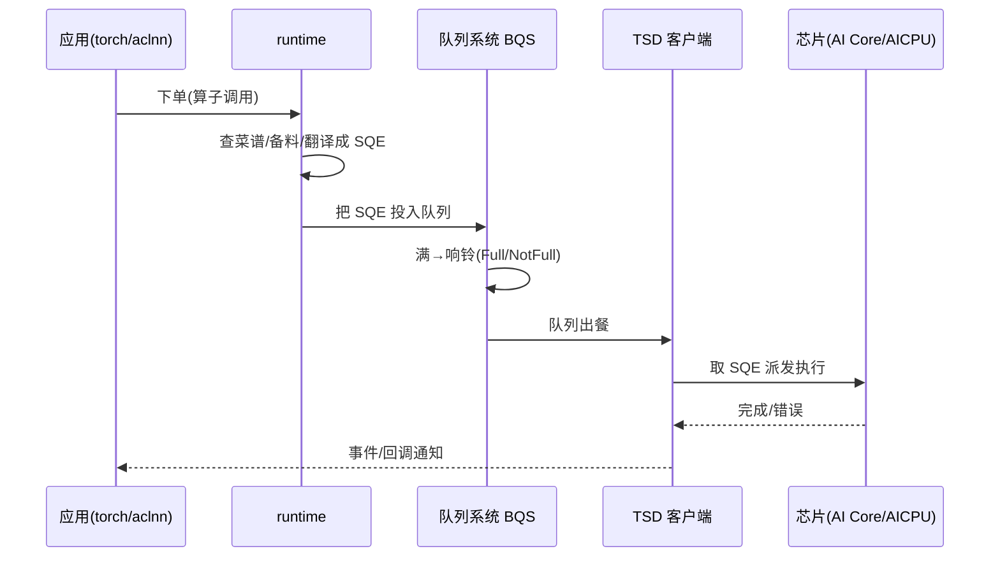
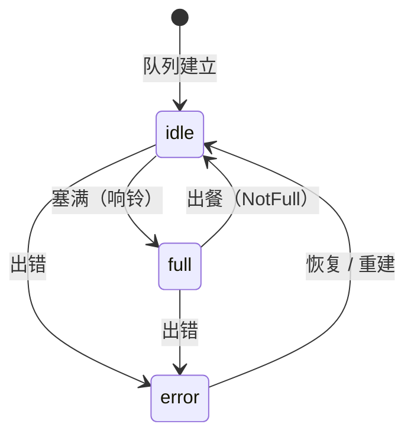
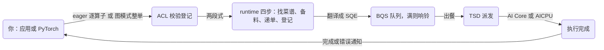

# 第3章 软件执行主链路：一次算子的一生

> 第1章我们看了电梯剖面，第2章看了电梯最底层的厨房。这一章站到 Host 侧，跟踪**一次算子从「你在代码里写下它」到「它在 AI Core 上跑完」的完整一生**——并且用「餐厅点餐」当贯穿比喻。读完这章，你要能回答：为什么大模型要「整单统一下单」（图模式）？它省掉的到底是什么钱？

## 3.1 第一张订单：eager 路径召集

想象你在一家很讲究的餐厅。eager 模式（逐算子下发）就像**每次都单独点一道菜**：喊一声「要一个 matmul」，服务员（ACL）跑到后厨（runtime）下单，等菜得了再喊下一道。

刚才第1章的 aclnn 程序里我们见过下单的规矩——**两段式**：先问「这道菜要多大盘子（workspace）」，再真正下单。这两句落到系统里，是连续的两笔动作[^launch]：

```cpp
aclnnAddGetWorkspaceSize(..., &wsSize, &executor); // 1. 报人数、桌型，领一号码（executor）
aclnnAdd(ws, wsSize, executor, stream);            // 2. 按号码正式下单
```

服务员的活（ACL 层）是**校验与登记**：设备对不对、指针合法吗、参数没瞎填吧——然后把手里的活交给后厨（runtime）。runtime 看到订单，要做的动作在源码里被刻成了四个可观察的阶段：找菜谱（查 kernel 符号）、取食材清单（定位模块）、递单子（提交任务）、登记上桌（记录程序引用）。有意思的是，runtime 每干一步都留了一句「打卡」（编译期埋的时间戳宏），所以 msprof 性能工具能精确看到每次下单分成了几段、各花多久[^launch]。这份「打卡记录」将来是你性能分析的第一现场（第15章）。

再补一句 eager 的「冤枉钱」：在 PyTorch 里走 eager，每一行 `torch.xxx` 都会经过 Python 解释 → torch_npu 适配 → aclnn 两段式 → runtime 四段式……**一层层函数调用本身就要花微秒级时间**。单个算子还行，上千个算子叠起来，Host 侧的「传话」就拖了后腿——这正是 3.4 图模式要解决的。

把这四个阶段钉到源码上，你就知道 msprof 为什么能把「一次下单」拆成几段给你看（下表是大致落点，随版本演进会移，但角色不变）：

| runtime 下单四阶段（找菜谱/备料/递单/登记） | 大致源码落点 | 干的活 |
|---|---|---|
| 找菜谱 | `runtime/src/runtime/core/src/kernel/`（binary_loader / module / program） | 解析 ELF、定位 kernel 符号 |
| 取食材 | `runtime/src/runtime/core/src/kernel/args/` | 装配参数缓冲 |
| 递单 | `runtime/src/runtime/core/src/task/task_submit/` | 提交任务进流 |
| 登记 | `runtime/src/runtime/core/src/launch/`（时间戳宏所在） | 记录这次下单的“打卡” |

注意最后一行：`launch/` 里埋着**编译期的时间戳宏**，把「下单这一下」切成几个可观测小节——这就是 msprof 时间线的来源，也是 3.5 三笔账里「Host 调度费」为什么能测、往哪测的答案[^launch]。深挖在第5章，现在记住「四阶段 + launch 记时钟」。

把第1章那个 `aclnn` 程序的九步和本章的四阶段接成一个闭环，前两章的两张图就合成了一张时序：

| 第1章程序的九步 | 在本章的落点 | 心智一句话 |
|---|---|---|
| `aclInit / aclrtSetDevice / aclrtCreateStream` | 会话与流初始化 | 先通电、选卡、开传送带 |
| `aclCreateTensor` + `aclrtMalloc` | 参数装配前的「摆盘」（ACL 层） | 定义盘子、分内存 |
| `GetWorkspaceSize` + `aclnnAdd` | 找菜谱/备料/递单 | 两段式的执行段 |
| `aclrtSynchronizeStream` | 等流上任务回执 | 等传送带清空 |
| `aclrtMemcpy(D2H)` | 结果回主机 | 端菜 |

一句话：**第1章讲「用起来」，本章讲「软体现在哪里」**；第二编开始就是在给这张表的每一格补地基。

## 3.2 后厨怎么接单：流、任务与 SQE

现在后厨有一套高效的工作台。三个概念，一次讲清[^rt]：

- **流（stream）**：一条**取菜传送带**。你把任务丢到流上，它们按顺序被后厨处理；不同流之间互不约束（可以并行），要用「事件（event）」显式打招呼才互相等。
- **任务（task）**：一张**订单卡**，写清「做什么、在哪做、数据在哪、用几个核（blockDim）」。
- **SQE**：订单卡的**机器可以读的版本**（Submission Queue Entry）。后厨只会认这种格式化小纸片，所以运行时要把订单翻译成 SQE——这也是 SQE 叫「队列条目」的原因。

「事件（event）」值得多解释一句：它是**流与流之间的对讲机**。`aclrtRecordEvent(evt, streamA)` 在 A 流上埋一个标记，`aclrtStreamWaitEvent(streamB, evt)` 让 B 流停下等这个标记——两条传送带就这样在指定点对齐，而不是强行全场停摆[^evt]。第1章的 hello 程序没用到它，是因为单条流天然有序；多流并行（推理场景常见）才开始需要。

`blockDim` 这一项值得多说一句：它直译是「块数」，意思是这张订单要**拆成几份、给几个核同时做**。一块 4096×4096 的数据，写成 blockDim=8，就拆成 8 份，8 个 AI Core 各算一角——这是昇腾多核并行的入口参数。你会在第1章 aclnn 程序、第14章算子工程里反复见到它。

把「翻译成 SQE」这一步说得再细点：任务在 runtime 内部按「要给谁做」分两类——给 **AI Core** 的、给 **AICPU**（片上的通用 CPU，处理一些标量/控制型活）的；再按「形状是否固定」分静态/动态两种形态。无论哪种，最后都收敛成一张 SQE 格式的小纸片，送去同一个入口[^sqe]。

再把「机器话」拆到字段级，看看这张小纸片到底刻了什么。仓库里 SQE 分**静态（static）与动态（dynamic）**两种[^sqe2]：

- **动态 SQE**：字段直接在下发时写——`vld`（有效标志）、`codeSize`（代码大小）、`dynTaskDescSize`（任务描述大小）、`blockDim`（分几个核）、`taskPcOffset`（kernel 入口偏移）。你能在 `task_to_sqe.cc` 里亲眼看到 `dynamicSqe->blockDim = hwtsTaskDesc.blockDim;` 这样的赋值——**blockDim 就是在这儿落地成字段的**；
- **静态 SQE**：提前预装好，重放时只更新必要字段——这正是 3.4 图模式「sink SQE」能省钱的机制。

一句话：**任务卡是「人话」，SQE 是「机器话」**；AI Core / AICPU、静态/动态、NANO 与否，各走各的构造器，但都收敛进同一条 `ConstructSqeByTaskInput` 入口。这些名字现在不用背，第5章会把构造器逐个点名。

再看一处「看得见的真码」——`blockDim` 到底在哪一行变成机器字段（`task_to_sqe.cc`）[^sqe2]：

```cpp
// [示意代码] task_to_sqe.cc 内部（略去错误处理与其它字段）
dynamicSqe->blockDim         = hwtsTaskDesc.blockDim;    // 几核跑：落成字段

dynamicSqe->taskPcOffset     = hwtsTaskDesc.pcOffset;    // kernel 入口偏移

dynamicSqe->dynTaskDescSize  = hwtsTaskDesc.dynDescSize; // 任务描述大小
```

一行 `=` 就把第1章的 `blockDim` 变成机器字段，你离「看懂 SQE」只有这一步之遥。

最后把任务分类收成一句话：其实是**三个维度**——**给谁做**（AI Core or AICPU）× **形状是否固定**（static/dynamic）× **是否走专门构造器**。其中 **AICPU** 值得一问：为什么片子上还得有个「通用 CPU」？因为 AI Core 是专精 SIMD 的流水线，处理「写日志、初始化、标量控制、等待同步、跑一小段通用逻辑」这类碎活又笨又贵——这些「碎活」正是 AICPU（片上通用核）的用武之地[^sqe]。这也是为什么 runtime 里任务分 AICORE / AICPU_HOSTFUNC 两类：**重活给 AI Core，碎活给 AICPU**，各司其职。

这三件套串成一句话：**你把任务丢上流（传送带），流把任务排好队，每个任务被翻译成 SQE，送进设备队列**。`aclrtSynchronizeStream` 就是「等这条传送带上的活都干完」。

## 3.3 从队列到芯片：BQS 与 TSD

SQE 进了哪个设备队列？谁来取？用来干什么？这段路是两个「无名英雄」的舞台：

- **队列系统 BQS（queue_schedule）**：Host 侧管理「设备和队列」关系的常驻模块。它像**外卖柜**——柜子满了会响铃（Full→NotFull 事件）让送餐的稍等；柜子空了才腾出格子。它还管「谁在跟哪个柜子绑定」（绑定关系事件）、管异步内存搬运的推进[^bqs]。总之，它是一套有状态、有回调的队列管家，而不只是个数组。
- **TSD（设备侧调度器）**：真正从队列把 SQE 取走、在芯片上把任务派出去的执行体。我们只能看到它的客户端（tsdclient）——它按「进程/线程模式」管理 Host 与片侧的关系，并负责把**完成/错误**送回给 Host[^tsd]。



**核心洞见**：从你写下那行代码到芯片执行，中间所有层都在做「传话、排队、翻译」。而正是在这些「传话」环节，藏着昇腾这类系统「慢」的所有秘密——也是后面图模式、SuperKernel 优化要偷走的所有时间。

把 BQS 再揭一层：它不是一个数组，而是一个**带状态机的常驻服务**——`queue_schedule/server/fsm/` 里躺着 `idle / full / peek / error / base` 等状态，`queue_manager` 与 `state_manager` 在状态间流转，「满柜响铃（Full→NotFull）」正是状态迁移时发出的通知事件[^bqs2]。理解「BQS = 状态机」比背它某个函数重要：排障遇到「队列卡住」，第一反应就是查它停在了哪个状态。

把最常见的迁移画成一眼状态图（摘自上面那个 `fsm/` 目录的真实状态名，这是示意图，不是穷举）：



唯一要带走的是那个形状：**满→响铃、出餐→腾位、出错有出口**——「外卖柜」的三个动作都有对应状态迁移，第5章我们会看它完整的状态机代码。

TSD 侧看客户端（`runtime/src/tsd/tsdclient/`）：它管 Host 与片侧的**进程级 / 线程级**两种模式，配合「完成/错误回执」的分发。人话：**TSD 是常驻片侧、等着取单执行的角色，它和 Host 的约定分两种调度粒度**——细节第5章展开，这里先认下「客户端 + 两种模式」两个名字。

最后一小段把「队列在哪、怎么被推进」拉到物理面：设备侧维护**提交队列（SQ）环**，Host 把 SQE 写进环、发一个 **doorbell（门铃）**通知芯片“有单了”，芯片侧消费完再回报——「满会响铃、空了腾位」的最底层实现就是这个环[^dq]。第5、6章会把「环」和「驱动」拆开讲，这里认得「SQ 环 + doorbell」两个词即可。

最后把 BQS 的职责清点成一张小表——管它内部叫什么，都像一个「队列管家」：

| BQS 管的三件事 | 一句话 | 对应源码 |
|---|---|---|
| 任务队列推进 | 满→响铃、空→出餐，状态机流转 | `queue_schedule/server/{fsm,queue_manager,state_manager}` |
| 设备-队列绑定 | 谁和哪个柜子绑定（Relation） | `queue_schedule/server/{bind_relation,router_server}` |
| 异步搬运推进 | memcpy / 通信这类异步任务也在队列里有位置 | `queue_schedule/server/`（含 hccl 相关子模块） |

而执行完的回执，分两条路回到你手里：**完成**（一切正常，任务回执）与**错误**（出问题，状态机切到 error，再经 TSD 客户端送回来）[^bqs2]。第5章会把「回执怎么从芯片一路传到你的 `aclrtSynchronizeStream` 返回点」拆开讲——现在先记住：那条 `aclrtSynchronizeStream` 等的不只是「活干完」，还有「有没有出错」这份附带的体检报告。

## 3.4 为什么大模型要整单下：图模式

现在你明白「每次点一道菜」有多贵了。大模型一场推理有上千个算子，如果每个都这么「喊一嗓子→排队→翻译」，Host 侧光是传话的时间就快赶上计算本身了。所以业界不约而同地走「整单统一下单」——**图模式**。

昇腾的图模式自下而上有三件套，一级比一级省[^graph]：

1. **aclGraph（捕获-重放）**：先**捕获**一段算子序列（像录像），之后**重放**时不再逐算子重建任务，只更新必要的参数（比如动态序列长度对应的切块参数）。PyTorch 里你见到的是 `torch.npu.NPUGraph()` + `g.replay()`。底层机制是「sink SQE」——把订单卡做成可修改的，重放时只更新必要的参数，省掉整张订单重建的开销。
2. **npugraph_ex（FX 图优化）**：在 aclGraph 之上，以 `torch.compile` 为入口做融合、内存复用、多流等 NPU 特有的优化。它是社区「样板间」，代码在 `torchair` 仓库。
3. **AOT SuperKernel（超级核离线编译）**：在模型执行前把可融合的任务**合并成一个 SuperKernel Task**，执行时只有一个大任务被调度，调度间隙、启动开销都被压到最低[^aot]。

图模式还省一类钱：**内存**。capture 阶段会把图相关的内存地址固定下来，多张图若不复用就是多份独立分配；官方因此提供了图间「内存复用」（多个 aclGraph 共享同一内存池）[^graph]——代价是要先确认不会内存踩踏。所以「图模式 = 省时间 + 省内存」是双份的。

有个数字值得记，但要会读：官方 blog 里，Qwen3-30B 的 decode 在 eager 下约 150ms，开 fullgraph 后降到约 22ms，再加 npugraph_ex 优化又到约 20ms[^graph]——**大头收益来自「从 eager 到 fullgraph」这一步（消除逐算子 Host 调度），后面是锦上添花**。以后看到各种「提升 X%」的图优化文章，先问一句：基线是 eager 还是 fullgraph？别把系统性收益记到单个组件头上。

为什么拿 **decode**（逐个 token 生成）举例，而不是 prefill（一次性处理整段输入）？因为 decode 天然是「小算子多、逐 token 串行、搬运算多」的形态——每出一个 token 都要过一遍上千个算子，Host 传话占比极高，图模式削掉的正是这块收益；prefill 是大矩阵乘、计算密集，Host 传话占比低，图模式的相对收益就小得多。这个「选对对比口径」的提醒，就是上面那句「先问基线」的具体化（基于本篇三笔账框架的推演，不是厂商标称）。

**图模式也不是免费的**，三个约束先预习：

1. **capture 通常要求静态形状**：捕获期把任务都建好定型了，输入 shape 一变就可能要重新捕获。动态序列长度这类场景，要靠「重放前刷新 tiling 参数」的能力来兜（机制上就是前文说的 sink SQE 只改参数）。
2. **多流捕获要汇回主流**：捕获中加入的子流，最终必须直接或间接 `Record Event` 回到主流，否则捕获收尾会报「capture 状态非法」类错误[^graph]。
3. **capture 期间 Host 要「听话」**：图捕获会**固化内存地址与任务结构**，capture 中插入同步查询、改设备状态这类动作会破坏被录下的「录像带」，轻则报错、重则悄悄重捕获让收益归零。官方 blog 强调的「内存复用需确认无踩踏」，也是同一件事的另一面：地址被固化后，多图共用内存池必须人为保证安全[^graph]。

所以图模式不是免费午餐，入场前先把「约束清单」读一遍——后文第22章会补全对接细节。

动手的话，图模式的 Python 长这样（官方 blog 的最小形态，`[需真机验证]`）[^graph]：

```python
g = torch.npu.NPUGraph()               # 开一台「录像机」
with torch.npu.graph(g, stream=s):     # 录像：把这段算子序列捕获进图
    out = model(x)                     #   图里的算子不会逐一下发
    ...
g.replay()                             # 重放：只重发，不重建任务
```

本质就三个词：**捕获（capture）、重放（replay）、只改参数**——capture 时把「任务结构」录好存下，replay 时只更新动态参数（机制就是前文说的 sink SQE）。

把本章讲过的下单方式收成一张「四档一览表」，从最粗到最省：

| 档 | 名字 | 怎么下 | 代价 | 什么时候用 |
|---|---|---|---|---|
| Ⅰ | eager（逐算子） | 每算子完整走「下单-翻译-执行」 | 每笔全价，Host 调度费最高 | 小模型、动态控制流多 |
| Ⅱ | aclGraph（捕获-重放） | 建一次图，之后只改参数重放 | 建图一次 + 三条捕获约束 | 大模型、shape 规律 |
| Ⅲ | npugraph_ex（FX 图） | 在 Ⅱ 之上叠 NPU 专用优化 | 依赖 torch.compile 链路 | torch.compile 用户、要更进一步 |
| Ⅳ | AOT SuperKernel | 把能合的任务离线合成一个大任务 | 合并有正确性约束 | 要极致调度间隙 |

四档不是互斥，而是**层层叠加的优化**：Ⅲ 内含 Ⅱ 的调度能力，Ⅳ 可再叠在任何档之上。判断自己该在哪一档，用下文的决策表对号入座。

**该不该用图**（个人判断），按场景对号入座：

| 你的场景 | 建议 | 理由 |
|---|---|---|
| 算子很少、控制流多 | 老实 eager | 图模式收益小，捕获还有成本 |
| 大模型整图、shape 规律 | aclGraph 或 npugraph_ex | 消除逐算子 Host 调度 |
| 要极致调度间隙 | 叠加 AOT SuperKernel | 任务合并成一个大任务，调度次数最少 |

SuperKernel 也不是万能的：合并有**正确性约束**——不能破坏原有计算语义和基础依赖关系，必要的同步要保留，不能为合并而把依赖打乱[^aot]。所以是「能合才合、合了还要查同步」，不是越大越好；第22章教你判断一张图能不能 SuperKernel。

具体上手见第22章。

## 3.5 三笔账：算子成本心智模型

把整章压缩成一个可带走的心智模型。一次算子执行，账面上有三笔钱[^model]：

1. **Host 调度费**：传话、翻译、排队的时间（每笔订单都有，eager 逐单最痛）。
2. **设备执行费**：数据搬运 + 同步等待 + 计算本身（AI Core 上真正花的时间）。
3. **搬运带宽费**：数据进出片内各层的字节流量（第2章说的瓶颈）。

记住一个公式口诀：**总耗 ≈ Host 调度 + 设备执行 + 搬运带宽**。三个优化方向一目了然——

| 账 | 典型症状 | 对应手段 | 去往章节 |
|---|---|---|---|
| Host 调度费 | 小算子多、整体很慢但单算子很快 | 图捕获/重放、SuperKernel、降低 launch 频率 | 第3、12、22章 |
| 设备执行费 | 单算子明显慢 | 融合（少来回）、指令/量化选择、多核均衡 | 第16章 |
| 搬运带宽费 | 搬运占时间线大头 | 双缓冲/流水、内存复用、就近安放、L1 复用 | 第16、8章 |

量级感比公式本身更重要。拿一个 `4096×4096` 的逐元素算子（例如加标量）粗算三笔账，感受谁在主导（都是量级估计，不是基准）：

| 账 | 这笔怎么估 | 量级感觉 |
|---|---|---|
| Host 调度费 | 一次下单 = 若干次函数调用 + runtime 四阶段记时钟 | 单笔微秒级；上千算子串行就显著（3.1 的 eager 冤枉钱） |
| 设备执行费 | 搬运 + 同步停留 + 计算本身 | 与数据趟数正相关（第2章搬运账） |
| 搬运带宽费 | 输入+输出 ≈ 96MB（16M 元素 × 2B × 3 个张量）÷ 带宽 | 常比你以为的“计算时间”更厚（2.1.1） |

结论一句话：**小算子多、偏 IO 型 → 大头在第一笔（Host 调度），图模式来救；大矩阵乘、偏计算型 → 大头在第二、三笔（执行与搬运），优化搬运来救**。这个量级感第15章会用实测替换成精确值。

再补一刀实话：**这三笔账的「最有价值时刻」在第四编**——第15章给每笔账一个实测方法（msprof 侧写、launch 时间线、带宽计数），第16章教怎么花钱。本章的目标，是让你以后读任何优化文章时能一秒归类：「这是省第一笔、第二笔还是第三笔？」能归类，就赢了一半。

把三笔账的「测量入口」也先给你，等第15章实测时对号入座（现在只认名字认工具，操作到第15章才讲）：

| 账 | 用什么看 | 在哪儿展开 |
|---|---|---|
| Host 调度费 | msprof 的 launch 时间线（3.1 的四阶段记时钟） | 第15章 |
| 设备执行费 | 算子级 profiling / 耗时统计 | 第15章 |
| 搬运带宽费 | 带宽计数 / 流量统计 | 第15章 |

提前知道「第几笔钱用什么工具量」，你读优化文章时就能更快判断「作者省的是哪笔、我该照哪笔抄」。

最后给这三笔账浇盆冷水：**账面会失真**，别把估值当实况。三个最常见的失真时刻：

1. **重叠掩盖**：流水线/双缓冲让「搬下一块」和「算上一块」重叠（第16章），账面「搬运费」不等于实际等待时间；
2. **带宽共享**：带宽是多核/多流共享的，单算子估算用的是独占带宽，实测会分摊；
3. **缓存命中**：L2 命中会改变实际流量，账面按「该搬的」算，实际搬的更少。

结论：**这三笔账是「拆解思维」，不是「秒表读数」**——它帮你在动手前判断方向，真正的读数在第15章（给你的机器、你的算子）。看优化文章能一秒归类是哪一笔，就是本章给你最值钱的能力。

第四编的性能方法论，本质就是教你怎么分别花这三笔钱最小化。以后任何性能排查，都先问一句：「这三笔钱，我的 case 卡在哪笔？」

## 3.6 每一层去哪挖源码（纵深线索）

想深挖的人，这里给一张「按层找门牌」的表（都是本开源仓的真实路径，正文不再展开）：

| 层 | 去向 |
|---|---|
| ACL 接口 | `runtime/include/external/acl/`（头文件即字典）；第4章 |
| ACL 实现与 lite 边界 | `runtime/src/acl/aclrt_impl/`；第4、5章 |
| runtime 任务与 SQE | `runtime/src/runtime/core/src/task/`（task_to_sqe.cc 等）；第5章 |
| 流与 launch 阶段时间戳 | `runtime/src/runtime/core/src/stream/`、`launch/`；第5章 |
| 队列系统 | `runtime/src/queue_schedule/server/`；第5章 |
| TSD 客户端 | `runtime/src/tsd/tsdclient/`；第5、6章 |
| 可运行样例全家桶 | `runtime/example/0_quickstart/` 0~6 组 |

把「一次算子的关键对象」再列一份清单，读源码/看文档时对号入座（都是本章出现的名字）：

| 对象 | 一句话定位 | 出场章节 |
|---|---|---|
| 张量（tensor） | 数据与形状的载体 | 第1、4章 |
| 流 / 事件 | 任务的有序容器 / 流间对讲机 | 第3、4章 |
| 任务（task） | 订单卡（人话） | 第3、5章 |
| SQE（static/dynamic） | 订单卡的机器话 | 第3、5章 |
| BQS（状态机） | 常驻队列管家 | 第3、5章 |
| TSD（客户端） | 片侧取单执行体 | 第3、5章 |
| AI Core / AICPU | 两种执行目标 | 第1、5章 |

上表再补半句「形态与状态」，方便迷路时对号入座：

- **api/ 是前台**（入口函数），**core/ 是厨房**（机制），**queue_schedule、tsd 是传菜管道**——进了 runtime 目录先分清你在哪层；
- 每个机制先记住它的**形态词**：SQE 分 static/dynamic，BQS 是状态机（idle/full/peek/error），TSD 客户端分进程/线程两模式；
- 例子里能跑的真码集中在 `runtime/example/`，想更快看到“int 到算子”的完整足迹，就从它下手。

::: tip 本章可动手的小练习（三选一，做了不亏）
- **练习一（找 SQE）**：在 `runtime/src/runtime/core/src/task/task_to_sqe.cc` 里搜 `ConstructSqeByTaskInput` / `ConstructAicoreDynamicSqe`，数一数它分了几种任务类型做分发；
- **练习二（跑样例开眼界）**：跑完 `0_quickstart` 任一样例后，用 msprof 看一眼 launch 时间线（第15章详解，这里先看“能看到什么”）；
- **练习三（讲给人听）**：把 3.4 的 `NPUGraph` 三行代码用「捕获 → 重放 → 只改参数」三个词讲给旁边的人——讲得出口，才算懂。
:::

::: tip 常见疑问三连
- **Q：这章讲的是 eager，图模式还要学吗？** A：都要。主线是「下单→执行」，图模式是收益端（省 Host 调度），两者是先后不是二选一；第22章给对接全景。
- **Q：BQS / TSD 听起来很像驱动，它们在谁？** A：BQS（队列调度）和 TSD（片侧调度）都是 runtime 生态一部分，源码在 `runtime/src/{queue_schedule,tsd}`；真正跟硬件打交道的“驱动”到第6章才登场，别把调度和驱动混为一谈。
- **Q：一次下单到底多久？** A：取决于算子类型与代际，本书不背标称数。第15章用 msprof 测的是“你的机器、你的算子”，比任何宣传数字可信。
:::

## 本章小结

::: tip 一句话总结
**一次算子的一生 = 你在代码里下单 → ACL 校验 → runtime 翻译成 SQE → BQS 排队 → TSD 派发 → AI Core 执行；eager 是「每次点一道菜」，图模式是「整单统一下单 + 大厨批量开火」，省的是 Host 调度费；心里永远装三笔账：调度、执行、搬运。**
:::

一整章，就是这条主线的放大：



## 本章来源与进一步阅读

[^launch]: 两段式 `aclnnAddGetWorkspaceSize + aclnnAdd`、`aclrtLaunchKernel` 声明与 launch 阶段时间戳宏：`runtime/example/0_quickstart/0_hello_cann/main.cpp`、`runtime/include/external/acl/acl_rt.h`、`runtime/src/runtime/core/src/stream/stream_c.cc`、`runtime/src/runtime/core/src/launch/aix_stars.cc`。
[^rt]: 流/事件/设备/上下文语义：`runtime/docs/zh/api_ref/{05_context_management,06_stream_management,07_event_management}.md`。
[^evt]: 事件作为流间同步原语（RecordEvent/StreamWaitEvent）：`runtime/docs/zh/api_ref/07_event_management.md`、`runtime/example/1_basic_features/event/`。
[^dq]: 设备侧 SQ 环与回执机制：`runtime/src/runtime/core/src/device/{ctrl_sq.cc,device_sq_cq_pool.cc}`；doorbell 通知（host→device“有单了”）的调用路径见 `runtime/src/runtime/feature/model/model_c.cc`。
[^sqe]: 任务类型（AICORE/AICPU_HOSTFUNC）与静态/动态/参数缓冲、`ConstructSqeByTaskInput` 与 sink SQE：`runtime/src/runtime/core/src/task/task_to_sqe.cc`。
[^sqe2]: SQE 字段级（`rtDynamicSqe_t`：vld/codeSize/dynTaskDescSize/blockDim/taskPcOffset，`dynamicSqe->blockDim = hwtsTaskDesc.blockDim`）与 static/dynamic 两形态构造器：`runtime/src/runtime/core/src/task/task_to_sqe.cc`、`runtime/src/runtime/core/inc/task/task.hpp`。
[^bqs2]: BQS 状态机（fsm 下 idle/full/peek/error/base）与 queue_manager/state_manager 状态流转、Full/NotFull 通知：`runtime/src/queue_schedule/server/{fsm/,queue_manager.h,state_manager.cpp}`；TSD 客户端进程/线程两模式：`runtime/src/tsd/tsdclient/`。
[^bqs]: 队列管理器与 Full/NotFull、Relation 等事件：`runtime/src/queue_schedule/server/queue_manager.h` 及其同目录实现。
[^tsd]: TSD 客户端（进程/线程模式、响应分发）：`runtime/src/tsd/tsdclient/`。
[^graph]: aclGraph/npugraph_ex 机制与 Qwen3-30B/DeepSeekV3.1 收益数据：`cann-learning-hub/blogs/inference/npugraph_ex_aclgraph_graph_mode/`。
[^aot]: AOT SuperKernel（任务合并、不改变计算语义）：`cann-learning-hub/blogs/inference/aot_superkernel_graph_execution/`。
[^model]: 「调度/执行/搬运」三笔账为本书提出的分析框架（非厂商口径），落点在第15/16章。
- 继续读：第4章 ACL 编程接口、第5章 runtime 核心实现、第22章生态与前沿。
