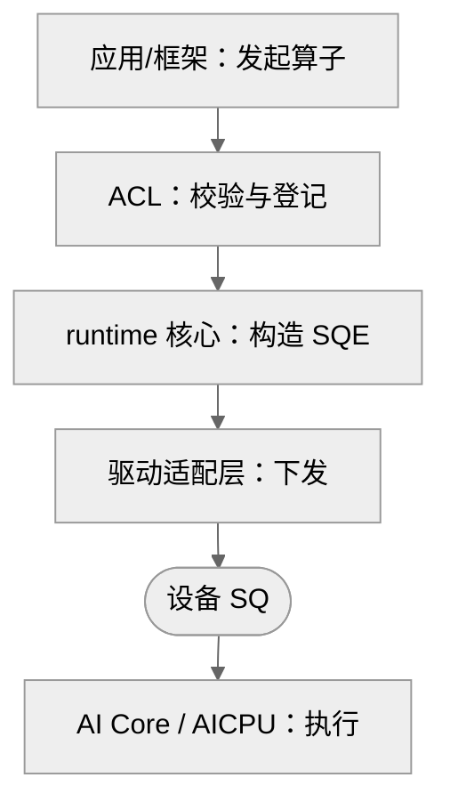

# 第3章 软件执行主链路：一次算子的一生

> 第1章我们看了电梯剖面，第2章看了电梯最底层的厨房。这一章站到 Host 侧，跟踪**一次算子从「你在代码里写下它」到「它在 AI Core 上跑完」的完整一生**——并且用「餐厅点餐」当贯穿比喻。读完这章，你要能回答：为什么大模型要「整单统一下单」（图模式）？它省掉的到底是什么钱？

## 3.1 第一张订单：eager 路径召集

想象你在一家很讲究的餐厅。eager 模式（逐算子下发）就像**每次都单独点一道菜**：喊一声「要一个 matmul」，服务员（ACL）把它递给后厨（runtime）下单，然后**接着喊下一道**——下单很快返回，菜在后厨异步做。所以「提交成功」不等于「已完成」，真正等菜要用同步接口（`aclrtSynchronizeStream`，见 3.3 末）。

刚才第1章的 aclnn 程序里我们见过下单的规矩——**两段式**：先问「这道菜要多大盘子（workspace）」，再真正下单。这两句落到系统里，是连续的两笔动作[^launch]：

```cpp
// [示意代码] 两段式调用形态（参数从略；完整样例见第1章与 runtime/example）
aclnnAddGetWorkspaceSize(..., &wsSize, &executor); // 1. 问 workspace，得 executor
aclnnAdd(ws, wsSize, executor, stream);            // 2. 按号下单，入流
```

服务员的活（ACL 层）是**校验与登记**：设备对不对、指针合法吗、参数没瞎填吧——然后把手里的活交给后厨（runtime）。后厨内部没有「标准工序表」，但源码按**职责**分好了区：认符号的（kernel 解析）、备参数的、管提交的、按型别发射的。这些是**读源码的路标，不是时序承诺**——真实调用顺序随型别与路径变化，性能观测边界取决于工具（第19章）。

再补一句 eager 的「冤枉钱」：在 PyTorch 里走 eager，一个典型算子会经过 Python 解释 → torch_npu 适配（仓外概念层，本书未跟踪其源码）→ aclnn 两段式 → runtime 内部多级处理，**层层函数调用本身就要花时间**（量级随实现与算子而变，第19章给测量方法）。单个算子未必可感，上千个算子叠起来，Host 侧的「传话」就拖了后腿——这正是 3.4 图模式要解决的。

职责分区对应的源码落点（**只表「哪类事去哪找」，不表先后**；路径随版本移，角色稳定）[^launch]：

| 职责 | 源码落点（相对 `runtime/`） |
|---|---|
| kernel 符号解析/程序装管 | `src/runtime/core/src/kernel/`（binary_loader/module/program） |
| 参数缓冲装配 | `src/runtime/core/src/kernel/args/` |
| 任务提交 | `src/runtime/core/src/task/task_submit/` |
| 按型别发射 SQE | `src/runtime/core/src/launch/` |

对照第1章的 `aclnn` 程序，可以把接口操作与本章概念联系起来：

| 第1章程序的九步 | 在本章的落点 | 心智一句话 |
|---|---|---|
| `aclInit / aclrtSetDevice / aclrtCreateStream` | 会话与流初始化 | 先通电、选卡、开传送带 |
| `aclCreateTensor` + `aclrtMalloc` | 参数装配前的「摆盘」（ACL 层） | 定义盘子、分内存 |
| `GetWorkspaceSize` + `aclnnAdd` | 找菜谱/备料/递单 | 两段式的执行段 |
| `aclrtSynchronizeStream` | 等流上任务回执 | 等传送带清空 |
| `aclrtMemcpy(D2H)` | 结果回主机 | 端菜 |

一句话：**第1章讲「用起来」，本章讲「软体现在哪里」**；第二编开始就是在给这张表的每一格补地基。

## 3.2 后厨怎么接单：流、任务与 SQE

现在后厨有一套高效的工作台。三个概念，一次讲清[^rt]：

- **流（stream）**：一条**取菜传送带**。你把任务丢到流上，它们按顺序被后厨处理；不同流之间互不约束（可以并行），要用「事件（event）」显式打招呼才互相等。
- **任务（task）**：一张**订单卡**，写清「做什么、在哪做、数据在哪、用几个核（blockDim）」。
- **SQE**：订单卡的**机器可以读的版本**（Submission Queue Entry）。后厨只会认这种格式化小纸片，所以运行时要把订单翻译成 SQE——这也是 SQE 叫「队列条目」的原因。

「事件（event）」值得多解释一句：它是**流与流之间的对讲机**。`aclrtRecordEvent(evt, streamA)` 在 A 流上埋一个标记，`aclrtStreamWaitEvent(streamB, evt)` 让 B 流停下等这个标记——两条传送带就这样在指定点对齐，而不是强行全场停摆[^evt]。第1章的 hello 程序没用到它，是因为单条流天然有序；多流并行（推理场景常见）才开始需要。


`blockDim` 值得多说一句：它是订单里的**逻辑块数**字段。**数据怎么切、谁算哪块，要靠 kernel 内用 block index 配合 tiling 自己实现**——blockDim=8 不等于「自动把数据分成 8 份」，也不保证 8 个物理核同时执行（就绪与占用由调度决定）。它是多核并行的入口参数，第1章与第14章都会见到。

把「翻译成 SQE」这一步说得再细点：任务在 runtime 内部按「要给谁做」等维度分型（类型表里如 `RT_TASK_TYPE_*_AICORE`、`*_AICPU_HOSTFUNC` 等，**类型表是全集，这里只举两例**）；描述结构又分两种形态（见下）。本书覆盖的型别最终都收敛进 `ConstructSqeByTaskInput` 同一入口（**覆盖范围以 `task_to_sqe.cc` 分派表为准，非所有后端**）[^sqe]。

再把「机器话」拆到字段级，看看这张小纸片到底刻了什么。本节选取 `task_to_sqe.cc` 中 NANO 任务构造路径的**静态（static）与动态（dynamic）**描述作为例子；该入口还支持参数描述，不能据此穷举所有架构的 SQE[^sqe2]：

- **动态（`rtHwtsDynamicTaskDesc_t`）**：字段随任务直填——`vld`/`codeSize`/`blockDim`/`taskPcOffset` 等；`task_to_sqe.cc` 的 `PreLoadDynamicSqe::ConstructSqe` 里可见 `dynamicSqe->blockDim = hwtsDynamicTaskDesc.blockDim;` 这样的赋值——**blockDim 就是在这儿落地成字段的**；
- **静态（`rtHwtsStaticTaskDesc_t`）**：描述预置，参数经 `taskParamOffset` 偏移引用（类型定义见 `pkg_inc/runtime/rt_external_preload.h`）[^sqe2]。**注意：static/dynamic 是 SQE 描述结构的两种形态，不要直接读成「张量 shape 固定/动态」**。

一句话：**任务卡是「人话」，SQE 是「机器话」**；各任务型别、两种描述形态各走各的构造器，但都收敛进同一条 `ConstructSqeByTaskInput` 入口。这些名字现在不用背，第5章会把构造器逐个点名。

再看一处「看得见的真码」——`blockDim` 到底在哪一行变成机器字段（`task_to_sqe.cc`）[^sqe2]：

```cpp
// [示意代码] task_to_sqe.cc 内部（略去错误处理与其它字段）
dynamicSqe->blockDim         = hwtsDynamicTaskDesc.blockDim;     // 逻辑块数：落成字段

dynamicSqe->taskPcOffset     = hwtsDynamicTaskDesc.taskPcOffset; // kernel 入口偏移

dynamicSqe->dynTaskDescSize  = hwtsDynamicTaskDesc.dynTaskDescSize; // 任务描述大小
```

最后把任务分类收成一句话：**给谁做**（类型表，举过两例）× **描述形态**（static 预置/dynamic 直填）× **构造器路径**，具体以 `task_to_sqe` 的分派表为准。其中 **AICPU** 值得一问：为什么片子上还得有个「通用 CPU」？因为 AI Core 每个流水级都为规则并行的张量算子而设，这类「指令序琐碎、分支多的活」交给片上通用核 AICPU 更合算[^sqe]；runtime 类型表也因此同时存在 AICORE 与 AICPU_HOSTFUNC 等型别——**各型别走各的通路，以类型表为准**。

这三件套串成一句话：**你把任务丢上流（传送带），流把任务排好队，每个任务被翻译成 SQE，送进设备队列**。`aclrtSynchronizeStream` 就是「等这条传送带上的活都干完」。

## 3.3 从提交到完成：主链，与两位旁观者

先把**主链**一次走通。它的每一段都是「概念分层」的描述——依据 runtime 设计文档对任务提交与完成的定义（提交→设备 SQ，完成→CQ 回收）[^arch]：


```mermaid
%%{init: {'theme':'neutral','flowchart':{'nodeSpacing':24,'rankSpacing':26}}}%%
flowchart TB
    A["应用/框架：发起算子"] --> B["ACL：校验与登记"] --> C["runtime 核心：构造 SQE"] --> D["驱动适配层：下发"] --> E(["设备 SQ"]) --> F["AI Core / AICPU：执行"]
```

任务完成后，**完成状态经完成队列（CQ）被 Host 回收**（同文档「完成回收」段）[^arch]；你在 3.1 见过的 `aclrtSynchronizeStream`，等的正是「这条流上提交的任务全部完成（或带错返回）」。设备侧 SQ/CQ 池的实现文件，可在 `runtime/src/runtime/core/src/device/`（`ctrl_sq.cc`、`device_sq_cq_pool.cc`）先行踩点[^dq]。

主链之外还有两位**旁路服务**——真实存在、职责清晰，但不在每次算子的数据面上：

| 旁路 | 职责 | 源码落点 |
|---|---|---|
| BQS（queue_schedule） | 队列满/空通知（Full→NotFull）、设备-队列绑定、异步任务（含 HCCL 场景）推进——事件型服务，非算子转运站[^bqs] | `queue_schedule/server/{fsm,queue_manager,bind_relation,router_server}` |
| TSD 客户端（tsdclient） | Host 与设备进程的两种共处模式（进程级/线程级）、设备侧进程管理、事件/错误通知分发——**此「回执」是进程管理与事件语义，不是主链的算子完成 CQ**[^tsd] | `tsd/tsdclient/` |


另：BQS 内部是一个状态机（`queue_schedule/server/fsm/`），完整状态与迁移（含恢复路径）第5章按源码给全。

排障遇到「队列卡住」，第一反应就是查它停在了哪个状态（完整状态机第5章读）。错误如何浮出水面（返回码、事件、日志各走哪条路），第5章按源码拆——本章只要求记住：**「等流」等的既是完成，也是错误**。

## 3.4 为什么大模型要整单下：图模式

现在回到「每次点一道菜」的账。大模型一场推理有上千个算子；**当算子碎、单算子短时**，逐算子「喊一嗓子→排队→翻译」的 Host 侧开销占比就可观——这类负载是「整单统一下下」（**图模式**）的用武之地；算子大而少时未必。

昇腾的图模式自下而上有三件套，**能力递进、适用条件与代价也各不相同**[^graph]：

1. **aclGraph（捕获-重放）**：先**捕获**一段算子序列（像录像），之后**重放**时免逐算子重新下发；能在重放前后改什么，以接口为准（26.2）。PyTorch 里你见到的是 `torch.npu.NPUGraph()` + `g.replay()`。它对应的能力是**重用已捕获的任务**、免逐算子重新下发；**具体能更新什么、何时必须重捕，取决于接口与后端**（第26章已核材料，26.2），本章不把它推广成普适机制。
2. **npugraph_ex（FX 图优化）**：在 aclGraph 之上，以 `torch.compile` 为入口做融合、内存复用、多流等 NPU 特有的优化。它是社区「样板间」，代码在 `torchair` 仓库。
3. **AOT SuperKernel（超级核离线编译）**：在模型执行前把可融合的任务**合并成一个 SuperKernel Task**，执行时任务数变少，调度间隙与启动开销随之压缩[^aot]。

内存是另一笔要单独算的账：capture 会**固化**图相关的内存地址，这**本身并不必然省内存**；省与否取决于复用策略——自动图后端对同一张图的多次捕获默认共享内存池，跨图复用默认关闭、须自证无踩踏后再开（26.3 已核口径）[^graph]。**内存共享是可选且受约束的策略，不是图模式的免费赠品**。

官方 blog 给过 Qwen3-30B decode 上「eager→fullgraph→再加优化」逐级下降的测例[^graph]；**原文的模型、精度、批量与硬件口径以博文为准**，本书不转述具体数字。能带走的是读法：看到「提升 X%」先问**基线是 eager 还是 fullgraph**，且差值不能想当然全记在「省下的 Host 调度」头上——重放还改变了下发与执行的组织方式。

为什么拿 **decode**（逐个 token 生成）举例，而不是 prefill（一次性处理整段输入）？因为 decode 往往是「小算子多、逐 token 串行」的形态，Host 传话**容易**占比较高（依模型与实现而变），图模式的相对收益空间大；prefill 偏大矩阵计算，Host 占比低，相对收益就小。这个「选对对比口径」的提醒，就是上面那句「先问基线」的具体化（基于本篇三笔账框架的推演，不是厂商标称）。

**图模式也不是免费的**，三个约束先预习：

1. **capture 通常要求静态形状**：捕获期把任务都建好定型了，输入 shape 一变就可能要重新捕获。动态序列长度这类场景，要靠接口提供的「重放前刷新参数」类能力来兜，支持范围以接口文档为准（26.2）——**不是所有动态 shape 都能靠刷新参数解决**。
2. **多流捕获要汇回主流**：捕获中加入的子流，收尾前须**在子流上记录事件、主流等待该事件**（记录+等待配对），直接或间接汇回主流，否则捕获收尾报「capture 状态非法」类错误[^graph]。
3. **capture 期间 Host 要「听话」**：图捕获会**固化内存地址与任务结构**，capture 中插入同步查询、改设备状态这类动作会破坏被录下的「录像带」，轻则报错、重则捕获结果不符预期、需要重捕，收益打折。官方 blog 强调的「内存复用需确认无踩踏」，也是同一件事的另一面：地址被固化后，多图共用内存池必须人为保证安全[^graph]。

所以图模式不是免费午餐，入场前先把「约束清单」读一遍——后文第26章会补全对接细节。

图模式的 Python 调用形态如下（不完整的 `[示意代码]`，`[需真机验证]`；省略导入、初始化与预热）[^graph]：

```python
g = torch.npu.NPUGraph()               # 开一台「录像机」
with torch.npu.graph(g, stream=s):     # 录像：把这段算子序列捕获进图
    out = model(x)                     # 记录捕获区域中的模型调用
    ...
g.replay()                             # 重放已捕获的图
```

本质就三个词：**捕获、重放、按接口约定更新**——录好的东西能原样重放，能改什么接口说了算（26.2）。

把本章讲过的下单方式收成一张「四档一览表」（代价列为常见情形，非承诺）：

| 档 | 名字 | 怎么下 | 代价 | 什么时候用 |
|---|---|---|---|---|
| Ⅰ | eager（逐算子） | 每算子完整走「下单-翻译-执行」 | 逐算子处理，Host 开销占比需测量 | 小模型、动态控制流多 |
| Ⅱ | aclGraph（捕获-重放） | 捕获后重放，参数更新遵循接口约束 | 建图一次 + 三条捕获约束 | 大模型、shape 规律 |
| Ⅲ | npugraph_ex（FX 图） | 在 Ⅱ 之上叠 NPU 专用优化 | 依赖 torch.compile 链路 | torch.compile 用户、要更进一步 |
| Ⅳ | AOT SuperKernel | 把能合的任务离线合成一个大任务 | 合并有正确性约束 | 想减少任务数与调度间隙 |

四档不是互斥：Ⅲ 内含 Ⅱ 的调度能力，Ⅳ 可再叠在其上——**每叠一层都有各自的适用条件与正确性约束**。判断自己该在哪一档，用下文的决策表对号入座。

**该不该用图**（个人判断），按场景对号入座：

| 你的场景 | 建议 | 理由 |
|---|---|---|
| 算子很少、控制流多 | 老实 eager | 图模式收益小，捕获还有成本 |
| 大模型整图、shape 规律 | aclGraph 或 npugraph_ex | 消除逐算子 Host 调度 |
| 想减少任务数与调度间隙 | 叠加 AOT SuperKernel | 任务合并，调度次数减少（合并可行性另行判断） |

SuperKernel 也不是万能的：合并有**正确性约束**——不能破坏原有计算语义和基础依赖关系，必要的同步要保留，不能为合并而把依赖打乱[^aot]。所以是「能合才合、合了还要查同步」，不是越大越好；第26章教你判断一张图能不能 SuperKernel。

具体上手见第26章。

## 3.5 三笔账：算子成本心智模型

把整章压缩成一个可带走的心智模型。一次算子执行，成本可以从三个角度观察[^model]：

1. **Host 视角**：下发、翻译、排队占了 Host 时间线多少（eager 逐单时最值得看）。
2. **设备视角**：AI Core 上计算、同步等待各占多少。
3. **数据视角**：输入输出在各层存储间流动了多少字节、瓶颈在哪层（第2章）。

**三个角度是观察位，不是可加总公式**：Host 与设备、搬运与计算都可以重叠；端到端时延由**依赖关键路径**决定——哪个环节落在关键路径上，哪个才值得先优化。所以别问「哪笔钱最多」，先问「哪段在关键路径上、它的耗时由什么主导」。

| 观察什么 | 怎么看（第19章给方法，均需真机） | 可能的优化方向 |
|---|---|---|
| Host 下发/翻译占比 | profiler 主机侧时间线 | 图捕获重放、SuperKernel、降低下发频率（第12、22、26章） |
| 设备计算/等待占比 | 算子级 profiling 耗时分解 | 融合、指令/量化选择、并行度（第20章） |
| 数据搬运量与瓶颈层 | 带宽/流量计数，对照第2章各层带宽 | 双缓冲流水、内存复用、就近安放（第8、16章） |

**一个能自己算的例子**（只算逻辑字节，不换算成时间）：FP16 的 `4096×4096` 逐元素 Add，两个输入矩阵加一个输出矩阵，`3 × 4096² × 2B = 100663296 B = 96 MiB`——这是假设每个输入元素读取一次、每个输出元素写入一次，且忽略额外访问时的**逻辑读写量**。实际 HBM 流量还受缓存、重复访问、对齐及实现方式影响，可能不同；这个数字不是 HBM 测量值，也**不等于耗时**。

最后浇盆冷水，三个最常见的失真：

1. **重叠掩盖**：搬运与计算、Host 与设备重叠后，单项账面不等于关键路径时长；
2. **带宽共享**：带宽被多核多流分摊，单算子按独占带宽估会偏乐观；
3. **缓存命中**：L2 命中可减少 HBM 访问；重复读取和额外访问也可能增加流量。

结论：**三笔账是「拆解思维」，不是「秒表读数」**——动手前用它判断去哪找问题，读数交给第19章的方法与你的真机。读优化文章时能一秒归类「作者省的是哪个角度」，本章目的就达到了。

## 3.6 每一层去哪挖源码（纵深线索）

想深挖的人，这里给一张「按层找门牌」的表（都是本开源仓的真实路径，正文不再展开）：

| 层 | 去往 |
|---|---|
| ACL 接口（头文件即字典） | 第4章 |
| ACL 实现与 lite 边界 | 第4、5章 |
| runtime 任务与 SQE | 第5章 |
| 流与各任务型别发射器 | 第5章 |
| 队列系统（BQS） | 第5章 |
| TSD 客户端 | 第5、6章 |
| 可运行样例全家桶 | 随用随查[^map] |

读源码前先记住各机制的**形态词**，迷路时对号入座：张量/流/事件是 ACL 层对象（第4章），任务/SQE（static·dynamic）是 runtime 的单据（第5章），BQS 是状态机、TSD 客户端分两模式（本章 3.3）——**名字先认下，机制在后编逐一拆**。

- **api/ 是前台**（入口函数），**core/ 是厨房**（机制），**queue_schedule、tsd 是旁路服务**——进了 runtime 目录先分清你在哪层；
- 每个机制先记**形态**：SQE 分 static/dynamic，BQS 是状态机（idle/full/peek/error，另有 push 族），TSD 客户端分进程/线程两模式。

## 本章小结

::: tip 一句话总结
**一次算子的一生 = 下单（异步，提交≠完成）→ ACL 校验 → runtime 构造 SQE → 驱动下发设备 SQ → AI Core/AICPU 执行 → 完成经 CQ 回收；BQS/TSD 是旁路服务不在数据面上。eager 逐单提交，图模式整单重放，省的是 Host 调度费；心里永远装三笔账：调度、执行、搬运。**
:::

## 本章来源与进一步阅读

[^map]: 3.6 门牌表路径（均相对 `runtime/`）：`include/external/acl/`、`src/acl/aclrt_impl/`、`src/runtime/core/src/task/`、`src/runtime/core/src/{stream,launch}/`、`src/queue_schedule/server/`、`src/tsd/tsdclient/`、`example/0_quickstart/`。
[^arch]: 提交与完成的概念分层：任务经驱动下发入设备 SQ（`runtime/docs/zh/design/architecture.md` §1.3.2 任务提交），完成经 CQ 回收（同文档完成回收段）；本章图为概念分层，非调用栈。
[^launch]: 两段式 `aclnnAddGetWorkspaceSize + aclnnAdd` 与 `aclrtLaunchKernel` 声明：`runtime/example/0_quickstart/0_hello_cann/main.cpp`、`runtime/include/external/acl/acl_rt.h`；发射器目录：`runtime/src/runtime/core/src/launch/`。
[^rt]: 流/事件/设备/上下文语义：`runtime/docs/zh/api_ref/{05_context_management,06_stream_management,07_event_management}.md`。
[^evt]: 事件作为流间同步原语（RecordEvent/StreamWaitEvent）：`runtime/docs/zh/api_ref/07_event_management.md`、`runtime/example/1_basic_features/event/`。
[^dq]: 设备侧 SQ/CQ 池实现文件：`runtime/src/runtime/core/src/device/{ctrl_sq.cc,device_sq_cq_pool.cc}`。
[^sqe]: 任务类型（AICORE/AICPU_HOSTFUNC）与静态/动态/参数缓冲、`ConstructSqeByTaskInput`：`runtime/src/runtime/core/src/task/task_to_sqe.cc`；图捕获更新参数分支：`runtime/src/runtime/core/src/kernel/kernel_utils.cc`。
[^sqe2]: SQE 字段级（`rtDynamicSqe_t`：vld/codeSize/dynTaskDescSize/blockDim/taskPcOffset，`PreLoadDynamicSqe::ConstructSqe` 内 `dynamicSqe->blockDim = hwtsDynamicTaskDesc.blockDim` 等，task_to_sqe.cc L168–172）与 static/dynamic 两形态构造器：`runtime/src/runtime/core/src/task/task_to_sqe.cc`、`runtime/src/runtime/core/inc/task/task.hpp`。
[^bqs]: 队列管理器与 Full/NotFull、Relation 等事件：`runtime/src/queue_schedule/server/queue_manager.h` 及其同目录实现。
[^tsd]: TSD 客户端（进程/线程模式、响应分发）：`runtime/src/tsd/tsdclient/`。
[^graph]: aclGraph/npugraph_ex 机制与 Qwen3-30B/DeepSeekV3.1 收益数据：`cann-learning-hub/blogs/inference/npugraph_ex_aclgraph_graph_mode/`。
[^aot]: AOT SuperKernel（任务合并、不改变计算语义）：`cann-learning-hub/blogs/inference/aot_superkernel_graph_execution/`。
[^model]: 「调度/执行/搬运」三笔账为本书提出的分析框架（非厂商口径），落点在第15/16章。
- 继续读：第4章 ACL 编程接口、第5章 runtime 核心实现、第26章生态与前沿。
