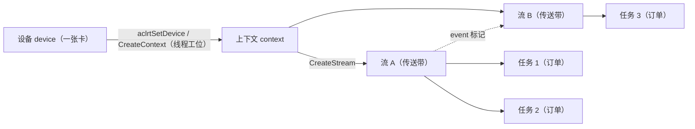
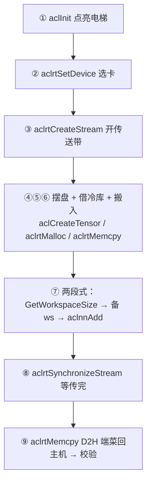

# 第4章 ACL 编程接口

> 第1章我们看到，昇腾软件栈的 ③ 层是 AscendCL（ACL）；第3章看到 runtime 把「订单」翻译成 SQE。这一章我们系统地把 ACL 这一层过一遍——但目标不是背几百个接口，而是建立一张「接口地图」：**哪些东西要先点亮（初始化）、哪些是跟谁沟通的句柄（设备/流/事件）、钱和菜在哪里（内存）、怎么下单（Launch）、怎么验收（同步）、出错找谁（错误码）**。学完这章，你看到任何昇腾 C 程序，都能立刻说出它走到地图的哪一格。

## 4.1 初始化与会话：aclInit / aclFinalize

**人话**：写程序的第一步永远是「点亮整条电梯井」。`aclInit` 做的事，是让 runtime 初始化与设备通信所需的资源（进程级会话）；`aclFinalize` 是结束会话、释放资源。

这是整个 ACL 生命周期的「大门」与「后门」[^init]：

```cpp
aclError ret = aclInit(nullptr);   // 参数：配置文件路径，先传 nullptr 表示「用默认」
if (ret != ACL_SUCCESS) { /* 初始化失败，通常是环境/权限问题 */ }

// …… 干好几万行活 ……

aclError finRet = aclFinalize();   // 结束会话
```

四句法的「为什么」两句话：

1. **为什么要显式初始化**：runtime 很多资源（进程与设备的通信通道、句柄池、日志）是**进程级**的，一次性建好能复用到后续每一次调用，而不是每次调用都重建；
2. **为什么很少看到它却很重要**：`aclInit` 不调用或失败，后面的 `aclrtSetDevice` 等全部报错。官方样例几乎都从「`CHECK_ERROR(aclInit(nullptr))`」开始[^hello]。

::: tip 记住一句话
**`aclInit` 点亮电梯井，`aclFinalize` 关灯回家。** 忘记 finalize 多数情况下不至于崩溃（进程退出时系统兜底），但养成「用完即还」的习惯，能少踩资源泄漏的坑。
:::

## 4.2 设备、上下文、流、事件：四件套句柄

这是 ACL 里出现频率最高的四个句柄，也是最容易混的四个词。用第1章的比喻一次对齐：

| 句柄 | 生活中的形象 | 它是什么 | 常用接口 |
|---|---|---|---|
| **设备（device）** | 电梯井（一张卡/一个算力单元） | 物理算力，用 `deviceId` 编号 | `aclrtGetDeviceCount` / `aclrtSetDevice` / `aclrtResetDevice(Force)` |
| **上下文（context）** | 你在这层楼的「工位」 | 线程绑定的资源账本，承载流与内存 | `aclrtCreateContext` / `aclrtSetCurrentContext` / `aclrtDestroyContext` |
| **流（stream）** | 一条取菜传送带 | 任务的有序容器，流内保序、流间可并行 | `aclrtCreateStream` / `aclrtDestroyStream` / `aclrtSynchronizeStream` |
| **事件（event）** | 流与流之间的对讲机 | 在某点埋标记、让别的流等它 | `aclrtCreateEvent` / `aclrtRecordEvent` / `aclrtWaitEvent` / `aclrtQueryEvent` |

四者的关系一张图（第1章第3章的词汇到这里正式对上）[^rt]：



几个必须记住的「一句式」：

- **设备是全局的，上下文是线程的**：`aclrtSetDevice(0)` 之后，如果没显式建上下文，系统会为该线程隐式创建一个；多线程各自要自己的上下文，通过 `aclrtSetCurrentContext` 切换[^ctx]。错误地用「另一个线程的上下文」，是经典崩溃来源之一。
- **流是执行顺序的最小容器**：同一个流里的任务按提交顺序执行；不同流之间可以并行，要用事件对齐才互相等（第3章 3.2 的「对讲机」）[^stream]。
- **流有两个常用的可选行为**：`ACL_STREAM_PERSISTENT`（流不随任务执行结束而释放）、`ACL_STREAM_FAST_LAUNCH/FAST_SYNC`（低时延路径，换一点功能裁剪）——看到这组 flag 先知道它存在即可，细节在 runtime 文档流管理篇[^stream]。

**动手前先体检：三句设备查询**。写任何多卡程序，第一件事是确认「你眼里有几张卡、它的型号对不对」（第1章 1.1.2 的三个命令是命令行版，这里是 API 版）[^devq]：

```cpp
uint32_t deviceCount = 0;
aclrtGetDeviceCount(&deviceCount);          // 系统能看到几张卡
// 之后再 aclrtSetDevice(devIndex) 指定用哪张；
// 结束时 aclrtResetDeviceForce(deviceId) 强制复位（多线程同 device 也只需复位一次）
```

常见「设备级」报错也就三种：设备不存在/未就绪（查 `npu-smi`）、驱动与 runtime 版本不匹配（查版本号）、设备被别的进程占用（查谁在用）。

950 的补充：除了经典的 `event`，3510 还提供 `cntNotify`（计数通知）族，可以做到「满足次数的通知」这类更细粒度的流间协调——第3章讲「流间对讲机」时提到的 notify 在这里落地，这里知道「event 之外还有一个 cntNotify」即可[^cnt].

参考样例：`runtime/example/1_basic_features/{device,context,stream,event}` 四个子目录就是这四件套的最小可运行演示（`[需真机验证]`）[^basic]。

## 4.3 内存管理：钱从哪借、菜放哪

**人话**：设备内存（GM）就是「冷库」；你进出数据，就是在冷库和主机之间搬货。ACL 把内存管理分成了「设备侧」「主机侧」「搬运」三块。

**4.3.1 设备内存（GM）**

```cpp
void* devPtr = nullptr;
// 第一个参数是指针的指针（要拿回地址），size 是字节数，policy 是分配策略
aclExpect ret = aclrtMalloc(&devPtr, size, ACL_MEM_MALLOC_HUGE_FIRST);
// …… 用完后释放
aclrtFree(devPtr);
```

`policy` 的值值得一提：`ACL_MEM_MALLOC_HUGE_FIRST`（优先大页）是官方样例的默认选择，它对大块连续分配友好、减少页表开销[^mem]。malloc 是「借冷库的一句话」，free 是「还」；忘记还，就泄漏——设备内存泄漏的排查比主机内存更隐蔽（进程退出了资源都可能没还干净）。

**4.3.2 主机内存**

```cpp
void* hostPtr = nullptr;
aclrtMallocHost(&hostPtr, size);   // 锁页主机内存：允许 DMA 直接读，是设备搬运的首选源/目的地
// …… 用完后
aclrtFreeHost(hostPtr);
```

`aclrtMallocHost` 分配的是**锁页内存**（page-locked / pinned），它和普通 `malloc` 的区别在于：设备侧 DMA 可以直接访问它，不需要二次拷贝——所以进出设备的数据，用它能省一次主机侧的搬运[^memh]。

**4.3.3 搬运：Memcpy / Memset**

```cpp
aclrtMemcpy(dst, dstMax, src, count, ACL_MEMCPY_DEVICE_TO_HOST); // 同步拷贝，等干完才返回
aclrtMemcpyAsync(dst, dstMax, src, count, ACL_MEMCPY_HOST_TO_DEVICE, stream); // 异步拷贝，挂在流上
aclrtMemset(devPtr, maxCount, 0, count); // 按字节清零
```

四种 `aclrtMemcpyKind` 就是四种搬运方向：`DEVICE_TO_HOST`（D2H）、`HOST_TO_DEVICE`（H2D）、`DEVICE_TO_DEVICE`（D2D）、`HOST_TO_HOST`[^memcpy]。**同步版「等搬完才回来」，异步版「丢上流就走」**——第3章的异步原则在这里第一次落在 API 上：用异步版记得同步（4.5）。

**4.3.4 分配的真身：虚拟与物理内存（一眼看穿）**

你可能会在旧文档里看到更复杂的一族接口：`aclrtReserveMemAddress` → `aclrtMallocPhysical` → `aclrtMapMem`（叫 SOMA/mallocPhysical 家族）。它们是啥关系？一句话：**`aclrtMalloc` 是把这套流程封装好的「傻瓜包」**；物理内存族则把「虚拟地址保留、物理块分配、映射」三步摊开，让你能精细控制物理块的连续性、跨进程共享（配合 IPC）、复用它[^mem4]。

正常人写算子用 `aclrtMalloc` 就够；只有当你需要「跨进程共享同一块设备内存」「给某块物理内存钉个专用句柄」这类进阶场景，才下翻到物理族。第6章讲驱动边界时会回来展开这套「物理内存 + 虚拟地址映射 + 跨进程共享」。

::: tip 一见 8 章的预告
4.3 讲的是「GM 怎么借怎么还」；第8章才讲「GM 内部的层与路（L1/UB/L0）」。**GM 是冷库，L1/UB 是案板**——本章只借冷库，案板的事留给将来。
:::

## 4.4 三种 Launch：点菜、下厨、老菜单

第1章 1.3.1 我们见过 `aclnn` 和 `<<<>>>` 两种「下单姿势」。现在给全三种，并讲清楚记清楚[^launch3]：

| 维度 | ① `aclnn...` 算子库两层式 | ② `<<<>>>`（`aclrtLaunchKernel`，V3） | ③ 老式 `rtKernelLaunch` |
|---|---|---|---|
| 谁写 kernel | 官方算子库 | 你自己（Ascend C） | 你自己（老工具链） |
| 分块 | 算子库/图引擎帮你 | `blockDim` 你定 | 你定 |
| 工作空间 | 要（先问尺寸） | 一般不显式要 | 参数数组 |
| 状态 | 现行主力、推荐 | 现行主力、V3 接口 | 老接口，新代码不推荐 |
| 见到的场景 | 用现成算子、搭模型 | 写/改算子、极致性能 | 老工程追溯 |

三条判断一句话带走：

1. **能点菜就点菜**：能用现成 `aclnn`（算子库），别自己下厨；
2. **自己写算子走 `<<<>>>` 与 `aclrtLaunchKernel`**：它把「功能句柄 + 块数 + 参数 + 流」压缩成一个调用[^lkm]；
3. **看到 `rtKernelLaunch` 别慌**：多半是 2024 年之前的旧工程，机制相似、入口不同，升级有兼容层。

看一眼 `aclrtLaunchKernel` 的真身，你就知道 `<<<>>>` 是它的语法糖（`[需真机验证]`，`4_custom_kernel_launch` 就是这套的封装）[^lkm]：

```cpp
// <<<>>> 写法
VectorAddKernel<<<blockDim, nullptr, stream>>>(srcA, srcB, dst, alpha, elementCount);
// 等价于（编译后几乎一路走到这里）
aclrtLaunchKernel(funcHandle,  /* 从 kernel 得到的函数句柄 */
                  blockDim,    /* 块数 */
                  args, argSize, /* 打包的参数缓冲 */
                  stream);
```

`<<<>>>` 只是编译器帮你把 kernel 变成 funcHandle、把参数打包，最后走的就是 `aclrtLaunchKernel` 这条 V3 路径。

## 4.5 异步执行与同步原语

**人话**：ACL 的世界默认异步——`aclnnAdd` 一声令下就「回来上班」，真正的加法在设备上慢慢做。你要么等全场（Synchronize），要么等某个点（event wait）[^async2]。

```cpp
aclrtSynchronizeStream(stream);   // 等这条流上的活全部干完（最常用）
aclrtSynchronizeDevice();         // 整个设备同步（重，慎用）
// 更细粒度：把事件记录在流上，另一处等它
aclrtRecordEvent(evt, streamA);
aclrtSynchronizeEvent(evt);       // 或 aclrtWaitEvent(evt, streamB)
```

这两行之间的心理模型，值得背下来（第1章异步账的 API 版）：

- **同步是「你自己画上去的」**：ACL 的设计假设是「下单即走、事后回执」。想读结果前不同步，读到的是旧数据/垃圾（第1章 1.3 的坑再次点名）；
- **同步有成本**：`SynchronizeStream` 让设备侧停下来等 Host，等价于一次「全场清空」——高频小算子逐次同步，就是把异步的收益清零。要高频又要正确，优先用事件对齐而不是全场同步（第16章流水线的伏笔）。

## 4.6 错误码体系与错误处理

**人话**：昇腾的报错像医院的分诊挂号——先看科室（分号段），再看病历（详细错误），最后找主治（函数族）。

第1章 1.2.2 给了两段：「107000 = 调用姿势不对，145000 = 图/模型」。现在把它补完[^err3]：

| 号段 | 层级 | 典型内容 |
|---|---|---|
| `ACL_ERROR_RT_*`（107000 起） | 运行层 | 参数非法、句柄失效、超时、设备忙 |
| `ACL_ERROR_GE_*`（145000 起） | 图执行层 | 模型加载、动态 shape、AIPP |
| `ACL_ERROR_OP_*`（115000 起） | 算子层 | 算子执行/编译相关 |
| `ACL_ERROR_INVALID_*`（每函数族内共用） | 参数校验 | 空指针、越界（最常见的「姿势不对」） |

抓错的「三板斧」也齐了（`1_error_handling` 样例就演示了这一整套，`[需真机验证]`）[^errhand]：

```cpp
aclError last = aclrtGetLastError(ACL_RT_THREAD_LEVEL);   // 取「当前线程最近一次」错误码
aclError peek = aclrtPeekAtLastError(ACL_RT_THREAD_LEVEL);// 只看一眼、不「消耗」
aclrtErrorInfo info = {};
aclrtGetErrorVerbose(deviceId, &info);                    // 设备侧详细错误：errorType / tryRepair / hasDetail
```

::: tip 两个反直觉的点
1. **错误是「线程级」的**：`aclrtGetLastError` 返回的是当前线程上次出错的码——多线程程序别在一个线程查另一个线程的错。
2. **返回值 ≠ 全部**：很多函数返回值是 `ACL_SUCCESS`，但真正的「异步失败」（比如图上设备侧执行失败）要等同步/查询才浮出来——**先同步，再读错**。
:::

拿 `1_error_handling` 演示一次「故意出错再读」的完整现场（`[需真机验证]`）[^errhand]：它先调用一个必失败的错误调用（故意传空指针），然后依次 `Peek` 看未读错误、`Get` 取走它、`GetErrorVerbose` 拿设备侧详情——全程验证「Peek 不消耗、Get 消耗」。读完这段，你就知道为什么错误处理要「分三步而不止看返回值」。

## 4.7 完整程序逐步剖析：把 0_hello_cann 拆给你看

前面六节是地图，这一节拿一张完整地图走一遍。`runtime/example/0_quickstart/0_hello_cann/main.cpp`（229 行）就是第1章那个「第一次 Hello」的完整形态，我们把它的九步对照到前面每一节[^hello]：

| 步骤 | 代码形态 | 用到 4.x 的哪节 |
|---|---|---|
| ① 初始化 | `aclInit(nullptr)` | 4.1 |
| ② 选设备 | `aclrtSetDevice(0)` | 4.2 设备 |
| ③ 开流 | `aclrtCreateStream(&stream)` | 4.2 流 |
| ④ 摆盘（建 tensor） | `aclCreateTensor(shape, ..., 地址)` | （ACL 数据面，见第13章算子库） |
| ⑤ 借冷库 | `aclrtMalloc(..., ACL_MEM_MALLOC_HUGE_FIRST)` | 4.3 设备内存 |
| ⑥ 搬入 | `aclrtMemcpy(H2D)`（同步一次） | 4.3 搬运 |
| ⑦ 两段式下单 | `aclnnAddGetWorkspaceSize` → `aclrtMalloc(ws)` → `aclnnAdd` | 4.4 ①点菜 |
| ⑧ 验收 | `aclrtSynchronizeStream(stream)` | 4.5 同步 |
| ⑨ 端菜回主机 | `aclrtMemcpy(D2H)` + 打印/校验 | 4.3 搬运 |

把这张表和第3章 3.1 的「九步闭环表」并排看，你会得到这本书第一个「三章互见」的时刻：**第1章讲菜单，第3章讲后厨窗口，第4章讲柜台怎么操作**——同一个程序，三种读法[^sync]。

读完 229 行，最划算的消化方式是改四个实验（每改一处回到源码看它对应哪一步）：

1. **加** → **乘**：把 `aclnnAdd` 换成矩阵乘系（如 `aclnnMatmulGetWorkspaceSize/aclnnMatmul`），形状和编译入口跟着变——体会「两段式是算子库的统一形态」；
2. **改 shape**：把 4096 改成 33（非对齐），观察 `workspace` 大小与校验逻辑——体会「先问尺寸再分配」的价值；
3. **换卡**：`aclrtSetDevice(1)`，多卡机器上验证设备切换；
4. **开第二流**：把两次不同算子丢到两个流上，再用一个事件对齐——第5章多流并行的预演。

这套「改法」比再读十遍源码都管用，也是第14章算子实战的先行体操。



## 陷阱与注意（汇总）
| 坑 | 症状 | 对策 |
|---|---|---|
| 忘了 `aclInit` / 初始化失败 | 后续 `aclrtSetDevice` 全报错 | 每程序第一步就 `aclInit`，检查返回值 |
| 跨线程用错上下文 | 偶发崩溃、句柄无效 | 每个线程 `aclrtSetCurrentContext` 自己的上下文（4.2） |
| 读结果前不同步 | 旧数据 / 全零 / 偶错 | 「想读结果先问同步了吗」（4.5） |
| 高频小算子逐次全场同步 | 明显慢于预期 | 用事件对齐替代 SynchronizeStream（4.5） |
| 设备内存泄漏 | 长时间运行内存涨 | malloc/free 配对，进程退出前 finalize（4.3） |
| 只看返回值不看异步错 | 同步后才报的错被漏掉 | 先同步再查 `aclrtGetErrorVerbose`（4.6） |
| `aclnnop/*.h` 头找不到 | 编译失败 | 该头是安装包生成头，不在开源仓（第3章脚注已说明）[^genhdr] |

::: tip 常见疑问三连
- **Q：设备、上下文、流，我不建上下文直接用不行吗？** A：可以——`aclrtSetDevice` 会为当前线程隐式创建默认上下文。但多线程同时用一张卡时，就该自己建/切上下文，否则句柄串台（4.2）。
- **Q：`aclnn` 和 `<<<>>>` 我到底先学哪个？** A：搭模型/用现成算子选 `aclnn`（第13章展开）；自己写算子才进 `<<<>>>`（第三编）。第1章 1.3.1 的对照表是这句话的出处。
- **Q：什么时候必须用物理内存族（SOMA）？** A：绝大多数时候不必。需要跨进程共享设备内存、或要精细控制物理块时再下翻（4.3.4）；默认 `aclrtMalloc` 已封装好。
:::

## 本章小结

::: tip 一句话总结
**ACL 是昇腾的「前台接待」：`aclInit/Finalize` 开门关门，设备/上下文/流/事件四件套是最常用的句柄，`aclrtMalloc/Memcpy` 借冷库搬货，`aclnn`（点菜）与 `<<<>>>`（下厨）是两条下单路，默认异步 → 记得同步，错了先同步再查分号段错误码。** 一张「接口地图」你已经到手。
:::

接下来第5章，我们绕到前台背后——看看 runtime 到底怎么把我们下的单变成 SQE、送进设备。

## 本章来源与进一步阅读

[^init]: `aclInit/aclFinalize` 声明与进程级会话语义：`runtime/include/external/acl/acl_rt.h`（`aclInit` 见头 1091 行、`aclFinalize` 1103 行）；行为说明见 `runtime/docs/zh/api_ref/02_initialization_and_deinitialization.md`。
[^hello]: 完整可运行样例（也是第1/3章的同一份）：`runtime/example/0_quickstart/0_hello_cann/main.cpp`（229 行，`[需真机验证]`，配套 `run.sh`/`CMakeLists.txt`）。
[^rt]: 设备/上下文/流/事件语义：`runtime/docs/zh/api_ref/{04_device_management,05_context_management,06_stream_management,07_event_management}.md`。
[^ctx]: 上下文与线程绑定、隐式创建/显式切换：`runtime/docs/zh/api_ref/05_context_management.md`；实现见 `runtime/src/runtime/core/src/context/context_manage.cc`。
[^stream]: 流的保序/并行语义、`ACL_STREAM_PERSISTENT/FAST_LAUNCH/FAST_SYNC` 等 flag：`runtime/docs/zh/api_ref/06_stream_management.md`。
[^cnt]: 计数通知 cntNotify（950/3510）：`runtime/docs/zh/api_ref/09_cntNotify_management.md`。
[^basic]: 四件套最小演示：`runtime/example/1_basic_features/{device,context,stream,event}/`。
[^devq]: 设备级查询与复位（GetDeviceCount/SetDevice/ResetDeviceForce）：`runtime/docs/zh/api_ref/04_device_management.md`、`runtime/example/1_basic_features/device/`。
[^mem]: `aclrtMalloc` 与分配策略（`ACL_MEM_MALLOC_HUGE_FIRST`）：`runtime/docs/zh/api_ref/11-01_device_memory_malloc_and_free.md`、`runtime/example/1_basic_features/memory/`。
[^memh]: `aclrtMallocHost`（锁页内存）与主机内存管理：`runtime/docs/zh/api_ref/11-02_host_memory_management.md`。
[^memcpy]: `aclrtMemcpy/Async/Memset` 与 `aclrtMemcpyKind` 四种方向：`runtime/docs/zh/api_ref/11-03_memory_copy_and_set.md`。
[^mem4]: 虚拟/物理内存三步接口（ReserveMemAddress / MallocPhysical / MapMem）与「傻瓜包」封装关系：`runtime/docs/zh/api_ref/{11-01_device_memory_malloc_and_free,11-04_virtual_memory_management,11-05_unified_addressing}.md`、`runtime/include/external/acl/acl_rt.h`（aclrtMallocPhysical）。
[^launch3]: 三种 Launch 的形态差异与适用场景；`aclnn 两层式` 见 `asc-devkit/docs/zh/guide/programming_guide/advanced_programming/aclnn_operator_development`；`aclrtLaunchKernel` 声明见 `runtime/include/external/acl/acl_rt.h` 3320 行；老式 `rtKernelLaunch` 在 `runtime/include/external/acl/acl_rt_api.h`（兼容层内联头）。
[^lkm]: `aclrtLaunchKernel(funcHandle, numBlocks, argsData, argsSize, stream)` 的五参数形态与 `<<<>>>` 的对应：`runtime/include/external/acl/acl_rt.h`；样例 `runtime/example/0_quickstart/4_custom_kernel_launch/`。
[^async2]: 同步语义族（SynchronizeStream/Device/Event）：`runtime/docs/zh/api_ref/12_execution_control.md`、`runtime/docs/zh/api_ref/06_stream_management.md`。
[^err3]: 错误码分段总计（RT/GE/OP/INVALID）：`runtime/include/external/acl/error_codes/{rt_error_codes.h,ge_error_codes.h}`；完整索引 `runtime/docs/zh/error_code_ref/`。
[^errhand]: 错误读取三板斧（Peek/Last/ErrorVerbose，含「故意传错再读」演示）：`runtime/example/0_quickstart/1_error_handling/main.cpp`（88 行）。
[^sync]: 「三章互见」方法（同一 Add 程序在 1/3/4 章三种读法）与四句法沿用：见第1章 1.5「同一个问题看三处」与 `STYLEGUIDE.md`。
[^genhdr]: `aclnnop/aclnn_add.h` 属安装包生成头、不在开源树：见第1章 1.3 与第3章「本章来源」相关脚注；写作时对开源仓的源码校验收 `check:source` 管。
- 继续读：第5章 runtime 核心实现（把 4.7 的九步翻译成 SQE）；第8章内存与数据通路（把 4.3 的 GM 扩展成分层案板）；第13章算子库体系（把 4.4 的 `aclnn` 展开成算子工程）。
