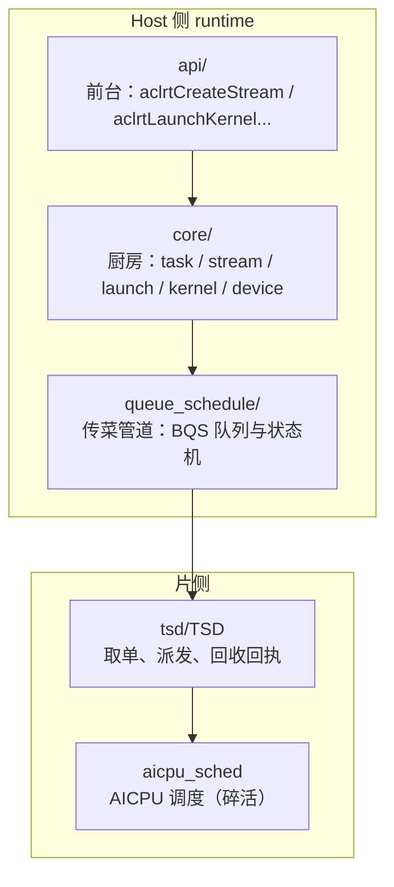
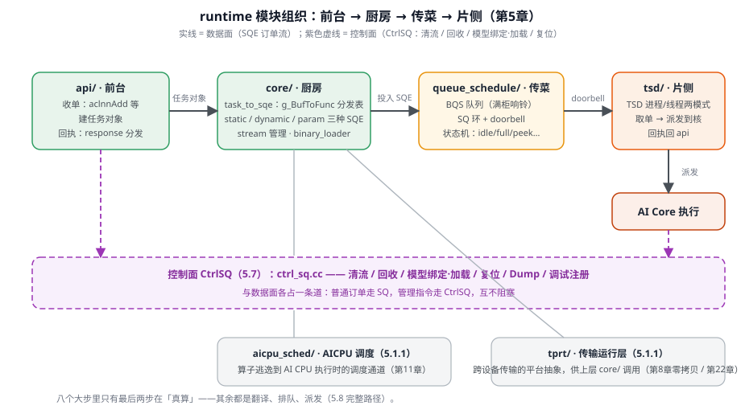
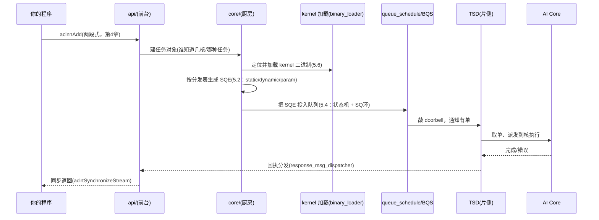

# 第5章 运行时核心实现

> 第4章你手握 ACL 接口，像站在前台点单。这一章我们走进后厨，看一张订单从「下单」到「上菜」到底经过哪些内部分工。本章只做一件事：**把 `runtime` 仓库里那堆目录名，对齐成一张「谁负责什么」的地图**——不逐行抄源码，而是告诉你每一段路该去看哪个文件、为什么它是这种形态。读完你会明白：为什么一个 `aclnnAdd` 背后要分「前台/厨房/传菜/片侧」四个区。

## 5.1 runtime 模块总览：一张点单图

第3章我们把「电梯井」从上到下排过一遍。这一章站到 `runtime` 仓内部，先看清它的**分区**。整个 runtime 源码被分成两大圈——**Host 侧**（你跑 main 的机器）和**片侧**（NPU 上的核），中间用一条「队列+驱动」的通道连着[^rtroot]：



四个区各管一摊，用第3章的「餐厅」比喻说清楚：

| runtime 分区 | 比喻 | 一句话职责 | 主要源码目录 |
|---|---|---|---|
| `api/` | 前台 | 把你的 C 调用翻译成 runtime 内部动作，做完就返回给调用方 | `runtime/src/runtime/api/api_c_*.cc` |
| `core/` | 厨房 | 真正造任务、写 SQE、按流排队的机制 | `core/{task,stream,launch,kernel,device}/` |
| `queue_schedule/` | 传菜管道 | 常驻的队列管家，管满/空、绑定、异步搬运 | `queue_schedule/server/` |
| `tsd/` | 片侧接单员 | 从队列取单、派发到核、把完成/错误送回 | `tsd/tsdclient/`、`tsd/...` |

还有一个常被忽略的区：**`aicpu_sched/`**——它调度的是第3章说过的「碎活」AICPU（片上通用 CPU），跟 AI Core 的 `core/` 分开走[^aicpu]。理解这张分区图，你以后在 `runtime` 里迷路时，第一步就是问：「这是前台、厨房、传菜，还是片侧？」



*图 5-1 runtime 模块组织与双面通道：数据面（实线）把 SQE 订单从前台送到片侧，控制面（虚线）另走一条 CtrlSQ 专道；aicpu_sched 与 tprt 是两个常被忽略的辅助区。*

### 5.1.1 两个常被忽略的区：AICPU 与平台抽象

`aicpu_sched/` 不止一处值得记，它的子目录本身就自解释：`aicpu_schedule`（调度主逻辑）、`aicpu_sharder`（把任务分摊到多 AICPU）、`aicpu_processer`（执行处理）、`aicpu_kernel`（内核态侧）、`aicpu_prof`（AICPU 性能）、`aicpu_cust_schedule`（自定义调度）[^aicpu]。细看 `aicpu_schedule/` 下还有 `execute / core / interface / proto`——它像一个小一号的 runtime，说明 AICPU 的调度是**自成体系**的。

再看 `tprt/`（Transport Runtime，传输运行层）：它是 runtime 里负责**跨主机/跨设备传输**的平台抽象层，`tprt/c/tprt_api.cc` 就是它的 C 入口[^tprt]。为什么单列这一层？因为「跨卡怎么传」这件事在不同硬件、不同链路（PCIe / HCCS / RDMA）下差异巨大——tprt 把这层差异收口，让上层（`core/`）不用关心底下的链路是哪种。这和第2章「接口统一、差异藏在实现里」是同一设计思路。

::: tip 看清 runtime 的第一句话
**api/ 是前台，core/ 是厨房，queue_schedule/ 是传菜管道，tsd/ 是片侧接单员；AICPU 有个自己的小厨房，跨卡传输有独立的 tprt。** 进 runtime 目录先分清你在哪一区，就不会被海量文件淹没。
:::

## 5.2 任务到 SQE：一张「点菜分发表」

第3章我们认识了 SQE（机器可读的订单卡），并看了 `dynamicSqe->blockDim` 这样一行赋值。这一章我们把「怎么把任务翻译成 SQE」这件事讲透——它靠的是一张**分发表**。

### 5.2.1 分发表：`g_BufToFunc`

任务要按**两个维度**决定用哪段代码翻译成 SQE：一是**输入类型（buffer type）**，二是**任务类型（task type）**。runtime 用一个二维函数指针数组做分发，看这张表的骨架[^sqe]：

```cpp
// [示意代码] task_to_sqe.cc 里的分发表（已略去错误处理）
static constexpr pfnNanoTaskToSqe g_BufToFunc[MAX_TASK][RT_TASK_TYPE_MAX] = {
    //                       AICORE(2)              AICPU_HOSTFUNC(3)
    /* STATIC  (0) */  { nullptr, nullptr, &ConstructAicoreStaticSqe, &ConstructHostFuncStaticSqe },
    /* DYNAMIC (1) */  { nullptr, nullptr, &ConstructAicoreDynamicSqe, &ConstructHostFuncDynamicSqe },
    /* PARAM   (2) */  { nullptr, nullptr, &ConstructAicoreParamSqe,  &ConstructHostFuncParamSqe  },
};
```

口诀是：**行=输入形态（static/dynamic/param），列=给谁做（AICORE / AICPU_HOSTFUNC），交叉点就是该用的构造器**。表里那一排 `nullptr` 不是闲笔——它说明「不是所有组合都存在」，前两列留给别的任务类型（当前实现只填了 AICORE 和 AICPU_HOSTFUNC 两列）。

### 5.2.2 三种输入形态，三种 SQE

这三个构造器各写一种订单卡，字段差异正是核心[^sqe2]：

- **Static SQE**（`ConstructAicoreStaticSqe`）：字段在**编译期就能定**的静态任务——`type / pre_p / post_p / dump / cond_s / kernelCredit / taskParamOffset` 等。它的好处是**可提前固化**，重放时几乎不用重建（这就是第3章图模式「sink SQE」的基础）[^sqe]。
- **Dynamic SQE**（`ConstructAicoreDynamicSqe`）：字段**下发时才填**的动态任务——`vld / codeSize / dynTaskDescSize / blockDim / taskPcOffset`。第3章那行 `dynamicSqe->blockDim = hwtsTaskDesc.blockDim` 就落在这里。它灵活，但每次都要现算。
- **Param SQE**（`ConstructAicoreParamSqe` / `ConstructHostFuncParamSqe`）：专门装**参数缓冲**——`prefetchSqe`（预取）与 `preLoadSqe`（参数地址）。AICPU / host func 这类要带参数的订单走这张。

接单的统一入口是 `ConstructSqeByTaskInput`，它先校验 buffer type 与 task type 合法，再从表里取函数指针调过去[^sqe]。

::: tip 三种 SQE 一句话区分
**Static** 字段提前定好（省事、可固化）；**Dynamic** 字段现填（灵活、每次现算）；**Param** 专装参数（给要带参的活）。第3章你见的 `blockDim`，就是 Dynamic 那一格的常客。
:::

## 5.3 流与调度：`stream` 的实现形态

`stream`（流）在第3章是「取菜传送带」。到实现层，它是一类**对象**：有优先级、有 flag、有自己的一组 SQE。看 `stream_factory.cc`——它薄得惊人，只有 21 行[^sfac]：

```cpp
// [示意代码] stream_factory.cc 主体
Stream* StreamFactory::CreateStream(Device* const dev, const uint32_t prio,
                                    const uint32_t stmFlags, DvppGrp* const dvppGrp)
{
    return CreateStreamAndGet(dev, prio, stmFlags, dvppGrp);  // 转发到真正的创建逻辑
}
```

这说明 `StreamFactory` 只是个**入口分派**，真正干活的是 `CreateStreamAndGet`。它为什么这样拆？因为不同芯片（2201 / 3510）的流实现不同——工厂把「创建流」这件通用事收口，把平台差异下沉到 `CreateStreamAndGet`。这跟第2章「能力菜单思维」是同一个道理：**接口统一，差异藏在实现里**。

流的 flag 在接口层就有讲究。第4章你见过的 `aclrtCreateStream`，其 flag 里藏着 `ACL_STREAM_PERSISTENT`（持久流）、`ACL_STREAM_FAST_LAUNCH`、`ACL_STREAM_HUGE` 等[^aclrt]。它们决定这条传菜带是否跨调用存活、走不走快启通道。现在记住一句：**流的 flag 不是装饰，它决定这条传送带被系统怎么对待**。

再往 `stream.cc` 里看一眼，流的「对象」其实带了不少可见状态：它有 `Id_()`（流的编号）、`Priority()`（优先级）、`StreamStatus`（NORMAL / ABNORMAL）[^stream]——`ABNORMAL` 正是排障时常见的「这条流异常了」的标记。它还挂着一个 `StreamSqCqManage`（SQ/CQ 环管理），把这条流的提交队列（SQ）与完成队列（CQ）管起来，跟 5.4 的「SQ 环」呼应。

第3章说过「launch 阶段时间戳」让 msprof 能拆开看每次下单。它在 `stream.cc` 里用的是 `TIMESTAMP_BEGIN/END` 宏，这些宏底层会映射到 `ATRACE_BEGIN`（trace 工具）[^base]——这就是「编译期埋点」的真相：**不是猜的，是编译时就塞进去的计时钩子**，所以 msprof 才看得到「下单一共分几段」。

## 5.4 队列调度：BQS 与「满柜响铃」

第3章我们把 BQS 比作外卖柜，并看过它的状态机（idle / full / peek / error / base）。这一章落到实现，补两个关键机制[^bqs2]：

1. **状态机是真的**：`queue_schedule/server/fsm/` 下就有 `idle_state / full_state / peek_state / error_state / base_state` 等类，`queue_manager` 与 `state_manager` 驱动它们流转。「满柜响铃（Full→NotFull）」就是状态迁移时发出的通知事件。
2. **底层是提交队列（SQ）环**：设备侧维护一条环形队列，Host 把 SQE 写进环、敲一个 **doorbell（门铃）** 通知芯片「有单了」，片侧消费完再回执。第3章说的「满了响铃、空了腾位」，最底层就是这个环[^dq]。

关于「环」再补一句：它不只运任务，也运**控制消息**——这就是 5.7 要讲的「控制面」。想深挖实现，从 `runtime/src/runtime/core/src/device/ctrl_sq.cc` 这个文件入手。

::: tip 队列排障的口诀
**队列卡住，先查它停在哪个状态**（idle / full / peek / error），再看是不是 SQ 环没敲响或没被消费。BQS 是状态机，不是数组——这是第3章到这一章都要记住的。
:::

## 5.5 TSD 与设备侧：取单、派发、回执

`tsd/tsdclient/` 是我们在 Host 侧唯一能看到的 TSD 窗口。它内部按「模式」分成几种管理器[^tsd]：

- `process_mode_manager` / `thread_mode_manager`：**进程级 / 线程级**两种调度模式，决定 Host 与片侧的关系怎么管理（第3章预告的「两种模式」在这里落地）。
- `sub_process_controller` / `tsd_process_controller`：管子进程与 TSD 进程的启停与生命周期。
- `response_msg_dispatcher`：**回执分发**——把片侧送回的「完成 / 错误」消息，路由到对应的等待者身上。

所以第4章那句「想读结果先确认自己同步了吗」的底层，就是 `response_msg_dispatcher` 在把「这单做完了」的消息，送回给你那个 `aclrtSynchronizeStream` 的等待点[^tsd]。

值得区分的是**两种回执**：**完成**（正常，任务顺利结束）与**错误**（异常，任务失败）。两者走的路径略有不同——错误往往还带着一个 `error` 状态，会经由 TSD 客户端一路传回 Host，触发你的调用点报 `ACL_ERROR_RT_*`。所以第4章的 `aclrtSynchronizeStream` 不只是「等活干完」，还在等「有没有出错」，这一章能看到它底层确实分了两条道[^tsd]。

## 5.6 kernel 加载：把「菜谱」送进厨房

第3章 eager 四阶段的「找菜谱」，对应到实现就是 `kernel/binary_loader.cc`。它干的是：把算子编译产物（一个二进制 / JSON 描述）解析成可加载的形态。看它里的几个关键动作[^bload]：

- **解析加载选项** `ParseLoadOptions`：看是否**惰性加载**（lazy load）——决定是一开始就把 binary 装上，还是用到再装。
- **解析 kernel 元信息** `ParseMagic` / `ParseInterCrossSync` / `ParseDebugOptions`：从 JSON 里读 magic 值、核间同步标志、`debugOptions`（里面有 `printf` 开关——这就是第1章为什么能 `printf` 调试内核的原因之一）。
- **生成 .so 名** `GenerateSoNameFromData`：用二进制内容哈希拼出一个 `哈希_大小.so` 的名字，用于缓存去重（同名二进制复用同一份缓存）。

一句话：**kernel 加载 = 解析元信息 + 决定懒不懒加载 + 用内容哈希做去重缓存**。它把「一份编译产物」变成「一份可被 TSD 拿去跑的料」。

「惰性加载」值得多讲一句，因为它直接影响你的算子体验。`ParseLoadOptions` 里读的 `LOAD_OPTION_LAZY_LOAD_ENABLE / DISABLE` 决定：是**装好了再跑**（急切加载，初次启动慢但运行稳定），还是**用到哪个 kernel 才装哪个**（惰性加载，降低首启内存与启动时间）。对大模型这种加载一堆算子的场景，惰性加载能显著省启动开销；代价是「第一次真正跑某个算子时会有一次加载延迟」。做性能排查时，如果发现首算子特别慢，先想想是不是惰性加载在起作用[^bload]。

## 5.7 控制面：`ctrl_sq.cc` 与另一条「订单」

前面讲的 SQE 是**数据面**——真正算数的任务。但 runtime 还有一条**控制面**，负责「管家」的活：清流、回收流、绑定/解绑模型、加载模型、通知复位、Dump、调试注册、溢出开关……这些都由 `device/ctrl_sq.cc` 的 `CtrlSQ` 承载[^ctl]：

```cpp
// [示意代码] ctrl_sq.cc：控制消息的发送方法族（截取）
rtError_t CtrlSQ::SendStreamClearMsg(const Stream* const stm, rtClearStep_t step);
rtError_t CtrlSQ::SendStreamRecycleMsg(const RtMaintainceParam& param, TaskInfo*& task);
rtError_t CtrlSQ::SendNotifyResetMsg(uint32_t notifyId);
rtError_t CtrlSQ::SendModelBindMsg(Model* const mdl, Stream* const streamIn, const uint32_t flag);
rtError_t CtrlSQ::SendAicpuModelMsg(RtCtrlMsgType msgType, const RtAicpuModelParam& param);
```

看清它的形态：**这些「控制消息」本身也走一条流提交**（`stream_->AllocTask` → `submitTask`），只是一条专门的**控制流**，跟算数的数据流分开。这解释了为什么 runtime 里「同步/清理」和「计算」是两条道——它们各占一条传送带，互不挤占[^ctl]。

::: tip 数据面 vs 控制面
**数据面**（SQE）：算数的订单，走普通流。**控制面**（CtrlSQ 控制消息）：清流、复位、挂模型这类管家活，走专门的控制流。两面的订单都进同一条 SQ 环，只是「内容」不同——这跟 5.2 的分发表是呼应的。
:::

## 5.8 从 API 到硬件：一次调用的完整路径

把这一章串成一条线。以 `aclnnAdd` 为例，从你写下它的那一刻到芯片执行，runtime 内部依次发生[^path]：



八大步里，只有最后两步在「真算」，前六步全是「翻译、排队、派发」——这正是第1章那句「昇腾软件栈大部分代码量都在高效传话」的实现证据。**你上一次调用慢在哪，就往这八步里哪一步找**（对应第3章三笔账的 Host 调度费）。

## 陷阱与注意（汇总）

| 坑 | 症状 | 对策 |
|---|---|---|
| 把 runtime 当 API 逐行背 | 看源码就晕 | 先按 5.1 分区：前台/厨房/传菜/片侧，再进对应目录（5.1） |
| 以为 SQE 只有一种 | 对 static/dynamic 傻傻分不清 | 记住分发表：行=输入形态，列=给谁做（5.2） |
| 混淆数据面/控制面 | 清流/复位跟算子一起排，难排查 | 分开看：算数的是数据面 SQE，管家活走控制面 CtrlSQ（5.7） |
| 队列卡住找不到出口 | 只盯着 API 调用 | 查 BQS 停在哪个状态、SQ 环是否被消费（5.4） |
| 把「能编译」当「能跑」 | 在 950 上行为怪 | 记住第1章军规零 + 第2章能力菜单；本编实现级结论需 msprobe 实证（5.6、STYLEGUIDE §8） |

## 本章小结

::: tip 一句话总结
**runtime 是「前台（api）+ 厨房（core）+ 传菜管道（queue_schedule）+ 片侧接单员（tsd）」；一次调用 = 建任务 → 按分发表生成 SQE → 进 SQ 环 + doorbell → TSD 取单派发 → 完成/错误回执；Static/Dynamic/Param 三种订单卡，数据面与控制面各占一条道。**
:::

接下来第8章，我们把「数据在片内怎么搬、怎么对齐、怎么分配」这条数据通路补上，为第三编写算子做准备。

## 本章来源与进一步阅读

[^rtroot]: runtime 分区与源码布局：`runtime/src/runtime/{api,core,driver}/`、`runtime/src/queue_schedule/`、`runtime/src/tsd/`、`runtime/src/aicpu_sched/`、`runtime/src/tprt/`（目录即分区语）。
[^sqe]: 任务到 SQE 的分发表与统一入口：`runtime/src/runtime/core/src/task/task_to_sqe.cc`（`g_BufToFunc[MAX_TASK][RT_TASK_TYPE_MAX]`、`ConstructSqeByTaskInput`、三种 `Construct*Sqe`）；`rtTaskBuffType_t`/`rtTaskType_t` 枚举见 `runtime/pkg_inc/runtime/rt_external_preload.h`（HWTS_STATIC_TASK_DESC=0 / DYNAMIC=1 / PARAM=2，RT_TASK_TYPE_KERNEL_NANO_AICORE=2 / AICPU_HOSTFUNC=3）。
[^sqe2]: Static/Dynamic/Param 三种 SQE 字段：`rtStaticSqe_t`（type/pre_p/post_p/dump/cond_s/kernelCredit/taskParamOffset）与 `rtDynamicSqe_t`（vld/codeSize/dynTaskDescSize/blockDim/taskPcOffset）及 param 缓冲（prefetchSqe/preLoadSqe）：`runtime/pkg_inc/runtime/rt_external_preload.h`、`runtime/src/runtime/core/src/task/task_to_sqe.cc`。
[^sfac]: 流工厂薄封装：`runtime/src/runtime/core/src/stream/stream_factory.cc`（`CreateStream` 转发 `CreateStreamAndGet`）与 `stream_factory.hpp`。
[^aclrt]: 流 flag：`runtime/include/external/acl/acl_rt.h`（`ACL_STREAM_PERSISTENT` / `ACL_STREAM_FAST_LAUNCH` / `ACL_STREAM_HUGE` 等）；`aclrtCreateStream` 语义见 `runtime/docs/zh/api_ref/06_stream_management.md`。
[^bqs2]: BQS 状态机与队列管理：`runtime/src/queue_schedule/server/{fsm/,queue_manager.h,state_manager.cpp}`（idle/full/peek/error/base 状态）。
[^dq]: 设备侧 SQ 环与 doorbell：`runtime/src/runtime/core/src/device/{ctrl_sq.cc,device_sq_cq_pool.cc}`；doorbell 通知路径见 `runtime/src/runtime/feature/model/model_c.cc`。
[^tsd]: TSD 客户端按模式管理（进程/线程、子进程控制器、回执分发）：`runtime/src/tsd/tsdclient/src/{process_mode_manager,thread_mode_manager,sub_process_controller,tsd_process_controller,response_msg_dispatcher}.cpp`。
[^bload]: kernel 二进制加载（加载选项/lazy load、magic/intercoreSync/debugOptions-printf 解析、按内容哈希生成 .so 名去重）：`runtime/src/runtime/core/src/kernel/binary_loader.cc`。
[^ctl]: 控制面消息（清/回收流、模型 bind/load/abort、notify 复位、AICPU 模型消息、Dump/调试/溢出开关），经控制流提交：`runtime/src/runtime/core/src/device/ctrl_sq.cc`。
[^aicpu]: AICPU 调度子目录（schedule/sharder/processer/kernel/prof/cust_schedule）：`runtime/src/aicpu_sched/`；`aicpu_schedule/` 下含 execute/core/interface/proto。
[^tprt]: 传输运行层 C 入口：`runtime/src/tprt/c/tprt_api.cc`；平台抽象层目录 `runtime/src/tprt/`。
[^stream]: 流对象状态与 SQ/CQ 管理：`runtime/src/runtime/core/src/stream/stream.cc`（`Stream::Id_`/`Priority`/`StreamStatus`(NORMAL/ABNORMAL)/`StreamSqCqManage`）。
[^base]: launch 时间戳宏（`TIMESTAMP_BEGIN/END` → `ATRACE_BEGIN`）：`runtime/src/runtime/core/inc/base.hpp`；用法见 `runtime/src/runtime/core/src/stream/stream.cc`（`TIMESTAMP_BEGIN(rtStreamCreate_SubmitCreateStreamTask)`）。
[^path]: 从 api → core → kernel 加载 → queue/BQS → tsd → device 的执行路径（结合上列文件推演），实现级时序结论按 STYLEGUIDE §8 标注「需 msprobe 实证」。
- 继续读：第8章内存与数据通路、第6章驱动与系统软件协同、第3章（BQS/TSD/SQE 的形态版）、`runtime/docs/zh/design/modules/{stream,task,kernel,device}.md`。
