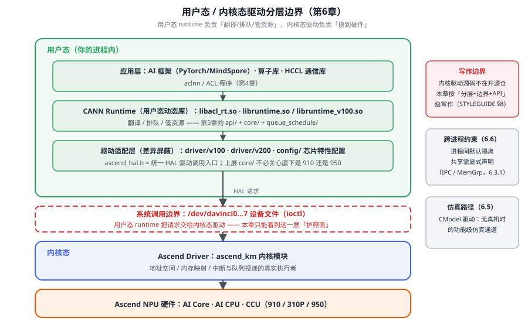

# 第6章 驱动与系统软件协同

> 前几章我们从 ACL 一路走到了 runtime 的模块、队列、内存。这一章回答一个很多人没想透的问题：**「用户态 runtime」和「内核态驱动」到底怎么分工？** 你写的 `aclrtMalloc`、`aclrtLaunchKernel` 最终是通过什么边界跨进硬件空间的？本章把这条「边界」讲清楚——它决定了你排查问题时要往用户态找，还是往内核态找。读完你会明白：**用户态 runtime 负责「翻译、排队、管资源」，内核态驱动负责「真正摸到硬件」**，这条边界就是你理解的钥匙。

## 6.1 用户态驱动能力视图

`runtime/src/runtime/driver/` 是用户态驱动的核心。它向外提供的是「设备管理 + 内存 + 队列 + 资源」这几类能力。看 `npu_driver.cc` 的骨架，能看清它对外暴露什么[^npu]：

```cpp
// [示意代码] npu_driver.cc 关键接口（节选）
rtError_t NpuDriver::GetDeviceCount(int32_t* const cnt);            // 设备数量
rtError_t NpuDriver::GetDeviceIDs(uint32_t* const deviceIds, ...); // 设备 ID 列表
const DevProperties& NpuDriver::GetDevProperties(void) const;      // 设备属性
rtError_t NpuDriver::DevMemFlushCache(uint64_t base, size_t len);  // 刷 cache
rtError_t NpuDriver::DevMemInvalidCache(uint64_t base, size_t len);// 失效 cache
```

它的命名规律值得记：`NpuDriver` 是**主实现**，按主题拆成 `npu_driver_mem.cc`（内存）、`npu_driver_queue.cc`（队列）、`npu_driver_res.cc`（资源）[^npu]。子文件分工，正是「能力视图」的体现——你要找「内存相关」就进 `_mem.cc`，找队列就进 `_queue.cc`。

还有个关键设计：**驱动是分代际适配的**。`driver/` 下有 `v100 / v200 / v201` 目录，`npu_driver_base.hpp` 与 `npu_driver_base_soma.hpp` 是不同版本底座；`npu_driver_dcache_lock_{common,david,opb}.cpp` 是不同芯片的 cache 锁实现[^npu]。这就是第2章「能力菜单」在驱动层的落地——同一种能力（刷 cache），不同芯片用不同实现，但接口统一。

问题来了：**多个驱动实现怎么被统一的入口找到？** 靠的是驱动工厂的**注册机制**[^drvfac]：

```cpp
// [示意代码] 驱动工厂：实现类「自己注册自己」
// npu_driver.cc：
bool g_npuDriverRegResult = DriverFactory::RegDriver(NPU_DRIVER, &NpuDriver::Instance_);
// driver.cc：
Driver* DriverFactory::GetDriver(const driverType_t type);
```

`DriverFactory::RegDriver` 把「某个驱动类型 → 工厂函数」登记进工厂，`GetDriver` 按类型取出。这样 runtime 只依赖抽象的 `Driver`，具体是 `NpuDriver`（真机）还是别的实现，由注册决定——**面向接口、实现注册**。这套模式跟第5章流工厂、第8章「接口统一差异埋实现」一脉相承。

## 6.2 用户态与内核态驱动的边界

这是本章最重要的一节。CANN Runtime 是**用户态动态库**，跑在你的进程里；而真正的硬件访问要借助**内核态驱动**。看部署视图[^deploy]：

| 层级 | 组件 | 部署位置 | 说明 |
|---|---|---|---|
| 应用层 | AI 框架、算子库、通信库 | 用户态进程 | PyTorch / MindSpore / ACL 算子库 / HCCL |
| Runtime 层 | CANN Runtime | 用户态动态库 | `libacl_rt.so` / `libruntime.so` / `libruntime_v100.so` |
| 驱动层 | Ascend Driver | **内核态** | 模块 `ascend_km`，经 `/dev/davinci*` 设备文件交互 |
| 硬件层 | Ascend NPU | 物理设备 | 910 / 310P / 950（AI Core、AI CPU、CCU） |

**边界一句话：用户态 runtime 通过 `/dev/davinci*` 设备文件，把请求交给内核态 `ascend_km` 驱动**。内核源码不在本开源仓范围，所以第6章我们只能看**边界与 API**（这正是骨架里标注的「按分层+边界+API 级写作」的原因）。



*图 6-1 驱动分层边界：绿色区是本章能看透的用户态，蓝色区只写「护照面」；右栏标注了写作边界、跨进程约束与仿真路径三个边界注记。*

在用户态这一侧，runtime 用一个**驱动适配层**把「不同代际芯片」的差异屏蔽掉：`driver/v100`、`driver/v200` 版本目录管多代际；`config/` 目录管芯片特性配置；`ascend_hal.h` 是**统一的 HAL 驱动调用入口**[^deploy]。所以上层的 `core/` 根本不用管底下是 910 还是 950——这又是「接口统一、差异藏在实现里」。

## 6.3 地址空间与内存映射模型

第4章我们在 API 层看了 `aclrtMalloc`（借冷库）。这一层把「地址空间」讲透：**设备内存也有「虚拟地址 ↔ 物理地址」的映射**，而且支持**进程间共享**。看 runtime 提供的物理内存管理接口[^memmap]：

```cpp
// [示意代码] 物理内存管理：预留虚拟地址 → 映射物理内存 → 用后解映射
aclrtMallocPhysical(&handle, size, &prop, 0);       // 分配物理内存
aclrtReserveMemAddress(&virPtr, size, 0, nullptr, 0); // 预留虚拟地址空间
aclrtMapMem(virPtr, size, 0, handle, 0);            // 物理映射到虚拟地址
// ... 使用 virPtr 访问设备内存 ...
aclrtUnmapMem(virPtr);          // 解除映射
aclrtReleaseMemAddress(virPtr); // 释放虚拟地址空间
aclrtFreePhysical(handle);      // 释放物理内存
```

这套接口是「**先预留虚拟地址、再映射物理内存**」的典型用法，也是「零拷贝」「进程间共享」的底层设施。配合第8章的 `aclrtMallocAlign32` 等分配接口，它们共同组成了 runtime 的内存管理（`docs/zh/design/modules/memory/memory.md`）。

### 6.3.1 进程间内存共享（IPC）

跨进程共享内存也是内存管理的能力之一。做法是「**导出句柄 → 导入共享**」[^memmap]：

- 进程 A：分配内存后**导出共享句柄**；
- 进程 B：导入该句柄，就能访问同一块内存。

除了内存共享，还有**内存组（MemGrp）共享**：`npu_driver_queue.cc` 里有 `MemGrpCreate / MemGrpCacheAlloc / MemGrpAddProc / MemGrpQuery`[^npu]——它把一块内存放入一个「内存组」，再把其他进程（`MemGrpAddProc` 加进程）加进组里，实现组内共享。这比「每对进程导出/导入」更进一层：**多个进程组起来共享**。

这为「多进程协作 / 多设备共享」提供了基础。

## 6.4 进程内多设备与设备组模型

runtime 采用**进程内单例**模式，一个进程能管理多设备、多上下文、多 Stream[^deploy]：

- **单进程多设备**：一个进程管理多个 NPU（`aclrtSetDevice` 切换）。
- **单进程多上下文**：一个 Context 关联一个 Device，可建多个 Context。
- **单进程多 Stream**：一个 Context 可建多个 Stream，实现任务并行。
- **多进程隔离**：不同进程的 Runtime 实例**完全隔离**，各自维护独立资源状态。

这套模型解释了第4章为什么你要先 `aclrtSetDevice` 再 `aclrtCreateStream`——**一切资源都挂在「当前设备 + 当前上下文」之下**，所以第4章的「先设设备、再建上下文、再建流」不是随意顺序，而是这条资源树的结构。

再往 Device 内部看，它是**三层继承**结构[^devmdl]：`Device`（抽象接口）→ `GroupDevice`（设备组）→ `RawDevice`（实际设备）。每个 Device 里包含 `Engine`（调度引擎）、`Driver`（驱动）、`Stream`（主流）、`DeviceSqCqPool`（SQ/CQ 池）、`SqAddrMemoryOrder`（SQ 地址池）等组件[^devmdl]。所以设备初始化不是「开个机」，而是：**初始化驱动 → 获取设备属性 → 创建资源池 → 启动调度引擎**。这一条链，正是第5章「从 API 到硬件」里「建任务 → 进 SQ 环」能跑起来的前提——SQ/CQ 池、调度引擎都在设备初始化时就备好了。

## 6.5 CModel 驱动与仿真路径

除了真机驱动，还有一条**仿真**路径：`runtime/src/cmodel_driver/`。它是 CModel（芯片模型/仿真器）的驱动适配，提供 `driver_api.c / driver_impl.c / driver_mem.c / driver_queue.c` 等[^cmodel]。它的作用：在没有真机时，用软件模型模拟芯片行为，跑通「用户态 runtime → 驱动层」的逻辑，用于开发调试和 CI。它跟 `npu_driver` 的接口形态对齐（都有 driver_mem、driver_queue），但背后是**仿真**而不是真硬件——这正是「接口统一、实现可换」的又一例证。

## 6.6 跨进程约束与安全模型

最后收紧一下边界。因为「多进程完全隔离」，跨进程共享内存（6.3.1）就是**特意的「打开一个口子」**，而不是默认行为。这带来两件事要记住[^deploy]：

1. **默认隔离**：不同进程互不干扰，各自的资源（设备/上下文/流）独立，这是安全基石。
2. **共享要显式**：需要跨进程共享时，走 IPC 共享句柄 / 物理内存映射等**显式机制**，而不是指望「能互相访问」。

对做底层/多进程场景的人，这条「隔离 + 显式共享」的模型，比背接口更重要。

::: tip 边界一句话
**用户态 runtime 负责「翻译、排队、管资源」，内核态驱动 `ascend_km` 负责「真正摸到硬件」，中间靠 `/dev/davinci*` 与 HAL 适配层。内存有「虚拟↔物理」映射，跨进程默认隔离、共享需显式。** 排查先分「用户态还是内核态」，能少走弯路。
:::

## 陷阱与注意（汇总）

| 坑 | 症状 | 对策 |
|---|---|---|
| 一有问题就认为内核驱动坏了 | 其实是自己用户态用错 | 先分边界：用户态 runtime 的问题 vs 内核态驱动的问题（6.2） |
| 以为跨进程能随便共享内存 | 数据对不上或权限报错 | 走显式 IPC / 物理内存映射，而非默认共享（6.3、6.6） |
| 不先 setDevice 就建流 | 上下文/流对不上 | 理解「设备→上下文→流」的资源树，按序创建（6.4） |
| 想找内核驱动源码 | 在开源仓里找不到 | 内核源码不在开源仓，按「层次+边界+API」级理解（6.2） |
| 把仿真路径当真机结果 | CModel 跑通但真机行为不同 | 区分 CModel 仿真（6.5）与真机；关键结论需真机验证（STYLEGUIDE §8） |

## 本章小结

::: tip 一句话总结
**runtime 是用户态动态库，经 `/dev/davinci*` 与内核态 `ascend_km` 驱动交互，靠 `ascend_hal.h` 适配层屏蔽多代际芯片差异；用户态驱动按能力拆成 mem/queue/res，内存有「虚拟↔物理」映射并支持 IPC 共享与 CModel 仿真；多设备/多上下文/多 Stream 在进程内管理，跨进程默认隔离、共享需显式。**
:::

## 本章来源与进一步阅读

[^npu]: 用户态驱动（`NpuDriver` 主实现 + 主题拆分的 `_mem/_queue/_res` 子文件、多代际 `v100/v200/v201` 目录、`npu_driver_base[_soma].hpp`、`npu_driver_dcache_lock_{common,david,opb}.cpp`、`xpu_driver`）：`runtime/src/runtime/driver/`。
[^drvfac]: 驱动工厂注册机制（`DriverFactory::RegDriver(NPU_DRIVER, &NpuDriver::Instance_)` / `GetDriver`）：`runtime/src/runtime/driver/{driver.cc,npu_driver.cc}`。
[^devmdl]: Device 三层继承结构与初始化流程（Device→GroupDevice→RawDevice；含 Engine/Driver/Stream/DeviceSqCqPool/SqAddrMemoryOrder；初始化：动驱动→获属性→建资源池→启调度引擎）：`runtime/docs/zh/design/modules/device/device.md`。
[^deploy]: 部署视图 / 分层 / 进程模型与驱动适配层（用户态动态库 vs 内核态 `ascend_km` 经 `/dev/davinci*`；`libruntime_v100/v200.so`；`config/` 芯片配置；`ascend_hal.h` HAL 入口；单进程多设备/多上下文/多 Stream；多进程隔离）：`runtime/docs/zh/design/architecture.md`。
[^memmap]: 物理内存映射与 IPC 共享（`aclrtMallocPhysical` / `aclrtReserveMemAddress` / `aclrtMapMem` / `aclrtUnmapMem` / `aclrtReleaseMemAddress` / `aclrtFreePhysical`；导出/导入共享句柄）+ `NpuDriver::MallocHostSharedMemory` / `HostRegister` / `HostGetDevPointer`：`runtime/docs/zh/design/modules/memory/memory.md`、`runtime/src/runtime/driver/npu_driver_mem.cc`。
[^cmodel]: CModel 仿真路径（`driver_api.c / driver_impl.c / driver_mem.c / driver_queue.c`）：`runtime/src/cmodel_driver/`。
- 继续读：第5章（runtime 核心实现）、第8章（内存与数据通路）、`runtime/docs/zh/design/{architecture.md,modules/device/device.md,modules/memory/memory.md}`。
