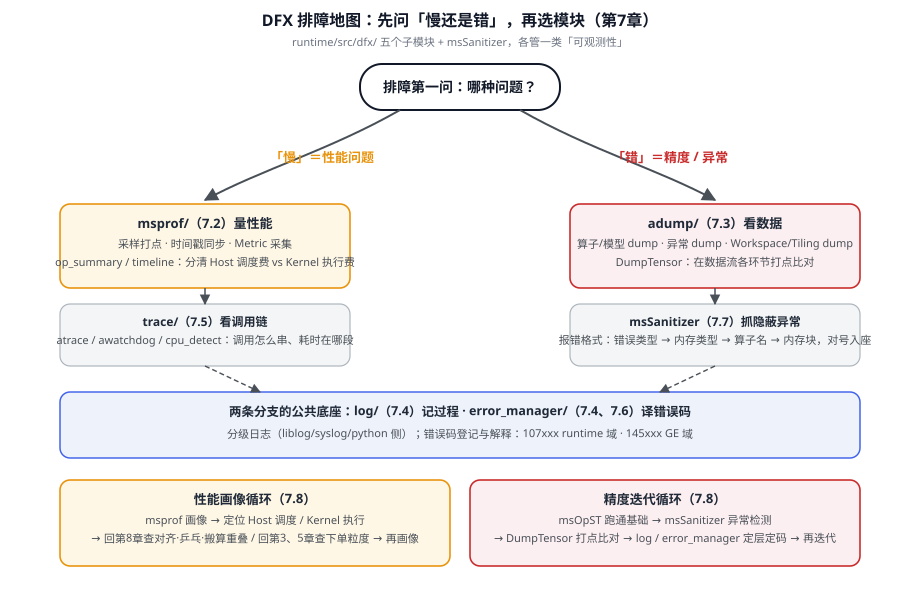

# 第7章 维测子系统 DFX

> 写完了算子、跑通了一条流，接下来最长的一段时间，你可能都花在「**为什么不对 / 为什么慢**」上。这一章讲 runtime 的维测子系统 **DFX（Design for X，设计可维测性）**——它提供「看得见、查得出、量得准」的能力。这一章不把 DFX 当「工具堆」罗列，而是给你一张地图：**哪些问题该找哪个模块、它们各自在看什么**。读完你会明白：为什么「报错码」「打印日志」「性能画像」「异常检测」这几件事，在昇腾软件栈里被分成了 `dfx` 目录下的一排子模块。

## 7.1 DFX 模块总览：一张「维测分工」图

`runtime/src/dfx/` 下摆着几个子模块，各管一类「可观测性」[^dfxroot]：

| 子模块 | 解决什么问题 | 一句话 |
|---|---|---|
| `msprof/` | 性能去哪了 | 采样打点、时间戳同步、采集 Metric |
| `adump/` | 出错时数据长啥样 | 算子/模型 dump、异常 dump、Workspace/Tiling dump |
| `log/` | 运行轨迹日志 | 分级日志（liblog / syslog / python 侧） |
| `error_manager/` | 这个错误码啥意思 | 错误码登记与解释（`error_code.json`） |
| `trace/` | 调用链与耗时 | atrace / awatchdog / cpu_detect |

用一句人话串起来：**msprof 告诉你「慢在哪」，adump 告诉你「错在哪个数据」，log 告诉你「过程发生了什么」，error_manager 告诉你「这个码代表什么」，trace 告诉你「调用怎么串起来」。** 五件事各干各的，但合起来就是「定位问题」的完整链条。

::: tip 排障先问这五句
**慢→查 msprof；数据错→查 adump；经过不明→查 log；报错码→查 error_manager；调用链→查 trace。** 先分清楚这五件事，再动手，能省一半时间。
:::



*图 7-1 DFX 排障地图：排障先定「哪种问题」再选模块；两个循环是 7.8 节标准流程的图形版。*

## 7.2 msprof：原理（采样打点/时间戳同步/Metric）与实战

`msprof/` 是性能画像的主力，它的 `collector/` 下有 `basic / avp / dvvp` 等采集器[^dfxroot]。它靠三样东西工作[^msprof]：

1. **采样打点**：在关键动作处埋点（第3、5章我们见过 `TIMESTAMP_BEGIN/END` → `ATRACE_BEGIN` 这类编译期埋点），用时间戳记录「下单一共分几段」。
2. **时间戳同步**：把 Host 与设备侧的时间对齐，才能合并成一条完整的时间线——否则「Host 说 10ms，设备说 8ms」对不上。
3. **Metric 采集**：抓取带宽、利用率、任务耗时等指标，做成你能看懂的报告。

实战时的标准动作是先跑一次 msprof 拿到 `op_summary` / `timeline`，看**到底哪个阶段耗时最长**——是 Host 调度费（第3章三笔账）还是 Kernel 执行费。若 Kernel 执行占大头，再往算子内部看（对齐/乒乓/搬算重叠，第8章）；若 Host 调度占大头，则大概率是「下单太碎」，要去合并任务。

msprof 还有一种「二次开发」接口（`19-02_msproftx_extension_apis`），允许往采集流程里塞自定义扩展[^msprof2]。如果你做的是很特殊的底层验证，可以借此定制采集。

具体到「看报告」，你要抓两个对象[^msprof]：

- **op_summary**：每个算子的执行汇总（耗时、带宽、利用率）。适合扫一遍看「哪个算子最贵」。
- **timeline**：按时间轴展开的完整时序（Host 下发、设备执行各占多少）。适合看「注入/依赖」——谁在等谁。

## 7.3 adump：把「出错的数据」捞出来

`adump/` 解决的是「数据对不上，到底差在哪」。它的子目录有 `adcore / adump / proto`[^dfxroot]，核心思想是**在关键环节把 Tensor / 中间结果打出来**。

这里要重点提一个与 adump 配套、更贴近算子开发的工具——**DumpTensor**。它让算子运行时把任意存储位置（GM、UB、L1）的 Tensor 内容打印出来，把「黑盒」调试变成「白盒」[^dumptensor]：

```cpp
// [示意代码] DumpTensor：打印 LocalTensor 与 GlobalTensor
AscendC::DumpTensor(localTensor, desc, dumpSize);   // 打印 LocalTensor
AscendC::DumpTensor(globalTensor, desc, dumpSize);  // 打印 GlobalTensor
```

`desc` 是自定义标识符（按顺序编号区分打印点），`dumpSize` 是打印元素个数。想要更直观，可以传形状信息以矩阵形态输出[^dumptensor]：

```cpp
// [示意代码] 以矩阵形态打印（2 维，3x3）
uint32_t shape[] = {3, 3};
AscendC::ShapeInfo shapeInfo(2, shape);
AscendC::DumpTensor(tensor, 10, 9, shapeInfo);
// 输出形如：[[1,2,3],[4,5,6],[7,8,9]]
```

调测思路一句话：**在数据流动的每一个环节建立可观测点**，从 GM 搬入、算完写 UB、搬出回 GM，逐段 `DumpTensor` 对比，就能定位是哪一段把数据搞错了。

## 7.4 log 模块与 error manager

`log/` 提供**分级日志**：从 debug 到 fatal，关键动作打哪些日志、打到哪（`liblog / syslog / python` 等通道）[^dfxroot]。它有日志级别、错误码映射等约定。排障第一反应常是「开 debug 日志看看」，这就是 log 模块在起作用。

`error_manager/` 则管**错误码的解释**。它有一份 `error_code.json`，把错误码登记成「码 → 含义」的映射，`error_manager.cc` 负责把码翻译成人能读的报错[^dfxroot]。比如 `ACL_ERROR_RT_ADDR_UNALIGNED`（107008）= 内存地址未对齐，`ACL_ERROR_RT_STREAM_CONTEXT`（107003）= 流不在当前上下文[^errcode]。看到报错，先去 error_manager 查这个码，比瞎猜快得多。

## 7.5 trace：调用链与耗时

`trace/` 负责把「一次调用是怎么串起来的」记下来。它下面有 `atrace`（Android-trace 风格的跟踪）、`awatchdog`（看门狗监测）、`cpu_detect`（CPU 侧检测）等[^dfxroot]。相比 msprof 的「性能画像」，trace 更偏「**时序与依赖**」——谁先谁后、谁等了谁。当出现「莫名卡住 / 同步失败」时，看 trace 能发现是不是某步没被正确触发。

`trace/atrace/` 下还有 `utrace`（用户态跟踪）与 `trace_server`（跟踪服务）[^dfxroot]。这解释了一个常见场景：当你开了毫秒级的「调式/性能」开关，runtime 会用这些通道把**每一次下发 + 回执**按时间戳记下来。若某次调用莫名没有回执，看 trace 就能定位「是没发出去，还是没被消费」——正好呼应第5章的控制面与数据面。

## 7.6 错误码体系总览

昇腾的错误码是一套**有编号规律的体系**。以 runtime 侧 107xxx 为例[^errcode]：

```cpp
#define ACL_RT_SUCCESS 0                            // success
#define ACL_ERROR_RT_PARAM_INVALID 107000           // 参数无效
#define ACL_ERROR_RT_INVALID_DEVICEID 107001        // 设备号无效
#define ACL_ERROR_RT_CONTEXT_NULL 107002            // 当前上下文为空
#define ACL_ERROR_RT_STREAM_CONTEXT 107003          // 流不在当前上下文
#define ACL_ERROR_RT_ADDR_UNALIGNED 107008          // 内存地址未对齐
// GE/图引擎域（145xxx）：
//   ACL_ERROR_GE_PARAM_INVALID = 145000
//   ACL_ERROR_GE_EXEC_MODEL_PATH_INVALID = 145002
```

规律是：**前缀区分域（ACL_RT / ACL_GE 等），数字段分区分类**（`107xxx` 是 runtime 域，`145xxx` 是 GE/图引擎域）[^errcode]。看懂命名规则，报错码一出来你就能猜到是哪一层、哪类问题——这是「先看懂码，再动手」的价值。

## 7.7 算子级异常检测：msSanitizer

单算子开发还有一种「守护神」式工具：**msSanitizer（MindStudio Sanitizer）**，专门在早期发现隐蔽异常[^mssan]。它解决的四类问题，正是「编译通过但运行不对」的元凶：

| 异常类型 | 表现 | 定位难度 |
|---|---|---|
| 内存类 | 非法读写、内存泄漏、非对齐访问 | ⭐⭐⭐⭐⭐ |
| 数据竞争 | 流水间/核间竞争导致精度异常 | ⭐⭐⭐⭐ |
| 未初始化 | 脏数据读取导致结果错误 | ⭐⭐⭐ |
| 同步 | 同步指令未配对导致后续算子失败 | ⭐⭐⭐⭐ |

它是**单算子**场景的矛，命令一记就上手[^mssan]：

```bash
mssanitizer ./demo                       # 基本检测：非法读写/非对齐访问
mssanitizer ./demo --leak-check=yes      # 开内存泄漏检查
mssanitizer ./demo --tool=racecheck      # 竞争检测
mssanitizer ./demo --tool=initcheck      # 未初始化检测
```

读懂 msSanitizer 报错同样有统一格式：`====== ERROR: <错误类型> of size <大小> at <地址> on <内存类型> in <算子名>`——错误类型（illegal write 等）、大小、地址、内存类型（UB/GM）、算子名、块信息、设备号，一条条对号入座[^mssan]。**先看错误类型，再看在哪个内存（UB/GM）**，就能迅速缩小区间。

## 7.8 精度迭代与性能画像标准流程

把前面串成可落地的「两个循环」：

**精度迭代循环**（针对「结果不对」）：
1. 先用 `msOpST` 在真机跑通基础功能，确认基本正确[^mssan]。
2. 再用 msSanitizer 做异常检测，按报错定位（7.7）。
3. 仍查不出，用 DumpTensor 在数据流各环节打点，对比定位（7.3）。
4. 结合 log / error_manager 看是哪一层、哪个码。

**性能画像循环**（针对「跑得慢」）：
1. 起 msprof，拿 op_summary / timeline，分清是 Host 调度费还是 Kernel 执行费（7.2）。
2. 若是 Kernel 执行，回到第8章查对齐 / 乒乓 / 搬算重叠。
3. 若是 Host 调度，回第3、5章查下单是否太碎。

::: tip 一句话串起 DFX
**msprof 量性能，adump + DumpTensor 看数据，log 记过程，error_manager 译错误码，trace 看调用链，msSanitizer 抓算子级隐蔽异常。** 排障先定「是哪种问题」，再选对应模块，别一把抓。
:::

## 陷阱与注意（汇总）

| 坑 | 症状 | 对策 |
|---|---|---|
| 一遇到问题就开 msprof | 慢的问题才用 msprof，数据错的用时浪费 | 先分「慢」vs「数据错」：慢→msprof，错→DumpTensor/msSanitizer（7.1、7.7） |
| 只看 op_summary 不看阶段拆分 | 搞不清 Host 调度费 vs Kernel 执行费 | 结合 timeline 看时间戳（第3、5章 + 7.2） |
| 不会读 msSanitizer 报错 | 看到 ERROR 就蒙 | 按「错误类型→内存类型→算子名→块」对号入座（7.7） |
| 报错码瞎猜 | 浪费大量时间 | 先去 error_manager 查码（`error_code.json`），按编号规律分层（7.6） |
| 黑盒调式、全靠猜 | 中间过程看不到 | 用 DumpTensor 在数据流各环节建可观测点（7.3） |
| 忽略同步未配对 | 后续算子莫名失败 | 用 msSanitizer 的同步检测（`--tool=racecheck`/initcheck）（7.7） |

## 本章小结

::: tip 一句话总结
**DFX 是一组「可观测性」子模块：msprof 量性能、adump/DumpTensor 看数据、log 记过程、error_manager 译错误码、trace 看调用链、msSanitizer 抓算子级隐蔽异常。排障第一件事是分清「慢」还是「错」，再选对应模块。精度迭代靠 msOpST→msSanitizer→DumpTensor，性能画像靠 msprof 分清 Host 调度费与 Kernel 执行费。**
:::

## 本章来源与进一步阅读

[^dfxroot]: DFX 子模块与目录：`runtime/src/dfx/{msprof,adump,log,trace,error_manager}/`；`msprof/collector/{basic,avp,dvvp}`、`adump/{adcore,adump,proto}`、`log/{liblog,syslog,python,utils}`、`trace/{atrace,awatchdog,cpu_detect}`、`error_manager/{error_code.json,error_manager.cc}`。
[^msprof]: msprof 原理（采样打点/时间戳同步/Metric）与采集器：`runtime/src/dfx/msprof/`、`runtime/src/dfx/msprof/collector/{basic,avp,dvvp}`；埋点宏（`TIMESTAMP_BEGIN/END`→`ATRACE_BEGIN`）见 `runtime/src/runtime/core/inc/base.hpp`。
[^msprof2]: msprof 二次开发/扩展接口：`runtime/docs/zh/api_ref/19-02_msproftx_extension_apis.md`。
[^dumptensor]: DumpTensor 调试（LocalTensor/GlobalTensor、desc/dumpSize、ShapeInfo 矩阵形态输出、白盒调试）：`cann-learning-hub/blogs/operator/dumptensor_operator_debugging/dumptensor_operator_debugging.md`。
[^errcode]: 错误码编号规律与示例：`runtime/include/external/acl/error_codes/{rt_error_codes.h,ge_error_codes.h}`（ACL_RT_SUCCESS=0、ACL_ERROR_RT_PARAM_INVALID=107000、ACL_ERROR_RT_ADDR_UNALIGNED=107008、ACL_ERROR_RT_STREAM_CONTEXT=107003；GE 域 ACL_ERROR_GE_PARAM_INVALID=145000、ACL_ERROR_GE_EXEC_MODEL_PATH_INVALID=145002）。
[^mssan]: msSanitizer 四类检测（内存/竞争/未初始化/同步）、命令（--leak-check/--tool=racecheck/--tool=initcheck）、报错格式、建议先 msOpST 真机跑通：`cann-learning-hub/blogs/operator/ms_sanitizer/算子开发的守护神-深度解析msSanitizer异常检测工具.md`。
- 继续读：第15章性能分析（msprof 实战）、第5章（launch 埋点/TIMESTAMP）、第3章（三笔账 Host 调度费）、`runtime/docs/zh/{api_ref,design,log_ref,error_code_ref}`。
