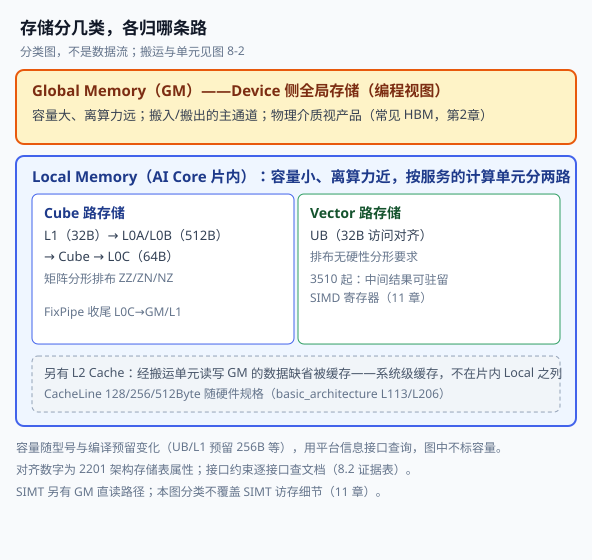
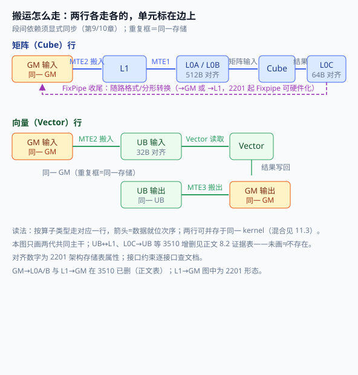

# 第8章 内存与数据通路

> 前几章你学会了「点单、排队、送菜」。这一章回答另外一半：**菜放在哪、怎么从锅里搬上桌**。昇腾算子性能的天花板往往不在「算」，而在「搬」——数据在 GM、L1、UB 之间来回倒腾的带宽和延迟，决定了你到底是「算得快」还是「被搬运卡死」。本章只讲一件事：**把「数据怎么流动」这条通路讲清楚**，并把最值得掌握的 N-DMA 当作主角。读完你会理解为什么算子优化的第一课是「减少搬动」。

## 8.1 在哪里：一个张量的层级地图

第2章见过 AI Core 的存储单元。本章沿一个张量的旅程把它讲全：**分配→搬入→计算→写回→释放**，先解决「在哪里」。

昇腾 AI Core 的存储分两大类[^memlay]：

- **Global Memory（GM）**：编程视图里的 Device 侧全局存储——片上各核共享、容量大、离算力远，是搬入/搬出的主通道。它的物理承载视产品而定（常见为 HBM，见第2章），**「GM」是地址空间概念，不绑定某代存储介质**。
- **Local Memory**：AI Core **片内**存储，小而近。按服务对象分两条路：
  - **Cube 路**：L1 Buffer→L0A/L0B（矩阵输入）→Cube→L0C（结果），由 MTE1/固定单元服务；
  - **Vector 路**：UB（统一缓冲）供 Vector 单元读写（**32 字节访问对齐**）；3510 架构起中间结果还可驻留寄存器（SIMD Register File），不必回 UB。

| 存储 | 服务哪条路 | 存储对齐（2201 架构表） | 说明 |
|---|---|---|---|
| GM | 两路进出 | 1 字节 | 编程视图的全局存储；物理介质视产品（第2章） |
| L2 Cache | （透明） | 按 Cache Line 加载，大小随硬件规格（128/256/512Byte 等[^memlay]） | 经搬运单元读写 GM 的数据缺省被缓存在 L2（[^memlay]）——这是**缓存加载粒度**，与下面接口对齐是两回事 |
| L1 Buffer | Cube 中转 | 32 字节 | 矩阵分片中转；与 UB 的搬运支持按目标产品和接口核对（8.2） |
| L0A/L0B | Cube 输入 | 512 字节 | 左/右矩阵，分形排布（ZZ/ZN）；L0C 见下行 |
| L0C | Cube 输出 | 64 字节 | 结果/中间结果，NZ 排布；FixPipe 收尾 |
| UB | Vector | 32 字节 | Vector 数据主战场；排布无硬性分形要求 |

> 容量随型号与编译选项变化（如 UB 预留 256B/8KB 的差异），**用平台信息接口查询为准**，本书不列通用数字[^memlay]。

**两条对齐分开记**：①**架构存储对齐**（2201 表：UB 32B、L0A/L0B 512B、L0C 64B）是**存储单元属性**；②**具体接口的约束以该接口文档为准**（如 NDDMA float 建议 32B）——存储表≠所有 API 一律同约束。L2 CacheLine 大小随硬件规格（128/256/512Byte 等[^basicarch]）是**缓存加载粒度**，属物理行为；别把三者互推，也别指望单一接口对齐解决所有 CacheLine 问题。



*图 8-1 怎么读：先分 GM/Local；Local 内按算子类型归入两路存储；L2 单独看——缓存 GM 访问，非某核私有。括号内对齐为 2201 存储表属性，接口约束见 8.3。*

### 8.1.1 谁分配：Device 侧与 Host 侧两条生命周期

**Device 侧（显存侧）**：`aclrtMalloc` 家族向 runtime 申请 Device 内存，**用完须 `aclrtFree`**（接口注释明文）[^aclmem]：

- `aclrtMalloc(ptr,size,policy)`：常用；`policy`＝`HUGE_FIRST/HUGE_ONLY/NORMAL_ONLY`（大页优先/仅大页/仅普通页）。
- `aclrtMallocAlign32`：32 字节对齐版，服务搬运对齐。
- `aclrtMallocCached` / `WithCfg` / `ForTaskScheduler`：缓存属性与进阶配置。
- **VMM 独立路径**（大块自管场景）：`aclrtReserveMemAddress`（虚拟预留）→`aclrtMallocPhysical`（物理分配，`aclrtPhysicalMemProp` 带位置/属性）→`aclrtMapMem`（映射）；**三者各有配对释放**（`aclrtReleaseMemAddress`/FreePhysical/Unmap）——这是与 Malloc/Free **并行的另一条生命周期**，不是它的「可选后三步」（机制细节见第6章）。

**Host 侧**：

- `aclrtMallocHost(ptr,size)`：**锁页** Host 内存（系统保证首地址 64B 对齐），**须 `aclrtFreeHost` 释放；不能直接被 Device 访问，须经拷贝**[^hostmem]。
- `aclrtHostRegister(ptr,size,type,&devPtr)`（V2 带 flags）：把已有 Host 缓冲注册给 Device——`MAPPED` 拿到映射设备指针、`PINNED` 防换出等[^aclmem]。

**何时可读（仅限 `aclrtMemcpyAsync` 族文档适用范围；同步接口 `aclrtMemcpy` 不适用此表）**[^memcpydoc]：

| 场景 | 返回时机 | 你要做什么 |
|---|---|---|
| 拷入/拷出目的或源是**锁页** Host 内存（`aclrtMallocHost`/注册 PINNED） | **异步**：接口成功＝任务下发成功 | **须 `aclrtSynchronizeStream`（或事件等待）确认执行完成**，之后 Host 侧才可读/可复用 |
| Host 内存为**普通 malloc（非锁页）** | **拷贝完成后才返回**（同步语义） | 返回即可用；代价是调用线程被阻塞 |
| Device→Device 拷贝 | 异步任务 | 流内后续任务自然有序；跨流先事件同步再使用 |

**两种时机不要混写**：锁页让调用方早返回，代价是显式同步；非锁页由接口替你等。两点边界：①**Host 缓冲能否复用/改写，取决于既有访问该缓冲的任务是否已结束**（包括尚未完成的读取与写入），不是「是否还提交新任务」；②**事件须 Host 侧同步等待完成**（如 `aclrtSynchronizeEvent`）才构成 Host 可读依据，把事件记入流（StreamWait 类）只约束**设备侧**执行顺序，不代表 Host 已可读[^memcpydoc]。

::: tip 分配策略一句话
大页与普通页是**物理分页/TLB 层面的取舍，与 swap 不是一回事，也不保证收益**，须按第19章测量方法实测；`Align32` 服务接口对齐要求，**不是 CacheLine 对齐的通用解**；复用 Host 缓冲走 HostRegister 并注意 8.1.1 复用条件。
:::

## 8.2 核内搬运：通路、单元与同步

搬入 Local 后、计算前后，**数据在片内怎么走由架构决定**——这是本章第二张地图。以 2201 架构为例[^memlay][^mte]：

- **进**：MTE2 负责 GM→{L1, L0A/B}（分形/CacheLine 对齐）与 GM→UB（CacheLine 粒度）；
- **核内**：MTE1 负责 L1→L0A/L0B（及 L1→BT）；
- **出**：MTE3 负责 UB→GM、L1→GM；
- **收尾**：FixPipe 从 L0C→{GM, L1}，支持随路格式/分形转换（2201 起 Fixpipe 可硬件化，输出分形满足诉求）。

**通路存在性要「架构说明×接口支持」相互印证**，单文档不下结论[^arch][^l1ub]：

| 通路 | 2201（架构带宽表） | 接口证据 | 3510（架构表） |
|---|---|---|---|
| GM→L0A/L0B | 未单列（概览载） | — | 特性明载**删除** |
| L1→GM | 有（MTE3） | — | 特性明载**删除** |
| UB→L1 | 接口已列 A2/A3 系列支持（`DataCopy UBToL1`） | cube_compute_load 文档 | 带宽表列 UB→L1 MTE3 128B/cyc——接口支持早于该表，物理通路是否同一实现以架构文档/实测为准 |
| L1→UB | 带宽表未列 | `DataCopyL1ToUB` **仅 950 系列支持**（A3/A2 不支持） | 带宽表列 L1→UB MTE1；特性自述「增加」 |
| L0C→UB | 无（FixPipe→GM/L1） | — | 特性自述**新增**（PIPE_FIX） |
| L0C→L1 | **已有**（FixPipe→L1，概览） | — | 带宽表亦列（非新增） |
| 核间同步 | 依赖 GM 全局内存需核间同步控制（架构文档「核间同步」节） | — | SSBuffer（其文档自述） |

**结论**：编程前按**目标产品**核对**接口支持表与架构说明**——接口支持≠全部硬件能力、表缺条目≠通路不存在，不一致以产品实测/官方澄清为准，不外推。图 8-2 只画两代共同主干。

**比通路更关键的是同步**：各执行单元（MTE2/Vector/MTE3…）**异步并行**，读写 Local Memory 的依赖要靠显式同步协调——架构文档给出的标准例子：GM→UB 搬运**完成后**才能启动 Vector 计算，Vector 完成**后**才能 UB→GM 回写[^arch]。这些队列/流水事件如何写，**属第9/10章 Ascend C 的同步机制**，本章只立「存在依赖、须显式同步」的观念；Host 侧流/事件（4章）管的是另一头的可见性，**不要拿 Host sync 替代核内同步**。



*图 8-2 怎么读：先选行（矩阵/向量），沿箭头看数据就位次序——GM 搬入由 MTE2 承担；UB 搬出由 MTE3 承担，L0C 搬出由 FixPipe 承担，行内读写是计算单元对 L0/UB 的直接访问；重复框=同一存储。段间依赖须显式同步（第9/10章）。*

## 8.3 搬运进阶：N-DMA 与对齐

`DataCopy` 除连续形式外也有带步长形式（见接口文档）；**NDDMA（多维）在搬运中硬件完成 Padding/Transpose/Broadcast/Slice**，核心是「**步长即变换**」：转置=配置输入与输出的维度步长、广播=被广播维源 stride 置 0、切片=源长度取切片、Padding=配左右 padding[^nddma]。维度上限以 API 为准：**`dim∈[1,5]`**。

以官方样例场景 1（Padding，输入 `[16,32]`→输出 `[32,64]` 四周填 0）看参数面板[^nddma2]：

```cpp
// [示意代码] 场景1：Padding（参数语义见脚注文档；须按所在架构核对支持）
AscendC::NdDmaLoopInfo<2> loopInfo{
    {1, 32},   // 源步长
    {1, 64},   // 目的步长
    {32, 16},  // 源各维长度
    {15, 13},  // 左/上 padding
    {17, 3}    // 右/下 padding
};
AscendC::NdDmaParams<float, 2> params{loopInfo, 0};  // padding 常数 0
AscendC::DataCopy<float, 2>(xLocal, xGm, params);
```

转置通过为输入与输出设置不同的维度步长实现，具体配置见样例；最近邻填充把 `NdDmaConfig.isNearestValueMode` 置 true[^nddma2]。**限制随接口文档**：b64 须关最近邻且常数为 0、float 建议 32B 对齐、`loopRpSize<256` 等[^nddma3]。五场景速查：Padding 常数/最近邻、Transpose 换 stride、Broadcast 置 0、Slice 改长——**能交给 N-DMA 的变换别手写循环**。

**对齐回到 8.1 的两条**：具体接口的对齐要求是**调用约束**，须查该接口对目标存储位置的规定；CacheLine 是**缓存粒度**，影响的是「一次多搬少搬」。工程顺序：先满足接口对齐，再按 CacheLine 排布数据减少跨线搬运。

**乒乓**：搬运单元与 Vector/Cube 可并行，双缓冲（`TPipe::InitBuffer` 两块）为相邻分块提供独立缓冲；真正的搬算重叠还须**正确的队列/依赖编排且缓冲资源足够**，并非分两块就自动重叠[^pong]。效果须按第19章方法实测。

## 8.4 何时可读、怎样复用

把前文收拢成「读时机清单」：

- **核内**：上游搬运/计算完成——靠第9/10章流水同步，**不是 Host sync**；
- **Host 读 D2H 结果**：按 8.1.1 表——锁页异步须 `aclrtSynchronizeStream` 后读；非锁页返回即完成；
- **跨设备/跨算子**：优先**复用**——片内结果留 UB/L1 续算（配合 8.2 的通路），跨算子共享走框架/第2章互联（HCCS/URMA 的 one-sided 是**方向性机制**，能否免拷取决于部署与数据布局，本书不给出「必然零拷贝」的承诺）。

一句话：**能留片内别回 GM，能复用别重拷，读之前先对表**。

## 8.5 后端衔接

本章三根线通向后面：**N-DMA/通路**→第9章起的搬运 API 实战；**对齐/乒乓**→第19章性能画像的头号疑犯；**复用与生命周期**→kernel 融合（少搬一次）与第6章驱动侧地址管理。第2章补物理与互联，第4章补流/事件 API——各章分工如图 8-1 的两条路，不再交叉重复。
## 陷阱与注意（汇总）

| 坑 | 症状 | 对策 |
|---|---|---|
| 把 GM 当具体介质 | 纠结「GM 是不是 HBM」 | GM=编程视图，物理承载视产品（第2章），不绑定（8.1） |
| 通路按上代经验写 | 新架构上通路不存在/绕路 | 每架构查带宽/特性与接口支持表；3510 删 GM→L0A/B、L1→GM，增 L0C→UB 等（8.2） |
| 锁页异步当同步 | 下发成功就读，读到旧数据 | 所引 `aclrtMemcpyAsync` 文档适用范围内：锁页须 `aclrtSynchronizeStream` 后再读；非锁页返回即完成（8.1.1）；**同步接口 `aclrtMemcpy` 不适用此表** |
| 拿 Host sync 替代核内同步 | 核内读到半成品 | 核内依赖用第9/10章流水/队列事件；两套机制各管各段（8.2/8.4） |
| 对齐约束张冠李戴 | 换接口/换存储就违例 | 对齐随「接口×存储」查各自文档，不跨接口泛化（8.1/8.3） |
| 维数写超 5 | N-DMA 编译错 | `dim∈[1,5]`；其余限制按接口文档（8.3） |
| VMM 与 Malloc 混释放 | 泄漏/双重释放 | reserve/physical/map 各有配对释放，两条生命周期不混（8.1.1） |
| 双缓冲=自动重叠 | 依旧串行等搬运 | 重叠须正确的队列/依赖编排且资源允许；双缓冲只是资源准备的一部分（8.3） |

## 本章小结

一个张量的旅程：**在哪里**——GM 是编程视图，片内分 Cube/Vector 两路，接口对齐与缓存粒度分开；**谁分配**——Device 侧 Malloc/Free（VMM 独立成路径）、Host 侧锁页/注册，读时机按接口文档分情况；**怎样搬**——通路与带宽以架构表为准，依赖须显式同步，N-DMA 把搬与变合成一步；**何时可读复用**——核内靠流水同步、Host 看拷贝语义、跨设备优先复用。测量方法见第19章。

## 本章来源与进一步阅读

[^memlay]: 存储层级与预留：`asc-devkit/docs/zh/guide/programming_guide/advanced_programming/hardware_implementation/basic_architecture.md`（Local/Global、L2 CacheLine 128/256/512B L113/L206）；UB/L1 预留 256B/8KB 与平台信息查询：`asc-devkit/docs/zh/guide/programming_guide/advanced_programming/hardware_implementation/architecture_spec/npu_arch_2201.md` L55–59、`asc-devkit/docs/zh/api/Utils-API/platform_info/platform_info.md`。
[^arch]: 架构差异实证：`asc-devkit/docs/zh/guide/programming_guide/advanced_programming/hardware_implementation/architecture_spec/npu_arch_2201.md`（带宽表 L65–69：L1→L0A 256/L0B 128 B/cyc；Fixpipe 硬化 L97–104；**同步必要性例 L154–159**：GM→UB→Abs→UB→GM 各段须同步）；`asc-devkit/docs/zh/guide/programming_guide/advanced_programming/hardware_implementation/architecture_spec/npu_arch_3510.md`（特性 L13「增加 L0C→UB、UB↔L1」；带宽表 L125–137 含 L1→UB MTE1/UB→L1 MTE3/L0C→UB、L0C→L1 PIPE_FIX；删 GM→L0A/B、L1→GM L11–12；SIMD Register File L17；SSBuffer 核间 L263）。**注意 L0C→UB 为单向**。
[^l1ub]: L1/L0C 与 UB 通路接口证据：`asc-devkit/docs/zh/api/SIMD-API/basic_api/data_move_guide/L1_or_L0C_UB_data_move.md`（表1：UB→L1 连续/高维/ND2NZ/Pad；L0C→UB 随路转换与量化；**L1→UB=DataCopyL1ToUB**）；`asc-devkit/docs/zh/api/SIMD-API/basic_api/cube_compute_ISASI/cube_compute_store/DataCopyL1ToUB.md` 产品支持表（**仅 Ascend 950PR/DT 支持，A3/A2 等不支持**）；`asc-devkit/docs/zh/api/SIMD-API/basic_api/cube_compute_ISASI/cube_compute_load/DataCopy_UBToL1_continuous.md`（UB→L1，A3/A2 支持）。L1→UB 接口支持与架构带宽表分开引用，不互推。

[^mte]: 概览级通路（MTE1/2/3/FixPipe 分工）：`asc-devkit/docs/zh/guide/programming_guide/advanced_programming/hardware_implementation/basic_architecture.md` L186–206；**具体带宽/存在性以各架构表（[^arch]）为准，概览不替代**。
[^aclmem]: 内存 API：`runtime/include/external/acl/acl_rt.h`——`aclrtMalloc` L1905（释方约定 L1890–91）、`Align32/Cached` L1916 区、`aclrtMemMallocPolicy`（HUGE_FIRST/HUGE_ONLY/NORMAL_ONLY）、`aclrtMallocConfig/Attr` L202–219；VMM：`aclrtReserveMemAddress` L2586/`aclrtReleaseMemAddress` L2600/`aclrtMallocPhysical` L2618（`aclrtPhysicalMemProp` L369–375）/`aclrtMapMem`（L2584 see）；Host 注册：`aclrtHostRegister` L2052/`V2` L2064（flags `ACL_HOST_REG_MAPPED/IOMEMORY/READONLY/PINNED` L74–77、枚举 L195–200）。
[^hostmem]: Host 内存：`runtime/include/external/acl/acl_rt.h` L2168–2186（`aclrtMallocHost`：锁页、64B 对齐、**不能直接用于 Device 须显式拷贝**、`aclrtFreeHost` 释放）权威表述；`runtime/docs/zh/api_ref/11-02_host_memory_management.md` L5–6/50/69（锁页定义与过量代价）。
[^memcpydoc]: 拷贝语义（锁页/非锁页时机分歧）：`runtime/docs/zh/api_ref/11-03_memory_copy_and_set.md` L140/L213——**锁页（含 `aclrtMallocHost`）→异步，成功=下发成功，须 `aclrtSynchronizeStream`（`06_stream_management.md`）后才可读；非锁页（malloc）→拷贝完成才返回**；D2D 64B 对齐等限制同文件；`aclrtMemcpyAsync` 族清单 L5–17。
[^nddma]: NDDMA 概念与场景（二级来源）：`cann-learning-hub/blogs/operator/nddma_introduction/深入理解NDDMA多维数据搬运-昇腾算子开发性能优化利器.md`；本书不引用其性能倍数。
[^nddma2]: 官方样例（Padding/Nearest/Transpose/Broadcast/Slice 参数）：`asc-devkit/examples/01_simd_cpp_api/03_basic_api/00_data_movement/data_copy_gm2ub_nddma/`。
[^nddma3]: NDDMA 参数语义与限制：`asc-devkit/docs/zh/api/SIMD-API/basic_api/memory_vector_compute/data_move/DataCopy_GMToUB_NDDMA.md`（`NdDmaLoopInfo<dim>` dim∈[1,5]；`NdDmaConfig.isNearestValueMode`/`loopRpSize`<256/`unsetPad`；b64 与 float 32B 建议）。
[^pong]: 双缓冲与 `TPipe::InitBuffer`：`asc-devkit/docs/zh/api/SIMD-API/`（资源管理类接口）及样例 `asc-devkit/examples/01_simd_cpp_api/03_basic_api/00_data_movement/`；收益须实测（第19章）。
- 继续读：第2章（HBM/互联）、第4章（流/事件 API）、第6章（VMM 与驱动侧地址管理）、第9/10章（核内同步的写法）、第19章（实测方法）。
