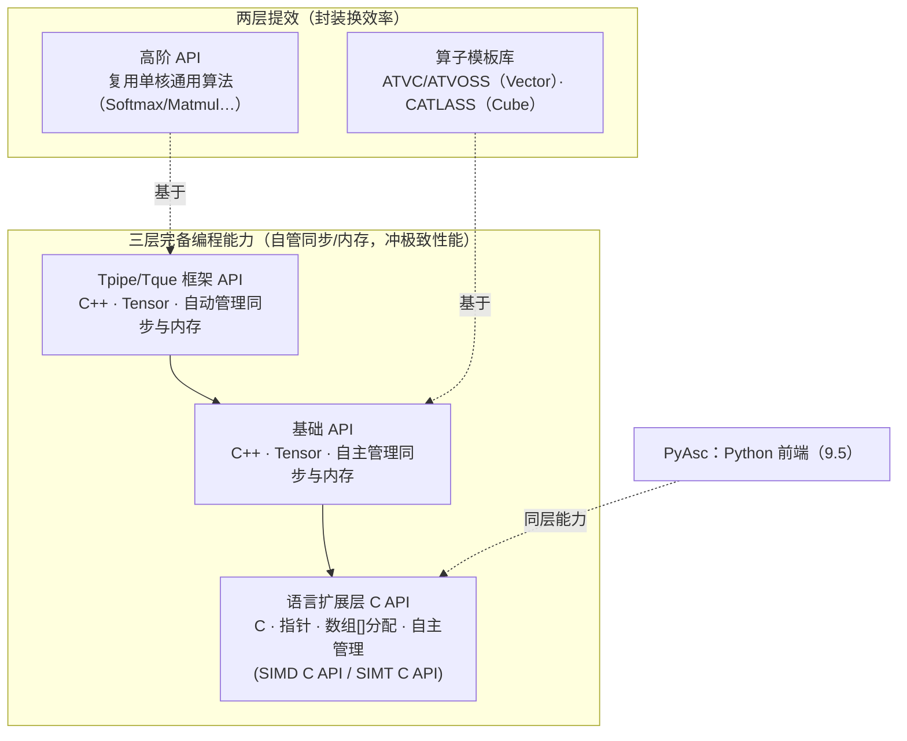
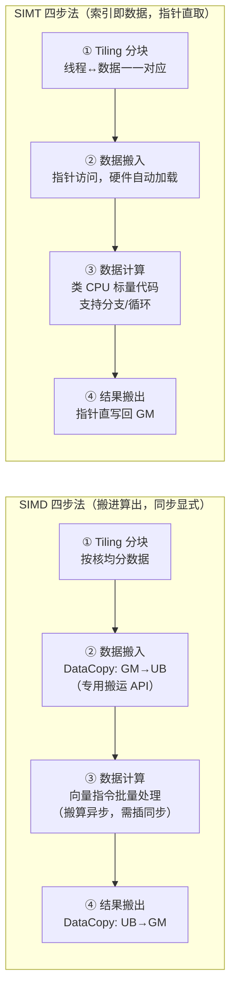
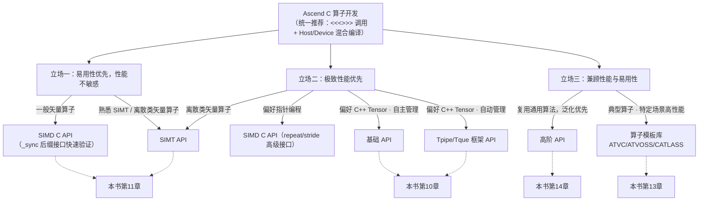
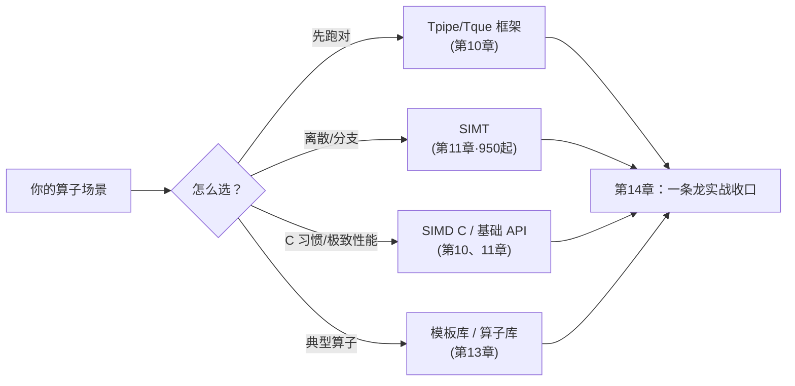

# 第9章 编程模型与 API 选择

> 第三编开篇。写算子之前先回答一个问题：**同样的 Add，仓库里为什么有好几种写法？**这一章给出全编的地图——Ascend C 的多层级 API 长什么样、各自为谁而生、你怎么在 5 分钟内选对入口。

## 本章目标与阅读指引

- **认知**：建立 Ascend C「三层完备 + 两层提效」的 API 分层心智，知道每层为谁而生（9.1）。
- **认知**：理解 host/device 分工与 `<<<>>>` 核启动，把第二编的运行时链路（第3、5章）接到 device 代码上（9.2）。
- **实操**：掌握 SIMD/SIMT 两种并行模型的「编程四步法」，能读懂仓库里任一 `.asc` 样例的骨架（9.3）。
- **实操**：知道 Tiling 是什么、host 侧要算什么账（9.4）。
- **视野**：了解 PyAsc Python 前端的定位（9.5），最后拿到一棵选型决策树（9.6）。

**本节要点**：本章是地图章——目标是「选对层级」，不追求讲透每一层；每层的机制深挖分别在第 10 章（C++ Tensor 路线）、第 11 章（C 路线与 SIMT）、第 13 章（模板库与算子库）。

## 9.1 API 分层总览：三层完备 + 两层提效

第 1 章说过，Ascend C 是对 C/C++ 的**最小化扩展**：既支持基于指针的 C 语言习惯，也支持基于 Tensor 的 C++ 范式[^overview]。官方文档把它拆成五个可选择的层级[^choose]：


*图 9-1 Ascend C 多层级 API 地图：越靠下越贴近硬件、越靠上越省事；自上而下 = 放弃框架便利、换回控制权。*

五个层级的一句话画像[^choose]：

| 层级 | 语言/范式 | 同步与内存 | 目标用户 | 典型入口 |
|---|---|---|---|---|
| Tpipe/Tque 框架 API | C++ / Tensor | **框架自动管理** | 算子库开发者 | `kernel_operator.h` + `TPipe`/`TQue` |
| 基础 API | C++ / Tensor | **自主管理**（`LocalMemoryAllocator` 等） | 算子库开发者 | `include/basic_api`、`tensor_api` |
| 语言扩展 SIMD C API | C / 指针 | 自主管理（另有 `_sync` 简化口） | 熟悉 C 习惯的开发者 | `c_api/asc_simd.h`，`asc_xxx` 前缀 |
| 语言扩展 SIMT C API | C / 线程 | 线程模型，硬件调度 | 有 CUDA/SIMT 经验者 | `include/simt_api`，950 起支持 |
| 高阶 API / 模板库 | C++ 封装 | 封装内部处理 | 算法开发人员 | `impl/adv_api`；ATVC/ATVOSS/CATLASS |

两个关键事实先钉死：

1. **「完备」是三层共享的性质**。Tpipe/Tque、基础 API、语言扩展层都提供对芯片的完备编程能力——区别不在「能做什么」，而在「同步与内存谁管」[^choose]。框架层帮你管（易用、不易错），基础层/C 层自己管（灵活、可榨性能）。
2. **提效层是「站在完备层肩上」的封装**。高阶 API 复用单核通用算法实现；模板库给出典型算子的端到端最佳实践（Vector 类 ATVC/ATVOSS、Cube 类 CATLASS）——它们不在本地开源基线内，本章只讲定位与入口，内部实现到第 13 章结合 ops-nn 横览时再谈。

> 💡 **为什么要分层，而不是一条路走到黑？**官方设计理念写得直白：**没有银弹**——不同场景对性能与开发效率的取舍不同；同时**渐进式学习**——新手从易用层快速验证算法，专家向下钻取精细调优[^choose]。这正好对应本书两类读者：先在高阶 API/框架层把算子跑起来（第 14 章），再下潜到基础层/C 层做性能逼近（第 11、15 章）。

## 9.2 host/device 分工与 kernel 启动

基于昇腾的应用天然分两半[^overview]：**Host 代码**跑在 CPU 上（设备资源管理、内存搬运、任务调度——正是第二编 ACL/runtime 那条链路），**Device 代码**跑在 NPU 上（真正的计算 kernel）。两者通常在**同一个工程里混合编译**，这也是官方对所有算子的推荐开发方式：**基于 `<<<>>>` 调用和 Host/Device 混合编译**[^choose]。

device 侧的核函数长这样（摘自 Tpipe/Tque 版 Add 样例）[^tque]：

```cpp
// [需真机验证] 摘自 asc-devkit/examples/01_simd_cpp_api/00_introduction/01_add/add_tpipe_tque/add_tpipe_tque.asc
__global__ __vector__ void add_custom(__gm__ uint8_t* x, __gm__ uint8_t* y,
                                      __gm__ uint8_t* z, uint32_t totalLength)
{
    AscendC::TPipe pipe;
    AscendC::TQue<AscendC::TPosition::VECIN, 1> inQueueX;
    AscendC::TQue<AscendC::TPosition::VECIN, 1> inQueueY;
    AscendC::TQue<AscendC::TPosition::VECOUT, 1> outQueueZ;
    AscendC::GlobalTensor<float> xGm, yGm, zGm;

    uint32_t blockLength = totalLength / AscendC::GetBlockNum();   // 本核分片长度
    xGm.SetGlobalBuffer((__gm__ float*)x + blockLength * AscendC::GetBlockIdx(), blockLength);
    // ... yGm/zGm 同样按核号偏移，保证各核访问互不重叠的数据分片
    pipe.InitBuffer(inQueueX, 1, blockLength * sizeof(float));     // 队列申请 UB 缓冲
}
```

三处细节值得圈出来：

- **`__global__ __vector__`**：声明这是一个向量化核函数入口。同一份核函数被多个 AI Core 各跑一份（SPMD 模型），靠 `GetBlockIdx()`/`GetBlockNum()` 把数据切开——每个核处理互不重叠的分片[^overview]。
- **`__gm__` / `__ubuf__`**：地址空间标注。第 2 章的存储层次（GM→L1→UB→寄存器）在语言层就是靠这些标注区分的——`__gm__` 指向全局内存，`__ubuf__` 指向片上 UB（第 11 章的 C API 里会大量见到）。
- **host 侧用 `<<<...>>>` 语法糖启动核函数**。真码里长这样：SIMD 型是 `add_custom<<<numBlocks, 0, stream>>>(xDevice, yDevice, zDevice, totalLength)`——三个槽位分别是**核数、动态 UB 大小、流**，分块参数（如 `totalLength`）走核函数实参传入[^tque]；SIMT 型则是 CUDA 风格的 `gather_1d_custom<<<blocks_per_grid, threads_per_block, dyn_ubuf_size, stream>>>(...)`[^simt]。这行语法背后正是第 3 章拆过的那条链路：aclnn/ACL → runtime → SQE → AI Core。你在第 4 章见过的 `aclrtLaunchKernel`，就是这颗语法糖的「生肉版」。

SIMD 与 SIMT 的核函数形态不同。SIMD 核函数是「一个核一份程序、批量处理数据」；SIMT 核函数则是「一个线程一个数据元素」，写起来和 CUDA 几乎一样[^overview]：

```cpp
// [需真机验证] 摘自 asc-devkit/examples/03_simt_api/00_introduction/01_gather/basic_gather/gather_1d/gather_1d.asc
__global__ void gather_1d_custom(float* input, int32_t* index,
                                 float* output, uint64_t index_total_length)
{
    int32_t idx = blockIdx.x * blockDim.x + threadIdx.x;  // 全局线程号
    if (idx >= index_total_length) {
        return;                                           // 分支直接 return
    }
    output[idx] = input[index[idx]];                      // 指针直取，无专用搬运 API
}
```

## 9.3 两种并行模型与「编程四步法」

选 API 之前必须先选**并行模型**。第 2 章讲过 AI Core 的组成（标量/向量/矩阵单元 + 本地存储），这里落到编程视角[^overview]：

- **SIMD（单指令多数据）**：数据并行。一条指令同周期对多个同构数据做同一操作。适配**规整、密集、少分支**的场景——矩阵乘、卷积、逐元素变换。是全系列标准支持的主流范式，矩阵单元仅支持 SIMD。
- **SIMT（单指令多线程）**：线程并行。一条指令驱动多个独立线程，每个线程处理一个数据元素，**支持 if-else 独立分支**。适配**离散访存、分支密集、稀疏计算**——gather/scatter、稀疏卷积等。**架构差异**：950（dav-3510）之前的芯片向量单元只有 SIMD；950PR/950DT 起才 SIMD/SIMT 双支持，官方称之为「SIMD 为主、SIMT 为辅」的新同构模型（SIMD 配置超过 90% 算力）[^overview]。

两种模型各有固定的「编程四步法」，值得整段背下来[^overview]：


*图 9-2 SIMD 与 SIMT 的编程四步法对照：核心差别在「搬运是否显式、同步是否显式」。*

SIMD 路线里，「搬」和「算」是异步的两条流水——这正是第 8 章乒乓与 N-DMA 的用武之地；SIMT 路线里硬件自动处理加载，代价是你失去了对搬运策略的控制权。**这个差别决定了两条路线的性能天花板与适用边界**，第 11 章展开。

## 9.4 Tiling：host 侧的「分块账本」

四步法的第一步都是 **Tiling（分块）**，但它发生在哪一侧？答案是 host。

**Tiling = 把全局数据切成适配硬件的块，并为每块算出参数**。具体包括[^overview]：

- **按核切分**：`totalLength / GetBlockNum()`，让每个 AI Core 拿到均衡的分片（9.2 代码里的 `blockLength` 就是它）；
- **按 UB 容量切块**：单核分片还可能超过 UB 容量，要在核内再循环分批搬运/计算（第 8 章乒乓的缓冲深度、`InitBuffer` 的队列深度都在这里定）；
- **对齐与格式账**：32B 对齐（第 8 章 Cache Line）、数据类型、N-DMA 的 stride 配置——host 算好，device 照单执行。

这笔账由谁算好、怎么传给 device？工程实践里 host 侧有一个 **tiling 函数**（算出 `tiling struct`），经 `aclrtLaunchKernel` 的参数通道传给核函数——第 4 章 `aclrtLaunchKernel` 签名里的 `tiling` 参数、第 5 章 SQE 的 Param 段，接的正是这一环。第 10 章会用真实样例走完「host 算 tiling → device 用 tiling」的完整回路；高阶 API 则把常见算子的 tiling 账本预写好了，你只提供 shape（9.6 决策树里「快速验证」路径的由来）。

> 📌 一句话：**Tiling 是 host 侧写、device 侧用的「分块账本」；账本算得好不好，直接决定 9.3 四步法里搬运和计算的效率。**

## 9.5 PyAsc：Python 前端

不想写 C++/C 呢？asc-devkit 官方 README 给出了 Python 路线：**PyAsc**[^readme]。

- **定位**：基于 Python 前端提供芯片底层**完备编程能力**——它对标的是三层完备 API，而不是「再包一层的胶水库」；
- **演进方向**：逐步基于 Layout 完善 Tensor 编程能力，并新增 SIMT 编程等能力；
- **仓库**：`gitcode.com/cann/pyasc`（外部仓，不在本地基线内，本章只给入口）。

与第六编的 PyPTO（第 21 章）分工不同：PyAsc 是 **device 算子级**的 Python 前端（写 kernel 本体），PyPTO 是 **ISA/编译后端**路线（第 20 章 PTO 虚拟 ISA 的 Python 投影）。两者共同回答的问题是「能不能不用 C++ 也能写出高性能算子」。

## 9.6 按场景选 API：决策树

官方文档给了一棵决策树[^choose]，按「易用性优先 / 极致性能优先 / 兼顾」三种立场分流。结合本书语境整理如下（图中「离散类矢量算子」指 gather/scatter 等访存不规整的场景）：


*图 9-3 API 选型决策树（改绘自官方 `asc_how_to_choose_api.md`，虚线标注本书后续章节入口）。*

配套的快速决策维度[^choose]：

| 你的情况 | 推荐 | 理由 |
|---|---|---|
| 算子是离散/分支密集型（gather、稀疏） | SIMT API | 充分发挥 SIMT 在离散场景的优势，匹配业界线程编程习惯 |
| C 语言指针习惯 + 要极致性能 | SIMD C API | 匹配 C 习惯；`repeat`/`stride` 接口精细控制布局 |
| C++ Tensor 习惯 + 要极致性能 | 基础 API | 自主管理同步/内存，换取最优调度 |
| C++ Tensor 习惯 + 想省心 | Tpipe/Tque 框架 | 队列托管同步与内存，不易错 |
| 先验证算法对不对 | 高阶 API / 模板库 | 通用算法现成，开发效率最高 |

作为对照，再看同一颗 Add 在 **SIMD C API**（指针路线）里的样子——与 9.2 的 Tensor 路线（`TPipe`/`TQue`/`LocalTensor`）逐行对应着读，两条路线的差异就具体了[^simdsync]：

```cpp
// [需真机验证] 摘自 asc-devkit/examples/02_simd_c_api/00_introduction/01_add/c_api_sync_add/c_api_add.asc
// （省略了 include/常量定义：TILE_LENGTH=2048、NUM_BLOCKS=8，及末尾写回段）
#include "c_api/asc_simd.h"

__vector__ __global__ __aicore__ void add_custom(__gm__ float* x, __gm__ float* y, __gm__ float* z)
{
    asc_init();                                    // C API 轻量初始化
    __ubuf__ float xLocal[TILE_LENGTH];            // UB 缓冲：数组语法直接分配
    __ubuf__ float yLocal[TILE_LENGTH];
    __ubuf__ float zLocal[TILE_LENGTH];

    uint32_t blockLength = TILE_LENGTH * NUM_BLOCKS / asc_get_block_num();
    asc_copy_gm2ub_sync(xLocal, (x + asc_get_block_idx() * blockLength), blockLength * sizeof(float));
    asc_copy_gm2ub_sync(yLocal, (y + asc_get_block_idx() * blockLength), blockLength * sizeof(float));
    asc_add_sync(zLocal, xLocal, yLocal, blockLength);   // _sync 后缀：同步版计算接口
    // ... 结果写回 GM（asc_copy_ub2gm_sync）
}
```

注意两处对照：**分配**——Tensor 路线是 `pipe.InitBuffer` + `AllocTensor`，这里是 `__ubuf__ float arr[N]` 数组声明；**同步**——Tensor 路线由 `EnQue/DeQue` 隐式驱动，这里是显式的 `_sync` 后缀接口（真要榨性能时再去掉后缀、用 `repeat/stride` 高级接口手工排程，见第 11 章）。

**本书主推的学习路径**与官方「渐进式」理念一致：先用 **Tpipe/Tque 框架层**把算子写对（第 10 章），下潜 **基础 API** 理解同步与内存到底发生了什么（第 10 章），需要离散/分支能力时转 **SIMT**、需要贴近 C 习惯时用 **SIMD C API**（第 11 章），典型算子直接抄 **模板库/算子库** 的作业（第 13 章），最后在第 14 章用一条龙实战把整条路径走通。

## 陷阱与注意（汇总）

| 坑 | 症状 | 对策 |
|---|---|---|
| 把五个层级当成五种「能力等级」 | 以为高阶 API「性能更弱所以不完备」 | 三层完备层能力等价，差异只在同步/内存归谁管；高阶/模板库是封装（9.1） |
| 在 950 之前的芯片上写 SIMT | 编译或运行失败 | 先查架构：SIMT 仅 dav-3510（950PR/950DT）起支持；A2/A3（dav-2201）只有 SIMD（9.3） |
| host/device 职责混淆 | 在 device 里做分块决策、在 host 里写计算循环 | 记住「Tiling 账本 host 写、device 用」；`<<<>>>` 只负责启动（9.2、9.4） |
| 忘了 SIMD 搬算异步 | 搬运没完成就开算，结果随机 | SIMD 四步法显式插同步；或直接用框架层队列托管（9.3、第10章） |
| 直接上手基础 API/C API | 同步漏插、内存泄漏，查一天 | 渐进式学习：先框架层跑对，再下潜（9.6） |

## 本章小结

::: tip 一句话总结
**Ascend C = 三层完备（Tpipe/Tque 框架、基础 API、语言扩展 SIMD/SIMT C——能力等价，差别是同步与内存归谁管）+ 两层提效（高阶 API、算子模板库）+ 一个 Python 前端（PyAsc）。Host 管资源与 Tiling 账本，Device 跑核函数，`<<<>>>` 是两者的接头暗号；SIMD 四步法「搬进算出、同步显式」，SIMT 四步法「索引即数据、指针直取」。选层级的口诀：先易用跑对，再下潜榨性能，典型算子抄模板库。**
:::


*图 9-4 本章记忆图：一个入口（`<<<>>>` 混合编译）、一棵决策树、一条渐进式路径。*

## 本章来源与进一步阅读

[^choose]: 多层级 API 定义、三层完备/两层提效划分、决策树与适用维度（本文图 9-1/9-3 的改绘底稿）：`asc-devkit/docs/zh/asc_how_to_choose_api.md`（官方文档，CANN Open 2.0）。
[^overview]: 编程模型概述：host/device 分工、SIMD/SIMT 概念与四步法、AI Core 组件与 950 起双模型架构差异（`<!-- npu="950" -->` 标记段）、`<<<>>>` 语法糖说明：`asc-devkit/docs/zh/guide/programming_guide/programming_model/{programming_model_overview.md,heterogeneous_system.md}`（官方文档）。
[^tque]: Tpipe/Tque 框架版 Add 样例（`__global__ __vector__` 核函数、TPipe/TQue、SetGlobalBuffer、InitBuffer、AllocTensor/DataCopy/EnQue/DeQue 全流程，9.2 代码摘自前 28 行）：`asc-devkit/examples/01_simd_cpp_api/00_introduction/01_add/add_tpipe_tque/add_tpipe_tque.asc`（CANN Open 2.0）。
[^simt]: SIMT Gather 样例（`blockIdx/blockDim/threadIdx` 线程模型、指针直访、分支 return，9.2 代码摘自其核函数段）：`asc-devkit/examples/03_simt_api/00_introduction/01_gather/basic_gather/gather_1d/gather_1d.asc`（CANN Open 2.0）。
[^readme]: PyAsc 定位（Python 前端、底层完备编程能力、Layout 化 Tensor 与 SIMT 演进方向）与 Ascend C 学习路径：`asc-devkit/README.md`、`asc-devkit/docs/zh/guide/getting_started/ascend_c_overview_and_learning_path.md`（官方文档）。
[^simdsync]: SIMD C API `_sync` 同步接口与 `__ubuf__` 数组分配（对照第 11 章展开）：`asc-devkit/examples/02_simd_c_api/00_introduction/01_add/c_api_sync_add/c_api_add.asc`、`asc-devkit/include/c_api/asc_simd.h`（CANN Open 2.0）。

- **下一站**：第 10 章「核心编程能力详解」——进 `impl/` 与 `include/`，把 Tpipe/TQue 的同步语义、Tensor 体系、搬运 API（含第 8 章预支的 N-DMA 实操）一次讲透。
- **交叉引用**：`<<<>>>` 背后的执行链路见第 3 章 3.4 与第 5 章 5.2；`aclrtLaunchKernel` 的 tiling 参数见第 4 章 4.5；SIMT 架构差异见第 2 章 2.5 与能力菜单。
