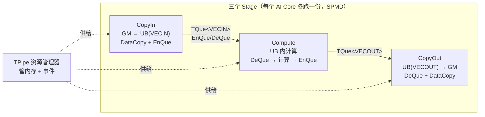
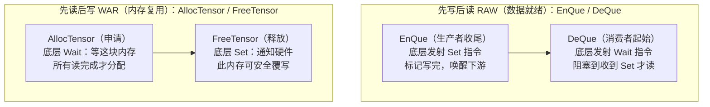
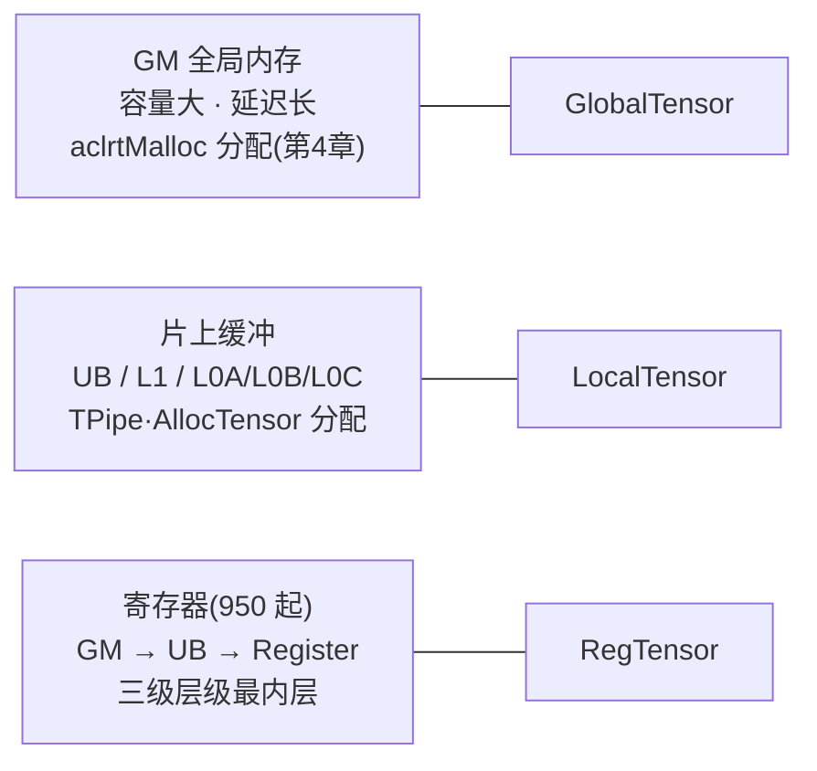
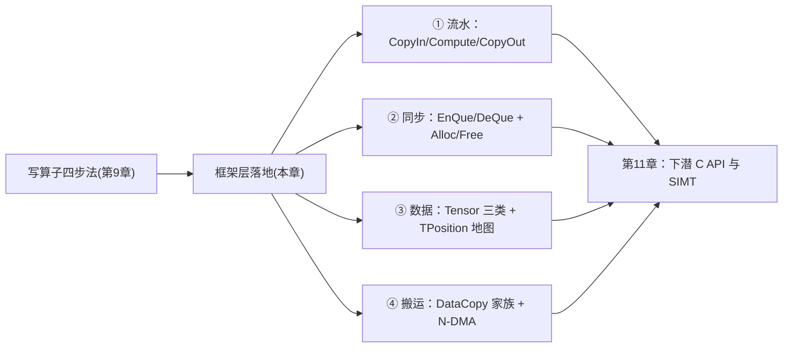

# 第10章 核心编程能力详解

> 第 9 章选定了入口，这一章把 **Tpipe/Tque 框架层**的工作机制拆开：队列为什么能替你管同步、Tensor 到底封装了什么、计算与搬运 API 家族怎么检索、以及第 8 章预支的 N-DMA 实操债在这里还上。

## 本章目标与阅读指引

- **底层**：理解 TPipe/TQue 的队列管道原理——`EnQue/DeQue`、`AllocTensor/FreeTensor` 两组 API 底下各封了一对什么硬件同步指令（10.1、10.2）。
- **实操**：掌握 Tensor 体系（GlobalTensor/LocalTensor/RegTensor）与基础 API 的自主管理路线（10.3）。
- **实操**：会检索计算 API 家族，会用 Matmul 高阶 API 表达 Cube 流程（10.4）。
- **实操**：独立完成 N-DMA 五场景配置，兑现第 8 章的搬运 API 债（10.5）。

**本节要点**：本章锚定「三组配对 API + 一张 TPosition 地图」：`EnQue/DeQue`、`AllocTensor/FreeTensor`、`SetFlag/WaitFlag`。读懂它们，`kernel_operator.h` 里上千个接口就有了检索骨架。

## 10.1 TPipe/TQue：把流水线装进队列

第 9 章的四步法在框架层被固化为标准范式：**CopyIn → Compute → CopyOut 三段式流水**[^paradigm]。它的设计思想是经典的**队列管道（Queue Pipeline）**：任务拆成多个 Stage（阶段），Stage 之间用线程安全队列传递数据，从而「阶段解耦、队列互联」[^principle]。


*图 10-1 三段式流水与两大组件分工：**TPipe 管资源，TQue 管通信**[^principle]。*

官方范式伪代码值得整段精读——它是全仓矢量算子的母版[^paradigm]：

```cpp
// [需真机验证] 摘自 asc-devkit/docs/zh/guide/programming_guide/programming_model/
//   ai_core_simd_programming/tpipe_tque_programming/tpipe_tque_paradigm.md（官方范式伪代码）
AscendC::TPipe pipe;                                 // 全局资源管理器
AscendC::TQue<AscendC::TPosition::VecIn, 1> queIn;   // CopyIn 阶段队列（真实头文件里枚举名为 VECIN）
AscendC::TQue<AscendC::TPosition::VecOut, 1> queOut; // CopyOut 阶段队列
pipe.InitBuffer(queIn, 2, 1024);                     // 队列深度 2 = Double Buffer
pipe.InitBuffer(queOut, 2, 1024);
for-loop {
    {   // CopyIn 阶段
        auto tensor = queIn.AllocTensor<half>();     // ① 申请内存
        AscendC::DataCopy(tensor, gm, 1024);         // ② GM → UB 搬运
        queIn.EnQue(tensor);                         // ③ 入队（发同步信号）
    }
    {   // Compute 阶段
        auto tensor = queIn.DeQue<half>();           // ④ 出队（等同步信号）
        auto tensorOut = queOut.AllocTensor<half>();
        AscendC::Abs(tensorOut, tensor, 1024);       // ⑤ 计算
        queIn.FreeTensor(tensor);                    // ⑥ 释放输入内存
        queOut.EnQue(tensorOut);
    }
    {   // CopyOut 阶段
        auto tensor = queOut.DeQue<half>();
        AscendC::DataCopy(gmOut, tensor, 1024);      // ⑦ UB → GM 搬运
        queOut.FreeTensor(tensor);
    }
}
```

两个第一眼容易看漏的点：

- **队列深度就是缓冲深度**。`InitBuffer(queIn, 2, 1024)` 的第二个参数 `2` 表示队列挂两块 1024 长度的缓冲——这就是第 8 章说的**乒乓（Double Buffer）**：CopyIn 往第 1 块搬数时，Compute 可以算第 0 块，搬算重叠[^paradigm]。深度越大，流水越顺，UB 代价也越大。
- **临时变量用 TBuf**。不参与队列流转的临时空间（如中间结果）用 `TBuf` 申请——`TBuf` 上的内存只能算、不能 EnQue/DeQue，生命周期更简单[^paradigm]。

双缓冲打开后，两个数据分片在三个 Stage 上的交叠时序如下——同一分片串行（依赖合法），不同分片并行（吞吐叠加）[^paradigm]：

| 时刻 → | t0 | t1 | t2 | t3 |
|---|---|---|---|---|
| **CopyIn** | 分片 0 | 分片 1 | 分片 2 | … |
| **Compute** | （等分片 0） | 分片 0 | 分片 1 | … |
| **CopyOut** | （等分片 0） | （等分片 0） | 分片 0 | … |

*表 10-1 双缓冲流水时序示意（自 t2 起三个 Stage 满负荷并行，这正是「队列深度 ≥2」的收益）*

## 10.2 同步语义：两组 API 底下的 Set/Wait

异步并行的核心难点是数据依赖。Ascend C 把依赖归成两类，各给一组配对 API，**每组的底层都是一对硬件 `Set`/`Wait` 同步指令**[^principle]：


*图 10-2 两类数据依赖与两组成对 API：队列操作和内存管理的外表下，是精确植入的硬件同步指令[^principle]。*

这解释了 10.1 范式代码的纪律：**`AllocTensor`/`EnQue`/`DeQue`/`FreeTensor` 一个都不能少、顺序不能乱**——漏一个 `FreeTensor` 不只是泄漏，而是内存复用信号丢失；漏一个 `EnQue` 则下游永远等不到「写完」信号。

框架层之外还有**手工同步层**，即 `SetFlag/WaitFlag`。真实样例（N-DMA 回传场景）里它长这样[^nddma]：

```cpp
// [需真机验证] 摘自 asc-devkit/examples/01_simd_cpp_api/03_basic_api/00_data_movement/
//   data_copy_gm2ub_nddma/multidimensional_data_movement.asc
// MTE2 -> MTE3 同步：确保 GM 数据搬运到 UB 后，才能将 UB 上的数据搬运到 GM
AscendC::SetFlag<AscendC::HardEvent::MTE2_MTE3>(EVENT_ID0);
AscendC::WaitFlag<AscendC::HardEvent::MTE2_MTE3>(EVENT_ID0);
AscendC::DataCopy(yGm, xLocal, dstTotalLength);
```

`HardEvent::MTE2_MTE3` 直译就是「等 MTE2（搬入单元）的活干完，再放行 MTE3（搬出单元）」——第 2 章的搬运单元分工在这里变成了同步事件的粒度。按同步范围，官方把全部同步接口分成三类[^syncdoc]：

| 类别 | 代表接口 | 用途 |
|---|---|---|
| 核内同步 | `SetFlag/WaitFlag`、`PipeBarrier`、`DataSyncBarrier`、`Lock/Unlock` | 同核多流水之间（如 MTE 与 Vector）的时序 |
| 核间同步 | `CrossCoreSetFlag/WaitFlag`、`SyncAll`、`IBSet/IBWait` | 多个 AIC/AIV 之间的协同（如全核汇总） |
| 任务间同步 | `SetNextTaskStart`、`WaitPreTaskEnd` | SuperKernel 子核函数间的流水重叠 |

多核协作类算子（如需要全核汇总再继续的场景）会用到第二行，第 11 章写 SIMT 多线程协作时再展开；本章先记住：**框架层的队列已经覆盖了常规矢量算子的同步需求，手工同步只在「队列表达不了」的非标准流水里才需要**。

## 10.3 Tensor 体系：从地址到对象

Tensor 的本质是**基于数组的编程抽象**：把原始内存地址封装成对象，从「地址操作」升到「对象管理」[^tensor]。按所在存储层级分三类：


*图 10-3 三类 Tensor 与存储层级一一对应（950 起「GM→UB→Register」三级层级；此前 Vector 计算是「GM→UB」两级）[^tensor]。*

**基础 Tensor 与扩展 Tensor 的分野**是本节最重要的增量信息[^tensor]：

- **基础 Tensor**（不带 Layout）只封装指针和大小：搬运、计算都要**手动传 size/count**、自己算偏移步长。`AscendC::Add(zLocal, xLocal, yLocal, blockLength)` 里的 `blockLength` 就是这笔手工账。
- **扩展 Tensor（Tensor API）**额外封装 **Shape 和 Stride**：接口自动推导搬运长度、计算元素数，一行 `AscendC::Te::Copy(l1ATensor, gmATensor)` 完成搬运，且获得编译期类型安全。当前能力先赋能 **Cube 矩阵计算**（接口统一走 `AscendC::Te` 命名空间），Vector 侧后续演进[^tensor]。

一句话：**Layout 进 Tensor，参数账就进了编译期**——这与第 8 章「步长即变换」是同一件事在类型系统上的投影：stride 不再是你手算的数字，而是对象携带的、可被编译器检查的属性。

自主管理路线（第 9 章「基础 API」）长这样[^tensor]：不建 `TPipe`，直接 `LocalMemAllocator<AscendC::Hardware::UB>` 分配：

```cpp
// [需真机验证] 摘自 asc-devkit/docs/zh/.../cpp_tensor_programming/cpp_tensor_programming_overview.md
AscendC::LocalMemAllocator<AscendC::Hardware::UB> ubAllocator;
AscendC::LocalTensor<float> xLocal = ubAllocator.Alloc<float, blockLength>();
AscendC::DataCopy(xLocal, xGm, blockLength);   // 手动传 size
AscendC::Add(zLocal, xLocal, yLocal, blockLength);
```

对比 10.1 的框架路线：**少了队列（自己同步），少了 TPipe（自己分配/释放）**——换来的控制权正是第 9 章决策树里「极致性能 + C++ Tensor」路径的底气。仓库里两种路线的成对样例：`examples/01_simd_cpp_api/00_introduction/01_add/{add_tpipe_tque, add}/`[^pairadd]。

## 10.4 计算 API 家族与 Matmul 高阶 API

基础 API 的计算接口按功能归档在 `docs/zh/api/SIMD-API/basic_api/memory_vector_compute/` 下，检索先看目录树[^apitree]：基本算术（`basic_arithmetic`）、规约（`reduction_compute`）、类型转换（`type_conversion`）、比较选择、逻辑计算、掩码、排序合并、scatter/gather、数据布局转换、`data_move`（搬运，10.5 详述）等。矩阵侧另有 `cube_compute_TensorAPI` 等。全部接口在 `include/kernel_operator.h` 汇总出口[^apitree]。

**Cube 路线直接给了高阶封装**——`Matmul` 对象把 CopyIn/Compute/CopyOut 三段压成三个调用[^paradigm]：

```cpp
// [需真机验证] 摘自 tpipe_tque_paradigm.md 矩阵编程范式（Matmul 高阶 API）
typedef MatmulType<TPosition::GM, CubeFormat::ND, half> aType;   // 位置/格式/类型
typedef MatmulType<TPosition::GM, CubeFormat::ND, half> bType;
typedef MatmulType<TPosition::GM, CubeFormat::ND, float> cType;
typedef MatmulType<TPosition::GM, CubeFormat::ND, float> biasType;
Matmul<aType, bType, cType, biasType> mm;
REGIST_MATMUL_OBJ(&pipe, GetSysWorkSpacePtr(), mm, &tiling);      // 初始化（tiling 进来）
mm.SetTensorA(gm_a);  mm.SetTensorB(gm_b);  mm.SetBias(gm_bias);  // CopyIn
while (mm.Iterate()) {                                            // Compute（逐基块迭代）
    mm.GetTensorC(gm_c);                                          // CopyOut
}
mm.End();
```

注意 `REGIST_MATMUL_OBJ(..., &tiling)`——**第 9 章 9.4 说的「host 算 tiling、device 用 tiling」在这里兑现**：tiling 结构体一路传进 Matmul 对象，驱动 `Iterate()` 按基块（base block）迭代。矩阵编程的 TPosition 地图也在此展开——**逻辑位置到物理 Buffer 的完整映射**如下[^paradigm]，与第 2 章 2.1 的 Cube 数据流完全对上：

| TPosition | 物理对应 | 存什么 |
|---|---|---|
| A1 / B1 | L1 Buffer | 左矩阵 / 右矩阵（整块） |
| C1 | L1 Buffer 或 UB | Bias（偏置） |
| A2 / B2 | L0A / L0B Buffer | 切成小块的左/右矩阵 |
| C2 | BT Buffer 或 L0C | 小块 Bias |
| CO1 | L0C Buffer | 矩乘结果分块 |
| CO2 | GM 或 UB | 最终矩阵计算结果 |
| VECIN / VECCALC / VECOUT | UB | 矢量输入 / 临时变量 / 输出 |

**融合算子**（Vector + Cube 混合）的范式是上述两套的拼接：Cube 输出可作 Vector 输入（CO2→VECIN），Vector 输出也可回喂 Cube（VECOUT→A1→A2）[^paradigm]。第 8 章说「kernel 融合的动机是少搬一次」，范式层的表达就是**让数据留在 TPosition 链条里流转，不落 GM**。

## 10.5 搬运 API 与 N-DMA 实操（还第 8 章的债）

搬运接口族谱在 `memory_vector_compute/data_move/`：连续搬运 `DataCopy_GMAndUB_continuous`、高维切分 `highdim_split`、切片 `slice`、填充 `DataCopyPad_GMToUB/UBToGM`、格式转换 `ND2NZ/NZ2ND`、片上 `Copy_UBToUB`，以及主角 **N-DMA（`DataCopy_GMToUB_NDDMA`）**[^datamove]。第 8 章讲透了「步长即变换」的道理，这里看真码怎么写——仓库样例把五个场景做成了编译期开关[^nddma]：

```cpp
// [需真机验证]（仅支持 Ascend 950PR/950DT）摘自
//   asc-devkit/examples/01_simd_cpp_api/03_basic_api/00_data_movement/data_copy_gm2ub_nddma/
//   multidimensional_data_movement.asc
// 场景1：2D Padding——xGm [16,32] 搬入后变 xLocal [32,64]，四周填 0
AscendC::Duplicate<T>(xLocal, 0, dstTotalLength);           // 先把目标区填 0
AscendC::NdDmaLoopInfo<2> loopInfo{{1, 32}, {1, 64}, {32, 16}, {15, 13}, {17, 3}};
//  五个字段依次是（按维度给出）：
//  loopSrcStride={1,32}   源行距 32：xGm 每行 32 个元素
//  loopDstStride={1,64}   目标行距 64：xLocal 每行 64 个元素
//  loopSize={32,16}       每维搬运的元素数（不含 Padding）
//  loopLpSize/RpSize={15,13}/{17,3}  各维左/右 Padding 个数
AscendC::NdDmaParams<T, 2> params{loopInfo, 0};             // padding 值 = 0
AscendC::NdDmaDci();                                        // 刷新 cache
static constexpr AscendC::NdDmaConfig dmaConfig;            // 默认参数（也可不传）
AscendC::DataCopy<T, 2, dmaConfig>(xLocal, xGm, params);    // 一次搬运完成搬+变

// 场景3：2D Transpose——xGm [16,64] 搬成 xLocal [64,16]
AscendC::NdDmaLoopInfo<2> loopInfo{{1, 64}, {16, 1}, {64, 16}, {0, 0}, {0, 0}};
//                               ↑srcStride 行距 64  ↑dstStride 行距 16：步长即转置
```

对照第 8 章 8.2 的口诀逐项验收：**Padding 配左右**（loopLpSize/loopRpSize）、**转置换 stride**（场景 3 的 loopDstStride 从 1 改 16）、**广播置 0**（场景 4 的 loopSrcStride 置 0——源行距为零，同一行被反复读取）、**切片改长度**（场景 5 的 loopSize 只取子块）——四个变换全是 loopInfo 里几个数字的事。三件工程纪律同样在真码里：目标区先 `Duplicate` 清零再搬入；`NdDmaDci()` 刷新 cache 保证一致性；变换完成后才能放行下游（10.2 的 `MTE2_MTE3` Set/Wait）[^nddma]。

样例 README 明确标注 N-DMA **仅支持 Ascend 950PR/950DT**[^nddma]——第 8 章「需能力菜单确认」的钩子在此落地：**旧型号上这段代码不是慢，是没有**。迁移前先查第 2 章 2.5 的能力菜单与 `--npu-arch` 对应关系（dav-3510 才有）。

### 10.5.1 实战第一坑：非对齐尾部与 DataCopyPad

N-DMA 之外，**最常遇到的是非 32B 对齐的搬运**——真实张量的最后一行往往不整齐。专用接口是 `DataCopyPad`：blockLen 非 32 字节对齐时，每个数据块都会被填充至 32B 对齐[^pad]：

- **填什么**：`isPad=true` 用 `paddingValue`；不配置时硬件自动在**每块右侧**填 dummy；也可用 `SetPadValue` 接口外部配置；
- **填多少**：`leftPadding/rightPadding` 按元素个数指定，**两侧都不能超过 32 字节**；
- **Compact 模式**（仅 950PR/950DT）：不逐块补齐，把所有块拼成一条连续块、只在**整块末尾**补齐——省掉中间的填充开销[^pad]。

一句话记忆：**对齐搬运走 `DataCopy`，尾部不齐找 `DataCopyPad`，块内变换找 N-DMA**——三者覆盖 GM↔UB 通路的全部日常场景。

## 陷阱与注意（汇总）

| 坑 | 症状 | 对策 |
|---|---|---|
| 漏 `FreeTensor` | UB 耗尽、后续 `AllocTensor` 卡死 | 四个队列操作配对写齐；Free 是复用信号不是「析构」（10.2） |
| 队列深度当越大越好 | UB 爆、反被 ICache/容量挤死 | 深度=乒乓缓冲数，按分片大小与 UB 容量算账（10.1、第8章） |
| TBuf 上的内存拿去 EnQue | 编译报错 | TBuf 只参与计算，队列内存必须走 TQue（10.1） |
| 框架层里再插手工 Set/Wait | 死等或双重同步 | 队列已封装同步；手工同步留给非标准流水（MTE2_MTE3 类）（10.2） |
| 手写循环硬搬高维变换 | 代码长、带宽低 | 一维连续才用 continuous DataCopy；变换交给 N-DMA（10.5、第8章） |
| 在 A2/A3 上编译 N-DMA 样例 | 不支持 | N-DMA 仅 dav-3510（950PR/950DT）；先查能力菜单（10.5） |
| Cube 结果直接当 Vector 输入 | 没走 TPosition 链、数据不知在哪 | 按 CO1→CO2→VECIN 流转，或用融合范式封装（10.4） |

## 本章小结

::: tip 一句话总结
**TPipe 管资源、TQue 管通信：三段式流水（CopyIn/Compute/CopyOut）里，`EnQue/DeQue` 用 Set/Wait 解决「先写后读」，`AllocTensor/FreeTensor` 解决「先读后写」，队列深度就是乒乓缓冲数。Tensor 分三类对齐存储层级（GM/片上/寄存器），Layout 进 Tensor 则 size/stride 账进编译期。计算接口按 memory_vector_compute 目录树检索，Cube 用 Matmul 对象三步表达，N-DMA 用 NdDmaLoopInfo 把「搬+变」一步做完——四个队列操作写齐、三种同步类别分清，本章就通了。**
:::


*图 10-4 本章记忆图：四步法在框架层的四个落点，下一步向语言扩展层下潜。*

## 本章来源与进一步阅读

[^paradigm]: TPipe/TQue 编程范式（三段式流水、矢量/矩阵/融合三范式、InitBuffer 双缓冲、TBuf、TPosition 定义 A1/B1/A2/B2/CO1/CO2/VECIN/VECOUT/VECCALC、Matmul 高阶 API 示例）：`asc-devkit/docs/zh/guide/programming_guide/programming_model/ai_core_simd_programming/tpipe_tque_programming/tpipe_tque_paradigm.md`（官方文档）。
[^principle]: TPipe-TQue 编程原理（队列管道思想、Stage 四步范式、EnQue/DeQue→Set/Wait 解决 RAW、AllocTensor/FreeTensor→Set/Wait 解决 WAR、指令发射异步流水）：`asc-devkit/docs/zh/guide/programming_guide/programming_model/ai_core_simd_programming/tpipe_tque_programming/tpipe_tque_principles.md`（官方文档）。
[^tensor]: C++ Tensor 编程概述（Tensor=数组抽象、GlobalTensor/LocalTensor/RegTensor 三类、950 三级层级 GM→UB→Register、基础 vs 扩展 Tensor/Layout/`AscendC::Te`、LocalMemAllocator 自主管理示例、host 侧 aclrtMalloc/`<<<>>>` 全流程）：`asc-devkit/docs/zh/guide/programming_guide/programming_model/ai_core_simd_programming/cpp_tensor_programming/cpp_tensor_programming_overview.md`（官方文档）。
[^apitree]: 计算 API 家族归档与汇总出口：`asc-devkit/docs/zh/api/SIMD-API/basic_api/memory_vector_compute/`（子目录 basic_arithmetic/reduction_compute/type_conversion/scatter_gather/data_move 等）、`asc-devkit/docs/zh/api/SIMD-API/basic_api/basic_api_list.md`、`asc-devkit/include/kernel_operator.h`。
[^syncdoc]: 系统同步能力概述（核内 SetFlag/WaitFlag、PipeBarrier、DataSyncBarrier、Lock/Unlock；核间 CrossCoreSetFlag/WaitFlag、SyncAll、IBSet/IBWait；任务间 SetNextTaskStart/WaitPreTaskEnd）：`asc-devkit/docs/zh/api/SIMD-API/basic_api/sync_control/system_sync_overview.md`（官方文档）。
[^nddma]: N-DMA 真码样例（五场景编译期开关、NdDmaLoopInfo/NdDmaParams/NdDmaConfig 参数、NdDmaDci 刷新 cache、MTE2_MTE3 Set/Wait 同步、仅支持 Ascend 950PR/950DT）：`asc-devkit/examples/01_simd_cpp_api/03_basic_api/00_data_movement/data_copy_gm2ub_nddma/multidimensional_data_movement.asc` 及同目录 README（CANN Open 2.0）；参数语义详见 `asc-devkit/docs/zh/api/SIMD-API/basic_api/memory_vector_compute/data_move/DataCopy_GMToUB_NDDMA.md`。
[^pairadd]: 两种路线的成对样例（Tpipe/Tque vs 基础 API 自主管理）：`asc-devkit/examples/01_simd_cpp_api/00_introduction/01_add/{add_tpipe_tque/add_tpipe_tque.asc,add/add.asc}`（CANN Open 2.0）。
[^pad]: DataCopyPad 非对齐搬运（blockLen 非 32B 对齐时逐块填充、paddingValue/SetPadValue/dummy 三种填充来源、left/rightPadding ≤32B、Compact 模式仅 950PR/950DT）：`asc-devkit/docs/zh/api/SIMD-API/basic_api/memory_vector_compute/data_move/DataCopyPad_GMToUB.md`（官方文档）。
[^datamove]: 搬运接口族谱（continuous/highdim_split/slice/DataCopyPad/ND2NZ/NZ2ND/UBToUB/NDDMA）：`asc-devkit/docs/zh/api/SIMD-API/basic_api/memory_vector_compute/data_move/`（官方文档）。

- **下一站**：第 11 章「SIMD/SIMT 与高级特性」——下潜到语言扩展层：`asc_xxx` 指针路线、`_sync`/`repeat/stride` 接口分级、SIMT 线程模型与核间同步实战。
- **交叉引用**：乒乓与缓冲深度账见第 8 章 8.3；Cube 数据流与 L1/L0 见第 2 章 2.1；`aclrtLaunchKernel` 的 tiling 参数见第 4 章 4.5；SQE Param 段见第 5 章 5.2。
