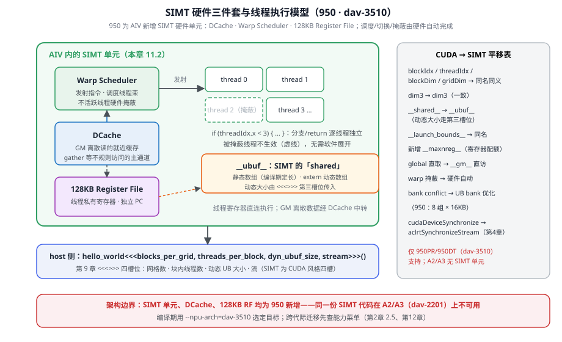
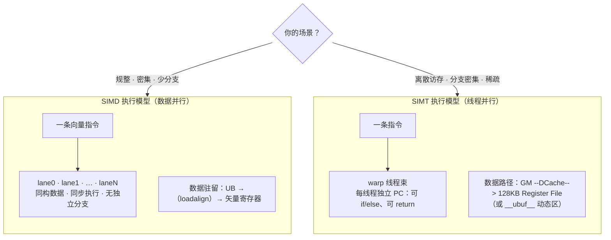
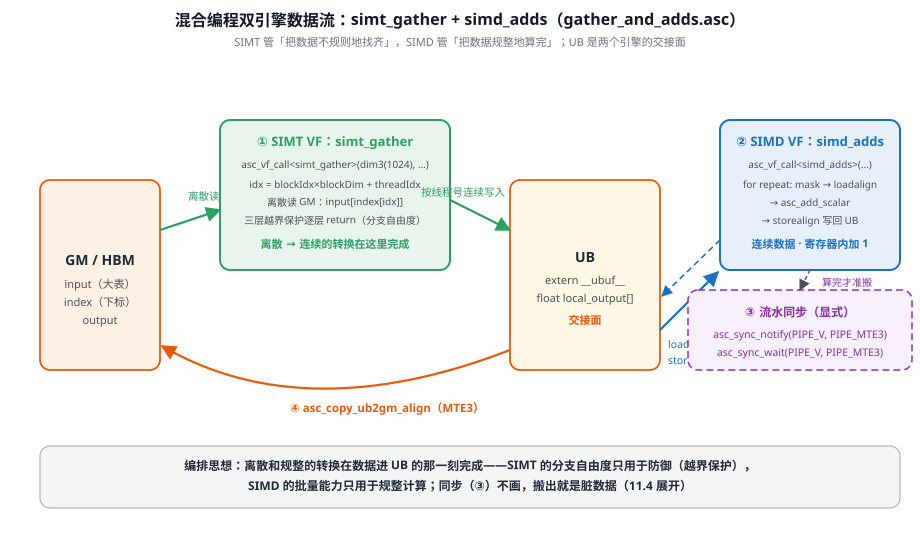
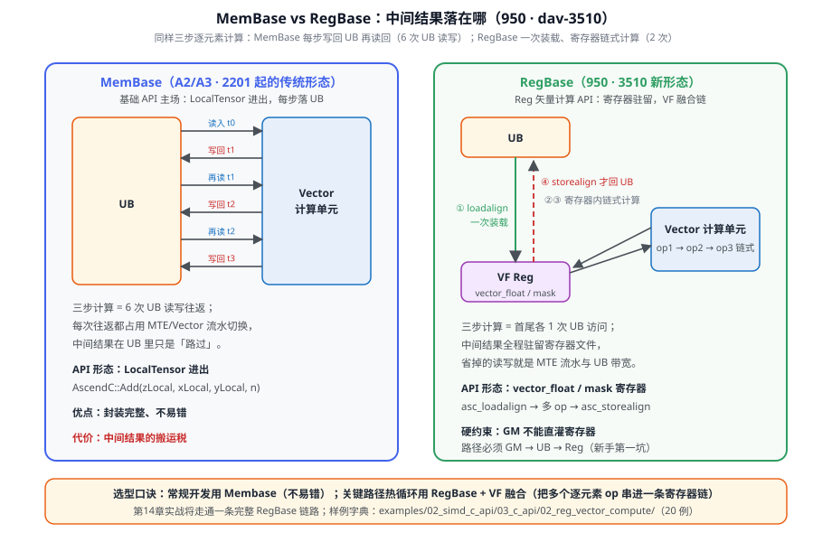
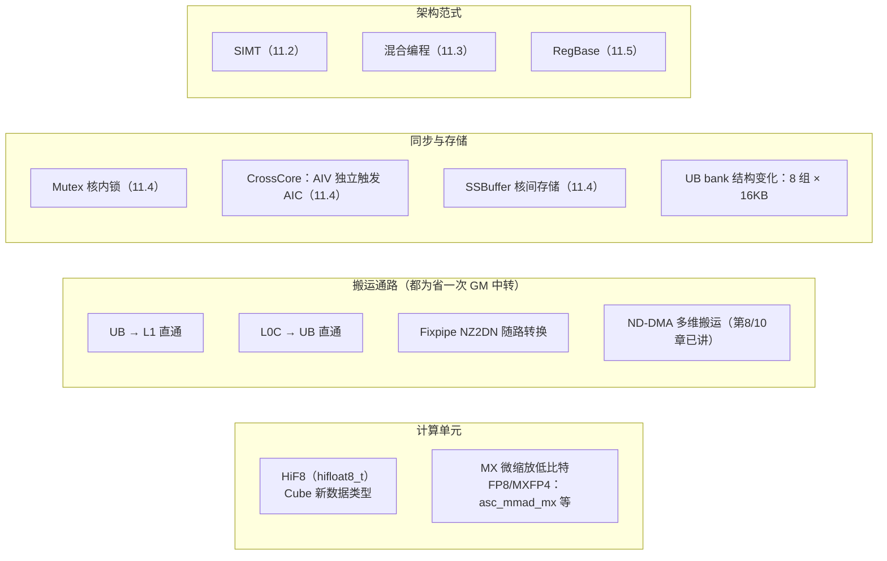
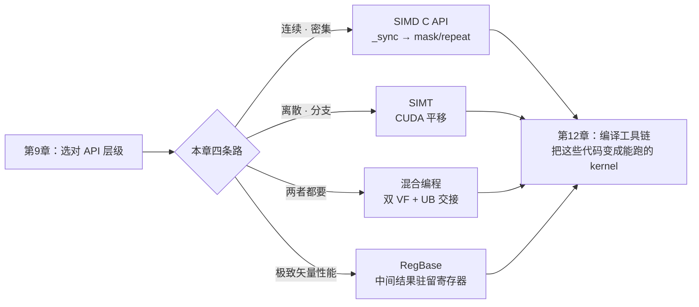

# 第11章 SIMD/SIMT 与高级特性

> 第 9 章决策树里「离散/分支密集 → SIMT」只有一句话，这一章把两条路线拆开讲透：SIMD C API 的接口分级、SIMT 的线程世界、一个 kernel 里双引擎协作的混合编程，以及 950 带来的 RegBase 底座——给 CUDA 老手一条最短的迁移路径。

## 本章目标与阅读指引

- **实操**：会用 SIMD C API 两级接口——`_sync` 一键同步口与 `mask/repeat` 自排程口（11.1）。
- **实操**：能写出第一个 SIMT kernel，完成从 CUDA 的概念映射（11.2）。
- **实操**：读懂并仿写 SIMD/SIMT 混合 kernel——离散访存与规整计算各归其位（11.3）。
- **底层**：掌握核内屏障/互斥锁与核间同步的实战形态（11.4）。
- **底层**：理解 RegBase 范式为什么快——中间结果不落 UB（11.5）。
- **视野**：950 新特性全景 + 调试工具箱（11.6）。

**本节要点**：本章所有真码仅 950PR/950DT（dav-3510）可运行——SIMT 单元、RegBase、SSBuffer 都是这代架构的新玩具；A2/A3 读者请对照第 2 章能力菜单，SIMD 部分照读、SIMT 部分预习。

## 11.1 SIMD C API：从「一键同步」到「自排 repeat」

第 9 章说过 SIMD C API 有两级用法。**易用级**是 `_sync` 后缀接口——`asc_copy_gm2ub_sync`、`asc_add_sync`，一行顶四步（9.6 真码）；**极致级**则把同步、掩码、循环次数全部摊开给你自己排。看混合编程官方案例里的 SIMD 侧真码[^hybrid]：

```cpp
// [需真机验证] 摘自 asc-devkit/examples/05_simd_simt_hybrid/00_introduction/
//   simd_simt_gather_and_adds/gather_and_adds.asc（SIMD VF 函数）
__simd_vf__ inline void simd_adds(
    __ubuf__ float* output, __ubuf__ float* input, uint32_t count,
    uint32_t one_repeat_size, uint16_t repeat_times)
{
    vector_float src_reg0;      // 源矢量数据寄存器
    vector_float dst_reg0;      // 目的矢量数据寄存器
    vector_bool mask_reg;       // 掩码寄存器
    for (uint16_t i = 0; i < repeat_times; i++) {
        mask_reg = asc_update_mask_b32(count);              // 按待处理元素数生成 mask
        asc_loadalign(src_reg0, input + i * one_repeat_size);   // UB → 寄存器（对齐加载）
        asc_add_scalar(dst_reg0, src_reg0, ADDS_ADDEND, mask_reg); // 寄存器内加标量
        asc_storealign(output + i * one_repeat_size, dst_reg0, mask_reg); // 写回 UB
    }
}
```

这份 18 行的真码把「极致级」的四个关键词全摆出来了[^hybrid]：

- **VL 与 repeat**：`asc_get_vf_len()` 返回矢量寄存器位宽能装多少字节，除以元素字长就是单轮处理量（`one_repeat_size`）；超过一轮就要 `repeat_times` 次循环——**这就是第 9 章说的「repeat/stride 高级接口」的真身**；
- **mask**：`asc_update_mask_b32(count)` 按实际元素数生成掩码寄存器（`vector_bool`），循环收尾不足一轮时靠它挡住无效 lane；
- **loadalign/storealign**：对齐加载/写回——第 8 章 32B 对齐纪律在 C API 层的对应物；
- **寄存器变量**：`vector_float`/`vector_bool` 直接声明寄存器，这已经是 RegBase 的边缘形态（11.5 正式展开）。

**两级怎么选**：算法验证期用 `_sync`（正确性优先，同步代价不敏感）；关键路径进入性能调优期换 `mask/repeat` 自排程——省掉逐次隐式同步，还能把多步计算串进同一轮 repeat 循环（VF 融合，11.5）。

## 11.2 SIMT 编程模型：给 CUDA 老手的快速通道

950 给 AI Core 的向量单元加了**SIMT 硬件单元**，官方特性表列明三件套：**DCache、Warp Scheduler、128KB Register File**，支持线程级并行编程[^guide950]。三者的分工见图 11-1：调度器发射并掩蔽线程束，DCache 承接 GM 离散读，寄存器文件容纳线程私有状态与独立 PC。



*图 11-1 SIMT 硬件三件套与线程执行模型：右栏对照表是本章核心交付之一——CUDA 老手按图索骥即可平移；底部红线是架构边界：三件套均为 950 新增。*

编程面上它刻意向 CUDA 看齐——`blockIdx`/`threadIdx`/`blockDim`/`gridDim` 内置变量同名同义，`dim3` 三维网格结构、`__launch_bounds__`（编译期声明线程数上限）、`__maxnreg__`（寄存器配额）也都对得上[^simtkw]：

```cpp
// [需真机验证] 摘自 asc-devkit/examples/03_simt_api/00_introduction/
//   00_quickstart/hello_world_simt/hello_world.asc
#include "simt_api/asc_simt.h"
#include "utils/debug/asc_printf.h"

__global__ void hello_world()
{
    if (threadIdx.x < 3) {   // 分支直接写——SIMT 线程独立 PC
        printf("[blockIdx (%u/%u)][threadIdx (%u/%u)]: Hello World!\n",
               blockIdx.x, gridDim.x, threadIdx.x, blockDim.x);
    }
}
// host 侧：hello_world<<<blocks_per_grid, threads_per_block, dyn_ubuf_size, stream>>>();
```

内存侧的映射关系要特别注意：SIMT 线程的「可写 workspace」不是 CUDA 的 `__shared__`，而是 **`__ubuf__`**——静态数组（`__ubuf__ half buf[1024]`，编译期定长）或动态数组（`extern __ubuf__ half buf[]`，大小由核启动的第三槽位 `dyn_ubuf_size` 指定）[^simtkw]。**第 9 章 `<<<>>>` 语法糖的第三个参数在这里兑现**：它就是给动态 UB 传容量的。编译期常量 `ASC_UB_SIZE` 可在编译期取本架构 UB 容量做静态校验[^simtkw]。

给 CUDA 老手的对照表（本章核心交付之一）：

| CUDA 概念 | 昇腾 SIMT 对应 | 差异注记 |
|---|---|---|
| `blockIdx/threadIdx/blockDim/gridDim` | 同名内置变量 | 语义一致，直接平移 |
| `dim3` 网格/块维度 | `dim3` 内置结构体 | 一致 |
| `__shared__`（块内共享） | `__ubuf__` 静态/动态数组 | 动态大小走 `<<<>>>` 第三槽位 |
| `__launch_bounds__` | 同名限定符 | 一致；另有 `__maxnreg__` 配寄存器 |
| global memory 直取 | `__gm__` 指针直访 | 一致（gather_1d 已见，9.2） |
| warp 分支掩蔽 | Warp Scheduler 硬件掩蔽 | 官方口径：调度/切换/掩蔽由硬件自动完成 |
| bank conflict 优化 | UB bank 冲突优化（950：8 组 × 16KB） | 官方另有 SIMT 版避坑指南[^guide950] |
| `cudaDeviceSynchronize` | `aclrtSynchronizeStream`（第 4 章） | 回到 ACL/runtime 世界 |

**何时逃逸到 AICPU**：SIMT 再灵活也是「核函数」形态；如果逻辑本质是复杂串行控制流（解析、查表、动态 shape 预处理），直接用 **AICPU 算子**更省心——官方样例给出的主场景就是「**Tiling 下沉计算**」（把 host 侧分块账本挪到 AI CPU 上算），且 A2/A3/950 全系支持[^aicpu]。第 5 章 5.1.1 的 `aicpu_sched/` 就是它的 runtime 侧通道。


*图 11-2 SIMD 与 SIMT 的硬件执行视角对比（编程流程对照见第 9 章图 9-2；本图补上「数据到底在哪条路上流动」）。*

## 11.3 混合编程：一个 kernel 里的双引擎

SIMT 与 SIMD 不是二选一——950 的混合编程允许**同一个核函数里两种 VF（Vector Function）协同**，语法就三件套：`__simt_vf__` 声明 SIMT 侧函数、`__simd_vf__` 声明 SIMD 侧函数、`asc_vf_call<函数>(dim3(线程数), …)` 派发[^hybrid]。官方案例 `simd_simt_gather_and_adds` 是最佳教材：**gather 用 SIMT（离散访存），adds 用 SIMD（UB 上连续计算）**：

```cpp
// [需真机验证] 摘自 gather_and_adds.asc（入口核函数，节选）
__global__ __vector__ void gather_and_adds_kernel(
    __gm__ float* input, __gm__ uint32_t* index, __gm__ float* output, ...)
{
    uint32_t per_block = index_total_length / block_num;
    extern __ubuf__ float local_output[];               // 动态 UB：双引擎的交接面
    asc_vf_call<simt_gather>(dim3(THREAD_COUNT),        // ① SIMT：1024 线程离散读 GM
        input, index, local_output, ...);
    uint32_t one_repeat_size = asc_get_vf_len() / sizeof(float);
    uint16_t repeat_times = (per_block + one_repeat_size - 1) / one_repeat_size;
    asc_vf_call<simd_adds>(local_output, local_output,  // ② SIMD：UB 连续加 1
        per_block, one_repeat_size, repeat_times);
    asc_sync_notify(PIPE_V, PIPE_MTE3, EVENT_ID0);      // ③ V 流水 → MTE3 流水同步
    asc_sync_wait(PIPE_V, PIPE_MTE3, EVENT_ID0);
    asc_copy_ub2gm_align(output + per_block * block_idx, // ④ 搬出 GM
        local_output, 1, per_block * sizeof(float), ...);
}
```

四个值得背下来的细节[^hybrid]：

1. **UB 是交接面**：SIMT gather 的输出按线程号**连续地**写进 `local_output`（`local_output[threadIdx.x] = input[gather_idx]`），把「离散」留在 GM 侧、「连续」留给 SIMD——这是混合编程的核心编排思想：**离散和规整的转换在数据进 UB 的那一刻完成**。
2. **SIMT 侧的防御性编程**：三层越界保护（线程数超出单核处理量、index 数组越界、非法 gather 下标）逐层 `return`——SIMT 的分支自由度就用来干这个。
3. **同步是显式的**：`asc_sync_notify/wait(PIPE_V, PIPE_MTE3, EVENT_ID0)`——SIMD 算完（V 流水）才能搬出（MTE3 流水）。这正是第 10 章 `SetFlag/WaitFlag<HardEvent::MTE2_MTE3>` 的 C API 同族，只是换成「通知/等待」配对形式。
4. **图 11-3 的数据流**（下）与真码逐行对应：GM --(①SIMT 离散读)--> UB --(②SIMD 连续算)--> UB --(④MTE3 搬出)--> GM。



*图 11-3 混合编程双引擎数据流：左引擎管「把数据不规则地找齐」，右引擎管「把数据规整地算完」，UB 是交接面；同步点 ③ 是 11.4 的主角。*

## 11.4 同步进阶：屏障、互斥锁与核间旗语

第 10 章 10.2 给过三类同步的「目录」，这一章把实战形态补齐。**核内同步**四件套[^syncdoc]：`SetFlag/WaitFlag`（多流水间，10.2 已见真码）、`PipeBarrier`（**同一流水内**的顺序保证）、`DataSyncBarrier`（阻塞到此前的内存访问指令完成）、`Lock/Unlock`（950 新增 Mutex，语义类似 CPU 锁，C API 侧是 `asc_lock`）。混合样例里的 `asc_sync_notify/wait(PIPE_V, PIPE_MTE3)` 属于第一类的 C API 配对形式——「V 算完 → 放行 MTE3」[^hybrid]。

**核间同步**的主力是 `CrossCoreSetFlag/CrossCoreWaitFlag`，950 上还解锁了一个新姿势：**AIV0 与 AIV1 可独立触发 AIC 等待**（向量核各自完成自己的分片后单独通知矩阵核，不必整批对齐）[^guide950]。全核汇总用 `SyncAll`；不依赖硬件旗语的场景用 `IBSet/IBWait`——往全局内存某地址写 1、对方轮询读到 1 为止，纯软件同步。

**950 还新增了一个同步脚下的地基：SSBuffer**——核内存储单元，AIC 核与 AIV 核都可通过 Scalar 访问[^guide950]。语言层的关键字是 `__ssbuf__`[^simdextra]。可以把它理解为「比 GM 近一级的核间留言板」：跨核协作的小状态（进度标记、阶段号）放这里，比走 GM 少一层缓存噪声。

## 11.5 RegBase：把中间结果留在寄存器里

第 2 章 2.5 预支过一笔：A2/A3（2201）的矢量计算是 **MemBase**——每算一小步都写回 UB；950（3510）换成 **RegBase**——中间结果可以留在矢量寄存器里[^membase]。这一节把这笔账算完。

两种范式的差异先说透[^regblog]：

| 维度 | Membase（基础 API 主场） | Regbase（Reg 矢量计算 API） |
|---|---|---|
| 输入输出 | LocalTensor（UB） | Reg 寄存器（`vector_float` 等） |
| 中间结果 | 每步落 UB，下步再读 | 寄存器驻留，链式计算 |
| 控制权 | API 封装好的流程 | 用户自主排布搬运与计算 |
| UB 读写次数 | 每个中间结果两次（写+读） | 仅首尾各一次 |

一条硬约束先钉死（RegBase 新手第一坑）：**SIMD 架构不支持 GM 直灌寄存器**——数据路径必须是 `GM → UB →（loadalign）→ VF Reg → 计算 →（storealign）→ UB → GM`[^regblog]。寄存器省的是「中间结果」，不是「输入输出」。



*图 11-4 MemBase vs RegBase 数据流：同样三步计算，MemBase 要 6 次 UB 读写、RegBase 只要 2 次——省掉的都是 MTE 流水占用和 UB 带宽，这就是 VF 融合的性能来源。*

RegBase 的工程价值在 **VF 融合与循环优化**：把多个逐元素操作串进同一条寄存器链（`loadalign` 一次，多次寄存器运算，`storealign` 一次），官方为它专写了融合优化与循环优化两篇实践[^regblog]。入门样例推荐 `examples/02_simd_c_api/03_c_api/02_reg_vector_compute/`——abs、cast、gather、reduce、select、squeeze 等 20 个小例，一个 API 一个目录，是 RegBase 的「字典」[^regapi]。第 14 章实战会把一条完整的 RegBase 链路走通。

## 11.6 A5(950) 新特性导览与调试工具箱

本章各节其实已经把 950 的三大架构级特性讲完（SIMT、混合编程、RegBase）。剩下的特性按「它动了哪块硬件」分四类[^guide950]，见这张分类图：


*图 11-5 950 新特性分类：四类里「搬运通路」类的共同动机都是砍掉「经 GM 中转」一跳——与第 8 章零拷贝思想一脉相承。*

**调试工具箱**（本章真码里已经出场的三件 + 第 7 章的家底）：

- **`asc_printf`**：SIMT/SIMD 核函数内打印（hello_world 真码），头文件 `utils/debug/asc_printf.h`[^helloworld]；
- **`aclGetRecentErrMsg()`**：host 侧取最近一条错误的人类可读描述——hello_world 在 `aclrtSynchronizeStream` 后立刻查它，这个习惯值得全书推广[^helloworld]；
- **栈溢出排障**：`03_simt_api/05_troubleshooting/stack_overflow/` 官方样例演示 SIMT 线程栈溢出的症状与解法（`__maxnreg__`/资源配额视角）[^stack]；
- 算子级数据比对与异常检测回到第 7 章：DumpTensor 打点 + msSanitizer。

> 📌 **NPU-Check 说明**：本章骨架期曾登记「NPU-Check」调试能力，但在本地开源基线（asc-devkit 文档与样例）中未检索到该名称的工具；按 §8「无出处不写」原则降级处理——SIMT 调试以上述 printf/ErrMsg/stack_overflow 样例与 MindStudio 工具链为准，后续若官方资料补齐再行增补。

## 陷阱与注意（汇总）

| 坑 | 症状 | 对策 |
|---|---|---|
| 在 A2/A3 上编译 SIMT/RegBase/混合样例 | 编译失败或行为缺失 | 三者均为 950（dav-3510）专属；先查能力菜单（本章章首、第2章 2.5） |
| `_sync` 口与自排口混用 | 同步语义叠加、性能反而更差 | 一个函数内选定一级风格；自排口自己负责 mask/repeat 边界（11.1） |
| repeat 收尾不处理 mask | 尾部脏数据/越界写 | `asc_update_mask_b32(count)` 按实际元素数生成掩码（11.1 真码） |
| 动态 `__ubuf__` 忘传 `dyn_ubuf_size` | 访问越界、行为不定 | `<<<>>>` 第三槽位就是给它传容量的（11.2） |
| 混合 kernel 算完直接搬出 | 搬出读到半成品 | `asc_sync_notify/wait(PIPE_V, PIPE_MTE3)` 配对写齐（11.3） |
| GM 数据直灌矢量寄存器 | 编译不过 | RegBase 硬约束：必须经 UB 中转（11.5） |
| RegBase 把中间结果又写回 UB | 白改成 RegBase | 检查链路：中间结果必须驻留寄存器，仅首尾碰 UB（11.5） |
| CrossCore 方向/对象配错 | 死等 | 谁 Set 谁 Wait 画清；950 才有 AIV 独立触发 AIC（11.4） |
| AICPU 滥用 | 调度开销吃掉收益 | AICPU 适合串行控制流/Tiling 下沉，不适合热路径逐元素计算（11.2） |

## 本章小结

::: tip 一句话总结
**SIMD C API 两级接口：`_sync` 求对、`mask/repeat` 求快。SIMT 是 CUDA 老手的平移通道（同名内置变量 + `__ubuf__` 当 shared 用 + `<<<>>>` 第三槽位传动态容量）。混合编程让 SIMT 干离散访存、SIMD 干规整计算，UB 是交接面、流水同步要显式画。同步三板斧：PipeBarrier/Mutex 管核内、CrossCore/SyncAll 管核间、SSBuffer 是 950 新的核间留言板。RegBase 的钱来自「中间结果不落 UB」——但记住 GM 永远不能直灌寄存器。950 新特性的共同主题：砍掉经 GM 中转的那一跳。**
:::


*图 11-6 本章记忆图：四条路各归其位，下一站进编译工具链。*

## 本章来源与进一步阅读

[^hybrid]: 混合编程官方案例全码（`__simt_vf__`/`__simd_vf__`/`asc_vf_call`/`__launch_bounds__`/动态 `__ubuf__`/`asc_get_vf_len`/`asc_update_mask_b32`/`asc_loadalign`/`asc_add_scalar`/`asc_storealign`/`asc_sync_notify/wait(PIPE_V,PIPE_MTE3)`/`asc_copy_ub2gm_align`，11.1/11.3 代码摘自本文件）：`asc-devkit/examples/05_simd_simt_hybrid/00_introduction/simd_simt_gather_and_adds/gather_and_adds.asc` 及同目录 README（仅支持 950PR/950DT，CANN Open 2.0）。
[^simtkw]: SIMT 内建关键字（内存空间限定符 `__ubuf__` 静态/动态、`ASC_UB_SIZE`、`dim3`、内置变量、`__launch_bounds__`/`__maxnreg__` 核函数配置）：`asc-devkit/docs/zh/guide/programming_guide/language_extension/simt_builtin_keywords.md`（官方文档）。
[^guide950]: 950 特性指南 13 项特性表（SIMT 三件套 DCache/Warp Scheduler/128KB Register File、混合编程、HiF8、MX 低比特与 `asc_mmad_mx`、UB→L1/L0C→UB 通路、Mutex、CrossCore AIV 独立触发、SSBuffer、UB bank 8×16KB、Fixpipe NZ2DN、ND-DMA）：`asc-devkit/docs/zh/asc_950_feature_guide.md`（官方文档）。
[^helloworld]: SIMT Hello World 样例（`asc_printf` 头文件 `utils/debug/asc_printf.h`、`aclGetRecentErrMsg` 用法、`<<<>>>` 四槽位启动）：`asc-devkit/examples/03_simt_api/00_introduction/00_quickstart/hello_world_simt/hello_world.asc`（CANN Open 2.0）。
[^stack]: SIMT 栈溢出排障样例：`asc-devkit/examples/03_simt_api/05_troubleshooting/stack_overflow/`（CANN Open 2.0）。
[^aicpu]: AICPU 样例（Tiling 下沉计算、图模式自定义算子，A2/A3/950 全系支持）：`asc-devkit/examples/04_aicpu/README.md` 及 `00_introduction/`（CANN Open 2.0）。
[^regblog]: Regbase 编程范式博客（Membase vs Regbase 对照表、GM→UB→VF Reg 数据路径硬约束、VF 融合/循环优化定位）：`cann-learning-hub/blogs/operator/regbase_vec_add/从一个向量加法出发，深入理解Regbase编程范式.md`（社区博客）。
[^regapi]: Reg 矢量计算 20 例（abs/arange/cast/gather/reduce/select/squeeze/Interleave 等）：`asc-devkit/examples/02_simd_c_api/03_c_api/02_reg_vector_compute/`；API 归档 `asc-devkit/docs/zh/api/SIMD-API/basic_api/reg_vector_compute/`（CANN Open 2.0）。
[^syncdoc]: 同步接口总表（核内 SetFlag/PipeBarrier/DataSyncBarrier/Mutex、核间 CrossCore/SyncAll/IBSet、任务间）：`asc-devkit/docs/zh/api/SIMD-API/basic_api/sync_control/system_sync_overview.md`（官方文档，第10章同源）。
[^simdextra]: SIMD 内建关键字（`__ssbuf__` SSBuffer 限定符等）：`asc-devkit/docs/zh/guide/programming_guide/language_extension/simd_builtin_keywords.md`（官方文档）。
[^membase]: MemBase vs RegBase 架构差异（2201 vs 3510）：`asc-devkit/docs/zh/guide/cross_gen_migration_guide/3510_arch_migration/2201_to_3510_arch_changes.md`、第2章 2.5（官方文档）。

- **下一站**：第 12 章「编译、工具链与部署」——本章的 `.asc` 文件是怎么变成 kernel 二进制、`--npu-arch` 在哪里选、CMake 工程怎么组织。
- **交叉引用**：SIMD/SIMT 编程四步法见第 9 章 9.3；`<<<>>>` 槽位语义见第 9 章 9.2；流水同步的 ISASI 版见第 10 章 10.2；MemBase/RegBase 架构背景见第 2 章 2.5；DumpTensor/msSanitizer 见第 7 章。
