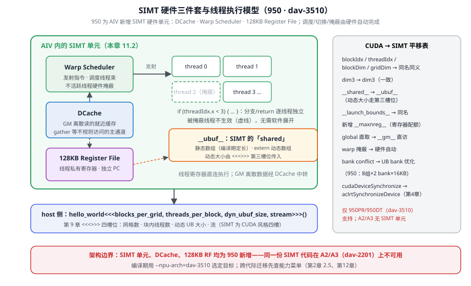
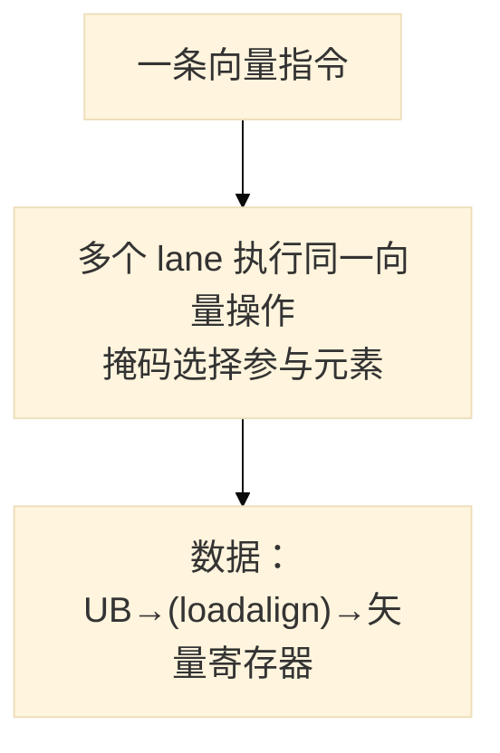
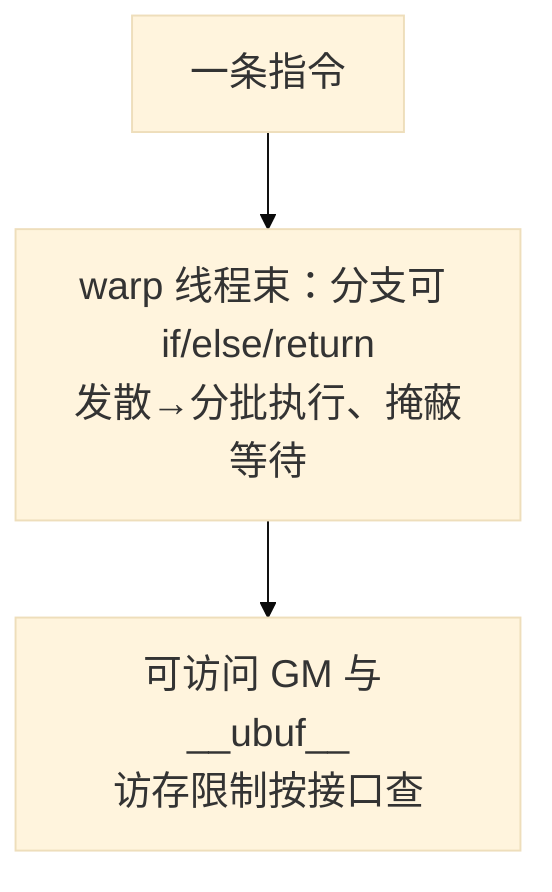
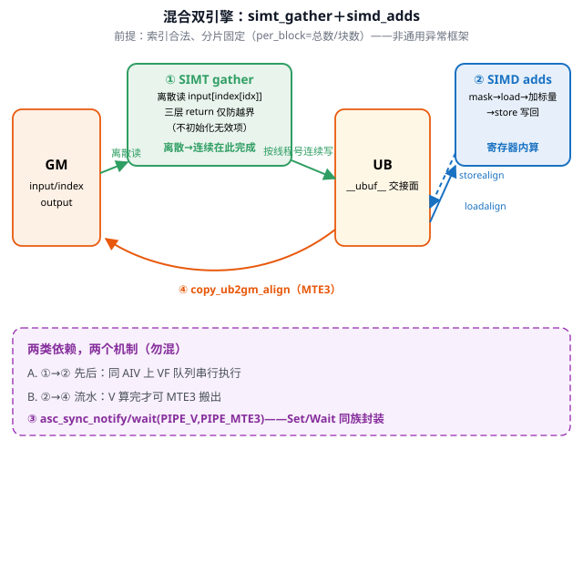
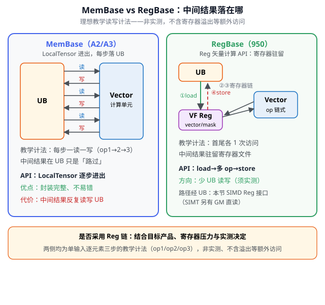
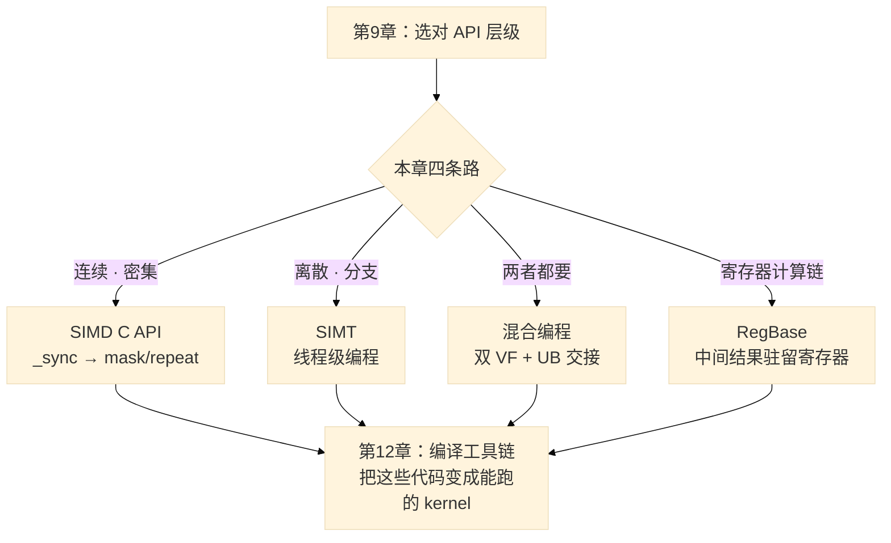

# 第11章 SIMD/SIMT 与高级特性

> 第 9 章决策树里「离散/分支密集 → SIMT」只有一句话，这一章把两条路线拆开讲透：SIMD C API 的接口分级、SIMT 的线程世界、一个 kernel 里双引擎协作的混合编程，以及 950 带来的 RegBase 底座——给 CUDA 老手一条最短的迁移路径。

## 本章目标与阅读指引

- **实操**：会用 SIMD C API 两级接口——`_sync` 一键同步口与 `mask/repeat` 自排程口（11.1）。
- **实操**：能写出第一个 SIMT kernel，完成从 CUDA 的概念映射（11.2）。
- **实操**：读懂并仿写 SIMD/SIMT 混合 kernel——离散访存与规整计算各归其位（11.3）。
- **底层**：掌握核内屏障/互斥锁与核间同步的实战形态（11.4）。
- **底层**：理解 RegBase 范式为什么快——中间结果不落 UB（11.5）。
- **视野**：950 新特性全景 + 调试工具箱（11.6）。

**本节要点**：**SIMT/混合/RegBase/SSBuffer 等真码仅 950PR/950DT（dav-3510）**；C API 基础算子按产品分册（如 `asc_add_sync` A2/A3 支持、950 见分册），**11.1 的同步/单位结论以所注接口分册为准**。A2/A3 读者对照第 2 章能力菜单。

## 11.1 SIMD C API：从「一键同步」到「自排 repeat」

第 9 章说过 SIMD C API 有两级用法。**易用级**是 `_sync` 后缀接口——`asc_copy_gm2ub_sync`、`asc_add_sync`，一行顶四步（9.6 真码）；**极致级**则把同步、掩码、循环次数全部摊开给你自己排。看混合编程官方案例里的 SIMD 侧真码[^hybrid]：

```cpp
// 摘自原文，本书未编译。源：asc-devkit/examples/05_simd_simt_hybrid/00_introduction/
//   simd_simt_gather_and_adds/gather_and_adds.asc（SIMD VF 函数）
__simd_vf__ inline void simd_adds(
    __ubuf__ float* output, __ubuf__ float* input, uint32_t count,
    uint32_t one_repeat_size, uint16_t repeat_times)
{
    vector_float src_reg0;      // 源矢量数据寄存器
    vector_float dst_reg0;      // 目的矢量数据寄存器
    vector_bool mask_reg;       // 掩码寄存器
    for (uint16_t i = 0; i < repeat_times; i++) {
        mask_reg = asc_update_mask_b32(count);              // 按待处理元素数生成 mask
        asc_loadalign(src_reg0, input + i * one_repeat_size);   // UB → 寄存器（对齐加载）
        asc_add_scalar(dst_reg0, src_reg0, ADDS_ADDEND, mask_reg); // 寄存器内加标量
        asc_storealign(output + i * one_repeat_size, dst_reg0, mask_reg); // 写回 UB
    }
}
```

这份 18 行的真码把「极致级」的四个关键词全摆出来了[^hybrid]：

- **VL 与 repeat（Reg VF，本样例所属）**：`asc_get_vf_len()` 返回**「Tensor 位宽 VL（Vector Length）的大小」**（API 页原文如此，未写明单位与迭代关系）——本样例按 `除以 sizeof(float)` 得单轮元素数 `one_repeat_size`，可反推按字节计的用法；这是**推导**，单位以编译实现为准[^vflen]。循环收尾靠 `uint16_t repeat_times`（**Reg VF 侧循环计数**）——它与 10 章 UB 侧 `uint8_t repeat`/DataBlock stride 是**两套接口的两组参数，勿互推**；
- **mask**：`asc_update_mask_b32(count)` 按实际元素数生成掩码寄存器（`vector_bool`），收尾不足一轮挡无效 lane（reg 面接口；**reg 版 `asc_add_scalar` 在 `c_api/reg/arithmetic_compute/`，950 支持**——与 vector_compute 版同名分册）[^hybrid]；
- **loadalign/storealign**：`asc_loadalign` 文档明写「UB 中起始地址 **32 字节对齐**」、UB 重叠须 `asc_mem_bar` 串行化——**该 reg 搬入接口自身约束**，与 UB 搬运 32B 规则同值但各管各，逐接口核[^loadalign]；
- **寄存器变量**：`vector_float`/`vector_bool` 直接声明寄存器，这已经是 RegBase 的边缘形态（11.5 正式展开）。

**两级怎么选**：算法验证期用 `_sync`——接口文档明言「**同步计算包含同步等待**」；不带 `_sync` 的基础形式为**异步**——「挂 MTE」仅以 10 章所核搬运接口为据（其文档 PIPE_MTE2），**计算类流水归属逐接口核，勿推广**；重叠地址须自插同步串行化见于所核接口约束[^copysync]。自排程级还要记住两个单位账：**`repeat`=迭代次数（`uint8_t`）**；**stride 单位默认 DataBlock（32B），有特殊说明的以各 API 为准**——且该通用约束属 UB 侧 C API，**本节连续 Reg 搬入形式没有 stride 参数；但 asc_loadalign 的非连续重载有 block_stride/repeat_stride，单位同为 32 字节，必须逐重载查说明**[^cunit]。性能调优期换 `mask/repeat` 自排程，把多步计算串进同一轮 repeat 循环（VF 融合，11.5）。

## 11.2 SIMT 编程模型：给 CUDA 老手的快速通道

950 给 AI Core 的向量单元加了**SIMT 硬件单元**，官方特性表列明三件套：**DCache、Warp Scheduler、128KB Register File**，支持线程级并行编程[^guide950]。三者的分工见图 11-1：调度器发射并掩蔽线程束，DCache 承接 GM 离散读，寄存器文件容纳线程私有状态；分支以 warp 发散分批执行。



*图 11-1 SIMT 组成与线程行为。框表示组成和编程概念，具体访存与同步限制见正文接口说明。*

编程面上它刻意向 CUDA 看齐——`blockIdx`/`threadIdx`/`blockDim`/`gridDim` 使用相似的内置变量名称，`dim3` 三维网格结构、`__launch_bounds__`（编译期声明线程数上限）、`__maxnreg__`（寄存器配额）需按 SIMT 文档确认用法[^simtkw]：

```cpp
// 摘自原文，本书未编译。源：asc-devkit/examples/03_simt_api/00_introduction/
//   00_quickstart/hello_world_simt/hello_world.asc
#include "simt_api/asc_simt.h"
#include "utils/debug/asc_printf.h"

__global__ void hello_world()
{
    if (threadIdx.x < 3) {   // 分支直接写——warp 发散分批执行、掩蔽等待
        printf("[blockIdx (%u/%u)][threadIdx (%u/%u)]: Hello World!\n",
               blockIdx.x, gridDim.x, threadIdx.x, blockDim.x);
    }
}
// host 侧：hello_world<<<blocks_per_grid, threads_per_block, dyn_ubuf_size, stream>>>();
```

内存侧的映射关系要特别注意：SIMT 线程的「可写 workspace」不是 CUDA 的 `__shared__`，而是 **`__ubuf__`**——静态数组（`__ubuf__ half buf[1024]`，编译期定长）或动态数组（`extern __ubuf__ half buf[]`，大小由 **SIMT 四槽启动 `<<<blocks,threads,dyn_ubuf_size,stream>>>` 的第三槽** `dyn_ubuf_size` 指定）[^simtkw]。**注意**：这是 SIMT 启动约定的槽位；**SIMD 侧动态 UB 在第二槽**（第 9 章口径），两套启动参数槽位不同，勿混写。编译期常量 `ASC_UB_SIZE` 可在编译期取本架构 UB 容量做静态校验[^simtkw]。

下表帮助识别相似概念，不表示 CUDA 代码可直接替换 API 后运行：

| CUDA 概念 | 昇腾 SIMT 对应 | 差异注记 |
|---|---|---|
| `blockIdx/threadIdx/blockDim/gridDim` | 同名内置变量 | 分别表示块/线程索引与网格/块维度；支持范围按目标接口核对 |
| `dim3` 网格/块维度 | `dim3` 内置结构体 | 维度限制按目标接口核对 |
| `__shared__`（块内共享） | `__ubuf__` 静态/动态数组 | 动态大小走 **SIMT 四槽启动**第三槽 |
| `__launch_bounds__` | 同名限定符 | 参数及限制按 SIMT 文档核对；另有 `__maxnreg__` |
| global memory 直取 | `__gm__` 指针直访 | 地址空间和访问约束仍需核对（9.2） |
| warp 分支发散 | 硬件按分支分批执行+掩蔽等待 | 官方口径：调度/掩蔽硬件自动；**发散时串行各分支，效率随发散降**——非「每线程独立 PC 流水」[^threadsimt] |
| bank conflict 优化 | UB bank 冲突优化（950：8 组，每组 2 个 16KB bank） | 官方另有 SIMT 版避坑指南[^guide950] |
| `cudaDeviceSynchronize` | `aclrtSynchronizeDevice`（第 4 章） | 设备级等待；`aclrtSynchronizeStream` 只等待指定流，范围不同[^aclsync] |
| 线程块 ↔ 硬件 | **一个 SIMT VF=一个 Thread Block 的执行上下文，落在单个 AIV 上**（块≤2048 线程） | 块内共享/协作≠跨块；**跨 Block/跨核同步走 11.4，块内 barrier 不等同 AIC/AIV 跨核屏障**[^threadsimt] |

**何时逃逸到 AICPU**：SIMT 再灵活也是「核函数」形态；如果逻辑本质是复杂串行控制流（解析、查表、动态 shape 预处理），直接用 **AICPU 算子**更省心——官方样例给出的主场景就是「**Tiling 下沉计算**」（把 host 侧分块账本挪到 AI CPU 上算），且 A2/A3/950 全系支持[^aicpu]。第 5 章 5.1.1 的 `aicpu_sched/` 就是它的 runtime 侧通道。


```mermaid
%%{init: {"theme":"base","themeVariables":{"fontSize":"20px"}}}%%
flowchart TB
    I1["一条向量指令"] --> L1["多个 lane 执行同一向量操作<br/>掩码选择参与元素"]
    L1 --> D1["数据：UB→(loadalign)→矢量寄存器"]
```

```mermaid
%%{init: {"theme":"base","themeVariables":{"fontSize":"20px"}}}%%
flowchart TB
    I2["一条指令"] --> T1["warp 线程束：分支可 if/else/return<br/>发散→分批执行、掩蔽等待"]
    T1 --> D2["可访问 GM 与 __ubuf__<br/>访存限制按接口查"]
```
*图 11-2 读法：上图中 SIMD、下图中 SIMT 两块对照——选型口径：规整/密集/少分支→SIMD，离散访存/分支密集/稀疏→SIMT（编程流程对照见第 9 章图 9-2）。*

## 11.3 混合编程：一个 kernel 里的双引擎

SIMT 与 SIMD 不是二选一——950 的混合编程允许**同一个核函数里两种 VF（Vector Function）协同**，语法就三件套：`__simt_vf__` 声明 SIMT 侧函数、`__simd_vf__` 声明 SIMD 侧函数、`asc_vf_call<函数>(dim3(线程数), …)` 派发[^hybrid]。官方案例 `simd_simt_gather_and_adds` 是最佳教材：**gather 用 SIMT（离散访存），adds 用 SIMD（UB 上连续计算）**：

```cpp
// 摘自原文，本书未编译。源：gather_and_adds.asc（入口核函数，节选）
__global__ __vector__ void gather_and_adds_kernel(
    __gm__ float* input, __gm__ uint32_t* index, __gm__ float* output, ...)
{
    uint32_t per_block = index_total_length / block_num;
    extern __ubuf__ float local_output[];               // 动态 UB：双引擎的交接面
    asc_vf_call<simt_gather>(dim3(THREAD_COUNT),        // ① SIMT：1024 线程离散读 GM
        input, index, local_output, ...);
    uint32_t one_repeat_size = asc_get_vf_len() / sizeof(float);
    uint16_t repeat_times = (per_block + one_repeat_size - 1) / one_repeat_size;
    asc_vf_call<simd_adds>(local_output, local_output,  // ② SIMD：UB 连续加 1
        per_block, one_repeat_size, repeat_times);
    asc_sync_notify(PIPE_V, PIPE_MTE3, EVENT_ID0);      // ③ V 流水 → MTE3 流水同步
    asc_sync_wait(PIPE_V, PIPE_MTE3, EVENT_ID0);
    asc_copy_ub2gm_align(output + per_block * block_idx, // ④ 搬出 GM
        local_output, 1, per_block * sizeof(float), ...);
}
```

四个值得背下来的细节[^hybrid]：

1. **UB 是交接面**：SIMT gather 的输出按线程号**连续地**写进 `local_output`（`local_output[threadIdx.x] = input[gather_idx]`），把「离散」留在 GM 侧、「连续」留给 SIMD——这是混合编程的核心编排思想：**离散和规整的转换在数据进 UB 的那一刻完成**。
2. **SIMT 侧的保护与前提**：三层 `return` 只防**访问越界**（线程超量/index 越界/非法下标）——**不给无效 index 的 local_output 兜底赋值**，随后 SIMD 仍按 `per_block` 全量处理。正确性前提：**索引合法、分片固定（`per_block=总数/块数`）**——非任意长度/脏数据皆容的异常框架。
3. **两次 VF 之间的完成语义**：SIMT→SIMD 依赖由 同一 AIV 的 Vector Function Queue **串行执行各 VF** 的语义承载（②见①结果）[^vfqueue]；SIMD→搬出才需显式 `asc_sync_notify/wait(PIPE_V, PIPE_MTE3)`——V 算完放行 MTE3，第 10 章 Set/Wait 同族的通知/等待封装[^hybrid]。
4. **图 11-3 的数据流**（下）与真码逐行对应：GM --(①SIMT 离散读)--> UB --(②SIMD 连续算)--> UB --(④MTE3 搬出)--> GM。



*图 11-3 读法：①SIMT 离散读入 UB、②SIMD 连续算、④搬出；底部两行注分列两类依赖——①→②靠同 AIV VF 队列串行执行，②→④才需 ③notify/wait。前提：索引合法、分片固定。*

## 11.4 同步进阶：屏障、互斥锁与核间旗语

第 10 章 10.2 给过三类同步的「目录」，这一章把实战形态补齐。**核内同步**四件套[^syncdoc]：`SetFlag/WaitFlag`（多流水间，10.2 已见真码）、`PipeBarrier`（**同一流水内**的顺序保证）、`DataSyncBarrier`（阻塞到此前的内存访问指令完成）、`Lock/Unlock`（950 新增 Mutex，语义类似 CPU 锁，C API 侧是 `asc_lock`）。混合样例里的 `asc_sync_notify/wait(PIPE_V, PIPE_MTE3)` 属于第一类的 C API 配对形式——「V 算完 → 放行 MTE3」[^hybrid]。

**核间同步**的主力是 `CrossCoreSetFlag/CrossCoreWaitFlag`——**第一个模板参数=同步范围，参与者随模式变**，须一起记[^cpptensor]：

| 模式 | 范围与参与者（接口文档口径） | 950PR/DT | A3/A2 |
|---|---|---|---|
| 模式0 | 等全部 AIC **或**全部 AIV | ✓ | ✓ |
| 模式1 | 单 AI Core 内全部 AIV 间 | ✓ | ✓ |
| 模式2 | 单 AI Core 内 AIC↔全部 AIV | ✓ | ✓ |
| 模式4 | 单 AI Core 内 AIC↔单个 AIV（AIV0/1 可单独触发） | ✓ | –（仅 950） |

还需配置接口支持的混合核类型：`KERNEL_TYPE_AIC_ONLY` / `KERNEL_TYPE_AIV_ONLY` 不开启所需调度模块，不能仅凭产品支持便使用该同步。模式 4 的 AIV0/AIV1 与 AIC 的 flagId 映射不同，且必须避开 Matmul、SyncAll 占用的 ID，具体映射与核类型见接口表[^crosscore]。

使用须传 **flagId**（每 ID 一计数器；**取值范围按产品查该接口「flagId 取值范围说明」**）[^crosscore]。**SIMT 的 Thread Block 屏障只管块内线程**——跨 Block 协作需要单独核对编程模型与调度条件，不能将逻辑 Block 直接映射为上表参与者。这里的 CrossCore 表只说明 AIC/AIV 核间接口，不提供通用的 SIMT 跨 Block 屏障。全核汇总用 `SyncAll`；不依赖硬件旗语的场景用 `IBSet/IBWait`——往全局内存某地址写 1、对方轮询读到 1 为止，纯软件同步[^syncdoc]。

**950 还新增了 SSBuffer**——特性指南将其列为“SSBuffer 核间存储”，说明新增核内存储单元，支持 AIC 核和 AIV 核通过 Scalar 访问[^guide950]；语言层关键字为 `__ssbuf__`[^simdextra]。指南对应的编程资料仍标注“资料开发中”，本章不据此推断共享拓扑、具体协议或性能收益。

## 11.5 RegBase：把中间结果留在寄存器里

第 2 章 2.5 预支过一笔：A2/A3（2201）的矢量计算是 **MemBase**——每算一小步都写回 UB；950（3510）换成 **RegBase**——中间结果可以留在矢量寄存器里[^membase]。这一节把这笔账算完。

两种范式的差异先说透[^regblog]：

| 维度 | Membase（基础 API 主场） | Regbase（Reg 矢量计算 API） |
|---|---|---|
| 输入输出 | LocalTensor（UB） | Reg 寄存器（`vector_float` 等） |
| 中间结果 | 每步落 UB，下步再读 | 寄存器驻留，链式计算 |
| 控制权 | API 封装好的流程 | 用户自主排布搬运与计算 |
| UB 读写次数 | 每个中间结果两次（写+读） | 仅首尾各一次 |

对本节所用 SIMD Reg 搬入搬出接口，**数据经 UB 进入矢量寄存器**——`GM → UB →（loadalign）→ VF Reg → 计算 →（storealign）→ UB → GM`；接口层证据是本节所用 Reg 面搬入/搬出分册 `reg_load`/`reg_store`（UB↔寄存器，`asc_loadalign`/`asc_storealign` 等）[^regapi2]——**本节路径经 UB 以这些接口为准**；GM 直灌寄存器在本书核对范围内未见专用接口（社区博客同此描述[^regblog]，是否另有接口以 API 全目录为准）。寄存器省的是「中间结果」，不是「输入输出」。



*图 11-4 读法：两侧均为**单输入逐元素三步（op1/op2/op3）的教学计法**——MemBase 每步一读一写、RegBase 首尾各一；非实测、不含寄存器溢出等额外访问。「路径经 UB」限定本节 SIMD Reg 搬运接口，SIMT 另有 GM 直读。是否采用 Reg 链：结合目标产品、寄存器压力与实测。*

RegBase 的工程价值在 **VF 融合与循环优化**：把多个逐元素操作串进同一条寄存器链（`loadalign` 一次，多次寄存器运算，`storealign` 一次），官方为它专写了融合优化与循环优化两篇实践[^regblog]。入门样例推荐 `examples/02_simd_c_api/03_c_api/02_reg_vector_compute/`——abs、cast、gather、reduce、select、squeeze 等 20 个小例，一个 API 一个目录，是 RegBase 的「字典」[^regapi]。第 14 章实战会把一条完整的 RegBase 链路走通。

## 11.6 A5(950) 新特性导览与调试工具箱

本章各节其实已经把 950 的三大架构级特性讲完（SIMT、混合编程、RegBase）。剩下的特性按「它动了哪块硬件」分四类[^guide950]，见这张分类图：

| 类别（动了哪块硬件） | 特性（详见各节/特性表[^guide950]） |
|---|---|
| 计算单元 | HiF8（`hifloat8_t`，Cube 新类型）；MX 微缩放低比特（FP8/MXFP4，`asc_mmad_mx` 等） |
| 搬运通路 | UB→L1（**按产品/接口核**：第 8 章已立 UB→L1/L1→UB 分产品支持表，非 950 排他）；L0C→UB（3510 新增单向，见第 8 章表）；Fixpipe NZ2DN；ND-DMA（第 8/10 章，950PR/DT） |
| 同步与存储 | Mutex 核内锁（11.4）；CrossCore AIV 独立触发 AIC（11.4）；SSBuffer 核间存储（11.4）；UB bank 8 组×2 16KB |
| 架构范式 | SIMT（11.2）；混合编程（11.3）；RegBase（11.5） |
*表 11-5 950 新特性分类（依官方特性表[^guide950]）：各特性动机各异，**不支持「皆省 GM 一跳」的统一归因**——同步/计算类尤其如此；支持范围以第 8 章分产品表与各接口文档为准。*

**调试工具箱**（本章真码里已经出场的三件 + 第 7 章的家底）：

- **`asc_printf`**：SIMT/SIMD 核函数内打印（hello_world 真码），头文件 `utils/debug/asc_printf.h`[^helloworld]；
- **`aclGetRecentErrMsg()`**：host 侧取最近一条错误的人类可读描述——hello_world 在 `aclrtSynchronizeStream` 后立刻查它，这个习惯值得全书推广[^helloworld]；
- **栈溢出排障**：`03_simt_api/05_troubleshooting/stack_overflow/` 官方样例演示 SIMT 线程栈溢出的症状与解法（`__maxnreg__`/资源配额视角）[^stack]；
- 算子级数据比对与异常检测回到第 7 章：DumpTensor 打点 + msSanitizer。

> 📌 SIMT 调试以 `asc_printf`/`aclGetRecentErrMsg`/stack_overflow 样例与 MindStudio 工具链为准。

## 陷阱与注意（汇总）

| 坑 | 症状 | 对策 |
|---|---|---|
| 在 A2/A3 上编译 SIMT/RegBase/混合样例 | 编译失败或行为缺失 | 三者均为 950（dav-3510）专属；先查能力菜单（本章章首、第2章 2.5） |
| `_sync` 口与自排口混用 | 可能增加等待或遗漏完成依赖 | 逐接口画清完成依赖；自排口检查 mask/repeat 边界（11.1） |
| repeat 收尾不处理 mask | 尾部脏数据/越界写 | `asc_update_mask_b32(count)` 按实际元素数生成掩码（11.1 真码） |
| 动态 `__ubuf__` 忘传 `dyn_ubuf_size` | 访问越界、行为不定 | SIMT 四槽启动第三槽传容量；SIMD 三槽启动的动态 UB 在第二槽（11.2） |
| 混合 kernel 算完直接搬出 | 搬出读到半成品 | `asc_sync_notify/wait(PIPE_V, PIPE_MTE3)` 配对写齐（11.3） |
| GM 数据直灌矢量寄存器 | 编译不过 | 本节 SIMD Reg 搬入接口以 UB 为源（11.5） |
| RegBase 把中间结果又写回 UB | 可能增加 UB 访问 | 检查链路：评估驻留收益与寄存器压力，必要时允许写回 UB（11.5） |
| CrossCore 方向/对象配错 | 死等 | 谁 Set 谁 Wait 画清；950 才有 AIV 独立触发 AIC（11.4） |
| AICPU 滥用 | 调度开销吃掉收益 | AICPU 适合串行控制流/Tiling 下沉，不适合热路径逐元素计算（11.2） |

## 本章小结

::: tip 一句话总结
950 上三条并行路——SIMD Reg VF 管「规整数据寄存器内算」，SIMT 管「离散访存随便分支」，混合编程用 `asc_vf_call` 把两者接在同一 UB 交接面上；同步自己画：同一AIV上的VF由队列串行执行，流水间靠 notify/wait，跨核靠 CrossCore（模式/flagId 按产品查表）。

Reg VF 的 repeat 计数与 UB 侧 repeat/stride 是两套参数；`asc_loadalign` 的 32B 对齐是其接口自身约束；RegBase 收益是教学计法须实测，路径经 UB 仅限 SIMD Reg 搬运接口（SIMT 可 GM 直读）；950 特性支持范围以第 8 章分产品表与接口分册为准，本书未真机运行任何样例。
:::


```mermaid
%%{init: {"theme":"base","themeVariables":{"fontSize":"20px"}}}%%
flowchart TB
    A["第9章：选对 API 层级"] --> B{"本章四条路"}
    B -->|"连续 · 密集"| C["SIMD C API<br/>_sync → mask/repeat"]
    B -->|"离散 · 分支"| D["SIMT<br/>线程级编程"]
    B -->|"两者都要"| E["混合编程<br/>双 VF + UB 交接"]
    B -->|"寄存器计算链"| F["RegBase<br/>中间结果驻留寄存器"]
    C & D & E & F --> G["第12章：编译工具链<br/>把这些代码变成能跑的 kernel"]
```
*图 11-6 本章记忆图：四条路各归其位，下一站进编译工具链。*

## 本章来源与进一步阅读

[^hybrid]: 混合编程官方案例全码（`__simt_vf__`/`__simd_vf__`/`asc_vf_call`/`__launch_bounds__`/动态 `__ubuf__`/`asc_get_vf_len`/`asc_update_mask_b32`/`asc_loadalign`/`asc_add_scalar`/`asc_storealign`/`asc_sync_notify/wait(PIPE_V,PIPE_MTE3)`/`asc_copy_ub2gm_align`，11.1/11.3 代码摘自本文件）：`asc-devkit/examples/05_simd_simt_hybrid/00_introduction/simd_simt_gather_and_adds/gather_and_adds.asc` 及同目录 README（仅支持 950PR/950DT，CANN Open 2.0）。
[^simtkw]: SIMT 内建关键字（内存空间限定符 `__ubuf__` 静态/动态、`ASC_UB_SIZE`、`dim3`、内置变量、`__launch_bounds__`/`__maxnreg__` 核函数配置）：`asc-devkit/docs/zh/guide/programming_guide/language_extension/simt_builtin_keywords.md`（官方文档）。
[^guide950]: 950 特性指南 13 项特性表（SIMT 三件套 DCache/Warp Scheduler/128KB Register File、混合编程、HiF8、MX 低比特与 `asc_mmad_mx`、UB→L1/L0C→UB 通路、Mutex、CrossCore AIV 独立触发、SSBuffer、UB bank 为 8 组、每组 2 个 16KB bank、Fixpipe NZ2DN、ND-DMA）：`asc-devkit/docs/zh/asc_950_feature_guide.md`（官方文档）。
[^helloworld]: SIMT Hello World 样例（`asc_printf` 头文件 `utils/debug/asc_printf.h`、`aclGetRecentErrMsg` 用法、`<<<>>>` 四槽位启动）：`asc-devkit/examples/03_simt_api/00_introduction/00_quickstart/hello_world_simt/hello_world.asc`（CANN Open 2.0）。
[^stack]: SIMT 栈溢出排障样例：`asc-devkit/examples/03_simt_api/05_troubleshooting/stack_overflow/`（CANN Open 2.0）。
[^aicpu]: AICPU 样例（Tiling 下沉计算、图模式自定义算子，A2/A3/950 全系支持）：`asc-devkit/examples/04_aicpu/README.md` 及 `00_introduction/`（CANN Open 2.0）。
[^regblog]: Regbase 编程范式博客（Membase vs Regbase 对照表、GM→UB→VF Reg 数据路径硬约束、VF 融合/循环优化定位）：`cann-learning-hub/blogs/operator/regbase_vec_add/从一个向量加法出发，深入理解Regbase编程范式.md`（社区博客）。
[^regapi]: Reg 矢量计算 20 例（abs/arange/cast/gather/reduce/select/squeeze/Interleave 等）：`asc-devkit/examples/02_simd_c_api/03_c_api/02_reg_vector_compute/`；API 归档 `asc-devkit/docs/zh/api/SIMD-API/basic_api/reg_vector_compute/`（CANN Open 2.0）。
[^syncdoc]: 同步接口总表（核内 SetFlag/PipeBarrier/DataSyncBarrier/Mutex、核间 CrossCore/SyncAll/IBSet、任务间）：`asc-devkit/docs/zh/api/SIMD-API/basic_api/sync_control/system_sync_overview.md`（官方文档，第10章同源）。
[^simdextra]: SIMD 内建关键字（`__ssbuf__` SSBuffer 限定符等）：`asc-devkit/docs/zh/guide/programming_guide/language_extension/simd_builtin_keywords.md`（官方文档）。
[^membase]: MemBase vs RegBase 架构差异（2201 vs 3510）：`asc-devkit/docs/zh/guide/cross_gen_migration_guide/3510_arch_migration/2201_to_3510_arch_changes.md`、第2章 2.5（官方文档）。

- **下一站**：第 12 章「编译、工具链与部署」——本章的 `.asc` 文件是怎么变成 kernel 二进制、`--npu-arch` 在哪里选、CMake 工程怎么组织。
- **交叉引用**：SIMD/SIMT 编程四步法见第 9 章 9.3；`<<<>>>` 槽位语义见第 9 章 9.2；流水同步的 ISASI 版见第 10 章 10.2；MemBase/RegBase 架构背景见第 2 章 2.5；DumpTensor/msSanitizer 见第 7 章。

[^vflen]: `asc_get_vf_len` 功能说明（「获取Tensor位宽VL（Vector Length）的大小」，未写明单位）与原型：`asc-devkit/docs/zh/api/SIMD-API/c_api/sys_var/asc_get_vf_len.md`、`asc-devkit/include/c_api/sys_var/sys_var.h`（官方文档/头文件）；「按字节计」系由样例 `除以 sizeof(T)` 反推，非 API 页原文。
[^copysync]: 同步/异步语义与重叠约束：`asc-devkit/docs/zh/api/SIMD-API/c_api/vector_data_move/asc_copy_gm2ub/asc_copy_gm2ub_arch_3510.md`（「同步计算包含同步等待」；异步版挂 PIPE_MTE2、目的重叠「需要插入同步指令…串行化」）（官方文档）。
[^cunit]: stride/repeat 单位：`asc-devkit/docs/zh/api/SIMD-API/c_api/general_description_and_constraints.md`（「dataBlockStride、repeatStride参数的单位默认为DataBlock（32Byte）。API中有特殊说明的，以API中的说明为准」）；`vector_compute/asc_add.md`（repeat=迭代次数、32B 对齐）；Reg 算术接口 `asc-devkit/docs/zh/api/SIMD-API/c_api/reg/arithmetic_compute/asc_add.md` 无 stride；搬入接口按重载核对[^loadalign]（官方文档）。
[^threadsimt]: 线程架构与发散语义、Block≤2048、块内协作边界：`asc-devkit/docs/zh/guide/programming_guide/programming_model/ai_core_simt_programming/thread_architecture.md`；「一个SIMT VF对应一个线程块（Block）的执行上下文」：`asc-devkit/docs/zh/guide/programming_guide/advanced_programming/advanced_ai_core_programming_model/simd_simt_hybrid_programming/abstract_hardware_architecture.md`（官方文档）。
[^cpptensor]: CrossCore 同步模式表（0x0/0x1/0x2/0x4 及 3510 新增说明）：`asc-devkit/docs/zh/guide/programming_guide/programming_model/ai_core_simd_programming/cpp_tensor_programming/cpp_tensor_programming_overview.md`（官方文档，另见 `npu_arch_3510.md`）。
[^regapi2]: Reg 面搬入搬出：C API 见 `asc-devkit/docs/zh/api/SIMD-API/c_api/reg/`（`reg_load/`、`reg_store/` 两目录，本节 loadalign/storealign 所属）；ISASI 面另有同名族 `basic_api/reg_vector_compute/` 下 `reg_data_load/`、`reg_data_store/`（950）——两代接口均以 UB↔寄存器为界；另见本书 9.1（官方文档）。
[^crosscore]: 核间同步场景表/模式产品支持/flagId：`asc-devkit/docs/zh/api/SIMD-API/basic_api/sync_control/inter_core_sync/inter_core_sync_overview.md`（表 2）、`asc-devkit/docs/zh/api/SIMD-API/basic_api/sync_control/inter_core_sync/CrossCoreSetFlag_ISASI.md`（「950：模式0/1/2/4；A3/A2：模式0/1/2」及 flagId 取值范围说明）、`asc-devkit/docs/zh/guide/programming_guide/advanced_programming/hardware_implementation/architecture_spec/npu_arch_3510.md`（官方文档）。
[^loadalign]: `asc_loadalign` 约束（UB 32B 对齐、重叠须 `asc_mem_bar`）：`asc-devkit/docs/zh/api/SIMD-API/c_api/reg/reg_load/asc_loadalign.md`（官方文档）。
[^aclsync]: 设备与流同步接口声明及范围：`runtime/include/external/acl/acl_rt.h` 中 `aclrtSynchronizeDevice`、`aclrtSynchronizeStream`（CANN Open 2.0）。

[^vfqueue]: 同一AIV的VF队列串行执行，且与MTE异步：`asc-devkit/docs/zh/guide/programming_guide/advanced_programming/advanced_ai_core_programming_model/simd_simt_hybrid_programming/abstract_hardware_architecture.md`（Vector Function Queue说明）。
