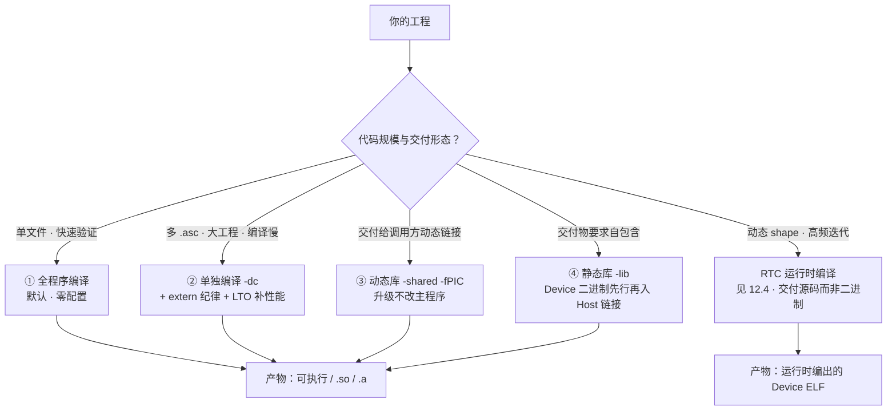

# 第12章 编译、工具链与部署

> 第 11 章的 `.asc` 文件是怎么变成芯片上能跑的机器码的？这一章把整条编译链讲透：毕昇编译器的异构编译流水、`--npu-arch` 架构选择、四种编译形态怎么选、RTC 把编译搬进运行时，以及没有真卡时的 Simulator 开发路径。

## 本章目标与阅读指引

- **实操**：能把一个 `.asc` 沿「离线静态编译」和「RTC 运行时编译」两条路走到能跑。
- **实操**：会选 `--npu-arch`，会做 2201→3510 的编译迁移。
- **决策**：全程序/单独/动态库/静态库四种形态按工程规模选型。
- **兜底**：没有真卡时用 NPU Simulator 完成精度与性能验证。

**明示边界**：毕昇（BiSheng）编译器的编译器源码不在本次开源基线内，本章所有内容基于开源文档、官方案例与产物用法——属于「怎么用」级，不是「怎么实现」级。

## 12.1 编译总流程与产物：从 .asc 到可执行

毕昇编译器是专为昇腾 AI 处理器设计的异构编译器，可执行文件名 `bisheng`，支持 x86、aarch64 宿主平台，文档按产品分块标注支持型号（950PR/950DT、A3、A2、Atlas 推理系列——**以你手上的文档版本为准**，开源文档用条件块区分型号）[^bisheng]。源码文件按扩展名分工：`.c`/`.cpp` 是 Host-only，`.asc` 与头文件（`.h` 等）可承载 Device、Host 或混合代码[^bisheng]。

AI Core SIMD 的基本命令一行：

```shell
# [需真机验证] --npu-arch 是必选项，dav-<arch-version> 见 12.2
bisheng add_kernel.asc -o main --npu-arch=dav-xxxx
```

它背后发生的事见图 12-1：**一份工程被分三路编译**——Host 代码用 Host 编译器出 Host 二进制；Device 侧 SIMD 代码按 Cube、Vector 分成两路二进制；Cube 与 Vector 先链接成 **Fatbin**，再与 Host 二进制合并成最终可执行文件[^aicore]。


*图 12-1 从 .asc 到可执行的异构编译流水线：三路分工对应第 2 章的硬件分工（Host 管账、Cube 算矩阵、Vector 算向量）；`--npu-arch` 就是在「分路编译」这一步选定目标架构。*

**SIMT 有一条支线**：编译 SIMT 代码（第 11 章）需加 `--enable-simt`，Device 侧只出 SIMT 二进制一路（不分 Cube/Vector），同样合成 Fatbin 再并入 Host 二进制[^aicore]。注意一条硬规则：**指定 `--enable-simt` 时若包含 SIMD API 头文件会直接编译失败**——两种范式的头文件不能混吃。

编译终点与第 5 章无缝对接：产物（Device ELF 形态的 kernel 二进制）在运行时由 `aclrtBinaryLoadFromData` 加载、`aclrtBinaryGetFunction` 取函数句柄、`aclrtLaunchKernelWithArgsArray` 启动——**第 5 章 binary_loader 的调用侧代码，正是本章产物的消费者**。

## 12.2 --npu-arch：给哪代芯片编译

`--npu-arch` 取值为 `dav-<架构版本号>`。本书已在前文钉死两个值：**dav-2201 对应 A2/A3**，**dav-3510 对应 950PR/950DT**（第 2 章 2.5、第 11 章）。更全的「产品型号↔架构版本」对应关系，官方固定放在语言扩展文档的 npu-arch 小节查询[^bisheng]——**写作纪律说明：本章骨架期曾登记 dav-2002，但在本地开源基线中检索不到该值，按「无出处不写」原则不采信，架构号请以官方对应表为准**。另有 `--npu-soc` 指定具体型号，与 `--npu-arch` 同时配置时 **arch 优先**[^aicore]。

跨代际迁移的编译侧动作很小，但要手动做：官方 2201→3510 迁移指导明确——命令行或 CMake 里的 `--npu-arch` 要自己改[^mig]：

```cmake
# [需真机验证] CMake 中按语言精准注入架构选项（官方迁移指导示例）
$<$<COMPILE_LANGUAGE:ASC>:--npu-arch=dav-xxxx>
```

架构差异还会影响**编译选项本身的效果**：`--cce-disable-vf-stack-reserved-ubuf`（禁用 VF 栈预留 UB）在 2201 上无实际效果，在 3510 上生效——但开启后编译器不再用预留 UB 缓存寄存器溢出，**溢出风险转嫁给用户**[^aicore]。这类「同名选项跨架构语义不同」的坑，升级架构时要逐项复核。

## 12.3 四种编译形态与 CMake 工程组织

bisheng 把四种形态做成了四个选项，命令汇总[^aicore]：

```shell
# [需真机验证] 四种形态（SIMD 版；SIMT 加 --enable-simt）
bisheng main.cpp add_kernel.asc -o main --npu-arch=dav-xxxx        # ① 全程序（默认）
bisheng -dc add_compute.asc -o add_compute.o --npu-arch=dav-xxxx   # ② 单独编译（relocatable）
bisheng -shared add_kernel.asc -o libadd_kernel.so -fPIC --npu-arch=dav-xxxx  # ③ 动态库
bisheng -lib add_kernel.asc -o libadd_kernel.a --npu-arch=dav-xxxx # ④ 静态库
```

**单独编译**值得单独说：默认的全程序模式要求单个 `.asc` 内的设备程序没有未解析的外部设备引用；要跨编译单元链接设备代码，所有 `.asc` 都得用 `-dc`，且**非常量设备变量跨单元引用必须 `extern` 声明、常量设备变量定义和引用都必须 `extern`**[^aicore]。换来的是更灵活的代码组织、更短的单次编译耗时、更小的产物；代价是设备代码链接可能影响性能——官方建议用 **LTO** 补回[^aicore]。

**静态库有个隐藏流程**：`-lib` 时编译器先把 Device 代码编译链接成 Device 二进制，再把它作为 Host 侧编译的输入，最后才链接成 `.a`[^aicore]——所以静态库不是「Device 产物打包」那么简单。

真仓的 CMake 组织看 ops-nn：`cmake/custom_kernel.cmake` 里 `add_custom_kernel_library` 会扫描算子目录结构（`op_host/<算子>_def.cpp` + `op_kernel/<算子>.cpp` + `config/<架构>/<算子>_binary.json`），按架构逐计算单元自动收集编译对象[^opscmake]——**「目录即约定」**：算子按模板摆好，构建系统自动认领。这正是第 13 章算子库体系的工程地基。


*图 12-3 编译形态选型树：前四种是离线形态，RTC 把编译搬到运行时——选型第一问是「shape 静不静态」，第二问才是「交付什么」。*

## 12.4 RTC：把编译搬进运行时

静态编译的两大痛点在大模型场景被放大：输入语句不定长导致 **shape 不确定**，静态产物难以为每个 shape 做到最优；算子持续迭代，静态交付件是二进制，每次优化都要重编重发[^rtcblog]。**RTC（Runtime Compiler）** 的解法：交付件从「二进制」变成「源码/中间码」，调用程序运行到某一 shape 时用 `aclrtc` 接口现场编译——shape 已确定，能编出针对该 shape 的最优产物[^rtcblog]。

核心流程七步（真码精读）[^rtc]：

```cpp
// [需真机验证] 摘自 rtc_hello_world 样例（节选）：源码以字符串内嵌，运行时编译
const char *src = R""""(
#include "utils/debug/asc_printf.h"
extern "C" __global__ __vector__ void hello_world()
{ printf("Hello World!!!\n"); }
)"""";

aclrtcProg prog;
aclrtcCreateProg(&prog, src, "hello_world.asc", 0, nullptr, nullptr);   // ① 建程序实例
const char *options[] = { "--npu-arch=" ACL_RTC_NPU_ARCH };             // ② 传 bisheng 选项
aclrtcCompileProg(prog, 1, options);                                    // ③ 运行时编译
aclrtcGetBinDataSize(prog, &binDataSizeRet);                            // ④ 取 Device ELF
aclrtcGetBinData(prog, deviceELF.data());
// ⑤ 之后走标准加载链（第5章）：aclrtBinaryLoadFromData(MAGIC_ELF_AICORE)
//    → aclrtBinaryGetFunction → aclrtLaunchKernelWithArgsArray
```

host 侧编译这程序时链接的是 `libacl_rtc`：`g++ rtc_hello_world.cpp … -lacl_rtc -o main`[^rtc]。两个细节容易翻车：**模板核函数**编译器无法自动确定导出哪个特化，必须 `aclrtcAddNameExpr(prog, "Kernel::add_custom<float>")` 注册，编完用 `aclrtcGetLoweredName` 取 mangled name 再去查句柄[^rtc]；编译失败时日志不走 stderr，用 **`aclrtcGetCompileLog`** 拉[^rtc]。

```mermaid
flowchart LR
    subgraph offline["离线静态编译"]
        direction LR
        A1["开发期 bisheng 编译"] --> A2["部署二进制交付件"] --> A3["运行时加载执行<br/>（第5章 binary_loader）"]
    end
    subgraph online["RTC 运行时编译"]
        direction LR
        B1["部署源码/中间码交付件"] --> B2["运行至确定 shape"] --> B3["aclrtc 现场编译"] --> B4["同一套加载链执行"]
    end
    O1["✓ 交付即用<br/>✗ shape 变了不是最优"] :::minus -.-> offline
    O2["✓ 逐 shape 最优 · 迭代只发源码<br/>✗ 首次运行带编译延迟"] :::plus -.-> online
    classDef minus fill:#fceff1,stroke:#c92a2a;
    classDef plus fill:#e8f4ec,stroke:#2f9e63;
```
*图 12-2 静态 vs RTC 双泳道：执行链路终点汇合（都走第 5 章的加载-启动链），分岔点在「编译发生在交付前还是运行时」。*

## 12.5 NPU Simulator：没有卡也能开发

NPU Simulator 是 SoC 级芯片仿真工具，两大功能：**精度仿真**（输出 bit 级结果，验证算子正确性）与**性能仿真**（输出指令流水数据，定位瓶颈），且**与板上运行二进制兼容**——同一 kernel 在仿真器和真卡上都能跑[^sim]。「芯片资源紧缺」阶段的开发兜底，就靠它。

用法三步（add_example 真码）[^sim]：

```shell
# [需仿真环境验证] ① 编算子包（ops-nn 工程惯例：目录即约定）
bash build.sh --pkg --soc=ascend950 --vendor_name=custom --ops=add_example
./build_out/cann-ops-nn-custom_linux-<arch>.run            # ② 装算子包
npusim record ./test_aclnn_add_example -s Ascend950 --gen-report  # ③ 录制仿真
```

仿真产物在 `npusim_*/report/` 下：精度结果看运行日志，性能看 `trace_core0.json` 流水文件[^sim]。两个时效性注意：工具 2026-07-30 起由 cannsim 更名 **npusim**（旧命令别名保留，脚本尽早迁移）[^sim]；约束也硬——**仅支持 950PR/950DT、仅单卡（卡号必须 0）、不支持 MC2 与 HCCL 类算子、宿主不支持 arm、建议 16 核 32GB、定位开发工具不建议生产使用**[^sim]。另有一个易混淆的兄弟选项：bisheng 的 `--run-mode=sim` 是链接仿真实现库看日志的编译期开关，与 npusim 是两条仿真路径，别混为一谈[^aicore]。

## 12.6 部署与工具箱

**部署形态**：单算子包之外，多算子可合并交付（官方有多算子打包流程）[^deploy]；跨平台交付走交叉编译[^deploy]；大型工程还有官方编译加速方案[^deploy]。

**值得认识的编译选项**（全表见文档）[^aicore]：

| 选项 | 干什么 | 本章关联 |
|---|---|---|
| `-g` + `--sanitizer` | 带调试信息 + 正确性校验（须配 `-g`，不能 `-O0`） | 衔接第 7 章 msSanitizer |
| `--cce-auto-sync` | 编译器自动插入部分核内同步 | 第 10 章手工同步的「自动挡」试炼 |
| `-O3/-O2/-O0` | 优化级别 | 性能章基线控制变量 |
| `--run-mode=sim` | 链接仿真实现库 | 12.5 的编译期仿真路径 |

编译问题排查三件套：编译失败先看 bisheng 报错与 `aclrtcGetCompileLog`（RTC 路径）；正确性问题开 `--sanitizer`；深水区用官方编译调试流程（`compilation_debug.md`）[^deploy]。极致性能场景还有 AOT 编译优化专题[^aot]。

## 陷阱与注意（汇总）

| 坑 | 症状 | 对策 |
|---|---|---|
| `--npu-arch` 忘带或选错 | 编译失败，或产物与真机架构不符 | 必选项；对照官方对应表（12.2），型号优先级 arch > soc |
| `-dc` 单独编译漏 extern | 链接失败 | 非量设备变量 extern 声明、常量设备变量 extern 定义+引用（12.3） |
| `--enable-simt` 时 include SIMD API 头 | 直接编译失败 | SIMT/SIMD 头文件不混吃（12.1） |
| `--sanitizer` 配 `-O0` 或缺 `-g` | 选项不生效/报错 | 必须配 `-g` 且避开 `-O0`（12.6） |
| RTC 模板核函数不注册名表达式 | 运行时找不到符号 | `aclrtcAddNameExpr` + `aclrtcGetLoweredName`（12.4） |
| RTC 编译失败找不到原因 | 黑盒 | 日志在 `aclrtcGetCompileLog`，不在 stderr（12.4） |
| 以为 Simulator 能仿多卡/MC2/HCCL | 仿真失败 | 仅 950、单卡 0 号、AI Core 算子（12.5） |
| 老脚本还在调 cannsim | 命令失效风险 | 2026-07 起更名 npusim，尽早迁移（12.5） |
| 跨架构复用 reserved-ubuf 相关选项 | 3510 上寄存器溢出 | `--cce-disable-vf-stack-reserved-ubuf` 仅 3510 生效且风险自担（12.2） |

## 本章小结

::: tip 一句话总结
**一条流水线：bisheng 把 Host/Cube/Vector 分三路编译合成 Fatbin 出可执行（SIMT 走 `--enable-simt` 支线、不分 Cube/Vector）。一个必选项：`--npu-arch=dav-2201|dav-3510`，跨代迁移改这里。四种形态按规模选：全程序求快、`-dc` 求编译伸缩（extern 纪律+LTO）、动态库求升级灵活、静态库求自包含。两条编译时机：shape 静态走离线，shape 动态/高频迭代走 RTC（交付源码、现场编译、同一加载链）。没卡用 npusim：bit 级精度+指令流水，但仅 950/单卡。**
:::

## 本章来源与进一步阅读

[^bisheng]: 毕昇编译器简介（定位、宿主平台、支持型号条件块、源码扩展名分工表、官方《毕昇编译器用户指南》入口）：`asc-devkit/docs/zh/guide/programming_guide/compilation_and_execution/operator_compilation/bisheng_compiler.md`；产品↔架构版本对应关系表固定入口：`…/language_extension/simd_builtin_keywords.md` 的 npu-arch 小节（官方文档）。
[^aicore]: AI Core 编译基本用法（SIMD 三路异构流程与官方流程图、SIMT `--enable-simt` 支线与头文件互斥规则、四种形态命令汇总表、`-dc` extern 强制约束与 LTO、静态库隐藏流程、常用编译选项全表含 `--cce-auto-sync`/`--sanitizer`/`--run-mode=sim`/reserved-ubuf 跨架构语义）：`asc-devkit/docs/zh/guide/programming_guide/compilation_and_execution/operator_compilation/ai_core_operator_compilation.md`（官方文档）；四个编译形态完整样例：`asc-devkit/examples/01_simd_cpp_api/02_features/04_compile/{00_basic_compile,01_separate_compile,02_dynamic_library_compile,03_static_library_compile}/`（CANN Open 2.0）。
[^mig]: 2201→3510 算子编译迁移（CMake `--npu-arch` 手动修改示例）：`asc-devkit/docs/zh/guide/cross_gen_migration_guide/3510_arch_migration/2201_to_3510_guide/op_compilation_migration.md`（官方文档）。
[^rtc]: RTC 运行时编译（七接口流程、`ACL_RTC_NPU_ARCH` 默认 dav-2201、模板核函数 `aclrtcAddNameExpr`/`aclrtcGetLoweredName`、`aclrtcGetCompileLog`、加载链 `aclrtBinaryLoadFromData(ACL_RT_BINARY_MAGIC_ELF_AICORE)`→`GetFunction`→`LaunchKernelWithArgsArray`、`-lacl_rtc` 链接、`rtc_hello_world`/`rtc_template_add` 样例）：`asc-devkit/docs/zh/guide/programming_guide/compilation_and_execution/operator_compilation/rtc_runtime_compilation.md` 及 `asc-devkit/examples/01_simd_cpp_api/02_features/05_aclrtc/`（官方文档与 CANN Open 2.0 样例）。
[^rtcblog]: RTC 动机与亮点（动态 shape 逐 shape 最优、源码交付迭代便利、编译 IO 减少）：`cann-learning-hub/blogs/operator/ascendc_rtc_compilation/自定义算子开发系列：Ascend C RTC即时编译.md`（社区博客）。
[^sim]: NPU Simulator（bit 级精度仿真+指令流水性能仿真、二进制兼容、`npusim record --gen-report` 真码、`trace_core0.json`、cannsim→npusim 更名通知、约束清单仅950/单卡/不支持MC2与HCCL/arm、`build.sh --pkg --soc=ascend950` 编译惯例）：`ops-nn/docs/zh/debug/npu_sim.md`（官方文档）。
[^opscmake]: 真仓 CMake 组织（`add_custom_kernel_library` 按目录约定扫描 op_host/op_kernel/binary.json）：`ops-nn/cmake/custom_kernel.cmake`、`ops-nn/cmake/gen_ops_info.cmake`（CANN Open 2.0）。
[^deploy]: 部署与工具链文档族（多算子打包、交叉编译、编译加速、编译调试）：`asc-devkit/docs/zh/guide/programming_guide/advanced_programming/aclnn_operator_development/compilation_and_deployment/{multi_operator_package.md,cross_compilation.md,compilation_acceleration.md,compilation_debug.md}`（官方文档）。
[^aot]: AOT 编译优化专题：`asc-devkit/docs/zh/guide/programming_guide/advanced_programming/aot_compilation_optimization.md`（官方文档）。

- **下一站**：第 13 章「算子库体系」——本章「目录即约定」的构建系统背后，ops-nn/ops-transformer/ops-sparse 三仓怎么组织、aclnn 算子怎么生成。
- **交叉引用**：binary_loader 加载链见第 5 章 5.3；`<<<>>>` 启动见第 9 章 9.2；同步的「自动挡 vs 手动挡」见第 10 章 10.2；msSanitizer 见第 7 章。
