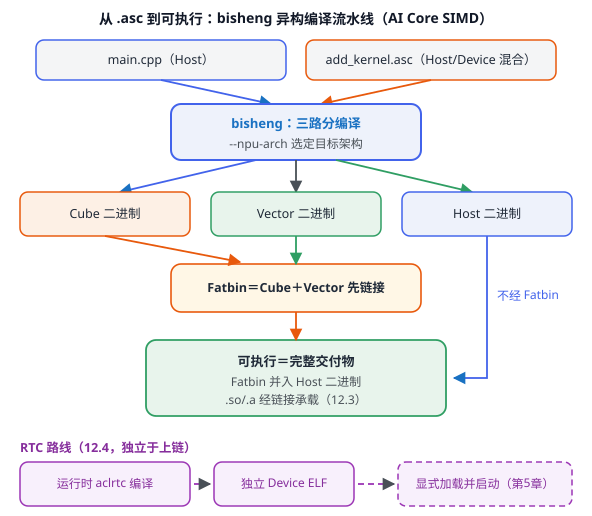
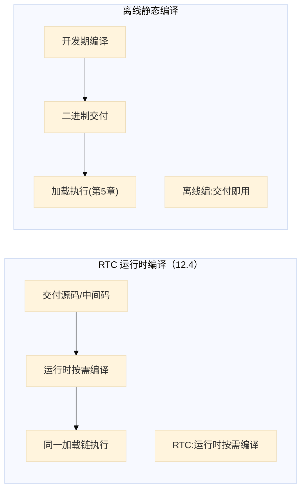

# 第12章 编译、工具链与部署

> 第 11 章的 `.asc` 文件是怎么变成芯片上能跑的机器码的？这一章把整条编译链讲透：毕昇编译器的异构编译流水、`--npu-arch` 架构选择、四种编译形态怎么选、RTC 把编译搬进运行时，以及没有真卡时的 Simulator 开发路径。

## 本章目标与阅读指引

- **实操**：能把一个 `.asc` 沿「离线静态编译」和「RTC 运行时编译」两条路走到能跑。
- **实操**：会选 `--npu-arch`，会做 2201→3510 的编译迁移。
- **决策**：全程序/单独/动态库/静态库四种形态按工程规模选型。
- **兜底**：没有真卡时用 NPU Simulator 完成精度与性能验证。

**明示边界**：毕昇（BiSheng）编译器的编译器源码不在本次开源基线内，本章所有内容基于开源文档、官方案例与产物用法——属于「怎么用」级，不是「怎么实现」级。

## 12.1 编译总流程与产物：从 .asc 到可执行

毕昇编译器是专为昇腾 AI 处理器设计的异构编译器，可执行文件名 `bisheng`，支持 x86、aarch64 宿主平台，文档按产品分块标注支持型号（950PR/950DT、A3、A2、Atlas 推理系列——**以你手上的文档版本为准**，开源文档用条件块区分型号）[^bisheng]。源码文件按扩展名分工：`.c`/`.cpp/.cc/.cxx` 是 Host-only，`.asc` 与头文件（`.h/.hpp/.hh/.hxx`）可承载 Device、Host 或混合代码[^bisheng]。

AI Core SIMD 的基本命令一行：

```shell
# 摘自原文，本书未编译。--npu-arch 必需见选项表；dav 值见 12.2
bisheng add_kernel.asc -o main --npu-arch=dav-xxxx
```

它背后发生的事见图 12-1：**一份工程被分三路编译**——Host 代码用 Host 编译器出 Host 二进制；Device 侧 SIMD 代码按 Cube、Vector 分成两路二进制；Cube 与 Vector 先链接成 **Fatbin**，再与 Host 二进制合并成最终可执行文件[^aicore]。



*图 12-1 从 .asc 到可执行的异构编译流水线：三路分工对应第 2 章的硬件分工（Host 管账、Cube 算矩阵、Vector 算向量）；`--npu-arch` 就是在「分路编译」这一步选定目标架构。*

**SIMT 有一条支线**：编译 SIMT 代码（第 11 章）需加 `--enable-simt`，Device 侧只出 SIMT 二进制一路（不分 Cube/Vector），同样合成 Fatbin 再并入 Host 二进制[^aicore]。注意一条硬规则：**指定 `--enable-simt` 时若包含 SIMD API 头文件会直接编译失败**——两种范式的头文件不能混吃。

编译终点的**可执行文件**是完整交付物：Device 二进制已并入其中（Cube/Vector 链成 Fatbin 后与 Host 二进制合并，图 12-1）；静态库则先把 Device 二进制作 Host 编译输入、链入可执行后同样自含（12.3）。运行时由第 5 章加载链从产物内取 kernel 部分（`aclrtBinaryLoadFromData`→`GetFunction`→`LaunchKernel...`）——**无需单独的 Device ELF 文件**；只有 RTC 等显式场景才独立持有 Device ELF 再走同一加载链（12.4）。

## 12.2 --npu-arch：给哪代芯片编译

`--npu-arch` 取值为 `dav-<架构版本号>`，选项表明标**「必需：是」**——命令行直编必须携带[^aicore]。产品↔架构对应官方固定于语言扩展 npu-arch 小节：**950PR/DT→3510、A3/A2→2201**（同前文两值）[^bisheng]。工程另一层：CMake 变量 `CMAKE_ASC_ARCHITECTURES` **默认即 dav-2201**，可 `-D` 覆盖——工程默认不免除命令行必选，两层勿混[^aicore]。另有 `--npu-soc` 指定具体型号，同设时 **arch 优先**[^aicore]。

跨代际迁移的编译侧动作很小，但要手动做：官方 2201→3510 迁移指导明确——命令行或 CMake 里的 `--npu-arch` 要自己改[^mig]：

```cmake
# 摘自原文，本书未编译。源：2201→3510 迁移指导 op_compilation_migration.md
$<$<COMPILE_LANGUAGE:ASC>:--npu-arch=dav-xxxx>
```

架构差异还会影响**编译选项本身的效果**：`--cce-disable-vf-stack-reserved-ubuf`（禁用 VF 栈预留 UB）在 2201 上无实际效果，在 3510 上生效——但开启后编译器不再用预留 UB 缓存寄存器溢出，**溢出风险转嫁给用户**[^aicore]。这类「同名选项跨架构语义不同」的坑，升级架构时要逐项复核。

## 12.3 四种编译形态与 CMake 工程组织

bisheng 把四种形态做成四个选项——**SIMT 侧每条都追加 `--enable-simt`（官方为四形态×SIMD/SIMT 全表）**，此处录 SIMD 列[^aicore]：

```shell
# 摘自原文，本书未编译。SIMT 列每条加 --enable-simt（官方全表）
bisheng main.cpp add_kernel.asc -o main --npu-arch=dav-xxxx        # ① 全程序（默认）
bisheng -dc add_compute.asc -o add_compute.o --npu-arch=dav-xxxx   # ② 单独编译（relocatable）
bisheng -shared add_kernel.asc -o libadd_kernel.so -fPIC --npu-arch=dav-xxxx  # ③ 动态库
bisheng -lib add_kernel.asc -o libadd_kernel.a --npu-arch=dav-xxxx # ④ 静态库
```

**单独编译**值得单独说：默认的全程序模式要求单个 `.asc` 内的设备程序没有未解析的外部设备引用；要跨编译单元链接设备代码，所有 `.asc` 都得用 `-dc`，且**非常量设备变量跨单元引用必须 `extern` 声明、常量设备变量定义和引用都必须 `extern`**[^aicore]。换来的是更灵活的代码组织、更短的编译耗时、体积更小的可执行文件；代价是设备代码链接可能影响性能——官方明言 LTO **可有效降低**该损耗（不保证补回）[^aicore]。

**主线工程对照（真实样例 `00_basic_compile`，本书未编译）**：输入就两文件——`add_kernel.asc`（混合：Kernel 定义＋`<<<>>>` 发射，经 `extern` 暴露给纯 Host 的 `main.cpp`）[^bisheng]。CMake 连接五步，全部摘自其 `CMakeLists.txt`：

| 步骤 | 该样例原文 | 作用 |
|---|---|---|
| 架构 | `set(CMAKE_ASC_ARCHITECTURES "dav-2201" CACHE ...)` | 可 `-DCMAKE_ASC_ARCHITECTURES=dav-3510` 覆盖 |
| 工具链 | `find_package(ASC REQUIRED)` | 找到并配置 bisheng 编译链 |
| 语言 | `project(basic_compile LANGUAGES ASC CXX)` | 声明 `.asc` 为一等语言 |
| 目标 | `add_executable(demo add_kernel.asc main.cpp)` | 目标名就叫 **demo**，两源码直入 |
| 链接语言 | `set_target_properties(demo ... LINKER_LANGUAGE ASC)` | 链接器按 ASC 走 |

include 依赖 `$ENV{ASCEND_HOME_PATH}/include`。README 给的真实构建命令即上文一行式（`bisheng main.cpp add_kernel.asc -o demo --npu-arch=dav-2201 -I${ASCEND_HOME_PATH}/include`）。CMake 路径在样例目录执行：

```shell
# 按 README 摘录，本书未执行；此处以 A2/A3 的 dav-2201 为例
mkdir -p build
cd build
cmake -DCMAKE_ASC_ARCHITECTURES=dav-2201 ..
make -j
# 产物为 build/demo；运行需要匹配的环境与设备
```

目录里没有别的脚本，也不需要。**其余形态（`-dc` 01、动态 02、静态 03）为同目录独立样例；RTC 见 05_aclrtc、npusim 见 ops-nn——互不拼接。本书未运行。**

**静态库有个隐藏流程**：`-lib` 时编译器先把 Device 代码编译链接成 Device 二进制，再把它作为 Host 侧编译的输入，最后才链接成 `.a`[^aicore]——所以静态库不是「Device 产物打包」那么简单。

真仓的 CMake 组织看 ops-nn：`cmake/custom_kernel.cmake` 里 `add_custom_kernel_library` 会扫描算子目录结构（`op_host/<算子>_def.cpp`＋`op_kernel/<算子>.cpp`＋**`op_host/config/<计算单元>/<算子>_binary.json`**），**逐计算单元**自动收集编译对象[^opscmake]——**「目录即约定」**：算子按模板摆好，构建系统自动认领。这正是第 13 章算子库体系的工程地基。

| 你的情况 | 形态（命令差异） | 要点 |
|---|---|---|
| 单文件 · 快速验证 | ① 全程序（默认） | 零配置，单 `.asc` 内设备引用须自含 |
| 多 `.asc` · 大工程 · 编译慢 | ② `--npu-arch` ＋ `-dc` 单独编译 | extern 纪律＋LTO 降损耗（12.3） |
| 需被应用动态链接 | ③ `-shared -fPIC` | 应用侧动态链接，库可独立重编（基线未论升级流程） |
| 需静态链入最终产物 | ④ `-lib` 静态库 | Device 二进制先作 Host 编译输入，链入后自含 |
| 高频迭代 · 源码交付 | RTC 运行时编译 | 交付源码/中间码，12.4 |
*表 12-3 编译形态选型：先问「交付/特化策略」，再看规模（SIMT 侧各条加 `--enable-simt`）；动态 shape 处置见 12.4。*

## 12.4 RTC：把编译搬进运行时

静态编译的两大痛点在大模型场景被放大：输入语句不定长导致 **shape 不确定**，静态产物难以为每个 shape 做到最优；算子持续迭代，静态交付件是二进制，每次优化都要重编重发[^rtcblog]。**RTC（Runtime Compiler）** 的解法：交付件从「二进制」变成「源码/中间码」，调用程序运行到某一 shape 时用 `aclrtc` 接口现场编译——**是否/如何按 shape 特化取决于程序**（模板注册、编译宏或选项，见下），效果须实测，不作「最优」保证[^rtcblog]。

核心流程节选（省略错误检查、缓冲区声明及资源释放；完整实现见样例）[^rtc]：

```cpp
// 摘自原文，本书未编译。源：examples/01_simd_cpp_api/02_features/05_aclrtc/rtc_hello_world/
const char *src = R""""(
#include "utils/debug/asc_printf.h"
extern "C" __global__ __vector__ void hello_world()
{ printf("Hello World!!!\n"); }
)"""";

aclrtcProg prog;
aclrtcCreateProg(&prog, src, "hello_world.asc", 0, nullptr, nullptr);   // ① 建程序实例
const char *options[] = { "--npu-arch=" ACL_RTC_NPU_ARCH };             // ② 传 bisheng 选项
aclrtcCompileProg(prog, 1, options);                                    // ③ 运行时编译
aclrtcGetBinDataSize(prog, &binDataSizeRet);                            // ④ 取 Device ELF
aclrtcGetBinData(prog, deviceELF.data());
// ⑤ 之后走标准加载链（第5章）：aclrtBinaryLoadFromData(MAGIC_ELF_AICORE)
//    → aclrtBinaryGetFunction → aclrtLaunchKernelWithArgsArray
```

host 侧编译链接 `libacl_rtc`：`g++ rtc_hello_world.cpp … -lacl_rtc -o main`[^rtc]。代码里 `ACL_RTC_NPU_ARCH` 为**样例内 `#ifndef` 宏（默认 dav-2201）**，非工具默认——换架构自行 `-D`[^rtc]。两个细节容易翻车：**模板核函数**编译器无法自动确定导出哪个特化，必须 `aclrtcAddNameExpr(prog, "Kernel::add_custom<float>")` 注册，编完用 `aclrtcGetLoweredName` 取 mangled name 再去查句柄[^rtc]；编译失败时日志不走 stderr，用 **`aclrtcGetCompileLog`** 拉[^rtc]。

**shape 如何进编译**：靠程序把 shape 写进源码模板（`aclrtcAddNameExpr` 注册特化）或编译选项/宏——**RTC 不自动感知 shape**；hello_world 无 shape，不作特化证据。


```mermaid
%%{init: {"theme":"base","themeVariables":{"fontSize":"16px"}}}%%
flowchart TB
    subgraph offline["离线静态编译"]
        direction TB
        A1["开发期编译"] --> A2["二进制交付"] --> A3["加载执行(第5章)"]
        A4["离线编:交付即用"]
    end
    subgraph online["RTC 运行时编译（12.4）"]
        direction TB
        B1["交付源码/中间码"] --> B2["运行时按需编译"] --> B3["同一加载链执行"]
        B5["RTC:运行时按需编译"]
    end
    offline ~~~ online
```
*图 12-2 读法：分岔仅在「编译发生于交付前还是运行时」，**非「shape 静/动」一一对应**——RTC 按运行时实际 shape 编译，离线侧如何应对多 shape 本书不展开；终点同一加载链。效果须实测。*

## 12.5 NPU Simulator：没有卡也能开发

NPU Simulator 是 SoC 级芯片仿真工具，两大功能：**精度仿真**（输出 bit 级结果，验证算子正确性）与**性能仿真**（输出指令流水数据，定位瓶颈），且**与板上运行二进制兼容**——同一 kernel 在仿真器和真卡上都能跑[^sim]。「芯片资源紧缺」阶段的开发兜底，就靠它。

用法节选（add_example；执行仿真前还须按调用文档编译 test_aclnn_add_example.cpp，生成下面的可执行文件）[^sim]：

```shell
# 摘自原文，本书未仿真。源：ops-nn/docs/zh/debug/npu_sim.md；仅 950PR/DT 单卡
bash build.sh --pkg --soc=ascend950 --vendor_name=custom --ops=add_example
./build_out/cann-ops-nn-custom_linux-<arch>.run            # ② 装算子包
npusim record ./test_aclnn_add_example -s Ascend950 --gen-report  # ③ 录制仿真
```

仿真产物在 `npusim_*/report/` 下：精度结果看运行日志，性能看 `trace_core0.json` 流水文件[^sim]。两个时效性注意：工具 2026-07-30 起由 cannsim 更名 **npusim**（旧命令别名保留，脚本尽早迁移）[^sim]；约束也硬——**仅支持 950PR/950DT、仅单卡（卡号必须 0）、不支持 MC2 与 HCCL 类算子、宿主不支持 arm、建议 16 核 32GB、定位开发工具不建议生产使用**[^sim]。另有一个易混淆的兄弟选项：bisheng 的 `--run-mode=sim` 是链接仿真实现库看日志的编译期开关，与 npusim 是两条仿真路径，别混为一谈[^aicore]。

## 12.6 部署与工具箱

**部署形态**：单算子包之外，多算子可合并交付（官方有多算子打包流程）[^deploy]；跨平台交付走交叉编译[^deploy]；大型工程还有官方编译加速方案，动/静态库编译另有专篇（同目录 `dynamic_static_lib_compilation.md`）[^deploy]。

**值得认识的编译选项**（全表见文档）[^aicore]：

| 选项 | 干什么 | 本章关联 |
|---|---|---|
| `-g` + `--sanitizer` | 带调试信息 + 正确性校验（须配 `-g`，不能 `-O0`） | 衔接第 7 章 msSanitizer |
| `--cce-auto-sync` | 编译器自动插入部分核内同步 | 第 10 章手工同步的「自动挡」试炼 |
| `-O3/-O2/-O0` | 优化级别 | 性能章基线控制变量 |
| `--run-mode=sim` | 链接仿真实现库 | 12.5 的编译期仿真路径 |

编译问题排查三件套：编译失败先看 bisheng 报错与 `aclrtcGetCompileLog`（RTC 路径）；正确性问题开 `--sanitizer`；深水区用官方编译调试流程（`compilation_debug.md`）[^deploy]。极致性能场景还有 AOT 编译优化专题[^aot]。

## 陷阱与注意（汇总）

| 坑 | 症状 | 对策 |
|---|---|---|
| `--npu-arch` 忘带或选错 | 编译失败，或产物与真机架构不符 | 必选项；对照官方对应表（12.2），型号优先级 arch > soc |
| `-dc` 单独编译漏 extern | 链接失败 | 非常量设备变量 extern 声明、常量设备变量 extern 定义+引用（12.3） |
| `--enable-simt` 时 include SIMD API 头 | 直接编译失败 | SIMT/SIMD 头文件不混吃（12.1） |
| `--sanitizer` 配 `-O0` 或缺 `-g` | 选项不生效/报错 | 必须配 `-g` 且避开 `-O0`（12.6） |
| RTC 模板核函数不注册名表达式 | 运行时找不到符号 | `aclrtcAddNameExpr`+`aclrtcGetLoweredName`；shape 经模板/宏进编译，非自动（12.4） |
| RTC 编译失败找不到原因 | 黑盒 | 日志在 `aclrtcGetCompileLog`，不在 stderr（12.4） |
| 以为 Simulator 能仿多卡/MC2/HCCL | 仿真失败 | 仅 950、单卡 0 号、AI Core 算子（12.5） |
| 老脚本还在调 cannsim | 命令失效风险 | 2026-07 起更名 npusim，尽早迁移（12.5） |
| 跨架构复用 reserved-ubuf 相关选项 | 3510 上寄存器溢出 | `--cce-disable-vf-stack-reserved-ubuf` 仅 3510 生效且风险自担（12.2） |

## 本章小结

::: tip 一句话总结
**一条链，两个时机**：bisheng 把 Host/Cube/Vector 分三路编出二进制，Cube+Vector 先并 Fatbin 再并入 Host 产物（SIMT 走 `--enable-simt` 单路）；`--npu-arch` 命令行必需、对应表查 2201/3510。编译时机两选：交付前离线编，或 RTC 交源码运行时 `aclrtc` 现场编——终点同一加载链。

**边界**：四形态按工程与交付选（`-dc` 守 extern 纪律＋LTO 降损耗）；SIMT/SIMD 头不混吃；shape 特化靠程序写进模板/选项，RTC 不自动最优；无卡用 npusim（仅 950 单卡，开发定位）。本书全部示例未编译、未仿真、无真机。
:::

## 本章来源与进一步阅读

[^bisheng]: 毕昇编译器简介（定位、宿主平台、支持型号条件块、源码扩展名分工表、官方《毕昇编译器用户指南》入口）：`asc-devkit/docs/zh/guide/programming_guide/compilation_and_execution/operator_compilation/bisheng_compiler.md`；产品↔架构版本对应关系表固定入口：`asc-devkit/docs/zh/guide/programming_guide/language_extension/simd_builtin_keywords.md` 的 npu-arch 小节（官方文档）。
[^aicore]: AI Core 编译基本用法（SIMD 三路异构流程与官方流程图、SIMT `--enable-simt` 支线与头文件互斥规则、四种形态命令汇总表、`-dc` extern 强制约束与 LTO、静态库隐藏流程、常用编译选项全表含 `--cce-auto-sync`/`--sanitizer`/`--run-mode=sim`/reserved-ubuf 跨架构语义）：`asc-devkit/docs/zh/guide/programming_guide/compilation_and_execution/operator_compilation/ai_core_operator_compilation.md`（官方文档）；四个编译形态完整样例：`asc-devkit/examples/01_simd_cpp_api/02_features/04_compile/{00_basic_compile,01_separate_compile,02_dynamic_library_compile,03_static_library_compile}/`（CANN Open 2.0）。
[^mig]: 2201→3510 算子编译迁移（CMake `--npu-arch` 手动修改示例）：`asc-devkit/docs/zh/guide/cross_gen_migration_guide/3510_arch_migration/2201_to_3510_guide/op_compilation_migration.md`（官方文档）。
[^rtc]: RTC 运行时编译（七接口流程、样例宏 `ACL_RTC_NPU_ARCH` 默认 dav-2201（见 `rtc_hello_world` 源 L21–22）、模板核函数 `aclrtcAddNameExpr`/`aclrtcGetLoweredName`、`aclrtcGetCompileLog`、加载链 `aclrtBinaryLoadFromData(ACL_RT_BINARY_MAGIC_ELF_AICORE)`→`GetFunction`→`LaunchKernelWithArgsArray`、`-lacl_rtc` 链接、`rtc_hello_world`/`rtc_template_add` 样例）：`asc-devkit/docs/zh/guide/programming_guide/compilation_and_execution/operator_compilation/rtc_runtime_compilation.md` 及 `asc-devkit/examples/01_simd_cpp_api/02_features/05_aclrtc/`（官方文档与 CANN Open 2.0 样例）。
[^rtcblog]: RTC 动机与亮点（动态 shape 逐 shape 最优、源码交付迭代便利、编译 IO 减少）：`cann-learning-hub/blogs/operator/ascendc_rtc_compilation/自定义算子开发系列：Ascend C RTC即时编译.md`（社区博客）。
[^sim]: NPU Simulator（bit 级精度仿真+指令流水性能仿真、二进制兼容、`npusim record --gen-report` 真码、`trace_core0.json`、cannsim→npusim 更名通知、约束清单仅950/单卡/不支持MC2与HCCL/arm、`build.sh --pkg --soc=ascend950` 编译惯例）：`ops-nn/docs/zh/debug/npu_sim.md`（官方文档）。
[^opscmake]: 真仓 CMake 组织（`add_custom_kernel_library` 按目录约定扫描 op_host/op_kernel/binary.json）：`ops-nn/cmake/custom_kernel.cmake`、`ops-nn/cmake/gen_ops_info.cmake`（CANN Open 2.0）。
[^deploy]: 部署与工具链文档族（多算子打包、交叉编译、编译加速、编译调试）：`asc-devkit/docs/zh/guide/programming_guide/advanced_programming/aclnn_operator_development/compilation_and_deployment/{multi_operator_package.md,cross_compilation.md,compilation_acceleration.md,compilation_debug.md}`（官方文档）。
[^aot]: AOT 编译优化专题：`asc-devkit/docs/zh/guide/programming_guide/advanced_programming/aot_compilation_optimization.md`（官方文档）。

- **下一站**：第 13 章「算子库体系」——本章「目录即约定」的构建系统背后，ops-nn/ops-transformer/ops-sparse 三仓怎么组织、aclnn 算子怎么生成。
- **交叉引用**：binary_loader 加载链见第 5 章 5.3；`<<<>>>` 启动见第 9 章 9.2；同步的「自动挡 vs 手动挡」见第 10 章 10.2；msSanitizer 见第 7 章。
