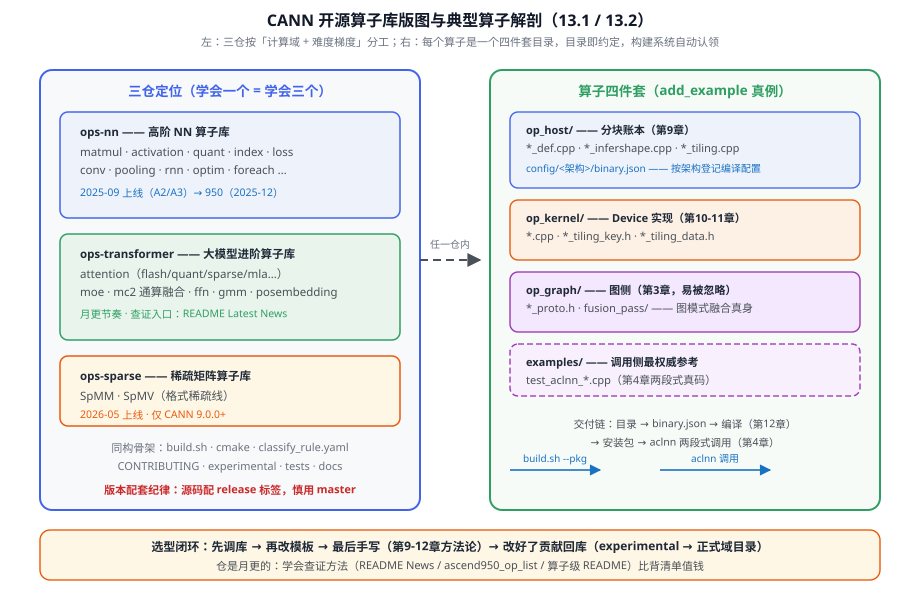
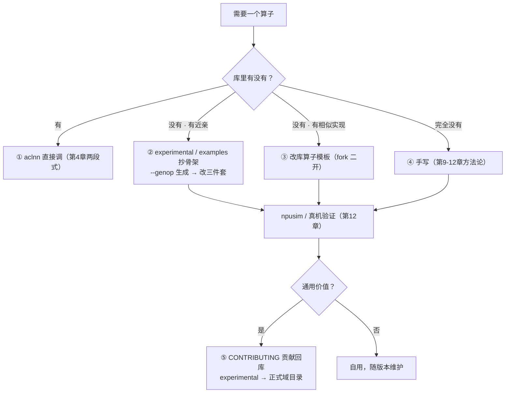
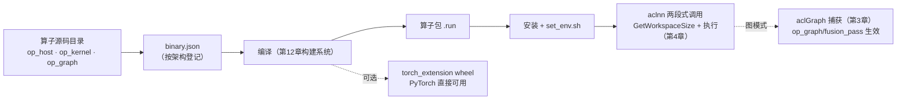

# 第13章 算子库体系

> 前三章教你「自己写算子」，这一章教你「先别写」——CANN 的开源算子库大概率已经有你要的东西。三仓怎么分工、一个库算子长什么样、怎么编译安装跑通、改完往哪贡献，一条链讲完。

## 本章目标与阅读指引

- **视野**：知道 ops-nn / ops-transformer / ops-sparse 各管什么，按图索骥找到目标算子。
- **实操**：跑通一个库算子的「编译 → 安装 → aclnn 调用」全链。
- **方法**：掌握读一个陌生库算子的标准动作清单，会二开、知道往哪贡献。

**时效性纪律**：三仓上新节奏极快（ops-transformer 的 README 月更级别），本章只写结构性事实；算子清单给「族系 + 查证方法」，具体算子以写作时各仓 README/CHANGELOG 为准。

## 13.1 三仓定位与版图

CANN 开源算子库按「计算域 + 难度梯度」分三个仓，目录结构与构建系统**完全同构**——学会一个等于学会三个：

| 仓 | 定位 | 覆盖域 | 上线 | 版本底线 |
|---|---|---|---|---|
| **ops-nn** | 高阶 NN 算子库 | matmul、activation、quant、index、loss、conv、pooling、rnn、optim、foreach、hash、control、vfusion 等 16 个域 | 2025-09（A2/A3） | 随 CANN 配套 |
| **ops-transformer** | 大模型进阶算子库 | attention、moe、mc2、ffn、gmm、posembedding | 2025-09（A2/A3） | 随 CANN 配套 |
| **ops-sparse** | 稀疏矩阵算子库 | SpMM、SpMV | 2026-05 | 仅 CANN 9.0.0+ |

[^nnreadme][^trreadme][^spreadme]

两个贯穿三仓的纪律[^nnreadme]：**版本配套**——源码要配 release 仓的 tag 用，直接用 master 分支有版本错配风险；**950 支持**——两主力仓 2025-12 起支持 950PR/950DT/KirinX90，且开源算子直接可用 NPU Simulator 调试（第 12 章的无卡开发路径在算子库上原样成立）。

选型口径与第 9 章决策树衔接：**先用库（aclnn 直接调）→ 库不完全合适就改模板（二开源码算子）→ 都不满足才手写（第 9-12 章的内容）→ 改好了贡献回库**。手写是最后选项，不是默认选项。



*图 13-1 三仓版图与算子解剖：左半管「去哪找」，右半管「长什么样」——四件套里 op_graph 最易被忽略，却是图模式收益的真身。*

## 13.2 ops-nn 深看：一个典型算子的解剖

ops-nn 里每个算子是一个四件套目录。以 `examples/add_example` 为真例[^addex]：

```text
add_example/
├── op_host/                  # Host 侧（第9章说的「分块账本」住这里）
│   ├── add_example_def.cpp          # 算子信息库：名称/输入输出/数据类型
│   ├── add_example_infershape.cpp   # InferShape：运行时推导输出 shape
│   ├── add_example_tiling.cpp       # Tiling 实现：host 侧分块账本
│   └── config/ascend910b/add_example_binary.json   # 按架构的编译配置
├── op_kernel/                # Device 侧（第10-11章的真码住这里）
│   ├── add_example.cpp / .h         # Kernel 入口与实现
│   ├── add_example_tiling_key.h     # Tiling Key：标识不同切分策略
│   └── add_example_tiling_data.h    # Tiling Data：账本的数据结构
├── op_graph/                 # 图侧（常被忽略的一件）
│   ├── add_example_proto.h
│   └── fusion_pass/                 # 图模式融合 pass（第3章图模式的库侧实现）
└── examples/
    └── test_aclnn_add_example.cpp   # aclnn 两段式调用示例（第4章真码）
```

注意两处「书前后咬合点」：`binary.json` 按架构分目录（ascend910b、arch35…）——第 12 章 `--npu-arch` 的产物登记表；`op_graph/fusion_pass` 是图模式融合的真身——第 3 章 3.4 讲的「图模式削 Host 传话」，在算子库里就落在这个目录。**op_graph 在骨架期被略过，写作时补上——这是三仓结构里最容易被忽略、但对图模式用户最重要的一件**。

ops-nn 近一年的三个结构性动向（README 新闻区，截至 2026-05）[^nnreadme]：**量化矩阵扩容**——低 bit 算子支持 fp8/mxfp8/hifp8/mxfp4 数据类型 × pertensor/perchannel/pertoken/pergroup/perblock 五种量化粒度组合（真例 `matmul/quant_batch_matmul_v4`，examples 按 arch35=950 与 at2/at3 分列）；**SIMD/SIMT 同构算子**——MapIndex、ScatterSub 用第 11 章的两条路线实现同一算子语义，是对照学习的好素材；**ops-tensor 分层结构**——Cube 类算子的偏移量计算下沉分层，简化指令参数。

## 13.3 ops-transformer：大模型算子族谱

ops-transformer 是「进阶算子库」：单算子复杂度高、与模型结构强绑定。三大族系[^trreadme]：

- **attention 族**（最大族）：从 flash_attn / fused_infer_attention_score 到 2026 年密集上新的量化与稀疏变体（quant_flash_attn 全量化、sparse_flash_mla、lightning_indexer 系列——DeepSeek V4 场景的 TopK 筛选与稀疏 Attention 反向）。族谱演化极快，查证入口是仓 README 的 Latest News + `docs/zh/ascend950_op_list.md`。
- **moe 族**：MoE 计算类（moe_compute_expert_tokens 等），mc2 侧配套 mega_moe。
- **mc2 族（通算融合，本节重点）**：矩阵计算与通信融合的算子——matmul_allto_all、attention_to_ffn/ffn_to_attention、engram_fetch/wait。**这是第 17 章通信编的算子侧伏笔**：通信不是独立阶段，而是被揉进算子里与 Cube 计算流水重叠——「通信等计算」在库层面已经工程化。

工程侧两件套：**onnx 算子插件**（`framework` 目录，NPUFlashAttention 等映射到 onnx 推理图）；**NpuOpsTransformerExt 工程模板**（experimental 下，PyTorch 张量操作无缝集成、自动微分、GPU/NPU 统一接口）——想给新算子配 torch 接口时，从模板起步而不是从零搭。

## 13.4 ops-sparse：稀疏计算

2026-05 上线的新仓，专注稀疏矩阵计算效率，当前提供稀疏矩阵-向量乘（SpMV）与稀疏矩阵-稠密矩阵乘（SpMM）的 API 与优化实现[^spreadme]。与 ops-nn 的稀疏 4:2 量化 matmul（硬件稀疏加速）形成「格式稀疏」与「结构稀疏」两条线。仓很年轻，本章只给定位与入口，不展开。

## 13.5 开发与贡献：从 genop 到 CONTRIBUTING

在库骨架上加一个自己的算子，官方路径五步[^devguide][^quickstart]：

```bash
# [需 NPU/仿真环境验证] ① 生成算子目录骨架（目录即约定）
bash build.sh --genop=examples/add_example
# ② 按模板填 op_host / op_kernel / op_graph 三件
# ③ 编译（第12章的构建系统自动认领新目录）
bash build.sh --pkg --soc=ascend950 --vendor_name=custom --ops=add_example
# ④ 装包、配环境（source set_env.sh）
# ⑤ 跑 examples/test_aclnn_add_example.cpp 验证
```

`--genop` 生成的骨架就是 13.2 的四件套模板——**最小交付件**由 `aicore_develop_guide.md` 明确：op_host 三件（def/infershape/tiling）+ op_kernel 两件（入口/实现）+ tiling key/data 两头文件，一个都不许少。调试用 npusim（第 12 章）；贡献走 CONTRIBUTING：experimental 目录调试打磨 → 评审 → 转正进入正式域目录。


*图 13-2 算子获取决策树：与第 9 章决策树互补——那张管「怎么写」，这张管「要不要写」。终点是贡献回库，形成生态闭环。*

## 13.6 二开方法论：读一个陌生库算子的五步

拿到一个没见过的库算子（比如 `quant_batch_matmul_v4`），标准动作清单：

1. **README 定契约**：输入输出、dtype/format 支持域、量化粒度、架构约束——判断「我的场景在不在支持域内」；
2. **binary.json 定架构**：`config/<架构>/` 下有哪些配置，决定了 950/A2/A3 哪些能跑；
3. **tiling 定切分**：`op_host/*_tiling.cpp` + `op_kernel/*_tiling_key.h`——读懂「分块账本」就有性能预期（第 9 章 9.4 的账本三笔账）；
4. **kernel 定实现**：`op_kernel/*.cpp` 对照第 10-11 章的 API 分级读，注意它用了哪条路线（TPipe/RegBase/SIMT）；
5. **examples 定调用**：`test_aclnn_*.cpp` 是最权威的调用侧参考——比任何文档都新。

**torch_extension 桥**（ops-nn `torch_extension/`）：JIT 编译把 PyTorch 接口桥到 aclnn 算子库，`bash build.sh --torch_extension --ops=swiglu_group --vendor_name=custom` 可出单算子 wheel 包[^torchext]。给自研算子配 PyTorch 接口时，这是比手写 C++ 扩展规范得多的通道。


*图 13-3 一个算子的完整交付链：源码目录是起点，aclnn 两段式是终点；虚线是两条捷径——torch 桥与图模式融合。*

## 陷阱与注意（汇总）

| 坑 | 症状 | 对策 |
|---|---|---|
| 用 master 分支源码配新 CANN 版本 | 编译/行为错配 | 按 release 仓 tag 取配套源码（13.1） |
| 新算子目录忘挂 CMake | 编译了但没产物 | 新分类要在 `cmake/custom_build.cmake` 补 `add_subdirectory`（13.5） |
| 只看 op_kernel 忽略 op_graph | 图模式下融合不生效 | fusion_pass 是图模式收益的真身（13.2） |
| binary.json 不含目标架构 | 真机找不到 kernel | 按架构分目录登记，950 看 arch35（13.2） |
| 最小交付件缺件（如 infershape） | 编译通过但调用失败 | 对照 aicore_develop_guide 清单逐项核对（13.5） |
| 量化算子 dtype/粒度超出支持域 | 调用报错 | 先读 README 支持域再看实现（13.6） |
| 直接抄旧 examples 的调用代码 | 与最新 aclnn 签名不匹配 | examples 随算子更新，永远以仓内当期为准（13.6） |

## 本章小结

::: tip 一句话总结
**三仓分工：ops-nn 管通用 NN、ops-transformer 管大模型（attention/moe/mc2）、ops-sparse 管稀疏——目录结构同构，学会一个等于学会三个。算子四件套：op_host（账本）+ op_kernel（实现）+ op_graph（图融合）+ examples（调用参考），binary.json 按架构登记。选型闭环：先调库、再改模板、最后手写，改好了贡献回 experimental。别背算子清单——仓是月更的，学会查证方法比记住任何清单都值钱。**
:::

## 本章来源与进一步阅读

[^nnreadme]: ops-nn 概览（定位、16 域目录、上线节奏、950/KirinX90 支持、npusim 调试、量化矩阵 fp8/mxfp8/hifp8/mxfp4 × 五粒度、SIMD/SIMT 同构算子 MapIndex/ScatterSub、ops-tensor 分层、版本配套纪律）：`ops-nn/README.md`（CANN Open 2.0，新闻区时效信息截至 2026-05）。
[^trreadme]: ops-transformer 概览（attention/moe/mc2/ffn/gmm/posembedding 覆盖、DSV4 场景算子上新、onnx 插件、NpuOpsTransformerExt 模板、950 op list）：`ops-transformer/README.md`、`ops-transformer/docs/zh/ascend950_op_list.md`（CANN Open 2.0，时效信息截至 2026-07）。
[^spreadme]: ops-sparse 概览（2026-05 上线、SpMM/SpMV、仅 CANN 9.0.0+）：`ops-sparse/README.md`（CANN Open 2.0）。
[^addex]: add_example 四件套真结构（op_host/{def,infershape,tiling}、op_kernel/{cpp,h,tiling_key,tiling_data}、op_graph/{proto,fusion_pass}、examples/test_aclnn、config/ascend910b binary.json）：`ops-nn/examples/add_example/`（CANN Open 2.0）。
[^devguide]: AI Core 算子开发指南（`build.sh --genop` 工程创建、四件套模板与最小交付件、新分类挂 CMake、编译验证流程）：`ops-transformer/docs/zh/develop/aicore_develop_guide.md`、`ops-nn/docs/zh/develop/aicore_develop_guide.md`（官方文档）。
[^quickstart]: QuickStart（编译/安装/环境配置/验证五步、Docker 环境、算子开发与贡献流程）：`ops-nn/docs/QUICKSTART.md`、`ops-transformer/docs/QUICKSTART.md`（官方文档）。
[^torchext]: torch_extension 桥（JIT 编译 PyTorch 接口到 aclnn、单算子 wheel 打包 `--torch_extension --ops=…`）：`ops-nn/torch_extension/README.md`、`ops-transformer/torch_extension/`（CANN Open 2.0）。
[^contribute]: 贡献流程与 experimental 目录机制：`ops-nn/CONTRIBUTING.md`、`ops-transformer/CONTRIBUTING.md`、`ops-nn/experimental/`（CANN Open 2.0）。

- **下一站**：第 14 章「经典算子实战」——本编收口：Add 全家族、MatMul Cube 路径、Softmax、融合算子一条龙，还清第 9/10 章预支的三笔债。
- **交叉引用**：aclnn 两段式见第 4 章 4.3；构建系统见第 12 章 12.3；npusim 见第 12 章 12.5；图模式见第 3 章 3.4；mc2 通信融合第 17 章展开。
