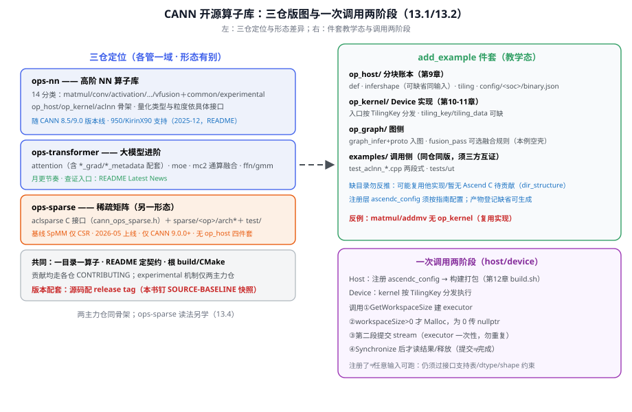
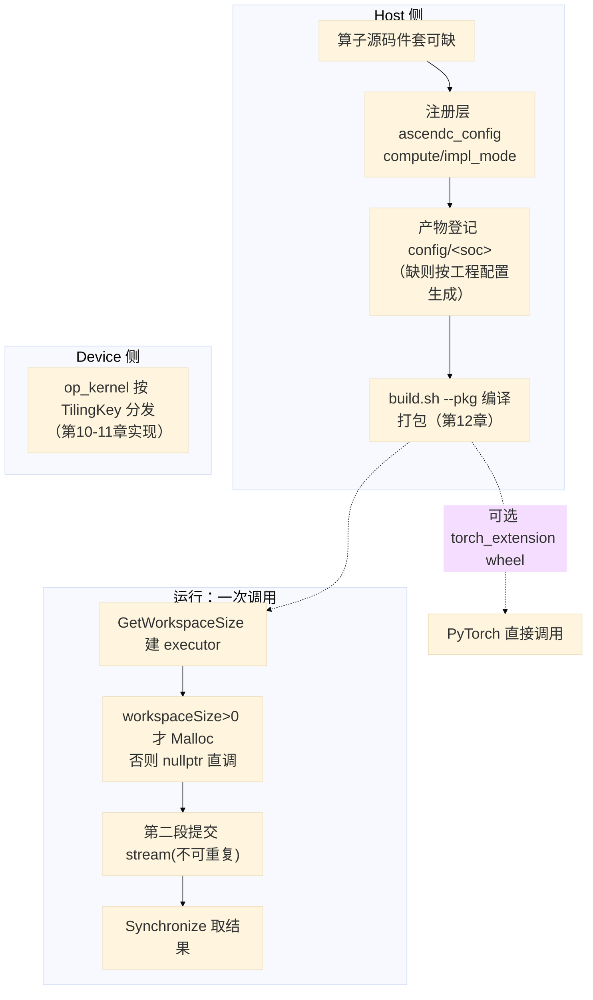

# 第13章 算子库体系

> 前三章教你「自己写算子」，这一章教你「先别写」——CANN 的开源算子库大概率已经有你要的东西。三仓怎么分工、一个库算子长什么样、怎么编译安装跑通、改完往哪贡献，一条链讲完。

## 本章目标与阅读指引

- **视野**：知道 ops-nn / ops-transformer / ops-sparse 各管什么，按图索骥找到目标算子。
- **实操**：跑通一个库算子的「编译 → 安装 → aclnn 调用」全链。
- **方法**：掌握读一个陌生库算子的标准动作清单，会二开、知道往哪贡献。

**时效性纪律**：三仓上新节奏极快（ops-transformer 的 README 月更级别），本章只写结构性事实；算子清单给「族系 + 查证方法」，具体算子以写作时各仓 README/CHANGELOG 为准。

## 13.1 三仓定位与版图

CANN 开源算子库按「计算域 + 难度梯度」分三个仓。**共同点**：算子一目录、README 定契约、根 build.sh/CMake 构建；贡献均走各仓 CONTRIBUTING（三仓皆有该文件；experimental 目录机制仅两主力仓，ops-sparse 无）。**读法一套，形态两样**：**差异实存**：ops-nn/ops-transformer 是 op_host/op_kernel/aclnn 骨架；**ops-sparse 是另一形态**——`aclsparse` C 接口（`include/cann_ops_sparse.h`）＋`sparse/<op>/arch*/` 实现＋`test/` 样例，无 op_host 四件套。会读前者不等于会读后者：

| 仓 | 定位 | 覆盖域 | 上线 | 版本底线 |
|---|---|---|---|---|
| **ops-nn** | 高阶 NN 算子库 | 14 个分类（matmul/conv/activation/…/vfusion，见 `cmake/variables.cmake OP_CATEGORY_LIST`）＋common/experimental | 随 CANN 9.0/8.5 版本线开源 | 随 CANN 配套 |
| **ops-transformer** | 大模型进阶算子库 | attention（含大量 *_grad/*_metadata 配套变体）、moe、mc2、ffn、gmm、posembedding、mamba、mhc | 随 CANN 8.5/9.0 版本线开源 | 随 CANN 配套 |
| **ops-sparse** | 稀疏矩阵算子库 | SpMM、SpMV | 2026-05 | 仅 CANN 9.0.0+ |

[^nnreadme][^trreadme][^spreadme]

两个贯穿三仓的纪律[^nnreadme]：**版本配套**——源码要配 release 仓 tag（本书钉死 SOURCE-BASELINE 快照：ops-nn `e5c3fa93`、ops-transformer `e75072d`、ops-sparse `ae60d05`，2026-08-21/23）；**950 支持**——ops-nn 2025-12 起支持 950PR/950DT/KirinX90 并可用 NPU Simulator 调试（README L13）——同样只是「登记在册」，单算子以支持表为准。

选型口径与第 9 章决策树衔接：**先用库（aclnn 直接调）→ 库不完全合适就改模板（二开源码算子）→ 都不满足才手写（第 9-12 章的内容）→ 改好了贡献回库**。手写是最后选项，不是默认选项。



*图 13-1 读法：左半「去哪找」——两主力仓同骨架、ops-sparse 另形态；右半「怎么跑」——件套仅 add_example 教学态，图模式入图靠 `*_graph_infer.cpp+*_proto.h`（13.2），fusion_pass 仅存规则。*

## 13.2 ops-nn 深看：一个典型算子的解剖

ops-nn 里每个算子占一个目录，**但「件套」可缺**——官方目录说明开篇即列四种缺目录情形：缺 `op_host/op_kernel` 可能是复用了别的实现、也可能 Kernel 尚无 Ascend C 实现待贡献；缺 `op_api` 暂不支持 aclnn（树注又称可自动生成，两说并存，**以具体算子的构建配置为准，勿从缺目录反推**）；缺 `op_graph` 暂不支持图模式[^dirstruct]。以 `examples/add_example` 为「件套齐全」的教学真例[^addex]：

```text
add_example/
├── op_host/                  # Host 侧（第9章说的「分块账本」住这里）
│   ├── add_example_def.cpp          # 算子信息库：名称/输入输出/数据类型
│   ├── add_example_infershape.cpp   # InferShape：运行时推导输出 shape
│   ├── add_example_tiling.cpp       # Tiling 实现：host 侧分块账本
│   └── config/ascend910b/add_example_binary.json   # 产物登记（该 soc 一份；注册另见下 ascendc_config）
├── op_kernel/                # Device 侧（第10-11章的真码住这里）
│   ├── add_example.cpp / .h         # Kernel 入口与实现
│   ├── add_example_tiling_key.h     # Tiling Key：标识不同切分策略
│   └── add_example_tiling_data.h    # Tiling Data：账本的数据结构
├── op_graph/                 # 图侧（常被忽略的一件）
│   ├── add_example_proto.h
│   └── fusion_pass/                 # 可选融合规则目录；本例为空壳
└── examples/
    └── test_aclnn_add_example.cpp   # aclnn 两段式调用示例（第4章真码）
```

**两处书前后咬合点**：

- **binary 登记「两层」**：第 12 章的 `--npu-arch` 对应这里的**产物登记层**——`op_host/config/<soc_version>/`（ascend910b/ascend910_93/ascend950/kirin*；**「可选，若未配置工程自动生成」为 dir_structure 原文**）[^dirstruct]；而**注册层**在 `scripts/kernel/binary_config/ascendc_config.json`（`name＋compute_units＋auto_sync＋impl_mode`；AddExample 登记三个 soc）——**注册层条目须按 guide「aclnn 适配」节配置**（指南要求注册，未承诺自动生成）[^asccfg]。**compute_units 只是登记/构建证据**：某 soc 能否跑通你的输入，还要过接口文档的产品支持表、dtype/shape/layout 约束与所选 impl——**「注册了」≠「任意输入可运行」**。`arch35/` 则是 op_kernel/op_host 里的**子场景代码目录**（如 transpose_batch_mat_mul），与 config 目录是两回事，勿混。
- **op_graph 拆两件**：入图靠 `${op}_graph_infer.cpp`（InferDataType）＋`${op}_proto.h`（原型，供图优化识别）[^graphdev]；`fusion_pass/` 只是「算子融合规则目录」，add_example 里**仅一个空 CMakeLists 壳**——图 3.4 的「削 Host 传话」落在图模式整体链路，不能说成这个子目录。

**一次 aclnn 调用在源码里的五段旅程**（host/device 分界按第 2 章口径）[^addex][^twophase]：

1. **应用侧**（host）：`test_aclnn_*.cpp` 第一段 `aclnnXxxGetWorkspaceSize(…,&workspaceSize,&executor)`——创建 executor 算 workspace；**workspaceSize 可为 0**：样例按 `if (workspaceSize > 0)` 才 `aclrtMalloc`，**为 0 传 nullptr 直调，勿做零长度分配**（L137）；
2. **op_api 第一段**（host）：参数校验＋组 l0 调用链；
3. **第二段 `aclnnXxx(workspace,workspaceSize,executor,stream)`**（host 提交、device 执行）：内部一行 `CommonOpExecutorRun` 透传（transpose…L425）；**executor 是一次性的——第二段不能重复调用**，要再调须重新走第一段（two_phase_api 明文）；
4. **op_kernel**（device）：入口按 TilingKey 分发模板（`REGISTER_TILING_DEFAULT`→`AddExample<T> op`）；
5. **提交≠完成**：第二段返回只代表入队，读结果/释放前须 `aclrtSynchronizeStream`（样例 L148 固定写法）——同步语义回第 4 章流模型。

**真库对照**：`matmul/transpose_batch_mat_mul` 同一骨架的加重版——`op_host/config/` 六 soc、`op_kernel/arch35/` 双实现、`aclnn…WeightNz` 第二接口与 `cubeMathType` 校验（L252）：目录约定不变，复杂度长在 tiling 与变体上。

ops-nn 近一年的三个结构性动向（README 新闻区，截至 2026-05）[^nnreadme]：**量化矩阵扩容**——低 bit 算子库中涵盖 fp8/mxfp8/hifp8/mxfp4 等数据类型与 pertensor/perchannel/pertoken/pergroup/perblock 等量化粒度——**具体「类型×粒度」组合以各算子接口约束为准**，非任意组合皆可（真例 `matmul/quant_batch_matmul_v4`，examples 按 arch35=950 与 at2/at3 分列）；**SIMD/SIMT 同构算子**——MapIndex、ScatterSub 用第 11 章的两条路线实现同一算子语义，是对照学习的好素材；**ops-tensor 分层结构**——Cube 类算子的偏移量计算下沉分层，简化指令参数。

## 13.3 ops-transformer：大模型算子族谱

ops-transformer 是「进阶算子库」：单算子复杂度高、与模型结构强绑定。三大族系[^trreadme]：

- **attention 族**（最大族）：从 flash_attn / fused_infer_attention_score 到 2026 年密集上新的量化与稀疏变体（quant_flash_attn 全量化、sparse_flash_mla、lightning_indexer 系列——DeepSeek V4 场景的 TopK 筛选与稀疏 Attention 反向）。族谱演化极快，查证入口是仓 README 的 Latest News + `docs/zh/ascend950_op_list.md`。
- **moe 族**：MoE 计算类（moe_compute_expert_tokens 等），mc2 侧配套 mega_moe。
- **mc2 族（通算融合，本节重点）**：矩阵计算与通信融合的算子——all_gather_matmul(_v2)、allto_all_matmul、allto_allv_grouped_mat_mul、attention_to_ffn/ffn_to_attention、engram_fetch(_wait)、mega_moe（均实名见 `mc2/`）。**这是第 17 章通信编的算子侧伏笔**：通信不是独立阶段，而是被揉进算子里与 Cube 计算流水重叠——「通信等计算」在库层面已经工程化。

工程侧两件套：**onnx 算子插件**（按算子置于 `<op>/framework/`，如 `attention/flash_attention_score/framework/` 的 NPUFlashAttention）；**NpuOpsTransformerExt 工程模板**（experimental 下，PyTorch 张量操作无缝集成、自动微分、GPU/NPU 统一接口）——想给新算子配 torch 接口时，从模板起步而不是从零搭。

## 13.4 ops-sparse：稀疏计算

2026-05 上线的新仓，专注稀疏矩阵计算效率，当前提供稀疏矩阵-向量乘（SpMV）与稀疏矩阵-稠密矩阵乘（SpMM）的 C API（`include/cann_ops_sparse.h`：`aclsparseCreateCsr`、`aclsparseSpMMAlg_t`；**SpMM 仅 CSR（本书基线快照口径，后续版本以接口文档为准）**）与实现（`sparse/spmv/arch22/`、`sparse/spmm/arch{22,35}/`；样例 `test/spmv/arch22/spmv_test.cpp`）[^spreadme]。注：仓内 QUICKSTART 写 `src/spmv/arch22` 与实树 `sparse/…` 不一致，以实树为准。与 ops-nn 的稀疏 4:2 量化 matmul（硬件稀疏加速）形成「格式稀疏」与「结构稀疏」两条线。仓很年轻，本章只给定位与入口，不展开。

## 13.5 开发与贡献：从 genop 到 CONTRIBUTING

在库骨架上加一个自己的算子，官方路径五步[^devguide][^quickstart]：

```bash
# [需 NPU/仿真环境验证] ① 生成算子目录骨架（目录即约定）
bash build.sh --genop=examples/add_example
# ② 按模板填 op_host / op_kernel / op_graph 三件
# ③ 编译（第12章的构建系统自动认领新目录）
bash build.sh --pkg --soc=ascend950 --vendor_name=custom --ops=add_example
# ④ 装包、配环境（source set_env.sh）
# ⑤ 验证：bash build.sh --run_example add_example eager（或 --simulator）
```

`--genop` 生成的骨架就是 13.2 的模板。**交付件按需**:该指南语境下 AddExample 类算子要 op_host 三件＋kernel 入口/实现＋tiling key/data；但 dir_structure 同时声明多件「可选、缺省有默认行为」（如 infershape 缺省=输出同输入）——**以你算子是否有切分/变体定，勿把清单当硬约束**。新分类挂接：名字进 `cmake/variables.cmake` 的 `OP_CATEGORY_LIST`，`add_category_subdirectory`（func.cmake）自动扫；experimental 走 `add_subdirectory(experimental/nn)`。调试用 npusim（第 12 章）；验证走 `build.sh --run_example <op> eager [--simulator]`（950 仿真分支见 12.5）；贡献走 CONTRIBUTING：experimental → 评审 → 转正。

| 你的处境 | 动作 | 终点 |
|---|---|---|
| 库里有 | ① aclnn 直接调（第 4 章两段式，见 13.2 五段旅程） | 即用 |
| 没有但有近亲 | ② experimental/examples 抄骨架，`--genop` 生成后改件套 | npusim/真机验证（第 12 章） |
| 有相似实现 | ③ 改库算子模板（fork 二开） | 同上 |
| 完全没有 | ④ 手写（第 9-12 章方法论） | 同上 |

②③④验证通过后若具通用价值 → ⑤ CONTRIBUTING 贡献回库（experimental → 评审 → 正式域目录）；否则自用随版本维护。

*表 13-2 算子获取决策：与第 9 章决策树互补——那张管「怎么写」，这张管「要不要写」；终点是贡献回库形成闭环。*

## 13.6 二开方法论：读一个陌生库算子的五步

拿到一个没见过的库算子（比如 `quant_batch_matmul_v4`），标准动作清单：

1. **README 定契约**：输入输出、dtype/format 支持域、量化粒度、架构约束——判断「我的场景在不在支持域内」；
2. **登记定域**：双层查——`ascendc_config.json` 的 compute_units（注册/构建证据）＋`op_host/config/<soc>/`（产物登记）；**再过 README 支持表与 dtype/shape 约束**——「注册了」不等于「你的输入能跑」；缺 op_host/op_kernel 时读 op_api/op_graph 找复用实现（dir_structure 四情形）；
3. **tiling 定切分**：`op_host/*_tiling.cpp` + `op_kernel/*_tiling_key.h`——读懂「分块账本」就有性能预期（第 9 章 9.4 的账本三笔账）；
4. **kernel 定实现**：`op_kernel/*.cpp` 对照第 10-11 章的 API 分级读，注意它用了哪条路线（TPipe/RegBase/SIMT）；
5. **examples 定调用**：`test_aclnn_*.cpp` 给出**与该版实现同仓同版本的调用侧写法**——仍须与其编译期头文件、接口文档支持表和实现三方互证，单一来源不作保证；

**torch_extension 桥**（ops-nn `torch_extension/`）：JIT 编译把 PyTorch 接口桥到 aclnn 算子库，`bash build.sh --torch_extension --ops=swiglu_group --vendor_name=custom` 可出单算子 wheel 包[^torchext]。给自研算子配 PyTorch 接口时，这是比手写 C++ 扩展规范得多的通道。


```mermaid
%%{init: {"theme":"base","themeVariables":{"fontSize":"24px"}}}%%
flowchart TB
    subgraph H["Host 侧"]
        D["算子源码件套可缺"] --> R1["注册层 ascendc_config<br/>compute/impl_mode"]
        R1 --> J["产物登记 config/&lt;soc&gt;<br/>（缺则按工程配置生成）"]
        J --> B["build.sh --pkg 编译打包（第12章）"]
    end
    subgraph D2["Device 侧"]
        K["op_kernel 按 TilingKey 分发<br/>（第10-11章实现）"]
    end
    subgraph R["运行：一次调用"]
        A1["GetWorkspaceSize 建 executor"] --> A2["workspaceSize>0 才 Malloc<br/>否则 nullptr 直调"]
        A2 --> A3["第二段提交 stream(不可重复)"] --> A4["Synchronize 取结果"]
    end
    H ~~~ D2
    D2 ~~~ R
    B -.-> A1
    B -.->|可选 torch_extension wheel| T["PyTorch 直接调用"]
```
*图 13-3 读法：上中下三段=注册/构建（host）、执行（device）、调用侧（host）；**目录→注册→产物→运行不是单线**——产物登记缺省可按工程配置生成（dir_structure 原文）、注册层 ascendc_config 条目按指南配置；执行期 kernel 按 TilingKey 分发；图模式另需 `*_graph_infer.cpp+*_proto.h` 入图（13.2），fusion_pass 仅存规则。

## 陷阱与注意（汇总）

| 坑 | 症状 | 对策 |
|---|---|---|
| 用 master 分支源码配新 CANN 版本 | 编译/行为错配 | 按 release 仓 tag 取配套源码（13.1） |
| 新算子分类没挂 CMake | 编译了但没产物 | 分类名进 `cmake/variables.cmake OP_CATEGORY_LIST`（`add_category_subdirectory` 自动扫）或按 guide 加 `add_subdirectory`（13.5） |
| 只看 op_kernel 忽略 op_graph | 图模式下入图失败 | 入图靠 `*_graph_infer.cpp`+`*_proto.h`；fusion_pass 仅存融合规则、可为空（13.2） |
| 目标架构没登记 | 真机找不到 kernel | 双查：`ascendc_config.json` compute_units＋`config/<soc>/`；再过接口支持表/dtype 约束（13.2） |
| 契约实现不完整（如 infershape 与 def 不一致） | 编译通过但调用出错 | 交付件可缺省有默认行为，**写了就必须对**：对照 aicore_develop_guide 各件契约自查（13.5） |
| 量化算子 dtype/粒度超出支持域 | 调用报错 | 先读 README 支持域再看实现（13.6） |
| 直接抄旧 examples 的调用代码 | 与所用版本签名/支持域不匹配 | examples 须配同版头文件与接口文档核验，跨版本先查 CHANGELOG（13.6） |

## 本章小结

::: tip 一句话总结
三仓分工：ops-nn 管通用 NN、ops-transformer 管大模型（attention/moe/mc2）、ops-sparse 管稀疏——前两仓同骨架，ops-sparse 是 aclsparse 接口仓，读法分两套。

件套可缺：def 之外多件可选，缺目录勿反推，以构建配置为准；图模式入图靠 graph_infer＋proto，fusion_pass 仅存规则。注册≠可跑：compute_units 之外还要过支持表与 dtype/shape 约束。

选型闭环：先调库、再改模板、最后手写，好了贡献回仓。仓是月更的——学会查证，别背清单。
:::

## 本章来源与进一步阅读

[^nnreadme]: ops-nn 概览（定位、分类目录、950/KirinX90 支持与 npusim 调试、量化矩阵类型与粒度（组合依接口约束）、SIMD/SIMT 同构算子 MapIndex/ScatterSub、ops-tensor 分层、版本配套纪律）：`ops-nn/README.md`（CANN Open 2.0，新闻区时效信息截至 2026-05）。
[^trreadme]: ops-transformer 概览（attention/moe/mc2/ffn/gmm/posembedding 覆盖、DSV4 场景算子上新、onnx 插件、NpuOpsTransformerExt 模板、950 op list）：`ops-transformer/README.md`、`ops-transformer/docs/zh/ascend950_op_list.md`（CANN Open 2.0，时效信息截至 2026-07）。
[^spreadme]: ops-sparse 概览（2026-05 上线、SpMM/SpMV、仅 CANN 9.0.0+）：`ops-sparse/README.md`（CANN Open 2.0）。
[^addex]: add_example 四件套真结构（op_host/{def,infershape,tiling}、op_kernel/{cpp,h,tiling_key,tiling_data}、op_graph/{proto,fusion_pass}、examples/test_aclnn、config/ascend910b binary.json）：`ops-nn/examples/add_example/`（CANN Open 2.0）。
[^devguide]: AI Core 算子开发指南（`build.sh --genop` 工程创建、四件套模板与最小交付件、新分类挂 CMake、编译验证流程）：`ops-transformer/docs/zh/develop/aicore_develop_guide.md`、`ops-nn/docs/zh/develop/aicore_develop_guide.md`（官方文档）。
[^quickstart]: QuickStart（编译/安装/环境配置/验证五步、Docker 环境、算子开发与贡献流程）：`ops-nn/docs/QUICKSTART.md`、`ops-transformer/docs/QUICKSTART.md`（官方文档）。
[^torchext]: torch_extension 桥（JIT 编译 PyTorch 接口到 aclnn、单算子 wheel 打包 `--torch_extension --ops=…`）：`ops-nn/torch_extension/README.md`、`ops-transformer/torch_extension/`（CANN Open 2.0）。
[^nnbase]: 三仓基线（本书全部路径与计数口径）：ops-nn master `e5c3fa9327ea95ba26d06227e746923580d10921`、ops-transformer master `e75072d7e7519405025d05a98cf1b2f106ad3874`、ops-sparse master `ae60d05a7224158e854d1a33b483f85c132f345a`（2026-08-21/23，见 SOURCE-BASELINE）。
[^dirstruct]: ops-nn 目录结构（缺目录四情形、config「可选/自动生成」、单算子交付件差异、op_api/op_graph 缺省含义）：`ops-nn/docs/zh/install/dir_structure.md`（CANN Open 2.0，ops-nn master `e5c3fa9327ea95ba26d06227e746923580d10921`）。
[^asccfg]: 二进制编译注册表（name/compute_units/auto_sync/impl_mode；AddExample 条目）：`ops-nn/scripts/kernel/binary_config/ascendc_config.json`（同基线）。
[^graphdev]: 图模式入图交付件（graph_infer/proto；fusion_pass=融合规则目录）：`ops-nn/docs/zh/develop/graph_develop_guide.md`、`ops-nn/docs/zh/install/dir_structure.md`（同基线）。
[^twophase]: 两段式接口（第一段 workspace/executor、第二段不可重复；样例 workspaceSize==0 分支 L137、Synchronize L148）：`ops-nn/docs/zh/context/two_phase_api.md`、`ops-nn/examples/add_example/examples/test_aclnn_add_example.cpp`（同基线）。
[^contribute]: 贡献流程与 experimental 目录机制：`ops-nn/CONTRIBUTING.md`、`ops-transformer/CONTRIBUTING.md`、`ops-nn/experimental/`（CANN Open 2.0）。

- **下一站**：第 14 章「经典算子实战」——本编收口：Add 全家族、MatMul Cube 路径、Softmax、融合算子一条龙，还清第 9/10 章预支的三笔债。
- **交叉引用**：aclnn 两段式见第 4 章 4.3；构建系统见第 12 章 12.3；npusim 见第 12 章 12.5；图模式见第 3 章 3.4；mc2 通信融合第 17 章展开。
