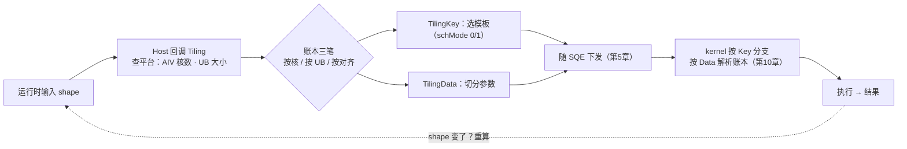
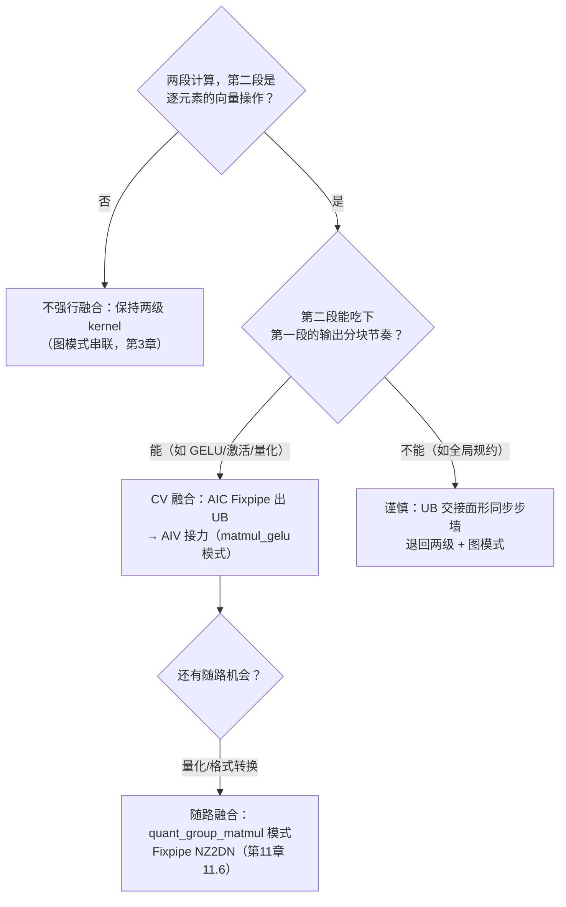

# 第14章 经典算子实战（端到端）

> 第三编收官。前五章把零件讲完（API 分级、TPipe/TQue、SIMT/RegBase、编译链、算子库），这一章把它们装配成一条完整的生产线：从一个需求出发，走到优化后的实现——顺手把前面章节预支的三笔债逐一还清。

## 本章目标与阅读指引

- **贯通**：独立走完一个算子的「需求 → 选型 → 实现 → 编译 → 验证 → 优化 → 贡献」全程。
- **还债①③**：Tiling 完整回路（第 9 章 9.4 预支）与 RegTensor/VF 融合链实操（第 10/11 章预支）在本章 14.2、14.4 兑现。
- **还债②**：高维切分与搬运调优（第 10 章 N-DMA 预支）在 14.3 兑现。
- **收口**：本编旅程在 14.6 回指第 9 章决策树，形成闭环。

## 14.1 工程级开发流程总览

把第 9-13 章的内容按「实际干活的顺序」重排，就是图 14-1 这张站牌图。每个站点都有前文的章节托底——**这条流水线本身，就是本编的总纲**[^tut]。


*图 14-1 端到端开发旅程：八个站点对应第 9-13 章与第 7 章；「还债」标记是本书写作时对读者承诺的兑现点——读到对应节请特别留意。*

官方面向新手的完整教程体系在 `tutorials/ascendc_operator_development/`（basic → vector → matmul → fused → 贡献 → 排障 → 性能 → 实战练习九个模块）[^tut]，本章的旅程图与它的课程结构互为印证。

## 14.2 Add 收口：把 Tiling 完整回路走通【还债③】

第 9 章 9.4 只给了 Tiling 的「账本三笔账」概念，回路缺了后半段：**账本怎么变成 kernel 的行为**。用 ops-nn 的 add_example 四件套（13.2 解剖过）把整条回路焊死[^addex]。

**Host 侧（op_host/add_example_tiling.cpp）**：运行时由框架回调，账本三笔在这里算[^addtiling]：

```cpp
// [需真机验证] 摘自 add_example_tiling.cpp（节选）：平台信息 → 账本输入
static ge::graphStatus GetPlatformInfo(gert::TilingContext* context,
                                       uint64_t& ubSize, int64_t& coreNum)
{
    auto ascendcPlatform = platform_ascendc::PlatformAscendC(context->GetPlatformInfo());
    coreNum = ascendcPlatform.GetCoreNumAiv();                    // 第一笔：按核分（AIV 数）
    ascendcPlatform.GetCoreMemSize(platform_ascendc::CoreMemType::UB, ubSize);  // 第二笔：按 UB 分
    // ……（shape 检查：DIMS_LIMIT=4，标量归一为 {1}）
}
// 第三笔（对齐与类型）由 TYPE_SIZE=4、BUFFER_NUM=6 等常量与 shape 推进
```

注意：**账本的输入是运行时查出来的**（核数、UB 大小都问平台要，不是写死的）——这就是 Tiling 必须 host 侧回调、不能编译期定死的原因。

**TilingKey（op_kernel/add_example_tiling_key.h）**：账本结果里「选哪套模板」这一项，被编成整数 key 下发[^addex]：

```cpp
// [需真机验证] 模板选择：schMode 在 0/1 两种调度模式中二选一
#define ELEMENTWISE_TPL_SCH_MODE_0 0
#define ELEMENTWISE_TPL_SCH_MODE_1 1
ASCENDC_TPL_ARGS_DECL(AddExample, ASCENDC_TPL_UINT_DECL(schMode, 1,
    ASCENDC_TPL_UI_LIST, ELEMENTWISE_TPL_SCH_MODE_0, ELEMENTWISE_TPL_SCH_MODE_1));
```

**回路闭合**：Host 算出账本 → 打包成 TilingData（数据）+ TilingKey（模板号）随任务下发（第 5 章 SQE 参数区）→ kernel 侧按 key 走不同分支、按 Data 解析账本 → 一个 shape 一套最优切分。**回路里每一环都在前文出现过，这一章只是把它们首尾相连**——图 14-2 是全图。


*图 14-2 Tiling 完整回路：第 9 章的「账本」和第 10 章的「实现」在此焊接——Key 是模板选择器，Data 是参数包，两者都走第 5 章的任务下发通道。*

## 14.3 搬运收口：高维切分与 bank 冲突【还债②】

第 10 章预支的「高维切分搬运实操」在 `05_best_practices/04_memory_access/` 兑现，四个样例四堂课[^mem]：

- **data_copy**：GM→UB、GM→L1 的搬运行为观察台——分块粒度、**非对齐搬运**（DataCopy vs DataCopyPad，第 8 章 32B 对齐纪律的代价实测）、L2Cache 复用、同地址访问冲突规避。第 10 章 N-DMA 讲的「自由配置维度与 stride」，在这里变成可量化的性能对比。
- **bank_conflict_ub**：UB 读写 bank 冲突的产生与规避（第 8 章 8.2 的 MTE 单元视角落到写侧）。
- **bank_conflict_3510**：950 新 UB 结构（8 组 × 16KB）下的冲突新形态——第 8 章埋的「2201→3510 bank 变化」伏笔在此兑现。
- **bank_conflict_nd2nz**：8192×8192 half 矩阵 ND→紧凑 NZ 转换（第 8 章 NZ 分形的搬运侧），最精彩的一点：**整个调优只动了 `dstNzC0Stride` 一个参数**（case 1→2），性能差距立现——参数级调优的教科书案例[^mem]。

搬运优化的心法一句话：**让每次搬运都满载、对齐、不撞 bank；做不到就改切分，而不是硬扛**。

## 14.4 RegBase 实操：softmax 的六级优化阶梯【还债①】

第 11 章 11.5 讲了 RegBase「中间结果不落 UB」的原理，但「怎么一步步把 MemBase 改成 RegBase 并榨干性能」没有实操——`02_reg_compute/softmax_high_performance` 用 **Case 0-5 六个版本**把这条调优路径完整摆出[^softmax]：

| 阶梯 | 动作 | 对应前文 |
|---|---|---|
| Case 0 → 1 | **MemBase → RegBase API**（寄存器级计算） | 11.5 范式切换 |
| Case 1 → 2 | **循环融合 + ExpSub 融合指令 + UpdateMask 尾块处理** | 11.1 mask/repeat 纪律 |
| Case 2 → 3 | 外层循环展开 | —— |
| Case 2 → 4 | 主尾块模式（main-tail block） | 第 8 章「主循环+尾块」纪律 |
| Case 4 → 5 | 主尾块 + 循环展开 + ExpSub 全家桶 | 最终形态 |

这就是官方归纳的 VF 优化三法的落地现场：**VF 融合**（多操作串进一条寄存器链）、**VF 循环优化**（展开/主尾块）、**指令双发**（dual-issue，相邻无依赖指令并行发射，gelu_high_performance 样例同样覆盖）[^softmax]。**还债①到此兑现：第 10 章预支的 RegTensor/寄存器计算深度、第 11 章的 RegBase 原理，在六级阶梯里逐级变现**。读者照 Case 0→5 顺序读 `softmax.asc` 单文件即可，六个版本同文件并排，diff 式学习。

## 14.5 MatMul：Cube 路径实战

向量算子吃透后，最后一座山是矩阵乘。教程 `04_matmul_basic` + 调优样例 `01_matrix_compute/matmul_basic_api_high_performance` 给出标准路径[^matmul]：

- **数据流**：GM →（MTE2）→ L1 → L0A/L0B → Cube 累加 → L0C →（Fixpipe）→ UB/GM——第 8 章图 8-1 内存层级的「实战版」，每一跳都有 API 对应；
- **分形**：A/B 按 NZ 分形驻 L1（第 8 章 8.3），C 尺寸与 Cube 阵列对齐；
- **调优抓手**：搬运与计算的流水重叠（双缓冲思想在 Cube 语境的应用）、L0C 驻留复用（950 的 L0C→UB 直通，第 11 章 11.6）、Fixpipe 随路转换。

Matmul 部分的优化细节，官方明确以 `matmul_basic_api_high_performance` 样例为基准——写自己的矩阵乘之前，先把这个样例的参数空间摸一遍。

## 14.6 融合算子与 FA：收官

**Cube-Vector 融合的标准姿势**看 `matmul_gelu_high_performance`[^fusion]：AIC 完成 Matmul 后经 **Fixpipe 输出到 GM 或 UB**，AIV 从 UB/GM 读入做 GELU——第 8 章「零拷贝」动机的算子级实现：中间结果不出 AI Core，省一次 GM 往返。量化融合（`quant_group_matmul_high_performance`）更进一步：把反量化随路进矩阵乘（第 13 章 quant 矩阵的融合视角）。什么算子适合 CV 融合？图 14-3 给决策面。


*图 14-3 Cube-Vector 融合决策：融合的本质是让两段计算共享同一块 AI Core 的 UB 交接面——第一段的食物恰好是第二段的形状，才值得焊在一起。*

**Flash Attention 收尾**：按第 13 章立的规矩——**不重造轮子**。FA 的教科书原理（tile 化 softmax、online softmax 防 scoreboard 溢出）任何一篇解读都讲得比我好；工程实现直接用 ops-transformer 现成的 flash_attn / fused_infer_attention_score 族（13.3），调优读它的 tiling。手写 FA 是面试题，不是生产建议。

**本编收口**：回到第 9 章开头那张 API 决策树——现在你应该能答对树上的每一个分叉，并且知道每个分叉背后是哪一章的哪个机制。Ascend C 编到此闭环；下一编进入性能优化方法论（第 15-16 章），把「写对」升级为「写快」。

## 陷阱与注意（汇总）

| 坑 | 症状 | 对策 |
|---|---|---|
| Tiling 账本写死（核数/UB 硬编码） | 换架构/换规格即废 | 问平台要（GetCoreNumAiv/GetCoreMemSize），不手写（14.2） |
| 只发 TilingData 忘 TilingKey | kernel 走错模板 | Key 管选型、Data 管参数，两者都发（14.2） |
| 非对齐搬运硬上 DataCopy | 搬运性能悬崖 | 边界用 DataCopyPad（14.3，第 8 章 32B 纪律） |
| ND→NZ 转换 stride 拍脑袋 | bank 冲突性能塌方 | dstNzC0Stride 逐参调优（14.3） |
| RegBase 改一半退化回写 UB | 白改 | 对照 softmax Case 0-5 阶梯检查中间结果驻留（14.4） |
| 尾块不处理直接按满轮算 | 越界/脏数据 | UpdateMask 或主尾块模式（14.4，11.1） |
| CV 融合第二段不是逐元素 | UB 交接面变同步墙 | 对照图 14-3 决策面，不满足就退回图模式（14.6） |
| 生产环境手写 FA | 维护灾难 | 用 ops-transformer 现成实现（14.6，13.3） |

## 本章小结

::: tip 一句话总结
**端到端就八站：需求 → 选型（第9章）→ 四件套（第13章）→ 实现（第10-11章）→ 编译（第12章）→ 验证（第7章/npusim）→ 优化（本章四级阶梯）→ 贡献。Tiling 回路三件套：Key 选模板、Data 装参数、账本问平台要。搬运心法：满载、对齐、不撞 bank。RegBase 调优六级阶梯：范式切换 → 融合+尾块 → 展开 → 主尾块 → 全家桶。CV 融合的前提：第二段是逐元素且吃得下第一段的节奏。FA 用库，别手写。**
:::

## 本章来源与进一步阅读

[^tut]: 算子开发教程体系（basic/vector/matmul/fused/贡献/排障/性能/实战九模块）：`cann-learning-hub/tutorials/ascendc_operator_development/`（CANN Open 2.0）。
[^addex]: add_example 四件套（op_kernel/add_example_tiling_key.h 的 `ASCENDC_TPL_ARGS_DECL` schMode 0/1 模板选择、tiling_data.h、kernel 入口）：`ops-nn/examples/add_example/`（CANN Open 2.0）。
[^addtiling]: Tiling Host 侧真码（GetPlatformInfo 查 AIV 核数与 UB 大小、DIMS_LIMIT/BUFFER_NUM/TYPE_SIZE 常量、标量归一化）：`ops-nn/examples/add_example/op_host/add_example_tiling.cpp`（CANN Open 2.0）。
[^mem]: 搬运调优四例（data_copy：GM→UB/L1、分块粒度、非对齐 DataCopy vs DataCopyPad、L2 复用、同地址冲突；bank_conflict_{ub,3510,nd2nz}：8192×8192 ND→NZ 的 dstNzC0Stride 单参数调优 case1-2）：`asc-devkit/examples/01_simd_cpp_api/05_best_practices/04_memory_access/`（CANN Open 2.0）。
[^softmax]: softmax 六级优化阶梯（Case 0-5：MemBase→RegBase→循环融合+ExpSub+UpdateMask→展开/主尾块→全家桶；VF 循环/融合/双发优化文档入口；仅 950）：`asc-devkit/examples/01_simd_cpp_api/05_best_practices/02_reg_compute/softmax_high_performance/`（CANN Open 2.0）；gelu 同族：`…/02_reg_compute/gelu_high_performance/`。
[^matmul]: MatMul 基础教程与调优基准：`cann-learning-hub/tutorials/ascendc_operator_development/04_matmul_basic/`、`asc-devkit/examples/01_simd_cpp_api/05_best_practices/01_matrix_compute/matmul_basic_api_high_performance/`（CANN Open 2.0）。
[^fusion]: CV 融合样例（AIC Matmul→Fixpipe 出 GM/UB→AIV GELU；quant_group_matmul 随路量化；A2/A3/950 支持）：`asc-devkit/examples/01_simd_cpp_api/05_best_practices/03_fusion_compute/{matmul_gelu_high_performance,quant_group_matmul_high_performance}/`（CANN Open 2.0）。
[^fa]: Flash Attention 工程实现入口：`ops-transformer/attention/`（flash_attn、fused_infer_attention_score、sparse_flash_mla 族，13.3）。

- **下一编**：第四编 性能优化方法论（第 15-16 章）——msprof 数据从哪来（第 7 章）、流水图怎么读（第 12 章 npusim trace）、瓶颈怎么定位。
- **交叉引用**：决策树回指第 9 章 9.6；Tiling 账本三笔见第 9 章 9.4；bank 结构见第 8 章 8.2；NZ 分形见第 8 章 8.3；npusim 见第 12 章 12.5。
