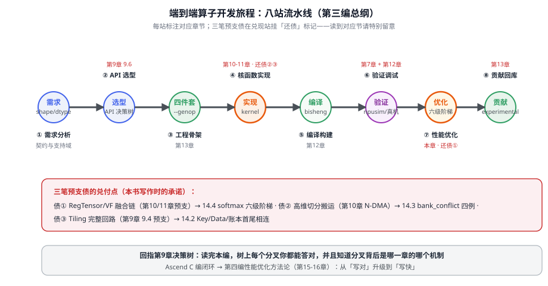
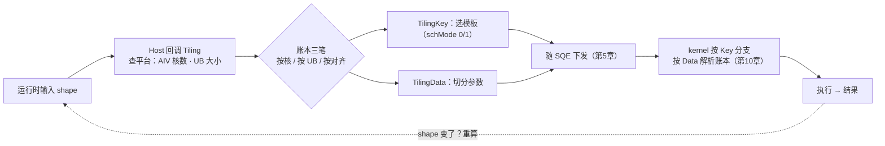

# 第14章 实战Ⅰ：Add 与工程链路

> 第三编实战系列（第 14-18 章）开篇。前五章把零件讲完（API 分级、TPipe/TQue、SIMT/RegBase、编译链、算子库），从这里开始装配。本章用最小的算子 Add 把**工程级全流程**走通——重点是第 9 章 9.4 预支的 **Tiling 完整回路**在此焊死。

## 本章目标与阅读指引

- **贯通**：独立走完 Add 的「需求 → 选型 → 实现 → 编译 → 验证」全程。
- **还债③**：Tiling 完整回路（第 9 章 9.4 预支）在 14.2 兑现。
- **系列地图**：14.1 的八站总览是第 14-18 章的共用地图——后面四章只换「算子」这颗引擎，流程不变。

## 14.1 工程级开发流程总览

把第 9-13 章的内容按「实际干活的顺序」重排，就是图 14-1 这张站牌图。每个站点都有前文的章节托底——**这条流水线本身，就是本编的总纲**[^tut]。



*图 14-1 端到端开发旅程：八个站点对应第 9-13 章与第 7 章。实战系列四章各攻一类算子：第 15 章向量（Softmax/GELU）、第 16 章矩阵（MatMul）、第 17 章融合、第 18 章 Flash Attention。*

官方面向新手的完整教程体系在 `tutorials/ascendc_operator_development/`（basic → vector → matmul → fused → 贡献 → 排障 → 性能 → 实战练习九个模块）[^tut]，本章的旅程图与它的课程结构互为印证。

## 14.2 Add 收口：把 Tiling 完整回路走通【还债③】

第 9 章 9.4 只给了 Tiling 的「账本三笔账」概念，回路缺了后半段：**账本怎么变成 kernel 的行为**。用 ops-nn 的 add_example 四件套（13.2 解剖过）把整条回路焊死[^addex]。

**Host 侧（op_host/add_example_tiling.cpp）**：运行时由框架回调，账本三笔在这里算[^addtiling]：

```cpp
// [需真机验证] 摘自 add_example_tiling.cpp（节选）：平台信息 → 账本输入
static ge::graphStatus GetPlatformInfo(gert::TilingContext* context,
                                       uint64_t& ubSize, int64_t& coreNum)
{
    auto ascendcPlatform = platform_ascendc::PlatformAscendC(context->GetPlatformInfo());
    coreNum = ascendcPlatform.GetCoreNumAiv();                    // 第一笔：按核分（AIV 数）
    ascendcPlatform.GetCoreMemSize(platform_ascendc::CoreMemType::UB, ubSize);  // 第二笔：按 UB 分
    // ……（shape 检查：DIMS_LIMIT=4，标量归一为 {1}）
}
// 第三笔（对齐与类型）由 TYPE_SIZE=4、BUFFER_NUM=6 等常量与 shape 推进
```

注意：**账本的输入是运行时查出来的**（核数、UB 大小都问平台要，不是写死的）——这就是 Tiling 必须 host 侧回调、不能编译期定死的原因。

**TilingKey（op_kernel/add_example_tiling_key.h）**：账本结果里「选哪套模板」这一项，被编成整数 key 下发[^addex]：

```cpp
// [需真机验证] 模板选择：schMode 在 0/1 两种调度模式中二选一
#define ELEMENTWISE_TPL_SCH_MODE_0 0
#define ELEMENTWISE_TPL_SCH_MODE_1 1
ASCENDC_TPL_ARGS_DECL(AddExample, ASCENDC_TPL_UINT_DECL(schMode, 1,
    ASCENDC_TPL_UI_LIST, ELEMENTWISE_TPL_SCH_MODE_0, ELEMENTWISE_TPL_SCH_MODE_1));
```

**回路闭合**：Host 算出账本 → 打包成 TilingData（数据）+ TilingKey（模板号）随任务下发（第 5 章 SQE 参数区）→ kernel 侧按 key 走不同分支、按 Data 解析账本 → 一个 shape 一套最优切分。**回路里每一环都在前文出现过，这一章只是把它们首尾相连**——图 14-2 是全图。


*图 14-2 Tiling 完整回路：第 9 章的「账本」和第 10 章的「实现」在此焊接——Key 是模板选择器，Data 是参数包，两者都走第 5 章的任务下发通道。*

**验证收尾**：按第 12 章的路径编译（`build.sh --pkg`）→ 安装 → 跑 `test_aclnn_add_example.cpp` 比对真值；无真卡时 npusim 出 bit 级精度结果（12.5）。工程链路至此全程贯通。

## 陷阱与注意

| 坑 | 症状 | 对策 |
|---|---|---|
| Tiling 账本写死（核数/UB 硬编码） | 换架构/换规格即废 | 问平台要（GetCoreNumAiv/GetCoreMemSize），不手写（14.2） |
| 只发 TilingData 忘 TilingKey | kernel 走错模板 | Key 管选型、Data 管参数，两者都发（14.2） |
| 标量输入未归一化 | shape 推导崩溃 | 参考真码 EnsureNotScalar 归一为 {1}（14.2） |
| 编译过但调用失败 | 最小交付件缺件 | 对照 13.5 清单：def/infershape/tiling 一件不少 |

## 本章小结

::: tip 一句话总结
**Add 是工程的标尺：麻雀虽小五脏俱全。Tiling 回路三件套——账本问平台要（不写死）、Key 选模板、Data 装参数，随 SQE 下发、kernel 按 Key 分支。从源码到真值比对的全链路走通一次，后面四章换算子不换流程。**
:::

## 本章来源与进一步阅读

[^tut]: 算子开发教程体系（basic/vector/matmul/fused/贡献/排障/性能/实战九模块）：`cann-learning-hub/tutorials/ascendc_operator_development/`（CANN Open 2.0）。
[^addex]: add_example 四件套（op_kernel/add_example_tiling_key.h 的 `ASCENDC_TPL_ARGS_DECL` schMode 0/1 模板选择、tiling_data.h、kernel 入口）：`ops-nn/examples/add_example/`（CANN Open 2.0）。
[^addtiling]: Tiling Host 侧真码（GetPlatformInfo 查 AIV 核数与 UB 大小、DIMS_LIMIT/BUFFER_NUM/TYPE_SIZE 常量、标量归一化）：`ops-nn/examples/add_example/op_host/add_example_tiling.cpp`（CANN Open 2.0）。

- **下一站**：第 15 章「实战Ⅱ：向量算子」——Softmax 六级优化阶梯与 GELU 的 RegBase 深水区。
- **交叉引用**：决策树回指第 9 章 9.6；Tiling 账本三笔见第 9 章 9.4；编译链见第 12 章；npusim 见第 12 章 12.5。
