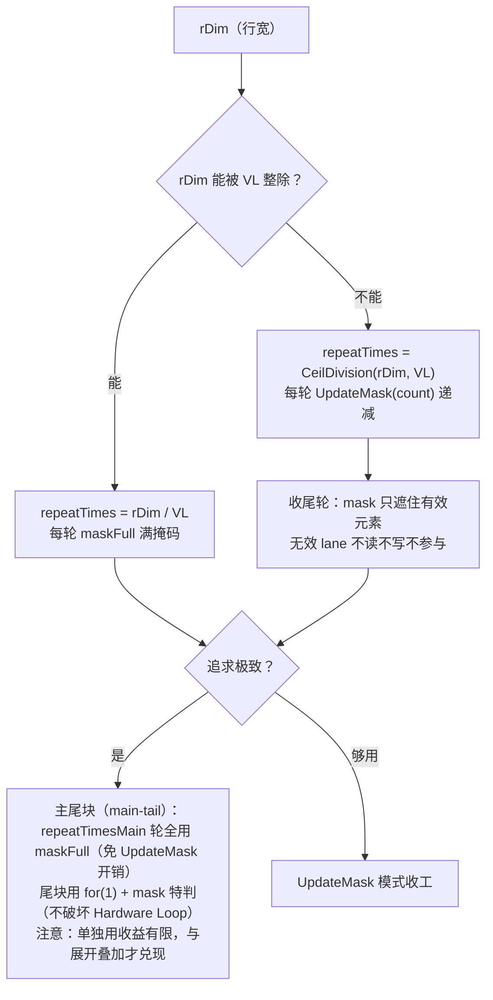

# 第15章 实战Ⅱ：向量算子——Softmax 与 GELU

> 实战系列第二章。Add 学会了「走通流程」，这一章学「压榨性能」：官方把同一个 Softmax 写了六遍（Case 0-5，同文件 `#if SCENARIO_NUM` 切换），每一遍消灭一笔开销——本章逐级拆解这架梯子，并把第 11 章 11.5 预支（原定第 14 章兑现）的 RegTensor/VF 融合实操债在本章一次还清。

## 本章目标与阅读指引

- **复演**：能说清 Case 0→5 每一步消灭了哪笔开销、收益从哪来。
- **默写级**：UpdateMask 尾块处理、主尾块（main-tail）账本、Hardware Loop 编码规范。
- **避坑**：指令双发何时加速、何时因寄存器超限反而更慢。

**本章真码**：`softmax.asc`（844 行，六个 Case 并排）、`gelu.asc`（251 行），均仅 950（dav-3510）可运行。**先给结论**——官方基准（Vector 指令开销折算）[^softmax]：

| 版本 | 特点 | 性能（cycles） | 相对 Case 0 |
|---|---|---|---|
| Case 0 | MemBase 基线 | 44113 | 1× |
| Case 1 | RegBase 未融合，含冗余 Ld/St/sync | 31894 | 1.4×（官方口径：提升 34%）* |
| Case 2 | UpdateMask + 循环融合 + ExpSub | 3413 | 12.9× |
| Case 3 | UpdateMask + 外层展开（双发） | 2197 | 20.1× |
| Case 4 | 主尾块模式（替代 UpdateMask） | 3424 | 12.9× |
| Case 5 | 主尾块 + 展开 + ExpSub（最优） | 1785 | **24.7×** |

（*官方 README 原文即「提升 34%」，按 cycles 折算约 1.38×，本书沿用官方口径。）

两个先声夺人的事实：**① Case 4 单独用主尾块并不比 Case 2 快**（3424 vs 3413）——主尾块的收益要到与展开叠加（Case 5）才兑现；**② 从 Case 1（31894）到 Case 2（3413）一步近 10 倍**——消灭冗余 UB 往返的收益远大于消灭掩码/循环开销。整章的叙事就围绕这两点展开。

## 15.1 Case 0 基线：MemBase 与搬运税账单

Softmax 对矩阵按行（rDim）做四步：**行最大值 max → 指数 exp(x−max) → 行求和 sum → 除法 div**。Case 0 是 MemBase 写法——每步都是「UB 读入 → Vector 算 → UB 写回」，中间结果全部路过 UB[^softmax]：

```cpp
// [需真机验证] Case 0（摘自 softmax.asc，节选）：MemBase，LocalTensor 进出
for (uint32_t i = 0; i < aDim; i++) {
    AscendC::ReduceMax(expTensor[...], srcTensor[...], sumTensor[...], rDim);  // ① max
    AscendC::Sub(expTensor[...], srcTensor[...], expTensor[...], rDim);        // ② x−max
    AscendC::Exp(expTensor[...], expTensor[...], rDim);                        // ③ exp
    AscendC::ReduceSum(sumTensor[...], expTensor[...], dstTensor[...], rDim);  // ④ sum
    AscendC::Div(dstTensor[...], expTensor[...], sumTensor[...], rDim);        // ⑤ div
}
```

官方对这笔账的定性[^softmax]：**每条 MemBase 指令的语义是「UB 读源操作数进寄存器 → 计算 → 写回 UB」，每步中间结果必须写回 UB**——ReduceMax 的结果写入 UB 后 Duplicate 要重新读出，Duplicate 写入后 Sub 又要读出……中间结果在 UB 上反复读写。数一遍：exp 和 sum 两个中间张量每行「写一次、读一到两次」，加上 max 的广播（`Duplicate`）与 half→float 的来回 `Cast`，**一行下来 UB 访问约 12 次，其中一半是存了又读**。更隐蔽的是每条 MemBase API 之间隐含 `PipeBarrier<PIPE_V>()` 同步——GELU 官方文档实测：**MemBase 每条向量指令间都插屏障、无法双发，标量同步开销占比约 2.7%**[^gelu]。这就是 11.5 说的搬运税在真实算子里的账单，44113 cycles 就是它的价格。整章要拆的六级阶梯见图 15-1——每一级都在从这份账单里划掉一行。

## 15.2 Case 1→2：RegBase 化与循环融合【还债①】

### Case 1：寄存器化了，但只化了一半

Case 1 换成 `__simd_vf__` + `RegTensor`，但四个 Phase 仍然各自为政——每个 Phase 独立循环、独立 Load，中间结果照旧 `StoreAlign` 落 UB，下个 Phase 再读回，Phase 之间用 `LocalMemBar` 隔出读写屏障[^softmax]：

```cpp
// [需真机验证] Case 1（节选）：exp 算完先落 UB，后续阶段反复读回
AscendC::Reg::ExpSub(expReg, srcReg, maxReg, mask);
AscendC::Reg::StoreAlign<float>(expAddr + ..., expReg, mask);       // 中间结果落 UB！
...
AscendC::Reg::LocalMemBar<VEC_ALL, VEC_ALL>();                     // 阶段间同步墙
...
AscendC::Reg::LoadAlign(srcReg, expAddr + ...);                     // sum 读一次
...
AscendC::Reg::LoadAlign(maxReg, expAddr + ...);                     // div 又读一次！
```

**这就是「半吊子 RegBase」**：数据在寄存器里算，但中间结果的生命周期被人为截断在 Phase 边界。寄存器级计算消除了 VF 启动开销（+34%），但冗余的 Load/Store/sync 一个没少[^softmax]。Case 1 的价值是搭起 RegBase 骨架（mask/RegTensor/Load 铸型），让后面三级有地方使劲。

### Case 2：循环融合——每个数只读一次

Case 2 是本章的第一道分水岭（图 15-2 右半），三个动作同时发生[^softmax]：

1. **循环融合（loop fusion）**：max 循环和 exp 循环合并为一轮——`srcReg` 只从 UB 读**一次**，喂给 `Max` 和 `ExpSub` 两条指令；Phase 2 的 sum 循环和 div 循环同理合并，**共享读一次 exp**（Case 1 里 sum 和 div 各读一次）。11.5 说的「VF 融合：把多个逐元素操作串进一条寄存器链」，真码就是这个样子；
2. **ExpSub 融合指令**：`exp(x−max)` 的减法和指数是**一条指令**——两次运算合一发，还顺带解决了数值稳定问题（减 max 防溢出）；
3. **UpdateMask 按轮续期**：`UpdateMask<float>(count)` 每轮递减有效元素数，收尾不足 VL 的轮次自动掩蔽——11.1 的 mask 纪律在归约场景的标准写法。

**编译器在背后做了什么**：官方把 VF 融合分成三阶段[^vffusion]——**浅度融合**（控制流等价的多个 VF 合一，Software Loop 硬化成 Hardware Loop）→ **深度融合**（继续合并 Loop、减启动开销、消灭冗余 Load/Store、充分复用寄存器）→ **VF 内自动同步**（编译器精准插入必要同步、删除冗余同步，释放硬件 OOO 乱序能力，**用户无需手动插同步**）。自动融合的前提恰是 15.3 的规范：控制流等价 + 各自都是 Hardware Loop——规范不是空文，是编译器优化的门票。这也解释了 Case 1 为什么还要手写 `LocalMemBar`：那是教学性的半吊子写法，真融合后同步交给编译器。

**一个必须如实交代的细节**：即使到了 Case 2，`expReg` 算完**仍然 StoreAlign 落 UB**，Phase 2 再读回来——这不是没优化到位，而是**算法上必要**：sum 是行内全局归约，必须等整行 exp 算完才能收口，而整行 exp 驻留寄存器需要 rDim×4 字节的寄存器容量（2048 行宽就是 8KB，远超单组 VF 寄存器预算）。**寄存器驻留有物理上限，跨全局归约的中间结果是驻不住的**——真正被消灭的是 Case 1 的**冗余**往返（exp 存 1 次读 2 次 → 存 1 次读 1 次；max 的落 UB 整个取消，全程驻留 `maxReg`），以及两道 `LocalMemBar` 里的一道。44113→3413 的近 13 倍，主体就来自这里。


*图 15-2 Case 1 vs Case 2：右边的 UB 访问并未归零——exp 作为跨全局归约的检查点必须落一次 UB（寄存器容量的物理上限）；被消灭的是「冗余」：src 两读变一读、exp 存 1 读 2 变存 1 读 1、max 往返整个消失。这比「全驻留」的神话更接近真码，也更有指导意义。*

## 15.3 Hardware Loop 规范：让编译器认出你的循环

在讲 Case 3/4 之前必须插一块「地基」：RegBase 循环不是写成循环就有硬件流水——**编译器要把循环识别成 Hardware Loop，代码必须满足硬件规范**[^vfloop]：

- **迭代变量必须 `uint16_t`**，从 0 开始、步长固定 +1；
- **循环内禁止条件跳转**：`if/else`、三元 `?:` 都会阻碍 Hardware Loop 生成（编译器尽力消除但不保证）；
- **循环计数/边界一旦执行不可修改**；要用外层计数做边界，先拷进另一个寄存器。

尾块场景的官方正反例最值得记——`if(hasTail)` 换成 `for(1)`（循环次数为 0 或 1 的「循环」，无运行时分支开销，还能触发编译器循环优化）[^vfloop]：

```cpp
// [需真机验证] 尾块判断的两种写法（官方 vf_loop_optimization.md 示例）
hasTail = !!tailK;
if (hasTail) { /* 尾块 */ }                            // 【反例】分支跳转，阻碍 Hardware Loop
for (uint16_t i = 0; i < hasTail; i++) { /* 尾块 */ }  // 【正例】for(1) 替代 if
```

Case 4 账本里的 `hasTail` 正是按这个纪律消费的（15.4）。此外还有三条循环内优化，每条都有官方正反例[^vfloop]，都是「编译器优化失效点」级别的细节：

- **成员变量访问外提**：VF 内直接读 `tiling.srcK` 这类结构体成员，相当于从栈上搬运到 Tensor 寄存器再按地址访问——**会直接导致 VF 融合失效**。正例是在循环前把成员拷进局部变量（`uint16_t srcK = tiling.srcK;`）再传参；官方反例正是 softmax 自家的 `SoftMaxGenericNDImpVF`——这条纪律连 softmax 真码都踩过；
- **指令分布提外**：与索引无关的语句（如 `Duplicate(dstReg, scalarValue)`）留在循环体内就每轮重发一次，提到循环外只发一次；
- **地址管理交给 AddrReg**：循环内手算 `srcAddr + i*c1 + j*c2 + ...` 偏移引入标量计算开销；950 上满足「最多四层循环、每层偏移为常量步长」的寻址模式，编译器会自动生成地址寄存器（`AddrReg`）消除 Scalar 消耗。

```cpp
// [需真机验证] 官方正例：局部变量传递成员（反例直读 tiling.srcK 会让 VF 融合失效）
uint16_t srcK = tiling.srcK;   // 下沉到局部变量
for (uint16_t i = 0; i < srcM; i++) {
    AscendC::ReduceMax(maxAddr + i * reduceK, srcAddr + i * srcK, workAddr, originK);
}
```

回头再看 Case 2 真码里的 `constexpr uint16_t oneRepeatSize` 与把 `tiling` 拆散成标量参数的签名设计——全部是这三条纪律的落地。

## 15.4 Case 3→5：展开、主尾块与全家桶

### Case 3：外层展开 = 双份寄存器交错发射

Case 3 的「外层循环展开」真码不是 `#pragma unroll`，而是**手工复制一套寄存器组**：`srcReg/maxReg` 之外再立 `srcReg1/maxReg1`，`halfA = aDim >> 1` 后每轮同时处理第 `i` 行和第 `halfA+i` 行[^softmax]：

```cpp
// [需真机验证] Case 3（节选）：两行并行，无依赖指令对
for (uint16_t j = 0; j < repeatTimes; j++) {
    LoadWithCastIfNeed(srcAddr, srcReg,  mask, i * rDimAlign + j * oneRepeatSize);
    LoadWithCastIfNeed(srcAddr, srcReg1, mask, i * rDimAlign + j * oneRepeatSize + halfA * rDimAlign);
    AscendC::Reg::Max(maxReg,  maxReg,  srcReg,  mask);    // 无依赖对 → 双发
    AscendC::Reg::Max(maxReg1, maxReg1, srcReg1, mask);
}
```

两行数据零依赖，相邻的同名指令构成**无依赖指令对**，正好填进 Vector 双发射窗口——「展开」的本质是**给双发创造原料**（15.5 的 GELU 会再强化这一点）。Cycle 表印证：2 次访存冗余没变，光靠双发就从 3413 降到 2197。

### Case 4：主尾块——主循环免掩码

Case 4 换一条路消灭 mask 开销：主循环轮数整除已知，**全程用 `maskFull` 满掩码**，连 `UpdateMask` 的每轮续期都省掉；尾块单独特判[^softmax]：

```cpp
// [需真机验证] Case 4 的账本（host 侧，节选）
uint16_t tail = rDim % (256 / sizeof(float));          // VL=256B，float 单轮 64 元素
uint16_t repeatTimesMain = rDim / (256 / sizeof(float));
uint16_t hasTail = static_cast<uint16_t>(tail != 0);
```

kernel 侧按 `repeatTimesMain` 跑满掩码主循环，`hasTail` 非 0 时用 `for(1)` 语法糖补一轮 mask 尾块（15.3 的规范在此合流）。但 Cycle 表提醒：**单独的主尾块（3424）没有跑赢 UpdateMask（3413）**——免掉的 UpdateMask 开销不足以抵消结构复杂度，它的价值在于给 Case 5 的展开提供了「轮次结构确定、mask 恒满」的干净底座。图 15-3 是两种尾块方案的决策图。


*图 15-3 UpdateMask 与主尾块机制：UpdateMask 是「通用且安全」的尾块方案；主尾块是「主循环免掩码 + 尾块特判」的极致方案——但官方数据显示单独使用收益有限，与展开叠加（Case 5）才是它的打开方式。*

### Case 5：全家桶与叠加顺序

Case 5 = 主尾块 + 外层展开 + ExpSub 三项叠加：双份寄存器组的展开结构（Case 3）套进 maskFull 主循环（Case 4），融合指令贯穿始终，1785 cycles 收官（Case 0 的 1/24.7）[^softmax]。叠加的顺序不是任意的——**先主尾块定轮次结构（maskFull 化），再展开（交错发射才有意义），融合贯穿始终**；顺序反了会出现「展开后尾块处理复杂度爆炸」的返工。复盘整架梯子（图 15-1）：


*图 15-1 六级优化阶梯（官方 cycles 实测标注）：最大的跳变在 Case 1→2（消灭冗余 UB 往返，近 10 倍）；Case 3 与 Case 4 是「双发」与「免掩码」两条岔路，殊途同归要靠 Case 5 合流。这张图对所有逐元素/行归约算子通用。*

## 15.5 GELU：双发实战与寄存器超限陷阱

GELU 样例（`gelu.asc`，251 行）提供基础版与 eltwise 版（原位计算）两个变体，公式取 tanh 近似。官方专门给了**13 步指令分解表**——`tanh(u) = (e^(2u)−1)/(e^(2u)+1)` 先代换化简，再逐条落成 `Mul → Muls → Exp → Sub/Add → Div → Adds → Mul → Muls` 指令序列[^gelu]。**公式化简本身就是优化**：少一步就少一次 UB/寄存器往返，这在数学层就该做完。**第二件武器：RegBase 发射与展开**——`asc_vf_call<GeluVfBasic>` 发射 VF，循环上挂 `#pragma unroll 6` 让编译器开足展开窗口[^gelu]。

**第一件武器：公式化简**——官方对比了三种 GELU 实现的指令数与 UB 内存份数[^gelu]：

| 实现方式 | 计算指令数 | UB 内存份数 |
|---|---|---|
| 方式 1：tanh 展开（e^(2u)−1)/(e^(2u)+1) | 13 | 5 |
| 方式 2：sigmoid 变形 x/(1+e^(−1.595769x−0.071405x³)) | 8 | 3 |
| 方式 3：进一步合并 x/(1+e^(−1.595769(x+0.044715x³))) | 8 | **2** |

同样是 tanh 近似，换个代数形态从 13 条指令降到 8 条、临时 UB 内存从 5 份降到 2 份（两式系数为官方分别给出的近似形态，非严格代换）——**这一步在数学层就该做完，比任何指令级优化都便宜**。每条指令少一次，就少一次 UB/寄存器往返（15.1 的账单逻辑在公式层的重演）。

**第三件武器：指令双发（dual-issue）**——：Vector 单元允许相邻**无依赖**的指令并行发射——前提是循环里没有寄存器依赖链挡路[^dual]。官方三个手法与一个警告：

- **合理拆分 VF 循环**：把「读 A 算 A 写 A，再读 B 算 B」改写成「读 A、读 B、算 A、算 B、写 A、写 B」——读写与计算交错，给双发留出无依赖对；
- **手动展开**：`#pragma unroll 6`（gelu 真码实测）或 Case 3 式手工双份寄存器组，让编译器看到更多可并行的指令窗口；
- **⚠️ 寄存器超限反效果**：展开/拆分不是免费的——**寄存器数量超限后，溢出的依赖指令会排进执行队列，双发收益被排队吃掉甚至倒亏**。展开倍数要配合 `__maxnreg__`（11.2）与活寄存器数一起权衡。

官方还给了一条选型经验[^gelu]：**计算步骤 ≥3 步且中间结果无需写回 UB 时，优先 RegBase + VF 融合**——显著减少 UB 读写并利用双发提升 IPC。GELU 的「连续非对齐」场景（输入不按 VL 对齐）则回落到 15.4 的 UpdateMask/主尾块套路——**梯子上的工具是组合复用的，不是每个算子从头发明**。

## 15.6 工程衔接：softmax_custom 入口与 Tiling 消费

六个 Case 的 VF 只是「发动机」，`softmax_custom` 入口展示了整套引擎怎么挂上皮带——第 14 章 Tiling 回路在本章的落地样例[^softmax]：

```cpp
// [需真机验证] softmax_custom 入口（节选）：账本消费 + 三段事件流水
__global__ __vector__ void softmax_custom(__gm__ uint8_t* x, __gm__ uint8_t* y,
                                          Custom::SoftmaxTiling<T> tiling)
{
    xGm.SetGlobalBuffer((__gm__ T*)x + GetBlockIdx() * tiling.singleCoreLength, ...);  // 按核分账
    LocalTensor<T> xLocal = ubAllocator.Alloc<T>(tiling.singleCoreAlignLength);       // UB 分账（第10章 10.3 LocalMemAllocator）
    ...
    LocalTensor<float> sumTensor;
    if constexpr (scenarioNum >= 0 && scenarioNum <= 2) {
        sumTensor = ubAllocator.Alloc<float>(tiling.singleCoreAlignLength);  // Case 0-2：sum 全程走 UB
    } else {
        sumTensor = ubAllocator.Alloc<float>(8);                             // Case 3+：UB 只留 1 个 slot！
    }
    for (...) {
        DataCopyPad(xLocal[...], xGm[...], {...}, {true, 0, rDimAlign - rDim, 0}); // 行搬运+右边补零
        SetFlag/WaitFlag<MTE2_V> → CustomSoftmax(...) → SetFlag/WaitFlag<V_MTE3>   // MTE2→V→MTE3 流水
    }
}
```

三个细节都接上了前文：**Tiling 账本**（`singleCoreLength/loopCount/rDimAlign` 全是 host 算好的账，第 14 章回路）、**UB 分配随 Case 收缩**（Case 3+ 的 sumTensor 只占 8 字节——归约结果驻留寄存器，UB 只留一个落点，寄存器驻留的收益直接显形在内存账单上）、**事件流水**（`MTE2_V`/`V_MTE3`/`MTE3_MTE2` 三对 SetFlag/WaitFlag，第 8 章 MTE 单元与第 10 章 `DataCopyPad` 补零参数的实战排布）。行搬运用 `DataCopyPad` 而非 `DataCopy`，正因为行宽 rDim 非 32B 对齐、要靠 `rDimAlign − rDim` 右补零（第 8 章对齐纪律的代价与解法）。

## 陷阱与注意（汇总）

| 坑 | 症状 | 对策 |
|---|---|---|
| RegBase 化了但每 Phase 仍独立循环各读一次 | 白改，Case1 式半吊子 | 循环融合：一次 Load 喂多条指令（15.2） |
| 幻想中间结果全部寄存器驻留 | 全局归约的检查点驻不住 | 驻留有物理上限：跨行归约的 exp 必须落 UB，消灭的是「冗余」不是「全部」（15.2） |
| 循环内写 if/else 或三元 | 编译器退化成 Software Loop | if constexpr 或 for(1) 替代（15.3） |
| 迭代变量用 uint32_t / 起始非 0 / 步长非 1 | Hardware Loop 识别失败 | 按 vf_loop 规范写循环（15.3） |
| exp 不减 max | 大数值溢出 | ExpSub 一发解决（15.2） |
| 尾块按满轮算 | 越界/脏数据 | UpdateMask 或主尾块（15.4） |
| 主尾块单独使用期待大收益 | 3424 vs 3413，白忙 | 主尾块是给展开铺路的，与展开叠加才兑现（15.4） |
| 盲目加大 unroll 倍数 | 双发收益被寄存器溢出吃掉 | 配合 __maxnreg__ 权衡活寄存器数（15.5） |
| 双发拆循环破坏读写依赖 | 结果错误 | 拆分只改指令序，不改数据依赖（15.5） |
| 行宽非 32B 对齐仍用 DataCopy | 越界或截断 | DataCopyPad + rDimAlign 补零（15.6） |

## 本章小结

::: tip 一句话总结
**六级阶梯（44113→1785 cycles，24.7×）：Case1 RegBase 化只赚 34%；Case2 循环融合一步近 10 倍——每个数只读一次（src 两读变一读、exp 读两次变一次、max 全程驻留），但跨全局归约的 exp 必须落 UB（寄存器容量的物理上限，驻留消灭的是冗余不是全部）；Case3 双份寄存器展开造无依赖指令对喂双发；Case4 主尾块单独不赚、为展开提供干净轮次结构；Case5 三项叠加收官。地基是 Hardware Loop 规范（uint16_t、从 0 步长 1、循环内禁分支、for(1) 替代 if）。GELU 补第三课：双发靠拆循环和 unroll 创造无依赖对，寄存器超限会让它倒亏；≥3 步且中间结果无需写回 UB，就选 RegBase+VF 融合。**
:::

## 本章来源与进一步阅读

[^softmax]: softmax 六级阶梯全码与官方基准（844 行，Case 0-5 同文件 `#if SCENARIO_NUM` 切换；性能表 Case0=44113/Case1=31894(+34%)/Case2=3413/Case3=2197/Case4=3424/Case5=1785 cycles；Case1 冗余 Load/Store/sync、Case2 loop fusion 共享 Load 与 ExpSub 与 UpdateMask、Case3 srcReg/srcReg1 双份寄存器与 halfA 交错、Case4 tail/repeatTimesMain/hasTail 账本与 maskFull 主循环、softmax_custom 入口的 LocalMemAllocator 与三对事件流水与 DataCopyPad 补零、Case 3+ 的 sumTensor 仅 8 字节；仅 950，CANN ≥9.1.0）：`asc-devkit/examples/01_simd_cpp_api/05_best_practices/02_reg_compute/softmax_high_performance/{README.md,softmax.asc}`（CANN Open 2.0）。
[^gelu]: GELU 样例与官方说明（tanh 近似公式与 13 步指令分解表、基础版/eltwise 版、`#pragma unroll 6` 真码、`asc_vf_call` 调用、MemBase 指令间屏障与 2.7% 标量开销实测、「≥3 步且中间结果无需写回 UB 优先 RegBase+VF 融合」选型建议）：`asc-devkit/examples/01_simd_cpp_api/05_best_practices/02_reg_compute/gelu_high_performance/{README.md,gelu.asc}`（CANN Open 2.0）。
[^dual]: 指令双发优化（合理拆分 VF 循环、手动展开与 `#pragma unroll`、编译器自动展开、寄存器超限导致依赖指令排队的反效果）：`asc-devkit/docs/zh/guide/operator_practice/simd_operator_optimization/vector_compute/vf_optimization/dual_issue_optimization.md`（官方文档）。
[^vfloop]: VF 循环优化（Hardware Loop 编码规范：uint16_t 迭代变量、从 0 步长 1、循环内禁分支、if constexpr 与 for(1) 替代、循环内成员变量访问/指令分布/地址管理优化）：`asc-devkit/docs/zh/guide/operator_practice/simd_operator_optimization/vector_compute/vf_optimization/vf_loop_optimization.md`（官方文档）。
[^vffusion]: VF 融合优化原理与编写指导：`asc-devkit/docs/zh/guide/operator_practice/simd_operator_optimization/vector_compute/vf_optimization/vf_fusion_optimization.md`（官方文档）。

- **下一站**：第 16 章「实战Ⅲ：MatMul Cube 全路径」——从向量深水区上岸，攻 Cube 山头：NZ 分形、双缓冲、L0C 驻留。
- **交叉引用**：RegBase 原理与图 11-4 见第 11 章 11.5；mask/repeat 纪律见第 11 章 11.1；`__maxnreg__` 见第 11 章 11.2；32B 对齐纪律见第 8 章 8.3；非对齐尾部搬运见第 10 章 10.5.1；主尾块见本章 15.4；事件流水见第 10 章 10.2（MTE 单元分工见第 8 章图 8-2）。
