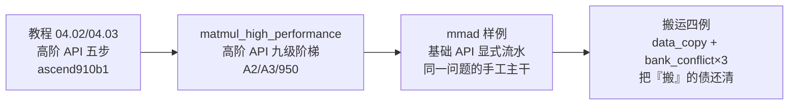

# 第16章 实战Ⅲ：矩阵算子——MatMul Cube 全路径

> 实战第三章，从向量转向矩阵。MatMul 承担了 Transformer 注意力和 FFN 中的大量计算；卷积也可通过 im2col 等方式转化为矩阵乘问题。本章沿官方准备的两条路线走完全程——先用高阶 API 建立「该有什么」的心智模型，再用基础 API 拆开「里面是什么」，并把第 10 章预支的搬运实证债（还债②）一次还清。

## 本章目标与阅读指引

- **贯通**：说清一个 MatMul 在 AI Core 里的完整数据生命周期——GM→L1→L0A/L0B→Cube→L0C→GM 的每一跳由谁搬运、什么格式、如何同步。
- **归因**：九级优化阶梯每一级「为什么快」，依据官方数据与README 明说的机理，不造因果。
- **纪律**：性能数字按 Task Duration/AI Core 时间/分单元时间/理论模型四层分开表述；A2/A3 与 950 参数分岔处处标注；倍数关系注明由官方数据相除得出。

**本章对象与版本**见表 16-1。源码基线为2026-10-09采集的本地快照：asc-devkit `28e7aba2`、cann-learning-hub `a3989658`、ops-nn `e5c3fa93`。本机无 NPU，本文代码片段除注明外均为**删节节选**（省略与论述无关的行，完整版以脚注路径为准），完整工程仍需真机或配套仿真环境验证，删节片段标 `[示意代码]`；标注 `[示意代码]` 处不保证可直接编译。

| 材料 | 架构指向 | CANN 版本要求（仓内 README 声明） | 核函数/入口 |
|---|---|---|---|
| 教程 04_matmul_basic | ascend910b1 | 按教程环境准备与配套工具要求 | matmul_custom |
| matmul_high_performance | A2/A3、950PR/DT | A2/A3 ≥9.0.0；950 ≥9.1.0 | matmul_custom 系 |
| mmad 基础 API 样例 | A2/A3、950PR/DT | 同上 | mmad_custom |
| data_copy/bank_conflict 三例 | 分样例标注（见表注） | 同上 | 各样例自名 |

*表 16-1 版本矩阵：以上为**仓内样例 README 声明的运行要求**，不代表全平台兼容矩阵；性能数据另有架构标注（A2=Ascend 910B1 1.85GHz / 950PR 1.65GHz），来源快照见章末脚注。*

## 16.1 两条路线：先「该有什么」，再「里面是什么」

官方材料把 MatMul 学习劈成两条路线，它们不是同一套代码，学习顺序有讲究。

**路线一：教程的高阶 API**（`04_matmul_basic`，面向 ascend910b1）[^mmatk]。核函数五个标准步骤：创建 `Matmul` 对象（`MatmulType` 声明四个矩阵的 TPosition/格式/类型）→ `REGIST_MATMUL_OBJ` 绑定 TPipe 与 Tiling → `SetTensorA/SetTensorB/SetBias` → 迭代计算并取回结果 → `End`。`Iterate` 与 `GetTensorC` 配合逐块取数；教程的 `IterateAll(cGlobal)` 直接写入指定结果张量，无需再调用 `GetTensorC`。Host 侧用 `MultiCoreMatmulTiling` 产出 `TCubeTiling`。教程 04.02 同时给出「逻辑位置」词表——它贯穿本章始终：

| TPosition（教程 04.02＋官方 TPosition 文档） | 承载 | 本章出现处 |
|---|---|---|
| A1/B1/C1 | 整块 A/B/Bias（L1） | 16.3 DataCopyIn |
| A2/B2 | 切分后 A/B（L0A/L0B） | 16.3 DataLoad |
| C2 | 切分后的 Bias（本章 A2/A3/950 对应 BiasTable Buffer） | （本样例未用，认得出即可） |
| CO1 | Cube 结果小块（L0C） | 16.3 Compute/CopyOut |
| CO2 | 整块结果（本章 A2/A3/950 对应 GM） | Fixpipe 出口族谱（16.6） |
| VECCALC | Vector 计算临时（UB） | 17 章融合伏笔 |

*表注：TPosition 全集与物理映射见官方文档[^tpos]。*

`Iterate` 与 `IterateAll` 的分工需要辨析：`Iterate` 每次只算一个 baseM×baseN 基块，须在循环中反复调用并逐次 `GetTensorC` 取回；`IterateAll` 一次算完整个 singleCore 尺寸。前者把流水节奏交给你，后者由封装层替你循环——教程样例核函数用的是 `IterateAll`（一步到位），而 16.3 的基础 API 版本相当于把 `Iterate` 粒度的循环完全摊开手写。**不能反过来推论「高阶 API 的每个内部动作都有一行基础 API 对应」**：封装层还有缓冲管理与同步编排，手写版只是其主干等价物。

```cpp
// [示意代码] 04.03 教程 Process 中的调用摘录；省略对象注册、地址初始化等上下文
matmulObj.SetTensorA(aGlobal);
matmulObj.SetTensorB(bGlobal);
matmulObj.SetBias(biasGlobal);
matmulObj.IterateAll(cGlobal);  // 完成计算并把结果写入 cGlobal
matmulObj.End();
```

**路线二：性能样例的真码**（A2/A3/950）。`matmul_high_performance` 用高阶 API 把 8192³ MatMul 调到 Case 8（16.2）；`matmul_basic_api_high_performance`（下称 mmad 样例，645 行单文件）用基础 API 把同一问题的手工版写到极致——高阶 API 的**主干动作**（切包、搬运、算、搬出、同步）在它那里都有一段可指认的代码。本章 16.3 逐段拆解。


*图 16-A 学习路线：教程建模型 → 高阶样例看优化阶梯 → 基础样例拆开主干 → 搬运样例补最后一环。*

## 16.2 高阶 API 九级阶梯：每一级改了什么

`matmul_high_performance` 把同一个 8192³ MatMul 写了九遍（Case 0-8）。先总账后归因——**下表为 A2 芯片（Ascend 910B1、主频 1.85GHz、half 输入输出）官方 README 数据；「相对倍数」由 Task Duration 相除得出，非本机实测**[^mmadh]：

| Case | 改动 | Task Duration（μs） | 相对 Case0 | aic_mac_ratio（Cube 时间占比） | 补充观测（非瓶颈判定） |
|---|---|---|---|---|---|
| 0 单核基础 | base 64³ | 759363.98 | 1× | 18.7% | scalar 67%、mte2 76.7% |
| 1 单核调参 | base=[128,256,64] | 249467.08 | 3.04× | 32.7% | mte2 78.4% |
| 2 多核 2×12 | 24 核 | 12541.22 | 60.55× | 27.6% | mte2 81.2% |
| 3 多核 4×6 | 24 核改切分 | 12283.84 | 61.82× | 31.2% | mte2 79.3% |
| 4 MDL 模板 | 大包搬运 | 5039.86 | 150.67× | 69.4% | mte2 90.3% |
| 5 +L1Cache 调参 | depthA1=16,stepKa=8 | 4156.76 | 182.68× | 85.4% | mte2 96.3% |
| 6 +L2Cache 切分 | A 按 M 轴两分 | 4088.36 | 185.74× | 86.0% | mte2 95.8% |
| 7 常量 Tiling | 编译期算完 | 4053.44 | 187.34× | 86.3% | scalar 26.4% |
| 8 +UnitFlag | 计算搬运并行 | 4012.44 | 189.25× | 86.4% | 趋于均衡 |

**Case 0→1：base 块与访存计算比**。Cube 单元每 cycle 完成 16×16×16 次乘加。base=[64,64,64] 时单次 64 cycle、每 cycle 喂数 (64×64×2＋64×64×2)/64=256 B；base=[128,256,64] 时单次 512 cycle、摊薄为 96 B/cycle——同样计算量带宽需求降到原来的 37.5%（README 原文演算）。base 的上限由缓冲容量约束：A2 L0A=L0B=64KB、L0C=128KB（16.3 末尾会看到 baseM=128 与 L0C 容量的精确对应）。官方推荐：b16 输入 [128,256,64]、b8 输入 [128,256,128]。

**Case 1→2：多核是最大单级跳变**。Task 249467.08→12541.22μs，README 标注 19.89 倍（由官方 Task 数据相除）。但 2×12 切分**未满足地址 512B 对齐、且 M/N 分核不均**——mte2 占比升到 81.2%，README 明说「后续优化方向：提升地址对齐、均匀分核」。

**Case 2→3：切分策略按两条纪律修正**。4×6 取 singleM=2048/singleN=1536（尾块 512），地址满足 512B 对齐；同时缓解「同址访问」——多个核同时读 A 的同一行时硬件要串行化，同址核数越多劣化越重，4×6 的分摊让冲突延迟小于 2×12（以上均为 README 原文机理）。**注意**：两方案核数相同，Task 只差 257μs；收益来自对齐与冲突，不是「尾块更均衡」——本书不做超出 README 的归因。

**Case 3→4：MDL 模板（大包搬运）**。`CFG_MDL` 让 MTE2 一次搬多个基本块进 L1：本例 **depthA1=4 且开启 L1 搬运 double buffer，即 L1 缓存 4 份 baseM×baseK 块、ping/pong 各两块**（README 原文），GM→L1 搬运次数骤减，Task 直落到 5039.86μs。官方同时给出调优公式：**depthA1/(stepM×stepKa)=2**——多块缓存须能均分为 ping/pong 两份。

**Case 4→5：把 L1 装满**。depthA1 提到 **16、stepKa=8**——16 是基本块总份数（不是「16 个大包」），按公式 16/(1×8)=2 恰好均分 ping/pong；A 侧单核 K 向一次连续覆盖 8 个 baseK，Task 4156.76μs。

**Case 5→6：L2Cache 切分**。`MatmulKernelL2Cache` 把 A 按 M 轴切两半、B 整块复用（Process 循环 2 次），让 B 在 L2 里活得更久。README 同时交代局限：A2 实际 L2 192MB，最终 Case8 的 MTE2 实测 3435.584μs 距理论 2672.42μs 差 28.56%，改进空间留给读者——**这是官方明示的未尽事项，本书照录不饰**。

**Case 6→7：常量 Tiling**。`CONSTANT_CFG = GetCustomConstantCFG<...>()`（matmul.h，`MatmulApiStaticTiling`）在编译期算完全部切分，运行时 Scalar 免算；Tiling 结构缩成自定义 `MatmulProblemShape`（只含 shape）。scalar_time 变化（严格分架构分 Case）：**A2 Case6→7：1753.463→968.616μs（Case8 又回到 1026.069）；950 Case6→7：765.125→426.398μs（Case8 412.29）**——两架构、两 Case 不可横比。

**Case 7→8：UnitFlag**。计算与搬运按 512B 块粒度重叠（机制见 16.3 的 UnitFlag 小节），Task 收于 4012.44μs。

**理论对账（四层口径示范）**[^mmadh]：Cube 理论时间 =8192³/(16³×24 核×1.85GHz)=**3022.92μs**；Case 8 实测 **aic_mac_time=3076.396μs**，误差 1.77%——对比对象是 Cube 时间，不是 Task Duration 4012.44μs；mac_ratio=86.4% 是 Cube 时间占 AI Core 时间的比例，与「峰值算力实现率」不是一回事（官方行文有混用，本书分开表述）。MTE2 理论 2672.42μs 由「HBM 1.8TB/s 首读 256MB＋L2 5TB/s 复用 12GB」模型推出。

**950PR 对照表**：32 核、baseM=256、1.65GHz；Case 8 Task 2558.155μs（428.68×）、aic_mac 2549.657μs 对理论 2542μs 误差 0.30%、mac_ratio 99.7%。两表 baseM/核数不同，禁止横排直比。

**从表里能读到什么、不能读到什么**：本例中 mte2 占比在 Case 2-6 持续最高，与「喂饱 MTE2」的优化主线互洽；但「占比最高=瓶颈」「多核后瓶颈永远是 MTE2」这类一般化结论本书不下——多个单元可以重叠工作，仅凭时间占比不能还原依赖关系，须结合 WaitFlag 位点、带宽实测与关键路径分析逐例确认（16.7 给观测入口）。

## 16.3 基础 API：完整数据生命周期【还债②主菜】

mmad 样例（`matmul_basic_api_high_performance`）把高阶 API 的黑盒摊成四个手工阶段[^mmad]。先看骨架，再逐段进真码。


*图 16-1 四级流水与同步全景（按 mmad.asc 结构绘制，示意不按真实耗时比例）：A/B 大包深度不同（stepKa=8 与 stepKb=4）各自独立跟踪；L0C 只有一份 CO1 缓冲，靠 UnitFlag 块粒度状态位在「累加」与「搬出」间复用；源码在发出该输出基块的所有 K 迭代后调用 CopyOut；硬件上最后一次 Mmad 与 Fixpipe 仍可按 512B 块重叠。*

### 阶段①：DataCopyIn——搬入即转 NZ，A/B 两套节奏

```cpp
// [示意代码] mmad.asc DataCopyInA（L344 起，Nd2Nz L348-357；删节节选）：GM→L1，MTE2 随路 ND→NZ
AscendC::Nd2NzParams nd2nzParams;
nd2nzParams.ndNum = 1;
nd2nzParams.nValue = curM;                     // 逻辑行
nd2nzParams.dValue = baseK * stepKa;           // 一次搬足一个「A 大包」：8 个 baseK 深
nd2nzParams.srcDValue = K;                     // GM 源行距：真实 K
nd2nzParams.dstNzC0Stride = baseM;             // NZ 目的 C0 维步距
nd2nzParams.dstNzNStride = 1;
AscendC::DataCopy(a1Local, aGM[offset], nd2nzParams);
```

第 10 章承诺的「N-DMA 自由维度与 stride」在这里变现：`srcDValue=K` 让 MTE2 按 GM 真实行距取数，`Nd2Nz` 后缀表示 **NZ 重排在搬入侧随路完成**——L1 里没有中间 ND 态。关键在**A/B 大包不等深**：A 侧 `stepKa=8`（2201），一次搬 8 个 baseK；B 侧 `stepKb=4`，只搬 4 个。代码里 `a1NextKChunkIdx/b1NextKChunkIdx` 两套进度、`a1CopyInIdx/b1CopyInIdx` 两套 Ping/Pong 指针各自走——**A 比 B「深」，消耗大包的速度也不同**，任何「统一 chunk」的叙述都是错的。

### 阶段②：DataLoad——L1→L0，同一动作的两代参数

```cpp
// [示意代码] DataLoadA（L396-427；删节节选）
#if defined(__NPU_ARCH__) && (__NPU_ARCH__ == 2201)
    AscendC::LoadData3DParamsV2<half> p;        // 2201：3D 视角描述同一搬运
    p.l1H = 1; p.l1W = baseM; p.channelSize = baseK;
    p.kExtension = baseK; p.mExtension = curMAlign;
#elif defined(__NPU_ARCH__) && (__NPU_ARCH__ == 3510)
    AscendC::LoadData2DParamsV2 p;              // 3510：2D 步进视角
    p.mStep = DivCeil(curMAlign, CUBE_BLOCK); p.kStep = DivCeil(baseK, CUBE_BLOCK);
    p.srcStride = DivCeil(baseM, CUBE_BLOCK); p.dstStride = DivCeil(curMAlign, CUBE_BLOCK);
#endif
    AscendC::LoadData(a2Local, a1Local[srcAddr], p);
```

同一句 `LoadData`，两代硬件两套参数哲学。**注意：这只对 A 侧成立**——B 侧的分支矩阵更复杂，见 16.4 的 2×2 表；「某代硬件只用某代 API」的判断不能从参数结构名想当然（本例两架构的 Fixpipe 都用 `FixpipeParamsV220`）。

### 阶段③：Compute——Mmad 的循环累加与两个参数

```cpp
// [示意代码] Compute（L502-523；删节节选）
uint32_t curM = (mBlockIdx != baseMCount) ? baseM : tailM;   // 尾块真实尺寸
mmadParams.m = curM; mmadParams.n = curN; mmadParams.k = baseK;
mmadParams.cmatrixInitVal = (kBlockIdx == 0);                // 首个 K 块清累加器
mmadParams.unitFlag = (kBlockIdx != kLoopCount - 1) ? 2 : 3; // 块粒度同步，语义见阶段④
AscendC::Mmad(cLocal, a2Local, b2Local, mmadParams);         // A2×B2 → CO1(L0C)
```

`cmatrixInitVal`：K 向循环累加，仅首块清零，省一次显式初始化。尾块双轨（`tailM` 算、`tailMAlign` 搬）是第 8 章对齐纪律的 Cube 侧形态。`unitFlag` 的完整语义单独展开——它是本样例最容易被讲错的机制。

### UnitFlag：用块粒度状态协调 L0C 读写

官方 UnitFlag 文档（`mmad_compute_key_features/UnitFlag.md`）的机制[^unitflag]：**开启后，L0C Buffer 以 512B 内存块为粒度，每块一位状态（0=可写/1 可读）**。参数值是控制模式，不是那个状态位的值：

| unitFlag 参数 | 控制模式 | 写（Mmad） | 读（Fixpipe） |
|---|---|---|---|
| 2（0b10） | 执行后**保持**状态位 | 等位=0→写入→保持 0（后续 Mmad 可继续写同一块） | 等位=1→读→保持 1 |
| 3（0b11） | 执行后**翻转**状态位 | 等位=0→写入→置 1（交给读方） | 等位=1→读→置 0（还给写方） |

对照 mmad 的用法：K 循环前 127 次Mmad(2)——每次写完保持 0，L0C 始终可被下一次累加；第 128 次（末块）Mmad(3)——写完置 1，块转为可读；Fixpipe(3) 逐块读、读后置 0——**同一份 CO1 缓冲立刻可以被下一个输出基块的 Mmad 序列复用**。这套规则有两个直接结果：

1. **「Fixpipe 等末块 flag=3」是错的**：Fixpipe 的等待单位是每个 512B 块的状态位翻到 1，而且**按块读、按块复位**——最后一次 Mmad 对后续块的写入与 Fixpipe 对已就绪块的搬出可以交错，不存在「整个末次 Mmad 结束才开始搬」的串行点；
2. **L0C 不会覆盖**：cLocal 是唯一的 CO1 缓冲（`TPosition::CO1, baseM×baseN`，float），复用安全恰靠「Fixpipe 读后置 0」保证——若 Fixpipe 尚未读完某块，下轮 Mmad(2) 会等状态位 0 再写。

**与 4 类 HardEvent 是两套机制，不要合并叙述**：HardEvent（MTE2_MTE1 等）是**执行单元之间**的屏障；UnitFlag 是**L0C 数据块粒度**的就绪位。前者管「谁可以开始工作」，后者管「这一块数据能不能动」。

### 阶段④：CopyOut——在 K 循环之后，直写 GM

```cpp
// [示意代码] 主循环骨架（L171-260；节选重排）
for (nBlockIdx...) for (mBlockIdx...) {          // 遍历本核负责的输出基块
    预取 A1-Ping/B1-Ping；重置大包进度；
    for (kBlockIdx = 0; kBlockIdx < kLoopCount; kBlockIdx++) {   // K 累加：128 轮（2201）
        DataLoadA/B → Mmad(2/3) →（流水重叠的下批搬入）
    }
    CopyOut(cLocal, mBlockIdx, nBlockIdx);       // 所有K迭代已发出；实际读写由UnitFlag按块协调
}
```

```cpp
// [示意代码] CopyOut（L526-543；删节节选）
AscendC::FixpipeParamsV220 fixpipeParams;
fixpipeParams.srcStride = curMAlign;            // L0C 内对齐步距
fixpipeParams.dstStride = N;                    // GM 真实行距
fixpipeParams.quantPre = QuantMode_t::F322F16;  // fp32 累加结果随路转 half
fixpipeParams.unitFlag = 3;                     // 逐块读、读后复位（见阶段③′）
AscendC::Fixpipe(cGM[offset], cLocal, fixpipeParams);
```

两个事实：**结果不经过 UB**——L0C→GM 直达，精度路线 fp16 进、fp32 累、fp16 出；`FixpipeParamsV220` 的命名**不代表代际专属**（本例 2201/3510 两分支都用它），API 名不能当架构路标读。

### 同步体系全景：4 类 HardEvent ＋ 块粒度 UnitFlag

| 层 | 机制 | 实例 | 首轮特殊处理 |
|---|---|---|---|
| 单元间（L1） | MTE2_MTE1 正向／MTE1_MTE2 反向 | A1 flag 0/1、B1 flag 2/3 | 反向须预置 |
| 单元间（L0） | MTE1_M 正向／M_MTE1 反向 | mte1DBFlag 0/1 交替 | 反向须预置 |
| 数据块（L0C） | Mmad/Fixpipe unitFlag 2/3 | 每 512B 块一位 | 沿用完整样例的配置，不用 SetFlag 预置这套状态 |

**6 个反向 flag 实例（MTE1_MTE2×4＋M_MTE1×2）必须在循环前预置 SetFlag**（L155-166）——反向语义是「消费方通知生产方缓冲已释放」，首轮消费未发生，不预置则首次 WaitFlag 死锁。这是第 10 章事件同步纪律在多级流水上的展开：每级缓冲一套独立的生命周期对。

### DataLoadB 全对比：一个编译期开关，四条代码路

`IS_B_TRANSPOSE`（编译期常量，本样例=true）×两代硬件：

| | 2201 | 3510 |
|---|---|---|
| true（GM 已是转置后布局） | **LoadData2DParams（旧式结构）**按块直搬，`repeatTimes=DivCeil(curNAlign,CUBE_BLOCK)` 循环，不转置 | LoadData2DParamsV2 直搬，`ifTranspose=false` |
| false（GM 为 [K,N]） | **LoadData3DParamsV2**，`enTranspose=true` 随路转置 | LoadData2DParamsV2，`ifTranspose=true` |

2201 的默认路走的是旧式 `LoadData2DParams`（不是 3D V2）——3D V2 只在「需要随路转置」时出场；3510 两路都是 2D V2，仅 `ifTranspose` 区分。连寻址都随开关分岔：`srcAddr = kOffsetInChunkB * baseK * (IS_B_TRANSPOSE ? baseN : CUBE_BLOCK)`（L434）。转置成本被拆到「离线布局」（gen_data.py L43 物理转置）与「LoadData 随路」两处，运行时没有独立转置算子——给 Cube 喂 B 前先问 GM 上的物理布局。

### 一次输出基块的完整账本（可复演演算）

取 2201 的 `SCENARIO_NUM=1`，选择一个 N 方向非尾块的核心（base 128/256/64、singleCoreM=2048、singleCoreN=1536、stepKa=8、stepKb=4）。下列数字只描述这个完整核心；N 尾部核心和启用 L2 切分的场景要按实际循环重算：

- **切分**：mLoopCount=2048/128=16，nLoopCount=1536/256=6 → 每核负责 **96 个输出基块**；kLoopCount=8192/64=**128 次 K 迭代**。
- **每基块**：128 次 Mmad（127 次 unitFlag=2＋末次 3）＋1 次 Fixpipe；每核合计 96×128=12288 次 Mmad、96 次 Fixpipe。
- **A 侧搬运**：每个输出基块的 128 个 K 基块，以每包 8 块组织，需 16 次大包 DataCopyIn；单包 `128×64×8×2B=128KB`。B 侧每包 4 块，需 32 次；单包 `64×256×4×2B=128KB`。这里说的是搬运指令申请的字节量；缓存命中后实际访问 HBM 的流量可能更少。
- **缓冲占用**：A1 每份 Ping/Pong 各 65536 元素=128KB（`a1PingpongSize=baseM*baseK*stepKa`，L53）；B1 同法 64×256×4×2B=128KB（L54）。**3510（baseM=256、stepKa=4）算出的 A1 单缓冲也是 256×64×4=65536 元素——两架构把单缓冲定在同一字节数，形状策略互换**（stepKa 与 baseM 互补）。
- **L0C**：cLocal=128×256×4B=128KB，**恰好等于 A2 L0C 容量**——在固定 baseN=256、fp32 累加且使用这一缓冲方案时，这给出了 baseM 的容量上限；950 L0C 256KB，baseM 翻倍到 256 后 256×256×4B=256KB 同样贴满。这是对当前参数组合的容量核算，不代表容量是选块的唯一原因；地址对齐、流水效率和其他缓冲也约束选择。
- **收尾**：第 128 次 Mmad(3) 置位后 Fixpipe 才有可读块；96 个基块依次走完，本核任务结束。

跟着这组数字，读者应能对任意（架构，shape）组合自行重算：每核基块数、Mmad/Fixpipe 次数、大包数与缓冲字节——这比记住结论有用。

## 16.4 架构速查与两个「想当然」的破除

**破除一：NZ 是「搬入即成」，不是「转完再存」**（16.3 阶段①已证）。Cube 吃 NZ 分形；重排发生在 MTE2 搬入侧，`dstNzC0Stride=baseM` 定 C0 维落点——这个参数在 16.5 的 bank 调优里唱主角。

**破除二：转置分「离线布局＋随路」两层**（16.3 DataLoadB 已证）。补架构速查（**DataLoadA/B 分列，因为两处分支结构不同**）：

| 位置 | 2201（A2/A3） | 3510（950PR/DT） |
|---|---|---|
| DataLoadA | LoadData3DParamsV2（3D 视角） | LoadData2DParamsV2（2D 步进） |
| DataLoadB（IS_B_TRANSPOSE=true 默认路） | **LoadData2DParams（旧式）直搬** | LoadData2DParamsV2 直搬 |
| DataLoadB（false，随路转置） | LoadData3DParamsV2＋enTranspose | LoadData2DParamsV2＋ifTranspose |
| baseM/baseN/baseK | 128/256/64 | 256/256/64 |
| stepKa/stepKb | 8/4 | 4/4 |
| singleCoreN/numBlocks | 1536/24 | 1024/32 |
| Fixpipe 参数结构 | FixpipeParamsV220（两代同用） | 同左 |

*表 16-2 架构分岔速查：全部数值与结构名亲验自 mmad.asc（L396-497、L576-598）。A1/B1 单缓冲两架构均 128KB（形状互换），见 16.3 账本。*

## 16.5 搬运收口：data_copy 与 bank 冲突三例【还债②收口】

### data_copy：MTE2 行为观察台

四组对照（无计算逻辑，纯观测）[^datacopy]：

1. **分块粒度**：GM→UB tile [1,64]（128B）到 [64,1024]（128KB）——大分块减少指令发射，代价是片上临时空间；GM→L1 同理。
2. **非对齐**：N 12288→12287，尾块 curCols=1023、**blockLen=2046B**、srcStride 在 22526/22528B 间切换——**总数据量几乎不变，变化的是尾块边界处理与源行距**。观测结果：A2 上 Task 215.82→275.3μs（耗时增加约27.6%），950 上为188.52→192.07μs（耗时增加约1.9%）——**退化幅度随架构差一个量级，且本实验未隔离单一变量（长度与行距同时变），只陈述现象不归因单因**。
3. **L2Cache 复用**：整块工作集 301.99MB 超 L2（A2 192MB/950PR 128MB）反复被替换；N 向四分片后每片 75.50MB，同数据量下分片重访才留得住——工作集设计是搬运层的隐形战场。
4. **多核同地址**：多核同刻读同一 GM 地址段会被硬件串行化；按 blockIdx 错开访问顺序（offset addr 模式）可降低冲突，A2/A3 的 UB/L1 与 950 的 L1 场景收益更明显（README 原文限定）。

**搬运观察样例的真实入口**。先在已安装配套 CANN、配置好环境的机器上，从源码集合根目录执行下列命令。场景号、生成数据的参数和编译参数必须一致；使用独立 build 目录可避免残留缓存[^datacopy]。

```bash
# [需真机验证] data_copy：2201，UB路径，场景3
source /usr/local/Ascend/cann/set_env.sh  # 非默认安装时替换为实际环境脚本
cd asc-devkit/examples/01_simd_cpp_api/05_best_practices/04_memory_access/data_copy
cmake -S . -B build-ub3-2201 -DCMAKE_ASC_ARCHITECTURES=dav-2201 -DSCENARIO_NUM=3 -DCOPY_DST=UB
cmake --build build-ub3-2201 -j2
cd build-ub3-2201
python3 ../scripts/gen_data.py -scenarioNum 3 -copyDst UB -arch dav-2201
./demo
```

此程序只把输入搬入片上缓冲，没有将输出拷回 Host，也没有 `verify_result.py`。成功退出不是数值结果比对；这里应结合 `msopprof ./demo` 观察搬运指标。若要验证本章矩阵乘的计算结果，使用下面具有真实 golden 对比入口的基础 API 样例[^mmad]。仍从源码集合根目录开始，先配置同一套环境：

```bash
# [需真机验证] MatMul基础API，2201，场景1，固定8192×8192矩阵
cd asc-devkit/examples/01_simd_cpp_api/05_best_practices/01_matrix_compute/matmul_basic_api_high_performance
cmake -S . -B build-case1-2201 -DCMAKE_ASC_ARCHITECTURES=dav-2201 -DSCENARIO_NUM=1
cmake --build build-case1-2201 -j2
cd build-case1-2201
python3 ../scripts/gen_data.py
./demo
python3 ../scripts/verify_result.py output/output.bin output/golden.bin
```

样例比对通过时输出 `test pass!`；本书未在 NPU 执行这些命令。配套 NPU 仿真环境可在新 build 目录配置时加入 `-DCMAKE_ASC_RUN_MODE=sim`，它不同于无需 CANN 的 PTO CPU 模拟器。若编译失败，先核对架构、工具链版本和环境脚本；若精度失败，先核对生成数据、编译场景与输入布局是否一致，再检查尾块和同步。

### bank_conflict_ub：一个反直觉观测（仅 A2/A3，UB 192KB）

8 个 scenario 对照「无冲突/读读/读写/地址重叠」，数据打点千次取 cycles、冲突率取 msopprof ResourceConflictRatio[^bank]。值得记住的反例：**scenario 4（src 与 dst 首址同 bank）2389 cycles，快于 scenario 5（异 bank）3751**——同 bank 读写在该代硬件上是优化路径。「避开同 bank」的直觉先测再信。

### bank_conflict_3510：950 新 UB 结构（256KB）

**16 个 bank（各 512 行×32B=16KB）组成 8 个 bank group（每组 2 bank）**，18 位地址低位交织。冲突判据照录原文——读读冲突：「多个读操作同时访问同一个 bank，或两个以上读操作同时访问同一个 bank group」；A2 判据：「多个读操作同时访问同一个 bank group」。两代判据并列陈述，本书不做方向性比较。另注意：**L0C 的 bank 拓扑与此不同**（16.6），两套结构不可互套。

### bank_conflict_nd2nz：一个参数的调优（A2/A3＋950）

8192×8192 half ND→紧凑 NZ，UB 内 tile 144×128、尾块 128 行。向量写 NZ 一拍落 8 个 DataBlock，落点 bank group 由 `dstNzC0Stride` 决定：case1=144（=tileH，16 的倍数）→8 个落点同 bank group，单 copy 1 拍拖成 8 拍；case2 改 **145**（tileH+1，`nzBuf` 多申请一行）落点轮转。**整个调优只动这一个参数**；内部 padding 不改变输出紧凑 NZ 布局；2201/3510 分别 48/64 核，结论一致。

## 16.6 L0C：容量、出口族谱与 950 直通

L0C 是 Cube 的账本：Mmad 部分和累加于此（`cmatrixInitVal` 控制清零）、UnitFlag 状态位按 512B 块管理读写权（16.3）。容量与 bank 结构**有别于 UB**：A2 128KB=16 bank×8KB（128 行×64B）、950 256KB=16 bank×16KB（256 行×64B），两代均 16 bank group×每群 1 bank[^l0c]。16.3 的容量核算展示了这一存储约束怎样限制当前分块组合。

出口族谱（`cube_compute_store/`）：`Fixpipe/DataCopy × {L0C→GM, L0C→L1, L0C→UB}`[^fixpipe]。随路格式 `CO2Layout`：`NZ`／`ROW_MAJOR`（NZ2ND，默认）/`COLUMN_MAJOR`（**NZ2DN**）——**NZ2DN 仅 950PR/DT**；`isToUB` 落 UB；`dualDstCtrl/subBlockId` 仅 L0C→UB 通路有效。第 11 章 11.6 的「L0C→UB 直通」即此（亦见 950 特性指南[^guide950]）：950 上 Cube 结果可直喂 Vector，A2 须绕道——17 章融合在两代硬件上成本不同的根源。

| 通路 | 随路格式 | 架构注记 |
|---|---|---|
| L0C→GM | NZ／NZ2ND（默认）/NZ2DN（仅 950） | A2 走 V220 参数结构 |
| L0C→L1 | 同上；NZ2ND 在 A2 该通路不生效（文档 id17 注） | 中转续用须自觉 |
| L0C→UB | isToUB；950 直通喂 Vector | dualDstCtrl/subBlockId 仅此通路 |

## 16.7 性能观测：读数之前先懂表

本章数字的口径[^mmadh]：**Task Duration** 端到端（算子优劣以它为准）；**aicore_time** AI Core 均值；**分单元时间**（aic_mac/scalar/mte1/mte2/fixpipe 及 `_ratio`）对应五个执行单元占用——**找瓶颈从 ratio 最高列入手，但定罪要结合 WaitFlag 位点与带宽实测**（16.2 末的保留意见）；bank 样例用 `GetSystemCycle` 打点千次＋`msopprof --aic-metrics=ResourceConflictRatio` 读冲突率。MatMul的实际精度验证链见16.5，data_copy只有搬运观察，没有同名精度校验脚本；**倍数（19.89×等）均由官方 Task 数据相除，非本书实测**；无真机时只引用不复现。

## 16.8 ops-nn 真仓一瞥

`ops-nn/matmul/` 下 30 余个条目（`gemm/gemm_v2/gemm_v3/mat_mul_v3`、`batch_matmul_quant`、`matmul_compress`、`fused_*` 等）——第 13 章四件套组织＋本章机制的结合体。写算子前先查族谱找同款；具体条目以仓内当期为准（时效性纪律见 13.1，以上为 2026-10 快照的结构性描述）[^opsnn]。

## 陷阱与注意（汇总）

| 坑 | 症状 | 对策 |
|---|---|---|
| base 块拍脑袋 | 带宽喂不饱（Case0 mac 18.7%） | 访存计算比最小化；受 L0C 容量反推的 baseM 上限约束（16.2/16.3） |
| 性能数字混口径 | 拿 Task 对比理论 Cube 时间 | 四层分开；倍数注明「官方数据相除」（16.2/16.7） |
| 跨架构抄参数 | 2201 参数跑到 3510 | 表 16-2 全分岔；A/B 侧 LoadData 分代结构不同（16.3/16.4） |
| 反向 flag 不预置 | 首轮 WaitFlag 死锁 | 6 实例循环前 SetFlag（16.3） |
| 把 unitFlag 当「值 3 的旗标」等 | 同步模型错误 | 2=保持/3=翻转，512B 块粒度状态位；Fixpipe 按块读复写（16.3） |
| 以为每 K 包后可搬出 | 流水图失真，提前读脏 L0C | CopyOut 在 K 迭代发出后；L0C 单缓冲靠状态位协调读写复用（16.3） |
| A/B 大包混谈 | 进度/缓冲计算错 | stepKa=8 与 stepKb=4 两套深度两套指针（16.3） |
| 从 API 名断代 | 误判架构支持 | FixpipeParamsV220 两代同用；以文档架构注记为准（16.3） |
| NZ2DN 用于 A2 | 失败 | COLUMN_MAJOR 仅 950（16.6） |
| 同 bank 直觉回避 | 错过最优布局 | scenario4 反例：先测再避（16.5） |
| nd2nz 改 stride 不加缓冲 | 越界写 | tileH+1 多申请一行；padding 不改输出（16.5） |
| 非 build.sh 的路径 | 复现失败 | 本组样例 CMake 入口，切场景清缓存（16.5） |

## 本章小结

::: tip 一句话总结
**MatMul 的性能是喂出来的：base 受访存计算比与 L0C 容量双重约束（128×256 fp32 恰满 A2 L0C）；多核之后按「512B 对齐＋均匀分核＋防同址」修切分，再以 MDL 大包（depthA1/(stepM·stepKa)=2）→装满 L1→L2 切分→常量 Tiling→UnitFlag 逐级拆墙。基础 API 的黑盒=四级流水：搬入随转 NZ（A/B 大包不同深）、LoadData 两代两式（B 侧还有编译期开关分岔）、Mmad 循环累加（cmatrixInitVal＋unitFlag 2/3=块粒度保持/翻转）、K 迭代全部发出后，Fixpipe 以 UnitFlag 协调块级写回并随路 F322F16。HardEvent 管单元间，UnitFlag 管数据块——两套机制各司其职。bank 冲突要实测，调优有时只差一个 stride。**
:::

## 本章来源与进一步阅读

[^mmatk]: 矩阵乘教程（04.02 逻辑位置与数据流、04.03 高阶 API 五步与 `MultiCoreMatmulTiling`/`TCubeTiling`、Iterate/IterateAll 语义、msopgen ai_core-ascend910b1）：`cann-learning-hub/tutorials/ascendc_operator_development/04_matmul_basic/04.02_matrix_multiplication_introduction.ipynb`、`cann-learning-hub/tutorials/ascendc_operator_development/04_matmul_basic/04.03_matrix_multiplication_operator_development_with_high_level_api.ipynb`（CANN Open 2.0，2026-10 快照）。
[^mmadh]: Matmul 高阶 API 最佳实践（Case0-8 全部性能表；Case2/3 的 512B 对齐与同址冲突机理、Case4 depthA1=4 与调优公式 depthA1/(stepM·stepKa)=2、Case5 depthA1=16/stepKa=8；理论对账 3022.92μs 与 28.56% 偏差注记；950PR 表）：`asc-devkit/examples/01_simd_cpp_api/05_best_practices/01_matrix_compute/matmul_high_performance/{README.md,matmul.asc,matmul.h}`。
[^mmad]: Matmul 基础 API 最佳实践（`mmad.asc`：主循环骨架 L171-260、反向预置 L155-166、DataCopyInA L344/Nd2Nz L348-357、DataLoadA L396-427、DataLoadB L430-497、Compute L502-523、CopyOut L526-543、架构分岔 L576-598、缓冲常量 L25-73；`scripts/gen_data.py` L42-43；README 同步表与四级流水图）：`asc-devkit/examples/01_simd_cpp_api/05_best_practices/01_matrix_compute/matmul_basic_api_high_performance/{README.md,mmad.asc,scripts/gen_data.py,scripts/verify_result.py}`。
[^unitflag]: UnitFlag 官方机制（512B 块状态位；unitFlag=2 保持/3 翻转的读写语义表；K 循环 2/3 配置示例；Mmad/Fixpipe 顺序一致性与 SetMMRowMajor 注意；单 Mmad 多 Fixpipe 场景）：`asc-devkit/docs/zh/api/SIMD-API/basic_api/cube_compute_ISASI/mmad_compute_key_features/UnitFlag.md`。
[^datacopy]: DataCopy 最佳实践（四优化点；非对齐场景 blockLen 2048/2046B 与 srcStride 22526/22528B、A2 215.82→275.3μs、950 188.52→192.07μs；正文耗时增幅由两端Task相除计算；L2 192/128MB 与工作集 301.99/75.50MB；CMake 构建与 `-DSCENARIO_NUM`/`-DCMAKE_ASC_RUN_MODE=sim`）：`asc-devkit/examples/01_simd_cpp_api/05_best_practices/04_memory_access/data_copy/{README.md,data_copy.asc,data_copy_ub.h,data_copy_l1.h}`。
[^bank]: bank 冲突三样例（ub：8 scenario、2389/3751 cycles、仅 A2/A3 UB 192KB；3510：16 bank×16KB=8 组×2 bank、低位交织、判据原文；nd2nz：8192²、tile 144×128、dstNzC0Stride 144→145、48/64 核、padding 不改输出）：`asc-devkit/examples/01_simd_cpp_api/05_best_practices/04_memory_access/{bank_conflict_ub,bank_conflict_3510,bank_conflict_nd2nz}/`（各 README+asc）。
[^l0c]: L0C 存储结构（通用 128KB=16 bank×8KB、950 256KB=16 bank×16KB；16 bank group×1 bank；行宽 64B）：`asc-devkit/docs/zh/api/SIMD-API/basic_api/cube_compute_ISASI/cube_compute_store/L0C_memory_structure_intro.md`。
[^fixpipe]: Fixpipe/DataCopy 出口族谱与 CO2Layout（NZ2DN 仅 950；isToUB；dualDstCtrl/subBlockId 仅 L0C→UB；NZ2ND 在 A2 L0C→L1 不生效注）：`asc-devkit/docs/zh/api/SIMD-API/basic_api/cube_compute_ISASI/cube_compute_store/{Fixpipe_L0CToL1,Fixpipe_L0CToGM,DataCopy_L0CToUB}.md`。
[^guide950]: 950 特性指南（L0C→UB 通路、Fixpipe NZ2DN 条目）：`asc-devkit/docs/zh/asc_950_feature_guide.md`。
[^tpos]: TPosition 抽象（VECIN/VECOUT/VECCALC 矢量用；A1/A2/B1/B2/C1/C2/CO1/CO2 矩阵用；与物理存储映射表指针）：`asc-devkit/docs/zh/api/SIMD-API/basic_api/aux_data_structures/TPosition.md`、`asc-devkit/docs/zh/api/SIMD-API/general_description_and_constraints.md`。
[^opsnn]: ops-nn matmul 族谱（gemm/gemm_v2/gemm_v3/mat_mul_v3、batch_matmul_quant、matmul_compress、fused_* 等，2026-10 快照目录结构）：`ops-nn/matmul/`。

- **下一站**：第 17 章「实战Ⅳ：融合算子」——CV 协同与随路量化；本章 Fixpipe 出口族谱与 L0C→UB 直通是它的硬件地基。
- **交叉引用**：MTE 四单元与 32B 对齐见第 8 章（图 8-2、8.3）；事件同步见第 10 章 10.2；N-DMA 第 8 章 8.2、DataCopyPad 第 10 章 10.5.1；RegBase 向量侧对照第 15 章；Tiling 回路第 14 章 14.2。
