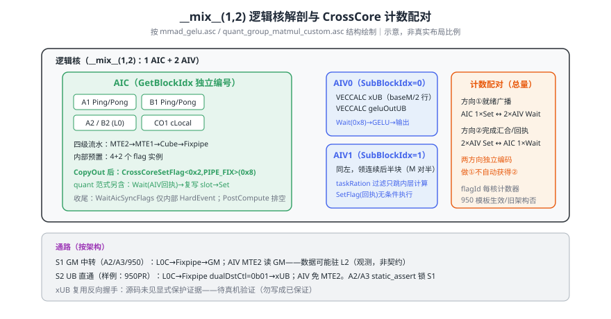
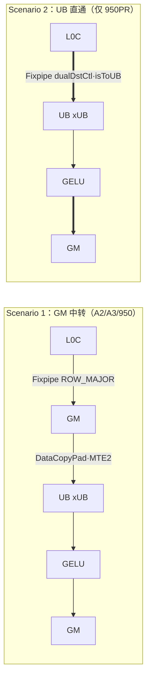
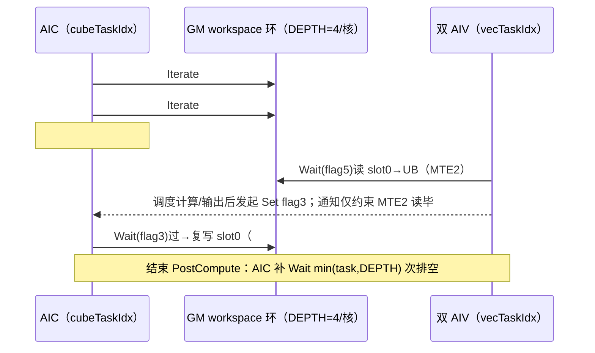
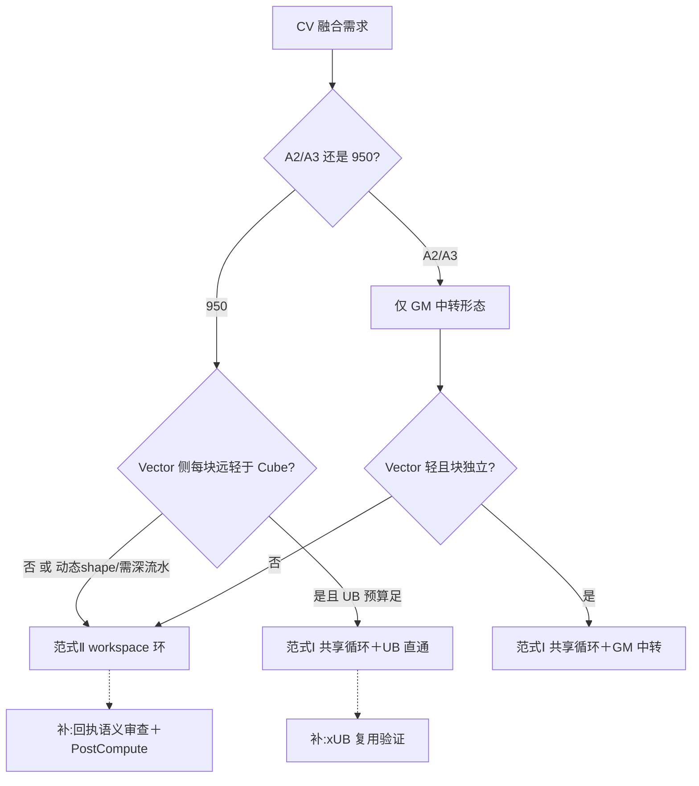

# 第17章 实战Ⅳ：融合算子——Cube-Vector 协同

> 实战第四章。前两章分别打通了 Vector（ch15）与 Cube（ch16）单单元极限；本章处理把它们装进**同一个 AI Core** 时出现的新问题：两类执行单元如何分工、如何握手、数据经由哪里交接、以及融合收益的真实来源与边界。

## 17.1 融合的三种收益与不适用场景

把两个算子融合进一个核函数，收益通常来自以下三处（本章实例的可归因处；非穷尽分类）：

1. **减少 launch 与调度**：一次核函数启动替代两次。其占比随任务时长变化，本书不以单一「量级最小」定论，样例亦未单独计量。
2. **减少中间流量**：中间结果不再完整地「写 GM→读 GM」。它可能落在 L2（仍过 GM 地址但驻留缓存，17.4），可能直接落在 UB（950 直通，17.3），极端情况下只在寄存器（ch15 RegBase 已演示）。
3. **计算重叠**：AIC 做 Cube、AIV 做Vector，两套物理执行单元**并行**——这是 CV 融合独有的大头。950 数据：Matmul 单独 2601.311μs、GELU 单独 348.868μs，融合后 2606.91μs——与「Vector 隐藏于 Cube 时长」的重叠解释相容（独立时长证明须时间线，见 17.6 读数）[^fusionr]。

**融合不适用的情形**（本书按机制推断，非官方清单，均待实测确认）：后处理极轻（Vector 时间占比很小，重叠收益上限低）；强顺序依赖（Vector 需要整块 Cube 结果才能开始，无块级并行度）；UB 容量不足以同时容纳双份工作区；以及目标架构缺少所需通路（如 A2/A3 无 L0C→UB）。每一条都在后文对应实处。

**收益的条件性（写码前自查三问）**：①Vector 侧占整体多少？（单独计时估计——本样例 gelu 348.868/2601.311≈13%；阈值无通用标准，须按样例实测）②有没有块级并行结构？（GELU 逐元素、按 tile 独立→可；LayerNorm 需整行归一→块间依赖，重叠窗口窄）③交接数据走哪层？（决定省多少流量——17.4 两态通路）。三问皆否定则不必融合，ch14 的单算子优化路线更划算。

**融合的层次谱系**（定位本章；三种实现层次并列，非严格包含关系）：算子内融合（本章，CV 两单元）、算子间拼接（一个核内顺序多算子，ch14 拼接式）、图融合（调度层多算子合并，`common/graph_fusion`/GE）。越靠后自由度越大、单点可控性越低；本章的 CV 融合处在「同一核函数内、两套硬单元」这层，**收益与风险都来自硬件并行性本身**。

**本章两个样例**：`matmul_gelu_high_performance`（Matmul+GELU，紧耦合范式）与 `quant_group_matmul_high_performance`（量化分组 MatMul+反量化+FasterGelu，松耦合流水范式）[^fusionr]。两者支持面相同（A2/A3≥CANN 9.0.0、950PR/DT≥9.1.0——**最低运行要求，非性能测量版本**，测量所用 CANN 具体版本 README 未载，如实记未知；950 实测仅 950PR，不外推 950DT）。

## 17.2 `__mix__` 任务模型与 CrossCore 计数同步

### 逻辑核解剖

```cpp
// [示意代码] 签名删节示意；完整原型见脚注源文件 L676
__global__ __mix__(1, 2) void mmad_vector_custom(__gm__ uint8_t* xMatrix, ...)
```

`__mix__(1, 2)`：每个逻辑核由 **1 个 AIC＋2 个 AIV** 组成，同一核函数内用编译期宏分叉执行流：

```cpp
// [示意代码] 省略调用上下文
if ASCEND_IS_AIC  { ProcessLoopAic(/*...*/); }    // Cube 侧：整条 MatMul 流水
if ASCEND_IS_AIV  { ProcessLoopAiv(m,n); }        // Vector 侧：GELU 与搬出
```

三套 ID 各司其职（可复演走查①）：`GetBlockIdx()` 在 AIC 侧与 AIV 侧**各自独立从 0 编号**；AIV 侧 `GetSubBlockIdx()`∈{0,1} 区分子块；需要与配对 AIC 对齐时，quant 样例用 `coreIdx /= GetTaskRation()` 把 AIV 序号折回逻辑核号（源文件 L213）——**该函数无独立文档页，本章仅按样例用法陈述，不外推通用契约**。固定 tile 参数与 ch16 同族：2201 base 128/256/64、singleCoreM=2048/N=1536、24 核；3510 base 256/256/64、singleCoreM=2048/N=1024、32 核[^fusionc]。



*图 17-1 `__mix__(1,2)` 逻辑核与跨核计数示意（按 mmad_gelu.asc 结构绘制；AIC 一次 Set 对应两 AIV 各一次 Wait 才配对）。*

### CrossCore：通知计数器

本节使用的核间同步原语为：`CrossCoreSetFlag<modeId, pipe>(flagId)` 与 `CrossCoreWaitFlag(flagId)`[^crosscore]。机制是**每 flagId 一个通知计数器**：Set 在前置 pipe 流水排空后向调度模块上报，Wait 阻塞本核后续指令**下发**（已下发照跑）直至该 flagId 计数非 0，放行并减 1——**它传递「已完成」这一事实并按次消费，不携带数据、无所有权语义**，故「等数据」必须由配对双方约定同一 flagId 与同一产出管道。**配对是总量配对**，以模式 2（单 AI Core 内 AIC↔所有 AIV）为例：

- **就绪方向**：AIC 1 次 Set ↔ M 个 AIV 各 1 次 Wait——AIV 侧计数各加 1 后放行；
- **回执方向**：所有参与 AIV 各 1 次 Set 后，形成 AIC 侧可消费的一次通知——AIC 的 1 次 Wait 检测到计数非 0 即放行并减 1（**上报按核累计、Wait 按次消费**，两计数勿混）。

**计数要求随场景的 AIV 数变**：`__mix__(1,1)`（quant S0）中「M=1」，回执方向 1 Set↔1 Wait；`__mix__(1,2)` 中 M=2。配对总数由参与核数决定，非恒为 2。

两个方向是**独立编码的两种配对**，做了一种不自动获得另一种——反向回执必须显式写齐「各 AIV Set＋AIC Wait」，反向缺失的后果是**缺少该方向的保护/汇合点**，不一定死锁——只有 Wait 等不到所需 Set 才会无限等待。**平台差异必须逐平台引用**：modeId 支持集见文档「modeId 支持的取值说明」（950：0/1/2/4）；**950 上 Wait 的模板参数（mode/pipe）生效，旧架构上模板不生效、阻塞范围不同**——凡引用同步行为，注明架构，勿写「所有架构一致」。另须区分：AIC 内部 4+2 个 HardEvent flag 实例（ch16）管**执行单元之间**的缓冲生死，CrossCore 管**逻辑核内 AIC/AIV 之间**的任务握手，两套计数互不相通。

| 层次 | 原语 | 计数/状态粒度 | 典型配对 | 本章出现 |
|---|---|---|---|---|
| 单元内管道 | `SetFlag/WaitFlag<HardEvent>` | 事件 ID × HardEvent 类型 | 生产→消费缓冲生死 | AIV 自同步 MTE2_V/V_MTE3 |
| 单元间（AIC 内） | 同上（ch16 4+2 预置） | 同上 | L1/L0 缓冲 Ping-Pong | 17.3 AIC 侧 |
| 逻辑核跨单元 | `CrossCoreSet/WaitFlag` | flagId 计数器，总量配对 | 就绪广播/完成汇合 | 17.3①/17.5 双向 |

*表 17-A 三层同步对照。CrossCore 的 `flagId` 空间与 HardEvent 的 `EVENT_ID` 相互独立；Set 的 `pipe` 模板指「前置流水完成后才上报」，必须与被等待的产出管道一致——gelu 样例 AIC 用 `PIPE_FIX`（Fixpipe 完成才通知），quant 回执用 `PIPE_MTE2`（读毕才回执），差异即语义。*

**两个典型误用**（从计数语义反推）：①**AIC Wait 但只有 1 个 AIV Set**——在 `__mix__(1,2)` 场景下，模式 2 反向需两 AIV 都到，漏一个 AIC 永挂；样例靠「SetFlag 在外层尾无条件执行」规避，改造时把 Set 挪进条件分支就会踩中。②**Set 的 pipe 与产出不符**——`SetFlag<2,PIPE_V>` 却想通知「MTE3 搬完」：上报发生在 V 流水排空时，MTE3 可能未完，接收方读到半成品；pipe 选错不报错，只能靠现象查。**计数器只认「哪个流水排空了」，不认「你想表达什么」**。

模式 0/1/4 在本章两样例未用到，但读代码时会遇到：模式 0 用于**跨逻辑核**同单元全同步（如核间负载对齐），模式 1 用于单核内双 AIV 互同步，模式 4 用于 AIC 与**指定单个** AIV 点对点（flagId 空间按 AIV0/AIV1 分 0-15/16-31 两段——文档原文，仅 950 语义）。本章不展开其他核级同步接口。

## 17.3 范式Ⅰ 紧耦合循环：mmad_gelu 逐段

### Cube 侧：ch16 全套照搬，一处接口分岔

AIC 侧缓冲与四级流水同 ch16 mmad（A1/B1 Ping-Pong、A2/B2、单一 CO1 `cLocal`、4+2 个 HardEvent flag 实例 预置）[^fusionc]。差别只在出口——`CopyOutAic`（L515-561）按架构×场景三岔：

```cpp
// [示意代码] 删节示意：分支结构与关键字段，非可编译文本（#if 为行文简写）；真码见脚注 L515-561
#if 2201   // → 实际为 #if defined(__NPU_ARCH__) && (__NPU_ARCH__ == 2201)
    FixpipeParamsV220 p;                    // 仅 GM 中转；另有 ndNum/srcNdStride/dstNdStride 字段
    Fixpipe<float,float,CFG_ROW_MAJOR_GM>(cGM[...], cLocal, p);
#elif 3510
    if (scenario == 1) { /* FixpipeParamsArch3510<ROW_MAJOR> → GM，同上形态 */ }
    else {                               // S2：UB 直通三件套
        p.mSize = DivCeil(curM, 2) * 2;  // ① 偶数对齐：按 M 拆半给 2 个 AIV
        p.dstStride = curN;              // ② UB 内目的步距（不再隔 N 全宽）
        p.dualDstCtl = 0b01;             // ③ DUAL_DST_SPLIT_M：按 M 对半，前半 SUB0/后半 SUB1
        Fixpipe<float,float,CFG_ROW_MAJOR_UB>(xUB, cLocal, p);   // isToUB 由 Config 第二元控制
    }
#endif
CrossCoreSetFlag<0x2, PIPE_FIX>(0x8);    // 数据就绪广播（两 AIV 各消费一次）
```

**Fixpipe 两侧 stride 的不对称**（易混点，2201 分支）：`srcStride=curMAlign` 是 **L0C 内**对齐步距（CO1 排布按对齐 M），`dstStride=N` 是 **GM 真实行距**——源侧「对齐世界」、目的侧「真实世界」，随路重排由 CO2Layout 承担；S2 的 `dstStride=curN` 则因 UB 内按半块紧凑排。三处 stride 各属一个空间，**写错任何一处都是静默错位**，verify_result 能抓住但定位费时——写码时先画内存草图。

**2201 分支的三个独有字段**：`ndNum=1`（单 ND 块）、`srcNdStride=0/dstNdStride=0`（多块时源/目的 ND 步距，单块填 0）——本样例 GM 路径显式声明 ND 维度字段，ch16 mmad 用法未设；同结构不同用途字段集不同，按用途读字段。

**按用途读字段，勿背结构体模板**：`FixpipeParamsV220` 在本样例需另设 `ndNum=1/srcNdStride=0/dstNdStride=0`（ch16 mmad 用法未设）——同结构不同用途字段集不同，字段随用途取用。

**Fixpipe 两侧 stride 的不对称**（易混点）：`srcStride=curMAlign` 是 **L0C 内**对齐步距，`dstStride=N` 是 **GM 真实行距**——源侧对齐世界、目的侧真实世界，重排由 CO2Layout 承担；S2 `dstStride=curN` 因 UB 内按半块紧凑排。写错任一处即静默错位，写码先画内存草图。

**「拆分给两个 AIV」是三件套共同作用**：`dualDstCtl` 定分流方式、`mSize` 偶对齐保证可整半、`dstStride` 改 UB 内布局——只抄其中一个字段不成立。A2/A3 走不到此分支：文件头 `static_assert(scenarioNum==1)` 编译期锁死（L30-31），**根源是 A2/A3 无 L0C→UB 通路（ch16 §16.6）**。

### Vector 侧：一个 tile 的完整走查（可复演②）

以 3510、S1（GM 中转）、某非尾块（curM=256，curN=256）为例：

1. **等待**：`CrossCoreWaitFlag(0x8)`——AIC 的 Fixpipe＋SetFlag 完成后放行（L566）。
2. **领任务**：`halfM=curM/2=128`；`localSubIdx=GetSubBlockIdx()%2`；`gmOffset=mBlockIdx*baseM*N+nBlockIdx*baseN+localSubIdx*baseM/2*N`——**按 M 对半连续切分：AIV0 得前 halfM 行、AIV1 得后 halfM 行**（GM 路径上下半块；与 `dualDstCtl=0b01＝DUAL_DST_SPLIT_M`「前半→SUB0/后半→SUB1」一致[^dualdst]），两半地址手算可验不重叠。
3. **搬入**：`DataCopyPad` GM→xUB（`blockCount=halfM`，srcStride 折行；`DataCopyPadExtParams{false,…}` 关填充）。
4. **自同步**：`SetFlag/WaitFlag<HardEvent::MTE2_V>`——AIV **内部** MTE2→V 管道边界，与跨核 flag 正交；V 算完再 `Set/Wait<V_MTE3>`。
5. **计算**：3510 走 `GeluRegBaseCompute`（RegBase/VF，ch15 同族）；2201 走 `GeluMemBaseCompute`——Mul 链每步 `PipeBarrier<PIPE_V>`，**输出缓冲复用为中间值**，无额外中间区。
6. **搬出**：`DataCopyPad` geluOutUB→GM，同一 gmOffset 原位覆盖。

**搬入/搬出参数逐字段（可复演②″，以 3510 非尾块代入）**：`DataCopyPad` 入：`blockCount=halfM=128`（行数）、`blockLen=curN×4B=1024B`（行宽）、`srcStride=(N−curN)×4B=(8192−256)×4=31744B`（GM 行距，跳过其它块）、`dstStride=0`（UB 内紧凑）；出：`srcStride=0`、`dstStride=(N−curN)×4B` 对称。**两组数字手算一遍即懂「块级原位覆盖」如何不踩别的块**；尾块代入（curM/curN 变小）再算一遍，`blockLen` 随 `curN` 收缩——ch10 DataCopyPad「随真实宽度收缩」的实战形。

**RegBase 版（`GeluVf`，`__simd_vf__`）骨架**[^geluopt]：`RegTensor/MaskReg` 声明→循环内 `UpdateMask<float>(n)`（尾掩码）→`LoadAlign`→Mul 链全程寄存器→`StoreAlign`——ch15 §15.4 同一模板，**中间量不出寄存器堆**。迁移结论：能「无临时区」优先 RegBase（仅 950PR）；A2 仅 MemBase 可用，其缓冲复用效果须实测，本书不评优。

**MemBase 实现全链（A2 路径，GeluMemBaseCompute L249-281 真码八步）**：GELU 精确式 `x·Φ(x)` 以 tanh 近似后化简为

$$y=\frac{x}{1+e^{-1.595769\cdot(x+0.044715\cdot x^3)}}$$

该近似式等价于 $x\cdot\sigma(1.595769(x+0.044715x^3))$，其中 $\sigma$ 是 sigmoid；标准 GELU 为 $x\Phi(x)$，并非 $x\sigma(x)$。

以下是源函数的完整节选，依赖外围类定义的系数及 Ascend C 编译上下文；本书未在NPU编译运行。[^fusionc]

```cpp
// [需真机验证] 完整源函数节选，需外围上下文
    __aicore__ inline void GeluMemBaseCompute(
        const AscendC::LocalTensor<float>& xLocal, const AscendC::LocalTensor<float>& yLocal, uint32_t n)
    {
        // yLocal = x * x = x²
        AscendC::Mul(yLocal, xLocal, xLocal, n);
        AscendC::PipeBarrier<PIPE_V>();
        // yLocal = x² * x = x³
        AscendC::Mul(yLocal, yLocal, xLocal, n);
        AscendC::PipeBarrier<PIPE_V>();
        // yLocal = x³ * 0.044715 = 0.044715 * x³
        AscendC::Muls(yLocal, yLocal, COEFF_A, n);
        AscendC::PipeBarrier<PIPE_V>();
        // yLocal = x + 0.044715 * x³
        AscendC::Add(yLocal, xLocal, yLocal, n);
        AscendC::PipeBarrier<PIPE_V>();
        // yLocal = -1.595769 * (x + 0.044715 * x³)
        AscendC::Muls(yLocal, yLocal, COEFF_B, n);
        AscendC::PipeBarrier<PIPE_V>();
        // yLocal = e^(-1.595769 * (x + 0.044715 * x³))
        AscendC::Exp(yLocal, yLocal, n);
        AscendC::PipeBarrier<PIPE_V>();
        // yLocal = 1 + e^(-1.595769 * (x + 0.044715 * x³))
        AscendC::Adds(yLocal, yLocal, (float)1.0, n);
        AscendC::PipeBarrier<PIPE_V>();
        // yLocal = x / (1 + e^(-1.595769 * (x + 0.044715 * x³)))
        AscendC::Div(yLocal, xLocal, yLocal, n);
    }
```

源码在相邻的依赖操作间显式使用七次 `PipeBarrier<PIPE_V>()`，并复用 `yLocal` 保存中间结果。修改计算顺序或缓冲布局时，应重新核对依赖关系。

**UB 预算演算（可复演②′）**：每 AIV 两 buffer——`xUB` 与 `geluOutUB`，各 `baseM/2×baseN` float：
2201＝128/2×256×4B=**64KB×2**；3510＝256/2×256×4B=**128KB×2**。这些是每个 AIV 私有 UB 的预算，应分别核对，不能与 AIC 的 L1/L0 容量混为一个存储池。

**双 AIV 切分与尾块限制**：拆分单位是「半张 tile」，`curM` 为尾块奇数时 `halfM=curM/2` 向下取整——源码以 `DivCeil(curM,2)*2` 在 Fixpipe 侧强制偶数（S2），GM 路径尾块则由 `curM` 直接约束 `blockCount`；**尾块为奇数行时的整除行为源码未见显式断言，复现实验时应单测尾块**。两 AIV 之外没有第三份并行：`__mix__(1,2)` 的 Vector 并行度上限就是 2。

### 单向通知与未证的复用条件（如实版）

**同一循环轮内的两侧时序（仅描述可见结构，不作安全结论）**：进入 `(mBlock,nBlock)` 迭代，AIC 分支跑完整四级流水（约 128 次 Mmad＋前置搬运），Fixpipe 仅在末尾；AIV 分支 Wait flag→半块搬算写。AIC 分支内**除 HardEvent 外无任何对 AIV 的等待**——这是源码可见的全部；**据此不能推出「AIV 一定先于 AIC 下轮写回完成」，本书未运行、无时间线证据**。xUB 复用是否需要额外机制保证，属未证事项（17.7 实验①）；验证须构造**多 tile 复用**场景观察，且不能用 quant 的 DEPTH=1 workspace 类比（那是 GM 中转，非 xUB），也不能用 S2 无 MTE2 的 AIV 时间线反推消费完成点。

源码可见的跨核机制**只有单向**：AIC `SetFlag<0x2,PIPE_FIX>(0x8)`（L559）↔每 AIV `CrossCoreWaitFlag(0x8)`（L566/614）——模式 2 第一类配对，成立且仅此一条。**「AIV 读毕 xUB→通知 AIC」的反向配对全文不存在**；CrossCore 计数机制本身不提供任何自动反向。因此：**S2 中 AIC 下一 tile Fixpipe 写 xUB 与 AIV 上一 tile 读 xUB 的隔离，源码未显式给出保护证据**。是否存在额外保证机制，本书未证——**正文不作解释性断言**，验证须构造多 tile 连续复用场景（见 17.7 实验①）。AIC 结尾 `WaitAicSyncFlags`（L127-137）只对称等待 AIC 内部 HardEvent，与跨核无关，勿混写。

## 17.4 两条数据通路：GM 中转（可借 L2）与 UB 直通（仅 950PR）


*图 17-2 两态通路。注意：GM 中转不等于「裸 GM 往返」——见下。*

**GM 中转的隐式收益（README 观测解释，非保证）**：Fixpipe 写入 GM 的数据会驻留 L2；AIV 随后的 MTE2 读取**可能**命中 L2 而非真实 HBM。950 实测独立 GELU aiv_mte2 **320.543μs，S1 中降至 57.145μs（约 −82%）**[^fusionr]——README 将其归因为 L2 命中。**「可能命中」不是编程可依赖的契约**：L2 容量有限（950PR 128MB），替换行为不可控，tile 过大或间隔过长都会溢出；它是**观测到的现象级优化**，正文与读者都应按此理解。GM 接口与 L2 缓存因此**不是两条独立编程通路**——通路只有「经 GM」与「直达 UB」两种，L2 只是前者的缓存效果。

**两态的 Fixpipe 出口参数对照**（回收 ch16 §16.6 族谱）：GM 态 `CO2Layout::ROW_MAJOR`＋`isToUB=false`（`CFG_ROW_MAJOR_GM`，源文件 L39-40 常量）；UB 态同一 Layout 但 `isToUB=true`＋`dualDstCtl`。**NZ→ROW_MAJOR 随路重排两态都在**——「直通省重排」是误解，省的只是 GM 往返；A2 无法直通是通路缺失（L0C→UB 仅 950PR，README 明确），不是参数问题。

**UB 直通的净收益（950 实测）**：S1 2606.91→S2 2573.584μs（−33.3μs）；aiv_mte2 57.145→**0.005μs**；aic fixpipe 252.231→212.403μs。省的是结果交付一跳的 GM 往返（aiv_mte2 几乎清零、fixpipe 下降）；AIC 侧输入搬运两场景数值有波动（1917.737→2096.38，原因未明，见 17.6 表注）——**直通的直接收益在交付侧，输入侧无设计级改变**。

## 17.5 范式Ⅱ 松耦合流水：quant_group_matmul 逐段

### 计算链与固定参数（可复演③）

量化融合的完整数据变换（源文件 L16-18 注释、L419-475 实现）：

$$\text{mmOut}_{gij}^{int32}=\sum_{k} x_{ik}^{int8}\cdot w_{gkj}^{int8}\;\to\;d_{gij}=\text{mmOut}_{gij}\times s_{gj}\;\to\;m_{gij}=d_{gij}\times p_{gi}\;\to\;y=\text{FasterGelu}(m)\;\to\;\text{Cast}_{fp16}$$

其中 $i$ 是全局行号，$g$ 是该行所属组，$p_{gi}$ 表示该行的 $p_i$（实际存储为一维 per-token 数组）。其中 $g$ 为组号（weight 布局 $[G,K,N]$，$w_{gkj}$ 按 **K 行 N 列**理解，存储为 NZ——非转置矩阵），$s_{gj}$ per-channel、$p_{gi}$ per-token。

per-channel scale `s_j`（形状 [GROUP,N]，按列）先乘、per-token scale `p_i`（形状 [M]，按行 Broadcast 后）后乘——**顺序由代码定死（先 Dequant 后 Mul），本章按代码陈述，不做额外数值分析**。host 侧固定实参（源文件 L611-637）：M=N=8192、K=1024、BASE_N=256、BASE_K=128、GROUP_NUM=8；**2201：SINGLE_M=BASE_M=128、24 核；3510：均 256、32 核**；类型 int8/int8/int32/bias int32。`matmulObj` 为高阶 `Matmul` 对象：`CONFIG_MDL＋enUnitFlag＋手填 depth/step` 的常量 Tiling（源文件 L112-127）——**常量 Tiling 非基础 API 专属**；注意本例 2201 `depthA1=16`、3510 `depthA1=8`，与 ch16 mmad 的 3510=16 不同（各按 UB/L1 预算调，勿跨样例混记）。weight 以 **NZ 布局离线**存放（`MatmulType<...,CubeFormat::NZ>`），应区分存储格式与数学转置。

**常量配置的实现**：本例在 `GetCustomConstantCFG()` 内调用 `GetMMConfig<CONFIG_MDL>(shapeParams)`，开启 `enUnitFlag`，由 `GetMatmulApiTiling` 取得配置后设置 depth/step 字段。它使用高阶 Matmul API；第16章基础 `Mmad` 路径则直接编排搬运与矩阵指令，两者不能混称为同一配置入口。[^fusionq]

**分组调度**：`groupListGlobal.GetValue(groupIdx)` 动态读每组行数（MoE 式变长 M），零行组跳过（本例要求有效的非负分组行数）；块编号跨组连续——`preCount` 记录上组未整除余数，`curBlockIdx = coreIdx≥preCount ? coreIdx : coreIdx+CORE_NUM`（源文件 L276-277）保证跨组负载缝合（可复演走查④：CORE_NUM=24、组块 64 时 64%24=16，余 16 块与下组前 16 块错位衔接，README L220 同例）。

### 环形 workspace：生命周期逐步（可复演⑤，本章核心机制）

AIC 每完成一个 **BASE_M×BASE_N** 粒度 Iterate，把 int32 结果经 `GetTensorC(mmOutGlobal[off], 0, true)` 直写 GM workspace（**注意实参形态：偏移在 GlobalTensor 下标里，第二参 0、第三参 true**，源文件 L326——非「把偏移当第二参」）。slot 地址：

```
off = BASE_M × BASE_N × ( coreIdx + (taskIdx % DEPTH) × CORE_NUM )
```

**groupList 走查（可复演④′）**：设 `groupList=[1024,2048,0,512,…]`（int64 行数）、CORE_NUM=24。组 0：groupM=1024→8(m)×8(n)=64 块，余 preCount=64%24=16；组 1：2048→16×8=128 块，`curBlockIdx=coreIdx≥16?coreIdx:coreIdx+24`——**上组未轮满的核先补跑下组头部**，组间无缝；组 2 groupM=0 跳过且**不动 preCount 链**。M 维尾块的剩余行数 `groupM−mIdx×SINGLE_M` 逐组重算——动态 M 尾块在 **single 级**处理，与 ch16 固定 shape 的 base 级尾块不同层。

**地址算例（可复演⑤′）**：2201、S2、`coreIdx=5`、`cubeTaskIdx=6`：`off=128×256×(5+(6%4)×24)=32768×(5+48)=1,737,728`（int32 单位，×4B=6.62890625MiB 偏移）——同核 taskIdx 6 与 2 写同一 slot（6%4=2%4=2），**复用安全性由回执 flag3 保证「读毕」**。Iterate 粒度账：A2 单块 SINGLE_M×SINGLE_N=128×1024，内部 Iterate 次数=(128/128)×(1024/256)=**4 次/单块**；满组 groupM=1024 时单组 8(m)×8(n)=64 单块（README 同数）→**256 次 Iterate/组**，即 256 次 slot 写与 256 次回执；A2 S2 全局 8 组×256=2048 槽次流动。这些计数由固定模板参数推导，指所有核合计的任务数。


*图 17-3′ 环形 slot 双深度对照（地址公式/容量为推算值；时序细节见图 17-3）。*

即**每核 DEPTH 个 slot 环**，总容量 `USER_WORKSPACE_SIZE = DEPTH×BASE_M×BASE_N×4B×CORE_NUM`（L637）：2201 S2＝4×128×256×4×24＝**12MiB**、单 slot 128KB；950 S2＝4×256×256×4×32＝**32MiB**、单 slot 256KB（自算，标推算）。深度随场景：**S0/S1=1、S2=4**——S0/S1 退化成「一槽来回」，S2 才真成环。


*图 17-3 环形 slot 握手时序（DEPTH=4 示意）。flag5=AIC→AIV 数据就绪；flag3=AIV→AIC 读毕回执。*

**回执的精确含义**：AIV 在外层循环尾**无条件**`SetFlag<2,PIPE_MTE2>(SYNC_AIV_TO_AIC)`（L395；`taskRation` 过滤只跳过内层计算，不跳 SetFlag——两 AIV 都到，满足「2 Set↔1 Wait」总量配对）。该 flag 只保证**此 AIV 此前在 PIPE_MTE2 上对该 slot 的读取已完成**；**不**代表 Vector 计算完成，更不代表最终 GM 输出完成——AIC 拿到回执可安全复写 slot，仅此而已。`PostCompute`（L403-417）按 `min(cubeTaskIdx,DEPTH)` 补 Wait，把收尾时未消费的回执排空，防悬挂。

**AscendDequant 与 BroadCast 的分工**：per-channel 乘 scaler 是「列缩放」——`AscendDequant` 内部完成 int32→float 与按列 scale 广播（`sharedTmpLocal` 供其临时空间，2×UB_CAL_SIZE×4B 上限）；per-token 是「行缩放」——`DataCopyPerTokenScaleAndBrcb` 把 [curVecBaseM] 个 float 按行广播成 [curVecBaseM, alignBaseN]（BROADCAST_DIM=2 指张量维数，BroadCast 的第三模板参数 1 指广播轴），再普通 `Mul`。**一列一行、一库一指令**：列缩放走专用 Dequant（带 int32 入口），行缩走通用 Mul——没有「全能 broadcast 乘法」；选型时先问缩放轴。

**AIV 侧 TQue 队列生命周期（与管道对应）**：`vecInQueue.AllocTensor`（拿 UB 空间）→`DataCopyPad2D`（MTE2 搬入）→`EnQue`（标记 MTE2 可完成）→`DeQue`（V 侧取，内部等 MTE2_V）→计算→`vecOutQueue.Alloc/EnQue`（MTE3 侧）→`DeQue/FreeTensor`。队列深度 `BUFFER_NUM=2` 让第 k+1 块搬入与第 k 块计算重叠——**队列纪律是 ch10 API 心智模型在「搬运/计算/搬出三段」上的标准展开**，quant 把它用在共享 slot 下游，等于给环再加一层单元内流水。

**两套「缓冲数」勿混**：`BUFFER_NUM=2` 是 AIV 侧 UB TQue 的队列深度（`vecInQueue/vecOutQueue`，搬运与计算重叠）；`PIPELINE_DEPTH` 是 GM workspace 环的槽深（跨核解耦）。前者单元内、后者跨核，作用层次完全不同。

### UB 内五步与临时空间复用（可复演⑥）

`ComputeDequantAndActivate`（源文件 L419-475）每 offsetN 轮：per-token scale 搬入＋`BroadCast<float, 2, 1>`（将每行一个 scale 扩展到该行各列）→`AscendDequant`（int32×scale，per-channel）→`Mul`（×per-token）→`FasterGelu`→`Cast(CAST_NONE)`，每步 `PipeBarrier<PIPE_V>`。**FasterGelu 是库接口**[^fastergelu]（`adv_api/.../FasterGelu.md`），约束「**sharedTmpBuffer 不得与源/目的操作数地址重叠**」；样例 `actTmpLocal` 复用的是**经 PipeBarrier 后已消费的 dequant/per-token 结果区**——与本次调用的 src(`mulsResultLocal`)/dst(`actResultLocal`) 不同区，恰满足该约束（源文件 L443-447 注「时序上不冲突」的准确含义）。**这不是「随意复用」**：换任何一步的先后都可能违反重叠约束。UB 预算：`UB_CAL_SIZE=24×BASE_N`（单次 24 行）、`vecBaseM=min(24,curCubeM)`、`UB_REST_BYTES=118784`——容量账可依 ch16 方法自行复核。

## 17.6 性能读数：同架构同 shape 才可比

两样例性能表口径：msOpProf、5 次取中位；**Task Duration 为端到端准绳，单流水时间（aic_*/aiv_*）与 ratio 是结构观测**；ratio 是 cycle 占比，**非峰值实现率**（ch16 §16.7 术语延续）。

**quant（同shape M8192/N8192/K1024 int8）**[^fusionq]：

| 场景 | A2（24 核）Task | aiv_vec | 950PR（32 核）Task | aiv_vec |
|---|---|---|---|---|
| S0 基准（1AIV,深1） | 583.512μs | 471.710 | 282.717 | 229.166* |
| S1 双AIV（深1） | 353.887μs | 235.871 | 224.125 | 112.441 |
| S2 +4深流水 | 299.286μs | 235.872 | 204.129 | 112.218 |

*表 17-1 三级优化；A2 S2 对 S0 −48.71%（README）。* 号行为 950 S0 aiv_vec，来自同表列。**

**表列的 AIC 侧补充（quant 场景均为 GM workspace，无 UB 直通）**：A2 mac 192.020→192.612→193.576μs 随场景缓升——Cube 计算本身几乎不变，符合「三级优化动的是并行结构与重叠，不动单块计算」；mte1/mte2 同步缓升属流水排布变化，README 未给单列归因，本书不补。fixpipe 59.619→104.334→185.875μs 的显著上升与「回执等待链＋slot 读写次数随 DEPTH 变化」相关，确切机理 README 未述——**记录现象，不归因**。S0/1/2 的场景定义始终是 1AIV×深1／2AIV×深1／2AIV×深4（全部走 GM workspace），**与 matmul_gelu 的「S1 GM 中转/S2 UB 直通」是两套场景编号，勿串用**——下文 matmul_gelu 表的 S1/S2 才是通路之别。

三个读数纪律，各对应一个样例事实：

1. **重叠收益≠单单元加速**：A2 S1→S2，aiv_vec 几乎不变（235.871→235.872）而 Task −54.6μs——4 深流水提高的是 Cube/Vector**重叠度**，不是 Vector 变快。反例是 S0→S1：vec 腰斩（471.710→235.871）才是单单元加速。两种收益在数据上可分，勿混一谈。
2. **「Vector 瓶颈解除」是 README 对该样例的判定，不是通用判据**：950 S2 vec 112.218<Cube 180.347 且 mac_ratio 0.887，README 称「不再是 Vector 侧」；A2 则 vec 235.872>mac 193.576 仍偏 Vector。**判断依赖「vec 与 mac 对比＋ratio＋等待链」三者，且「Task≈max(各单元活跃时间)」只是理想重叠模型**——实际受依赖、填充/排空、搬运与同步约束（950 S2 README 原文列了四项共同因素），不能当等式用，也不能仅凭 vec<mac 宣告无瓶颈。
3. **理论对账**：A2 Cube 实测 193.576 vs 理论 188.93μs＝97.60%（README 原文）——对比对象是 mac 时间，口径同 ch16。

**matmul_gelu 950 全表**（32 核，scM2048/N1024；μs）[^fusionr]：

| 场景 | Task | aicore | aic_mac(ratio) | aic_mte1 | aic_mte2 | aic_fixpipe | aiv | aiv_vec | aiv_mte2 | aiv_mte3 |
|---|---|---|---|---|---|---|---|---|---|---|
| Gelu 单独 | 348.868 | — | — | — | — | — | 347.99 | 66.277 | 320.543 | 314.547 |
| Matmul 单独 | 2601.311 | 2600.55 | 2593.264(.997) | 816.91 | 1875.057 | 252.163 | — | — | — | — |
| S1 GM 中转 | 2606.91 | 2605.9 | 2597.856(.997) | 818.781 | 1917.737 | 252.231 | 2605.93 | 59.897 | 57.145 | 50.516 |
| S2 UB 直通 | 2573.584 | 2572.67 | 2565.251(.997) | 819.934 | 2096.38 | 212.403 | 2572.69 | 60.438 | 0.005 | 68.76 |

*注意 S2 aic_mte2 变化（1917.737→2096.38）：AIC 输入搬运理应不受直通影响，该变化原因 README 未述——**列间变化不可全归因于通路切换**，本书记录数值不下因果。*

**matmul_gelu A2 侧全行**（24 核，scM2048/N1536）[^fusionr]：Gelu 单独 369.827（aiv_vec 236.506／aiv_mte2 316.672）；Matmul 单独 4227.605（mac 3083.197,0.82；mte1 2516.081；mte2 3685.713）；S1 4236.944（mac 3083.235；aic_mte1 2520.852；**aic_mte2 3687.839 几乎不变——AIC 输入搬运不受融合影响**；aiv_vec 174.327；aiv_mte2 90.315）。**读法**：AIC 列与单独 Matmul 接近是**观测**（未逐列查证差异原因）；明显变化集中在 AIV 列——与「收益在 Vector 侧」解读相容，非因果证明。

**matmul_gelu 结构读数**：950 S1 行内 `aicore_time=2605.9` 与 `aiv_time=2605.93` 几乎相等——**两侧活跃时长接近**（是否「完全隐藏」须逐段时间线证实，本书不下断言）；A2 同构（3770.16/3773.60）。对照单独 Gelu 行（aiv 358.91/347.99）可知：融合后 AIV 从「一次性整表」变「按 tile 半块分次处理」——分块使 Vector 活跃区间与 Cube 交错（每核块数随 host 参数：A2 96、950 64，见 17.2 参数，勿跨平台套用同一数）。A2 S1 aiv_vec 174.327 低于单独 Gelu 的 236.506、aiv_mte2 316.672→90.315 同向大幅下降——**与 L2 命中解释方向一致（README 观测口径），但本书不把差额单独归因为访存等待**，两列变化也可能受调度排布影响。

**matmul_gelu 对照**：A2 S1 4236.944≈Matmul 单独 4227.605（Cube 覆盖 Vector）；950 S1 2606.91≈2601.311、S2 2573.584。**「融合后≈Cube 单独」是重叠充分的样例结果，不是定理**——前提是 Vector 侧足够轻（GELU 单独仅 348.868μs 且被块级拆分）。倍数关系一律由官方数据相除并注明，独立 kernel 数字相加**不得**声称实测端到端加速。

## 17.7 失败模式、边界与生态

**失败与限制清单**（证据分级：源码可见 S／文档可见 D／未证实 U）：

| # | 事项 | 级别 | 处置 |
|---|---|---|---|
| 1 | A2/A3 编译期锁 S1（`static_assert`，选 2 即编译错） | S | 表格化提示读者先看架构再选场景 |
| 2 | A2/A3 无 L0C→UB（ch16 §16.6）——UB 直通不可移植 | S/D | 跨架构代码用「场景×架构」矩阵编译 |
| 3 | S2 xUB 复用无反向握手证据 | S＋U | 正文按「未证实」陈述；复现时人为加大 AIV 延迟单测 |
| 4 | `GetTaskRation()` 无文档页 | U | 只按样例用法引用 |
| 5 | FasterGelu sharedTmp 重叠约束 | D | 复用须证「不同区」；PipeBarrier 序是证据链一环 |
| 6 | 回执≠计算完成（仅 MTE2 读毕） | S | 生命周期图与正文按此精确表述 |
| 7 | 尾块奇数行整除行为无显式断言 | U | 复现实验单测尾块 |
| 8 | 测量 CANN 版本未知；950DT 无数据 | — | 性能表注明「最低要求≠测量版本」 |

**数值误差与读者实验**：量化链每级舍入（int8 输入、int32 累加、fp32 反量化与转 half 输出）误差应与 `verify_result.py` 阈值对拍；建议实验：①per-channel/per-token 交换顺序观察数值差；②A2 上编译场景 2 观察 `static_assert` 信息；③多 tile 复用下探 xUB 复用边界（见下改造提示）。三者本书均未执行，列为复现入口。改造提示：①构造**多 tile 连续复用 xUB** 的场景（拉长 Vector 或缩小 AIC 间隔）观察复写交叠，正确性以 `verify_result.py` 通过与否判定；②读输出 `output.bin` 按块比对定位污染——块号由 `gmOffset` 公式反算；③`msopprof --aic-metrics=PipeTimeline` 时间轴核对 AIC Fixpipe 写 xUB 与 AIV 读 xUB 的重叠区间是否真实存在。三者均须真机，本书未执行。

**生产库导览（只述可证事实）**[^vfusion]：`ops-nn/vfusion/` 现有 7 个算子目录（modulate、modulate_grad、multi_scale_deformable_attention_grad、multi_scale_deformable_attn_function、normalize_bbox、scaled_masked_softmax_grad_v2、scaled_masked_softmax_v2）＋1 个 CMakeLists——偏视觉/激活融合，无 quant/matmul 类；CV 融合重型范式当前主要沉淀在 asc-devkit 样例层。`common/graph_fusion` 是图调度层概念，与算子内 CV 融合不同层，勿混。

**复现入口**（依据仓内 README/CMakeLists 整理；`[需真机验证]`，本书未运行）：

环境前提：CANN 开发套件（商用/社区版，msOpProf 性能采集需之）并 `source "${CANN_PATH}/set_env.sh"`；NPU 或配套仿真环境。**`SRC` 指向样例库的可写副本**（勿在只读检出内构建），路径按实际设置：

```bash
: "${SRC:?请先设置SRC为asc-devkit可写副本的绝对路径}"
GELU=$SRC/examples/01_simd_cpp_api/05_best_practices/03_fusion_compute/matmul_gelu_high_performance
QUANT=$SRC/examples/01_simd_cpp_api/05_best_practices/03_fusion_compute/quant_group_matmul_high_performance

# matmul_gelu（场景 1=GM 中转，2=UB 直通仅 950PR；A2 只能 1）
mkdir -p "$GELU/build" && cd "$GELU/build"
cmake .. -DCMAKE_ASC_ARCHITECTURES=dav-3510 -DSCENARIO_NUM=1 && make -j   # A2: dav-2201
python3 ../scripts/gen_data.py                                           # 生成输入与真值
./demo                                                                    # 执行
python3 ../scripts/verify_result.py output/output.bin output/golden.bin   # 校验

# quant_group_matmul（场景 0/1/2=1AIV深1/2AIV深1/2AIV深4，全部 GM workspace）——绝对路径另起
mkdir -p "$QUANT/build" && cd "$QUANT/build"
cmake .. -DCMAKE_ASC_ARCHITECTURES=dav-2201 -DSCENARIO_NUM=2 && make -j  # 950PR: dav-3510
python3 ../scripts/gen_data.py && ./demo
python3 ../scripts/verify_result.py output/output.bin output/golden.bin
# 两例通用：仿真加 -DCMAKE_ASC_RUN_MODE=sim；切换场景/架构先 rm CMakeCache.txt（README 注意项）
# 性能：msopprof --aic-metrics=PipeTimeline ./demo
```

## 两范式选择：一段决策序列


*图 17-4 范式选择序列（按两样例特征归纳，非官方指南；虚线为各自必做验证）。*

## 陷阱与注意（汇总）

| 坑 | 症状 | 对策 |
|---|---|---|
| 把 CrossCore 当双向自动 | 缺少复用保护；若存在未配对 Wait 则可能死等 | 两方向独立编码；总量配对 1↔M/M↔1（17.2） |
| 跨平台抄同步模板 | 旧架构 Wait 模板不生效 | 平台分别引用 modeId 支持表（17.2） |
| A2 编译 UB 直通 | static_assert 失败 | 场景×架构矩阵；A2 仅 S1（17.3） |
| 只改 dualDstCtl 不改 mSize/dstStride | 拆分错位 | 三件套缺一不可（17.3） |
| 把回执当「算完了」 | 过早复用假设失据 | 回执=MTE2 读毕；计算/输出另论（17.5） |
| BUFFER_NUM 与 DEPTH 混谈 | 双缓冲层次错乱 | UB 队列 vs GM 环，两套深度（17.5） |
| sharedTmp 与 src/dst 重叠 | FasterGelu 未定义行为 | 复用已消费区＋PipeBarrier 序（17.5） |
| 跨架构/跨场景比性能 | 数字失义 | 同架构同 shape 同 dtype 才可比（17.6） |
| ratio 当峰值率 | 高估优化空间 | 占比=cycle 份额；结合 vec/mac 对比（17.6） |
| 融合后 Task 当 max 等式 | 忽视填充/排空/同步 | 理想模型参考，实测为准（17.6） |

## 承诺兑现对账

| 前文承诺 | 本章兑现处 |
|---|---|
| ch16 §16.6「L0C→UB 直通是 17 章地基」 | §17.3/§17.4：dualDstCtl 三件套即该通路用法 |
| ch16 §16.6「A2 绕道成本差异→17 章融合两代成本不同」 | §17.4：A2 仅 GM 态的架构根因 |
| ch15 RegBase/VF（15.4-15.5） | §17.3 GeluVf 直接复用，零改写 |
| ch10 事件同步/TQue 心智模型 | §17.2 三层表、§17.5 队列生命周期 |
| ch14「融合见 17 章」伏笔 | §17.1 谱系定位：拼接为另一实现层次，CV 融合见 17.1 |

## 本章小结

::: tip 一句话总结
**CV 融合的可行性由架构通路决定（A2/A3 仅 GM 中转，950PR 方有 UB 直通；950DT 未经实测），收益由重叠与中间流量削减决定，而正确性由同步纪律决定：CrossCore 按方向显式配齐两类计数（就绪须广播到位、回执须凑齐上报；缺 Wait 侧保护则失保护，Wait 等不到 Set 才挂），范式Ⅰ用共享循环＋单向通知（复用保护未证，须实测），范式Ⅱ用环形 workspace＋双向握手（回执=读毕非算完）。性能上先分清单单元加速与重叠收益，再谈瓶颈——且只在同架构同 shape 内比较。**
:::

## 本章来源与进一步阅读

[^fusionc]: matmul_gelu 源码（`__mix__` 声明 L676、架构常量 L688-705、CopyOut 三岔 L515-561、CrossCoreSetFlag L559、GeluFromGM/UB L563-645、MemBase L249-267/VF L269+、xUB 分配 L56-63、AIC flag L114-137、static_assert L30-31）：`asc-devkit/examples/01_simd_cpp_api/05_best_practices/03_fusion_compute/matmul_gelu_high_performance/mmad_gelu.asc`。
[^fusionr]: matmul_gelu README（场景/通路、A2 与 950PR 性能表、L2 观测解释 −82%、S1/S2 对照、msOpProf 用法与流水图 `figures/*.png`、编译运行节）：`asc-devkit/examples/01_simd_cpp_api/05_best_practices/03_fusion_compute/matmul_gelu_high_performance/README.md`；构建与数据脚本 `asc-devkit/examples/01_simd_cpp_api/05_best_practices/03_fusion_compute/matmul_gelu_high_performance/{CMakeLists.txt,scripts/gen_data.py,scripts/verify_result.py}`。
[^fusionq]: quant_group_matmul 源码与 README（计算链注释 L16-18、场景 L32-34、常量与 UB 预算 L90-94、Tiling L96-127、Process/MMCompute/VectorCompute/PostCompute L254-417、五步链 L419-475、host 实参与 workspace 公式 L611-637、性能表 L380-400 与分析 L400-427、最低版本表、构建节 L430 起）：`asc-devkit/examples/01_simd_cpp_api/05_best_practices/03_fusion_compute/quant_group_matmul_high_performance/quant_group_matmul_custom.asc`、`asc-devkit/examples/01_simd_cpp_api/05_best_practices/03_fusion_compute/quant_group_matmul_high_performance/{README.md,CMakeLists.txt,scripts/gen_data.py,scripts/verify_result.py}`。
[^crosscore]: CrossCoreSetFlag/CrossCoreWaitFlag 与关键特性（计数器机制、模式 0/1/2/4 定义与配对表、950 与旧架构模板差异、flagId/pipe 约束）：`asc-devkit/docs/zh/api/SIMD-API/basic_api/sync_control/inter_core_sync/{CrossCoreSetFlag_ISASI,CrossCoreWaitFlag_ISASI,key_features}.md`。
[^dualdst]: L0C→UB 双目标模式（`DUAL_DST_SPLIT_M`：按 M 对半，前半 SUB0/后半 SUB1；NZ2DN 场景另述）：`asc-devkit/docs/zh/api/SIMD-API/basic_api/cube_compute_TensorAPI/cube_store_key_features/l0c_to_ub_dual_dst.md`。
[^fastergelu]: FasterGelu 接口（公式化简、sharedTmpBuffer 重叠约束、highPrecision/highPerformance 语义与 950 保留注）：`asc-devkit/docs/zh/api/SIMD-API/adv_api/activation_functions/Gelu_interface/FasterGelu.md`。
[^geluopt]: GELU 单算子优化出处（RegBase+VF Case1、展开 Case2——本章 17.3 直接引用不重述）：`asc-devkit/examples/01_simd_cpp_api/05_best_practices/02_reg_compute/gelu_high_performance/README.md`。
[^vfusion]: ops-nn 融合目录快照（7 算子目录＋CMakeLists，2026-10）：`ops-nn/vfusion/`。

- **下一站**：第 18 章「实战Ⅴ：Flash Attention」——本章 CV 协同＋ch16 Cube 全路径在注意力上的总装。
- **交叉引用**：HardEvent 与事件对（10.2、ch16 §16.3）；Fixpipe 出口族谱与 L0C→UB（ch16 §16.6）；RegBase/VF 与 GELU 变体（ch15 §15.4-15.5）；TQue/TPipe（ch10）。
