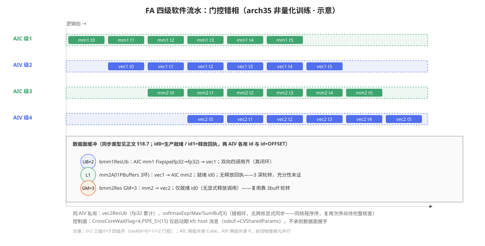

# 第18章 实战Ⅴ：Flash Attention

> 本书实战章的主线收官。前述机制与实战章（ch9–17）的关键机制——Tiling 分形（第14章）、Cube 流水与 Fixpipe（第16章）、CV 跨核协同两范式（第17章）、RegBase/VF（第15章）——在注意力这一个算子里总装。本章主线**严格限定**：`ops-transformer/attention/flash_attention_score` 的 **arch35（Ascend 950）非量化、训练（前向）、ND 布局主路径**；fp8/Nz/推理特化仅在指出岔路时点名，不展开[^faa][^fab]。A2（arch22）为上一代 API 风格的平行实现，本章仅作入口级对照（§18.2），其流水细节未逐一实查、不混入结论。

## 18.1 问题：两次矩阵乘夹一个会长的 softmax

注意力核心是 `O = softmax(QKᵀ·scale)·V`——难点不在公式而**工程化**：S×S 分数的 O(S²) 带宽，与 softmax 行归一化的全局依赖（见全行才能除）。Flash Attention 一并解决：分块让分数只以 tile 流过片上，在线重缩放把全局归一化分解为「逐块校正＋末尾一次除」。朴素做法要把 S×S 分数矩阵整个算完、存完、再归一化——S 上千时这张表本身就是带宽负担。Flash Attention 的改动只有一处：**KV 沿 s2 切块，softmax 逐块在线消化**。每消化一块，维护三个行向量：

- **m**（行最大值）：`m_new = max(m_old, rowmax(S_blk))`
- **l**（指数和，未归一化）：`l_new = l_old·e^(m_old−m_new) + rowsum(e^(S_blk−m_new))`
- **O 累计**（未归一化）：`O_new = O_old·e^(m_old−m_new) + P_blk·V_blk`

注意 **O 的累计始终不除 l**——归一化推迟到全部块消化完。旧累计只需乘一个校正因子 `e^(m_old−m_new)`（这就是 kernel 里的 `expMax`），三者的重缩放共用它。数学递推的正确性有独立验证：`management/validation/ch18-online-softmax.py` 以 S1=S2=4、D=2（**Q/K/V 均 4×2**）、KV 块大小 2 做全量 softmax 与逐块递推的 NumPy fp64 对拍，最大偏差 2.220e-16，第二块的校正因子 `[0.2882, 0.6967, 1.0, 0.376]` 显示重缩放确实非平凡[^faMath]。**该对拍只证明数学递推本身，不构成对 CANN kernel 或 NPU 行为的验证。**输入/输出全文（seed=20261009 可复跑，脚本头有运行法 `python3 management/validation/ch18-online-softmax.py`）：

完整 Q/K/V/O/P 矩阵由脚本输出；例如最终输出为：

```text
O_ref = O_online（以下保留6位小数）
[[ 0.229290, 1.373459],
 [ 0.027010, 1.233073],
 [ 0.005311, 1.258845],
 [-0.324751, 1.492157]]
```

以脚本的全精度误差断言为准，不能用显示值相等代替误差检验。

把数值例展开到能对上 18.5 的分支：两块 KV 即「首块＋末块」。第一块后 m/l/O 处于「块内 softmax」态；第二块先算本块 rowmax 与校正 corr——手算值 `[0.2882, 0.6967, 1.0, 0.376]` 里第 3 行为 1.0，意味着该行新 max 未被刷新（`max(m_old,rowmax)==m_old`），**corr=1 的行重缩放是恒等**——kernel 里同样发生，`FlashUpdateNew` 不特判它，乘 1 的开销由 VF 吞掉。l 的更新同式；最终 O 除以 l 才与全量 softmax 逐元素相等（log 中 O_ref==O_online）。**读法**：先把这张 4×2 小表手推一遍，再看 18.5 的三分支——kernel 只是把这个手推过程向量化＋流水化了。

## 18.2 仓库地图与主线锚定

算子仓库 `ops-transformer/attention/flash_attention_score/` 分 `op_host`（tiling）、`op_kernel/{arch22,arch35}`、`examples`、`docs`。本章四个文件级锚点：

| 锚点 | 角色 |
|---|---|
| `op_kernel/arch35/flash_attention_score_kernel_train.h`（579 行） | 四级软件流水主循环 |
| `op_kernel/arch35/flash_attention_noquant_kernel_base.h`（816 行） | Kernel 基类：缓冲声明/编译期岔路 |
| `op_kernel/arch35/flash_attention_noquant_block_vec_base.h`（2420 行） | Vec1/Vec2 全部向量侧实现 |
| `../common/op_kernel/arch35/`（VF；buffer.h 位于其上一级） | 跨算子共享 VF 与同步原语 |

**主线模板的圈定**：非量化（`noquant` 族）＋训练（`*_train.h`/`RunInfo<isInfer>` 模板参为 false 侧）＋ND（`ProcessVec1Nd` 分支）。推理是独立算子族（`fused_infer_attention_score` 等）与独立 kernel（`infer_flash_attention_comm_arch35.h`）；fp8 走 `isFp8` 模板参的 deScale 分支；Nz 是另一套 `ProcessVec1Nz`——均只在岔路处点名。arch22 目录无此 regbase 套件，入口是 `flash_attention_score_s1s2_bn2gs1s2_b.h` 一类按 shape 特化的旧风格文件：**本快照中两代实现并存**，本章以 arch35 为准，arch22 不作深混对照。

产品矩阵（README 头表）：950PR/DT、A3/A2 训练支持；**A2/A3 推理不走本算子**[^faReadme]。

**阅读路线**（对应本章节序，亦即重走实现的方式）：先 18.3 明白「四级各干嘛」→ 18.4/18.5 沿数据走（mm1 出口→Vec1→Vec2 三分支）→ 18.6 出口 → 18.7 回头补同步全景（此时每个 Wait/Set 都有归属）→ 18.8 岔路自查 → 18.9 用固定 shape 把全程串一遍。**读码顺序建议**：`kernel_train.h` 主循环（50 行骨架）→ `block_vec_base.h` 的 ProcessVec2 双重载（UB L1319-1464／GM 内联 L1625-1770）→ `vf_flashupdate_new.h` 头三个函数 → `buffer.h` L348-421——这四段吃透，其余皆变奏。

## 18.3 四级软件流水：一个循环里的四个角色

第17章的两种 CV 协同范式（共享循环单向通知／环形 workspace 双向握手）在这里升级为**四个软件级组成的流水**。主循环骨架（真码删节，`flash_attention_score_kernel_train.h` 主 Process 内）：

```text
// [示意代码] —— 四级门控骨架（删节全部 shape/分支；真码 train L301-345）
每拍 taskId++：
  if notLastThreeLoop:            AIC 级1 IterateBmm1(runInfo[taskId&3])
  if taskId>0 && notLastTwoLoop:  AIV 级2 ProcessVec1(runInfo[(taskId+3)&3])
  if taskId>1 && notLast:         AIC 级3 IterateBmm2(runInfo[(taskId+2)&3])
  if taskId>2:                    AIV 级4 ProcessVec2(runInfo[(taskId+1)&3])
```

三个门控条件是流水的心脏：**级2 要 `taskId>0`（等首拍 mm1 发出）、级3 要 `>1`、级4 要 `>2`**——t=0 只有级1、t=1 两级、t=2 三级、**t=3 起四级齐跑**。环索引也由门控反推：级2 在拍 t 处理 `(t+3)&3 = t−1` 号 runInfo（上一拍级1 的产出）、级3 取 `t−2`、级4 取 `t−3`——**每级比前级晚一拍、状态环回退一位**，这正是「生产领先消费一拍」的代数形式。注意 **AIC 两级共享 Cube 单元、AIV 两级共享 V 单元**——「四级并行」是软件流水意义上的错相，物理上是同单元时间片交错，不是四个独立硬件单元各跑一个 task。

**逐拍任务表（0–6 拍，示意）**：

| 拍 t | 级1(AIC) | 级2(AIV) | 级3(AIC) | 级4(AIV) | 备注 |
|---|---|---|---|---|---|
| 0 | mm1#0 | — | — | — | 填充 |
| 1 | mm1#1 | vec1#0 | — | — | |
| 2 | mm1#2 | vec1#1 | mm2#0 | — | 三级 |
| 3 | mm1#3 | vec1#2 | mm2#1 | **vec2#0** | **四级齐** |
| 4 | mm1#4 | vec1#3 | mm2#2 | vec2#1 | 稳态 |
| 5 | mm1#5`†` | vec1#4 | mm2#3 | vec2#2 | |
| 6 | — | vec1#5`†` | mm2#4`†` | vec2#3 | 排空开始 |

`†` 受 `notLast*` 门控，末段按 s2LoopLimit 实际值收缩；排空逐级少发一拍。

收尾用 `notLastThreeLoop/notLastTwoLoop/notLast` 逐级少发一拍排空。图 18-1 是这个结构的示意（非实测时序）：



*图18-1：arch35 条件主线的逻辑拍与缓冲；块宽不表示实测耗时。*

**逐拍走查（示意）**：设 s2 循环至少 4 段。t=0 仅级1 发 mm1#0（流水填充）；t=1 级1#1 与级2#0 并行——级2 的 `WaitCrossCore` 等的正是级1#0 刚 Set 的 id0；t=3 起四级全满。级 k 读的缓冲由级 k−1 在**前一拍**写就——错相 1 拍是「生产领先消费」的最小间隔，四级流水把它放大成三级深。runInfo 环让每级拿到**自己那一拍**的形状参数（`s2LoopCount/s2LoopLimit/各 realSize`）而非全局变量——状态随 task 走、不随时间走，这是软件流水不串台的关键。收尾 `notLastThreeLoop` 先掐级1、倒序逐级排空。
软件流水在此把「级间依赖」翻译成「缓冲深度」：级1→级2 隔一拍配 UB 双缓冲，级3→级4 的 GM 槽与私有环配 3 深——**深度取值是本实现的选择，各缓冲独立定制，无一般通则**。

与 ch17 两范式的关系：FA 的缓冲策略**按级各自定制**，而非全局一种——级1 用 UB 双缓冲（`BuffersPolicyDB`＋`CROSS_CORE_SYNC_BOTH`），级3 输出用 GM 三缓冲（`BuffersPolicy3buff`＋`CROSS_CORE_SYNC_FORWARD`），级2→级3 的 P 走 L1；还有编译期岔路 `bmm2Write2Ub` 允许级3 直写 UB（950 才有通路，见 ch17）。**这些 SyncType 枚举的真实语义与 §18.7 的逐缓冲分析，以 `buffer.h` 分支代码为准，不望文生义。**

## 18.4 级1→级2：Nd路径的精度与mask

本章结构走查限定INPUT_T/T/OUTPUT_T为half/float/half，模板块s1=s2=128、D=Dv=256，hasAtten=true，无pse/drop/rope，optionalDn=false、enableKVPrefix=false、isInfer=false。mask必须是真实有效的输入；这里只分析已给定模板参数的路径，未执行host Tiling验证自动选择。[^faCommon]

有效mask使ContainOptionalInput为真，fp16又不满足fp8条件，因此IsDn返回false；useNz亦为false。Dv=256不满足splitD的大于256条件。UbOutCondition为假，GetC2Position在上述完整条件下返回GM。无可选输入的128/128/D256组合其实走Dn，不能用于佐证Nd。

mm1输出调用FixpipeBmm1NdToUb：ROW_MAJOR布局、dualDstCtl=1，使用`Fixpipe<T,T,PFA_CFG_ROW_MAJOR_UB>`。T=float，因此结果以fp32直接写入UB，单次双目标调用沿M拆给两个AIV。源码把mSize偶数对齐、nSize向8元素对齐，srcStride向16对齐，dstStride取s2BaseSize。QF322F16_PRE及两次单目标输出属于另一条Nz实现，不是本章主线。[^fac]

ProcessVec1Nd从`bmm1ResBuf.GetTensor<T>()`取得float分数，max/sum以float视图处理，再将P转换为INPUT_T（本例half），写L1供mm2消费。mm2的另一输入是V。类型链为：half Q/K→fp32累加和mm1 UB结果→fp32 softmax→half P→fp32 mm2及在线累计→half最终输出。

mask经AttenMaskCopyIn预取、`DeQue<uint8_t>`取得视图后传入ProcessVec1Vf。mask布局、sparseMode与窗口须满足真实API契约；hasAtten=true本身不决定裁剪范围。18.1数学例只验证无mask递推，本条件案例中mask在行最大值及指数和更新前影响分数。

每个AIV处理半块；实际有效元素由s1RealSize/s2RealSize约束，不能将对齐范围当作有效数据。P写L1带AIV半块偏移；exp校正因子进入softmaxExpBuf[taskIdMod3]，m/l进入softmaxMax/SumBuf[multiCoreIdxMod3]。两个索引不能互换。[^fac]

## 18.5 级4：累计、末块与归一化——分支是互斥的

为什么要把「末块」单拎成一个重载？——把除法塞进最后一次累计，省一次全域扫（l 就地可得），也让中间块 VF 保持纯净（无 sum 参，寄存器压力小）；代价是**四分支心智**。级4（ProcessVec2）的结构最容易读错，**必须按分支回源**[^fac]。先分重载：`bmm2Write2Ub`（即 `bmm2OutPos==VECCALC`）为真走 `ProcessVec2OnUb`（UB 重载，L1319）；`splitD` 走 `ProcessVec2DSplit`；**主线重载由 `GetC2Position` 静态定**（common arch35 `flash_attention_score_common_regbase_arch35.h` L191-216，cube L153-158 调用）：

```text
// [示意代码] 决策真码删节
UbOutCondition: 可选输入(pse/atten/drop)全无 且 (!isS2Base64 || fp32) → true（另有 fp8/int8+rope 等前支）
GetC2Position:  d≤Aligned128 → VECCALC
                d≤Aligned192 且 UbOut → VECCALC
                isNdS2Size256(s2Base==256&&s1==64) → VECCALC
                否则 → GM
```

本章采用18.4的带mask组合；D=256不足以独立决定出口，还须结合optionalDn、MLA及64/256组合等完整条件。此组合的Nd与GM已按谓词核对。

主线 GM 版按 `vec2S1BaseSize=8192/dTemplateAlign64` 行分片搬入 UB。覆盖 `bmm2Ub` 前先执行 `SetFlag/WaitFlag<HardEvent::V_MTE2>`，确保此前向量读取完成；搬入后执行 `SetFlag/WaitFlag<HardEvent::MTE2_V>`，再进行本片向量计算。这是两组不同方向的事件，不能交叉配对。完整分支树（示意，删节；真码 L1694-1759）：

```text
// [示意代码] —— GM 重载分支树；UB 重载同构（L1360/L1403-45），差异仅无 GM→UB 搬运
WaitCrossCore();
for vec2S1Idx = 0; vec2S1Idx < vec2LoopLimit; ++vec2S1Idx)  // s1 再切 8192/D 行/轮，不含端点
    SetFlag/WaitFlag<V_MTE2>();            // 复用输入UB前等上一轮V读完
    GM --DataCopy/Pad--> bmm2Ub;
    SetFlag/WaitFlag<MTE2_V>();            // 搬入完成后才允许V读取
    if (s2LoopCount == 0)
        DataCopy(vec2ResInner, bmm2Ub);      // ① 首块：直装，无 FlashUpdate
    else if (s2LoopCount <  s2LoopLimit)
        FlashUpdateNew(...)                  // ② 中间块：纯累计，无 sum
    else /* == limit */
        FlashUpdateLastNew(..., sumUb);      // ③ 末块：累计＋内含 Div
    if (s2LoopCount == s2LoopLimit) {
        if (s2LoopCount == 0)
            LastDivNew(vec2ResInner, ..., sumUb);   // ④ 单块收尾：补除
        CopyOutAttentionOut(..., vec2S1Idx);
    }
}
```

**四分支对照**（两重载同构；行号 GM 版/UB 版）：

| 分支 | 条件 | sum 参与 | 除法位置 | 对应数学 | 行号 |
|---|---|---|---|---|---|
| ①首块直装 | `count==0` 且非末块 | 无 | 无 | O←P·V 首块 | L1695/L1360 |
| ②中间累计 | `0<count<limit` | 无 | 无 | O←O·corr＋P·V | L1725/L1403 |
| ③末块累计＋除 | `count==limit` 且 `count>0` | 读 `softmaxSumBuf` | **VF 内 `Div(vreg,vreg_add,vreg_exp_sum)`** | 累加末块后 ÷l | L1739/L1421 |
| ④单块补除 | `count==limit==0` | 同上 | 独立 `Div` | 直接 O=P·V/l | L1751/L1441 |

要点：**①与②③由外层 if 分开——首块不进任何 FlashUpdate**；④只兜「s2 只有一个块」的特例（无旧可缩、直接除）。常见误读是「末块先 Last 再 LastDiv 连续两步」——按真码两者由 `count==0` 分岔，仅单块补除。除法广播：`expSumUb+i*REDUCE_SIZE`（`REDUCE_SIZE=1`）——l 是行标量，D 维共享除数；`static_assert(IsSameType<T,float>)` 约束累计类型，不能据此排除fp8输入。`isUpdatePre=true` 变体在 **count==1 对 fp16 同样实例化**（GM L1726：`if(count==1) FlashUpdateNew<…,true,…>`不分 dtype）；其内 `deScaleVPre` 仅当 `if constexpr(INPUT_T∈{fp8,int8,hif8})` 才参与 `Muls`（vf_flashupdate_new.h 门控原文），fp16 下该参数无效——**不能从形参存在推断fp16使用该缩放**。**UB 重载（`ProcessVec2OnUb`）在本主线不启用**，列此仅作岔路标识：mm2 直写 UB 时免去GM搬运及该切片循环，其余同构。

## 18.6 出口：cast、特例与 GM 写

归一化后的 `vec2ResUb`（fp32）交 `CopyOutAttentionOut`→`Bmm2DataCopyOut`（L2022 起）。cast 在这里：

```text
// [示意代码] 源码删节（含中文注），flash_attention_noquant_block_vec_base.h L2022 区
LocalTensor<OUTPUT_T> attenOut;
if constexpr (输出即fp32且无特例) { attenOut.SetAddr(vec2ResUb.address_); /* 免cast */ }
else {
    Cast(attenOut, vec2ResUb, RoundMode::CAST_ROUND, vec2CalcSize);  // fp32→OUTPUT_T
    // PostQuant 分支（量化输出）或直接下行
}
SetFlag/WaitFlag<HardEvent::V_MTE3>(...);   // V 完成→MTE3 搬运
DataCopyExtParams ...;                      // blockLen = dSizeV*sizeof(OUTPUT_T)，写 GM
```

**输出 cast 的真实符号是 `Cast(…, RoundMode::CAST_ROUND)`**；输入即 fp32 的场景免 cast 直用；`AA_INVALID_LINE_HIGH_PRECISION`/float 输入走 `InvalidLineUpdate`/`RowInvalid` 特例先行。V→MTE3 用 HardEvent 对（同核单元间，ch10 语义），跨核不涉。

本例输出为half，写出前执行CAST_ROUND。无效行与PostQuant分支须各按条件分析，不能拼成所有输入必经的固定序列。V_MTE3事件约束输出搬运依赖；blockLen按实际dSizeV和输出元素大小计算。

## 18.7 缓冲生命周期与同步全景——按分支代码，不按枚举名

第17章建立「就绪/回执」双向模型时强调过：**同步语义看分支实现，不看枚举名**。本章共享原语 `buffer.h`（fa_base_matmul）的 `Wait/SetCrossCore` 按 `bufferType×syncType` 编译期分岔，实证两条反直觉结论[^fad]：

1. **方法能力≠调用闭环**：`buffer.h` 的 UB/GM 分支（非 BACKWARD）确有双向 Wait/Set **能力**且不分 BOTH/FORWARD——但**分支代码只在被调用时生效**；主线各缓冲实际调用了哪个方向，须逐函数回源（见下表），不能由原语能力推出闭环。
2. **实际调用核查（主线 fp16 Nd）**：
   - **级1 UB BOTH＝真闭环**：本例 cube `IterateBmm1NdL0Split` 的 `outputBuf.WaitCrossCore()`（L1173，等 AIV 上轮 id1）与 `SetCrossCore()`（L1177，发 id0）；vec1 入口 Wait id0（L312），Nd 分支释放 `bmm1ResBuf` 时 Set id1（L1226）——**两侧四调用齐**。
   - **级3 GM＝仅就绪向**：cube `IterateBmm2` GM 尾 `outputBuf.SetCrossCore()`（L888，id0）；vec2 入口 `WaitCrossCore()`（L1629，id0）；**GM 全路径无任何 id1 调用**——cube 侧 `outputBuf.WaitCrossCore()` 仅 `bmm2Write2Ub` 分支（L845-847），vec2 GM 版无 SetCross。**释放握手不存在**，槽位复用依赖 3buff 轮转错相（见 #3 行），其充分性本编未完成分析。
3. **两 AIV 是两个独立通知**：凡实际调用的 AIC↔AIV Wait/Set 均成对 `id` 与 `id+AIV0_AIV1_OFFSET`——两个物理计数各报各，漏一即对应 Wait 永挂（ch17 判据复用）。

两 AIV 的分工使**每个实际存在的跨核通知**都有「×2」影子——**就绪向漏发**会使对应 Wait 永挂（可观测挂死，ch17 判据复用）；GM 释放向无调用，**不存在「漏发释放」问题**，其风险转化为 3buff 轮转充分性（未证，见下行）。据此逐缓冲建账（**已见同步**栏只写代码可见者）：

| # | 缓冲 | 生产→消费 | 实际就绪调用 | 实际释放调用 | 软件环/生命周期 |
|---|---|---|---|---|---|
| 1 | `bmm1Buffers` UB×2 BOTH | AIC mm1-Fixpipe → vec1 | cube L1177 `SetCrossCore`(id0)；vec1 L312 `WaitCrossCore`(id0)——**就绪向齐** | vec1 **Nd L1226** `bmm1ResBuf.SetCrossCore`(id1)（L1292 是 P 的就绪通知）；cube 下轮 L1173 `WaitCrossCore`(id1)——**释放向亦齐（级1 真闭环）** | `taskIdMod2` DB |
| 2 | `l1PBuffers`（P→mm2A）L1 3buff FORWARD | vec1 DataCopy → AIC mm2 | vec1 Nd 尾 L1292 `SetCrossCore`(id0)（Dn 同 L406 区）——**就绪向闭环**；cube L752 `mm2A.WaitCrossCore()`(id0) | **无 AIC→AIV 回执**（非 BOTH，cube 无 Set id1） | `BuffersPolicy3buff` a/b/c flag 轮换（L178-91）；**轮转充分性未完成分析** |
| 3 | `bmm2ResGm`×3 FORWARD(GM) | AIC mm2-Fixpipe → vec2 | cube 尾 L888 `SetCrossCore`(id0)；vec2 L1629 `WaitCrossCore`(id0)——**就绪向闭环** | **两侧均无 id1 调用**（cube Wait 仅 UB 分支 L846；vec2 GM 版无 SetCross）——**无释放握手**；复用靠 3buff 轮转错相，**充分性未证** | `bmm2ResGmBuffers` 3buff `Get()` 轮换 |
| 4 | `vec2ResUb` | AIV 私有 | —（同核程序序＋VF 内 HardEvent） | 跨 s2 块保留累计，末块归一化并 CopyOut | 无 |
| 5 | `softmaxExpBuf[3]` | vec1 写 → 同 AIV vec2 读 | **无显式跨级同步**；同单元（V）程序序 | 覆写安全依赖「写者领先级数 < 3」的流水不变量——**未见断言，未证** | `taskIdMod3` |
| 6 | `softmaxMax/SumBuf[3]`＋GM 副产物 | vec1 → vec2/SoftmaxDataCopyOut | 同 #5 | 同 #5 | `multiCoreIdxMod3`（注意与 #5 索引基不同） |

#5/#6 有一处**索引基错位**值得点破：exp 环按 `taskIdMod3`（逻辑拍），max/sum 环按 `multiCoreIdxMod3`（核内分摊序）——两环深浅同 3 但相位不同，跨级引用（vec2 读 vec1 的产出）靠「同 task 同数据」的流水约定对齐；读码时**别把两个环当同一个**。GM 副产物（softmaxMax/Sum）存的是 m 与 l 本身（fp32），**不是 LSE**——需要时按 `LSE=m+ln(l)`（对数底/尺度随实现）自行组合；前向顺手落盘供反向重缩放复用，免重算前向。

**与 ch17 两范式对照（按实际调用）**：级1 UB＝双向握手（生产 Set id0/消费 Wait id0＋消费 Set id1/生产下轮 Wait id1，四调用齐）；级3 GM＝**仅 ch17 范式Ⅰ的「就绪半边」**——无释放回执，**不是范式Ⅱ**（范式Ⅱ的 slot＋双向 flag 在此不存在）；槽位轮转由 `BuffersPolicy3buff` 承担，其与「消费先于覆写」的充分关系未证。级2（P/L1 FORWARD）同样仅就绪向（vec Set id0/cube Wait id0）。

**控制面单列**：`CrossCoreWaitFlag<SYNC_MODE=4, PIPE_S>(15)`（base L202，旁注「wait kfc message」）只出现在启动期，服务于从 `__ssbuf__` 拷贝 `CVSharedParams`（host 下发的共享参数）——**它不承担上表任何数据面握手**。数据面 flag 的 id0/id1 数值由运行时分配（`SetCrossCoreID`），具体值未逐一考证、也不影响机制。

**排空**：无独立 drain 例程；`notLast*` 逐级少发＋各级 Wait 在收尾被末次 Set 满足自然收敛。`CleanOutput` 仅清输出 GM，非同步动作。

**把「已证/未证」说全**——本章对同步只主张代码可见的部分：

- **已证（调用点级）**：级1 UB **释放闭环**（vec 尾 Set id1＋cube 下轮 Wait id1，双向齐）；级3 GM **仅就绪向**（cube Set id0/vec Wait id0）——**级3 无释放调用可证，也不存在「释放已证」**；P 就绪 id0（vec L1292/cube L752）。AIC 对两 AIV 成对 id 仅见于实际调用处。
- **未证（正文如实标注，不当约定用）**：①mm2A 走 `l1PBuffers` 3 深轮转且无 AIC→AIV 回执——**该轮转下 AIV 下轮写与 AIC 读的互斥是否充分，本编尚未完成该部分分析**；不依赖「配比使 AIC 先行」类耗时论证，也不以「缺断言」推断不安全。②`softmaxExp/Max/SumBuf[3]` 错相环无显式同步，覆写安全性本编仅观察到「同 AIV 内 task 串行＋V 单元程序序」这一保护面，**充分性未完成分析**。③数据面 flag id0/id1 具体数值运行时分配，未考证——不影响机制描述。此三处是留给读者的验证切口，也入 §18.10 实测清单。

## 18.8 岔路速查：本章没讲的那些分支
主线之外每条岔路都有真实存在感——列此防「以主线当全貌」。**易混点**：half 中间 max/sum 属 Nz/fp8 特化（`ProcessVec1Nz` L346-347 `Get<half>`＋`UpdateExpSumAndExpMax<half,…>`；SoftmaxDataCopyOut 前才 Cast 回 fp32）——**主路径 Nd/Dn 全程 fp32**；TBuf 本无类型，`Get<T>` 只是视图，须以「分支×视图」读 TBuf。

| 岔路 | 位置 | 一句话差异 |
|---|---|---|
| `useNz` | ProcessVec1Nz（L334-413） | m/s 等中间量以 **half** 存（`Get<half>`＋`UpdateExpSumAndExpMax<half,…>`），SoftmaxDataCopyOut 前 Cast 回 fp32——**half 属 Nz/fp8 特化，主路径（Nd/Dn）是 fp32，勿混** |
| `isFp8` | 全程模板参＋deScale 族 | mm1/mm2 出入口乘 deScale（Fixpipe `deqScalar`/VF `Muls deScaleV`）；末块 FP8 有 `fp8e4m3MaxValueRec` 类常数缩放 |
| `isMlaFullQuant`/`isMlaNoQuant` | ProcessVec2 分支内 | MLA 全量化额外的 pScale 通路与 `isUpdatePre` 变体 |
| 推理（`isInfer=true`） | 另套 kernel/`ProcessVec2NoGlobalUpdate` | 有独立的全局更新策略；prefill/decode及选路须重新核查，本章不展开 |
| AA_INVALID_LINE | Bmm2DataCopyOut | 无效行高精度特化，依据maxTensor修正输出 |
| learnableSink/prefix/TND | base 参数表/train 分核 | 变长语义挂点；TND 正倒序分核防长尾（`splitCoreMode==1`，`varlenCycleCoreNums=2×coreNum`） |
上述分支可能改变调度和存储路径，不能假定只是替换一两个模板参数。扩展到其他输入前，应重新核查选路谓词、数据类型、输出位置及同步调用。

## 18.9 结构走查：假设已选定 128/128

前八节是「机制×机制」的横向解剖；本节做一次纵向贯穿——**固定一条 shape，从 host 决策走到 GM 输出**，检验每个机制是否各就各位。

这里假设已选s1=s2=128、D=Dv=256并满足18.4的带mask条件。CalcTotalSize在任务数少于可用AIC数等条件下可能调整s1；进一步改s2=256还要求无mask/pse/drop，因此不能直接套入本章带mask案例。未运行host Tiling，本节不保证任何SKU自动选到这组模板参数。

- **入口链**：host `GetTilingKey()` 按 `S1TemplateType/S2TemplateType/DTemplateType` 位段编码[^faTiling]（template_tiling_key.h L44-46，UI_LIST `{16,64,128,256}/{16…512}/{…768}`）→ kernel 侧 `s1BaseSize=(uint32_t)s1TemplateType`（vec_base L55）静态定形。
- **走查**（s1=s2=128、**D=256**——上文 GetC2Position 已证此组合落 GM；1 AIC 组配 2 AIV；s2 循环=ceil(S2/128) 段；vec2 切片 8192/256=32 行/轮）逐步：
  1. **装载**：Q 128×256 驻 L1（`l1QBuffers` 整循环复用）；K/V 段轮流入 L1（mm1B/mm2B 分区）。
  2. **级1**：s2 段 j 发 mm1——fp16 入 fp32 累加，Fixpipe以fp32双目标输出拆给两AIV。
  3. **级2**：各 AIV 得 64×128 分数；softmax 出 m/l（fp32）与 exp；P cast fp16 各写 L1 半区 64 行。
  4. **级3**：mm2=P(128×s2j)·V，fp32 累加直写 GM 槽 j%3；尾 `SetCrossCore`(id0) 就绪——**无释放回执步骤**（§18.7），槽位轮转 3buff。
  5. **级4**：j=0 直装；中间 `FlashUpdateNew`；末 `FlashUpdateLastNew`（内含除 l）——§18.5 互斥表。
  6. **收尾**：`notLast*` 倒序掐级；softmaxMax/Sum 写 GM `(B,N,Sq,8)`；输出 `CAST_ROUND` 写 attentionOut。

  若 Sq=Sk=2048，s1 方向 2048/128=16 块由核间按 `multiCoreIdx` 分摊；s2 维 16 段循环——就绪/释放调用全按 §18.7 表（级3 仅就绪向+3buff 轮转），无额外机制。
  7. **复读**：回到 18.3 逐拍图，把 6 步安放回四级错相——每步能答「第几拍/哪个环/等谁放行」，机制即走通；答不出处回 §18.7 表对行。
- **数值例接线**：§18.1 的 4×2 手算对应级2/级4 的最小镜像——第一块即 `s2LoopCount==0` 直装、两块例的第二块即末块：直接 `FlashUpdateLastNew`（内含除 l），**不经 `FlashUpdateNew`**——与 18.5 四分支的外层 if 一一对应；只有三块以上才出现「中间 New＋末块 Last」序列。

## 18.10 性能：没有可靠数字，给采集方法

仓内（README/`docs/`）**无统一性能表**——本章不引用任何具体 us/TFLOPS 数字，也不推导加速比（全书纪律）。可核事实仅两条结构性论述（官方设计文档，非实测）[^faDesign]：CV 基本块取 ~512KB 量级以摊薄核间交互；A2 世代 Cube「双发 preload」意在 MTE2 bound，950PR/DT preload 三次 mm1 以收紧启动段。**真实收益须实测**，方法：

正式采集前，先记录芯片型号、驱动/CANN版本、算子构建版本、全部输入属性与实际 Tiling 结果。设备能力、软件版本和 Tiling 选择是不同的信息，不能用一个核数查询替代。本文没有 NPU 运行记录，以下是待执行的核验流程。

**API入口核对。** 固定快照中的 `examples/test_aclnn_flash_attention_score.cpp` 实际调用 V2 接口，文件名未带 V2 不代表调用旧接口。样例先初始化 device/stream，构造 tensor，调用 `aclnnFlashAttentionScoreV2GetWorkspaceSize` 得到 workspaceSize 和 executor；非零 workspace 才申请设备内存，然后调用 `aclnnFlashAttentionScoreV2(workspaceAddr, workspaceSize, executor, stream)`。样例随后执行 `aclrtSynchronizeStream`，才将输出拷回 host 并释放资源。第二段接口返回成功与流执行完成不是同一检查点。[^faExample]

样例参数为 B=N1=N2=1、S1=S2=256、D=128，输入逻辑布局 SBH、scaleValue=1/sqrt(128)、keepProb=1、sparseMode=0。它展示 API 生命周期，**不是18.4的D256模板案例**。更换shape时须同步调整tensor形状、输出、副产物、mask和scale，不能只改一个D常量并假定kernel分支不变。softmaxMax/Sum的样例shape为(B,N1,S1,8)，这里的8是存储布局，不能当作八个独立注意力头。[^faExample]

可以先在无NPU环境复核入口与数学模型：

```bash
# [示意代码] 只读源码定位与CPU数学验证，不是NPU构建命令
CANN_SRC=/mnt/SATASSDEXT4/cann
rg -n 'aclnnFlashAttentionScoreV2|aclrtSynchronizeStream' \
  "$CANN_SRC/ops-transformer/attention/flash_attention_score/examples/test_aclnn_flash_attention_score.cpp"
# 在本书仓根运行，依赖NumPy
python3 management/validation/ch18-online-softmax.py
```

真机验证分三层，分别保留结果：

1. **入口与选路**：按匹配版本的样例工程构建，在日志或调试信息中确认真实TilingKey及模板参数，再与18.4谓词表核对。API调用成功不能独立证明使用了本章主线。
2. **精度与同步**：对完整块、尾块、单KV块、多KV块和不同有效mask做参考结果对拍，报告最大绝对/相对误差及容差；包含全屏蔽行时，按API的无效行约定判断。静态检查另外为每个环槽列出生产、消费、再次覆写的顺序及事件依赖。压力测试未出现错误不能代替覆写安全证明；本章尚未闭合的L1/GM复用不变量仍须独立核验，不建议随意修改task映射制造不具代表性的失败。
3. **性能**：用第19章的采集口径区分任务时间、单元时间和搬运计数。对照图18-1观察启动、稳态和排空，禁止把逻辑拍宽当作测量值。固定版本、shape、dtype及mask，每次只改变一个变量；记录预热、设备负载、温度与频率条件，重复采集并报告中位数及离散程度。样本间隔不能保证排除频率漂移。

第18.1的fp64递推验证可作为参考算法的起点，但还没有模拟half P舍入及设备指数运算；因此数学脚本通过既不保证NPU精度，也不证明核间同步或性能。上述层次应分别写入实验记录，不能汇总成一个含义模糊的“验证通过”。

## 承诺兑现对账

| 前文伏笔 | 本章兑现处 |
|---|---|
| ch16「L0C→UB 直通/Fixpipe 出口族谱」 | §18.4 fp32双目标输出；§18.6 cast 出口 |
| ch17 范式Ⅰ/Ⅱ与「同步看调用点不看枚举名」 | §18.7 调用核查（级1 双向闭环/级3 GM 仅就绪向+3buff 轮转/双 AIV 独立计数） |
| ch15 RegBase/VF 心智 | §18.5 三 VF 互斥角色、§18.4 softmax VF 特化 |
| ch14 Tiling 分形/TilingKey | §18.9 位段编码与模板静态定形 |
| ch10 HardEvent/TQue、ch16 单元间事件 | §18.6 V_MTE3 对；§18.7 同核程序序备注 |

## 陷阱与注意

1. **末块≠LastDivNew**：多块除法在 `FlashUpdateLastNew` 内；当「末块必经 LastDivNew」会重复除。
2. **能力≠调用**：buffer.h UB/GM 分支有双向能力，但级3 GM 实际仅就绪向（无 id1 调用）——复用靠 3buff 轮转，勿画不存在的回执。
3. **双 AIV 两计数**：`id` 与 `id+AIV0_AIV1_OFFSET` 独立，漏一 Wait/Set 即失配。
4. **half 视图**：`Get<half>` 仅 Nz/fp8 分支；主路径 fp32。
5. **fp8 缩放位**：fp16 主线不使用 VF 中的 fp8/int8 缩放分支；不能从参数名推断缩放发生。
6. **P 64 对齐**：s2 按 `(x+63)>>6<<6`，尾块 stride 勿按真实 s2。
7. **runInfo 环**：状态随 task 不随时间；`taskIdMod2/3` 拿错即读错缓冲。
8. **Tiling 条件**：`CalcTotalSize` 调整 s1/s2 的条件不同，s2=256 分支还要求无 mask/pse/drop；本章带mask组合不能直接套用。

## 本章小结

::: tip 一句话总结
**FA 在一个核内把「两次矩阵乘＋online softmax」排成四级软件流水：Cube 只发 mm、Vector 只做 softmax/重缩放，靠按级定制的缓冲策略（UB 双缓冲/GM 三缓冲/L1 直通）与编译期分岔咬合。正确性三支柱——累计不归一化、末块分支互斥（中间 FlashUpdateNew 无 sum／末块 FlashUpdateLastNew 内含 Div／单块才 LastDivNew）、同步以**调用点**为准：级1 UB 两侧四调用齐＝真闭环；级3 GM 仅就绪向（cube Set id0/vec Wait id0），**无释放握手**，槽位复用靠 3buff 轮转且充分性未证；双 AIV 独立 id 计数。性能归因必须实测。**
:::

## 本章来源与进一步阅读

[^faa]: FA 训练 kernel 主循环与分核（四级任务、`notLast*` 收敛、TND 正倒序）：`ops-transformer/attention/flash_attention_score/op_kernel/arch35/flash_attention_score_kernel_train.h`。
[^fab]: Kernel 基类与缓冲策略（`BuffersPolicyDB/3buff`、`bmm2Write2Ub`、SYNC_MODE=4、kfc flag15、CleanOutput）：`ops-transformer/attention/flash_attention_score/op_kernel/arch35/flash_attention_noquant_kernel_base.h`。
[^fac]: Vec 侧全部实现（ProcessVec1/2、VF 特化、FlashUpdate 分岔（UB L1403-45／GM 内联 L1694-1759）、Nd Fixpipe 双目标于 block_cube L973-996、Bmm2DataCopyOut cast L2022 区、softmax 缓冲声明/分配 L165-167/2150-62）：`ops-transformer/attention/flash_attention_score/op_kernel/arch35/flash_attention_noquant_block_vec_base.h`、`ops-transformer/attention/flash_attention_score/op_kernel/arch35/flash_attention_noquant_block_cube.h`。
[^fad]: 共享 VF 与同步原语（`FlashUpdateNew/Last/LastDiv` 族与 `static_assert`、`dst=pre·expMax+cur` 契约 L14；Buffer `Wait/SetCrossCore` 分支 L348-421 与 id0/id1 注释）：`ops-transformer/attention/common/op_kernel/arch35/vf/vf_flashupdate_new.h`、`ops-transformer/attention/common/op_kernel/buffer.h`。
[^faDesign]: 官方设计文档（CV 基本块 512KB、1:16 配比/nRatio=8、A2 双发/950 三发 preload、多模板动因；**设计目标非实测**）：`ops-transformer/attention/flash_attention_score/docs/FA算子设计介绍.md`。
[^faReadme]: 算子 README（产品支持矩阵、输入 dtype 面、pseType 公式两式）：`ops-transformer/attention/flash_attention_score/README.md`。
[^faTiling]: host tiling 决策与 TilingKey 位段（L55-124 决策树、`S1/S2/DTemplateType` UI_LIST、`s1BaseSize=(uint32_t)s1TemplateType`）：`ops-transformer/attention/flash_attention_score/op_host/arch35/flash_attention_score_tiling_basic.cpp`、`ops-transformer/attention/flash_attention_score/op_kernel/arch35/flash_attention_score_template_tiling_key.h`。
[^faMath]: online softmax 数学对拍（NumPy fp64，S1=S2=4/D=2；**仅数学验证**）：`management/validation/ch18-online-softmax.py` 及同名 `.log`。

- **延伸阅读**：Flash Attention 原理论文（Dao et al.）与本编的差异——原论文 CUDA hierachy vs 本章 Ascend CV 分核；ch15 softmax 章的 SoftmaxFlashV2 接口即单步版（无跨块重缩放），可对照读。
- **主线收束**：ch10 的事件对对应 18.7 的 id0/id1，编译期分岔对应 18.5 的四分支，Tiling 位段对应 18.9 的模板编码——抽象在此各有一次具体落地。第 19 章起转入性能与后端（ch19–28），Ascend C 主线至此告一段落。
- **交叉引用**：CrossCore 计数语义与失保护讨论（ch17 §17.2）；Fixpipe/`QF322F16` 族（ch16 §16.6）；HardEvent 对（ch10 §10.2）；TilingKey 与模板选择（ch14）。

[^faCommon]: 主线条件定义：`ops-transformer/attention/common/op_kernel/arch35/flash_attention_score_common_regbase_arch35.h`（IsDn、UbOutCondition、GetC2Position）。

[^faExample]: V2 两段式调用及样例输入：`ops-transformer/attention/flash_attention_score/examples/test_aclnn_flash_attention_score.cpp`（main内参数、workspace申请、执行、流同步及输出回读）。
