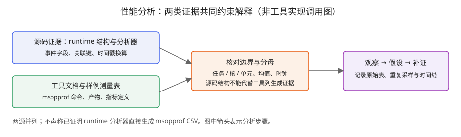

# 第19章 性能分析：口径、工具与案例链

> 第四编开篇。第 16–18 章解决了「怎么写」，本章回答「怎么知道写得好」——**先立口径，再谈优化**。全章无本书实测：数字或仓内引用、或对仓内数字的离线算术（`management/validation/ch19-offline-calc.log`），复现步骤给全但 NPU 前提明示[^pfA][^pfB]。

## 19.1 测量对象与边界：先答「量的是什么」

全书性能表述沿用 ch16 表16-1 的**四层口径**——本章给出操作定义并贯穿使用：

::: warning 性能数字四层（引用任何数字先标层）
**L1 任务级**：Task Duration（含调度/执行/响应，**非完整用户端到端延迟**）——答「任务等多久」；**L2 核上**：aiv/aic\_time——答「核忙多久」（均值）；**L3 分单元**：vec/scalar/mte\_*——答「哪类指令耗时」；**L4 理论**：解析模型（如 T=M×N/(128·f·核数)）——答「理想多快」。**跨层比较必须声明**；跨层差值（L1−L2、L2−L3）只是**待验证的候选解释**——须时间锚点（19.4 OpTime 双对）或分布证据（19.6）才能归因到调度/重叠等机制；**同层跨平台比较须整套换参数**。
:::

性能讨论最常见的失败不是测错，而是**把不同边界的数当同一个数**。本章强制四个分离：

1. **端到端 vs 核上**：`Task Duration` 的官方定义是「Task 整体耗时，**包含调度到加速器的时间、加速器上的执行时间以及响应结束时间**」[^pfC]——它比 `aiv_time`（Task 在 AI Vector Core 上的执行时间）多出调度与收尾。**两者之差不能直接称「纯调度开销」**：Task 级时间是单值，核级是全 Thread Block 平均[^pfD]，聚合口径、均值化、测量边界三者不一致，差值只能表述为「Task 与核均值的总差额」，其分解需时间线证据。
2. **均值 vs 分布**：该样例指标表说明：除 Task Duration 外，表内指标为所有 Thread Block 上的平均[^pfD]。均值掩盖核间方差——48 核里有 47 个 5μs、1 个 50μs，均值依旧漂亮。**尾核诊断必须回时间线**（§19.4），不能靠均值表。
3. **cycle 占比 vs 时间占比**：`ratio` 的分母是 total cycle（「xx 类型指令 cycle 数在 total cycle 数中的占用比」[^pfC]）。对这里定义的单单元活跃周期比例，理想计数范围为0至1，但**多类 ratio 之和可以大于 1**——流水重叠使多类时间落在同一总窗口内。样例 case4：mte2 0.973＋mte3 0.33＋vec 0.05＋scalar 0.011≈1.364>1。**占比高≠该单元是唯一瓶颈，占比和≠1 也不代表测量错**。
4. **两个时钟**：时间值由 `syscnt/频率` 换算（分析器注释原文「syscnt * (1/ghz) = ns」[^pfA]），频率来自**平台查表**（`FREQUENCY_TYPE`，config_manager.h L53-72）——**是配置返回值，不是实验实测的瞬时频率**；AI Core 另有频率表 `AIC_TYPE` 且运行时经 `DrvGeAicFrq(devId)` 向驱动查询（op_analyzer.cpp L85-91）。**syscnt 计数时钟与 AI Core 执行时钟是两套**：前者用于给硬件时间戳定标，后者才是「每 cycle 处理 128 half」类算力推断的分母——混淆两者会让理论耗时差出常数倍。

**频率的具体数值**必须分平台：样例 README 标注 A2 主频 1.85GHz、950 系列 1.65GHz（AIV 核数 48/64）[^pfC]——理论 vector 耗时公式 `T=M×N/(128×f×核数)`（A2 48 核=5.904μs、950 64 核=4.965μs，离线复算一致，见 log）。**任何「理论 vs 实测」比较先声明用哪个频率、哪张表——L4 层的常数错了，后面全错。**

边界不是靠减法猜的——**服务侧数据结构本来就分开记录两对时间戳**：`OpTime{start, startAicore, endAicore, end}`（data_struct.h L40-46），analyzer 聚合时明确区分 `executionTime = endAicore − startAicore`（analyzer_base.cpp L199）并打印 `start/end/startAicore/endAicore` 四元组（L137）。即「调度/收尾」与「核上执行」在采集层就是两个区间，分析时应直接取用，而非 `Task Duration − 均值 aiv_time` 的粗差：后者错在锚点不同：end−start 含响应尾，aiv 是**全 Block 均值**，startAicore/endAicore 的逐核构成本书未展开（无分布数据）——三者口径不一，相减无解释力。读者自检：若把0.973解释为“整个任务97.3%的时间只在搬运”，就同时混淆了周期窗口、单元并行和Task边界；若以297μs核均值推出9μs调度开销，则缺少调度起止与逐核分布证据。理论模型换平台时，应替换公式所需的频率、吞吐及参与核数；UB容量另影响分块和可行性，不直接出现在上述纯Vector算力公式中。

样例 case2 实算：306.58−297.14=9.44μs，只可称「Task 与核均值总差额」，其中多少是调度、多少是尾核不齐，须 timeline 判定[^pfA]。

## 19.2 工具链:三个名字,三件事实

| 名字 | 是什么 | 本书证据 |
|---|---|---|
| **msprof**（框架/服务侧） | runtime 采集框架。仓内可见其**库形态**：`collector/dvvp`＋分析器；对外 API 含 `ProfAicoreMetrics` 九项枚举（ARITHMETIC/PIPE_UTILIZATION/MEMORY_BANDWIDTH/L0B_AND_WIDTH/RESOURCE_CONFLICT_RATIO/MEMORY_UB/L2_CACHE/PIPE_EXECUTE_UTILIZATION/MEMORY_ACCESS）[^pfA] | 源码 |
| **msopprof**（单算子上板） | `msopprof ./demo`，可选 `--aic-metrics=PipeTimeline`；产物 `OPPROF_{ts}_XX/`：`ArithmeticUtilization/L2Cache/Memory/MemoryL0/MemoryUB/OpBasicInfo/PipeUtilization/ResourceConflictRatio.csv＋dump/＋visualize_data.bin`[^pfB] | 工具文档 |
| **msopprof simulator** | 仿真性能分析；**仅支持 SIMD 编程场景，SIMT 不支持**；须配环境变量（如 LD_LIBRARY_PATH）与 `-g` 编译选项；命令 `msopprof simulator --soc-version=Ascendxxxyy ./add_custom`，产物 `OPPROF_{ts}_XXX/simulator/{core*.cubecore0,core*_code_exe.csv,core*_instr_exe.csv,trace.json,visualize_data.bin}`[^pfB] | 工具文档 |

库侧入口的**参数结构**：`ProfConfig{devNums, devIdList[PROF_MAX_DEV_NUM + 1], aicoreMetrics, dataTypeConfig}`（prof_acl_api.h L18-56 真码，`PROF_MAX_DEV_NUM=64`）——`aicoreMetrics` 是单值枚举字段，**该库配置一次指定一个指标集**；这只证明库侧配置形态，**不能推广为 msopprof 各模式「一次只能采一族」**——工具侧行为以《msOpProf 用户指南》为准（仓外文档，本书未研究——就地边界，不设编号）。

**边界声明**：①msOpProf 需 CANN 商用/社区版（安装指南见官方链接，本书未安装未运行）；②**msprof 命令行 CLI 的完整参数不在本仓**——本章所有可执行命令仅 msopprof 两条（上板/仿真）有仓内文档背书；「msprof op」等网传子命令无本地证据，**不覆盖**；③runtime API（`aclprofStart/ProfConfig`）是库接口，与 msprof CLI 是**不同入口**，勿混写。④csv 的**生成器代码不在本仓**——列名语义的权威是样例 README 的字段表，解析实现属工具侧（未证项 U1）。

msopprof 的两条模式对应两种物理现场，**产物结构与可信度不同**，不可混谈：

- **上板模式**：真机编译运行后 `msopprof ./demo`（可加 `--aic-metrics=PipeTimeline`，matmul_gelu 样例同款），当前目录生成 `OPPROF_{timestamp}_XX/`，其下 `dump/` 与各 csv。**csv 由工具侧生成**——本章对列语义的判读均以样例 README 字段表为出处，非工具实现（证据边界见 19.4 末与 U1）。
- **仿真模式**：`msopprof simulator --soc-version=Ascendxxxyy ./add_custom`（performance_tuning.md L206-209 原文；**仅 SIMD，SIMT 不支持**）。前提三件：仿真编译（如 `bisheng --run-mode=sim`，L199-201）、环境变量（如 LD_LIBRARY_PATH）与 `-g` 调试信息（表 1 注）——**soc 版本为占位符，不可直接照抄运行**，先按 §19.5 五要素定架构再替换。产物 `OPPROF_{ts}_XXX/`：`dump/`（原始仿真数据）、`simulator/` 下 `core*_code_exe.csv`（代码行耗时）、`core*_instr_exe.csv`（指令明细）、`trace.json`（Edge/Chrome Trace Viewer/Perfetto 可读，含每核与全核汇总）、`visualize_data.bin`（MindStudio Insight 用）——**与上板模式的 csv 族不同名不同义**。仿真值与真机值的对应关系本书无数据（U5），仿真结果只用于指令流/热点结构分析，性能结论须上板复测。

本章引用 `collector/dvvp` 下的分析器。`analyzer_base.cpp` 可见以taskId和streamId构造关联键、结合ageFlag处理host/device记录的逻辑。它能支持“记录需要关联”的结论，不能独立证明工具CSV导出的完整调用链。时间线对不齐时，应同时核对关联键、事件完整性与时钟换算，不能预先认定只是哪一类原因。[^pfA]

库侧指标选择有一处**平台分岔**：`CHIP_V4_1_0` 平台上 `PipeUtilization` 自动映射 `PipeUtilizationExct`（config_manager.cpp L102-06）——这直接证明指标名的映射，不能独立证明CSV列语义改变；跨平台应重新核对工具字段定义[^pfA]。

采集链与判定规则一图（**msopprof CSV字段以工具文档为证，库内部结构以源码为证；不将两者拼成已证调用链**；待验证候选即 19.1 四问）：



*图19-1：箭头表示分析步骤，不表示工具内部调用关系。*

## 19.3 字段字典：分母与单位速查

以 add 样例字段表为准[^pfC]（SIMT 变体另见 `simd_simt_high_performance/README`，aic\_*/aiv\_* 前缀分核族）：

| 字段 | 单位/分母 | 易错点 |
|---|---|---|
| Task Duration | μs；**含调度+执行+响应** | 减 aiv_time ≠纯调度（19.1①） |
| aiv_time | μs；核上执行 | 全 Block 平均 |
| aiv_vec/scalar_time | μs；指令类耗时 | SIMT 线程计算计入 vec |
| aiv_*_ratio | **无纲；分母 total cycle** | 和可>1（重叠） |
| Memory.csv | **GB/s**，UB/L1/主存带宽 | 是速率观测，非理论峰值分母 |
| L2Cache.csv | 命中率 | 影响 MTE2，调搬运粒度 first |
| ResourceConflictRatio | bank group/conflict 占比 | 对应 case6 优化 |
| PipeUtilization | 计算与搬运单元耗时/占比 | V4_1_0→Exct 变体 |

逐 csv 展开一跳：

- **ArithmeticUtilization**：分 cube 与 vector 两族占比——cube 算子看 cube\_%，vector 看 vec\_%。**占比低有两种病因**：单元空闲（供给不足）或单元在算但效率低（tile 太碎）——csv 本身不区分，须接 timeline。
- **Memory/MemoryUB/MemoryL0**：GB/s 流量与带宽占用。判读铁律：**先问分母是哪个时钟窗口**（mte 活跃窗？全程？）——同流量不同分母差数倍。它回答「搬多快」，不回答「该不该搬」（后者靠结构改造）。
- **L2Cache**：命中率。**本书无本案例该 csv**——「bypass 是否降低命中率」属待测（4→5 验证路径）。方法论提示：命中率是手段指标，端到端才是目的，**勿只优化代理指标**。
- **ResourceConflictRatio**：bank group/conflict 计数。case5→6 地址重排后**该 csv 实值本书没有**——「是否下降」待测。方法论：占比高≠主要瓶颈，需核对计数器分母并做对照实验，不能直接用冲突占比乘单元时间充当可节省耗时。
- **PipeUtilization**：各流水级占用，V4_1_0 转 Exct 变体（19.2 末）。
- **OpBasicInfo**：算子名称、block dim和耗时——核数与切分的对账单，**先核对自己以为的并行度**。

**读表顺序**：先看 Task 与核时间的量级关系→再 ratio 结构（谁主导）→再对应单元 csv 深挖（带宽/命中率/冲突）→最后 timeline 验证。**列间自洽校验**（拿到任何 csv 可先做，用于抓单位/分母错误）：①`time_i ≈ cycle_i/f`——时间列与周期列换算是否闭合？②`ratio_i ≈ cycle_i/total_cycle`——占比与绝对值是否闭合？③各单元时间之和与核时间同量级否（超出则存在重叠或双计，先解释再引用）？④Task−核时间差**逐 case 是否稳定**——稳定则可作调度常数的**候选证据**（仍须时间锚点确认），突变则提示尾核或阶段差异，进 timeline。校验不闭合时，先怀疑自己的分母假设，再谈数据；闭合也只说明自洽，不等于解释正确。

## 19.4 源码中的时间戳:库内可见的原子，及其证据边界

本节选取服务侧（dvvp）的 **hwts 记录**，64B 定长（data_struct.h L129-160）：

- `HwtsProfileType01`：`cntRes0Type`（bit0-2=Type）＋taskId＋streamId＋syscnt——**任务级**；
- `HwtsProfileType2`：另含 coreId＋blockId——**核/块维度**；
- `HwtsProfileType3`：另含 warnStatus（警告类）。

常量 `HWTS_TASK_START_TYPE=0/END=1`（L124-125）。分析器 `analyzer_hwts.cpp` 的用法是**证据**：`ParseOptimizeHwtsData` 只对 type=0/1 的 Type01 记录响应，以 `taskId+streamId` 为键写 `start/end`（L68-98 真码）——即**库内确有「任务级 start/end 对」的构造路径**。但两条边界须分清：①Type01 的 Type 字段（bit0-2）除 0/1 外的取值，analyzer 未响应、仓内未见文档——**本书只引用 0/1 路径，其余不推断**；②**「analyzer 会构造」≠「msopprof 各 csv 列由此生成」**——工具侧导出器不在本仓（U1），csv 列的生成器证据阙如，正文对 csv 的全部判读都挂在样例 README 字段表而非此源码。`OpPMU{start,end,totalCycle,pmus[8]}` 同理：结构在（data_struct.h L57-61），八计数器语义未文档化（U2）。

**hwts 是「任务事件」不是「指令流水」**：Type01 的0/1路径记录任务起止，Type2带有核/块标识，不记录任务内 mte2 与 vec 如何交错——指令级交错来自仿真 `trace.json` 或上板 PipeTimeline 导出，观测粒度不同，混用会得出「时间线上看到 mte2 阻塞 vec」这类超出证据的结论。`TsProfileTimeline` 与 `KeypointOp{startTime,endTime}`（host 侧）分属两表——**同一名「时间」在多类结构里锚点不同**，跨表 join 前先对锚点。

**时间线上认领一个算子靠显式打点**：host 侧 `aclprofRangePushEx`＋`aclprofTensorInfo`（输入输出类型/Format/shape）会使 msopprof 在 `PipeUtilization.csv` 算子记录携带 tensor 信息（torch_library 样例 L63-80 原文 API 名）[^pfF]。时间线三种典型误读，各配判别：

1. **把 host 区间当核区间**：host `KeypointOp` 的 start/end 描述host侧记录区间，不能直接当作设备执行完成区间；device 侧 `startAicore/endAicore` 才是核窗口（区间结构由字段差分证实；**两表对不齐时**先查键 taskId/streamId 与 ageFlag，偏移模式本身不作正误判据——本书无数据支撑特定偏移形态）。
2. **把重叠当并行加速**：timeline 上 mte2 与 vec 区间重叠只说明**时间上共存**，是否有数据依赖阻塞要看事件序（同步原语），重叠≠加速比。

3. **把空窗当浪费**：级间等待在时间线上是空窗，但可能是流水结构必然——**先对照软件结构再判「浪费」**。

四类核心结构一览（锚点/粒度/用途，据 data_struct.h 与 analyzer）[^pfA]：

| 结构 | 层 | 锚点 | 粒度 | 分析用途（本书可证范围） |
|---|---|---|---|---|
| `KeypointOp` | host | startTime/endTime | op 调用 | 派发窗口、host 侧耗时 |
| `OpTime` | dev | start/end＋startAicore/endAicore | op（任务对） | **双锚点区间对照**（19.1①；差额成因仍须验证） |
| `HwtsProfileType01` | dev | syscnt＋taskId/streamId | 任务级 start/end（analyzer L68-98） | 库内任务起止构造路径 |
| `HwtsProfileType2` | dev | 另含 coreId/blockId | 核/块维度事件 | **携带核号——可定位事件属核，不等于能还原每核耗时分布**（聚合逻辑库内仅见 Type01 配对，Type2 无——就地边界） |
| `OpPMU` | dev | pmus[8]+totalCycle | op 计数 | 结构在；与各 csv 列的对应未证（U1/U2） |

**时间轴→软件回对四步**（把图形观察变成可检验命题）：①在轴上量出可疑窗口（起止 ns）；②映射回软件事件——该窗口对应哪段代码/哪对同步（ch16–18 的同步分析在此复用）；③提出机制假设（「mte3 与 mte2 竞争 bank」）；④设计单变量实验验证（关掉竞争源重测）。**图形观察止步于假设**，没有④不成结论。

**没有打点就没有免费午餐**——无显式打点时只能靠 OpBasicInfo 起止差圈定算子边界，灰区如实声明；空窗是否「浪费」永远先对照软件结构（ch16–18 同步分析），图上观察不作结论。

## 19.5 案例链:七个 case 的观测-假设-补证-实验

主案例：add_high_performance——固定 shape **8192×8192，half，2 进 1 出**；源码基线见脚注（asc-devkit `28e7aba2`，原表为NPU测量，实际测量软件版本未给出）；口径＝L1–L3 层仓内引用＋L4 复算（五要素：架构/版本/shape/dtype/口径，§19.8 ①–⑤）。从单核标量到 48 核＋双缓冲＋L2 bypass＋防 bank 冲突的七步[^pfC]。**完整数据表**（Task Duration/aiv\_*/mte\_*，μs）：

| case | 配置 | TaskDur | aiv_time | vec | mte2(ratio) | mte3(ratio) |
|---|---|---|---|---|---|---|
| 0 | 单核标量 | 1239689.1 | 1239688.63 | 0.015 | 5916.341(.005) | 2485.465(.002) |
| 1 | 单核向量 | 6909.6 | 6909.14 | 761.65(.11) | 6208.762(.873) | 2613.205(.378) |
| 2 | 48核小块 | 306.58 | 297.14 | 15.885(.053) | 215.485(.725) | 54.33(.183) |
| 3 | 大块×4 | 268.5 | 261.5 | 12.845 | 184.369(.705) | 57.354(.219) |
| 4 | +双缓冲 | 264.02 | 257.56 | 12.846(.05) | 250.528(**.973**) | 84.988(.33) |
| 5 | +L2 bypass | 187.68 | 185.15 | 12.846(.069) | 175.997(.951) | 160.291(.866) |
| 6 | +防冲突 | **184.52** | 178.49 | 6.954(.039) | 171.611(.961) | 121.442(.68) |

这里按源表原值保留case1的MTE2 time=6208.762μs、ratio=0.873；直接除以aiv_time=6909.14μs约为0.8986，与该ratio不一致。本章没有原始计数和聚合记录，不能自行改表或据此证明某种窗口差异；复现实验应优先核查这项。[^pfC]

**复现工作流**（在源仓的**可写工作副本**中操作，源仓本体只读；样例 README「编译运行」节命令[^pfC]。环境前提：CANN 开发套件已装并 `source ${install_path}/cann/set_env.sh`，架构按真机替换 dav-xxxx。**软件版本声明分两层**：源码/文档快照=SOURCE-BASELINE commit（脚注）；**原性能表实际测量所用 CANN 版本=README 未标，未知**——本书不宣称商用版即测量版本）：

```bash
# [需真机验证] 已安装匹配版本的CANN与工具；以下未在本机NPU运行
# 于副本内样例目录（asc-devkit/examples/01_simd_cpp_api/05_best_practices/
#   00_vector_compute/add_high_performance/）：
mkdir -p build-case6 && cd build-case6            # 每 case 独立目录，免交叉缓存
cmake -DSCENARIO_NUM=6 -DCMAKE_ASC_ARCHITECTURES=dav-2201 ..   # case=0..6 任选，无须按序
make -j
python3 ../scripts/gen_data.py               # 生成输入（仓库 scripts/ 实名）
./demo                                   # 运行编译时指定的 case
python3 ../scripts/verify_result.py output/output.bin output/golden.bin
msopprof ./demo                          # 性能采集（verify 通过之后）
```

注意：①**每 case 独立 build 目录**（上式 `build-caseN`）免交叉缓存；README 仅在切换 RUN_MODE 时要求清 cache（L632 区）——同一目录改 `-D` 的行为本书未验证，不做依赖。②运行模式 `npu/cpu/sim` 由 `-DCMAKE_ASC_RUN_MODE=` 切，**本章表格数字=NPU 挡**。③**先 verify 后采性能**：性能数字只对「verify 通过的实现」有效。

**先学会读这张表本身**：TaskDur 列看趋势——1239689→184.52，源表「端到端相对 case0」列记 **6718.5×**（复算1239689.1/184.52≈6718.45；原表倍数为近似值）；case0→6 的 Task−aiv 差从 0.47μs 增至 6.03μs——**差额随并行度放大是观察，成因（调度？尾核？锚点差异？）待 19.4 双锚点/分布验证**；ratio 与 time 的直接换算**仅在同频率/同聚合/同窗口前提下可行**（19.3 校验①②）；分母窗口不同（如 Task 时长 vs 核周期数）时不可互推。

逐跳按**观测→假设（标注归属）→需补证→实验变量**四栏走——**因果只到 README 解释为止，本编不追加**：

| 跳 | 观测 | README 解释 | 置信 | 需补证 | 实验变量 |
|---|---|---|---|---|---|
| 0→1 | 1239689→6909.6（**99.4%↓**，复算 99.44） | scalar→vec 单元并行 | 高（同核同量对照） | — | 标量/向量实现 |
| 1→2 | →306.58（README 95.5%，复算 95.56%——**源文近似表达，与复算差 0.06 个百分点，成因不推断**） | 48 核并行+均匀切分 | 高；但引入均值问题（19.6） | 核间分布（timeline） | 核数扫描 |
| 2→3 | mte2 215→184μs | 「更大连续块利用带宽」 | **相关性成立；因果未证**——未附带宽测量 | Memory.csv 带宽曲线＋L2 命中率 | 单次搬运粒度 |
| 3→4 | task −4.5μs 而 mte2 ratio .705→**.973**、mte3 57→**85** | 双缓冲读写并行 | 结构性解释成立；**占比挪移非时间等比**——重叠证据须 timeline | `PipeTimeline` 视读 | 缓冲深度 1/2/3 |
| 4→5 | →187.68（**−29%**） | `SetL2CacheHint(CACHE_MODE_DISABLE)`：一次性数据旁路 L2（真码 L365-6） | README 解释；机制合理但**未经 L2 命中率验证** | L2Cache.csv 对比 | bypass 开关 |
| 5→6 | →184.52；**vec 12.85→6.95 减半** | UB bank 冲突消除 | 源文解释；冲突计数待采集 | 该 csv 实值 | 地址布局 |

**case0 深读——L4/L3 落差**：理论 vector 耗时 283.405μs（总表，按 128 half/cycle×1.85GHz），实际 scalar 实现 1233742μs——**实现级落差 4353.3×**（复算 1233742.494/283.405；这是「标量实现耗时/向量理论耗时」的比值，**不称硬件效率**——scalar 路径本就不用 Vector 单元，比值只说明两实现差距量级）。差在哪？scalar 路径每循环只处理 4B（README：单次 scalar 处理 4Byte vs 单次搬运 8192Byte），**每元素一次循环＋一次标量加**，Vector 单元的 128 half/cycle 吞吐完全没用上。L3（scalar 1233742，占 99.5%）与 L4（283）的巨大落差不说明「硬件慢」，只说明**用法让硬件慢**——这正是「先看结构效率，再谈优化」的动机。

**0→1（标量→向量）**是全链唯一「同核同量、单变量」对照：Task 1239689.1→6909.6μs，源表记 **179.4×**（复算一致）；实现内**scalar 指令耗时** 1233742→231.166μs、**vec 指令耗时**升至 761.65μs（占 11%）——单核时**mte2 占 87%接棒成主要耗时项**（观察；「瓶颈」判定须带宽佐证，见 2→3）。它教的是：先看占比结构再定优化方向，scalar→vec 的「常识优化」在数据上表现为瓶颈转移而非单纯提速。

**1→2（上多核）**：Task 6909→306.58（README 95.5%，复算 95.56%，源文近似表达与复算略有差异，原因未确定）。注意两处：①mte2 6208→215μs 非 48 分之 1——每核数据÷48，但带宽没÷48 摊薄，这两点不足以定位扩展性拐点，仍需核数扫描；②297.14 vs 306.58 的 9.44μs 差额进 19.1①的差额分析。

**3→4（双缓冲）**：mte2 ratio .705→**.973**、time 184→250μs、mte3 57→85μs，Task 仅 268.5→264.02。**数据内可说的**：mte2 时间占比结构大变而端到端几乎未动——高占比与低收益并存，正是「ratio ≠ 收益」的实例。**作者候选解释（超出数据，须 timeline/csv 验证）**：mte2 活跃窗与计算重叠增加；mte3 增加的候选机制是读写竞争——两者本章均无 csv 佐证，只能作为待验证假设记录。

**4→5（L2 bypass）**：`SetL2CacheHint(CACHE_MODE_DISABLE)` 仅两行（xGm/yGm，L365-6 真码）。**机制假设（作者）**：数据只读一次，L2 无复用价值，旁路改直取。**验证路径**：L2Cache.csv 命中率与 Memory.csv 流量对比——注意命中率下降＋耗时下降**同时出现也只是与假设一致，非因果充分**（本章无该 csv）；耗时下降亦可能来自其他次级效应，须同条件重测复现。

**5→6（bank 冲突）**：逐列变化——vec 12.846→6.954μs（近**减半**）、mte2 175.997→171.611μs（降 4.4μs）、mte3 160.291→121.442μs（**降 38.8μs**）——**三项耗时全部下降**，Task 187.68→184.52（降 3.2μs）。time 同降而 ratio 是否同向须按列核对（ratio 分母 total cycle 同步变化，本书无 cycle 数据）。机制解读（冲突只拖 vec）须 ResourceConflictRatio.csv 实值，本书没有——就地边界，不设编号。教训：**优化排序看绝对值**——mte3 的降幅（38.8μs）其实大于 vec（5.9μs）。

**为什么呈「链」状**：这是**教程式递增配置**——每跳在前一配置上加一个手段，便于读者归因观察变化；它**不构成因果证明**（无对照、无重复、无 csv 佐证），各 case 也不必按序编译（SCENARIO_NUM 任选，§19.5 复现注①）。阅读方式：把每跳当「一个手段的单次观察」，因果判断走 19.5 表格的置信列与补证实验。

**跨平台对照**（同代码两平台，README 双表）[^pfC]：

| | A2（48核/1.85GHz/UB192K）case6 | 950（64核/1.65GHz/UB256K）case5 |
|---|---|---|
| Task Duration | 184.52μs | 182.04μs |
| dataCopyLen | 16256（防冲突重排后） | 21760（UB/6 容量推算） |
| 理论 vector | 5.904μs | 4.965μs |
| 混合带宽 | 2.3456 TB/s | 2.256 TB/s |

950 全六跳：1228475.435→8924.021→310.489（64 核）→251.684（块 21760）→247.665（双缓冲）→182.04（bypass）μs；读带宽 0.034/0.035/1.184/**1.454**（总表值）TB/s、混合 1.712/2.256 TB/s——**形状与 A2 链同构，数值全线不同**。

950 无 case6——**bank 排列不同，冲突优化不需复用**（README 原文）：优化清单是平台函数，迁移时逐项重估。

**带宽的两种算法——不要混**：README 总表自带口径——未开双缓冲（case0-3）用**读带宽** `BW=D_read/T_mte2`，开双缓冲后（case4-6）读写并行用**混合带宽** `=(2读+1写)/T_mte2`（L519-23 公式原文）。离线复算（`management/validation/ch19-offline-calc.py`，可复跑）：case2 1.2457/case3 1.4560/case4 1.6072/case5 2.2878/case6 2.3463 TB/s。**与源表的对照必须诚实**：case2–4 与总表一致；**case5 复算 2.2878 vs 总表 2.2755、case6 复算 2.3463 vs 2.3456——源文表值与公式复算不一致，原因未确定**（输入取整？分母取列有异？），两组数并存引用，不归一为「舍入」。950 侧总表读带宽 case3=1.454、case2=1.184 直接引用——**950 表无 mte time 列，同公式复算不可行**，不另行推算。若改用 Task Duration 作分母（1.5–2.2TB/s），那是**另一口径的端到端产出率**，与 T_mte2 分母者**分母窗口不同，不可相减或直接对照**；两者也都**不是存储器硬件带宽实测**——实际流量与命中情况要 Memory.csv（本书无）。全部复算见 `management/validation/ch19-offline-calc.log`[^pfH]。

## 19.6 多核:均值之外的三个动作

1. **尾核检测**：均值表看不出 47×5＋1×50 的双峰（均值 5.94，见下算例）。动作：PipeTimeline 按 core 展开看末端；或对 per-block 事件（`HwtsProfileType2` 含 coreId/blockId，data_struct.h L146-153 真码）按核计数——**注意**：Type2 仅证事件可归核，从事件还原「每核耗时分布」还需配对/聚合逻辑（库内仅见 Type01 走 start/end 配对），实现前先验证可行性。
2. **切分策略本身进实验矩阵**：case2 的「行 48 份均匀切＋余数前置」是为了 GM 连续（README 明示），换成 8×6 网格切即成新变量——**切分方式与核数分开扫**。
每个实验落成**四元组**（问题/变量/度量/判据），杜绝「试试看」：

- **E-A 核数扫描**：问题=线性段边界在哪｜变量=核数 1/2/4/…/48（切分式不变）｜度量=Task、核时间、差额｜判据：理想线性下 log(T) 对 log(N) 斜率为 **−1**；实测偏离的方向与幅度**不设单值阈值**——偏离后接 19.3 校验④与差额分解定位主导因素（调度常数/带宽饱和/尾核）。
- **E-B 块尺寸扫描**：问题=case3 收益来源｜变量=单次搬运 4K/8K/16K/32K｜度量=mte2 time+Memory.csv 带宽｜判据=带宽曲线饱和点；**同步记录 L2 命中率**防代理优化。
- **E-C 缓冲深度**：问题=双缓冲收益上限｜变量=depth 1/2/3｜度量=Task+mte2/mte3 ratio 对｜判据（**作者示例，非通用定律**）：相邻深度收益小于实验噪声带（先由重复采样方差定）即止；UB 容量约束先行。

进阶：**核数×块尺寸二维扫描**——两变量独立扫会错过交互项（大块只在多核下有益？），预算允许时做 4×4 网格，记录热力表；交互项显著时，**单变量结论要加「在 X 条件下」限定词**。

三实验共享同一实验组织方式与记录模板（19.7），结果进 ch20 证据链前先过 19.8 检查清单。

扩展性曲线可作**三段式预期模型**（先声明：**本章无核数扫描数据**，以下为实验设计里的预期形状，非既成结论）：①**线性段**——理想下核数加倍耗时减半；②**带宽饱和段**——加核收益递减，瓶颈移向内存系统，出路是降流量（复用/融合）；③**调度/长尾段**——Task−核差额主导，加核收益被差额吃掉。**案例只能旁证片段**：case1→2 是 1→48 核两点（非扫描）；case2→3 未变核数，只说明同核下 mte2 随块尺寸仍可降（不能单独判断存储器是否饱和）。段位判定必须靠 E-A 扫描实测。

**均值陷阱算例**：48 核中 47 核各 5μs、1 核 50μs——均值 (47×5+1×50)/48=**5.94μs**（精确 5.9375），端到端却由最慢核决定 ≥50μs。**判别（候选式）**：Task 内核时间远大于核均值**提示**尾核，确认须 per-core 分布（timeline/HwtsType2 blockId），差额本身不构成证明。**切分方式是独立于核数的变量**：case2 行切为 GM 连续（README 明示），网格切是否改善负载及是否破坏连续访问须结合具体shape和索引判断——两者勿混扫。

3. **平台参数进对照表**：同代码跨 A2（48 核/1.85GHz/UB 192KB）与 950（64 核/1.65GHz/UB 256KB）——README 950 表 `dataCopyLen` 增至 21760（`UBSIZE/6≈42.67KB` 的容量推算，85×512B 对齐）[^pfC]。**块尺寸是平台函数，对照表必须带平台列**——迁移清单：核数/频率/UB 容量/bank 排列四项逐查（950 连 bank 排列都变了，见 19.5）。

## 19.7 可复现性:预热、重复与记录

- **扰动源清单**（逐项控制或声明）：频率漂移（锁频或记录 freq）、L2 残留（预热统一化）、DDR 竞争（独占或声明）、中断与时片（长测多次取中位）、编译缓存首跑（预热一轮再计）。
- **稳定性控制≠验证**：固定频率锁定、空闲机器、任务间隔——这些**提高可复现性**，但**不构成对「无频漂」的证明**；跨时刻对比仍须报告时钟与环境。
- **两个「预热」勿混**：①**软件流水 warm-up/drain**——流水线首尾填充排空，属被测对象结构（pto-isa 注释原文「确保 warm-up 与 drain 不把主循环串行化」[^pfG]）；②**实验预热与重复采样**——测量学手段：正式计时前空转数轮、稳态区多次采样取**中位数**并报样本数与极差。前者是代码结构，后者是测量协议；前者不能替代后者。
- **重复采样**：可从5次试采开始（作者建议），再根据波动增加样本；极差反映已采样范围，不能单独证明收敛；样本数写进记录行（模板见下），无样本数的「稳定」不构成陈述。
- **一次一杠杆**：只动 tiling/核数/流水策略之一（[^pfG] 同款纪律）；每步留前一 case 数据作对照。
- **会话卫生**：一会话一题；采前 `npu-smi` 查看占用（**查询≠独占保证**，独占须集群/环境管理配合并记录）；csv/trace 按日期归档**与记录行互链**；失败采样也归档（负结果价值）。
- **结果记录模板**（每字段可对账，缺项标 NA 不留白）：`日期｜架构与环境（dav-xxxx＋真机型号）｜源码基线（SOURCE-BASELINE commit）｜CANN 版本｜shape/dtype/格式｜完整命令行（含 --aic-metrics）｜Task/aiv/分单元 time+ratio 全列｜csv/trace 附件文件名｜样本数与统计量（中位/极差）｜结论＋置信级`。**「结论置信」三级**：已证（对照实验闭环）／源文解释（注明出处）／猜想（待补证列明变量）。已有实例：ch16 表16-1（平台分岔标注）、ch16 §16.8/ch17（msopprof 用法）、ch17 aiv_mte2 复算、ch18 性能采集清单（未实测声明）——各章性能表即本模板的特例。

## 19.8 出手前检查清单

::: tip 读表/下结论前的十个问题
①这个数的**边界**（Task/核/单元）？②是**均值**还是分布？③ratio 的**分母窗口**？④频率哪个表、锁没锁？⑤和谁比——同平台同版本同 shape？⑥变量只动了一个吗？⑦样本数与统计量？⑧结论属三级置信哪级？⑨补证实验的**变量与判据**写了吗？⑩csv/时间线文件名可回溯吗？
:::

**本书性能数字三级标注**（操作化规范，正文写法示例）：

- **[引用]**：直接抄录仓内数字——「case6 Task 184.52μs[^pfC]」。须带脚注到文件与行区。
- **[复算]**：仓内数字的算术推导——「由 19.5 表数据：case5→6 耗时降 1.68%」。须附算式或 validation 脚本。
- **[实测]**：本书真机测得——本书暂无；ch20 若有，须附完整环境与原始 csv。

**未证项清单**（正文不引用其结论，仅列边界）：U1 csv 生成器实现不在仓，列名权威=样例 README；U2 `OpPMU.pmus[8]` 计数器语义未文档化；U3 950PR/DT 在 `PlatformType` 频率表的对应行未映射（CHIP_V4_1_0=50/800 是哪代待核）；U4 `DrvGeAicFrq` 运行时返回值离线不可知；U5 simulator 与真机的系统性偏差量化无数据。

## 19.9 从本章到 ch20

本章交付的是「**判读系统**」：口径四层、工具三件、链式证伪、记录模板。ch20 的每个优化手法都将引用本章判据来**证明**「优化生效」——没有 19.3 的自洽校验，ch20 的前后对比不成立；没有 19.6 的尾核检测，ch20 的并行优化可能只是均值幻觉。**优化论文的一半篇幅是测量学**，本章即那一半。

## 19.10 与前章的分工

ch16 表16-1 的四层口径、ch17 msopprof 用法与 aiv_mte2 案例、ch18 性能采集清单——本章收编为**通用方法论**；ch20 讨论具体优化手法时，本章工具链是其证据来源。**重复结构不重抄，引用章节号。**本章工具链是 ch20 全部优化手法的证据底座。

## 本章小结

::: tip 一句话总结
**性能分析的全部纪律藏在一个替换里：把「我变快了」换成「哪个数、什么分母、哪个时钟、哪个边界、和谁比」。Task Duration 含调度、核指标是均值、ratio 分母 total cycle 可和>1、频率是查表+驱动两层——每个数字先答这四问。七个 case 的链式对照是可复制的证伪流程：每跳只认README 级解释、补证指名 csv、变量单一。本书无实测，数据包括仓内原表引用与明确标注的离线复算，复现命令与前提已给足。**
:::

## 本章来源与进一步阅读

[^pfA]: msprof 服务侧（均相对源仓根；runtime 基线 commit `681ef7610df13c8128982901142a2c869ddbb53e`，SOURCE-BASELINE 2026-08-22）：枚举 `runtime/src/dfx/msprof/inc/toolchain/prof_acl_api.h`（ProfAicoreMetrics L27-40、PROF_MAX_DEV_NUM L18、ProfConfig L49-56）；频率表 `runtime/src/dfx/msprof/collector/dvvp/common/config/config_manager.h`（FREQUENCY_TYPE L53-72/AIC_TYPE L76-99）及版本分岔 `runtime/src/dfx/msprof/collector/dvvp/common/config/config_manager.cpp`（Exct L102-106）；换算 `runtime/src/dfx/msprof/collector/dvvp/analyze/src/analyzer_base.cpp`（syscnt/频率 L74-85、四元组打印 L137、executionTime L199）；数据结构 `runtime/src/dfx/msprof/collector/dvvp/analyze/inc/data_struct.h`（OpTime L40-46、HwtsType01/2/3 L129-160、OpPMU L57-61）；hwts 解析 `runtime/src/dfx/msprof/collector/dvvp/analyze/src/analyzer_hwts.cpp`（type0/1 处理 L55-98）。
[^pfB]: msopprof 双模式（基线 commit `28e7aba2f62e0940e4240442fa3acb794ae4e4d2`）：上板 `msopprof ./可执行` 与 csv 族（L18-46 区）、仿真 `msopprof simulator --soc-version=Ascendxxxyy ./add_custom` 与 `simulator/` 产物（L199-233）、表 1 功能/前提（L9-14）、SIMD only 说明（L28-31）：`asc-devkit/docs/zh/guide/programming_guide/debug_and_tuning/performance_tuning.md`。
[^pfC]: add_high_performance 样例（基线 commit 同 pfB）：七 case 数据表（L98-461 区、总表 L497-510）、字段表（L60-77）、带宽公式（L519-523）、理论 vector 公式与 A2 1.85GHz/48 核（L507-517）、950 1.65GHz/64 核与 dataCopyLen=21760 推算（L547-567）、编译运行/SCENARIO_NUM/RUN_MODE（L590-632）、SetL2CacheHint（L365-366）：`asc-devkit/examples/01_simd_cpp_api/05_best_practices/00_vector_compute/add_high_performance/README.md`。
[^pfD]: 「除 Task Duration 外均为 Thread Block 平均」：`asc-devkit/examples/05_simd_simt_hybrid/02_best_practices/simd_simt_high_performance/README.md`（指标说明节；aic\_*/aiv\_* 前缀分族同源）。
[^pfE]: 驱动查询频率路径（查询返回值，非实验实测瞬时频率）：`runtime/src/dfx/msprof/collector/dvvp/acp/src/op_analyzer.cpp` L85-91（DrvGeAicFrq 调用与注释）、`runtime/src/dfx/msprof/collector/dvvp/task_handle/src/info_json.cpp` L499 区（GetDeviceOscFrequency）。
[^pfF]: timeline tensor 关联 API（aclprofRangePushEx/aclprofTensorInfo 族）：`asc-devkit/examples/01_simd_cpp_api/01_utilities/04_profiling/torch_library_report_tensor/README.md`（L63-80）；msopprof 调用样例 `asc-devkit/examples/01_simd_cpp_api/01_utilities/04_profiling/msprof/`（README＋msprof.asc）。
[^pfG]: 阶段模型与调优纪律（流水 warm-up/drain 注释、一次一杠杆；基线 commit `dd3cb0fbd5d7c226c001b8a50ab18614aaaa806d`）：`pto-isa/docs/coding/opt_zh.md`。
[^pfH]: 离线算术脚本与输出：`management/validation/ch19-offline-calc.py`（可复跑）＋`ch19-offline-calc.log`（运行输出）。

- **下一站**：第 20 章优化专题——本章的「证伪流程」将在具体优化手法上反复运转。
- **交叉引用**：性能数字四层口径与版本纪律（ch16 表16-1）；msopprof 时间轴核对法（ch16 §16.8/ch17）；Profiling 工具链总览（ch7）。
