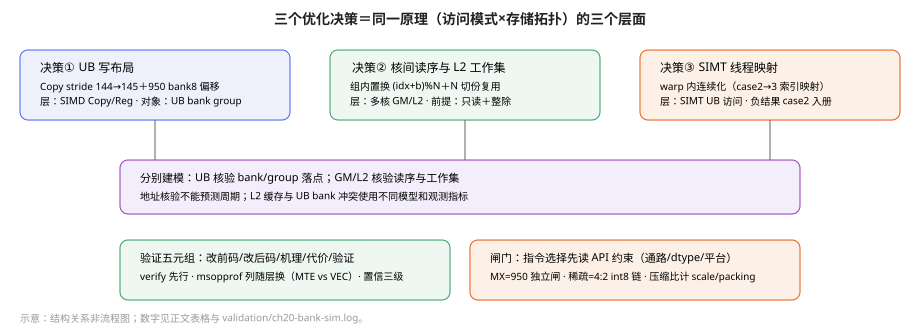

# 第20章 优化决策：三个完整案例与边界闸门

> 第四编收束。ch16–19 给了结构与测量，本章给出**完整的优化决策**——每个决策五元组：改前码／改后码／机理／约束代价／验证。全章无本书实测：源码事实、源文性能、数学推导三类分离标注[^oA][^oB]；置信三级承 19.8（已证／源文／断言）。**范围声明**：本章不重复 ch16（Cube 流水与 tiling）、ch17（融合）、ch18（FA）、ch19（测量学）的任何完整案例；SIMD/SIMT 混编仅 20.5 一个新决策点，模型总论回指 ch11。

## 20.1 决策一：一个参数与两处偏移——UB bank 冲突的完整解

**问题**：8192×8192 half 的 ND→NZ 转换（`bank_conflict_nd2nz` 样例）[^oA]。NZ 布局里 C0=16 half=32B 恰为一个 DataBlock——转写即把 tile 内每行 8 个 C0 块「撒」进 8 个 C0 列槽；Copy 一次 repeat 覆盖 `vecLenHalf=128` 元素＝8 DataBlock 并行落点，「一拍 8 写」由此而来；落点间距=`dstNzC0Stride`（DataBlock 计，API 契约见下）。

**为什么恰好 144**：样例选择 144×128 的 tile，128 对应 8 个 C0 列。未加 padding 时列距等于 tileH=144；144 是 16 与 8 的整数倍，八列落在同一 bank group。加入 padding 后列距为145。对等步长落点，访问的不同组数为 `min(C0Cols, group数/gcd(stride,group数))`；互素且列数不超过组数时，各列才落在不同组。该模型核验地址分布，不预测周期。样例没有解释为何选择 tileH=144。

NZ 写出一拍要把 8 个 32B DataBlock 撒进 8 个 C0 列槽，落点间距由 `dstNzC0Stride` 决定。

**改前**（A2 路径真码，`.asc` L167-171）：

```cpp
// [示意代码] 节录自 bank_conflict_nd2nz.asc L47/L168-177（删常量定义上下文与循环外代码）
static constexpr uint32_t dstNzC0Stride = (SCENARIO == 1) ? tileH : (tileH + 1);  // L47
// ...
AscendC::CopyRepeatParams copyParams;        // L167
copyParams.dstStride = dstNzC0Stride;        // L168  case1 = 144
copyParams.srcStride = 1;
copyParams.dstRepeatSize = 1;
copyParams.srcRepeatSize = tileW / C0_ELEMS;
// 循环内：AscendC::Copy(nzBuf[k*vecLenDbs*dstNzC0Stride*C0_ELEMS], ndBuf[k*vecLenHalf], …)  L173-177
```

**先立拓扑账**（两平台原文参数，冲突判定的全部前提）：

| | A2/A3（dav-2201） | 950PR/DT（dav-3510） |
|---|---|---|
| UB 容量 | 192KB | 256KB |
| bank 数／容量 | 48×（128 行×32B=4KB） | 16×（512 行×32B=16KB） |
| bank group | 16 个×3 bank | 8 个×2 bank（`group=bank%8`） |
| 每拍每 group | 1 读**或** 1 写 | 2 读**或** 1 读 1 写 |
| 编址 | 32B 低位交织 | 同左（`bank i` 与 `i+8` 同组） |
| 本样例切分 | 6 行×8 列=48 block | 8×8=64 block |

冲突三分类（`bank_conflict_ub`/`bank_conflict_3510` README 原文）：读写、写写、读读——本例 ND→NZ 属**写写**（一拍 8 落点）。

**机理（地址算术）**：UB 按 32B DataBlock 低位交织编址，A2 48 bank／16 group——第 k 块落 `bank=k mod 48`、`group=bank mod 16`。stride=144≡0 (mod 16)，八个落点**全部回到 group0**——A2 原文判「单条 copy 从 1 拍拉长为 8 拍」；950 侧原文另给算术：**145=16×9+1，物理 bank 索引每跳 +1**，8 落点连扫 bank8..15（因 nzBuf 起步 bank8）分属 8 组。本书核验（`ch20-bank-sim.{py,log}`：纯地址枚举 idx=0..7、双拓扑、`baseDb` 参数化含 950 bank8 起步）与两原文一致：144→1 种组、145→8 种组。**「拍数」是原文机理陈述；本书只核落点分布，不预测周期。**

**改后不止一个参数**（约束：两平台改动集不同）：

- **A2**：仅 `dstNzC0Stride 144→145`（nzBuf 多申请一行，1152→1160 DataBlock，**单 buffer +256B**）。
- **950**：stride 145 **之外**还有两处——①nzBuf 起始地址再偏 8 DataBlock=256B，从 **bank8 起步**，使 V_LOAD（bank0-7）与 V_STORE（bank8-15）物理 bank 不相交（`.asc` L55-60 注释原文）；②nzPing/nzPong 之间补 8 db padding（1160 非 16 整数倍须手动补齐）。且 950 根本不走 Copy——`__simd_vf__`＋`Reg::StoreAlign`（VEC_STORE 子流水），`#if __NPU_ARCH__ == 2201/3510` 编译期分叉（`.asc` L136-139）。

**950 Reg 路径的观测纪律**：`Reg::LoadAlign→VEC_LOAD`、`Reg::StoreAlign→VEC_STORE`，**都不走 MTE**——样例 ⚠️框原文「常规 MTE 类 bank-conflict 计数器看不到，须看 vec 流水或单指令周期数」。**注意：A2 的 Copy 路径同样是 Vector 计算单元执行的指令（Copy 归 vector 单元，非 MTE）**——「搬入搬出看 mte 列」的直觉只适用 MTE 类搬移；重排计算本身两平台都在 vec 侧。差异在于 950 Reg API 的冲突不体现在 mte\_*计数器（样例 ⚠️框：须看 vec 流水/单指令周期）——**观测点随「搬移 vs 计算」与「Copy vs Reg」两维变化，先辨实现再选列**（承 19.4）。

**源文全列**（测量 CANN 版本未知，仅知支持版本）：

| | Task | aiv_time | vec | mte2 | mte3 |
|---|---|---|---|---|---|
| A2 c1→c2 | 151.42→144.00 | 138.00→131.44 | 47.790→**7.133** | 113.856→115.405 | 76.760→76.532 |
| 950 c1→c2 | 141.691→140.403 | 140.89→139.68 | 45.25→**9.14** | 134.915→135.115 | 104.571→**116.921** |

mte3：A2 微降（76.760→76.532）、950 上升（104.571→**116.921**）——原值如列，机制本书不猜测。

| | case1 vec | case2 vec | 倍数（源文） | Task Δ |
|---|---|---|---|---|
| A2（48 核，Copy 路径） | 47.790μs | 7.133μs | 6.70×（源文） | **151.42−144.00=7.42μs** |
| 950（64 核，Reg 路径） | 45.25μs | 9.14μs | ~4.95×（源文） | **141.691−140.403=1.288μs** |

**逐列读（承 19.3 校验）**：两平台 vec 落差倍数（6.70×/4.95×）不等——实现不同不可互推；**Task 差（A2 7.42μs／950 1.288μs）是两 Task 端点相减的纯算术，因无 timeline 不做任何分摊**——差额归调度/尾核/重叠均属待证。两平台 Task 不可横比（实现、核数 48/64、UB 拓扑全异）。

**约束与代价（按平台分账；两平台均双缓冲 Ping/Pong）**：
- A2：S1=2×(36864+36864)=**147456B**；S2=2×(36864+37120)=**147968B**（+512B=每 nz buffer +256B×2）。
- 950：S2 另含 nz 起始 bank8 偏移与 pong pad 各 256B——2×(36864+37120)+2×256=**148480B**；两值均<256KB（950）/192KB（A2）。
以源码分配表达式为准：`nzBufBaseOffset=2*ndBufBytes+kBank8ShiftBytes`（950 S2 分支）——**256B 是每 nz buffer 一份 padding，950 总账另含两处 256B 偏移**。

**Copy 寻址式（读样例后自推，供核查）**：`Copy(nzBuf[k*vecLenDbs*stride*C0], ndBuf[k*vecLenHalf], vecLenHalf, actualTileH, copyParams)`——第 k 列组起始偏移 `k·vecLenDbs·stride` DataBlock；列内 `dstRepeatSize=1` 行进 1 db、`srcRepeatSize=tileW/C0`（nd 内跨行跳 tileW/C0 db=行宽）——即 NZ(n,z)↔nd 行 z 列组 k 的映射由这四参唯一确定；**stride 进两个位置**：列距（RepeatParams.dstStride）与列组基址（k 项）——**改 stride 两处同变**，漏改基址项即错位。950 Reg 路径同构参数（`StoreAlign`）本书未逐行核对，不作断言。

**正确性边界（数学核验[^oE]，非硬件证明）**：尾块 actualTileH=128（8192=56×144+128，57 个行 tile）；UB 写覆盖需求 `7×stride+H≤alloc`：**整块 H=144 需 1152（stride144）/1159（145）、尾块 H=128 需 1136/1143**，对 alloc 1152/1160 全过（脚本 assert 四组合）；MTE3 回写 `srcStride=dstNzC0Stride−actualTileH`（真码 L148）——**stride145 时非尾块也跳 1 db**，即 UB 内 padding 区不进 GM；GM 末端 `dstBlockOffset` 式末行=56×144+128=8192=totalM 闭合。**风险（按改动分述）**：漏扩 nzBuf 申请→访问最大地址超 alloc 即越界（覆盖式见上）；漏 950 bank8 偏移→物理 bank 分布改变、冲突情况改变（偏移非容量项，不涉越界）；漏 pong pad→容量项，越界与否取决于分配与最大访问地址；漏 MTE3 srcStride 连动→pad 数据污染（非崩溃）——样例把改动绑于 `SCENARIO` 开关，复用须整体搬。

**推广边界**：单 shape（8192²，尾块已核）单 tile（144×128）双平台——换 C0Cols/换 H/换 group 数**须重跑 20.1 式核算**（脚本参数化即为此留）；「bank group 写写冲突」机理对一切 UB 多落点写通用（含 20.5 SIMT），但**解法不通用**（Copy 改 stride／Reg 改映射／GM 改次序各随层）。

**决策叙事**：这个案例的完整价值不在「145 比 144 好」，而在**链路完整性**——一个表观单参数改动，牵动 UB 申请量、950 基址偏移、MTE3 回写跳距、GM 写回地址共同构成完整布局约束；各处漏改后果不同（见上「风险」分述），共同点是 review 对象须为改动的全部投影而非 diff 首行。

**误用警示**：①把本例结论读成「stride 加一总更好」——145 的收益依赖 (group 数，C0Cols) 组合：**C0Cols=8 时仅 8 个落点：A2 落组 0..7 连续（占 16 组中 8 组）、950 占满 8 组；C0Cols=16 时 A2 16 组各 1 次、950 8 组各 2 次**——一般式：**distinct=min(C0Cols, group数/gcd(stride,group数))**（等步长落点模型；互素保证遍历全部组，C0Cols＞该值时仍重复；不预测周期）——脚本可枚举任意 (stride,C0Cols)（`ch20-bank-sim.py` cols 参数），判定先于选型；②在 950 上照抄 A2「只改 stride」——bank8 偏移用于调整物理 bank 分布，缺省可能改变冲突分布（是否重现冲突取决于实际地址）；pong padding 缺省属容量扩张遗漏，**是否越界取决于实际分配与访问最大地址**，须按覆盖式核；③忘记 MTE3 `srcStride` 连动——pad 区被搬出即污染数据。

**验证**：`SCENARIO_NUM=1/2`×`dav-2201/3510` 四组合编译，msopprof PipeUtilization 对比 vec 列（950 另看单指令周期）；正确性 verify 不变；本书未运行。

三决策与公共机理一图（结构关系；数字均见正文表格）：



*图：三类访问模式分别对应 UB bank、GM/L2 工作集和 SIMT 映射；不是一条统一硬件执行流程。*

## 20.2 决策二：访问序重排与 L2 工作集——零改动数据、只改次序

**问题**（`data_copy` 样例优化点 3/4）[^oB]：多核重复搬运同一矩阵——**重复读是实验设计**（测 L2 复用），表载命中 0.005%（A2）为**整个采集窗口的累计统计，无按遍切分数据**——工作集超容量时重复读未获复用（整体现象），先录数据再究因。样例解释：工作集 301.99MB＞L2（A2 192MB／950PR 128MB），整矩阵轮转一圈远超容量，**读到的早已被写替换**——「缓存友好」不是数据小就行，是**工作集×复用距离**双条件。

**改前→改后（真码，`data_copy_ub.h` L104-106）**：

```cpp
// [示意代码] 摘自 data_copy_ub.h process_data_copy()（节录关键 4 行）
for (uint32_t mBlockIdx = 0; mBlockIdx < fullMBlockCount; mBlockIdx++) {
    // M 方向先按 numBlocks 切大块，offsetAddr 为 true 时在每组 numBlocks 个大块内轮转访问顺序
    uint32_t blockGroupStart = (mBlockIdx / numBlocks) * numBlocks;
    uint32_t curMBlockIdx = offsetAddr
        ? blockGroupStart + (mBlockIdx + blockIdx) % numBlocks : mBlockIdx;
    uint32_t mStart = curMBlockIdx * singleCoreM;  // 读序变、覆盖集不变
    … // 内层 mTile/nBlock 循环与 DataCopyPad 不变（data_copy_ub.h 真码节录）
}
```

**这是什么性质的改动**：场景 7/8 是**只读 benchmark**——核函数仅 `srcGlobal.SetGlobalBuffer`＋`DataCopyPad`GM→UB，**无写回 tensor**（ub.h L28/89-112）。因此改动「无数据依赖、无写侧」；**但它仍有工程前提，不等于「正确性不可触碰」**：

1. **地址合法性与覆盖**：置换只是重排读序，每个 `curMBlockIdx` 仍必须落在 `[0,fullMBlockCount)`——组内置换 `blockGroupStart+…` 保证之，**前提 `fullMBlockCount % numBlocks == 0`**（场景实测：A2 6144/128=48=blk、950 8192/128=64=blk✓）；非整倍时组内缺项／越界行为样例未论，用前自行核。
2. **mod 非零**：`%numBlocks` 要求 numBlocks≥1；样例分支语义是**组内轮转**，numBlocks=1 时退化同序——用前确认。
3. **「访问同一输入」是有意设计**（重复读测 L2），不是「核间区间不重叠」的证明——各核读集刻意全同，勿推广为互斥访问模式。

**源文性能**：

| 对比 | A2 | 950 |
|---|---|---|
| 同序→错序 Task（场景 7→8） | 539.42→**328.88μs（−39.05%）**，mte2 474.717→307.380（−35.25%） | 342.29→335.64（**−1.94%**） |

**机制候选（标注：作者级解释，须验证）**：同序时全核同拍请求同一 GM 段→DRAM/L2 切片处排队；错序把请求在时间维摊开。**验证路径**：L2Cache csv miss 曲线＋Perfetto 时序；本书无。机制均未证，仅记录现象。

**误用警示**：①把 −39% 当「错序必赚」——前提三件（整除、只读、组内置换）缺一须重证；②把命中率当 KPI 直接优化——A2/950 公式不同，且命中率是手段；③忽略「重复读」实验前提——真实算子读一遍时 L2 复用结构完全不同。

**同改动跨平台收益差 20 倍**——单点无重复采样，不谈显著性。**L2 侧实据**：整块重复搬命中率 A2 0.005%／950 0.35%，**N 切 4 份后 75.00%／66.64%**，Task 828.06→365.74（A2）／741.58→354.95（950）——**命中率公式两平台不同**（A2=`(r0_hit+r1_hit)/(r0_hit+r1_hit+r0_miss+r1_miss)`；950=`hit/(hit+miss+victim)`，README L303 原文），**跨平台命中率不可直比**；命中率提升≠耗时等比降（分母窗口不同，19.3 校验①）。

**粒度三梯（全表，源文）**：

| 场景 | tile | A2 Task／mte2 | 950 Task／mte2 |
|---|---|---|---|
| 1 小块 [1,64] | blockLen 128B | 564.84／548.161 | 884.06／881.13 |
| 2 中块 [64,64] | ×64 包 | 233.54／220.772（+148.3%表值） | 208.64／205.99（+327.8%表值） |
| 3 大块 [64,1024] | blockLen 2048B | 215.82／202.657（+170.5%表值） | **188.52／185.66（+374.6%表值）** |

（「+%」为源表「相对基线 MTE2 提升」列原值。）理论对照（源文原文级）：A2 按 GM 1.8TB/s≈167.77μs、大块 mte2 202.657 高约 20.8%；**950 按 1.6TB/s≈188.74μs、大块 185.66 与理论基本一致**——源文自注「估算只用于判断量级」，受指令发射/地址连续性/DataCopyPad 等影响，**不拆因**。

**L2 四场景全表**（源文；命中率为表值）：

| 场景 | A2 Task／命中 | 950 Task／命中 |
|---|---|---|
| 整块重复搬（DataCopy） | 828.06／0.005% | 741.58／0.35% |
| N 切 4 份重复 | 365.74／**75.00%** | 354.95／66.64% |
| 整块（ND2NZ 路径） | 899.34／0.006% | 732.809／3.91% |
| 切4（ND2NZ） | 414.96／75.00% | 390.347／71.52% |

**读法**：0.005%→75% 为 **15000 倍（约 4.18 个数量级）**——这是占比变化，**不是速度倍率**，不能由它推耗时比；对应 Task 828.06→365.74（−55.8%，复算）才是耗时事实；ND2NZ 路径 950 基线命中 3.91% 略高——**不解释**，两平台计数器都不同。950 L2=128MB 更小，切份收益同向。

**victim 计数语义**（data_copy 字段表 L79 原文）：「读 Cache 未命中并触发 Cache 中数据被换出的次数」——950 公式 `hit/(hit+miss+victim)` 分母含 victim，**victim 本义是被换出事件，为何入分母属平台计数器定义，本书照录不引申**；A2 公式无 victim 项——两平台分母构成不同，非同一量的两种拼法，不可直比。

**命中率公式实例化**（防跨平台误比，数字入复算脚本）：A2 场景 5：r0_hit=212、r1_hit=217、miss=4718595+4718592——按 A2 公式 (212+217)/(212+217+4718595+4718592)=429/9437616=**0.004545%≈0.0455‰**，与表载 0.005% 同量级（表为舍入展示）；**950 公式含 miss 与 victim 两项**，A2 数字不可套 950 式——公式绑定平台，脚本化先分支。

**同章第三小改——非对齐尾块**：N 12288→12287，尾块 `blockLen` 从 `TILE_N×2B` 变 `curCols×2B`——样例结论「非总数据量增加，而是尾块边界处理拖效率」；粒度扫描（[1,64]→[64,1024]）A2 mte2 548.161→202.657μs。三者合成**搬运三旋钮：粒度、对齐、次序**，验证全走 msopprof＋L2Cache csv；本书未运行。

## 20.3 指令选择——随路、转置与「先读 API 再选型」

矩阵乘的优化常常不是「写更好」而是「选对现有件」——**但「选」的前提是知道每件的适用边界，边界只在 API 文档与真码里**。本章把常用件的真实约束录如下（全部本次回源，**不含任何博客倍数**；博客仅作线索导航，其数字不入选）：

**选型四问**（每件先答）：①通路（哪些 TPosition 间）？②dtype/分形？③平台差异（950 砍了什么）？④与随路/同步的交互？——下表即按此四问组织。**选型依据只能来自 API 文档与样例真码**——本章把常用件的真实约束录如下（全部本次回源，**不含任何博客倍数**）：

- **Fixpipe 随路**：quant/ReLU/NZ→ND 在搬出途中完成——机制链 ch16 已证。决策规则（经验启发非 API 硬前提，**回流的允许性以具体接口文档为准**）：先确认具体 Fixpipe 接口支持的量化、激活与目的位置；需要后续 Vector 运算时，再核对该平台是否支持输出到 UB 以及相应同步。
- **unitflag**：MMAD↔FIXPIPE 512B 粒度流水替代指令级同步（`matmul_basic_api_high_performance/README` L236-238 真码）——同步粒度变细；**对数值结果的影响须对拍验证**，本书无数据。
- **转置/布局随路的真实边界（本次新读）**：`LoadDataWithTranspose` 以 512B 分形搬运＋转置，L1→L0A/L0B；**950 上不支持 L1→L0A，仅 L1→L0B**（API 页「产品支持」节原文）——**A 侧转置在 950 须另寻路径**，这类平台分岔只有读文档才可见。`LoadData（卷积）`＝NC1HWC0 im2col，L1→L0A/B，v1/v2/v2Pro 三版参数各异——**选型前先核通路与 dtype 表（本书未逐 dtype 展开）**。
- **稀疏 Mmad 全链**：见 20.4。

**unitflag 机制（`asc-devkit/docs/zh/api/SIMD-API/basic_api/cube_compute_TensorAPI/mmad_compute_key_features/UnitFlag.md` 原文，适用 Mmad/Copy 接口的 unitFlag 参数）**：L0C 每 **512B 内存块配 1 个标志位**指示可读/可写。基础条件：**写等 0、读等 1**。`unitFlag=2`：写完成**保持 0**（占用，供 K 迭代连续写）；`unitFlag=3`：**写（Mmad）完成置 1、读（Copy/Fixpipe）完成置 0**——生产者消费者握手。**多 K 累加（该页 L19/L50）**：前 kRound−1 次用 =2、最后一次 =3 触发搬出。**搬出量约束（L42 原文「建议…保持一致…可能会导致执行异常」）**：总搬出须覆盖 Mmad 结果——**允许多条 Fixpipe 分块搬完（还须满足各接口的分形、范围与同步约束），仅搬一部分且无后续补搬时有执行异常风险**，可 `SetFixPipeConfig()` 重置 L0C 状态。收益幅度须实测。

**转置/重排选型表**（本次读 API 后的边界，非全量）：

| 需求 | 候选 | 关键约束（原文级） |
|---|---|---|
| B 侧转置入 L0B | `LoadDataWithTranspose` | 512B 分形；**950 仅 L1→L0B**（A 侧不可） |
| A 侧转置（950） | 本接口 950 仅 L1→L0B；**替代路径本书未证**——候选：数据侧预转置（gen_data 分形布局）等，采用前须回源核支持矩阵 | 平台分岔须查表 |
| 卷积 im2col | `LoadData（3D）` v1/v2/v2Pro | NC1HWC0→L0A/B；部分平台 dtype=int8/uint8/half（页内表）；v2 Pro 差异本书未读，不展开 |
| 稀疏 B 载入 | `LoadDataWithSparse` | int8/uint2 索引，见 20.4 |
| MX 低比特 | `LoadData_2D_MX`＋asc_mmad_mx | 950 only |

**误用警示**：①950 上把 LoadDataWithTranspose 用于 A 侧（L1→L0A）——该通路 950 不支持（API 页明示），误用须改道；②把「随路量化」当免费——随路改变中间值驻留位置，链路设计先行；③unitFlag 读写两侧语义（等 0/等 1、2/3 选择）配置不当可能死等或读旧——配对规则逐接口核对、以异常可能对待。

**方法论**：选型收益必须**自测对照**（同 shape 同环境两版对跑）——「换了接口快 30%」类说法在本书一律降为待验证。

## 20.4 量化与稀疏：闸门清单

**低比特不是默认更优，是四道闸门后的选择**[^oD]：

| 闸门 | 内容 | 证据类型 |
|---|---|---|
| G1 架构 | MX 系（MxMatmul）**仅 950PR/DT**（scenario 页 L61 原文「仅…支持」）；A2 须用其他量化实现（本书未统一其调用链，不概括） | 源文 |
| G2 dtype | **MxMatmul 支持全集**：MXFP8=e5m2 **或** e4m3fn、MXFP4=e1m2 **或** e2m1（fp4x2 打包，K 须偶）、scale 均 fp8_e8m0/group32——**比「只有 e4m3」的常见说法宽**；SIMT 另有 hifloat8_t（fp8_type 页）——**三者各论，勿混为 MxMatmul 同一全集** | 源文 |
| G3 数据准备 | scale 由**数据准备侧预生成**（样例 `gen_data.py`），kernel 内不生成；**A/B 与 scale 必须同 K block 节奏进流水**（mxfp4 README L67 原文）——**scale 的搬运路径与流水同步仍需实现者处理**，样例未见「免同步」表述 | 源文 |
| G3.5 精度 | fp8 e4m3/e5m2 见 fp8 页；fp4 e1m2/e2m1 见 SIMT builtin_data_types（仅类型表，**数值范围/精度对拍本书无数据**）——MX 结论不引 | 源文 |
| G4 空间账 | **压缩比须计 scale 与 packing**：对照 fp16 2B——MXFP8≈1+1/32=1.031B（−48.4%）、MXFP4≈0.5+1/32（−73.4%），**假设不含 scaleK 偶数对齐与打包冗余**；scaleK=align_even(⌈K/32⌉)（README L62） | 本书算术＋源文 |

**本书仅锚定已证事实**（不概括通用拓扑）：①scenario 页证明域：**C=(scaleA⊗A)∗(scaleB⊗B)+Bias、每 32 元素共享一 scale、支持矩阵**——仅此；②mxfp4 样例：**host 侧 `gen_data.py` 预生成量化数据与 scale，kernel 随路消费**；**scale 如何搬运、流水如何同步，样例之外须实现者自行处理**，本书无证据描述其同步结构。ch16 量化链是另一独立实例，**不据以推断「传统链固定形态」**。MX 的格式代价即 G2–G4。

**稀疏（4:2 结构化）真链**（`mmad_with_sparse` 样例＋两 API 页，源码与接口文档）：

- 语义先行：**4:2＝每连续 4 值最多 2 非零**（API 原文），不是其他数学格式。
- 分工：**A 全尺寸入（L0A，int8，Zz）计算中经索引稠密化；B 由用户**预先**压缩并生成索引（B1，int8，Zn）**；索引 uint8 装 4×uint2、**字节内逆序**；`LoadDataWithSparse(dst B2, src B1, idx B1)` 把 B 与索引送 L0B，**索引存 Cube 内置 buffer**——执行链四步：host idx(GM)→DataCopy 入 B1→LoadDataWithSparse→`MmadWithSparse(c,a2,b2,{m,n,k,…})`（样例 L67/77-81/109 真码）。
- **索引矩阵格式（fractal details 页＋样例 `scripts/gen_data.py` 真码）**：原始 B(K,N) 稠密化后 B′与**逻辑索引阵**均 (K/2,N)（每元素一 uint2 值）；**打包载荷：每 4 个相邻 uint2 装 1 个 uint8**（`gen_uint2_zn_idx`：`sum(idx<<2k)`），打包后字节量 K·N/8——**逻辑条目与字节载荷分计，勿混**；打包后 nd→nz（dn→zn）分形 16×32；索引值域 {0,1,2}（编码表见该页）。**生成侧样例真码（`gen_data.py: densify_and_generate_index`＋`gen_uint2_zn_idx`）**：4 元素块取前 2 非零位、不足补 0 并记 mask。
- **最小选择例**（按 MmadWithSparse 页编码表）：块 [0,a,0,b]→非零位 {1,3}→index_1=1、index_2=3−1=2（第 2 非零位减 1 编码，样例真码 L「index_2 = nonzero_positions[1] - 1」）；A 侧在计算中按 B′的索引从全尺寸 A 取列——**「A 按索引稠密化」的语义由此例落地**；全表见 API 页。
- **误用警示**：①B 矩阵压缩与索引在 **host 侧脚本生成（gen_data.py）、kernel 只消费**——拿稀疏 kernel 直接套稠密权重会错；②uint2 逆序排布一字不能差（字节内 4×2bit 低位在前的逆序，API 例原文）；③idx 载荷与 B′分形排布一致（小 n 大 Z）——排布错则静默错位。边界：**仅 int8；A2/A3 支持行已核，950 未见于该页**；稀疏度-收益无数据——「收益 2–4×」类说法一律待测。

## 20.5 决策三：SIMT 线程映射——bank 的又一次现身

**本章混编新证据**（`simd_simt_high_performance` FloorMod 四 case，ch11 用的是另一 gather 样例、本例未入前章）[^oC]：先看两端——case0 纯 SIMT 直访 GM 812.063μs最慢（逐元素 GM 访问，无 MTE 批量），case1 纯 SIMD Reg 525.736μs（MTE 批量搬运+矢量算）：**光「换 SIMT 算」不够，数据路径先定型**。中间两 case 才是本章主角：

case2 改 SIMT 算 UB 数据——**但线程映射「每线程一段连续」使 Warp 内相邻线程访问跳跃**，mte2 被拉到 527.987μs、Task 538.098 **反而劣于纯 SIMD**；case3 仅改映射为「同轮相邻线程连续」（`index=threadIdx.x; index+=blockDim.x`），Task **463.179**、vec 301.474——最优。

**四 case 全表**（源文；shape x/y/z=8192² **int32**、平台 950PR/DT、核数 64；**软件版本/CANN 版本未知**，样例仅注支持 950PR/950DT）：

| case | 实现 | Task | vec | mte2 | 备注 |
|---|---|---|---|---|---|
| 0 | SIMT 直访 GM | 812.063 | 785.715(.999) | 0.004 | 无 MTE 参与；逐元素 GM 访问 |
| 1 | 纯 SIMD Reg | 525.736 | 509.987 | 217.341 | MTE 批量搬运基准 |
| 2 | SIMT 算 UB（非连续映射） | 538.098 | 501.605 | **527.987(.991)** | **负结果：劣于 case1** |
| 3 | SIMT 算 UB（连续映射） | **463.179** | 301.474(.668) | 437.055 | 最优；vec −39.90% vs c2（复算） |

**case2 病理**（样例原文级，照录机理）：case2 索引 `index=tid*8+i`（每线程 8 元素）——同轮相邻线程字节距 8×4B=**32B=恰一条 bank 行**，故相邻线程落**不同 bank 行**，一次 32B 行读只服务 1 线程；32 线程连续 int32 访问共 **128B=4 条 32B 行**（非“整个 warp 一行”）。`aiv_mte2_ratio=0.991` 是**活跃 cycle 占比**（mte2 近全程忙碌），非“全等待”；mte2 拉长机理见样例原文，本书照录不另证。case3 真码（样例原文全函数）：

```cpp
// [示意代码] case3 全函数 floor_mod_simt_contiguous（README「关键代码」原文，未删节）
// 等价映射：index=tid+i*blockDim（README 总结「tid+i*1024」形态；case2 为 index=tid*8+i）
__simt_vf__ inline void floor_mod_simt_contiguous(
    __ubuf__ int32_t* x, __ubuf__ int32_t* y, __ubuf__ int32_t* z, uint32_t input_total_length)
{
    for (uint32_t index = threadIdx.x; index < input_total_length; index += blockDim.x) {
        int32_t y_value = y[index];
        const int32_t rem = x[index] % y_value;
        bool signs_differ = ((rem < 0) != (y_value < 0));
        z[index] = (signs_differ && rem != 0) ? rem + y_value : rem;
    }
}
// case2 同构但 index = tid*8+i（elems_per_thread=8）——段内连续、跨线程跳 32B
```

两 case 循环体计算同，差异仅在索引：case2 `index=tid*8+i`（段内连续、跨线程跳 32B）vs case3 `index=tid+i*blockDim`（README 总结形态；函数内写作 `threadIdx.x` 步进 `blockDim.x`）。结果（复算）：Task 538.098→463.179（**−13.92%**）、vec 501.605→301.474（**−39.90%**）、mte2 527.987→437.055——**mte2 未回到 case1 的 217.341**：映射修复作用于计算侧 UB 读；mte2 为何仍高的解释见样例「性能数据分析」节，本书不复述为已证。

**误用警示**：①case2→3 非通用解——前提 MTE 批量搬运已就位（case1 结构），纯 SIMT 直访 GM（case0）无 UB 可言；②连续映射在 950 16-bank 拓扑的定量收益**未核算**（可仿 20.1 脚本，未做）；③case2 的 mte2 527 是**样例原文归因（映射→UB 读放大），本书转录其解释而非独立证明**。

**决策点**：混编不是「SIMD 搬运＋SIMT 算」就赢——**线程到数据的映射决定 UB bank 命中**，与 20.1 的 Copy stride、20.2 的核间次序同构：**三个案例是同一条原理（访问模式×存储拓扑）在三个层面的投影**。case2 的负结果是关键教学点：引入 SIMT 前先问映射。950 拓扑（16 bank 低位交织）下 32 线程 Warp 同拍寻址的 bank 分布可仿 20.1 脚本扩展（未做，留习题）；case0 纯 SIMT 直访 GM 812.063μs 最慢——按样例分析，直接 GM 逐元素访问开销被 UB 中转缓解（其「性能数据分析」节解释，本书转录）。

## 20.6 复现与边界

**命令来源**：cmake/gen_data/demo/verify 各行取自各样例 README「样例执行」节（nd2nz L533-536、data_copy L410-417 区、FloorMod L407-412 区、mmad_with_sparse L73-78 区、mxfp4 L62-67 区）；**目录复制、环境 source、变量初始化与 `&&` 串联为本书整理**，非 README 原文。每块独立可执行（自带 `CANN_SRC` 绝对路径与 `set_env.sh`）；只复制不写源仓。**本书未运行、未编译**——仅 bash `-n` 语法核验（`validation/ch20-r3-bashn.log`）；标签：完整复现链 **[需真机验证]**。

**① 20.1 nd2nz**（编译维＝SCENARIO_NUM×arch；950 见该 README 3510 节同构）[需真机验证]：

```bash
#!/usr/bin/env bash
set -eo pipefail
CANN_SRC=/mnt/SATASSDEXT4/cann
source /usr/local/Ascend/cann/set_env.sh   # 按实际安装路径改
WK=$(mktemp -d)
cp -r "$CANN_SRC/asc-devkit/examples/01_simd_cpp_api/05_best_practices/04_memory_access/bank_conflict_nd2nz" "$WK/"
cd "$WK/bank_conflict_nd2nz"
mkdir -p build && cd build
cmake -DSCENARIO_NUM=1 -DCMAKE_ASC_ARCHITECTURES=dav-2201 .. && make -j   # README L534 原命令；SCENARIO_NUM=2 即 case2
python3 ../scripts/gen_data.py
./demo
python3 ../scripts/verify_result.py output/output.bin output/golden.bin
# 性能：msopprof ./demo（A2 看 vec/mte 列；950 Reg 路径看单指令周期，样例⚠️框）
```

**② 20.2 data_copy**（场景×COPY_DST 组合）[需真机验证]：

```bash
#!/usr/bin/env bash
set -eo pipefail
CANN_SRC=/mnt/SATASSDEXT4/cann
source /usr/local/Ascend/cann/set_env.sh
WK=$(mktemp -d)
cp -r "$CANN_SRC/asc-devkit/examples/01_simd_cpp_api/05_best_practices/04_memory_access/data_copy" "$WK/"
cd "$WK/data_copy"
export SCENARIO_NUM=5 ASC_ARCH=dav-2201 COPY_DST=UB   # 按需换；README L410-417 原变量
mkdir -p build && cd build
cmake -DSCENARIO_NUM=$SCENARIO_NUM -DCOPY_DST=$COPY_DST -DCMAKE_ASC_ARCHITECTURES=$ASC_ARCH .. && make -j
python3 ../scripts/gen_data.py -scenarioNum $SCENARIO_NUM -copyDst $COPY_DST -arch $ASC_ARCH
msopprof --ai-core=on --aic-metrics=L2Cache ./demo   # README L449；命中率按平台公式手算
```

（重复读 benchmark **输出无 golden 对拍**——正确性靠 20.2 地址构造论证，勿虚构验证步。）

**③ 20.5 FloorMod**（SCENARIO_NUM=0..3；仅 dav-3510）[需真机验证]：

```bash
#!/usr/bin/env bash
set -eo pipefail
CANN_SRC=/mnt/SATASSDEXT4/cann
source /usr/local/Ascend/cann/set_env.sh
WK=$(mktemp -d)
cp -r "$CANN_SRC/asc-devkit/examples/05_simd_simt_hybrid/02_best_practices/simd_simt_high_performance" "$WK/"
cd "$WK/simd_simt_high_performance"
export SCENARIO_NUM=3   # 0..3；不赋值会承接 shell 残留——本书显式初始化（非 README 原文）
mkdir -p build && cd build
cmake -DCMAKE_ASC_RUN_MODE=npu -DSCENARIO_NUM=$SCENARIO_NUM -DCMAKE_ASC_ARCHITECTURES=dav-3510 .. && make -j
python3 ../scripts/gen_data.py
./demo
python3 ../scripts/verify_result.py output/output.bin output/golden.bin
```

**④ 20.3/20.4 稀疏** [需真机验证]：

```bash
#!/usr/bin/env bash
set -eo pipefail
CANN_SRC=/mnt/SATASSDEXT4/cann
source /usr/local/Ascend/cann/set_env.sh
WK=$(mktemp -d)
cp -r "$CANN_SRC/asc-devkit/examples/01_simd_cpp_api/03_basic_api/03_matrix_compute/mmad_with_sparse" "$WK/"
cd "$WK/mmad_with_sparse"
mkdir -p build && cd build
cmake .. && make -j   # README L74 原命令（默认 npu）
python3 ../scripts/gen_data.py   # host 侧生成稠密化 B 与索引（见 20.4）
./demo
python3 ../scripts/verify_result.py output/output.bin output/golden.bin
```

**④b 20.4 MX** [需真机验证]：

```bash
#!/usr/bin/env bash
set -eo pipefail
CANN_SRC=/mnt/SATASSDEXT4/cann
source /usr/local/Ascend/cann/set_env.sh
WK=$(mktemp -d)
cp -r "$CANN_SRC/asc-devkit/examples/01_simd_cpp_api/05_best_practices/01_matrix_compute/matmul_mxfp4_basic_api_high_performance" "$WK/"
cd "$WK/matmul_mxfp4_basic_api_high_performance"
mkdir -p build && cd build
cmake .. -DCMAKE_ASC_RUN_MODE=npu -DCMAKE_ASC_ARCHITECTURES=dav-3510 && make -j   # README L62-67 区原命令
python3 ../scripts/gen_data.py   # scale 预生成、K 偶
./demo
python3 ../scripts/verify_result.py ./output/output.bin ./output/golden.bin
```

**边界**：**测量 CANN 版本未知**（样例仅注支持版本）。就地未证：LoadData3D v2Pro 参数、稀疏索引通用生成算法（样例 host 脚本之外）、950 nd2nz Reg 逐指令——细节存 `management/CH20-EVIDENCE.md §八`。数学核验仅 `ch20-bank-sim.{py,log}`（纯地址与算术）。

## 20.7 与全书性能表述的接口

本章所有数字的引用级：源文表格＝**[引用]**（脚注到行区）、Task Δ/百分比＝**[复算]**（本章离线脚本或本文算式）、「拍数/机理比喻」＝**源文解释**非本书实测——三级承 19.8；下章引用本章时先核级。**四层口径**（19.1）继续适用：本章 Task/vec/mte 全 L1–L3，拓扑算术属于解析模型——无越层断言。

## 本章小结

::: tip 一句话总结
**三个决策一个原理：性能=访问模式×存储拓扑。bank group（20.1）、核间次序与 L2 工作集（20.2）、线程映射（20.5）是它在 UB/GM/SIMT 三层的投影；而指令选择（20.3）与量化稀疏（20.4）的第一定律是——先读该平台的 API 约束表，再谈收益。每决策五元组缺一不可，数字必标「源文／复算／断言」。**
:::

## 本章来源与进一步阅读

[^oA]: nd2nz 样例（基线 `28e7aba2`）：`asc-devkit/examples/01_simd_cpp_api/05_best_practices/04_memory_access/bank_conflict_nd2nz/README.md`（A2 表 L205-214、950 表 L371-380/L445-455、拓扑 L123/L299 区、145 机理 L183/L413 区、UB 账 L430-445 区）＋`asc-devkit/examples/01_simd_cpp_api/05_best_practices/04_memory_access/bank_conflict_nd2nz/bank_conflict_nd2nz.asc`（stride L168 区/Copy L167-177/MTE3 L148-150/bank8 偏移 L55-70/#if 分叉 L136-139）；Copy 契约 `asc-devkit/include/basic_api/kernel_struct_data_copy.h` L414-427＋`asc-devkit/docs/zh/api/SIMD-API/basic_api/memory_vector_compute/data_move/Copy_UBToUB_mask_highdim_split.md` L82-90。
[^oB]: data_copy 样例（同基线）：`asc-devkit/examples/01_simd_cpp_api/05_best_practices/04_memory_access/data_copy/README.md`（错序 L336-356、粒度表 L155-175 区、L2 L216-312、命中率公式 L303、非对齐 L179-187）＋`asc-devkit/examples/01_simd_cpp_api/05_best_practices/04_memory_access/data_copy/data_copy_ub.h` L28/89-112；victim 字段释义同 README L66-79 区。
[^oC]: FloorMod 混编（同基线）：`asc-devkit/examples/05_simd_simt_hybrid/02_best_practices/simd_simt_high_performance/README.md`（四 case 表 L118-345 区、case2/3 映射机理与真码；shape/dtype 表 L59-62 区）。
[^oD]: 稀疏/MX/FP8 API：`asc-devkit/docs/zh/api/SIMD-API/basic_api/cube_compute_ISASI/mmad_compute/MmadWithSparse.md`、`asc-devkit/docs/zh/api/SIMD-API/basic_api/cube_compute_ISASI/cube_compute_load/LoadDataWithSparse.md`、样例 `asc-devkit/examples/01_simd_cpp_api/03_basic_api/03_matrix_compute/mmad_with_sparse/mmad_with_sparse.asc`＋`asc-devkit/examples/01_simd_cpp_api/03_basic_api/03_matrix_compute/mmad_with_sparse/scripts/gen_data.py`（densify_and_generate_index/gen_uint2_zn_idx）；`asc-devkit/docs/zh/guide/operator_practice/simd_operator_impl/matrix_advanced_api/feature_scenarios/mx_matmul_scenario.md`（表 1/L61）、`asc-devkit/examples/01_simd_cpp_api/05_best_practices/01_matrix_compute/matmul_mxfp4_basic_api_high_performance/README.md`（L36-67）、`asc-devkit/docs/zh/api/SIMT-API/math_functions/fp8_type/fp8_data_type_intro.md`；`asc-devkit/docs/zh/api/SIMD-API/basic_api/cube_compute_ISASI/cube_compute_load/LoadDataWithTranspose.md`（950 仅 L1→L0B）、`asc-devkit/docs/zh/api/SIMD-API/basic_api/cube_compute_ISASI/cube_compute_load/LoadData_3D.md`（im2col）、`asc-devkit/docs/zh/api/SIMT-API/SIMT_programming_intro/extended_syntax/builtin_data_types.md`（fp4 类型表）、`asc-devkit/docs/zh/api/SIMD-API/basic_api/cube_compute_TensorAPI/mmad_compute_key_features/UnitFlag.md`（512B 标志位）。
[^oE]: 数学核验（本书侧，非源仓）：`management/validation/ch20-bank-sim.py`＋`management/validation/ch20-bank-sim.log`（落点枚举含物理 bank 与 group/baseDb/H∈{144,128} assert/L2 与混编百分比复算）——**纯地址与算术，不证周期**。

- **交叉引用**：同步与流水（ch16 §16.8）、测量纪律（ch19 全章）、SIMD/SIMT 模型（ch11）、RegBase（ch11.5）。
