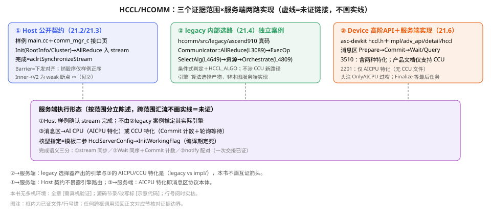

# 第21章 HCCL 集合通信：三层证据边界下的完整链路

> 第五编开篇。分布式的一切从「谁和谁、怎么连、何时完」开始。

## 本章目标与阅读指引

- **实操**：读懂并复现 Host 侧集合通信最小样例（通信域创建→AllReduce→同步→销毁），能说出每个参数的来源与量纲。
- **机制**：分清三个证据范围——**Host 公开契约**（样例＋C 接口文档）、**legacy 内部选路**（hcomm 源码，独立案例）、**Device 侧 HCCL 高阶 API**（asc-devkit，通算融合用）——三者同名算子、不同层，**不得互相证明**（21.3/21.4/21.6 各归各）。
- **边界**：算法选择证到条件（不因目录名断言执行路径）；notify 双向握手只保一次交接；本书无多机环境，全章**未运行**，运行性标签逐块给出。
- **性能姿态**：本章不出现本书实测数据（无硬件）；涉及量纲处（190KB/16M/8M、buffer 容量）一律给源码常量行——判断依据可复算，结论留待读者上机。

## 21.1 问题：多卡协同的最小公共设施

数据并行的一轮训练是「前向→反向→AllReduce 梯度→更新」的循环；模型并行与专家并行还要 AllGather、ReduceScatter、AlltoAll[^oD]。集合通信要解决的从来不只是「把数据搬过去」，而是三件事：**谁在通信里（通信域）、怎么走（算法×链路）、何时算完（同步语义）**。

**名字先分清**：HCCL（Huawei Collective Communication Library）是集合通信库；HCOMM（Huawei Communication）是**HCCL 的通信基础库**，提供通信域与资源管理；**HCCL 通过 dlsym 动态加载 HCOMM 接口，两仓独立编译、独立版本演进**[^oD]。对外分五层：

| 层 | 接口（头文件） | 面向 | 本章处理 |
|---|---|---|---|
| L1 | HCCL 算子 `hccl.h` | AI 框架 | Host 主线（21.3，**算子仓不在本书源码基线，Host 实现不可引**） |
| L2-comm | `hccl_comm.h` 域管理 | 框架适配 | 21.2 |
| L2-res | `hccl_res/hccl_channel/hccl_rank_graph.h` | 算子开发者 | 21.2/21.5 |
| L3-prim | `hcomm_primitives.h` | 算子/通信库开发者 | 21.5/21.7 |
| L3/CCU | `hcomm_res.h`、`ccu/*` | 通信库/CCU 算子 | 21.5、21.7 |

**第三个证据范围**是 Device 侧：Ascend C 提供 `AscendC::Hccl` 高阶 API（`asc-devkit/include/adv_api/hccl/hccl.h`），让**核函数内**下发集合通信任务——它「对标集合通信 C++ 接口」但运行在 AI Core、真正执行靠 AI CPU/CCU 服务端[^oG]。它与 Host C 接口**同名不同物**：Host 版进 stream 队列由 Host 运行时协调；Device 版是消息区协议（AI Core 写、服务端轮询）。全书凡出现 `Hccl` 裸名处，先问哪一层。

::: warning 证据标注约定（本章正文体例）
本章论断三级标注：**源文**＝接口页/开发指导原文、**源码**＝仓内代码（行号可查）、**推演**＝本书手算/推断（就地声明）。来源细化到章末脚注 [^oA]–[^oI]（含完整仓库路径与行号）；正文不出现仓库管理文件引用。
:::




## 21.2 通信域：创建、配置与拓扑

**通信域（communication domain）**是集合通信的上下文：一组 rank＋它们的资源。rank 从 0 编号，通常一 rank 对应一 NPU——**注意这是惯例不是协议**，映射关系由初始化方式决定（见下）。

### 21.2.1 两条创建路径与三种托管

**路径 A：rootInfo＋Config**（点对点扩散）。官方案例 `01_one_device_per_process` 的完整序列[^oA]：

```cpp
// [示意代码] 节录自 hcomm/examples/01_communicators/01_one_device_per_process/main.cc（删 MPI/ACL 错误处理宏与日志）
HcclRootInfo rootInfo;
uint32_t rootRank = 0;
if (devId == rootRank) {
    HCCLCHECK(HcclGetRootInfo(&rootInfo));            // 仅 root 生成
}
MPI_Bcast(&rootInfo, HCCL_ROOT_INFO_BYTES, MPI_CHAR, rootRank, MPI_COMM_WORLD); // 4108B，经用户自选通道分发
MPI_Barrier(MPI_COMM_WORLD);

HcclCommConfig config;
HcclCommConfigInit(&config);                          // 先初始化为缺省
config.hcclBufferSize = 1024;   // 共享缓存区大小，单位 MB，须 >=1，缺省 200（注释原文）
config.hcclDeterministic = 1;   // 归约类确定性计算，0 关/1 开（注释原文）
std::strcpy(config.hcclCommName, "comm_1");
HcclComm hcclComm;
HCCLCHECK(HcclCommInitRootInfoConfig(devCount, &rootInfo, devId, &config, &hcclComm));
```

`HcclCommConfig` 主要字段（类型头[^oC]，按声明序）：`hcclBufferSize`（共享缓存区 MB，须≥1 缺省 200——注释原文）、`hcclDeterministic`（归约类确定性 0/1）、`hcclCommName`、`hcclUdi`、`hcclOpExpansionMode`、`hcclRdmaTrafficClass/hcclRdmaServiceLevel`（RoCE QoS）、`hcclWorldRankID/hcclJobID`（跨域/作业标识）、`aclGraphZeroCopyEnable`。其中 `hcclOpExpansionMode`（0 默认/1 host/2 aicpu/3 aiv，注释原文）是后续算子展开方式的**配置输入**——最终走 Host 展开、AICPU 展开还是 AIV，仍须过 21.4 的能力/条件判定（配置≠裁决）。

**域的暂停/恢复（矩阵如实）**：`HcclCommSuspend/Resume/GetStatus` 服务故障场景的域级悬挂三件套，**三个接口页首部均自注「本接口为预留接口，后续有可能变更，不支持开发者使用」**——这是全接口限制，非某产品特有。产品行差异照录：Suspend 950PR/DT **不支持**（A3/A2 支持）；Resume 950PR/DT 支持；GetStatus 仅 950PR/DT 支持（A3/A2 不支持）。组合起来「悬挂后查询状态」在 A3/A2 上缺 GetStatus、在 950 上缺 Suspend——**工程上不要把它们当可依赖的故障恢复手段向应用开发者推荐**；框架级容错属 PMK/框架层议题，本书不展开。

**路径 B：rank table**[^oB]。`02_one_device_per_process_rank_table` 用 JSON 显式声明 `server_list[].device[]{device_id,device_ip,rank_id}`，调 `HcclCommInitClusterInfoConfig(rankTableFile, devId, &config, &comm)`。**rank↔物理设备的映射在这里是显式数据，不是「rank=i 就 0 号卡」的推定**——单机样例里 `devId=procRank` 只是该样例的选择，跨机/多卡每进程场景读者必须回到 table。

**第三种托管：单进程多线程**。`03_one_device_per_pthread` 在同进程内 `pthread` 每线程绑一设备，各自 `HcclCommInitRootInfoConfig(count, sharedRootInfo, device, …)`（main.cc L78）——**rootInfo 由主线程准备、各线程并发初始化、域对象 per-thread**（L103 各自 Destroy）。三种托管（进程/多进程 rank table/单进程多线程）覆盖了框架接入的三大形态；**「域生命周期≤宿主单元生命周期」在三者中一致**。

**v1/v2 表之别（950 分叉实据）**：样例 02 按soc名选表——`socName.find("Ascend950")==npos ? rank_table.json : rank_table_v2.json`（样例 main.cc L119-121）。v1：`server_list[].device[]{device_id,device_ip,rank_id}`；v2：**扁平 `rank_list[]`＋每 rank `level_list[]{net_layer,net_instance_id,net_type,net_attr,rank_addr_list[{addr_type,addr,ports}]}`**——把 21.2.2 拓扑模型的 Layer/Endpoint 概念直接写进了配置：**v2 是拓扑感知表， layer0 实例与地址端口显式可查**。本样例按产品选择 v2；仅凭字段结构不能证明产品要求的设计原因。

**产品矩阵**[^oE]：`HcclCommInitRootInfo/...Config/ClusterInfo...` 各支持页均列 950PR/DT、A3、A2（910b）、310P、910 五行——**域创建入口全平台覆盖**；引擎与算法层就没这么整齐（21.4）。

**矩阵速览**（域创建入口，逐接口页「产品支持」节）：

| 接口（comm_mgr_c 页「产品支持」节实录） | 950PR/DT | A3 | A2 | 推理 | 训练910 |
|---|---|---|---|---|---|
| HcclCommInitRootInfo／…Config | 支持 | 支持 | 支持 | 支持 | 支持 |
| HcclCommInitClusterInfo／…Config | 支持 | 支持 | 支持 | 支持 | 支持 |
| HcclCommDestroy | 支持 | 支持 | 支持 | 支持 | 支持 |
| HcclCommSuspend | 不支持 | 支持 | 支持 | 不支持 | 不支持 |
| HcclCommResume | 支持 | 支持 | 支持 | 不支持 | 不支持 |
| HcclCommGetStatus | 支持 | 不支持 | 不支持 | 不支持 | 不支持 |

（逐接口页「产品支持」节照录；三件套页首均注「预留…不支持开发者使用」。**本表只覆盖域管理入口，算子/引擎支持须另查各接口页**。）

### 21.2.2 拓扑模型与资源名词：为什么要分层

控制面模型值得整段精读，因为它决定了后文一切「选择」的输入：

- **Node→Endpoint**：Node=通信实体（≈带网口的 NPU）；Endpoint=通信设备，一 Node 可多个（物理端口；Bonding 口对软件透明）——**网卡聚合在模型层就被吸收**。
- **命名对照**：文档明言 Edge↔NCCL Link、Link↔NCCL Path 为**命名对应但非同物**；Channel=Link 实例化后的可用通道（含 Notify 资源），21.5 数据面一一落到代码对象。
- **Edge→Link**：Edge 记「谁连谁」，Link 记「用什么协议建链」（Edge＋两端 Endpoint＋协议）；同一对 Node 可有多条 Link（HCCS 一条、RoCE 一条）。
- **Fabric/TopoInstance**：交换组抽象＋层内拓扑实例（Fullmesh/1DMesh/CLOS/Ring）；文档规定「同层不存在相连的两 Fabric」；这不等于证明整个拓扑无环。
- **netLayer**：质量递减序——server 内 Layer0（HCCS 直连）优于跨 server Layer1（RoCE 过交换机）；**v2 rank table 的 `level_list` 就是它的配置投影**（21.2.1）。

链路建立时序由此而定：Edge（静态连线）→Link（可建链集合）→Channel（实例化可用，含 Notify 资源）。21.4 的 `IsAlgTypeLevel0Mesh` 检查的是 legacy 算法枚举；本节拓扑模型与该枚举的转换链未在本章展开，不能直接等同。

**这些名词的代码落点**（供 21.5/21.7 回查）：域/线程获取走 `HcclThreadAcquire(comm, engine, threadNum, notifyNumPerThread, &thread)`——签名与「申请通信线程资源」示例见数据面页（数据面接口页）；Channel 创建/销毁配置在 `hccl_channel.h`；对称窗口 `hccl_sym_win.h`（ch22 对照）。**控制面名词→数据面句柄**的兑换发生在资源管理器（`hcomm` 仓 `coll_communicator_mgr/resource_mgr`、`base_comm/resources` 目录，本书仅目录级证据），本书取「可见接口层」证据，内部分配细节不展开。

## 21.3 Host 主线：一次 AllReduce 的完整旅程（证据范围①）

本节只依据两样东西：样例 `main.cc`[^oA]与 C 接口页[^oE]。**device 侧头注、legacy 源码均不作为本节论据**。

### 21.3.1 参数与缓冲区（实录）

`Sample()` 里：`count=ctx->devCount`（**=进程数=卡数，非固定 8**）；`mallocSize=count*sizeof(float)`；Device 侧 `aclrtMalloc` send/recv 各一块（`ACL_MEM_MALLOC_HUGE_ONLY`）；Host 侧 `aclrtMallocHost` 两个暂存；输入 `tmpHostBuff[i]=i`。调用：

```cpp
// [示意代码] main.cc L72-74（原文行）
HCCLCHECK(HcclAllReduce(sendBuf, recvBuf, count, HCCL_DATA_TYPE_FP32, HCCL_REDUCE_SUM, ctx->comm, stream));
// 阻塞等待任务流中的集合通信任务执行完成（注释原文）
ACLCHECK(aclrtSynchronizeStream(stream));
```

**返回与错误处理**：调用返回 `HcclResult`；样例以 `HCCLCHECK` 宏打印并退出（main.cc 宏定义区），同步点后可经 `HcclGetCommAsyncError` 查询域内异步错误、`HcclGetErrorString` 转可读串（接口页）。**参数七项**（sendBuf/recvBuf/count/dtype/op/comm/stream）中 dtype×op 合法性由实现校验——Host 侧契约只承诺「返回值＋stream 语义＋错误接口」三件套。

**缓冲量纲复核（推演）**：`mallocSize=count*sizeof(float)`=每 rank 4N 字节；send/recv 两块 Device buffer＋host 侧暂存两个同尺寸——N=8 时各 32B，**输入规模属小数据量级，仅此而已**；样例实际走哪条内部路径属 21.4 独立案例，主机样例不归因（两处 `hcclDeterministic` 取值也不同：样例 config=1 开启确定性，21.4 走查前提为 DISABLE——互不引用）。

**结果是什么**：AllReduce 按元素跨 rank 归约。每 rank 输入 `0,1,…,N−1`、SUM——输出第 j 元素=Σ 各 rank 的 j＝**N·j**。手算 N=2：两卡输入均 `[0,1]`，输出 **`[0,2]`**（不是 `[1,1]`，更不是标量 Σ 或 N(N−1)/2）。**这是本书手算，样例只打印不校验**——读者复现时应自行对拍。

### 21.3.2 异步与完成

`HcclAllReduce` 的语义在 Host 侧是**任务入 stream**：样例注释与紧随的 `aclrtSynchronizeStream` 才是完成点；接口层配套 `HcclGetCommAsyncError`（取域内异步错误）与 `HcclBarrier`（「将指定通信域内所有 rank 的 stream 阻塞，直到所有 rank 都下发执行该操作为止」——注意是**下发**对齐不是执行完成）。**Host 契约到此为止[^oE]**：内部是否走 AICPU、是否复用 CCL buffer，属于 21.4 的实现故事，Host 用户可见的只有返回值、stream 与错误接口。

### 21.3.3 生命周期（唯一有码可依的销毁序）

样例收尾序列：`Sample` 内 `aclrtFree(sendBuf/recvBuf)`、`aclrtFreeHost`、`aclrtDestroyStream` → 主流程 `HcclCommDestroy(hcclComm)` → `aclrtResetDevice` → `aclFinalize` → `MPI_Finalize`。**这是单个样例的顺序事实**，可归纳的观察有二：示例在 `aclrtSynchronizeStream` 确认完成后才释放 buffer（完成后释放前提）；域销毁先于设备重置与 ACL 反初始化。**不可由单样例推广为「API 强制先释放 buffer 再销毁域」**；反向顺序或省略的后果，样例与接口页均无断言——本书不补推测。另一相关接口 `HcclCommSetMemoryRange`：配合 `aclrtReserveMemAddress` 使用，注册后虚拟地址「对当前进程中的所有通信域可见」（零拷贝/对称内存前置，22 章对照）。

**运行性**：本节复现命令（见 21.8 矩阵）**[需真机验证]**——本书未运行。

## 21.4 内部实现案例：算法怎么被选中（证据范围②，legacy）

**先立边界**：从 Host 公开入口到选择器的完整链接**无法在本机证据下画成已证箭头**——`op_base.h` L89 中 `HcclAllReduceV2` 是 weak 声明，910 树内未见其实现（仅 950 树 `src/legacy/ascend950/framework/entrance/op_base/op_base_v2.cc` L1263 有同名函数），HCCL 算子仓亦不在本书源码基线。因此本节是**独立的内部实现案例**：在 hcomm legacy（`src/legacy/ascend910/`，A2&A3 兼容代码，明注「不持续演进」）里，选择**如何发生**[^oF]；不宣称主线样例必经此链。

### 21.4.1 入口观察与已证链（legacy 内部，全部源码行号）

**入口观察**（legacy `op_base_host.cc HcclAllReduceInner` L62 起；**legacy 入口行为，非 Host 契约证据**）：入参校验后遇组窗口只登记——

```cpp
// [示意代码] 按源码改写（删日志；hcclOpInfo 字段名/条件为原文）
if (hcclGroupDepth > 0) {
    struct hcclOpInfo info;
    info.coll=HCCL_CMD_ALLREDUCE; info.sendbuff=…; info.recvbuff=…;
    info.sendCount=count; info.sendType=info.recvType=dataType; info.op=op;
    info.comm=comm; info.stream=stream;
    CHK_RET(taskAppend(comm, info));              // HcclGroupStart/End 窗口内收集，End 统一下发
    return HCCL_SUCCESS;
}
```

**`HcclGroupStart/End` 窗口内集合算子退化为「登记」**——与 NCCL group 同构的批下发实现位。此后同函数内：capture 状态探测、`StateGuard(…INUSE)`＋操作锁、tag 复用（`"AllReduce_"+identifier`）、校验链 `HcomCheckOpParam/HcomCheckReductionOp/HcomCheckReduceDataType(dtype,op,devType)`（**dtype×op 合法性按机型查表**）。L113 `HCCLV2_FUNC_RUN` 内调 `HcclAllReduceV2(…GetCommunicatorV2()…)`——**再往下跨 weak 断点，不画实线**。

**已证链自 Communicator 起**（同仓可查行号；「✂」=weak 断点）：

```text
[op_base_host.cc L62-135] HcclAllReduceInner ─L115 调用→ HcclAllReduceV2   ✂ weak(op_base.h L89)，910 树无实现
                                                              （V2→Communicator 衔接不在本书证据内，断开画）
[hccl_communicator_host.cc] HcclCommunicator::AllReduce(L3089)             ←已证链起点
  ├ aicpuUnfold = AicpuUnfoldConfig ∧ IsSupportSDMAReduce ∧(910_93)∧rankSize>1 (L3094-96)
  ├ totalSize = count × SIZE_TABLE[dtype] → 装入 OpParam                       (L3123-44)
  └ ExecOp(HCCL_CMD_ALLREDUCE, opParam)(L3151) → 同文件 ExecOp(L4578)：
      GetAlgOperator(opType) → AllReduceOperator（hccl_alg.cc L103）
      ① SelectAlg(tag,opParam,limit,…,&newTag)                                 (L4649)
            └→ all_reduce_operator.cc SelectAlg(L108)   ←选择真身
      ② PrepareZeroCopy(algName,…)                                            (L4658 区)
      ③ CalcResRequest(algName,…)×2                                           (L4679/4706)
      ④ PrepareCommInfoToDevice(newTag)                                       (L4719)
      ⑤ Orchestrate(algName, opParam, resMap[newTag])                         (L4809/4831)
```

**次序要点**：`SelectAlg`（L4649）在资源申请（L4679 起）与 `Orchestrate`（L4809 起）**之前**——先定算法名，再按名申请资源、编排执行。

### 21.4.2 两级选择

**第一级·拓扑**（`alg_configurator.cc SelectCurrOpAlgType`，L57-140 区）：`Is310P3Common(isHaveCpuRank,deviceType)` 且用户未配 level0/1（双 DEFAULT）→WHOLE_RING（L100-107，用户配置优先）；`multiSuperPodDiffServerNumMode`＋ARS 类算子（ALLGATHER/REDUCE_SCATTER/ALLREDUCE/ALL，L87-88）＋`isConfigAHC`→AHC（L92-96 组合）；server 内卡数不对称且非 910_93 ARS 场景（`isNoARS`）或超节点非对称无 AHC 配置（`isNoAHC`）→单层 WHOLE_RING（L138-140，「多 server 不同卡模式，设置为单层拓扑类型」注释原文）；nicList 校验逐行（L113-117/162-166 同式两处）：仅当 `!isStandardCard && deviceType!=910B && !isDiffDeviceType` 且 `nicList.size()!=8 && deviceNumPerAggregation==8 && algType0!=ALG_LEVEL0_8P_RING` 三条件同真→`HCCL_ERROR("…algType is not 8P ring")` 返回 `HCCL_E_PARA`——**即「非标卡＋每聚合 8 卡＋选了非 8P 环 level0＋网卡数非 8」才报错**，这是网卡数、聚合卡数与 level0 算法组合的校验，不是「必须 8 网卡」的普遍强制。

**第二级·算子**（`all_reduce_operator.cc SelectAlg`，L108-160）：`userRankSize==1→AllReduceSingleExecutor`；否则按 `deviceType_` 分派 910A/910B/910_93/310P 专用选择器；混布→`SelectAlgforMix`（NHR 或 ring，WARNING 原文「only support … yet」；**混布不支持确定性 STRICT**，`IsNeedStrictMode` 即报 E_NOT_SUPPORT）。**910B 分支的 AIV 判定全式**（L299-341，变量映射已核）：

```cpp
// 判定伪码：按 all_reduce_operator.cc L299-341 改写（∈/≥/…为本书记法，非逐字源码）；
// 变量映射：isMeshTopo（拓扑枚举，本函数声明但 AIV 判定未用）≠ isMesh：
bool isMeshTopo = topoType_∈{NP_MESH,4P_MESH,2P_MESH,1P_MESH};  bool isRingTopo=(topoType_==NP_SINGLE_RING);
bool isMesh = IsAlgTypeLevel0Mesh(algType_.algoLevel0);   // ← isAivMode 实际用此（algType 层0）
u64 dataSize       = count * unitSize;                    // 【总字节】
u64 rankCountSize  = dataSize / deviceNumPerAggregation_; // 【每聚合单元均摊】
isSupportAivRdmaSmallCount = !isSingleMeshAggregation_ && !multiModuleDiffDeviceNumMode_
    && isServNumPowOfTwo && (rankCountSize<=190*1024 || isOnlyAiv); // HCCL_SMALL_COUNT_190_KB，均摊口径
isSupportAivRdmaMidCount   = !isSingleMeshAggregation_ && !multiModuleDiffDeviceNumMode_
    && dataSize<=16*1024*1024;                                       // HCCL_MID_COUNT_16_MB，总量口径
isSupportAivDeter = isSingleMeshAggregation_ && deter==ENABLE && dataSize<=8*1024*1024;
isCCLBufferGE16M  = !isOpbase || (in≥16M && out≥16M);     // CCL buffer 实容量
isBarrierOp       = (syncMode==UNLIMITED_TIMEWAITSYNCMODE);
isAivMode = (GetAivModeConfig() && !isBarrierOp) && IsSupportAIVReduce(dtype,op) && isMesh
         && isCCLBufferGE16M && (isSingleMeshAggregation_ || SmallCount || MidCount)
         && (deter==DISABLE || isSupportAivDeter);
```

读法三条：**①量纲**——190KB 门槛按均摊、16M/8M 按总量，常量定义 `algorithm/pub_inc/common.h` L195-202；**②OR/排除并存**——「单机∨小∨中」是 OR，`!isSingleMeshAggregation∧!multiModuleDiff…` 是排除，压缩成一句「小数据走 AIV」不忠实；**③AIV 白名单**在 `device_capacity.cc IsSupportAIVReduce`（L57-64 原文条件）：数据类型 {FP32,FP16,INT8,INT16,INT32,BFP16} × 归约 {SUM,MAX,MIN}，`checkDataType && checkReduceType`。AIV 之外还有工程化重定向：pipeline 算子 context 数超 `HCCL_FFTS_CAPACITY`→改 HD（图模式不重定向）；确定性 STRICT＋非对称→直接报不支持。

**读 `SelectAlg` 的正确姿势**：它是一个**决策表型函数**——入口先分派（单 rank/混布/310P/910A/910B/910_93），每个分叉内部再条件式；任何「HCCL 在 X 场景用 Y 算法」的断言都必须能落到「某分叉内某布尔式取真」，否则只是经验。本书示范 910B 全式（下），其余分叉同法可查。

**走查一例（判定演示，本书手算；前提全列，缺一即须重判）**：2 server（`isServNumPowOfTwo✓`）×每聚合 8 卡（`deviceNumPerAggregation_=8`）、`isSingleMeshAggregation_=false`（非单机聚合，走 OR 分支）、`multiModuleDiffDeviceNumMode_=false`、**`isOnlyAiv=false`**（若为 true，小数据 OR 经 `rankCountSize<=190KB ∨ isOnlyAiv` 恒可过，走查失效——故必须显式给出）、拓扑层0=mesh（`isMesh✓`）、CCL buffer in/out≥16M（`isCCLBufferGE16M✓`）、FP32 SUM（白名单✓，源码 `device_capacity.cc` L57-64：{FP32,FP16,INT8,INT16,INT32,BFP16}×{SUM,MAX,MIN}）、非 Barrier（`syncMode≠UNLIMITED_TIMEWAITSYNCMODE`）、`GetAivModeConfig()` 开、确定性 DISABLE。数据 1MB：`rankCountSize=1MB/8=128KB≤190KB✓`→SmallCount✓→**isAivMode✓，AIV 小数据跨机**。同数据改 64MB：均摊 8MB＞190KB 且总量 64M＞16M→OR 全败→**AIV 否**，落回 level1 常规（NHD/HD/pipe 由后续分支定）。**换数据量即换引擎——条件式选择的意义；任何前提变动（如 isOnlyAiv、server 数非幂方、Barrier 模式）都须重走全式**。

**algType 三层结构（枚举注释实录：`algorithm/pub_inc/common.h` L48-77）**：Level0=拓扑组合——`ALG_LEVEL0_8P_RING`（注：Ring 节点内 4 固定 stream）、`4P/2P/1P_MESH`、`NP_SINGLE_RING/NP_DOUBLE_RING`、`NP_MESH`（注：服务器内 3~8p rank 组 MESH）、`NP_HD/NP_STAR/PAIRWISE` 等；Level1=`WHOLE_RING/HD/RING/PIPELINE/STAR/NHR/NHR_V1/NB/AHC/AHC_BROKE`；Level2=`WHOLE_RING/HD/RING/NHR/NB/PIPELINE`——**枚举注释只标「拓扑组合 X 层」，本书不从名字推断「机间/机内」语义；AHC 的细分体现在 Level1 的 AHC/AHC_BROKE，Level2 无 AHC 专属项**。名字→执行体经 `HCCL_ALGO_LEVEL1_NAME_MAP`，最终 `newTag=tag+level1名+Executor名（+_no_inline/_device）`——trace 里直接可读。辅助查询 `GetAllReduceScratchSize=count×size×2+reserved`（AllReduceOperator L96-102 区，**临时中转的双倍数据量**）；910A/310P 分支各有专用选择器（本书未逐条展开，条件式结论只从 910B 全式与 Mix 分支得出）。AHC 重定向、pipeline→HD 重定向、STRICT 非对称报错——三处「改主意」都在 SelectAlg 内完成，**选择不是一次性判定而是带修正的流水**。

**用户可覆写**：环境变量 `HCCL_ALGO`（`level0:NA;level1:<algo>` 或按 op 分别指定），`env_config.cc` 解析、非法即初始化报错；域级则走 `HcclSetConfig`。**「凭什么是 ring」的答案因此是条件式**：拓扑对称性、server 数幂方、数据量双口径、buffer 容量、确定性档位、AIV 白名单——任何一条变化都换路径；**目录名（coll_all_reduce_ring…）只是候选池**。

### 21.4.3 平台分叉速查（legacy 视角）

`adapter_hal.h` L40-58[^oF]：`Ascend910B1-4→DEV_TYPE_910B`（A2 系）、`Ascend910_9362-9392→DEV_TYPE_910_93`（A3 系；9392/9382 注明「预留暂不支持」）、`Ascend950PR_958b→DEV_TYPE_950`。两处易错：**「AICPU 展开仅 A3 与 300I」是 `comm_config.cc SetConfigOpExpansionMode` case2 内的分支注释**——它约束的是**展开配置**，不是「HCOMM AICPU 引擎只支持 A3」（数据面原语支持表另见 21.5）；`GetAivModeConfig()`：host 侧实现见 `hccl_communicator_host.cc`（读 config），device 编译单元版恒 false（`hccl_communicator_device.cc` L1300）——AIV 判定以 host 侧为准。

## 21.5 数据面：引擎、协议与原语（证据范围②续）

### 21.5.1 四种通信引擎

architecture 卷给四引擎对照：**AICPU_TS**（AICPU 跑通信 Kernel、下发 Task 描述符给 TS 调度，不占计算核，宜大带宽）；**CPU_TS**（Host CPU 下发，开销大，注「Atlas A2 专用」）；**AIV**（Vector 核直接执行通信算子，低延迟但占计算核，宜小包）；**CCU**（IO Die 硬化单元，微码＋URMA，高带宽低时延，**950PR/DT**）。同一域默认单引擎，由选择器决定——与 21.4 的 `hcclOpExpansionMode`/AIV 条件链衔接[^oD]。**引擎枚举**的权威定义在新标准目录头：`include/hcomm_res_defs.h` L109-114 `COMM_ENGINE_{CPU,CPU_TS,AICPU,AICPU_TS,AIV,CCU}`[^oC]——**读枚举别只数 legacy**。

### 21.5.2 两类语义、一条已证签名

数据面原语二分[^oD]——**选型即二选一**：

| | 网络语义 | 内存语义 |
|---|---|---|
| 核心对象 | Channel（两端 Endpoint+协议+N Notify） | Endpoint＋映射内存 |
| 操作 | Write/Read/Notify（单/双边） | 本地拷贝式读写 |
| 最小参与方 | 单边可只一端动 / 双边两端配合 | 一端 |
| 协议 | RoCE、UB 系 | UB_MEM、HCCS |

**网络语义**（Channel 上 Write/Read/Notify，单边或双边）与**内存语义**（对映射内存直接读写，单边）；前者配 RoCE/UB，后者配 UB_MEM/HCCS。原语真名目录：`communication_operations/`（HcommWrite/Read/ReadReduce/WriteReduce±Notify/Nbi/OnThread、ChannelNotifyRecord/Wait/Fence…）与 `local_operations/`（LocalCopy/LocalReduce/ThreadNotify…）。

**一条原语详解：`HcommWriteOnThread`**[^oH]（数据面页，参数/约束照录）——原型 `int32_t HcommWriteOnThread(ThreadHandle thread, ChannelHandle channel, void *dst, const void *src, uint64_t len)`。参数五项：`thread`=经 `HcclThreadAcquire` 获取的通信线程句柄；`channel`=经 `HcclChannelAcquire` 获取的通道句柄；`dst`/`src`=目的/源内存，**须为 `HcclGetHcclBuffer`/`HcclChannelGetHcclBuffer` 获取的通信内存**（随意传普通 GM/Host 指针不在契约内）；`len`=字节。返回 `int32_t`：0 成功、其他失败。功能节原文「该接口为异步接口」——**返回 0 只算提交成功**；本页未给完成通知语义，完成须显式配 notify 原语或改用带通知变体（见下），**不得拿 P2P 案例的 Read 握手泛证 Write 的完成**。约束：950 上「仅支持通信协议 UB_CTP、UBoE」。

**同族辨析（各页各自契约，不互相推广）**：`HcommWriteWithNotifyOnThread`=写数据**并向对端发同步信号**（功能节原文，异步）——把「通知」并入调用；`HcommWriteNbiOnThread`=功能节原文「**非阻塞接口**」，且 950 约束更窄：仅 Host CPU 调用、建通道须 `engine=COMM_ENGINE_CPU` 且协议 RoCE/UB_CTP，**NBI 读写仅支持 RoCE（需 DPU/1825 网卡）、不支持 UB_CTP**。`HcommChannelFence(OnThread)` 功能节原文：「插入内存屏障操作，确保屏障前的通道读写操作在屏障后的通道读写操作之前完成」——**排序保证**，非完成通知、亦非「屏障等待」。其余原语按同页式样自查——**目录名不是签名**。

**读向对照（逐页原句，方向相反勿混）**：`HcommReadOnThread`——「从 src 中读取长度为 len 的内存数据，并写入 dst。**接口调用方为 dst 所在节点**」（异步）；`HcommWriteOnThread`——「将 src…写入 dst。**接口调用方为 src 所在节点**」（异步）；`HcommReadNbiOnThread`/`HcommWriteNbiOnThread` 同向（Read=dst 端、Write=src 端，均非阻塞）。即**读由数据归宿（dst）端发起、写由数据源头（src）端发起**——方向按接口分立，不存在统一「归宿端发起」规则。**单边≠对端无感**：调用发起端的页并未声明对端可零准备——通道/内存句柄本就在建链时两端协商（21.2），对端资源前提由建链契约覆盖，本文不额外断言。开发指导示例「获取对端通信内存信息→将对端内存读到本端」即 Read 契约的两步展开[^oH]。

**引擎内幕两条**（均）：AICPU_TS 四拍——Host 提交 AICPU Kernel→TS 分发→AICPU 提交通信 Task 描述符→TS 落执行器，「描述符下发」故不占计算核；CCU 则是 Host 下指令序列→Kernel 调度→微码执行＋URMA 搬运，「硬化但受片上资源限、支持域数有限」。**Thread 抽象差异**是四引擎本质：NPU Stream（AICPU_TS/CPU_TS）vs AICore Block（AIV）vs Mission（CCU）——同一「通信线程」词在三引擎里是三种东西，读日志先辨引擎。线程间同步用 ThreadNotify（域内）/ChannelNotify（跨实体），即 21.7 表的原语底层。

缓冲侧两件套：CCL 中转 buffer（`cclBufferManager_.GetIn/OutCCLbuffer`，选择器判容量的对象，21.4）与零拷贝路径（`HcclCommSetMemoryRange`＋`aclrtReserveMemAddress`，21.3.3）（legacy 源码＋C 接口页）。协议名（UBC/UB_RTP/UBoE/RoCE(v2)/HCCS/UB_MEM）**照录**，物理层时序本书不推断。

## 21.6 Device 侧：`AscendC::Hccl` 高阶 API（证据范围③）

通算融合算子需要在核函数内安排「通信→计算」或「计算→通信」[^oG]；Host 往返调度会成为流水断点。Device 侧 API 的机制是**消息区**：AI Core 把通信任务写入约定 GM（消息区），AI CPU/CCU 服务端轮询执行。用法五步[^oG]：

```cpp
// [示意代码] 编排式节录自 asc-devkit docs/zh/api/SIMD-API/adv_api/HCCL_communication/HCCL_Kernel/HCCL_usage.md 示例（变量名原文；SetCcTilingV2 按头文件改写为成员调用）
Hccl<HcclServerType::HCCL_SERVER_TYPE_AICPU> hccl;
// 模板 <serverType, config>：头文件注「Only HCCL_SERVER_TYPE_AICPU supported」；
// A2/910_93 须在调用时指明 AICube 核或 AIVector 核（类注原文）——本示意按 A2/A3+AICPU 形态书写；
// 950/2201 服务端特化见下文 21.6.1（impl 实证）
GM_ADDR contextGM = GetHcclContext<0>();
hccl.InitV2(contextGM, &tilingData);                        // ①初始化（Mc2InitTiling 须为 Tiling 首参）
if (hccl.SetCcTilingV2(offsetof(TilingData, mc2CcTiling)) != HCCL_SUCCESS) return;  // ②任务级 Tiling（头文件 hccl.h L274：__aicore__ inline int32_t SetCcTilingV2(uint64_t offset)，Hccl 成员——文档早例裸调、后例成员调，本书按头文件取成员调用，示意代码系改写）
auto handleId = hccl.AllReduce<false>(aGM, cGM, count, HCCL_DATA_TYPE_FP32,
                                      HCCL_REDUCE_SUM);     // ③Prepare：入队得 handleId
hccl.Commit(handleId);                                      // ④通知服务端执行
// ⑤按编排 Wait(handleId)（阻塞）或计算完后 Commit（免 Wait）
```

**编排两式**（源文原文）：先通信后计算（AllGather+Matmul）——Prepare 后立即 Commit 并 **Wait**，算完再算；先计算后通信（Matmul+AllReduce）——先 Prepare 让组装/下发被计算流水掩盖，计算完再 Commit，**无须 Wait**。**「无须 Wait」只针对该编排**：含义是免「等通知」这一步，**不等于可提前改写/释放任务缓冲**——缓冲复用时机仍以任务完成为准（源文未给更细承诺，本书不下结论）。收尾 `Finalize`：接口页两处原文（机制节与步骤 6）「通知服务端后续无通信任务，执行结束后退出，**客户端检测并等待最后一个通信任务执行结束**」——Finalize 自带末任务等待，不是裸退出。

**repeat/Commit/Wait 契约（逐页原文；作用范围按编排分立）**：机制节 L159——repeat 必须=该 handleId 的 Commit 次数=Wait 次数（非细粒度）；`asc-devkit/docs/zh/api/SIMD-API/adv_api/HCCL_communication/HCCL_Kernel/Commit.md` 约束节同句；`Wait.md` 另加「handleId 调用 Wait 的顺序须和 Prepare 一致」＋「默认在所有核上工作，也可经 GetBlockIdx 指定单核」。**与「免 Wait」编排的关系**：repeat=Wait 次数约束的是**选择了 Wait 的路径**（先通后算，ReduceScatter 实例即此：3 份切分→repeat=3 时 1 个 handleId 配 3 次 Commit＋3 次 Wait，或 3 个 handleId 各 1 次）；先算后通路径不走 Wait，自然不受该计数约束——两规则按编排分立，无冲突。**Finalize 页两条硬约束照录**：①「调用 `Finalize<false>` 前若需保证通信任务完成必须先完成同步；否则客户端直接退出后无法保证数据传输完成」（多队列 BatchWrite 须先 QueueBarrier）；②「`Finalize` 为终止接口，调用后当前 Hccl 对象不可再次用于通信，如需继续须重新创建并 InitV2」。多核收尾：实例两处 `AscendC::SyncAll<true>()` 再 `Finalize()`，注原文「全AIV核同步，防止0核执行过快，提前调用hccl.Finalize()接口，导致其他核Wait卡死」——**这是该实例（多核 AIV、核间 Wait）的做法**；本书不将其推广为普适收尾律。

**与通算融合工程衔接**：Device Hccl 不是孤立的——算子须经原型 `MC2().HcclGroup("group")` 注册通信域、Tiling 结构首参 `Mc2InitTiling`＋每任务 `Mc2CcTiling`（见脚注[^oM]的融合算子实现指导）；辅助接口 `GetHcclContext<0>()` 取上下文、`GetRankId/GetRankDim/GetWindowsIn/OutAddr/QueueBarrier/Iterate` 等见同目录接口页（本书未逐一展开）。这是所引通算融合工程的接入步骤，本章不将它推广为所有集成方式的唯一途径。

### 21.6.1 服务端实现：`__NPU_ARCH__` 特化链（impl 头文件实证）[^oI]

**入口分派**（`asc-devkit/impl/adv_api/detail/hccl/impl/`）：`hccl_impl_def.h` L20-26 按 `__NPU_ARCH__` 包平台层——`2201→hccl_v220_impl.h`、`3510→hccl_v310_impl.h`；`hccl_impl.h` L18-21 再落到：**2201 只包 `platform_v220/hccl_aicpu.h`（仅 AICPU 特化）；3510 包 `platform_v310/hccl_aicpu.h`＋`platform_v310/hccl_ccu_v0.h`（AICPU＋CCU 双特化）**；`hccl_v310_impl.h` 仅并合两 def 头。`Hccl<serverType,config>::AllReduce` 等外层模板（`hccl_impl.h` L24-31 区）只做 DFX 包装后转 `impl_.template AllReduce<commit>(…)`——**真身在特化里**。

**两路特化对照**（3510）：

| | AICPU（`HCCL_SERVER_TYPE_AICPU=0`） | CCU（`HCCL_SERVER_TYPE_CCU=5`） |
|---|---|---|
| 声明 | `common/hccl_aicpu_def.h` L21 | `impl/platform_v310/hccl_ccu_v0_def.h` L38 |
| 公共实现 | `common/hccl_aicpu_impl.h`：AllReduce L327→`CommonPrepareImpl` L250、Wait L416、Commit L457、Finalize L484 | `impl/platform_v310/hccl_ccu_v0.h`：AllReduce L24→`CommonPrepareImpl` L338、Commit L477、Wait L499（校验 `handleCommitCnt_>0`）、Finalize L570 |
| 平台覆写 | `impl/platform_v310/hccl_aicpu.h`：InitV2 L30（context=`OpResCtx`）；`common/hccl_aicpu_impl.h` 的 SendMsgToServer 在3510分支调用 `AssembleHcclMsgV2` | `hccl_ccu_v0.h` InitV2 L200（识别 `INIT_TILING_CCU_NEW_VERSION→newCcuFlag_`）＋`ccu/hccl_ccu_v0_prepare.h`（AlltoAllV 等按 xn 指令组装） |

**2201**：仅 AICPU（`platform_v220/hccl_aicpu.h`；InitV2 L147 context=`HcclCombineOpParam`、读 `queueNum_`——**上下文结构随平台不同**）；**无 CCU 特化文件**，2201 编 `Hccl<HCCL_SERVER_TYPE_CCU>` 无实现可链（错误形态本书不下结论）。**3510 源码包含 AICPU 特化及 V2 消息组装分支**：这只证明该代码路径存在，不证明产品层面允许选用或部署环境可执行——头注「Only HcclServerType::HCCL_SERVER_TYPE_AICPU supported」（`hccl.h` L49）**与 3510 实际双特化不一致，应标头注过窄**（写定时间/针对版本未注）；本快照使用页明确限制 950 仅 CCU，正文按该产品契约选型；AICPU 分支的部署用途未核实，不建议由其存在推导支持范围。

### 21.6.2 「AICube/AIVector 指定」的真机制：模板第二参

`hccl.h` L73-74 note「Specify AICube core or AIVector core before calling」的落点是**编译期模板参数**而非运行期探测：`HcclServerConfig{CoreType::DEFAULT/ON_AIV/ON_AIC, blockId}`（`hccl_common.h` L69-73；缺省 `DEFAULT_CFG={DEFAULT,0}` `hccl.h` L33）传入后，`InitWorkingFlag`（`hccl_aicpu_impl.h` L68-80）计算 `workingFlag_=(g_coreType==AIV/AIC && GetBlockIdx()==config.blockId)`——**核型与工作核号编译期定死**；AIV 版核函数中非工作核直接旁路。这把「哪些核参与 HCCL」变成显式配置，替代任何运行期协商假设。

**Prepare 返回与调试**（以 AllReduce 页为例）：功能定义原文「将通信域内所有节点的同名张量进行 reduce 操作后，再把结果发送到所有节点的输出 buffer」，返回**任务标识 handleId**；产品行：950PR/DT、A3、A2 支持，推理系列 Vector Core 等不支持（逐行见页）。源文调试注原文：「对于 Prepare 接口，在调试时可增加异常值校验和 PRINTF 打印——if (handleId == INVALID_HANDLE_ID) PRINTF(...)」，即失败以 `INVALID_HANDLE_ID` 回显；`GetQueueNum` 可查已入队任务数（接口页）。

**消息区工作核**：AllReduce 头注描述“核0写消息区”；实际 AICPU 特化通过 `InitWorkingFlag` 按 `config.type` 与 `config.blockId` 选定工作核，因此不能把头注推广成所有配置必须核0。默认配置、指定核型与自定义 blockId 应分别核对；工作核选择本身不代替其他核的完成同步。`Query(handleId)` 提供非阻塞探测，与 `Wait` 的阻塞等待区分。[^oI]

**再次划界**：本节 API 与 21.3 Host C 接口**完成机制不同**（消息区+Commit/Wait vs stream 同步），**不得互证**；本节仅依据 Device 实现说明 AI CPU/CCU 服务端分支，不据此判断 Host 样例实际选择的设备侧执行体。

## 21.7 完成语义、自定义算子与精度改造

### 21.7.1 notify：一次交接的完整闭环

自定义通信算子（AICPU 路线）的同步原语是显式 notify。以 P2P Send/Recv 为例，官方开发指导给出控制面（Host 建上下文/资源，句柄下发）＋数据面（Kernel 内任务编排）两段[^oH]，数据面时序：

| 时刻 | 发端 | 收端 | 被保护缓冲 | 何时可动 |
|---|---|---|---|---|
| t0 | `HcommLocalCopyOnThread`：sendBuf→LocalBuffer | `…NotifyWaitOnThread` 等 ACK | 发 LocalBuffer 写入中 | t1 后可读 |
| t1 | `HcommChannelNotifyRecordOnThread`→ACK | 收到 ACK | —— | 收端可发起读 |
| t2 | ——（禁写 LocalBuffer） | `HcommReadOnThread`：远端 SingleRead→recvBuf | 双端相关缓冲 | 读期间稳定 |
| t3 | `…NotifyWaitOnThread` 等 SIGNAL→**t3 后 LocalBuffer 可复用**（指导原文「以便发送端释放或复用」） | `…NotifyRecordOnThread`→SIGNAL | —— | 下一轮可启动 |

**这证明的是所示一次交接**：两对 notify（数据就绪 ACK／读取完成 SIGNAL）把「写→读→复用」钉死。**多轮/环形槽连转的安全性须每轮配对成立，指导未给连轮证明**——正文与代码都不得称「已证无竞态」。Host↔Device 侧另有 `aclrtRecordNotify/WaitAndResetNotify` 与 `HcommAclrtNotify{Wait,Record}OnThread`（Kernel 首尾），指导中用于「下发完成/执行完毕」握手。

### 21.7.2 Kernel 侧原语速览（AICPU 版，非完整词表）

把 21.7.1 的四步放到 Kernel 视角，常用原语按类速览（数据面接口页＋AICPU 开发指导；**非穷尽，语义以各接口页为准**）：**本地** `HcommLocalCopyOnThread`（数据进 LocalBuffer）、`HcommLocalReduceOnThread`（本地归约）；**网络** `HcommWrite/ReadOnThread`（异步；Nbi 变体为非阻塞接口，950 仅 Host CPU＋RoCE，见 21.5 辨析）、`ReadReduce/WriteReduce(WithNotify)OnThread`（边搬边归；WithNotify=完成随通知）；**同步** `HcommChannelNotify{Record,Wait}OnThread`（跨实体）、`HcommThreadNotify{Record,Wait}OnThread`（域内线程）、`HcommChannelFence(OnThread)`（内存屏障：屏障前通道读写先于其后完成，排序保证非等待）、`HcommSetNotifyWaitTimeOut/ThreadResAcquireTimeOut`（超时治理）；**Host 桥** `HcommAclrtNotify{Wait,Record}OnThread`（Kernel 首尾与 Host 握手）。**OnThread 后缀=绑定申请到的 Thread 执行**——资源先 `HcclThreadAcquire`，调用绑线程，这就是「Thread 抽象」落到用户代码的形态。Nbi/WithNotify 差异契约见 21.5 辨析；本书未逐页展开全部变体。

### 21.7.3 自定义算子工程与「高精度 ReduceScatter」的真边界

工程路径：hcomm 提供自定义算子编译打包（`build.sh --vendor=cust --ops=p2p --custom_ops_path=<工程>`），参考实现为其上游仓 `examples/04_custom_ops_p2p`——**该目录不在本书源码基线（仓外资源），本书未核其全码**；可核部分是八篇开发指导（define_op_if/query_topo/algo_select/create_res/task_sched/op_dispatch/build_deploy）与上述 API 页。

**两条 dev guide 的分叉**：AICPU 路线（Thread=NPU Stream，Host 下 Kernel、AICPU 内再排 Task）与 AIV 路线（Thread=AICore Block，通信算子即 Vector 核函数）目录结构同名八篇但内容分立；**工程侧**：AICPU 版经「自定义算子编译打包工程」（`--vendor=cust --ops=<name>`）产出 tar 子包，加载时驱动默认安全验签；**用户自编 AI CPU 算子包不含签名头，须按 `aicpu_quick_start.md`「关闭AI CPU算子验签功能」节（npu-smi set custom-op-secverify-* 两命令）手工关闭方可加载**——该限定只针对自编包场景，与 21.8 脚注③同一口径。资源复用语义（博客原文级）：`HcclSendCustom/HcclRecvCustom` 多次调用复用首次建立的 ctx（`HcclEngineCtxGet` 检查），资源 **Per-Device**——收发两端各自建立端点，句柄经 `aclrtMemcpy` 下发。

**精度案例必须拆成两个独立实现**：①**AIV 化二开**（学习案例）：ReduceScatter 原四步（入 CCL buffer→对端拷→**MTE3 归约**→拷出）在 BF16 场景的精度改造=计算前后插 Cast（FP32 计算）→进一步把 `Cast+Add+Cast` 挪进 AIV 并按核数切分并行——博客定性「性能几乎不变、精度提升」，**无公开数据表**；②**CCU `LocalReduce` 升精度**：接口层支持「同精度」或「SUM 下低精度→高精度（如 INT8→FP32，4×膨胀，MS 数组须按膨胀比例预留，预留不足硬件读写越界、行为未定义——页原文）」。**dtype 白名单照录**：参数表仅 6 种 `UINT8/INT16/INT32/FP16/FP32/BFP16`（重载 1/2 两处同）；而调用示例场景 2 用 **INT8**→FP32——**首项 UINT8 的表与 INT8 的例并存，属源文内部不一致**，本书照录两处、不下支持结论。两者引擎（AIV vs CCU）、层级（算子改造 vs 原语参数）不同，**不可拼成「HCCL 自带高精度 RS」**。

## 21.8 复现矩阵、维测入口与小结

**复现**（全部 **[需真机验证]**；本书未运行。以下命令链为**本书整理**——封装、变量与前置检查为本章补齐，取值依据见注释；不冒称源文原文）：

```bash
#!/usr/bin/env bash
# 本书整理；本书无多机环境，此脚本未执行（仅 bash -n 语法核验）。
set -e   # 不加 -u：厂商 set_env.sh 可能引用未定义变量
# ①域+AllReduce 主线（样例 01；流程依其 README「编译执行」节，环境检查对应 Makefile L1-10 强制项）
CANN_SRC=/mnt/SATASSDEXT4/cann            # 本书源码基线根目录（只读，故先复制到临时目录）
source /usr/local/Ascend/cann/set_env.sh  # ←CANN 环境初始化，路径按部署改；提供 ASCEND_HOME_PATH 等
export MPI_HOME="${MPI_HOME:-/usr/local/mpich}"  # MPI 前缀，按部署改（Makefile 强制检查项）
N=8
# ↑ 01 README：RANK_SIZE 950 系产品=2、其他示例=8；实际还须 ≤ 可用 NPU 数，按环境改
test -n "${ASCEND_HOME_PATH:-}" || { echo "set_env.sh 未提供 ASCEND_HOME_PATH，请核对安装路径"; exit 1; }
test -n "${MPI_HOME:-}"         || { echo "请 export MPI_HOME=<mpi 前缀>"; exit 1; }
WK=$(mktemp -d)                            # 临时副本：源仓保持只读
cp -r "$CANN_SRC/hcomm/examples/01_communicators/01_one_device_per_process" "$WK/"
cd "$WK/01_one_device_per_process"
make && make test N="$N"                   # test 目标=mpirun -n $(N)（Makefile L52 区）；LD_LIBRARY_PATH 由目标内自加 MPI lib
# ②rank table 路线：同构替换为 02_one_device_per_process_rank_table 目录；
#   表文件按 socName 分叉（main.cc L119-121）：非 950→rank_table.json，950→rank_table_v2.json
# ③验签（条件式，源文限定）：仅当加载自编 tar 包（--vendor=cust 产物）时，
#   按对应 build 文档「关闭验签」节操作；直接用已安装 CANN 环境运行本样例，README 未要求关验签。
```

**数据工作目录**：样例无落盘数据（输入代码内构造），verify 为打印比对——**无 golden 文件**，正确性靠 21.3 手算对拍。第三托管样例（`03_one_device_per_pthread`）同 Makefile 骨架、`pthread` 换进程；其支持面 950/A3/A2（该样例 README 环境要求节）——**三个样例分别展示 root info 多进程、rank table 多进程和多线程组织方式，复现时按目标框架形态选**。

**维测入口**：算法可见性——21.4 的 tag 拼装（`AllReduce_<id>+level1+Executor+_no_inline/_device`）进日志/trace 即可读出「选择了什么」；`HCCL_ALGO` debug 打印（`GetDebugConfig()&HCCL_ALGO` 时逐 rank 输出参数）。错误面——`HcclResult` 枚举＋`HcclGetErrorString` 可读化、域级 `HcclGetCommAsyncError`、状态回调 `HcclCommRegCommStateCallback`/`HcclCommGetStatus`（悬挂恢复三件套的矩阵差异与「预留」注见 21.2，不作应用层故障恢复建议）；数据面任务图 dump（`_dump_node_*` 文档）；北极星仿真工具（hccl_vm）见上游仓（本书未核）。

**错误处理路径（三层各自表述）**：Host=返回 `HcclResult`＋`HCCLCHECK`＋同步点后 `HcclGetCommAsyncError`；Device Prepare=返回值校验（`INVALID_HANDLE_ID` 即失败，源文调试注）＋`PRINTF`；数据面原语=返回 `int32_t` 0/非 0＋notify 超时接口（`HcommSetNotifyWaitTimeOut` 等，页名即契约）。**排障纪律**：各层错误走各层接口检查（Host 同步点后查 `HcclGetCommAsyncError`、Device 查 Prepare 返回、数据面查返回值＋超时）；**错误是否跨层传播、如何传播，本章无证据，不下断言**——跨层排障先分层逐查。

**平台速查**（全书引用口径）：域创建五平台全支持；**引擎**CPU_TS=A2 专用、CCU=950PR/DT、AIV=条件式（21.4 全式）、AICPU_TS=主力宽面；**Device API**服务端 950 仅 CCU、A3 有安全注；**legacy=兼容层不演进**，新特性查标准目录。

::: tip 一句话总结
**通信=域（谁）→选择（条件，非目录名）→引擎×协议（怎么走）→notify 闭环（何时完）。三层证据各归各：Host 契约看样例与接口页，选择看 legacy 条件式，Device 编排看消息区协议——同名 API 不互证。**
:::

## 陷阱与注意（汇总）

1. **层混**：`AscendC::Hccl`（Device）头注≠Host 契约；`HcclAllReduceInner`（内部入口）≠公开 `HcclAllReduce`；`HcclSelectAlg`（信息模式）≠执行路径选择。
2. **变量混**：`isMeshTopo`（topoType_ 枚举）≠`isMesh=IsAlgTypeLevel0Mesh(algType_.algoLevel0)`——AIV 判定用后者。
3. **量纲混**：190KB 按每聚合单元均摊、16M/8M 按总字节；CCL buffer 容量是第三把尺。
4. **结果误记**：AllReduce 输出按元素 N·j（N=2→[0,2]），不是标量。
5. **完成误判**：Host 入队≠完成（stream 同步）；Device `Wait` 须与 `Prepare` 同序；notify 一轮一对。
6. **支持矩阵误推**：「AICPU 展开仅 A3/300I」是配置分支；引擎/原语支持逐接口页核；Suspend/Resume/GetStatus 三件套页首均注「预留…不支持开发者使用」且矩阵互缺（21.2）；LocalReduce 6 dtype 表（首项 UINT8）与 INT8 例并存未定。
7. **销毁序**：仅单样例顺序可依（同步完成后才释放 buffer），不得推广为 API 强制；反序后果无文档断言。

## 本章来源（每个被引文件独立完整路径；行号为阅时实核）

[^oA]: `hcomm/examples/01_communicators/01_one_device_per_process/main.cc`（域创建 L110-132 区、AllReduce+同步 L72-74、释放/销毁 L88-96 与 L140-147 区、HCCLCHECK 宏）；`hcomm/examples/01_communicators/01_one_device_per_process/Makefile`（L1-10 ASCEND_HOME_PATH/MPI_HOME 强制检查、LIBS `-lhccl -lascendcl -lmpi`、`test:` 目标 `mpirun -n $(N)`）；`hcomm/examples/01_communicators/01_one_device_per_process/README.md`（环境变量、RANK_SIZE 950 系 2 其他 8）。
[^oB]: `hcomm/examples/01_communicators/02_one_device_per_process_rank_table/main.cc`（L119-121 socName 分叉、L130 `HcclCommInitClusterInfoConfig`）；`hcomm/examples/01_communicators/02_one_device_per_process_rank_table/rank_table.json`（v1 字段）；`hcomm/examples/01_communicators/02_one_device_per_process_rank_table/rank_table_v2.json`（v2 `rank_list[].level_list[]`）；`hcomm/examples/01_communicators/03_one_device_per_pthread/main.cc`（L78 线程内 Init、L103 Destroy）；`hcomm/examples/01_communicators/03_one_device_per_pthread/README.md`（支持面）。
[^oC]: `hcomm/include/hccl/hccl_types.h`（`HcclCommConfig` 主要字段、`HCCL_ROOT_INFO_BYTES`、`HcclDataType`/`HcclReduceOp`）；`hcomm/include/hccl/hccl_comm.h`（Init 簇 weak 声明）；`hcomm/include/hcomm_res_defs.h` L109-114（`COMM_ENGINE`）。
[^oD]: `hcomm/docs/zh/architecture/architecture-brief.md`（§1.2 能力/约束、四引擎、L128 同域单引擎句、§2.2 拓扑名词与 NCCL 命名对照）；`hcomm/docs/zh/api_ref/hcomm_header_and_lib.md`（dlsym 解耦、头文件→so 表）。
[^oE]: 域管理接口页（`hcomm/docs/zh/api_ref/comm_mgr_c/` 下，均含「产品支持」节；Suspend/Resume/GetStatus 另有「预留接口」首注）：`hcomm/docs/zh/api_ref/comm_mgr_c/HcclCommInitRootInfo.md`、`hcomm/docs/zh/api_ref/comm_mgr_c/HcclCommInitRootInfoConfig.md`、`hcomm/docs/zh/api_ref/comm_mgr_c/HcclCommInitClusterInfo.md`、`hcomm/docs/zh/api_ref/comm_mgr_c/HcclCommInitClusterInfoConfig.md`、`hcomm/docs/zh/api_ref/comm_mgr_c/HcclCommDestroy.md`、`hcomm/docs/zh/api_ref/comm_mgr_c/HcclCommSuspend.md`、`hcomm/docs/zh/api_ref/comm_mgr_c/HcclCommResume.md`、`hcomm/docs/zh/api_ref/comm_mgr_c/HcclCommGetStatus.md`、`hcomm/docs/zh/api_ref/comm_mgr_c/HcclBarrier.md`（下发对齐句）、`hcomm/docs/zh/api_ref/comm_mgr_c/HcclGetCommAsyncError.md`、`hcomm/docs/zh/api_ref/comm_mgr_c/HcclCommSetMemoryRange.md`（零拷贝前提）。
[^oF]: `hcomm/src/legacy/ascend910/framework/op_base/src/op_base_host.cc`（L62-135 Inner/组登记、L113-117 V2 调用）；`hcomm/src/legacy/ascend910/framework/op_base/src/op_base.h`（L89 weak）；`hcomm/src/legacy/ascend910/framework/communicator/impl/hccl_communicator_host.cc`（L3089-3156 AllReduce；L4578-4831 ExecOp：L4649 SelectAlg→L4679/4706 CalcResRequest→L4719 PrepareCommInfo→L4809/4831 Orchestrate；L1921 信息模式；L4598/4814/4935 GetAivModeConfig 调用点）；`hcomm/src/legacy/ascend910/framework/communicator/impl/hccl_communicator_device.cc`（L1300 GetAivModeConfig 恒 false）；`hcomm/src/legacy/ascend910/framework/communicator/hccl_comm_host.cc`（L40-60 HcclComm::AllReduce 校验链）；`hcomm/src/legacy/ascend910/algorithm/impl/hccl_alg.cc`（L103 GetAlgOperator）；`hcomm/src/legacy/ascend910/algorithm/impl/operator/all_reduce_operator.cc`（L108-341 SelectAlg/910B 判定；L96-102 区 scratch）；`hcomm/src/legacy/ascend910/algorithm/impl/alg_configurator.cc`（L85-140：isNoARS/isNoAHC L89-96、310P L100-107、nicList L113-117 与 L162-166）；`hcomm/src/legacy/ascend910/algorithm/pub_inc/common.h`（L48-77 AlgType 三层枚举注释、L188-202 阈值常量）；`hcomm/src/legacy/ascend910/platform/common/device_capacity.cc`（L57-66 AIV 白名单）；`hcomm/src/legacy/ascend910/platform/inc/adapter/adapter_hal.h`（L40-58 DevType）；`hcomm/src/legacy/ascend910/framework/communicator/comm_config.cc`（L345-380 展开配置分支）；`hcomm/src/legacy/ascend910/framework/common/src/config/env_config.cc`（HCCL_ALGO 解析）；`hcomm/src/legacy/ascend910/framework/hcom/hcom.cc`（L2095-2140 区信息模式旁路）；`hcomm/src/legacy/ascend950/framework/entrance/op_base/op_base_v2.cc`（L1263 950 树同名 V2，断点旁证）。
[^oG]: `asc-devkit/include/adv_api/hccl/hccl.h`（L33 DEFAULT_CFG、L36-52 类注与 AICube/AIVector note L73-74、L264-274 SetCcTiling(deprecated)/SetCcTilingV2 签名、L283-293 Init/InitV2、L308-316 Wait、L414 HcclImpl 成员）；`asc-devkit/include/adv_api/hccl/hccl_common.h`（L65 `HcclServerType{AICPU=0,CCU=5}`）；`asc-devkit/docs/zh/api/SIMD-API/adv_api/HCCL_communication/HCCL_Kernel/HCCL_usage.md`（机制/步骤、Finalize 等待句 L12 与 L143、repeat L159、ReduceScatter 实例与 SyncAll 注、950 仅 CCU、A3 CAUTION）；`asc-devkit/docs/zh/api/SIMD-API/adv_api/HCCL_communication/HCCL_Kernel/Wait.md`（计数/同序/默认全体核）、`asc-devkit/docs/zh/api/SIMD-API/adv_api/HCCL_communication/HCCL_Kernel/Commit.md`（计数）、`asc-devkit/docs/zh/api/SIMD-API/adv_api/HCCL_communication/HCCL_Kernel/Finalize.md`（核一致、`Finalize<false>` 先同步、终止语义）、`asc-devkit/docs/zh/api/SIMD-API/adv_api/HCCL_communication/HCCL_Kernel/AllReduce.md`（功能句/产品行）。
[^oI]: 服务端实现（`asc-devkit/impl/adv_api/detail/hccl/`）：`asc-devkit/impl/adv_api/detail/hccl/impl/hccl_impl_def.h`（L20-26 __NPU_ARCH__ 2201/3510 分派）；`asc-devkit/impl/adv_api/detail/hccl/impl/hccl_impl.h`（L18-21 平台 include：2201 仅 AICPU、3510 AICPU+CCU；L24-31 区 AllReduce 外层 DFX 包装转 `impl_`）；`asc-devkit/impl/adv_api/detail/hccl/impl/hccl_v310_impl.h`（并合 `asc-devkit/impl/adv_api/detail/hccl/common/hccl_aicpu_def.h`＋`asc-devkit/impl/adv_api/detail/hccl/impl/platform_v310/hccl_ccu_v0_def.h`）；`asc-devkit/impl/adv_api/detail/hccl/common/hccl_aicpu_def.h`（L21 AICPU 特化声明）；`asc-devkit/impl/adv_api/detail/hccl/common/hccl_aicpu_impl.h`（L68-80 InitWorkingFlag=CoreType/blockId；L133-141 3510 消息 V2 分支；L250 CommonPrepareImpl；L327 AllReduce；L416 Wait；L457 Commit；L484 Finalize）；`asc-devkit/impl/adv_api/detail/hccl/impl/platform_v310/hccl_aicpu.h`（L30-41 InitV2 context=OpResCtx；L170-199 GetStepSizeByHandle）；`asc-devkit/impl/adv_api/detail/hccl/impl/platform_v220/hccl_aicpu.h`（L147-160 InitV2 context=HcclCombineOpParam、读 queueNum_）；`asc-devkit/impl/adv_api/detail/hccl/impl/platform_v310/hccl_ccu_v0_def.h`（L38 CCU 特化声明）；`asc-devkit/impl/adv_api/detail/hccl/impl/platform_v310/hccl_ccu_v0.h`（L24-31 AllReduce；L200-210 InitV2/newCcuFlag_；L338 CommonPrepareImpl；L477 Commit；L499 Wait 校验 commitCnt；L570 Finalize）；`asc-devkit/impl/adv_api/detail/hccl/ccu/hccl_ccu_v0_prepare.h`（CcuPrepareForAllToAllV 等 xn 组装）。
[^oH]: `hcomm/docs/zh/api_ref/comm_opdev/data_plane_api/cpu-cpu_ts-aicpu_ts/communication_operations/`下：`hcomm/docs/zh/api_ref/comm_opdev/data_plane_api/cpu-cpu_ts-aicpu_ts/communication_operations/HcommWriteOnThread.md`（参数/返回/异步/950 协议约束）、`hcomm/docs/zh/api_ref/comm_opdev/data_plane_api/cpu-cpu_ts-aicpu_ts/communication_operations/HcommReadOnThread.md`（dst 端发起）、`hcomm/docs/zh/api_ref/comm_opdev/data_plane_api/cpu-cpu_ts-aicpu_ts/communication_operations/HcommWriteNbiOnThread.md`（非阻塞+950 HostCPU/RoCE）、`hcomm/docs/zh/api_ref/comm_opdev/data_plane_api/cpu-cpu_ts-aicpu_ts/communication_operations/HcommReadNbiOnThread.md`（同向）、`hcomm/docs/zh/api_ref/comm_opdev/data_plane_api/cpu-cpu_ts-aicpu_ts/communication_operations/HcommWriteWithNotifyOnThread.md`（写+同步信号）、`hcomm/docs/zh/api_ref/comm_opdev/data_plane_api/cpu-cpu_ts-aicpu_ts/communication_operations/HcommChannelFenceOnThread.md`（屏障原句）；`hcomm/docs/zh/api_ref/comm_opdev/data_plane_api/cpu-cpu_ts-aicpu_ts/local_operations/HcommLocalCopyOnThread.md`；`hcomm/docs/zh/api_ref/comm_opdev/data_plane_api/ccu/data_movement/LocalReduce.md`（L28/60/69-72/117-126）；`hcomm/docs/zh/comm_op_dev_guide/aicpu_quick_start.md`（L66-74 验签限定与 npu-smi 命令）；`hcomm/docs/zh/comm_op_dev_guide/`（aicpu/aiv/ccu 三线：define_op_if/query_topo/algo_select/create_res/task_sched/op_dispatch/build_deploy）；`cann-learning-hub/blogs/operator/hccl_custom_operator_aicpu_p2p/基于AICPU引擎的HCCL点对点通信算子开发.md`；`cann-learning-hub/blogs/operator/hccl_reducescatter_high_precision_redevelopment/HCCL ReduceScatter精度优化.md`。

[^oM]: `asc-devkit/docs/zh/guide/operator_practice/simd_operator_impl/fusion_operator_programming/general_fusion/operator_impl.md`（MC2 注册、通信域与 Tiling 配置）。
