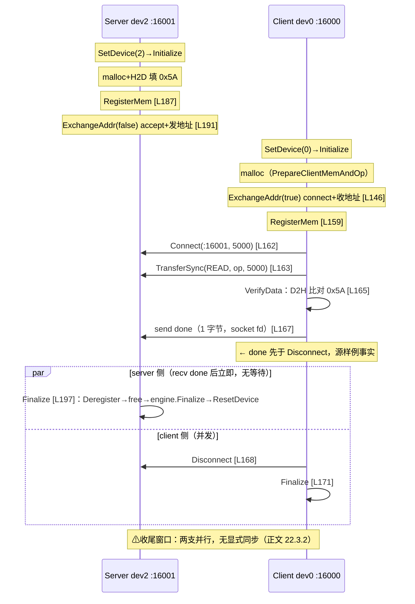

# 第22章 HIXL 单边通信

> 集合通信是「大家一起来」；单边通信是「我看中了你的内存，自己动手」。本章沿一个真实样例走完 HIXL（Huawei Xfer Library，昇腾单边通信库）从初始化到销毁的完整生命周期，并把库内每一步的代码真相摊开。

## 本章目标与阅读指引

读完本章你应当能回答：

1. 单边通信「单」在哪里——对端到底要不要配合？「零拷贝」的边界在哪？
2. 一次 `TransferSync(READ)` 从 API 到硬件经过哪几层？完成信号是怎么回到 Host 的？
3. 建链失败后能不能直接重试？`auto_connect` 开与不开，行为差多少？
4. 异步传输的返回值、状态、资源释放三者什么关系？TIMEOUT 之后缓冲区能不能动？
5. FabricMem、中转 buffer、LLM-DataDist 各自的适用边界？

本章约定：所有行号锚定 hixl 源码仓 commit `9ed283b`[^A]；未真机运行的命令一律标注；性能数字只引用仓内 benchmark 文档并带全条件，本书无实测。

## 22.1 单边通信的问题与 HIXL 定位

第21章的 HCCL/HCOMM 以集合通信为主：进程组、rank、collective 语义，根实例广播、域内同步（HCOMM 亦含单边原语，见该章；此处仅取其与 HIXL 的分工对照）。PD 分离（Prefill/Decode 分部署）这类场景要的是另一件事——**Cache 管理权在框架手里，传输层只需要「本地地址↔远端地址」的裸读写**。HIXL 就是这个裸读写层：无 rank 概念，引擎名就是 `ip:port`；建链、注册、传输全部围绕成对的内存地址展开[^A]。

先把三个最常被写错的概念钉死：

**一、单边 ≠ 对端零准备。** 发起方单方面发起读写，但对端必须先完成：内存注册（远端地址须在**远端** HIXL 实例注册，本地地址在本地注册）[^B]、进程存活、（显式模式下）建链。quickstart 官方注释原文：「先申请、填充并注册本地内存，再经 socket 交换地址，避免**未注册地址被 client 提前使用**」[^C]——单边只是省掉了对端的**传输参与**，不是省掉对端的**状态准备**。

**二、「零拷贝」是有条件的。** 直传路径（CS 客户端对已注册内存直接下发读写描述符）确实用户内存到用户内存；但库内存在中转机制（`OPTION_BUFFER_POOL`，默认 `4:8` 即 4 个 8MB buffer）与 FabricMem 特殊路径——「零拷贝」是路径属性，不是库级保证（22.7 节展开）。

**三、方向按接口分立，不按参数猜。** `TransferOp::READ`＝把远端内存读到本地（local 是目的），`WRITE`＝本地写往远端（local 是源）[^B]。方向名体系（`D2rD`/`rD2H`……）在 22.7 节 benchmark 口径中给出严格定义。

选型决策一句话：**有稳定的进程组与集合语义→HCCL（ch21）；有框架级 Cache 管理→LLM-DataDist（22.8，传输后端按配置与场景选择）；只有「地址对地址」的传输需求、拓扑由框架自己管→HIXL 直用**。三者可叠加：同一进程里集合通信与单边传输并存；各自遵循相应的资源与完成契约。

与邻章的边界：ch21 的 SymWin 是通信域内的对称窗口机制，依赖 rank 与域上下文；HIXL 是独立引擎拓扑，两套注册/建链/完成语义，不可互相印证。ch23 的通算融合（Device 侧 `AscendC::Hccl`）是集合通信的算内嵌用，也不在本章——HIXL 设备 kernel 的 `notify` 细节只是其传输实现，不是通算融合接口。

## 22.2 API 全景：15 个方法与类型系统

HIXL 的公开 C++ API 收敛在唯一头文件 `hixl.h`（194 行），全部公开方法恰好可归四组[^B]：

| 组 | 方法 | 一句话 |
|---|---|---|
| 生命周期 | `Initialize(local_engine, options)` / `Finalize()` | 引擎名=`ip:port`；Finalize 前须断链＋解注册 |
| 内存 | `RegisterMem(MemDesc, MemType, MemHandle&)` / `DeregisterMem` | `MEM_DEVICE`/`MEM_HOST`；重复注册同 addr+len 返回原 handle |
| 连接 | `Connect/ConnectAsync/Disconnect/DisconnectAsync/GetAsyncConnectStatus` | 异步态 7 值（`NOT_CONNECT`…`DISCONNECTING`） |
| 传输 | `TransferSync/TransferAsync/GetTransferStatus(单,批)` ＋ `SendNotify/GetNotifies` － `GetCapability`(静态) | `TransferOp={READ,WRITE}`；能力查询探测 AutoConnect/CS 支持 |

类型系统两处细节[^B]：`MemDesc` 尾部带 `reserved[128]`、`TransferResult` 带 `reserved[108]`——文本可见的预留区，用途仓内未说明（本书不作意图推断）；`TransferReq` 就是 `void*`，是不透明句柄，**调用方只保存、不解释**。

错误码分段：`SUCCESS=0`、`PARAM_INVALID=103900`、`TIMEOUT=103901`、`NOT_CONNECTED=103902`、`RESOURCE_EXHAUSTED=203900`、通用失败 `503900`——与 LLM-DataDist 的 `0x5010B0xx` 段（22.8 节）分属两套。

连接状态机值得单独看：**异步建链/断链的 7 个状态**——由 `GetAsyncConnectStatus` 查询，单条（按引擎名）与批量（引擎名→状态 map）两个重载。**它读取的是本端连接池的任务结果表**：只有经由 `ConnectAsync/DisconnectAsync` 提交的任务才会在表中留痕，无记录时返回 `NOT_CONNECT`——它是「本端异步操作台账」，不是对端视角，也不是全量链路清单（22.3.2 的建议据此限定）。同步 `Connect/Disconnect` 阻塞到终态，不经此表。配套的轻量通知面：`SendNotify(remote, {name, msg}, timeout)` 向对端投递命名通知，`GetNotifies` **取走并清空**本地通知队列——注意「取走即清」的消费者语义，与 22.6 的「查询即消费」同构；这对手写「传输完成后再发一条应用层确认」的协议很顺手（22.3.2 的改进建议即可用它实现）。

options 七常量中本章要用的四个：`OPTION_GLOBAL_RESOURCE_CONFIG`（协议/引擎选择的主入口）、`OPTION_AUTO_CONNECT`（建链自动性开关，22.5 节主角）、`OPTION_BUFFER_POOL`（中转，22.7）、`OPTION_ENABLE_USE_FABRIC_MEM`（FabricMem 总开关，22.8）。另有静态 `GetCapability(FeatureType, int32_t&)` 在初始化前探测**本环境**是否支持 AutoConnect / CS 通信后端——能力探测返回的是环境事实，不是配置开关本身。

```cpp
// ① 引擎初始化的全部选项——quickstart 的真实配置，仅此一项
// ② 关键行真码
std::map<AscendString, AscendString> opts;
opts[OPTION_GLOBAL_RESOURCE_CONFIG] =
    R"({"comm_resource_config.protocol_desc": ["hccs:device"]})";
HixlExitOnFailure(ctx.engine.Initialize(local, opts), "Initialize");   // hixl_example_quickstart.cpp InitEngine
// ③ 机制解释：protocol_desc 非空 → 引擎工厂命中「HIXL CS 分支」（22.4 节阶梯）；
//    不配 AutoConnect → 默认关闭（value_or(false)），一切建链须显式。
// ④ [需真机验证] A2/A3 设备 + 双进程，见 22.3 复现。
```

## 22.3 生命周期主线：quickstart 双进程走读

官方样例 `hixl_example_quickstart.cpp` 是本章主锚：client 绑 device 0（engine `127.0.0.1:16000`），server 绑 device 2（`:16001`），**两个进程两个终端**——`main` 只认 `--role=client|server`，分别进 `RunClient()/RunServer()`[^C]。传输内容：client 从 server 的 device buffer `READ` 1MiB，回读校验 `0x5A`。

双端时序（行号可核，[^C]）：



### 22.3.1 三个刻意的「不对称」

**地址交换是用户自备的。** `ExchangeAddr` 就是一段 40 行的 BSD socket 代码：server `bind/listen/accept` 后把 `reinterpret_cast<uintptr_t>(buf)` 发过去，client `connect+recv`。HIXL 的 `Connect` 只认 engine 名（`ip:port`），**不提供「把内存地址告诉对端」的通道**——这是框架集成时必须自己补的一环（Mooncake 等上层用自己的元信息通道解决）。

**Client 先交换、后注册；Server 先注册、后交换。** 两端镜像不对称：client 在 `PrepareClientMemAndOp` 里先收地址再注册（L146→L159），server 先注册再发地址（L187→L191）。逻辑一致：**任何一方把自己的地址交出去之前，该地址必须已完成注册**——注释「避免未注册地址被 client 提前使用」的准确含义。

**done 先于 Disconnect。** client 发完 done 才断链（L167→L168），server 收到 done 即收尾（L194→L197）。顺带两个健壮性细节：样例的 `HixlExitOnFailure/ACL_EXIT_ON_FAILURE` 是「打印＋整体退出」级宏——**传输失败即进程终止**，没有任何重试，生产集成不能照抄这个失败策略（对照 22.5 的重试纪律自行实现）；done 走的是与地址交换**同一个** socket 连接（`ctx.fd` 复用），server 的 `recv` 阻塞其上，这条连接的生命周期覆盖「交换→传输→收尾」全程，是两个 HIXL 引擎之外唯一的同步通道。

### 22.3.2 Server 收尾窗口：源样例未消除的竞态

`HixlCSServer::Finalize` 的真实实现是：停 listener 并 join→`msg_handler_.Finalize()`→`endpoint_store_.Finalize()`→释放 trans flag→`TransferPool::Finalize()`——**全程不遍历 `clients_`、不等待任何 client 断链**[^D]。client 的断链是 server epoll 循环收到关闭事件后 `CleanupClient`（提交 `kDestroyChannelReq`、`close(fd)`、erase）来消化的。

于是源样例存在一个**结构性的收尾窗口**：server 在 `recv done` 后立刻 Finalize，而 client 的 `Disconnect`（DestroyChannel 协商）此时才刚开始——两者并发，且 server 的 msg_handler 已先一步 Finalize，迟到的控制消息如何处置，仓内未见显式保障。**本书未运行样例，不能对其实际结果下判断**；能陈述的仅是：done 早于 Disconnect、server 收尾与 client 断链可能并行，接口文档的义务（「Server 需等所有 Client 完成断链后调用 Finalize」[^B]）在样例中无显式同步支撑。

收尾动作本身的次序也须如实读（quickstart `Finalize` helper，L120-137）：**先 `close` 控制socket→`DeregisterMem`（返回码忽略）→打印 `DeregisterMem done`→`aclrtFree`（返回码忽略）→`engine.Finalize()`→`aclrtResetDevice`**。两点推论：①打印在 free 与 engine.Finalize 之前，`DeregisterMem done` 只证明「调用已返回」，**不证明解注册成功**（返回码被忽略）；②收尾窗口下对端可能仍在访问，**不得以该打印作为「可释放/已成功」的验证依据**——成功验证只能回到 22.5/22.6 的返回码与终态查询。

> **本书设计（未执行，仅建议，非源样例内容）**：在 done 之外增加一条应用层确认——client 待 `Disconnect` **成功返回后**，经同一条控制连接再发第二个信号，server 收到后者才 Finalize。此设计引入的是**单向的额外确认**（client→server 一条消息），并非对称的一往返握手；本章不改源样例。注：`GetAsyncConnectStatus` 是本端异步任务台账（见 22.2），**无证据表明它能观察 server 侧入站 client 的断链进度**，故不采用该轮询方案。时序图中双方收尾以并行分支表达（下图 par 区）。

### 22.3.3 复现（无真机，未执行）

**构建（任一终端，一次）**：

```bash
# [需真机验证] 环境：Atlas A2/A3 双 device（0/2）；CANN Toolkit+ops 已装
# 源仓只读，复制临时副本再构建（本书整理；出处 build.md「源码编译」节）
set -e   # 任一步失败即停，不带病继续
CANN_SRC=/mnt/SATASSDEXT4/cann; WK=$(mktemp -d); echo "WK=$WK"   # 只 echo 副本根目录；下两终端 cd 时自行拼 /hixl
test -d "$CANN_SRC/hixl"
cp -r "$CANN_SRC/hixl" "$WK/hixl"
cd "$WK/hixl"
source /usr/local/Ascend/ascend-toolkit/set_env.sh   # 路径按实际部署；build.sh 联网拉第三方
bash build.sh --examples
# 产物：可执行文件在 <副本>/build/examples/cpp/（examples/cpp/README「编译结束后…build/examples/cpp」；
# build_out/ 仅存放打包 run）。bash -n 只证明脚本语法，本块须真机执行方称复现。
```

**终端 1——server（先起）**：

```bash
set -e
WK=/tmp/tmp.XXXXXXXX   # ←占位：替换为构建块 echo 的 WK 根目录（独立 shell 不继承变量）
test -d "$WK/hixl"     # 独立命令：不存在即退出（set -e），不与 cd 短路
cd "$WK/hixl"
source /usr/local/Ascend/ascend-toolkit/set_env.sh     # 每终端各自初始化；路径按实际部署
./build/examples/cpp/hixl_example_quickstart --role=server   # dev2；阻塞等待 client
```

**终端 2——client**：

```bash
set -e
WK=/tmp/tmp.XXXXXXXX   # ←占位：同上，替换为构建块 echo 的 WK 根目录
test -d "$WK/hixl"     # 独立命令：不存在即退出（set -e）
cd "$WK/hixl"
source /usr/local/Ascend/ascend-toolkit/set_env.sh
./build/examples/cpp/hixl_example_quickstart --role=client   # dev0；READ→校验→done→Disconnect
# 观测点（与 22.3 时序对应，仅描述打印次序，不构成成功承诺）：
# server 先 RegisterMem/监听→client Got remote addr→client TransferSync READ completed→
# 两端 Deregister/Finalize；server Finalize 打印可能早于 client Disconnect 完成（22.3.2 窗口）。
```

注意：这是 **quickstart 自己的两条命令**；同目录的 `hixl_example_d2rd` 是另一组样例（`--protocol/--device` 参数、单进程双 engine），不可混用——本章主线只有一个，就是 quickstart。跑通后可核对三个观测点，与 22.3 时序一一对应：server 先打印 `RegisterMem success` 与 `Server waiting on port`，client 随后 `Got remote addr`；client 侧 `TransferSync READ completed`＋校验通过；两端各自 `DeregisterMem/Finalize done`——**server 的 Finalize 完成打印可能早于 client 的 Disconnect 完成**，这是 22.3.2 收尾窗口的可见表现；两支并行的先后不构成正确性判据，结果须按 22.3.2 的窗口语义理解。

## 22.4 一次传输的库内旅程：从 API 到硬件

### 22.4.1 两层选路：先选引擎，再匹配端点

**第一层：引擎选择阶梯**（`EngineFactory::CreateEngine`）[^E]，按序：

1. `EnableUseFabricMem`→**FabricMemEngine**；
2. `LocalCommRes` version=="1.3"→**HixlEngine**（CS 直连）；
3. `LocalCommRes` 其他 version→**CommEngine**（legacy，ADXL/通信域）；
4. `protocol_desc` 非空→**HixlEngine**（quickstart 命中此支）；
5. SoC==kV5（950 系）→**HixlEngine**；
6. 兜底→CommEngine。

**第二层：端点匹配**。`HixlEngine` 内 `endpoint_matcher.cc` 两张静态规则表只是**候选优先级**：同 instance 先 UB 组、再 HCCS device→UBoE→UB_RTP→RoCE device→RoCE host；跨 instance 先 UBoE→UB_RTP→RoCE device→RoCE host[^E]。真正选中发生在建链协商：client 发 `MatchEndpointRequest`，**server 侧在双方实际配置的交集里匹配**。所以正文表述必须是「优先级 ∩ 双端配置」：交集内按优先级取，**交集为空则协商失败、建链不成立**——不存在「自动落到次选」的保证。

平台条件（来自样例参数表[^F]，与匹配表互证）：`hccs:device`/`roce:device` 仅 A2/A3；`uboe/ub_rtp/ub_ctp` 系仅 950PR/DT。版本双轨属 **d2rd 系样例的 `--version` 参数**（quickstart **无**此参数，经 `protocol_desc` 直接选定引擎）：`--version=0` 走 HCCL 通信域 legacy（**仅** `roce:device`＋`HCCL_INTRA_ROCE_ENABLE=1`＋LocalCommRes v1.2），`--version=1` 走 HIXL CS（A2/A3/950 全支持）——本章主线 quickstart 即 CS 路径。

把第一层阶梯读全还会发现一个历史断层：**同一个仓里住着两代引擎**。`CommEngine`（legacy）是「通信域×集合式原语」的旧世界观——LocalCommRes v1.2、HCCL 域复用、BUFFER 中转都在它的语义里；`HixlEngine`（CS）是「直连×单边原语」的新世界观——协议描述符、端点协商、设备 kernel。两者的选项解析、错误路径、完成机制都不通用（22.6 的结论**只对 CS 成立**）。阅读第三方集成代码时，先辨认它初始化了哪代引擎，再套对应的心智模型——两套模型不可互换。

### 22.4.2 Client 侧两层封装与两条数据路径

`HixlEngine`（引擎层）持有 `ClientManager`（req↔client 注册表＋按 remote_engine 的 client 缓存）与 server 侧；client 对象 `HixlCSClient` 由 `DirectClientHandler` 薄封装持有，传输最终落到 CS 内部两条路径[^G]：

**Device 内存路径**（`BatchTransferDeviceAsync`）：校验→从 `TransferPool` 取共享 slot（池按 device 获取；同一 HixlCSClient 的在途传输复用其 active_slot_，引用计数共享，不能推广为同设备所有 client 共用一个 slot，最后一个引用释放时才归还/Abort）→`aclrtMallocHost` 独立 host_flag→描述符列表 H2D 拷入 device→**按 `kMaxKernelBatchSize` 分块 launch 设备 kernel**（每 1920 个 op 或末块携带 notify 等待参数）→同 stream 再排一个 D2H 拷贝（22.4.3）→返回 handle。传输本体是 CANN 预置的批量读写 kernel（经 `aclrtBinaryLoadFromFile` 加载 `libcann_hixl_kernel`），经由 slot 内 Hcomm 线程/通道下发。slot 上还挂着一个 Host 映射的 **err_flag**：设备侧执行异常时置位，查询路径读不到完成标志且 err_flag 非零→判 FAILED 并锁存（22.5）——错误与完成是两条独立回报线，前者带外、后者走数据通路。

**Host 内存路径**（`BatchTransferHostAsync`）：不 launch kernel，直接在**Host 侧循环**调 `TransferWithRetry` 逐块提交读写（下详），随后从对端内置 flag 区 `ReadNbi` 回 1 写入本地 flag 槽；flag 槽是固定大小的环（`kFlagQueueSize`），**耗尽即 `RESOURCE_EXHAUSTED`**——错误消息原文要求「先查询已完成任务，再创建新传输」[^G]。这是并发上限的显式机制：**异步 in-flight 任务数受 flag 槽深约束**。

Host 路径的重试值得单独看：`HCCL_E_AGAIN` 时 `ChannelFenceOnThread` 后重试，每次 TransferWithRetry 调用单独计时，窗口 20 分钟（`kRetryTimeoutMs`）超时返回 `TIMEOUT`[^G]——**这是传输级重试**，与 RDMA 网卡级重试（`HCCL_RDMA_RETRY_CNT/HCCL_RDMA_TIMEOUT`，作用于**建链 channel 参数**，doc 给的配置公式是让网卡重试覆盖业务超时）分层。Device 路径的重试在 kernel/Hcomm 层内，仓内不可见。

### 22.4.3 完成保障链：host_flag 的 1 是「常量拷贝」写进去的

这是本章最容易写错的归因，逐步拆开[^G]：

1. **常量制备**：TransferPool 初始化时在设备上 malloc 一个 `uint64_t` 并写入 1（`dev_const_one`），挂在 slot 描述符上——**同一设备池的 slot 引用此常量**。
2. **分块 launch**：`LaunchDeviceChunkedKernels` 按 `kMaxKernelBatchSize` 切块；需要等待的块（每 1920 个或末块）在 kernel 参数里携带远端 flag 地址、本地 notify（`ACL_NOTIFY_DEVICE_USE_ONLY`）等，HCCS 协议另置 `use_notify_record=1`。
3. **stream 内阻塞点**：kernel launch 后，**同一 stream** 排入 `aclrtWaitAndResetNotify(notify, stream, timeout)`。
4. **标志写入**：再往同一 stream 排 `aclrtMemcpyAsync(host_flag ← dev_const_one, D2H)`。**写 1 的是这次常量拷贝，不是 kernel**。在正常 stream 执行与标志生命周期下，host_flag 读到 1 是末尾 D2H 执行的完成标志；该顺序证据不单独证明二进制 kernel 内部的远端完成协议。
5. **Host 侧判定**：`CheckStatusDevice` 直接读 `*(uint64_t*)host_flag`。

语义分三层记录：**提交**（launch+D2H 入队，接口返回即 handle 有效）→ **stream 顺序**（D2H 排最后）→ **Host 可读**（查询读 flag）。kernel 内部「数据落地才放行 notify」的逻辑在 CANN 预置二进制内，本仓不可见——host 侧证据链到第 5 步为止，正文**不得写成「kernel notify 直接置位 host_flag」**。查询先检查完成标志，命中1即报告COMPLETED并回收；未命中才检查既有failure latch及slot的 `err_flag`。后者（Host映射）非零→`LatchTransferFailure(FAILED)`（22.6、22.5）；同步路径超时直接 `aclrtSynchronizeStreamWithTimeout` 失败并 Abort slot。

### 22.4.4 内存视图的建立时机：建链瞬间的快照

Client 侧的「远端有哪些内存」不是传输时现查的，而是**建链瞬间一次性建立**[^G][^H]：

1. **本端注册同步**：`GetOrCreateClient` 在建链前把 engine 当前全部注册（`CopyMemInfoListLocked` 复制 `mem_map_`）经 `SetLocalMemInfo` 灌入新 client——**快照语义，建链时刻为止**。
2. **远端注册拉取**：建链握手里 client 发 `kGetRemoteMemReq`，server `ExportMem` 应答当前已注册的全部描述符，client 逐条 import 并写入本地内存仓库的 server 区。
3. **传输前双端校验**：每次传输前 `BatchValidateMemoryAccess` 对每个 op 校验 local 与 remote 地址都落在两侧 region 表内，未注册直接 `PARAM_INVALID`（错误消息分别指明「Server/Client memory…not registered」及序号）。

由此得到一个隐蔽的工程约束：**Engine 层 `RegisterMem` 只写 server 侧与 `mem_map_`，没有任何「向已建 client 增量推送」的消息**——CS 路径的远端内存视图只在建链时同步一次。**建链之后对端新注册的内存，对既有链路不可见**，传输校验会以「远端未注册」失败；安全做法只有两种：先注册完再建链（与接口文档「Connect 前完成全部 local 注册」的义务一致），或断链重连让快照重建。UB 路径另有 lazy 模式（传输时按需补建链接、建链时拉取对端 mem info），但那是另一 handler 的事——本章限定 CS DIRECT，不外推。

## 22.5 建链自动性与重试语义：auto_connect 门控的两侧世界

`HixlEngine` 把「失败后怎么办」的答案绑定在一个布尔上：`auto_connect_ = options.AutoConnect().value_or(false)`——**默认关闭**[^H]。

```cpp
// ① AutoConnect 的两分支：门控决定「失败后是否有自动重建」
// ② 关键行真码（节选，hixl_engine.cc）
Status HixlEngine::AutoConnect(const AscendString &remote, int32_t timeout, ClientPtr &out) {
  HIXL_CHK_STATUS_RET(CheckInitialized(), "...");
  if (!auto_connect_) {                        // 分支A：显式模式
    out = client_manager_.GetClient(remote);   // 只查找，不重建
    HIXL_CHK_BOOL_RET_STATUS(out != nullptr, NOT_CONNECTED,
        "...please check connection...");       // 查无 → NOT_CONNECTED 直接返回
    return SUCCESS;
  }
  ...                                          // 分支B：自动模式
  out = client_manager_.GetClient(remote);
  if (out != nullptr) return SUCCESS;         // 已有则复用
  ... GetOrCreateClient(config, ...);          // 查无才全新建链
}
Status HixlEngine::AutoDisconnect(const AscendString &remote, int32_t timeout) {
  if (auto_connect_) {                        // 门控：显式模式下是空操作！
    if (client_manager_.GetClient(remote) == nullptr) return SUCCESS;
    HIXL_CHK_STATUS_RET(Disconnect(remote, timeout), ...);
  }
  return SUCCESS;                             // false 时走到这，坏 client 原样保留
}
// ③ 机制：TransferSync/Async 失败路径调 AutoDisconnect；显式模式下既不自动断链、
//    下次 AutoConnect 也不会重建——残留 client 会持续返回失败。
// ④ [示意代码] 节选改写自 hixl_engine.cc L383-431，语义以源码为准。
```

两侧世界的用户可见差异：

| | 自动模式（`AutoConnect="1"`） | 显式模式（默认） |
|---|---|---|
| 首次传输 | 可跳过 Connect，链路池按需建链 | 必须先 `Connect`，否则 `NOT_CONNECTED` |
| 传输失败后 | 引擎 `AutoDisconnect` 真断链→销毁 client→**下次传输自动全新重建** | `AutoDisconnect` 空转，**坏 client 残留**→须应用显式 `Disconnect`→`Connect`，直接重试只会再吃 `NOT_CONNECTED/FAILED` |
| 对端销毁感知 | 心跳自动检测（doc：间隔默认 10s）并清理[^H] | 无自动清理，靠传输失败暴露 |
| 自动断链本身 | **也可能失败**（`AutoDisconnect` 内 `Disconnect` 的返回值照常检查），失败向上传 | —（门控空转） |
| 异步变体价值 | `ConnectAsync/DisconnectAsync`＋状态轮询，适合高扇出 client 管理大量对端 | 同左，但重建全靠显式 |

由此得到本章最重要的工程结论，按模式分列：

- **自动模式**：TransferSync/TransferAsync 的引擎传输调用返回失败时，会尝试自动断链；成功销毁 client 后，**下次传输才按需重建**。查询调用失败与传输终态 FAILED 的区别见22.6。两个模式间不存在共享的「重试即成功」：重建是下次传输的行为，不是本次返回的承诺；重连后的链路是全新对象。
- **显式模式**：引擎的 AutoDisconnect 不执行断链。对于已经锁存传输失败的 CS client，继续提交会被拒绝；恢复连接需应用显式 `Disconnect`→`Connect`。不能把所有参数错误也归为必须重连。
- **对象复位 ≠ 传输可安全重放。** `timeout` 或 FAILED 之后：写方向可能**已部分到达**（DeviceSync 超时仅 Abort slot，数据是否落定未证）；重放 `WRITE` 前须确认**源数据未变、远端注册仍在**；`READ` 重放则要求远端内容在两次之间稳定。**是否重试、重试前做哪些校验，是应用的决策**——本书不承诺传输幂等或必成，库也没有提供「已写多少」的查询接口。

> **陷阱**：把任一模式的行为写成普适结论都会错。模式分支、自动断链可失败、重放需应用核对，三个限定各自独立成立。

再补两个自动模式的细节。**对端销毁感知靠心跳**：文档明写「对端销毁需要心跳机制来检测，心跳间隔默认 10 秒」[^H]——10 秒是**默认间隔**，非故障检测上界；检测滞后与传输失败先后并无固定次序，本书不作断言。**重建时的注册快照**：自动重建走 `GetOrCreateClient`→`BuildClientConfig`→`CopyMemInfoListLocked`，把**重建时刻**的全部注册灌入新 client。据此可分项检查重试前提：①**对象重建**——旧 client 已销毁，新链路新对象；②**在途访问**——重试前须确认上一笔已无在途写入（库不提供在途查询，超时仅 Abort slot）；③**注册有效**——重连快照吸入最新注册，但重连前的老 client 视图不更新（22.4.4）；④**数据一致性**——前笔超时可能已部分写入，重放前应用自行核对；⑤**重放策略**——重不重试、重放前做何校验，均由应用决定，本书不代答。

## 22.6 完成查询的三层状态机：返回码 ≠ 状态 ≠ 资源释放

异步传输把三件事分开：**调用返回值**（这次查询成功吗）、**传输状态**（WAITING/COMPLETED/FAILED/TIMEOUT）、**资源释放**（handle/flag/slot 何时回收）。下述行为边界**限 CS DIRECT 路径**（本节所有断言同此范围，UB/legacy 不外推），逐层看[^G][^H]：

**第一层：CS 客户端。** `CheckStatusDevice/CheckStatusHost` 的赋值路径只有 `WAITING/COMPLETED/FAILED` 三值——**CS 检测路径不产生 TIMEOUT**（`HIXL_COMPLETE_STATUS_TIMEOUT` 仅见于 `client_handler.h` 的枚举与 `ToTransferStatus` 映射，检测函数无一处赋值）。COMPLETED 或 FAILED 的瞬间执行「查询即消费」：`ReleaseDevCompleteHandle` 释放独立 host_flag、device 描述符 buffer、slot 引用（若为末引用则按 latch 状态 Abort 或归还池）——**该 handle 不支持再次查询**。WAITING 则什么都不动。释放挂在查询而非完成回调上，与「host_flag 靠应用轮询」的实现方式一致；至于这是有意的线程模型取舍还是实现惯性，仓内无陈述，本书不作归因。另注意本「不产 TIMEOUT」是**CS 检测路径**的行为，不能推广到其他引擎/路径。

**第二层：handler。** `DirectClientHandler::GetTransferStatus`：查无此 req→`PARAM_INVALID`＋status=FAILED；底层查询调用本身失败（ret≠SUCCESS）→**status 写成 FAILED、erase、返回该 ret**——注意「返回值」与「status 输出」在这里分叉：调用失败了，但输出 status 也被诚实写成 FAILED。

**第三层：引擎。** 单条 `GetTransferStatus`：req 查无 owner→status=FAILED＋`PARAM_INVALID`；**查询调用失败**（ret≠SUCCESS）→`EraseTransferReq`＋`AutoDisconnect`（**返回值被检查，失败向上传**）＋返回 ret；**查询成功且 status≠WAITING（含 COMPLETED/FAILED）→仅 `EraseTransferReq`，无 AutoDisconnect**——「传输 FAILED」与「自动断链」在此层**不等价**，前者只是出表。表项消失后再查同一 req 得 `PARAM_INVALID`（「已完成或不存在」），结果须调用方自存。

批量版本逐条**按条件**列出（编号 B1–B7 与下表一致，此处给正文叙述；表另附「是否查询/返回元素/登记断链」三列）：

- **B1** `client==nullptr`（owner 已消失）→**仅 erase＋continue，不产任何结果元素**；
- **B2** 查询调用 ret≠SUCCESS（**该 req 有被查询，只是调用未成功**）→engine 计入 `disconnected_engines`＋`AutoDisconnect`（**返回值 `(void)` 忽略——显式模式下空转，集合照样扩张**）＋本 req status=FAILED＋erase＋出结果；
- **B3** engine 已在集合中→**跳过查询、直接写 FAILED＋erase**（进集合条件=「调用失败」，≠status==FAILED、≠断链成功）；
- **B4** ret=SUCCESS 且 COMPLETED（正常终态）→erase＋出结果 COMPLETED；
- **B5** ret=SUCCESS 且 FAILED（正常终态）→erase＋出结果 FAILED（**无 AutoDisconnect**）；
- **B6** status==WAITING→**保留注册**：erase 条件是 `status!=WAITING`，`skip_waiting` 开关只决定 WAITING 元素出不出（L302-304/L307-309），**与登记无关**；
- **B7** `max_query_count` 截断未遍历→**保持原状**。

「未出现在结果中」计三成因（B1 已消失/B6 已过滤或仍 WAITING/B7 未遍历），对账须分别处理。**引擎层批量恒 SUCCESS；公开 wrapper 另有前置检查（impl_ 空即 FAILED，hixl_impl.cc L393-395）可失败，返回码须查**——失败语义在元素、分支与返回码三处。

| 层 | WAITING | COMPLETED | FAILED | TIMEOUT |
|---|---|---|---|---|
| CS `CheckStatus*` | 保留 handle | 消费＋释放 | 消费＋释放（latch/err_flag） | 不产生 |
| handler | 保留 | 消费＋erase | status=FAILED＋erase；ret 透传 | 仅枚举映射 |
| engine 单条 | 保留注册 | erase 注册 | erase（**无 AutoDisconnect**） | 仅枚举映射 |
| engine 单条·调用失败 | — | — | erase＋**AutoDisconnect（检查返回值）**＋ret 透传 | 同左分支 |
| engine 批量 | 分支表见下（B1–B7） |〃 |〃 |〃 |
| **同步包装** | — | SUCCESS 返回（唯一完成信号） | 提交或等待阶段均可能失败：**错误透传非归并**（DeviceSync 经 `HIXL_CHK_ACL_RET`：仅 STREAM_SYNC_TIMEOUT→TIMEOUT，余 ACL 原值） | TIMEOUT 三路：①HostSync deadline／②DeviceSync ACL 映射／③提交链 `TransferWithRetry` 经 HostAsync 透传（见下）｜清理逐分支不统一 |

**engine 批量分支表**（条件／是否查询／返回元素／登记与断链；编号 B1–B7，逐行对 `hixl_engine.cc` L264-310）：

| # | 条件 | 是否查询 | 返回元素 | 登记与断链 |
|---|---|---|---|---|
| B1 | client==nullptr（owner 已消失） | 否 | **无** | 仅 erase |
| B2 | 查询调用 ret≠SUCCESS（该 req 被查过，调用未成功） | 是（未成功） | status=FAILED | erase＋engine 入 disconnected_engines＋AutoDisconnect（**(void) 忽略**，显式空转也入） |
| B3 | engine 已在集合中 | **否（跳过）** | status=FAILED | erase |
| B4 | ret=SUCCESS 且 COMPLETED（正常终态） | 是 | COMPLETED | erase |
| B5 | ret=SUCCESS 且 FAILED（正常终态） | 是 | FAILED | 仅 erase（无 AutoDisconnect） |
| B6 | ret=SUCCESS 且 WAITING | 是 | WAITING；`skip_waiting` 开时过滤不出 | **保留注册——erase 条件是 `status!=WAITING`（L302-304/L307-309），本轮 WAITING 分支不 erase，开关仅影响元素** |
| B7 | `max_query_count` 截断未遍历 | 否 | 无 | 保持原状 |


读表三点：①handler/engine 两层在**调用失败分支**会把输出 status 写成 FAILED——「输出 status」与「返回码」在该分支承载不同信息，须分别读；②engine 批量 FAILED 元素三来源：**B2 该 req 被查询但调用失败**、**B3 同 engine 连带跳过查询**，另有 **B5 正常终态 FAILED**——仅 B2/B3「未经成功查询」，其含义是「该链路查询不可用」，非单笔传输结论；③erase 的语义是**移出 manager 登记表**，之后引擎层查询返回 `PARAM_INVALID`——各层各自的表各自维护，跨层并无统一账本。

**`Status TIMEOUT` 的产生点与 ACL 错误映射**（具名）：①`BatchTransferHostSync` **先 `HIXL_CHK_STATUS_RET(BatchTransferHostAsync…)`（L958-959，③等提交失败经此透传）**，再进 deadline 轮询——到期（L968-969）`ReleaseCompleteHandle` 后返回 TIMEOUT；**deadline 在 HostAsync 返回之后才起算**，`timeout_ms` 不覆盖提交阶段（含重试）耗时，非「整个调用」上界（源码次序推导，非实测）；②`BatchTransferDeviceSync` 的 `aclrtSynchronizeStreamWithTimeout` 失败→先 Abort slot，经 `HIXL_CHK_ACL_RET` 返回——**仅 `ACL_ERROR_RT_STREAM_SYNC_TIMEOUT` 映射 `hixl::TIMEOUT`，其余 ACL 错误原值 `static_cast<Status>` 透传**（hixl_checker.h L116-125）——「同步失败」≠TIMEOUT、更≠FAILED；③`TransferWithRetry` 20 分钟窗（L454/L480）——**每次调用各自起表，非整批共享总窗**。④③亦入异步提交：`BatchTransferHostAsync`→`BatchTransferTask`（L514）→`TransferWithRetry`（L499）——但重试返回后 HostAsync **还须 Fence 排序＋对端 flag `ReadNbi`（L535 区）方返回 handle**：**提交返回≠传输完成**，提交期长阻塞只是「提交可等待重试」，完成判定仍归 CheckStatus 读 flag；提交 `Status TIMEOUT`=提交失败，≠查询态 `TransferStatus::TIMEOUT`（仅枚举/映射）——同名异层不得混写。**⑤同步包装可返回的 TIMEOUT 因此有两源**：HostSync=①deadline 或③透传（提交失败，handle 未必建立，清理在提交链内）；DeviceSync=②（slot 已 Abort）。异步查询侧不产 TIMEOUT。由此得到缓冲区复用纪律：

- **同步返回 `SUCCESS` 才能视为完成**——这是库给出的唯一「数据已落定」信号。
- **同步 TIMEOUT 按分支对待，不统一承诺清理状态**：①HostSync deadline→handle 已 `ReleaseCompleteHandle`；③经 HostSync 透传→提交失败，句柄未必建立、清理在提交链内；②DeviceSync→slot 已 Abort。共同点仅是**写没写完不可证**→源缓冲与远端内容在应用完成一致性核对前都不得假设；其余同步失败（ACL 原值透传）清理程度另逐分支看，同样按「未证」对待；是否重放由应用策略决定。
- **异步**：只有查得 `COMPLETED` 才可复用；`FAILED` 同样是终态（资源已释放）但数据态同样未证；**查询即消费**意味着 result 里关心的 `user_data` 要在查询前想清楚怎么留存——批量结果数组就是为这次查询的一次性快照。

> **陷阱**：区分三种「失败」——**调用失败**（返回码≠SUCCESS）与**传输终态 FAILED** 是两回事；前者之后 req 可能仍在册（按各层分支，见表），**未终态（WAITING）的 req 始终可再查**；**已消费（COMPLETED/FAILED）的 req 再查，单条 `GetTransferStatus` 返回 `PARAM_INVALID`**（「已完成或不存在」）——这同时可作对账的**结束条件**：终态确认无需无限轮询。另分层：**公开 wrapper 返回码须查**（前置检查可失败），「恒 SUCCESS」仅引擎内部层。

把三层合起来，使用者的纪律不是再包一层封装，而是四条原则（本书整理；API 均为公开签名，见脚注）：

- **签名**：提交 `Status Hixl::TransferAsync(const AscendString &remote_engine, TransferOp operation, const std::vector<TransferOpDesc> &op_descs, const TransferArgs &optional_args, TransferReq &req)`（hixl.h L143-145；wrapper 前置检查 impl_ 空即 FAILED，hixl_impl.cc L374-382）；查询批量 `Status Hixl::GetTransferStatus(const GetTransferStatusArgs &args, std::vector<TransferResult> &results)`（hixl.h 对应重载；wrapper 前置检查 L393-397）。`TransferArgs` 仅 `{const void *user_data; uint8_t reserved[120]}`（hixl_types.h L76-79），结果元素 `{req, user_data, status, reserved[108]}`（L87-92）——**结果里的 `user_data` 就是提交时经 `TransferArgs` 传入的那个指针**。
- **提交**：返回码先查，失败直接进入错误处理（不暗示重试）；要把上下文带回查询结果，就在提交时 `optional_args.user_data = &ctx`——**不传入 `TransferArgs` 就别指望结果替你携带**（此时须自建 req→上下文映射）；应用台账覆盖所有未完成 req，生命周期须长于全部在途访问。
- **查询**：批量 wrapper 返回码先查（前置检查可失败，「恒 SUCCESS」仅引擎内部层）；**单轮查询后仍未完成的 req，在离开作用域前必须仍可安全再来一轮**——其缓冲区与上下文（含 `user_data` 指向对象）不得先行失效；「查一轮就走人」是悬空，不是收割。
- **对账与收束**：单轮未出现在结果＝三成因（B1 已消失／B6 WAITING 仍在册／B7 截断未遍历），分别处理；循环终止＝台账空，或余项逐一得终态。**单条查询的 `PARAM_INVALID` 只证明「无登记」**——登记表项被 erase 与实际在途访问结束是两回事（B1 的 owner 消失正是「表没了、访问结局未知」），故 `PARAM_INVALID` 不能单独用作「可释放 buffer／上下文」的证明；释放决策=查得终态＋应用级一致性核对（22.5 五分项）。

## 22.7 内存注册经济学与路径矩阵

### 22.7.1 注册的前提与上限

规则全部来自接口文档「约束说明」节[^B]，正文引用时须带条件：

- **时序**：`Connect` 建链前须完成全部 local 注册；`TransferSync` 地址可为注册区间的子集。
- **数量**：单实例建议 ≤4K 个——注册越多建链越慢，过多建链超时；**Device 内存 ≤50GB**；**Host 内存** HDK<25.5 时 ≤20GB、≥25.5 时 ≤1TB（A2/A3 限定条款）。
- **幂等**：同 `addr+len` 重复注册返回原 handle 不建新资源；`DeregisterMem` 对同一 handle 第一次实际释放、后续 SUCCESS 空转、null 才 `PARAM_INVALID`。
- **收尾**：断链后 Client/Server 分别解注册；engine 层校验「所有 client 断链后才允许 Deregister」（`client_manager_.IsEmpty()` 检查，未断链返回 FAILED）。
- **可见性**：结合 22.4.4——注册可见性以建链快照为界，「先注册、后建链」是唯一稳妥顺序；对 CS 路径，建链后新注册的本端内存对**既有对端**同样不可见（对端 client 的远端视图不会增量更新），对称地成立。

### 22.7.2 中转 buffer：选项存在 ≠ 路径必走

`OPTION_BUFFER_POOL`（`"${NUM}:${SIZE}"`，默认 `4:8`MB，`0:0` 关闭）的文档定位：RDMA 注册 Host 内存受限、或小块（如 128K）高频传输需要中转提升性能时开启；**与 `ENABLE_USE_FABRIC_MEM` 互斥**；A2 限定条款「800I A2/A200I A2 Box 的 Server HCCS 仅 D2D」[^B]。在代码里的落点：该选项只在 **FabricMemEngine 与 CommEngine（legacy）路径**被解析；**CS（HixlEngine）直传路径没有 buffer_pool 的引用**——「默认开启中转」是选项默认值，不是传输路径事实。**「零拷贝」的准确边界**：CS 直传（本章主线）用户内存直达；legacy/FabricMem 路径各有自己的机制；任何超出一句的断言都需要先问「哪个引擎、哪条路径」。

### 22.7.3 方向矩阵：benchmark 的坐标系

性能讨论前先固定语言。方向名＝`源 → 远端`，D=Device、H=Host、r=remote，**站在 Initiator 视角**[^I]：

| 方向 | Initiator 本地 | 远端 | 操作 | 一句话 |
|---|---|---|---|---|
| D2rD | device | device | write | 本地显存写到远端显存 |
| rD2D | device | device | read | 从远端显存读回本地 |
| D2rH / rH2D | device | host | write/read | 跨到对端 Host |
| H2rH / rH2H | host | host | write/read | 双侧 Host |
| H2rD / rD2H | host | device | write/read | Host 发起对端显存 |

benchmark 口径（引用任何数字必须整体携带）[^I]：总数据量 128MiB；block 梯 16K→2M；A3 表按 FabricMem（**AICPU 展开**／**Host 展开 4 流**）→ROCE→HCCS 分节，HCCS/ROCE 再分 **hixl_cs 与通信域** 两列族；A2 表无 FabricMem。代表读数（A3 单机 FabricMem、总 128MiB、D2rD，逐项对表[^I]）：

| block | AICPU 展开 | Host 展开（4 流） |
|---|---|---|
| 16K | 16.113 | 2.874 |
| 128K | 125.744 | 22.602 |
| 1M | 170.514 | **175.102** |
| 2M | 165.513 | **181.431** |

同一表内 rD2D/AICPU/1M＝156.698（方向不同勿混入 D2rD）。可见：**两展开路径并非常态性「差一个量级」——1M/2M 处 Host 展开反超，差距集中在 16K–256K 中小区块**；随块增大两线收敛。「16K 仅 ~16 GB/s」亦仅是 AICPU 展开该格读数。任何「HIXL 带宽XX」的无条件句都是错的；**测量用的 CANN/固件版本仓内未注明**，本书如实标注「版本未知」，不把文档极值当保证，也**不从表读数反推开销来源或普遍规律**——表只证明这些格子的读数。

上表之外可核对的两点事实：**中小区块（16K–256K）AICPU 展开显著高于 Host 展开**（如 128K：125.744 vs 22.602），大块（≥1M）两者接近；**所有路径的小块读数都低**（16K 各列个位数至十几 GB/s）。「小块开销来自何处」「聚合是否最优对策」属设计解释，本章不立论；`OPTION_BUFFER_POOL` 文档以「多个小块传输（例如 128K）中转提频」为适用场景[^B]，可作为应用侧线索。

## 22.8 FabricMem、LLM-DataDist 与生态边界

### 22.8.1 FabricMem：超节点上的「另一套引擎」

动机（仓内文档陈述[^J]）：Atlas 800T A3 超节点把跨节点的 RoCE（~20GB/s 级）换成片间 HCCS 直达远端 DRAM 的百 GB 级通路。机制：基于 CANN 虚拟内存管理（VMM）——`aclrtReserveMemAddress`→`aclrtMallocPhysical`→`aclrtMapMem` 全局统一编址，交换**物理地址**，远端 SDMA 直接读写，宣称「无需 CPU 介入的单边通信：源端主动发起传输，**对端**零开销」。

**「CPU 零介入」的边界**：这是**数据面**措辞。控制面（地址交换/注册/建链协商）照旧存在；benchmark 单列「Host 展开（4 流并发）」表本身即说明 Host 参与路径真实存在，且其读数与 AICPU 展开随块大小互有高低（见 22.7.3 表）。使用要点：`EnableUseFabricMem="1"`＋`fabric_memory.max_capacity`（(0,1024] 整数 TB，默认 32，实际由底层决定）；**仅 A3**；与 BUFFER_POOL 互斥；HDK 25.5 的 Host 内存须走 `AdxlEngine::MallocMem/FreeMem`（26.0 起可直接 ACL）[^J][^B]。样例 `fabric_mem_d2d` 的 VMM 三连（reserve→mallocPhysical→map）是该路径的最小配法[^J]；`src/hixl/fabric_mem/` 下实存 `fabric_mem_aicpu_dispatcher.{cc,h}`（AICPU 侧分发）、`fabric_mem_aicpu_transfer_service.{cc,h}`、`fabric_mem_allocator.{cc,h}` 等文件（模块清单见目录）——AICPU 展开与 Host 展开两表对应两条发起路径的具体分工，属实现内层，本章仅至文件名，不展开协作细节。

### 22.8.2 LLM-DataDist：上面一层，不是同一层

`llm_datadist.h` 是**另一个库**：`LLMDataDist(role, cluster_id)`→`init(LLMConfig)`→`LinkLlmClusters/UnlinkLlmClusters`（链接态机显式成错误码族：`LLM_NOT_YET_LINK/LLM_LINK_BUSY/…0x5010B0xx`）→`AllocateCache(CacheDesc{placement…})`→`PullKvCache/PullKvBlocks/PushKvCache/PushKvBlocks`[^K]。两个常被混淆的点：

- **role 只是标签**：接口文档明写「该参数只用于标识当前角色，对传输过程无影响」——link/pull/push 方向与角色解耦（样例注释同）。
- **传输后端可插**：`OPTION_TRANSFER_BACKEND` 配 `"hixl"` 才切到本章的 HIXL CS；**默认后端接口文档未统一承诺**——样例层面 pull 系默认 adxl 传输后端、push 系默认 HCCL 传输后端[^L]，A5 环境则仅支持 hixl CS 后端且默认 UB 协议。引用「默认行为」必须注明出处场景，不得写单一默认。

把生命周期排开，LLM-DataDist 的接口层提供自己的链接状态和错误码，例如 `LLM_NOT_YET_LINK`、`LLM_PROCESSING_LINK`、`LLM_LINK_BUSY`、`LLM_ALREADY_LINK`、`LLM_EXIST_LINK`；具体返回仍须按操作与状态分支判断。`UnlinkLlmClusters` 带 `force_flag` 兜底强拆（`LLM_UNLINK_FAILED`）。Cache 侧 `AllocateCache(CacheDesc)` 按 `placement`（Device/…）分配，`Pull/PushKvBlocks` 支持 batch_index——**块级**操作是 PD 分离的真实粒度（按 block 传输 KV）。这套语义由仓内 `src/llm_datadist/` 的 fsm/cache_mgr/comm_adapter 模块实现，传输落到哪个后端由 `OPTION_TRANSFER_BACKEND` 决定——**错误码、链接、角色、缓存全在前一层，HIXL 只见内存地址**，这是两层边界最精确的一句话。

KV 生态（vLLM/Mooncake/SGLang/NIXL 适配）在仓外；仓内博客（PD 分离 D2D 部署、FabricMem KV 传输）是场景叙述，无新增接口，本书只取「HIXL 作为其传输后端」这一定位[^L]。

### 22.8.3 三者边界速查

| | 生效引擎/层 | 平台 | 与谁互斥/版本条件 |
|---|---|---|---|
| CS 直传（本章主线） | HixlEngine | A2/A3/950（按 protocol） | version=0/1 双轨，950 仅 v1 |
| BUFFER_POOL 中转 | CommEngine/FabricMem 路径解析 | A2 限定条款见 doc | 与 FabricMem 互斥 |
| FabricMem | FabricMemEngine | 仅 A3 | HDK 25.5 Host 内存特例；max_capacity TB 级 |
| LLM-DataDist | 独立库→backend=hixl 时落到本章 | 随 backend | role 仅标识；链接 FSM 独立错误码段 |

本章至此闭环：22.3 的生命周期给出台账，22.4–22.6 给出机制与失败语义，22.7–22.8 给出边界。把最后一句话留给集成者——**HIXL 把复杂度从「协议实现」转移到了「状态管理」**：传输本身一行 API，但建链模式、注册时机、重试决策、结果消费全要自己管。本章的每一张表，都是为这四项管理服务的。

## 22.9 性能验证路径：benchmark 工具与测量纪律

仓库自带两条测量路径，本书未运行，仅记录用法与口径[^I]：

**C++ 直测**`hixl_comm_bench`：target/initiator 成对；initiator 侧指定 `--role --device_id --local_engine/--remote_engine --memory/--remote_memory --op read|write --transport --transfer_size --block_sizes --loops`——方向矩阵（22.7.3）的每一格都对应一组参数；双机用 python 启动器 `run_comm_benchmark.py --role=target|initiator`（`run_all_bench.sh` 仅单机）。

**一键扫描**`run_all_bench.sh --loops N --device-ids ...`（可 `--skip-comm/--skip-kv`），输出对齐 22.7.3 的分表结构。

测量纪律三条：①**先连通性后性能**——用 hccn_tool 确认两 device 连通再跑（README 明确要求）；②**变量唯一化**——同方向同块扫协议/引擎，或同协议扫块；禁止跨表拼结论；③**记录环境**——CANN 版本、固件、拓扑（单机/双机、A2/A3/950）随数据落盘；仓内 performance.md 未注明测量版本，自测时不要重蹈。

## 陷阱与注意（汇总）

1. **单边≠对端零准备**：远端注册＋进程存活是前提；地址交换通道用户自建。
2. **Client/Server 注册与交换次序镜像相反**，写反即违背样例注释的本意。
3. **done 先于 Disconnect、server 收尾无等待**：源样例收尾窗口是结构性的，集成须自行加确认（本书设计未执行）。
4. **显式模式下失败不自愈**：`AutoDisconnect` 门控空转，坏 client 残留；先断链重连再重试。
5. **自动模式的自动断链也可能失败**；重试前链路状态非无条件健康。
6. **重放不是幂等承诺**：timeout 可能部分写；源数据/远端注册稳定性与重试决策归应用。
7. **查询即消费**：COMPLETED/FAILED 后 handle 再查是 `PARAM_INVALID`；result 需要的信息查询前留存。
8. **同步 SUCCESS 才是完成**；TIMEOUT 后缓冲不可假设。
9. **批量返回恒 SUCCESS**，失败在元素 status；同 engine 首错后余者免查询判死。
10. **host_flag 的 1 来自同 stream 常量 D2H**，不是 kernel 写入；kernel 内部逻辑在 CANN 二进制，勿替源码立论。
11. **候选优先级≠选中**：endpoint 匹配取双端配置交集。
12. **BUFFER_POOL 默认开≠实走中转**：CS 直传路径无该机制。
13. **性能引用带全条件**：引擎×方向×块×平台×（AICPU/Host 展开），无版本注明如实标「未知」。
14. **先辨认引擎代际再套心智模型**：CommEngine（legacy）与 HixlEngine（CS）选项/错误/完成机制互不通用。
15. **建链后新注册不可见**（CS）：远端视图=建链快照；新增内存须重连或先注册后建链。

## 进一步阅读

[^A]: `hixl/README.md`（组件定位、News 记录）；`hixl/docs/zh/build.md`（依赖、源码编译 `bash build.sh [--host|--examples]`、`--cann_3rd_lib_path` 离线构建）；源码仓 commit `9ed283b27309463ed0faa490b79c0dc9ddef6377`。CANN Open Software License 2.0。

[^B]: `hixl/include/hixl/hixl.h`（公开类与方法全集，194 行）；`hixl/include/hixl/hixl_types.h`（Status/错误码 1039xx/503900/203900、MemDesc/TransferOpDesc/TransferResult 的 reserved 区、options 七常量、AsyncConnectStatus 7 态）；`hixl/docs/zh/api/cpp/HIXL-interface.md`（RegisterMem 约束与 4K/50GB/Host 20GB(HDK<25.5)→1TB 上限、TransferSync/Async 返回值、Finalize 前置 L363-365、DeregisterMem 幂等语义、`OPTION_AUTO_CONNECT` 心跳 10s 说明、BUFFER_POOL 定义与 A2 HCCS 仅 D2D 条款、`OPTION_LOCAL_COMM_RES` v1.3）。CANN 文档随源仓分发。

[^C]: `hixl/examples/cpp/hixl_example_quickstart.cpp`：`kDeviceClient/kDeviceServer/engine 名` 常量区、`InitEngine`（protocol_desc 单选项）、`PrepareClientMemAndOp`（L142-147 区含 ExchangeAddr(true) L146）、`RunClient`（RegisterMem L159→Connect L162→TransferSync L163→VerifyData L165→send done L167→Disconnect L168→Finalize L171）、`RunServer`（填 0x5A L181-185→RegisterMem L187→ExchangeAddr(false) L191→recv done L194→Finalize L197）、`Finalize` helper（L120-137：close socket→DeregisterMem 返回码忽略→打印→aclrtFree 忽略→engine.Finalize→ResetDevice）、注释「避免未注册地址被 client 提前使用」（L180）、`main` role 分派（L201-224）；`hixl/examples/cpp/README.md`（样例矩阵、成对运行、`--version=0|1` 语义与平台条件、d2rd 系参数表）。

[^D]: `hixl/src/hixl/cs/hixl_cs_server.cc`：`Finalize` L273-320（停 listener/join→msg_handler→endpoint_store→flag→TransferPool，无 client 等待）、`CleanupClient` L586-605（DestroyChannelReq+close+erase）、`DoWait` epoll 循环；`hixl/src/hixl/cs/hixl_cs_client.cc` `Destroy`（文件尾：ReleaseLegacyHandles/AbortAllPendingDeviceHandles/ClearRemoteMemInfo/endpoint Finalize/pool Finalize）。

[^E]: `hixl/src/hixl/engine/engine_factory.cc`（选择阶梯 L38-75：FabricMem→LCR1.3→LCR其他→protocol_desc→SoC kV5→CommEngine；`UseProtocolDesc` L24-31）；`hixl/src/hixl/engine/endpoint_matcher.cc`（`kCrossInstanceRules`/`kSameInstanceRules` L33-58，reason 字段原文）；`hixl/src/hixl/engine/client_handler_factory.cc`（DIRECT/UB 二分）；`hixl/src/hixl/cs/hixl_cs_client.cc` `ExchangeEndpointAndCreateChannel`（MatchEndpoint 协商，文件中部）。

[^F]: `hixl/examples/cpp/hixl_example_d2rd.cpp`（`kVersionLegacy=0` L26、legacy 分支仅 roce:device＋`HCCL_INTRA_ROCE_ENABLE`＋LocalCommRes v1.2 L121-146 区）；`hixl/examples/cpp/README.md` HIXL 样例参数表（协议×平台条件、version 行）。

[^G]: `hixl/src/hixl/cs/hixl_cs_client.cc`（1524 行）：`BatchTransferDeviceAsync`（AcquireSharedSlot/AllocateHostFlag/desc H2D，文件中部）、`LaunchDeviceChunkedKernels` L720-737（kMaxKernelBatchSize/kNotifyWaitTaskInterval=L51 1920）、`BuildDeviceChunkParam`（notify 参数与 use_notify_record）、`LaunchDeviceKernel`（aclrtWaitAndResetNotify L786 区、launch attr timeout=L53 27*68s）、flag D2H L893-897、`BatchTransferHostAsync`（flag 环耗尽→RESOURCE_EXHAUSTED 原文）、`TransferWithRetry`（20min/kRetryTimeoutMs、ChannelFence 重试）、`CheckStatusDevice/CheckStatusHost`（WAITING/COMPLETED/FAILED；err_flag latch；**不产 TIMEOUT**）、`ReleaseDevCompleteHandle`/`ReleaseCompleteHandle`（消费即回收）、`InitRdmaRetryConfig`（HCCL_RDMA_*→channel 参数）；`hixl/src/hixl/cs/transfer_pool.cc`（dev_const_one L513-521、slot Abort/Release、`libcann_hixl_kernel` 加载）；`hixl/src/hixl/cs/load_kernel.cc`（kernel json 路径 L27=`$ASCEND_HOME_PATH/opp/built-in/op_impl/aicpu/config/libcann_hixl_kernel.json`）；`hixl/src/hixl/common/hixl_checker.h`（`HIXL_CHK_ACL_RET` L116-125：仅 `ACL_ERROR_RT_STREAM_SYNC_TIMEOUT`→hixl::TIMEOUT，余 ACL 错误 `static_cast<Status>` 透传；`BatchTransferHostAsync`→`BatchTransferTask` L508-516/495-501→`TransferWithRetry` L452-487、flag `ReadNbi` L530-537 区）。

[^H]: `hixl/src/hixl/engine/hixl_engine.cc`：`auto_connect_` 初始化 L94（value_or(false)）、`AutoConnect` L383-408（!auto_connect→仅 GetClient 否则 NOT_CONNECTED；auto→GetOrCreateClient）、`AutoDisconnect` L422-431（门控内才 Disconnect）、`TransferSync` L193-215/AutoConnect L199/AutoDisconnect L208、`TransferAsync` L217-236、单条 `GetTransferStatus` L240-262、批量 L264-310（disconnected_engines 免查询判 FAILED/skip_waiting 过滤仍注册/max_query_count）、`kAutoConnectTimeout=3000` L27；`hixl/src/hixl/engine/client_manager.cc`（GetOrCreateClient L62-95/DestroyClient L181-203/req 表 Erase 语义）；`hixl/src/hixl/engine/hixl_impl.cc`（公开 wrapper 前置检查：`TransferAsync` L374-382/`GetTransferStatus` 单 L386-391/批 L393-397，impl_ 空即 FAILED；`GetAsyncConnectStatus`→连接池 `task_result_` L173-176）。

[^I]: `hixl/benchmarks/README.md`（方向命名表「源→远程目标，D/H/r」、hixl_comm_bench 参数、run_all_bench 仅单机/双机 run_comm_benchmark --role）；`hixl/benchmarks/performance.md`（128MiB/block 梯/A3 FabricMem AICPU 展开 D2rD 16K=16.113→1M=170.514 GB/s、Host 展开 4 流、A2 表结构；测量版本未注明——本书如实标注）。

[^J]: `hixl/docs/zh/FabricMem.md`（背景/RoCE~20GB/s 对比/VMM 三 ACL 原语/物理地址交换/「无需 CPU 介入：源端发起，对端零开销」数据面表述）；`hixl/examples/cpp/fabric_mem_d2d.cpp`（`OPTION_ENABLE_USE_FABRIC_MEM="1"` L52；reserve→mallocPhysical→map L133-142）；`hixl/src/hixl/fabric_mem/fabric_mem_aicpu_dispatcher.h`、`fabric_mem_aicpu_transfer_service.h`、`fabric_mem_allocator.h`（模块代表文件，全清单见目录）；接口文档 FabricMem 配置块（`fabric_memory.max_capacity`、HDK 25.5 AdxlEngine MallocMem 特例）。

[^K]: `hixl/include/llm_datadist/llm_datadist.h`（错误码段 0x5010B0xx L46-63、LinkLlmClusters L202/Unlink L301 区、AllocateCache/CachePlacement、Pull/PushKvCache/Blocks）；`hixl/docs/zh/api/cpp/LLM-DataDist-interface.md`（`OPTION_TRANSFER_BACKEND`="hixm/hixl 说明、role 仅标识 L36）；`hixl/src/llm_datadist/`（adxl/cache_mgr/fsm 等模块目录）；`hixl/examples/python/llm_datadist/pull_cache_sample.py`（成对运行、LLMRole 判定）。

[^L]: `hixl/examples/cpp/README.md` LLM-DataDist 样例节（pull 默认 adxl/push 默认 HCCL 传输后端句、transfer_backend 参数、A5 仅 hixl CS+UB 默认）；`hixl/examples/python/README.md`（python 样例运行法、HCCL_INTRA_ROCE_ENABLE 示例 L80-82）；`cann-learning-hub/blogs/inference/sglang_mooncake_hixl_pd_separation_d2d/SGLang、Mooncake与CANN HIXL的PD分离D2D部署.md`、`cann-learning-hub/blogs/inference/hixl_fabricmem_kv_cache_transfer/hixl_fabricmem_kv_cache_transfer.md`（场景叙述，无新接口）；`cann-learning-hub/tutorials/hixl_development/README.md`（01–04 notebook 系索引，入门参考）。
