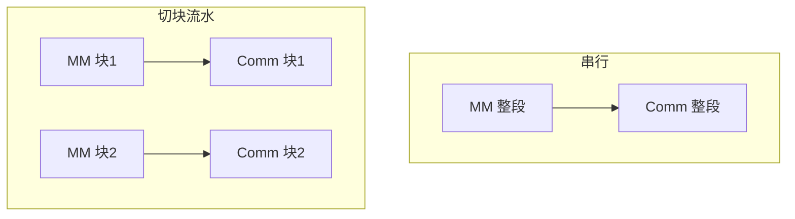
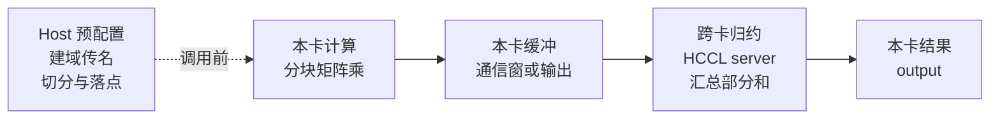
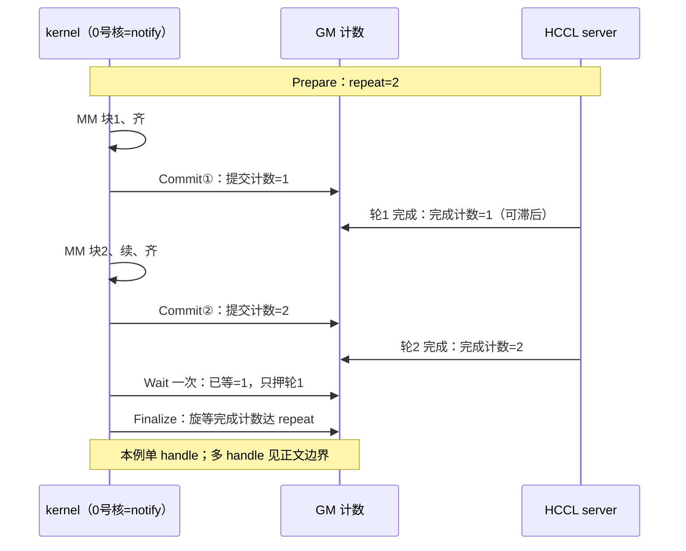

# 第23章 通算融合：一个 GEMM+AllReduce 的完整旅程

## 23.1 问题：算完再通信，慢在哪里

张量并行的一层前向，最后往往归结为同一条恒等式：把输入与权重沿归约维**对应地**拆开：x 按列拼 `x=[x0 x1]`（x0、x1 各 M×K/2），W 按行上下分 W0/W1（各 K/2×N，K 取偶），两卡各算 y0=x0W0 与 y1=x1W1，则 y=y0+y1。每张卡乘出的就是它那份**部分和**，求和即 AllReduce(sum)，本章主角 `MatmulAllReduce` 把「本地矩阵乘」与「这次求和」合成一个算子。拆分必须输入、权重成对对应，部分和累加才等于全量；对应关系由调用方保证。

最直接的写法是两个独立步骤：先在整个输出上做完矩阵乘，再发起通信。代价一眼可见：矩阵乘时通信引擎闲着，通信时计算核心闲着，两者排队消耗同一份墙上时间。MC²（Matrix Computation & Communication）的应对是把矩阵乘的 M 维切开：算完一块立刻交给通信，官方优化指南概括为「子块的计算和通信任务形成两条流水线，通过并行执行实现流水掩盖」[^1]。

那么，**切开之后，什么条件下才真的省时间？**



读图：本图只画**局部数据依赖**（每块计算先于其对应通信），不是执行时序；两支的并行窗口内，块 2 计算可与块 1 传输重叠，那一段被掩盖。重叠是机会而非保证；条件由 23.3 的切法与 23.4 的交接共同创造。

还有一个误解先破除：融合不消灭中转。数据仍要从计算核心落到显存、再被通信引擎读走；后文的「窗口」只是把这个中转换成 HCCL 通信窗，省一次额外拷贝，中转本身还在。

## 23.2 主例：一个算子管两件事

主线是 `ops-transformer` 的 `mc2/matmul_all_reduce` 非量化路径。产品支持以仓内 README 产品表为准：Atlas A2 与 Ascend 950PR/950DT 支持，Atlas A3 为否——A3 的通信见 23.6 的 MoE 算子[^2]。

接口是熟悉的两段式：先 `GetWorkspaceSize` 再提交执行，最后同步流。与普通算子相比多一个前置条件：**通信域由调用者预先建好**，算子只接收一个 `const char *group` 形式的域名，头文件注为「标识列组的字符串」[^3]。至于本地乘完交给谁去跨卡归约，API 面不出现——执行后端由实现按平台与配置分派，23.3 展开。

属性 `commTurn` 的注释是「通信数据切分数，总数据量/单次通信量」，看似用户旋钮；但 README 约束当前版本仅接受 0，实现里 0 会换成内部切分常数。也即**用户暂时不能借它调块**，切块是实现的内部决定[^2]。

其余约束照抄 README：x1 三维或二维、x2 必须二维；仅支持 hccs 链路 all mesh 组网；卡数 A2 至多 8、950 至多 64；reduceOp 仅 sum；长序列场景随规模增大可能 OOM 或超时[^2]。



读图：主链四拍是本章剩余的全部剧情——本卡算、本卡缓冲、跨卡归约、本卡结果；Host 只在调用前做一次配置（虚线），不进数据面。23.3 讲配置，23.4 讲前两拍，23.5 讲后两拍。

## 23.3 Host 侧的三个决定

Host 侧的 tiling 与任务生成共同准备三个决定。

**切多少。** M 维切主块与尾块（tile/tail），通信轮数随之而定。tiling 里 `commOrder=1` 的注释写明「0 先 AiCPU 后 MM；1 先 MM 后 AICPU」——先算后通信在 Host 侧写死，内核循环只是执行它[^4]。

**放哪里。** 矩阵乘输出的落点先经过模式检查，再比较缓冲容量：

| 落点 | 条件 | 代价 |
|---|---|---|
| HCCL 通信窗 | 通过平台与调试模式检查、reuse 开启、容量足够 | 输出直写窗内，通信免一次拷贝 |
| 独立输出 | 平台被强制走输出，或仅通信调试、禁用 reuse、K 为零、容量不足 | 通信从输出区读取 |
| workspace 中转 | 950 固定此路，偏移由 tiling 给出 | 同为独立缓冲 |

窗口路径的完整条件（host 侧判 WINDOW_IN，见[^4]）：架构枚举不是 `DAV_2002`、不是 `MC2_DEBUG_ONLY_AICPU` 模式、reuse 开启、K 不为零，且全部主块与尾块的发送量之和严格小于窗容量；kernel 侧另要求确定性开关关闭（determinism≠1）才把输出指针改指窗（见[^6]）。示形演算只算容量一项：A2 上述前提下，M=4096 切 3072/1024、N=4096、fp16 输出，两轮发送量 3072×4096×2B＋1024×4096×2B=32MiB，小于缺省窗 200MiB——容量条件满足，其余各项须同真；数字是假设。950 固定 workspace 中转，不经此比较。

**交给谁。** 任务生成按平台与 `comm_mode` 分派：950 显式选 `ccu` 走 CCU server 与 `ccu_stream`；其余一律 AICPU 上的 `kfc server`，950 缺省也是它[^5]。于是 23.2 图中的「HCCL server」有了真身：kernel 把请求写进约定消息区，常驻 AICPU/CCU 的服务程序消费任务单、驱动真实集合通信；消息区字段与任务类型 `KFC_TASK_HCC_TASK_DELIVER` 见脚注[^5]。

三个决定一句话：Host 把切几块、放哪里、谁执行全部固化进 tiling 与消息区，device 侧只负责执行。

## 23.4 设备侧：算、齐、交、续

kernel 骨架是一个模板基类，通信 API 只由一个核调用：主线混核实例（ON_CUBE_AND_VECTOR）下是 **0 号向量核**（`g_coreType==AIV 且 blockIdx==0`，见[^6]）；纯 AIC 变体（ON_CUBE）才轮到 0 号计算核。读者不要想象 AIC0 与 AIV0 都在发通知。`Init` 做两件事：判为窗口直写时，把输出指针改指本卡通信窗；随后以 `AllReduce(输出, 结果, 单轮元素, 类型, sum, repeat=主块轮数)` **一次性**登记全部轮次。尾块存在时另登记一个 handle。

之后每轮按逻辑顺序四拍。**算**：计算核跑一段矩阵乘，首轮完整初始化，后续轮乘法对象跨轮复用。**续**：输入输出指针平移到下一块（源码里这一步在 `PostProcEachTurn` 内、先于最终屏障）。**齐**：全核 `Mc2SyncAll`，主线实例化为计算核与向量核都参加的硬件同步，纯 AIC 变体才退化成置旗等旗[^6]。**交**：0 号核 `Commit`，把本轮就绪计入 GM 提交计数；配置第三输入加法时，加法在屏障前完成、前后各一道同步（见[^6]）。此为逻辑顺序，非逐句源码。

收尾几行是 `Wait`、尾块再 `Wait`、`Mc2SyncAll`、`Finalize`——Wait 与 Finalize 仅 0 号核执行，其余核只过屏障。其中藏着本章最重要的细节：**Wait 一次不等于全部完成**。

## 23.5 结果何时可读：三本账

设备 HCCL 实现里有两本 GM 计数加一个登记值：Prepare 写下的 repeat（总量承诺）、提交计数（每 Commit 加一）、完成计数（server 每完成一轮加一）。内核的等待全是刷 cache、读计数、比较的循环[^7]。规则三条：

- Wait 每调用一次，已等计数加「步长」。步长仅在新版 tiling 且命令为 AllToAllV 时可能非零，主线 AllReduce 恒退化为 1——**一次 Wait 只押一轮**。已等次数超过已提交次数会报错返回，不静默。
- 多队列初始化时 Wait 直接成功返回；主线未用多队列，读他人代码须知这条早退。
- 文档契约：非细粒度时 Wait 次数应等于 repeat，且顺序与 Prepare 一致[^7]。

本节起的内容是 **arch22／AICPU 实现的案例**，950 仅作对照。实现与契约有一道缝：arch22 主链只 Wait 一次，完全收敛实际由 `Finalize` 补齐——其同步分支旋等**最后创建的 handle** 的 Query 达到该 handle 的 repeat。边界要诚实：Finalize 只显式见证最后一个 handle。单 handle（无尾块）时，Finalize 返回即本 handle 全部轮次完成——**这一保证仅覆盖单 handle 正常路径**；有尾块时前一个 handle 的完成未被独立见证，本章不下结论（未知①，23.8 列明），也不把单 handle 结论推广到多 handle 或另一代实现。

把 repeat=2、无尾块走成散文：Prepare 落账总量 2；块 1 Commit 把**提交**计数推到 1，server 稍后完成轮 1 时才把**完成**计数也推到 1——完成允许滞后于提交；块 2 Commit 后提交计数到 2，完成计数由 server 在轮 2 结束时另行追到 2；一次 Wait 只把已等推到 1，押的是轮 1；Finalize 的 Query 见完成计数不小于 repeat，才结束这一步等待；后续还要发送结束消息并处理计数复用。Commit 与完成是两本账、两个方向，不能合并叙述。



读图：本图只表**计数账目**，不表执行时刻；块间能否重叠见 23.1 的条件与 23.4 的交接。Commit 与完成是两组不同方向的箭头——kernel 只写提交计数，server 才写完成计数，滞后合法；Wait 押 1 轮与 Finalize 等 2 轮是两个不同的数，不要重合视之。

950 对照：arch35 内核按 for 循环 Wait 共主块轮数次，与文档字面一致，另有 CC tiling 内嵌与固定 workspace 中转——这是另一条已核路径，两代的多 handle 结论本书均未证明，不能互推[^7]。

## 23.6 另一对：MoE 的推与拉

MoE 层是另一对算子：dispatch 把本卡 token 按专家路由**推**给持该专家的卡，combine 把各专家算完的份**拉**回来求和。两者必须配套。README 把限定范围划在四个辅助张量：`expandIdx`、`epRecvCounts`、`tpRecvCounts`、`expandScales` 在不同产品、算法、版本间元素可能不同，须原样传给 combine 对应参数，其他业务逻辑不得依赖其值（[^8]）；token 数据本身的结果不在此限。产品面比主线宽：950DT、A3、A2 均支持。

950 的 dispatch 是纯向量核实现，不经设备 HCCL API。地址来自通信窗，数据区与状态区分离，数据区按轮次双 buffer 交替。流程：路由统计，按核均分 token，把各 token 份写进目标 rank 的窗（量化变体先在片上量化），末了把专家计数与标志写进对端状态区。等待不是事件而是算术：对收到的状态字求和，落在期望区间即齐——标志被编码成浮点 1.0，一次向量加法判完。

combine 是真实的不对称，并非镜像。它按 dispatch 留在窗里的元数据定位各来源份，拷进片上缓冲，乘路由权重后以普通向量加法累加——**归约不经过任何 HCCL reduce**；共享专家份单独二次累加。双 buffer 通过进场时翻转轮次标记选择本轮窗口，并配合 cache 操作读取状态。

设备侧同步至此三种范式：

| 范式 | 谁通知谁 | 计数在哪 | 何时放行 |
|---|---|---|---|
| 提交/完成计数（23.4–23.5） | 内核、server、GM | GM 计数区 | Wait/Finalize 读数 |
| 核间旗标（23.7 URMA） | 核间直接置旗 | 旗标资源 | 对端等到 |
| 窗状态字（本节） | 写对端窗状态区 | 对端 GM | 轮询求和命中 |

A2 的 dispatch 另有服务器承载的分层入口，其消息协议本书未逐行，见 23.8 未证清单。

## 23.7 延伸：两条远端回答

URMA（950，apace 体系）把等待塞进矩阵乘的调度器：向量核跑通信并对每块置旗，计算侧的等待策略是一行「等第 i 块的旗」，注入 Blaze Gemm 主循环——块调度到哪，就等哪块、算哪块。scale 与 A 走同一 channel，一次等待覆盖两笔数据；收尾按 cache 行外刷整个通信缓冲，源码注释直言通信接口暂不内置刷写、需使用方自理[^9]。

PTO（A2/A3，`pto-isa` 的 gemm_ar）不融合进单 kernel：计算、通信两个 kernel 跑在两条流上，AIC 把子块经无锁队列交 AIV 做 RS 与 AG 交叠，发布前双重栅栏。它与 MC2 是不同后端、不同宿主，不能拼进同一条调用链，列出仅为范式对照[^10]。

系统场景本书只写交集：MoE 算子服务专家并行域，缓冲下限按 README 公式预检；DeepSeek-R1 于 Atlas 900 A3 SuperPoD 的部署数字属厂商实践记录、无复现脚本，引用须注明出处[^11]。仓内没有超节点拓扑的源码级证据，本章不作拓扑描述。

## 23.8 复现与边界

```bash
# [需真机验证] 本机无 NPU，以下仅 bash 语法检查，未构建未运行；样例需至少 2 卡设备可见并预建 HCCL 域
set -e
CANN_SRC=/mnt/SATASSDEXT4/cann; WK=$(mktemp -d); echo "WK=$WK"
test -d "$CANN_SRC/ops-transformer"
cp -r "$CANN_SRC/ops-transformer" "$WK/ops-transformer"
cd "$WK/ops-transformer"
# ASCEND_HOME_PATH 须先按本机安装初始化（如 source set_env.sh）；build.sh 内部自行探测，不会回写当前 shell
export ASCEND_HOME_PATH=${ASCEND_HOME_PATH:-/usr/local/Ascend/ascend-toolkit/latest}
bash build.sh --pkg --soc=ascend910b --ops=matmul_all_reduce
./build_out/cann-ops-transformer-*linux*.run
export LD_LIBRARY_PATH=${ASCEND_HOME_PATH}/opp/vendors/custom_transformer/op_api/lib:${LD_LIBRARY_PATH}
bash build.sh --run_example matmul_all_reduce eager --soc=ascend910b
```

编译、安装 run 包、环境变量与 `--run_example` 流程取自仓库 QUICKSTART 与 build.sh 帮助，路径符号照抄指南；`matmul_all_reduce` 样例即 `examples/test_aclnn_matmul_all_reduce.cpp`。缺口如实声明：本机无 NPU，以上仅 bash 语法检查，构建、安装、运行均未执行；`ASCEND_HOME_PATH` 为父 shell 前提，build.sh 的子进程探测不能替代；`HCCL_BUFFSIZE` 须按 README 公式预检。未逐行清单：AICPU server 消费循环、CCU 内部算法、A2 分层 MoE 协议、950 UB Memory 内核实现；以及 23.5 的两处契约缝隙（单 Wait、末 handle），均已显式处理而非掩盖。

## 本章来源

[^1]: `asc-devkit/docs/zh/guide/operator_practice/best_practices/mc_operator_tuning.md`（L5 流水掩盖机理句；原文配图为性能示意，本书图①重绘、不带数值）。
[^2]: `ops-transformer/mc2/matmul_all_reduce/README.md`（产品支持表 950PR/DT 与 A2 √、A3 ×；约束节：x1/x2 形状、仅 hccs 链路 all mesh、卡数 A2 1/2/4/8 与 950 1–64、reduceOp 仅 sum、commTurn 仅 0、长序列 OOM/超时）；`ops-transformer/mc2/matmul_all_reduce/op_host/op_tiling/matmul_all_reduce_tiling_base.cpp` L551-554（`commTurn==0→COMM_TILE`）；`ops-transformer/mc2/matmul_all_reduce/op_kernel/arch22/matmul_all_reduce.cpp` L114-127（非量化 `FP_MM→ON_CUBE_AND_VECTOR`）。
[^3]: `ops-transformer/mc2/matmul_all_reduce/op_api/aclnn_matmul_all_reduce.h` L33（`@param group: 标识列组的字符串`，`const char *group`）；`ops-transformer/mc2/matmul_all_reduce/examples/test_aclnn_matmul_all_reduce.cpp`（L70-83 域名获取、L122-133 两段式＋同步、L188 `HcclCommInitAll`）。
[^4]: `ops-transformer/mc2/matmul_all_reduce/op_host/op_tiling/matmul_all_reduce_tiling_base.cpp`（L149 `commOrder=1` 注释原文、L150/L157-159 reuseMode/totalCnt/turnNum/tailNum、L204-238 落点判据与 `HCCL_BUFFSIZE` 缺省 200MB、L238–256：DAV_2002、仅通信调试、禁用 reuse 或 K 为零时选 OUTPUT；低比特通信 padM 与消息区 `msgSndArea/msgRcvArea`、`notifyOff/notifyBeginCnt/notifyEndCnt` 亦在此文件与 L56-63 区）。
[^5]: `ops-transformer/mc2/matmul_all_reduce/op_graph/matmul_all_reduce_gen_task.cpp`（A5＋ccu→`"ccu server","ccu_stream"`，余/缺省→`"aicpu kfc server","kfc_stream"`；文件尾 `IMPL_OP(MatmulAllReduce).CalcOpParam(...).GenerateTask(...)`）；`ops-transformer/mc2/matmul_all_reduce/op_host/op_tiling/matmul_all_reduce_tiling_base.cpp`（L56-63 消息区、L147 `KFC_TASK_HCC_TASK_DELIVER`、L1542-1549 `comm_mode` 缺省 AICPU）；`ops-transformer/mc2/matmul_all_reduce/op_kernel/common.h` L49-60（server 类型选择器）。
[^6]: `ops-transformer/mc2/matmul_all_reduce/op_kernel/arch22/matmul_all_reduce_base.h`（L40-42 notifyFlag 判据、L48-91 Init：窗口 remap 与 `AllRepeat` 登记、L103-119 `PostProcEachTurn`——addX3 前后各一次 `Mc2SyncAll`、`addGM/aGM/cGM` 指针推进、L121 起 `HcclFinalize`；入口 `GET_TILING_DATA_WITH_STRUCT` 与窗地址 OOM 检查亦在此文件）；`ops-transformer/mc2/matmul_all_reduce/op_kernel/arch22/matmul_all_reduce_910_general.h`（L38-70 Process/InnerProcess，乘法对象跨轮复用）；`ops-transformer/mc2/matmul_all_reduce/op_kernel/common.h` L263-266/L335-352（`Mc2CoreType` 与 `Mc2SyncAll` 三形态）。
[^7]: `asc-devkit/impl/adv_api/detail/hccl/common/hccl_aicpu_impl.h`（L170-194 `GetStepSizeByHandle` 仅新 tiling＋AllToAllV 非零；L416-433 Wait 入口与 `queueNum!=0` 直接成功；L433-437 已等超已提交报错；L443-446 `apiStats.waitStats` 旁账；L450-451 `waitCnt+=stepSize==0?1:stepSize`；L231-244 `WaitFinishCntFromGm`；L457 Commit；L484-514 Finalize：`if constexpr(sync)`＋存在 handle＋非仅算三重守卫下旋等 `Query(curHandleId_)≥repeat`、`HCCL_MSG_CNT` 环形上限、`ResetFinishedTurnCnt`）；`asc-devkit/docs/zh/api/SIMD-API/adv_api/HCCL_communication/HCCL_Kernel/Wait.md` L28/L54；`ops-transformer/mc2/matmul_all_reduce/op_kernel/arch35/matmul_all_reduce_based_all_reduce.h`（L36-41 `InitV2/SetCcTilingV2`、L52-70 fp4x2 注释原文、L123-137 逐轮 Wait）。
[^8]: `ops-transformer/mc2/moe_distribute_dispatch/op_kernel/moe_distribute_dispatch.h`（L214 `GetHcclContext`、L218-228 dataState 翻转＋`DataCacheCleanAndInvalid`、L890-900 Process、WaitDispatch 状态求和判据 L626-685）；`ops-transformer/mc2/moe_distribute_combine/op_kernel/moe_distribute_combine.h`（`ExpertAlltoAllDispatchInnerCopyAdd`、`Muls`/`Add` L613-647、共享专家分支、`LocalWindowCopy`）；`ops-transformer/mc2/common/op_kernel/moe_distribute_base.h`（窗常量与 `DataplaneMode` L353-357）；两算子 README：`ops-transformer/mc2/moe_distribute_dispatch/README.md`、`ops-transformer/mc2/moe_distribute_combine/README.md`（产品表、配套使用、输出元素不依赖、`HCCL_BUFFSIZE` 公式、950DT 仅 UB Memory）；A2 分层入口 `ops-transformer/mc2/moe_distribute_dispatch_v2/op_kernel/arch22/moe_distribute_dispatch_a2_layered.h` 与 `ops-transformer/mc2/moe_distribute_dispatch_v2/op_kernel/arch22/moe_distribute_dispatch_a2_layered_aicpu.h`（未逐行）。
[^9]: `ops-transformer/mc2/common/op_kernel/apace/kernel/fusions/all_to_all_quant_matmul/all_to_all_mx_quant_matmul_urma_impl.h`（L47-54 等待策略、L107-113 注入点、`WaitTile=CrossCoreWaitFlag`、scale 同 channel免二次 Wait 注释、收尾 dcci 原注释、`selfWinAddr`）；通信原语 `ops-transformer/mc2/common/op_kernel/apace/core/aiv_comm/all_to_all/all_to_all_udma_get.h` 与 `ops-transformer/mc2/common/op_kernel/apace/core/aiv_comm/all_gather/all_gather_udma_put.h`（基于 `asc-devkit` `adv_api/hcomm/hcomm.h`）；宿主 `ops-transformer/mc2/allto_all_matmul/README.md`（产品表）。
[^10]: `pto-isa/kernels/manual/a2a3/gemm_ar/README_zh.md`（双流、ready queue、RS+AG 交叠、栅栏各节）；`pto-isa/kernels/manual/a2a3/gemm_ar/ready_queue.hpp`（TTEST/TWAIT 与队列认领）；`pto-isa/kernels/manual/a2a3/gemm_ar/common.hpp`；平台限定见该 README「支持的 AI 处理器」节。
[^11]: `cann-learning-hub/blogs/inference/deepseek_r1_superpod_inference_optimization/基于Atlas 900 A3 SuperPoD推理部署Deepseek-R1性能优化实践.md`（部署形态与性能数字：厂商实践记录，无复现脚本）；`cann-learning-hub/blogs/inference/deepseek_v4_supernode_support/deepseek_v4_supernode_support.md`（综述，未采数字）。
