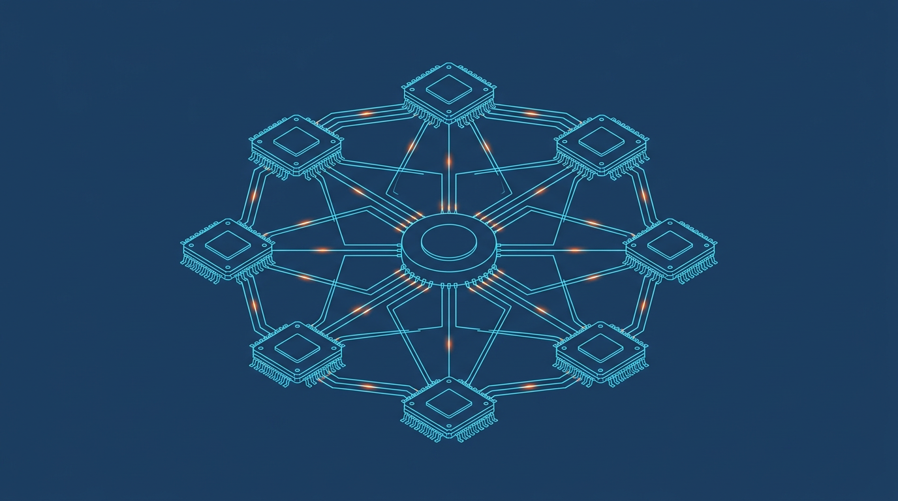

# 第五编 分布式通信

*第五编 分布式通信 · 编扉页配图（AI 生成概念插图，非技术图）*

独立成编。昇腾在大模型时代的主战场是集群；本编从集合通信（HCCL/HCOMM）到单边通信（HIXL）再到通算融合（MC2）与超节点系统形态。

- [第21章 HCCL 集合通信](./ch21-hccl.md)
- [第22章 HIXL 单边通信](./ch22-hixl.md)
- [第23章 通算融合与大规模系统](./ch23-supernode.md)

**主要来源**：`hcomm`、`hixl`、`ops-transformer/mc2`、`pto-isa/kernels/manual/a2a3/gemm_ar`、`cann-learning-hub/tutorials`（hccl/hixl/MC2）与 `blogs/inference|operator`。
