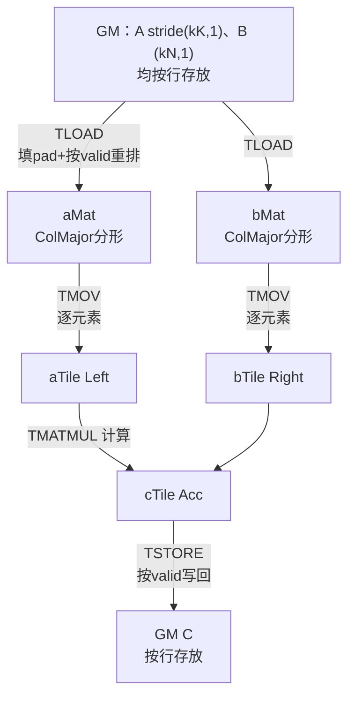
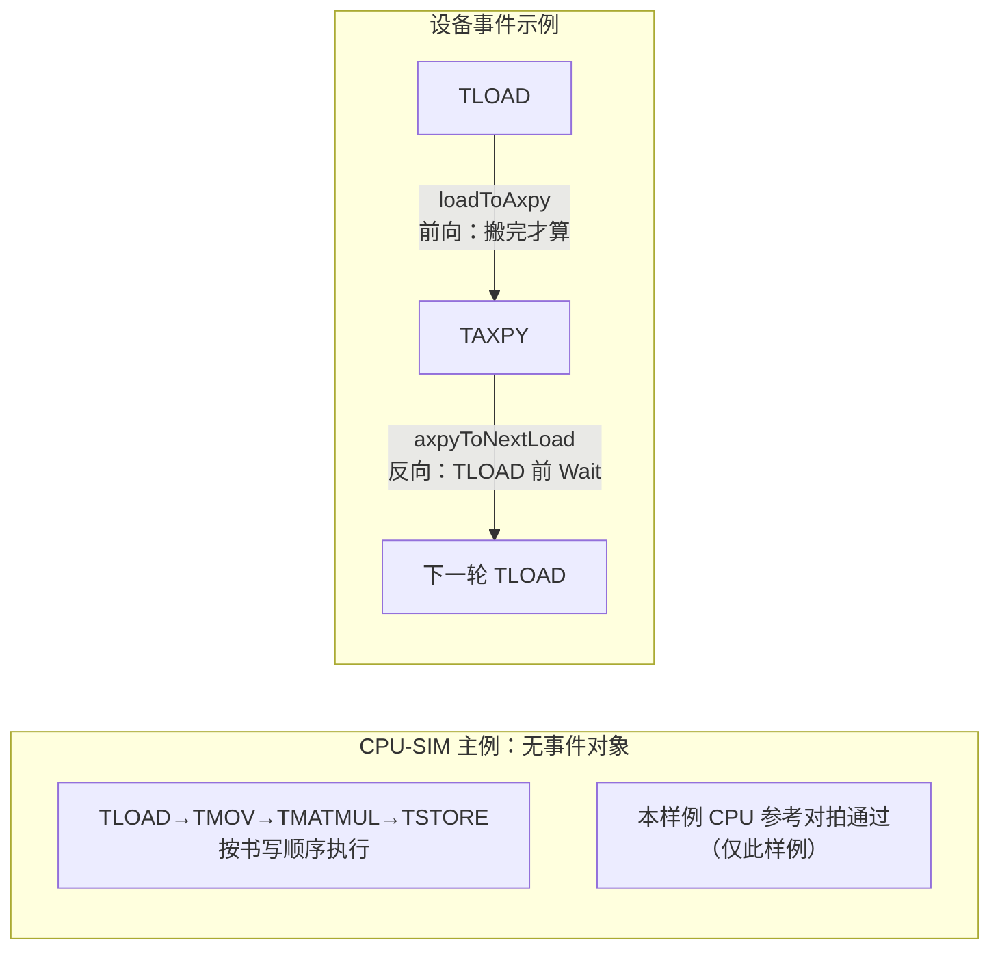

# 第24章 PTO 虚拟 ISA：同一份 tile 程序的两副面孔

## 24.1 问题：同一段程序，布局和同步由谁决定

同一份数据，两代芯片两种排法——这不用远例，本仓库自己就有：名为 `TileLeft` 的矩阵左操作数 tile，A2/A3 代编译成块 RowMajor，CPU-SIM 等其余配置编译成块 ColMajor，同一个名字、两种物理布局[^4]。同步原语同样漂移：设备侧的 `set_flag/wait_flag` 是硬件屏障动作，CPU 仿真里只是空函数（24.4）。PTO（Parallel Tile Operation）是 CANN 对这一问题的回答，仓库首页的自我描述是「面向 tile 编程的虚拟 ISA」，目标「在不同昇腾代际之间更平滑地迁移和优化算子」，宣称定义了 90+ 条标准 tile 指令，并另外提供点对点、同步、集合通信三类通信扩展[^1]。

「虚拟」二字必须落地成可检验的东西。本章的方法是：把官方示例 `gemm_demo`（32×16×32 的单 tile 矩阵乘）在 CPU 仿真器上完整跑通，再逐层追问——它的数据布局由谁决定、依赖由谁保证、换到真设备后哪些合同仍然成立。**先说清边界：本章全部实测均在 CPU 仿真（CPU-SIM）完成，未在 NPU 设备上运行；仿真可用不等于设备支持。**平台面以仓库为准：徽标列 Ascend A2｜A3｜A5｜CPU，A5 支持于 2026-03-30 宣布[^1]。

## 24.2 主例：30 行 tile GEMM，先跑通再追问

`demos/cpu/gemm_demo/gemm_demo.cpp` 的数据面是一次地址绑定加四步。常量 `kM=32, kK=16, kN=32`；全局侧三个矩阵的访问方式由 stride 显式给出——A 的末两维 `(kK, 1)`：同一行内相邻列元素连续、跨行步长为 kK，即按行存放；B 的末两维则是 `(kN, 1)`[^2]。tile 侧则声明了两组角色：

```cpp
// 节选自 gemm_demo.cpp L83-93；Stride 五维照抄源码，B/C 与 RightTile/AccTile 从略
using GlobalA  = GlobalTensor<float, Shape<1,1,1,kM,kK>,
                              Stride<1*kM*kK, 1*kM*kK, kM*kK, kK, 1>>;
using TileMatA = Tile<TileType::Mat, float, kM, kK, BLayout::ColMajor, kM, kK, SLayout::RowMajor, 512>;
using LeftTile = TileLeft<float, kM, kK, kM, kK>;
```

随后的指令序列：`TASSIGN` 把各 tile 绑到约定地址，`TLOAD` 把 GM 数据搬进 `aMat/bMat`，`TMOV` 再搬进 `aTile/bTile`，`TMATMUL(cTile, aTile, bTile)` 反复执行，最后 `TSTORE(cGlobal, cTile)` 写回[^2]。

**TLOAD 搬运时到底做了什么转换？**读 CPU 实现 `TLOAD_TILE_IMPL`：先把整个 tile 容量 `std::fill` 填上 pad 值，再双重循环只走 `validRow × validCol`，按 GM 的五维 stride `GetElement` 取数、按 tile 自身布局 `SetElement` 写入[^3]。也就是说，**把按行存放的 GM 数据重排进分形布局，是 TLOAD 逐元素显式完成的**（坐标映射而非数学转置），不是编译器施法。用偏移复算脚本验证一格：逻辑元素 `(1,1)` 按 GM stride 偏移 17（=`1×kK+1`），在 aMat 分形布局下存储偏移 9——数字对上了[^3]。

那么 A 矩阵在存储里「按列」吗？要分三层说：GM 上按行存放；`TileMatA` 显式选了 `BLayout::ColMajor`，指的是 **512B 分形块在线性存储中的排布次序**；块内部又由 `SLayout::RowMajor` 另行约定。三者各管一层，不能混为一谈（24.3 展开图②）。

主例的完整旅程如图①——注意它全程不出现任何事件对象，依赖靠什么保证是 24.4 的事。

结果判定也朴实：demo 头部有一段平凡 C++ 三重循环参考实现，`TSTORE` 后逐元素比差异，`diff < 1e-3` 才返回退出码 0（L62/L142）[^2]。



读图：A、B 两支路对称，搬运三次（TLOAD 重排进分形、TMOV 逐元素、TSTORE 写回），TMATMUL 是计算不是搬运；每条边的动作均对应 CPU 实现原文。主例全程无事件对象，依赖靠什么保证见 24.4；CPU-SIM 复跑 `max_abs_diff=1.19209e-07`[^11]。

## 24.3 一个 Tile 的三层形状

PTO 文档给 Tile 列了五个核心属性：所在位置、元素类型、容量形状、布局、有效区域，且明文「容量形状大于等于有效形状」[^4]。拆成三层看：

**容量形状**决定分配多少。`TileConfig` 常量写死：元素存储 32B 对齐、AB 类分形 512B、累加器 1024B——这些不是文档建议，是 `static_assert` 硬约束：RowMajor 无分形时要求 `Cols×sizeof(T)%32==0`，违者编译失败[^4]。

**分形布局**决定物理偏移。`GetTileOffset` 对 boxed 布局给出 Nz/Zn/Zz 三族公式，不满足者同样编译期报错[^4]。主例 aMat 是 32×16 float：2×2 个分形块、每块 16×8 float 恰为 512B，总容量 512 float＝2048B——**16×8 个 float 才凑成一个 512B 块，四个块才是 2048B**，这个字节数必须算清[^3]；累加器的分形块更大，单块 1024B（内部 16×16 float），cTile 为 M×N＝32×32 float，共 1024 个元素、4096B，包含四个这样的分形块。

**对齐约束按组合各自成立**：前述 32B 对齐 static_assert 只管「块 RowMajor 且不分形」的组合（要求 `Cols×sizeof(T)%32==0`）；块 ColMajor 组合对应查 Rows 侧；boxed 分形组合另查行/列整除内部块。各查各的，不能一条泛化到所有 tile[^4]。

**有效区域**决定读写边界，而它**不是自动遮罩的魔法**：每条指令各自显式处理。TLOAD 填满容量、只抄 valid（24.2）；连 TMOV 都先断言源与目的 valid 相等才逐元素抄写[^5]；CPU 侧 `TMatmulNzZn` 直接以 `M/K/N＝GetValidRow/Col` 为计算边界；`TSTORE` 只写 valid，但先断言 GM 容量不小于 valid 元素数（NZ 布局还要求精确相等）[^5]。想收缩有效区域，须以 `DYNAMIC` 模板参数声明并在运行期 `SetValidShape`，静态模板下连 setter 都不编译[^4]。主例 valid 恰等于容量；若另造动态收缩例，那是新程序而非主例——本章不另造。

图②把这三层画进同一个 32×16 矩阵：左半是分块全貌（块编号即 ColMajor 存储序），右半放大块 #0 看块内行存与高亮格的两次计账。


读图：同一矩阵的三问各有答案——容量层答「分多少」（左图整块 2048B）；分形层答「第几块第几格」（块编号即存储序，高亮格在块 (0,0) 内 (1,1)，存储偏移 9；同元素按 GM stride 为 17）；有效区域层答「指令实际进出哪些格」（各指令合同见上）。动态收缩 valid 是另一套模板参数（图中右下注），主例未用。

## 24.4 依赖要显式写：事件、屏障与两种后端

主例没有事件对象：`TASSIGN` 返回 void，`TLOAD/TMOV/TMATMUL/TSTORE` 虽返回 `RecordEvent`、接受变长 `WaitEvents`，主例一律不传不接[^6]。顺序在 CPU-SIM 上自然成立——因为它是单线程程序。设备上呢？仓库给了两个真实机制。

其一是**事件对象链，且方向必须分两条看**。设备构建（`__CCE_AICORE__`）下才有 `pto::Event<SrcOp, DstOp>` 类型；MoE combine 内核的循环体是现成教材（节选，L537-556）[^7]：

```cpp
// 节选：保留事件与循环状态，路由及张量构造用注释省略
pto::Event<pto::Op::TAXPY, pto::Op::TLOAD> axpyToNextLoad;
bool waitForPreviousAxpy = false;
for (uint32_t route = 0; route < combineCount; ++route) {
    // 此处省略路由筛选，以及 ptrGlobal、prob 的准备
    pto::Event<pto::Op::TLOAD, pto::Op::TAXPY> loadToAxpy;
    if (waitForPreviousAxpy) {
        axpyToNextLoad.Wait();
    }
    loadToAxpy = TLOAD(*ptrTile, ptrGlobal);
    axpyToNextLoad = TAXPY(*outTile, *ptrTile,
                          static_cast<half>(prob), loadToAxpy);
    waitForPreviousAxpy = true;
}
if (waitForPreviousAxpy) {
    axpyToNextLoad.Wait();
}
```

`Event<A,B>` 由 A 产生、被 B 消费：`loadToAxpy` 接住 `TLOAD` 的返回、传入 `TAXPY`，保证「搬完才算」的前向次序；`axpyToNextLoad` 由 `TAXPY` 返回、在下一轮 `TLOAD` 之前 `Wait()`，保证「上轮算完才覆写」的复用次序。两条方向相反的依赖链条在同一循环里咬合，循环出口还有一次收尾 Wait（L556）——漏了它，最后一轮的结果就可能被后续覆写。依赖被写成值，从一个指令的返回流向下一个的参数。

其二是**流水线屏障**。Manual 版 GEMM 性能内核在同一指令集上手工编排：头部注释写明四段流水 TLOAD GM→L1、TEXTRACT L1→L0A/L0B、TMATMUL Cube、TSTORE L0C→GM，配 `SetFlag/WaitFlag` 按 MTE1/MTE2/M 流水成对出现，外加双缓冲[^8]。这是手工编排示例，非经性能验证的上限。



读图：上方两条有向边就是上文两条事件方向（前向完成、反向复用，收尾 Wait 在循环出口 L556）；下方主例没有事件，顺序由单线程书写次序兜底。

合观两种后端：设备侧依赖靠事件成值与硬件屏障；CPU-SIM 则把 `set_flag/wait_flag` 退化成空函数、`PIPE_M=5` 退化成编号，正确性由「单线程程序顺序」这一文档明言的前提兜底[^9]。所以 CPU 对拍通过证明的是程序结构与数值，不是设备时序。

## 24.5 CPU-SIM：仿真了什么，没仿真什么

`NPUMemoryModel` 给每个线程实例化一套独立内存，按代际枚举 `NPUArch { A2A3, A5 }` 给出 UB/L1/L0A/L0B/L0C 容量——A2/A3 一组（UB 192KB、L1 512KB、L0C 128KB，注释引官方文档），A5 一组且 L0A 处挂着一行注释「placeholder - verify actual A5 spec」：**连仿真器自己都标注 A5 容量待核**，本章不把它当定论[^9]。原子加有互斥锁，`__PTO_AUTO__` 下存储惰性分配[^9]。

没仿真成真的：流水线（常量退化编号，24.4）、`AICORE` 退化为空宏（设备侧是 `[aicore]` 属性）、TSYNC 与旗标（空实现）[^9]。一句话收束：**CPU-SIM 验证程序结构与数值；时序、吞吐、设备精度均不在其证明范围内**——demo 打印的 gflops 是 CPU 仿真参考值，不得当设备性能引用[^11]。

## 24.6 跨代际：差异收进哪里，边界在哪

「虚拟」的机制之一是**按代际选类型的别名**。同一个 `TileLeft`：A2A3（及 kirinX90）分支定义为块 RowMajor，CPU-SIM 与其余分支定义为块 ColMajor——编译期二选一[^4]。注意这**只证明「名字到布局的映射」随代际不同**；主例 TLOAD 的目的 `aMat` 是显式 `BLayout::ColMajor` 模板参数，两侧同构，**不能**由此推断「TLOAD 结果布局因代际而变」。别名差异实际落点在第二次搬运：`TMOV(aTile, aMat)` 的目的 aTile 用 `TileLeft` 别名，A2A3 上是 RowMajor 块、CPU-SIM 上是 ColMajor 块——同一份 aMat 数据搬运后的物理次序随代际不同，各由自身 `GetTileOffset` 自洽消费。两次搬运，两条合同，分开记；至于 TMOV 在 A2A3 上是否引入额外重排，属实现细节，本书未逐行核。

机制之二是**设备侧指令合同**。a2a3 的 `TMATMUL` 静态检查表（以（A,B,C）记）允许四组：(int8,int8,int32)、(half,half,float)、(float,float,float)、(bf16,bf16,float)；动态维度取自 valid 且须落在 [1,4095]（`MMAD_MAX_SUPPORT_LENGTH`）[^10]。主例 float 32×16×32 落在表内、界内——但这是**静态检查结论，未实机**；a5 同有 4095 界，dtype 表未逐核。若设备路径涉及转换精度，以源码与官方文档限定为准，本书不保证与 CPU 对拍一致。

后端目录 `include/pto/npu/{a2a3,a5}` 与徽标口径一致；`a6/` 目录存在但文档未述，本书不据此断言支持[^10]。同一套头文件以宏矩阵分出 `__CPU_SIM`/`__COSTMODEL`/设备三形态，CostModel 仅注记存在、本章不展开。

## 24.7 更远处：手工编排与通信扩展

同一指令集的手工编排示例见于 `kernels/manual/a2a3/gemm_performance`：四段流水加双缓冲（24.4 已引）[^8]。通信扩展（点对点/同步/集合通信三类）在 ISA 文档独立成目[^1]；其设备侧行为本章未核，不展开。NPU 侧 TLOAD/TMATMUL 实现文件存在于 `npu/a2a3、a5`（结构对称）——本书只注「存在」，实现分析留待后续。

## 24.8 复现与边界

```bash
# CPU-SIM 复现：本机 CPU 即可，无需 NPU；已按本块原文逐条执行，
# 日志 management/validation/ch24-r1-{configure,build,run}.log
set -e
PTO_SRC=/mnt/SATASSDEXT4/cann/pto-isa; WK=$(mktemp -d); echo "WK=$WK"
# 直接以只读源仓目录 configure（-B 写入临时目录，不改源）：
# CMakeLists 经 ../../.. 回溯仓库根，复制单目录会找不到 include/
cmake -S "$PTO_SRC/demos/cpu/gemm_demo" -B "$WK/build"
cmake --build "$WK/build" -j2
"$WK/build/gemm_demo"   # 期望输出 max_abs_diff=1.19209e-07
```

工具链 g++ 16.2.1、CMake 4.4.2；configure 日志含 `CXX_INCLUDES = -I…/pto-isa/include`，构建目录 `flags.make` 可验 `CXX_DEFINES = -D__CPU_SIM -D__PTO_AUTO__`[^11]。上述三步为本轮实跑（非既有二进制复跑）；此前的二进制复跑记录另存 `ch24-cpusim-gemm-rerun.log`。偏移复算：`management/validation/ch24-tile-offset-compute.py`（脚本与输出同存，可重跑）[^11]。缺口如实声明：**未在 NPU 设备运行**；a5 dtype 表、`__COSTMODEL` 语义、comm 指令设备行为、a6 后端均未核。仓库快速上手文档 L429 仍指已不存在的 `tests/cpu/demos/` 路径，本书按实际 `demos/cpu/` 书写[^12]。

## 本章来源

[^1]: `pto-isa/README_zh.md`（L7 定位句「PTO（Parallel Tile Operation）是昇腾 CANN 定义的一套面向 tile 编程的虚拟 ISA……更平滑地迁移和优化算子」；L10 Platform 徽标 `Ascend A2|A3|A5|CPU`；L18「2026-03-30：支持昇腾 A5 芯片」；L23/L28「90+ 条标准 tile 指令」；L30 通信扩展点对点/信号同步/集合通信三类）。
[^2]: `pto-isa/demos/cpu/gemm_demo/gemm_demo.cpp`（L52-54 kM/kK/kN；L62 阈值、L65 `kTileAlignBytes=512`；L83-85 GlobalA/B/C，stride 末两维 `(kK,1)`；L91-96 TileMatA/TileLeft 等五类；L103-107 TASSIGN；L109 TLOAD、L111 TMOV；L114/L118 TMATMUL；L121 TSTORE；L142 `diff<kDiffThreshold` 判定）。
[^3]: `pto-isa/include/pto/cpu/TLoad.hpp` L127-157（`TLOAD_TILE_IMPL`：L135 起 pad 填充、L142 `std::fill` 全容量、valid 双循环 `GetElement/SetElement`）；偏移复算 `management/validation/ch24-tile-offset-compute.py/.log`（elem(1,1)：GM 17 vs tile 9；512 float＝2048B＝4×512B）。
[^4]: `pto-isa/include/pto/common/pto_tile.hpp`（L1395 `struct Tile` 模板含 `RowValid_/ColValid_`；L1078-1087 `TileConfig` alignedSize=32/fractalABSize=512/fractalCSize=1024；32B 对齐 static_assert；`GetTileOffset` Nz/Zn/Zz 三族；L1610-1626 `SetValidRow/Col/Shape` 仅 DYNAMIC；L1706-1728 `TileLeft` A2A3=RowMajor/CPU-SIM=ColMajor 双分支；`RowMaskInternal/ColMaskInternal`）；五属性表述见 `pto-isa/docs/coding/Tile_zh.md`。
[^5]: `pto-isa/include/pto/cpu/TMatmul.hpp` L51-57（`TMatmulNzZn` M/K/N＝GetValid）与 L166；`pto-isa/include/pto/cpu/TStore.hpp` L22-37（容量≥valid 断言、NZ 精确相等）及 L51-52；`pto-isa/include/pto/cpu/TMov.hpp` L27（TMOV 先断言源/目的 valid 相等）。
[^6]: `pto-isa/include/pto/common/pto_instr.hpp`（L28/L37 `TASSIGN` 返 void；L218 `TLOAD`、L656 `TMATMUL`、L1305 `TMOV`、L319 `TSTORE` 均 `RecordEvent`＋WaitEvents 变参）。
[^7]: `pto-isa/kernels/manual/a2a3/moe_combine/moe_combine_kernel.cpp` L537-556（`Event<TAXPY,TLOAD>` 声明、`loadToAxpy = TLOAD(...)`、`TAXPY(..., loadToAxpy)`、`axpyToNextLoad.Wait()`）；事件类型仅设备构建见 `pto-isa/docs/coding/Event_zh.md` L7/L19-21。
[^8]: `pto-isa/kernels/manual/a2a3/gemm_performance/gemm_performance_kernel.cpp`（L18-34 流水注释 TLOAD GM→L1/TEXTRACT/TMATMUL/TSTORE L0C→GM；L38-45 `SetFlag/WaitFlag` 模板；L98-116 MTE1/MTE2/M 配对；L80-90/L198 双缓冲）。
[^9]: `pto-isa/include/pto/common/cpu_stub.hpp`（L29 `#define AICORE`空、L50 `PIPE_M=5`、L118-119 `set_flag/wait_flag`空体）；`pto-isa/include/pto/common/type.hpp` L14 `[aicore]`；`pto-isa/include/pto/cpu/NPUMemoryModel.hpp`（L39 `NPUArch{A2A3,A5}`；L63-72 A2A3 容量注释引 hiascend 文档；L74-84 A5 容量含「placeholder - verify actual A5 spec」；每线程独立 Instance 注释）；`pto-isa/include/pto/common/pto_tile.hpp` 原子锁与 `__PTO_AUTO__` 惰性分配；对照 `pto-isa/include/pto/costmodel/perf_sim/pipe_model_queue_impl.inl` L122 才有队列模型。
[^10]: `pto-isa/include/pto/npu/a2a3/TMatmul.hpp`（L17 `MMAD_MAX_SUPPORT_LENGTH=4095`；L78-96 `CheckStaticMad` 四组 dtype；L102-105/L157-167 valid 取维与 `CheckDynamicMad`）；`pto-isa/include/pto/npu/a5/TMatmul.hpp` L20 同界；`pto-isa/include/pto/npu/{a2a3,a5,a6}/` 目录。
[^11]: 最终命令实跑日志 `management/validation/ch24-r1-{configure,build,run}.log`（2026-10-10，`cmake -S` 源仓只读目录＋`-B` 临时目录；run 输出 max_abs_diff=1.19209e-07）与 flags 摘录 `ch24-r1-flags.log`（`CXX_DEFINES = -D__CPU_SIM -D__PTO_AUTO__`、`CXX_INCLUDES = -I…/pto-isa/include`）；工具链与 `management/validation/PTO-CPU-GEMM.md` L5 一致（g++ 16.2.1 20260810/CMake 4.4.2）；更早的二进制复跑 `ch24-cpusim-gemm-rerun.log`。
[^12]: `pto-isa/docs/getting-started_zh.md` L429（仍指 `tests/cpu/demos/`，实际为 `demos/cpu/`——本书按实际路径，此处勘误）。
