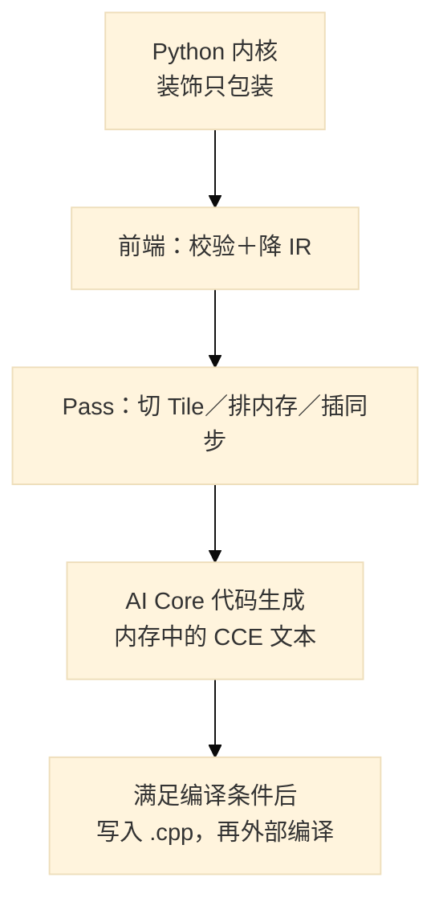
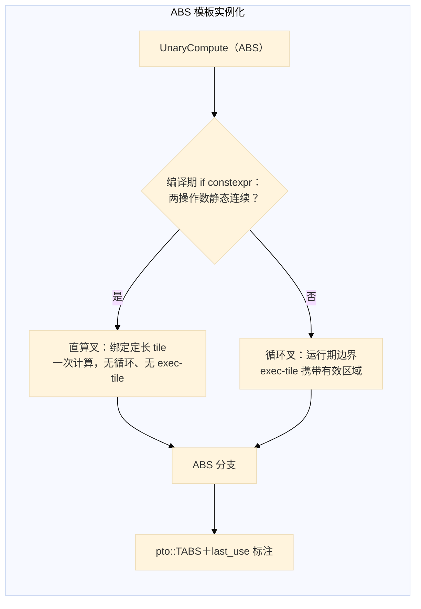

# 第25章 PyPTO：Python 内核的编译之旅

## 25.1 问题：四行 Python 与芯片指令之间隔着什么

第 24 章的 tile 程序要手写布局、手排指令；PyPTO 承诺的则是另一端体验——用 Python 写算子，编译器替你切块、排布、插同步，最后落到 PTO 虚拟指令。仓库首页对这条链的概括是一句话：「编译结果通过 CodeGen 生成底层 PTO 虚拟指令代码」[^1]。这句承诺横跨 Python 前端、C++ 编译框架与设备运行时，值得用最小的例子全程走一遍。主角就是官方入门示例里最短的一个：

```python
# 节选自 pypto/examples/01_beginner/compute/elementwise_ops.py L76-79
@pypto.frontend.jit(runtime_options={"run_mode": global_run_mode})  # 模式由命令行 --run_mode 解析（L33/L48）
def abs_kernel(x: pypto.Tensor([], pypto.DT_FP32), out: pypto.Tensor([], pypto.DT_FP32)):
    pypto.set_vec_tile_shapes(2, 8)                        # 切分粒度提示（最终配轴见 25.2）
    out[:] = pypto.abs(x)                                  # 没有返回值，结果写入 out
```

示例自带的测试把它用在 `x = torch.tensor([-1, -8, 2], dtype=torch.float32)` 上，**数学预期输出 `[1, 8, 2]`——这是按 abs 语义推得的预期，本书未在本机执行过该例，下文所有"输出"均为此类预期而非实测**[^2]。示例同时定义了输入 `[-1, -8, 2]`、`torch.empty` 出同形状 `out`，调用 `abs_kernel(x, out)` 后用 `assert_allclose(rtol=1e-3, atol=1e-3)` 对拍；注意断言只在 NPU 模式下执行，CPU 模式下无断言、仅打印[^2]。

先立边界：本章写作时的环境**没有 CANN 安装、没有 pybind11、没有预编译 so**，因此全书对本章机制的核对方式是读源码与官方文档，唯一执行过的检查是 Python 语法级编译（25.6）；编译链与设备路径均未运行，涉及处逐一注明。在这样的约束下，四行代码到芯片要经过四道工序——**前端约定、两级编译、代码生成、分支执行**，本章一节一问。



*图 25-1：**概念编译数据流**，非调用时序——纯 host 分支在本分支内自行调用 `compile`，`LaunchKernelTorch` 两路的编译由绑定内部驱动，故不画统一全序；门与停止点见 25.4，运行分派见表 25-1。*

**装饰即包装，调用才编译。**`@pypto.frontend.jit` 在装饰期只做一件事：把原函数连同捕获的闭包变量包进 `JitCallableWrapper`，源码注释明写「Create wrapper without compiling - defer to first call」[^3]。真正的编译发生在第一次调用：先按「源码 + 各类选项 + 闭包 + 非张量实参」算缓存键，未命中则构造 C++ 侧 `KernelModule`（缓存日志原话「recompile=True」）[^3]；随后进入执行分派（25.5）。这两层之间 pybind 内部如何衔接，本书未逐行核，不展开。

## 25.2 前端约定：注解、out 与一句 tile 提示

写 PyPTO 内核，只有三条约定必须先懂，都体现在主例里。

**第一条:注解管校验,`[]` 表示不锁形状。**参数注解 `pypto.Tensor([], pypto.DT_FP32)` 中 dtype 是强约束--运行时把 torch dtype 经映射表比对,不符直接 `ValueError`[^3];而 shape 写空列表的含义是"跳过形状检查":校验函数只有在该注解 shape 非空时才进入维度比对(`if len(input_tensor_def.shape) != 0 or ...` 分支)[^3]。所以**不要把 `[]` 读成"零维标量"**——主例实际传入的是一维张量 `[-1, -8, 2]`；空 shape 只跳过形状比对这一项，连续性、输入个数等其余校验照常执行，本注解实际新增的约束只有 dtype。需要锁形状或声明动态维时,注解里写具体数字或 `SymbolicScalar`/`DYN`,后者会被收集成 `dynamic_axis` 传入后端(25.6)[^3]。

**第二条：没有返回值，结果写进 `out`。**包装器文档原话：「All tensors (including output) are passed as arguments... This method returns None; caller holds output tensors」；返回值注解不参与任何校验[^3]。`out[:] = pypto.abs(x)` 里的 `pypto.abs` 是框架算子表里的普通成员，最终转到 C++ 绑定 `pypto_impl.Abs`[^9]。

**第三条：`set_vec_tile_shapes(2, 8)` 是提示，不是承诺。**它向切图阶段提供 `(2, 8)` 这组向量 tile 参数（本例的最终配轴仍需查看 IR），官方约束随之而来：tile 维数不超过 5、尾轴切分满足 32B 对齐（8 个 float 恰好 32B）、切分块数过多会让在线循环展开爆掉编译（经验值 `(TensorShape/TileShape)×(1+输入数) < 18000`）[^8]。官方文档同时说明：通常改 tile 形状不影响结果、只影响耗时——前提是不取极端值[^8]。

**那 shape(3,) 配 tile(2,8)，每块到底多大？**机制层可确证：切图阶段有个"形状调和"环节，对逐元素算子的默认规则是**把 op 级 tile 沿各轴钳到操作数自己的形状**（resolver 注释原话「clamped to the operand's own shape (elementwise)」），有效区域可用"容量形状 ＋ 有效形状"表达——容量块照常开，有效区域收缩到实际元素数，生成代码里 tensor 的 shape 取有效形状、stride 取原始形状[^9]。这与第 24 章 Tile 的容量/有效二象性是同一份合同。但 resolver 注释是通用规则，**本例两个 tile 值最终落到哪些轴、钳制后各是多少，必须看到切图后的 IR 才能确证——本书未生成该 IR，不给数字，也不推断单块还是多块**；能核的只有约束侧：8 个 float 恰为 32B，满足尾轴对齐要求[^8]。

## 25.3 编译：前端降 IR，后端切图

编译分两级，读者只需要记住分工：**Python 侧把语言降到 IR，C++ 侧把 IR 切成芯片形状。**

Python 侧是一条新 IR 流水线：函数先经 PIL 前端变成 IR 函数，再进默认管线——token 推导、两轮"规范化+死代码消除"、语句合并、根函数划分、动态函数定型[^4]。每一步前后都可把 IR 文本 dump 到 `TensorGraph/IR/ir_dump_*.txt`（开关 `KEY_PRINT_GRAPH`）[^4]，这是读者能拿到的第一份中间产物。顺带修正一个文档坑：`jit` 的 `new_ir` 参数 docstring 写"默认 False"，代码默认值实为 `True`，以代码为准[^3]。

C++ 侧是一条 40 余个 pass 的主流水线（策略名 `PVC2_OOO`），官方文档对其产物有权威的一段话：Tensor Graph 阶段做硬件无关优化；Tile Graph 阶段"将 Tensor 分解为 Tile、Operation 分解为 TileOp，依据硬件内存层级自动推导存储位置，必要时插入内存搬运节点"；Block Graph 阶段"切分为单个 AI Core 上的子图，做指令编排、片上内存分配、同步操作插入"；Execute Graph 描述块间依赖供调度[^6]。本章不罗列 pass 名单，只举主例会用到三类：类型转换类 pass 处理 dtype 提升；`GRAPH_PARTITION` 完成上述 Tile 化；`INSERT_SYNC` 在块内插入同步。想在中途停下来看图，六个 `CompStage`（Tensor/Tile/Execute Graph、Codegen 指令/二进制等）配合两个哨兵 pass 即可截断，`compile_debug_mode=1` 则把每步前后图落成 json——官方调试文档给了完整的文件名样例[^5][^12]。

## 25.4 生成代码：CCE 壳、TileOp 调用与 PTO 落点

码生成按代际分派：`DAV_2201/DAV_3510` 走 cloudnpu 后端，LiteNPU 另走一路[^7]。产物是一个 CCE 文本，骨架固定：头部 `#include "TileOpImpl.h"` 与 `tilefwk/aicpu_common.h`，内核签名 `extern "C" [aicore] void <magic>_<hash>_<子程序>_<tiling位域>(...)`——内核名由确定性位域拼装，多线程码生成下可复现（这是 fixed-cce 调试的地基）[^7]。片上地址在码生成期已定：pass 阶段分配的 `memoryrange` 直接翻译成 `UB_S0_E1024 = ...get_imm(0x...)` 这样的立即数绑定[^7]。

**abs 到了设备侧为什么分两路？**`TAbs` 只是入口，真正干活的是模板 `UnaryCompute<UnaryOp::ABS>`[^9]。它先看目的操作数的前三维，有零维直接返回；然后回答一个问题——**两个操作数是否满足「静态连续」**（编译期即可判定：形状静态、步长紧凑；单维形状直接算满足，多维逐个操作数检查）[^9]。满足这个实现的静态判据时，就采用一次绑定地址、直接计算的路径，**连循环都省掉**；不满足，就按**运行期**形状三重循环逐块推进，每轮给目的 tile 定位，源的边界信息由 exec-tile 携带。该路径通过有效区域参数处理边界，不能据此推断所有生成内核的尾块策略。两条路最后汇入同一处：ABS 分支里一条带 last_use 标注的 `pto::TABS`[^9]。**主例走哪条路取决于模板实参的编译期判定，本书未生成 IR，不断言**；能确定的只有：通用叉的循环边界是运行期形状，动态 shape 时即有效形状。

**PTO 头从哪来？**分两种渠道，本书按门控严格区分。其一，**显式注入**：当码生成选项 `codegen_support_tile_tensor`（默认 false）开启时，`GetPtoTileLibPathByEnv` 按优先级找一份 `include/pto`——先看环境变量 `PTO_TILE_LIB_CODE_PATH`（**其值指 pto-isa 仓库根，即含 `include/` 的目录**，代码断言 `<值>/include/pto` 存在），再看 CANN 包内 `ASCEND_HOME_PATH/include`；找不到直接断言失败[^7]。其二，**头链包含**：设备 tileop 层自身 `#include "pto/pto-inst.hpp"`（`tileop_common.h`，被 arch32 动态头与分布式头包含）、共享内存头包含 `pto/comm/pto_comm_inst.hpp`[^9]——这条链不受上述开关控制，但最终是否进入编译单元取决于具体 tileop 与架构路径，本书不对"所有模式都含 pto 头"做泛化。安装面的事实是：whl 会把 `tileop/`、`tilefwk/` 整目录作为"运行时编译 aicpu/aicore 所需二进制依赖"打包（CMakeLists 注释原文），而 pto-isa 自身不在 pypto 的安装清单里，是否随 CANN 分发需读者按环境核实[^7]。

**为什么拿到了 cpp 不等于拿到了可执行结果？**进入这里的 AI Core 子函数代码生成路径后，先在内存中拼接 CCE 文本（AICPU 子函数另有提前返回路径）；但把它写成 `.cpp` 文件、再交给 `bisheng` 编出 `.o`，两步都包在同一道门里——`BUILD_WITH_CANN` 编译开关加 `ASCEND_HOME_PATH` 环境变量，细节与例外见脚注[^7]。门没开，文本只活在内存里；门开了而编译失败，则 cpp 在、结果悬——而且**不能据此断言 `.o` 不存在**：可能有旧产物、也可能并行的多个编译任务只成功了一半，只能说**不能保证得到有效的新二进制**。`COMPILE_STAGE=CS_CODEGEN_INSTRUCTION` 是给读码准备的停止点：**停在 cpp 已落盘、外部编译还没开始**；它本身位于门内路径上，门没开时连这个停止点都到不了。编译命令携带的代际/核型宏与 include 路径见脚注[^7]，tile-tensor 模式开启时 `-I <pto-isa>/include` 也在此拼入。



*图 25-2：abs 设备侧两叉。**选择发生在编译期**（`if constexpr` 实例化），不是设备运行时分支；直算叉与循环叉各自独立成码，直算叉不经 exec-tile；`pto::TABS` 为两叉汇合点。host 侧码生成与外部编译门见图 25-1，行号见脚注 9。*

## 25.5 执行：同一入口，三种设备事实

运行模式先由显式选项或默认环境推断确定。进入 `_execute_kernel` 后，非空的 `CAMODEL_LOG_PATH` 会把它覆盖为 SIM，然后才按下表分派[^3]。

NPU 档与精度仿真档都会调用 `LaunchKernelTorch`，所以入口名称不能证明是否使用真设备。C++ 的 `KernelBinary` 还会依据 `CFG_RUN_MODE` 选择设备或仿真的参数处理路径[^10]。表中的环境条件只检查变量值，并不验证 CANN 安装或编译工具链是否完整。

host 分支在内部显式调用 `compile`；另外两条分支经绑定进入后端。因此图 25-1 表示编译产物之间的关系，不表示三条执行路径共用一条调用时序。

*表 25-1：`_execute_kernel` 分派（顺序即代码顺序）*

| 序 | 判定 | 动作 | 设备事实 |
|---|---|---|---|
| 1 | `CAMODEL_LOG_PATH` 非空 | run_mode 覆写为 SIM，继续下行 | cannsim 包装器 |
| 2 | `run_mode==NPU` | `LaunchKernelTorch` | C++ `CFG_RUN_MODE` 定真机/仿真 |
| 3 | 精度档=2 且 `ASCEND_HOME_PATH` 在 | `LaunchKernelTorch`（同入口） | 同上 |
| 4 | 其余 | `DeviceInit＋compile＋_run_with_cpu` | 纯 host，**compile 在本分支内调用** |


三条臂的能力边界，以官方文档原义为准[^12]：

- **真 NPU**：workspace 先查询后 `torch.empty(uint8)` 分配，再连同输入输出与流下发设备执行；错误码非空即抛[^3]。
- **性能仿真**：`_run_with_cpu` 直通 cost model（`CostModelAgent`，受平台开关 `KEY_ENABLE_COST_MODEL` 门控）[^11]。官方表述:性能仿真"支持用户查看算子的核内流水数据"，**无需设备即可运行；自动识别模式下无 CANN 时仅此一档**[^12]。
- **精度仿真**：官方明写"在 CPU 环境获取算子运算结果（**精度仿真依赖 CANN 软件包**）"；950 系经 `cannsim record` 分 CostModel（任务级泳道图）与 CAModel（指令级 trace，配 `accuracy_level=2`）两档。文档还提醒：只跑仿真就别装 TorchNPU，"否则可能运行失败"[^12]。性能仿真按文档只需**无设备**；构建与运行环境依赖（Python 包、PyPTO 构建产物、CANN 与否）是另一回事，见 25.6 复现。精度仿真则明确依赖 CANN 软件包；"精度仿真与 NPU 执行一致"是文档声明，本书未实测。

调试面上，编译期 `compile_debug_mode` 与运行期 `runtime_debug_mode`（泳道图/AICORE 模型/依赖校验/GM 越界注入 `CheckInvalidAccessOfDDR...trap()`）各有档位，前节 json 样例即出于此[^5][^12]，本书不再展开枚举。

## 25.6 边界、复现与未决

**能力边界**：

- **动态形状**：已核链路：注解 `DYN/SymbolicScalar` → `dynamic_axis` → IR 侧动态函数定型 → 码期 `GET_PARAM_*_BY_IDX` 宏取形状/偏移[^3]。
- **校验范围**：dtype 只对显式注解生效；空 shape 仅跳过形状比对，**连续性、输入个数、算子自身限制照常**[^3]。
- **同步与内存**：主例路径上用户无需插手——pass 插同步（`INSERT_SYNC`）、码生成落 `get_imm`；对比第 23/24 章的手工事件流，这正是两套抽象的分工线。

**复现步骤与验证范围**：

```bash
# ① 只读核对（不改源仓；2026-10-10 实测：工作树干净，HEAD=883e7df）
git -C /mnt/SATASSDEXT4/cann/pypto status --short
git -C /mnt/SATASSDEXT4/cann/pypto rev-parse HEAD
# ② 语法级检查【本机已验】；PYTHONPYCACHEPREFIX 把 pyc 定向 /tmp，源树零写入
PYTHONPYCACHEPREFIX=/tmp/ch25-pycache python3 -m py_compile \
  /mnt/SATASSDEXT4/cann/pypto/examples/01_beginner/compute/elementwise_ops.py \
  /mnt/SATASSDEXT4/cann/pypto/examples/01_beginner/basic/basic_ops.py
# 日志：management/validation/ch25-evidence-close-check.log
# ③ 构建【本机未满足依赖，仅给流程】：每次 mktemp 新目录再复制，绝不在只读源仓内 build
WK=$(mktemp -d) || exit 1
printf "WK=%s\n" "$WK"
cp -a /mnt/SATASSDEXT4/cann/pypto "$WK/pypto" || exit 1
cd "$WK/pypto" || exit 1
python3 build_ci.py --clean --no_isolation   # 或 pip install -e . --no-build-isolation（需 pybind11≥2.13.6、python3-dev；BUILD_WITH_CANN 默认 ON 需 CANN）
# ④ 运行【依赖③成功】：NPU 模式需设备并 export TILE_FWK_DEVICE_ID；SIM 模式如下
python examples/01_beginner/compute/elementwise_ops.py abs::test_abs_basic --run_mode sim
# ⑤ 中间产物：KEY_PRINT_GRAPH → <LogTop>/TensorGraph/IR/ir_dump_*.txt；
#    compile_debug_mode=1 → output_*/Pass_<NN>_*/{Before,After}_*.json（官方调试文档样例）
```

①②为本轮实跑（日志见 `management/validation/ch25-evidence-close-check.log`，含源仓 `git status` 干净的核对）[^13]；③④⑤本机因缺 CANN/pybind11 **未执行**，命令按上游文档与脚本帮助整理，读者环境自验。

**未决与未核清单**（正文已按此收口，不冒充结论）：tile(2,8) 在一维形状上的最终配轴——需切图后 IR；`TAbs` 专属展开与 A2/A3 特化——只核到宏与骨架；pybind 侧 KernelModule 与 Python IR 管线的衔接细节；pto-isa 是否随 CANN 包分发；精度仿真数值等价性——文档声明。另有两处文档/代码矛盾已按代码口径书写并在脚注注明（`new_ir` 默认值；快速上手文档如 ch24 已勘误处不重述）。

## 陷阱与注意

- **`[]` 注解不是标量**：它关闭形状校验；dtype 才是强约束。想要标量语义需显式注解。
- **run_mode 别只看入口名**：`LaunchKernelTorch` 在真设备与仿真档都会出现；判定设备看 `CFG_RUN_MODE` 与是否 cannsim 包装（`CAMODEL_LOG_PATH`）。
- **性能仿真 ≠ 精度仿真**：前者无设备可跑，后者依赖 CANN；"与 NPU 一致"是文档承诺。
- **tile 参数有约束**：逐元素规则会调和 tile 与操作数形状；尾轴对齐和展开规模也需检查。不能只凭提示值推断最终分块。
- **PTO 头注入是条件路径**：复现章节命令时若结果缺 pto 头，先查 `codegen_support_tile_tensor` 与 `PTO_TILE_LIB_CODE_PATH`（仓库根！）再怀疑环境。

## 本章来源

[^1]: `pypto/README.md` L20（「编译结果通过 CodeGen 生成底层 PTO 虚拟指令代码」）；四层架构另见 `pypto/docs/zh/tutorials/introduction/introduction.md`。
[^2]: `pypto/examples/01_beginner/compute/elementwise_ops.py`（L20-33 起 `_peek_run_mode_from_argv`（L33 定义/L48 调用）；L76-79 abs_kernel；L84-104 `test_abs_basic`：输入/empty/调用、L98 断言仅 NPU 分支、L99-100 `assert_allclose(rtol=1e-3, atol=1e-3)`）。
[^3]: `pypto/python/pypto/frontend/parser/entry.py`（L1219 起 decorator_wrapper「defer to first call」；缓存键与 `KernelModule`「recompile=True」日志；L690 形状跳过分支、dtype 校验与 `_dtype_dict`、`__call__` docstring「returns None」；L638 起 `_execute_kernel` 三段与 `CAMODEL_LOG_PATH`覆写、L651 精度档条件；L890 起 `_set_run_mode` 与「NPU is not available.」；L1063/1077 `_run_with_cpu→_cost_model_run_once_data_from_host`；L1144 `new_ir: bool = True`——docstring「False」过时；`dynamic_axis` 收集与 `GET_PARAM` 见同文件及码生成）。
[^4]: `pypto/python/pypto/pil/compile_pipeline.py`（L20-26 dump 至 `LogTopFolder()/TensorGraph/IR`；L29-45 默认管线七步；L57 起 `compile_new_ir`）。
[^5]: `pypto/python/pypto/config.py` L24-31（`CompStage` 六值）与 `pypto/framework/src/interface/configs/config_manager_ng.h` L73-82（`CS_*` 同值）、L96-101（debug 档位）。
[^6]: `pypto/framework/src/passes/pass_mgr/pass_manager.cpp`（L80-126 `BuildPvc2OooPassEntries` 全序；L186-190 策略注册；L287-288 哨兵 `ExpandFunction/SubgraphToFunction`；`RunPass` 与断点续跑）、`pypto/framework/src/passes/pass_mgr/pass_registry.h` L36、`pypto/framework/src/passes/pass_mgr/pass_manager.h` L37；四层图语义引 `pypto/docs/zh/tutorials/debug/debug.md` 图编译流程节（Tensor/Tile/Block/Execute 四条 bullet 原文）。
[^7]: `pypto/framework/src/codegen/npu/codegen_npu.cpp`（`GenCode` L270-315：AI Core 路径文本入 `leafKernelFunc` L281-283，前有 AICPU 提前返回分支、`#ifdef BUILD_WITH_CANN && getenv` 门 L293-298/307-310；`GenCodeToBinaryTask` L370-383；`IsNeedDumpCode/DumpCode` L385-417 `KEY_FORCE_OVERWRITE` 默认 true；`PrepareCmd` bisheng 全参；`BuildIncludes`；`GetPtoTileLibPathByEnv` 首句开关+两优先级+断言；`GenAlloc` get_imm；`CompileCode` L490-499 与 `ExecuteParallelCompile` L833-835 的 `CS_CODEGEN_INSTRUCTION` 截断、`DoCompileCmd` ASSERT）与 `pypto/framework/src/codegen/npu/codegen_npu.h`（L36 环境变量名；L44-58 确定性位域注释）；`pypto/framework/src/codegen/codegen_factory.h` L38-42 分派；`pypto/CMakeLists.txt`（`BUILD_WITH_CANN` option 注释；tileop/tilefwk 整目录 install 及「运行时编译所需二进制依赖」注释；pto-isa 不在清单——未核随 CANN 分发）。
[^8]: `pypto/docs/zh/tutorials/development/tiling.md`（使用约束节：维数匹配/`…<18000`/vec 维数≤5/尾轴 32B 对齐/cube 32B；「通常设置不同的 TileShape 不影响……结果，但是会影响……运行时间」；完整样例 `pypto/examples/01_beginner/tiling/tiling_config.py`）。
[^9]: `pypto/python/pypto/op/math.py`（`def abs → pypto_impl.Abs`）；`pypto/framework/src/codegen/npu/codegen_op_npu.cpp`（`unaryOps_` 表 `OP_ABS→GenUnaryOp`；`UpdateTileTensorShapeAndStride` 有效形状/原始步长分离；`BuildTileTensorShapeInLoop`「Get last 2 dim」；`GetLoopAxes`）；`pypto/framework/src/interface/tileop/vector/unary.h`（L400-405 `OP_TILE_OP_ABS TAbs`；`UnaryCompute` L124-156：L126-131 前三维零返回、L135-142 `IsConstContinous` 直算叉、L143-153 三重循环＋exec-tile 叉；`UnaryComputeImpl` L60-63 ABS 分支 `PTO_WITH_LAST_USE(pto::TABS,…)`）；`pypto/framework/src/interface/tileop/utils/layout.h` L349-367（编译期静判）；`pypto/framework/src/interface/tileop/vector/pto_tile.h` L25-27/L306-343）；`pypto/framework/src/interface/operation/tile_shape_resolver.h` L21-42（「clamped to the operand's own shape (elementwise)」）；`pypto/framework/src/interface/operation/tile_shape_verifier.h`（`VERIFY_TAIL_ALIGN`）；`pypto/framework/src/interface/tileop/tileop_common.h` L39、`tileop_shmem.h` L26。
[^10]: `pypto/python/pypto/runtime.py` L38（`RunMode`）；`pypto/framework/src/machine/runtime/runner/kernel_binary.cpp`（构造器 SIM→`EslModelMemoryUtils`/else `DeviceMemoryUtils`；`InitDeviceArgs` once-call 内 SIM 跳过 LoadAicpuOp/DevicePerf/Adump）；`pypto/framework/src/machine/runtime/launcher/{emulation,eslmodel,aicore_model,device}_launcher.*` 目录存在性。
[^11]: `pypto/framework/src/cost_model/simulation/backend.cpp`（`CostModelAgent::BuildCostModel`：`GetSimConfig(KEY_ACCURACY_LEVEL,2)`、`-a` 透传；`ExecuteSimulation` 入口 `KEY_ENABLE_COST_MODEL` 门；`SubmitToCostModel/RunCostModel`）；Python 侧 `pypto/python/pypto/frontend/parser/entry.py` L29 import。
[^12]: `pypto/docs/zh/tutorials/debug/debug.md`（CPU 仿真节：性能/精度仿真定义、「精度仿真依赖 CANN 软件包」、run_mode 选择逻辑、「请勿安装 TorchNPU，否则可能运行失败」、950 cannsim CostModel/CAModel 两档、「精度仿真与 NPU 执行一致」；NPU 上板调试节 `compile_debug_mode=1` 产物树；`pypto.set_global_config("simulation.accuracy_level", 2)`）；错误码与配置另见 `pypto/docs/zh/tutorials/appendix/trouble_shooting/simulation.md`、`pypto/framework/src/cost_model/simulation/config/`。
[^13]: 检查与核对记录：`management/validation/ch25-evidence-close-check.log`（2026-10-10：源仓 `git status` 干净、`git log -1`=883e7df、`PYTHONPYCACHEPREFIX` 语法检查 OK）；本章经理最终 verify/bash-n/截图见 `management/validation/ch25-release-verify.log`、`ch25-release-bashn.log`、`ch25-manager-fig{1,2}.png`；证据底稿 `management/CH25-EVIDENCE.md` rev2。
