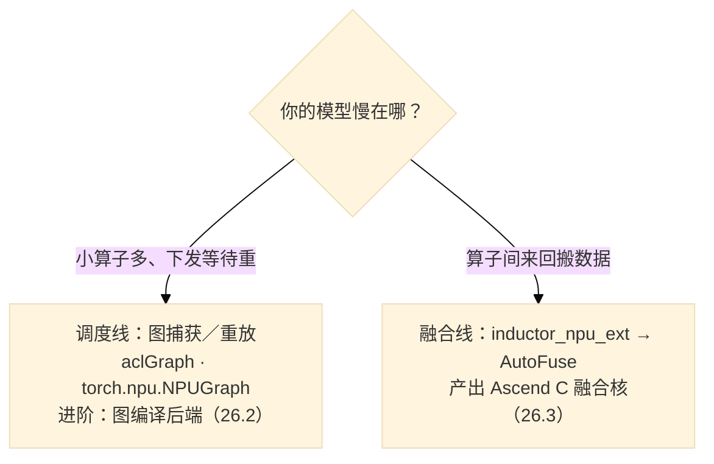
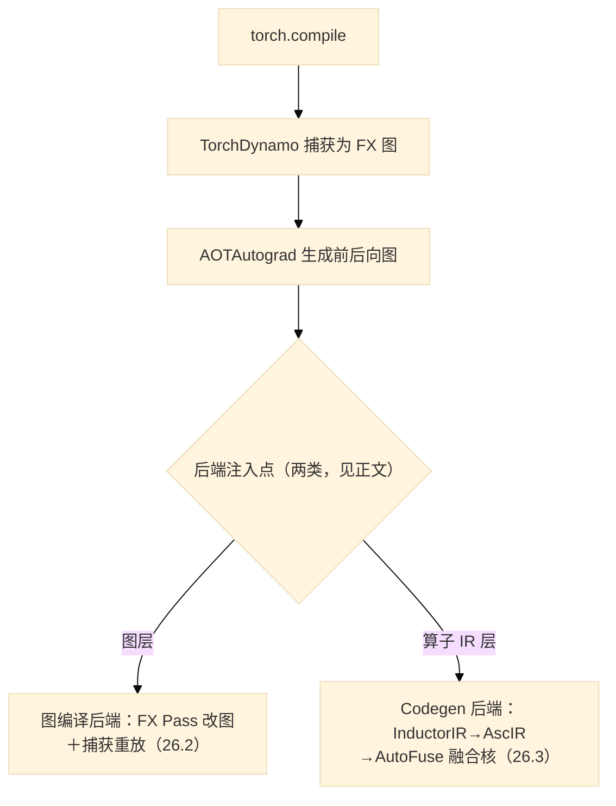

# 第26章 生态与接入：已有 PyTorch 模型，从哪进入昇腾

## 26.1 先问两个白话问题

假设你手上有一个在 GPU 上跑得好好的 PyTorch 模型——也可能外加几个自己写的算子——现在要让它在昇腾上跑得更好。本章不罗列工具名字，先帮你把问题问对，因为**不同的问题对应完全不同的入口**。

第一个问题：**时间花在哪？**把模型跑慢的原因粗分两类。一类偏**调度**：模型由大量小算子组成时，每个算子都要向硬件"报到"一次——下发、排队、启动，算子越碎，这类开销往往越显眼。另一类是**执行开销**：算子内部来回搬数据，比如A算子的结果先搬回显存、B算子再搬进去，计算本身不长，搬运来回了两次。前者的解法是**图捕获与重放**，后者的常见对策是**算子融合**——合并算子以**减少算子间显存往返并少几次启动**；但是否还需 GM 中转取决于实现，第 17 章就有融合后仍经全局显存中转的反例。两类**关注重点**不同、手段有重叠，这是本章需要先建立的区分（26.2、26.3 分别展开）。

第二个问题：**你愿意改多少？**几乎不改（换用已适配的推理框架或其配置）；改几行，用图捕获接口或给 `torch.compile` 换后端；再进一步，在编译器的图上做自己的变换；最后才是亲自写算子。这四档是**可选的入口，不是必经的调用栈**——不存在"必须从框架层一路穿过算子层"的路径，每档都是并列的选择，按需取用即可。

| 你的情况 | 更可能的入口 | 本书章节 |
|---|---|---|
| 只想直接部署推理 | 已适配的推理框架（集成现状见 26.6 的说明） | 26.6 |
| 怕调度等待、算子碎 | 图捕获/重放，或图编译后端 | 26.2 |
| 怕小算子来回搬数据 | 自动融合后端 | 26.3 |
| 要按硬件特点改计算图 | 编译器的自定义图变换 | 26.4 |
| 算子逻辑要自己写 | 算子语言层 | 26.5、第 9–25 章 |

## 26.2 调度开销：图捕获一次，重放多次

**图捕获与重放**（capture and replay）白话版：把一段计算连同它的资源安排"录制"成一条指令带，之后每次执行直接**回放**，不再重新逐个下发。省的是下发与调度等待——录一次，放多次。它的收益边界也在此：算子内部该搬的数据还得搬，单纯重放并不改写单个算子的内部计算。

昇腾侧的底座叫 **aclGraph**。它的世界模型很简：**流（stream）是任务的队列，同队按序执行；跨队列的先后约定靠事件（event）**——一队 record、另一队 wait，秩序就建立了。任务（task）分两种：承载内核信息的 Kernel Task 与承载同步语义的 Event Task[^2]。硬件调度器据此在多条流上排布任务，跨流依赖全部显式表达[^2]。

到了 PyTorch 侧，aclGraph 的能力被封装成对等接口，博客给出的用法形如：

```python
# 转述自 CANN npugraph_ex 图模式优化文 §1；本书未运行，读者须按官方文档核对后使用
g = torch.npu.NPUGraph()
with torch.npu.graph(g, stream=s):          # 捕获：这段计算进"指令带"
    static_output = model(static_input)
g.replay()                                   # 重放：免重新下发
```

**手工捕获要自己管地址与生命周期**：捕获阶段会把图相关的内存地址**固化**，所以**单次捕获内**地址安排是固定的——重放所用的输入/输出缓冲区需要落在捕获时的地址上并保住生命周期，具体能怎样更新、何时必须重捕，以官方接口文档为准（示例变量名 `static_*` 只是命名，不构成能力推断的依据）。这意味着**手工管理捕获与输入缓冲区有额外负担**，需要按接口约束管理每份捕获。

另一种选择是把多 shape 交给**自动图后端**：以 `torch.compile` 为入口的 npugraph_ex（经 TorchAir 接入，26.3 表汇总其位置）。它在 FX 图层代管多份捕获：**同一张 FX 图可被多次捕获**，`dynamic=True` 时每见新 shape 即触发一次新捕获。

内存上，该后端配了两类池策略——同一张 FX 图的多次捕获之间默认共享内存池；跨 FX 图的池复用默认关闭、须自证无内存踩踏后再开[^3]。注意这些**多图与内存池策略是自动图后端的管理手段**，不是手工 `NPUGraph` 接口的参数，也不是捕获机制本身对任何 shape 的承诺。

什么时候值得上图？原文给出的恶化信号有两个：图里**小粒度 Kernel Task 很多**，或**跨流依赖频繁**——两者都会让调度等待随图规模放大[^2]。反过来，网络由少量大算子构成时，重放的收益就有限（这是从上述机制而来的推断，非原文结论）。



*图 26-1：两类开销、两条并列的线。按开销类型择一入手即可，两线之间无先后依赖；各线内部的递进（图编译后端建立在捕获重放之上）见对应小节。*

## 26.3 执行开销：自动融合，让小算子长在一起

**融合**白话版：把相邻的小算子合并成一个内核，**有机会减少算子间显存（GM）往返，同时少几次启动**；合并之后是否仍需 GM 中转，取决于具体实现——第 17 章就有融合后仍经全局显存中转的反例。

手工融合要重写算子，成本高；CANN 的 **AutoFuse** 把这件事自动化——它的输入是一种图（AscGraph），输出是可直接编译的 Ascend C 融合核，中间三步：**Schedule** 先生成多个候选实现，**Auto Tiling** 对每个候选**估算**耗时、选出估算较优的切分，**Codegen** 为**每张**候选 ImplGraph 各生成一个模板函数，执行入口再按 TilingKey（由 AutoTiling 的参数传递）选定本次真正执行的那一个[^5]。对读者的意义：切分这种"手艺活"被变成了自动搜索——但择优依据是**模型估算**，不等于实测全局最优。

在博客给定环境中，接入示例很短：AutoFuse 作为 **Inductor 的 NPU Codegen 后端扩展**存在，把 Inductor 的中间表示转成 AscIR 再交给上述管线[^5]。在版本匹配、扩展已安装的前提下，示例通过导入扩展接入 `torch.compile`：

```python
# 转述自 AutoFuse 文 §使用介绍；本书未运行
import torch
import torch_npu
import inductor_npu_ext        # 导入即启用 NPU 后端扩展

@torch.compile
def add_then_sum(x, y):
    return torch.add(x, y).sum()
```

至此可以把 26.2 与 26.3 并排看清：**图编译后端**（npugraph_ex/torchair 一系）介入在 FX 图层，主攻调度与图变换，内含捕获重放；**Codegen 后端**（inductor 扩展＋AutoFuse 一系）介入在算子 IR 层，主攻融合与切分。两者介入层次不同；**能否同时叠加运行，本书未见证据**，图中与正文均不作组合承诺。此外 torchair 生态还有其他后端，本书只追了这两条有文本记录的线。

| | 图编译后端（26.2 系） | Codegen 后端（本节） |
|---|---|---|
| 介入层次 | FX 计算图 | 算子 IR（InductorLoopIR→AscIR） |
| 主解开销 | 下发/调度等待 | 算子间显存往返与重复启动 |
| 接入改动 | 后端注册/框架集成 | 安装匹配扩展后导入 |
| 证据边界 | 官方博客机制陈述（源码未在本书核查范围） | 同左 |



*图 26-2：资料所描述的链路——前三步为 torch.compile 公开流程的转述，两个注入点分别来自 npugraph_ex 与 inductor_npu_ext 各自的接入记录；**两者的组合方式本书未见证据**，图中不画两路之间的连线。*

## 26.4 想自己动图：FX Pass 与多流语义

如果两条现成路线都不贴合——比如你想把"哪几个算子放到哪条流"这种需要按硬件特点定制的决策写进编译流程——torchair 留了口子：**自定义 FX Pass**。写一个函数，拿到捕获后的图（GraphModule），按自己的规则增删改节点；通过配置注册后，它会在 torchair 的图优化流程中被自动调用，且可选在内置 Pass 之前或之后执行[^4]。

它最有意思的部分是**流控制原语**：在图里插入成对的进入/退出标记即可把一段算子划到独立流上，再用 record/wait 节点表达跨流先后——多流并行从"模型脚本里手动打标签"变成声明式的图变换[^4]。骨架形如：

```python
# 示意转述自 TorchAir 自定义 FX Pass 文；非可运行代码
def my_multi_stream_pass(gm, example_inputs, config):
    for node in identify_pattern(gm.graph):        # 1. 找到目标子图
        wrap_with_stream_scope(gm.graph, node)     # 2. scope_enter/exit 包裹
        insert_event_order(gm.graph, ...)          # 3. record/wait 定序
# 再经 torchair.CompilerConfig 注册，编译时自动生效
```

代价是必须读得懂 FX 图：Pass 里一个错误的节点删除就会改变模型语义。原文特别提醒的捕获期约束也要记住——**进入捕获的流最终必须直接或间接用 Record 回到主流**，否则捕获阶段可能出错[^3]。

## 26.5 最终自己写：语言怎么选

走到"自己写算子"这一步，可选项与本书的覆盖如下：

| 语言/形态 | 一句话定位 | 本书何处 | 证据边界 |
|---|---|---|---|
| Ascend C | C++ 模板 DSL，手工管内存与流水 | 第 9–18 章全链 | 本仓源码级 |
| PyPTO | Python 写 tile 程序，编译到 PTO 虚拟指令 | 第 24–25 章 | 本仓源码级 |
| TileLang-Ascend | Python 近数学语法的算子 DSL，官方博客有 FA/SFA 优化与 xLLM×Qwen3.5 算子适配实践 | 本章仅此 | 官方博客[^6]；源码未在本书核查范围 |
| PyAsc | 官方学习路径提及的 Python 原生底层编程，规划 Layout 化 Tensor/SIMT 方向 | 本章仅此 | 官方学习路径与 hub 栏目页[^6]；源码未在本书核查范围 |

两点提醒。其一，**PyAsc 的"建设中"是教程栏目建设状态，不能据此判断产品可用与否**——本书对它只写到定位句为止。其二，一个常见混淆：**"Kernel 直调"不是一种算子语言**，而是**调用方式**——原文的落点很具体：Ascend C 异构混编里用 Host C++ 的 `<<<>>>` 内核调用符直接调设备侧函数，以及面向 Python/PyTorch 调用的 AscendOps 工程模板[^6]。本文关于 Kernel 直调的陈述亦以此两处为限；它因此不入上表，只在此注记。至于选哪个，本书不做排名——各方案的证据边界与覆盖面不同，且各自由不同团队以不同节奏演进，请以各自仓库与文档的现状为准。

## 26.6 集成现状与几点说明

回到最实际的部署问题：**"我什么都不改，图模式就自动生效吗？"**稳妥的答案是：**接入代码合入≠默认启用**。原文的表述是——vLLM、SGLang 等热门推理框架"提供了其默认的图模式后端"，而 npugraph_ex"可以无缝集成"进这些工作流，"相关代码已经合入至对应社区"，并给出两个**独立**的接入记录：vLLM 经 vllm-ascend 仓库的 PR、SGLang 经其自身仓库的 PR[^3]。这证明的是**集成路径存在**；你的版本里默认后端是谁、要开哪个开关，属于各社区仓库的配置，请部署前直接查所用版本的配置项。

最后统一交代本书的来源边界，以免重复：本章机制描述均出自 **CANN 官方博客**并逐处脚注[^1]；torchair、inductor_npu_ext、vllm-ascend/sglang 与 PyAsc、TileLang 的**源码未在本书核查范围内**，文中不对其内部实现作断言；原文中的性能数字因测量口径不完整未录入正文；资料快照为 2026 年 8 月，这些项目演进很快，引用前请核对时效。环境自查（本书未运行，仅供参考）：确认 `torch/torch_npu/torchair/inductor_npu_ext` 可导入及版本匹配，编译缓存与产物写入 `/tmp` 或自建目录，不在只读源码树内产生文件。

## 陷阱与注意

- **先定位开销**：图重放侧重下发与调度，融合也可能减少搬运和启动；收益应结合实际瓶颈验证。
- **shape 边界分两层**：手工捕获单次内地址固化，换 shape 按接口约束重捕；自动图后端的多 shape 策略（dynamic 开关）属该后端的图管理，别混用两个层面的承诺。
- **合入≠默认**：vLLM/SGLang 的接入 PR 只证明路径存在；默认后端以你部署的框架版本配置为准。
- **FX Pass 改图**：进捕获的流必须 Record 回主流，否则捕获期报错；改图前先懂 FX。
- **Kernel 直调是调用方式**（Ascend C 混编 `<<<>>>`／AscendOps 模板），不是一种新语言，证据亦限此范围。

## 本章来源

[^1]: `cann-learning-hub/README.md` L178-196（blogs 索引及月份标注；资料快照锚：单篇最后提交日期经 `git log --date=short` 实测——aot/autofuse 2026-07-28、tilelang 2026-08-11、torchair FX 2026-03-23；**提交日期≠发布时间**）。
[^2]: `cann-learning-hub/blogs/inference/aot_superkernel_graph_execution/aot_superkernel_graph_execution.md`（Aclgraph 模型：ModelRI/Stream/Task；Kernel Task 与 Event Task（record/wait/reset）字段；调度等待与启动开销两段恶化条件分析；AOT SuperKernel 定义与 Scope/SubTask/同步/入口四要素）。
[^3]: `cann-learning-hub/blogs/inference/npugraph_ex_aclgraph_graph_mode/CANN npugraph_ex图模式优化.md`（§1 `torch.npu.NPUGraph` 捕获/重放示例与"对等封装"句；§2.1 Host tiling 刷新两阶段；§2.2 内存复用两机制与 dynamic=True/False 差异、捕获期固化地址句；§2.5 捕获流须 Record 回主流；§3 集成：vllm-ascend PR 4700 与 sgl PR 13410 两独立记录、"提供了其默认的图模式后端"、"相关代码已经合入至对应社区"——**无默认启用表述**）。
[^4]: `cann-learning-hub/blogs/inference/torchair_fx_pass_multi_stream/TorchAir自定义FX Pass.md`（Pass 签名 gm/example_inputs/config；post_grad_custom_pre/post_pass 两注入点；scope_enter/scope_exit 与 record/wait 原语；三步接入、"原有模型脚本无需改动"）。
[^5]: `cann-learning-hub/blogs/inference/autofuse_torchinductor_deepseek_fusion/autofuse_torchinductor_deepseek_fusion.md`（AscGraph 输入与框架 IR 适配；Schedule/AutoTiling/Codegen 与 TilingKey；"扩展了inductor在NPU上的Codegen后端，InductorLoopIR→AscIR"；使用示例 import inductor npu ext 原文；性能数字见原文表格——因测量口径不完整本书未录入）。
[^6]: `cann-learning-hub/blogs/operator/kernel_direct_call_programming/算子Kernel直调编程.md`（§3.1 Ascend C 异构混编 `<<<>>>`；§3.2 AscendOps 模板面向 Python/PyTorch 调用——调用方式证据限此）；PyAsc 句出 `cann-learning-hub` 引 `asc-devkit/docs/zh/guide/getting_started/ascend_c_overview_and_learning_path.md` L21 与 `cann-learning-hub/README.md` L107（🚧建设中=教程栏目状态）；TileLang 两篇 `cann-learning-hub/blogs/operator/tilelang_ascend_operator_optimization/`、`cann-learning-hub/blogs/operator/tilelang_xllm_qwen35_operator_adaptation/`；第三方集成四阶段 `cann-learning-hub/blogs/inference/npugraph_ex_third_party_framework_integration/第三方框架集成npugraph_ex.md`；外链项目（torchair/inductor_npu_ext/vllm-ascend/PyAsc/TileLang）源码未在本书核查范围，gitcode/GitHub 链接见各原文。
