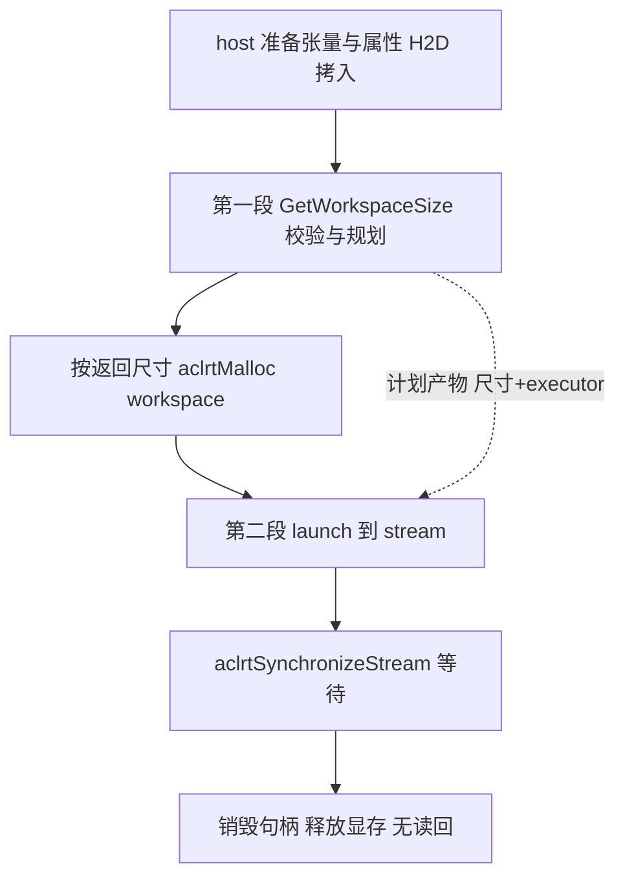
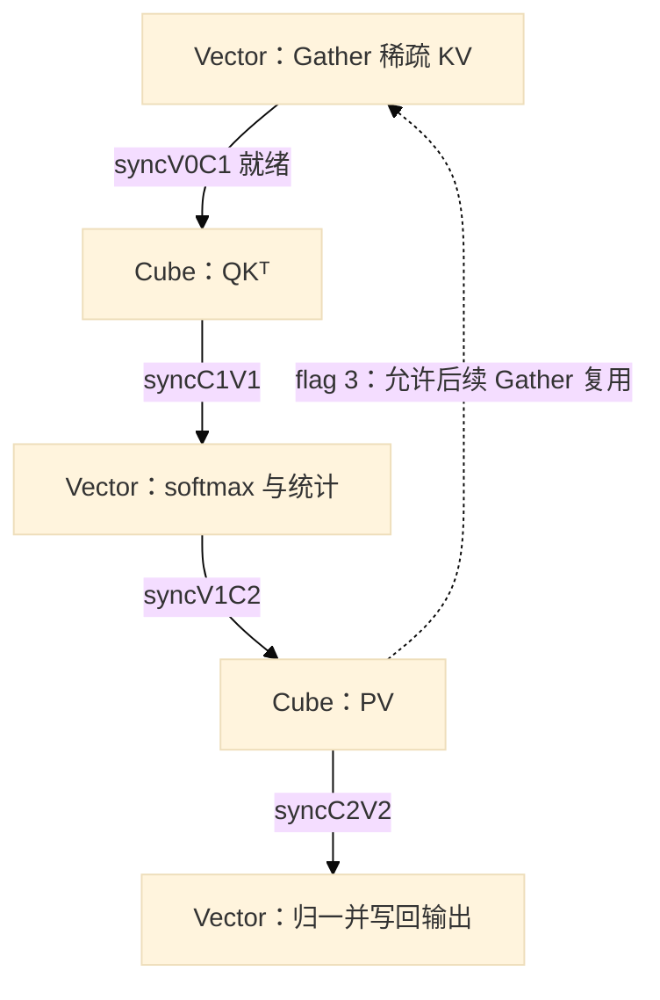

# 第27章 全栈综合案例：一次稀疏注意力的库调用与核验

> 前十八章里你自己写过算子；本章换成相反的姿势——仓库里已经有一个，把它用起来，并且验它。

## 本章目标与阅读指引

本章跟踪一个库算子的调用与实现：ops-transformer 算子仓中的稀疏注意力 `sparse_flash_attention`（下文简称 SFA）[^1]。读完你应能回答四个问题：**用一个仓库现成算子需要提供什么；两段式 API 为什么先计划再执行；稀疏索引如何进入一次 QK/softmax/PV；输出怎样核验、核验的边界在哪**。

两个贯穿全章的区分，先说清楚。其一，**主例 A 与 CPU 参考 B 是两回事**：A 是仓内 C++ 样例的 TND 调用序列，本书**没有运行过它**（无 NPU 环境，样例本身也不读回结果）；B 是本书在 CPU 上对 golden 数学参考的独立复算，shape、scale 与 A 不同。其二，**本章不重复第 18 章的注意力推导**——那里关心的是手写实现的数学，这里关心的是库的工程形态：调用约定、host 分层、核间流水与核验手段。两者差异的源头也先给定：稀疏注意力与稠密注意力的第一区别是**关注集合**——索引与掩码决定了每个 query 与哪个 K/V 子集计算，其次才是实现方式。

## 27.1 调用之前：一个库算子向你要什么

SFA 的 C 语言入口在 `op_host/op_api/aclnn_sparse_flash_attention.h`：`aclnnSparseFlashAttentionGetWorkspaceSize` 与 `aclnnSparseFlashAttention` 一对函数[^2]。调用方要准备的东西，看样例 `examples/test_aclnn_sparse_flash_attention.cpp` 的参数表最直接[^3]：

| 类别 | 张量 | dtype | 形状（TND 语义） |
|---|---|---|---|
| 计算输入 | query / key / value | fp16 | `{T1,N1,D}={1,16,512}`、`{T2,N2,D}={2048,1,512}` |
| 稀疏索引 | sparseIndices | int32 | `{T1,N2,K}={1,1,2048}`，host 侧以 `iota` 填 0..2047 |
| 序列元信息 | actSeqQLen / actSeqKvLen | int32 | `{1}`，值 1 与 2048 |
| RoPE（可空） | qRope / kRope | fp16 | `{·,·,64}` |
| 输出 | out | fp16 | 同 query；softmaxMax/Sum 为 **fp32** 统计量 |

标量参数同样值得逐个看：`scaleValue=0.0416667`、`sparseBlockSize=1`、`sparseMode=0`、`attentionMode=2`、`pre/nextTokens` 取 `INT64_MAX`、`returnSoftmaxLse=false`，layout 串 `"TND"` 以 `char[5]` 手工置位[^3]。注意 scale 是显式传入的属性值，本书不把它改写成 `1/√D` 之类的推导值——该例携带 RoPE 拼接，维度语义与朴素自注意力不同。

还有一个容易误读的点：**稀疏接口不等于此输入真的稀疏**。主例的索引是 0..2047 连续排列，数学上等价于选择全部 Key；真正体现「稀疏」的子集选择，出现在本章 CPU 参考 B 里。接口与数据要分开评价。

## 27.2 两段式 API：先计划，再执行

样例的主干只有几步，先看代码再解释[^3]：

```cpp
// [需真机验证] 调用顺序示意，据样例删节并省略错误处理；
// 完整版应检查每个返回值（样例以 CHECK_RET 包裹）并补齐 actSeq 两笔释放，见下文
auto ret = aclnnSparseFlashAttentionGetWorkspaceSize(
    q, k, v, sparseIndices, nullptr, actSeqQLen, actSeqKvLen, qRope, kRope,
    scaleValue, sparseBlockSize, layoutQuery, layoutKey, sparseMode,
    preTokens, nextTokens, attentionMode, returnSoftmaxLse,
    out, softmaxMax, softmaxSum, &workspaceSize, &executor);   // 第一段：计划
if (workspaceSize > 0) aclrtMalloc(&workspaceAddr, workspaceSize, ...); // 按计划量配 workspace
ret = aclnnSparseFlashAttention(workspaceAddr, workspaceSize, executor, stream); // 第二段：执行
ret = aclrtSynchronizeStream(stream);                          // 等待完成
```

为什么拆两段？按接口职责读：第一段负责**校验与规划**——参数检查、输出形状推导、tiling 切分与模板选择（27.3）——并回答「执行需要多大的临时工作区」、产出 `executor` 句柄；第二段拿这份规划真正下发。注意本书不能断言第一段「纯 host、不碰设备」：其内部委托的实现在算子目录之外（27.3 的未闭合边），是否触及设备交互未追，正文只写接口职责，不写内部无设备结论。把「规划」和「提交」分开，代价是一次额外调用，收益是 workspace 可以由调用方按自己的内存策略分配。这与第 4 章读者见过的 aclrt 资源约定一脉相承。

随后的时序也值得如实复述：样例在 launch 之后只做 `aclrtSynchronizeStream`，然后按 `aclDestroyTensor ×11 → aclrtFree：9 笔数据缓冲（q/k/v/索引/统计量/out/双 rope）＋条件性 workspace 一笔 → 销毁流/Context/去初始化` 逐层释放；**actSeqQLen/actSeqKvLen 两个 device 缓冲创建了但未显式释放**——样例在此处有省略，读者完善版应补上这两笔 `aclrtFree`，并给每个返回值接错误处理，不宜照抄为完整范本，**全程没有把 out 读回 host，也没有任何打印或对拍**——文件里确有一个带 D2H 拷贝的 `PrintOutResult`，但通篇只有定义没有调用[^3]。也就是说，**这个样例演示的是调用姿势，不是正确性验证**；想看数值，得走 27.5 的路。



*图 27-1 主例 A 的调用生命周期：第一段产出计划，第二段消费计划；样例止步于同步与释放。*

## 27.3 host 侧分层：谁在第一段里做了什么

以下按代码归属分层介绍。注意这是**组织归属的陈述，不是已证的运行时调用顺序**——第一段内部的真实执行路径经过本书未闭合的胶水层（见本节末）。每层给出核实过的锚点。

**包装层**。`op_host/op_api/aclnn_sparse_flash_attention.cpp` 是公共入口的薄包装：检查指针与 `returnSoftmaxLse/softmax` 组合合法性，`value` 为空时回落为 key，随后委托给一个 `extern` 声明的 `aclnnInner...GetWorkspaceSize`[^2]。该 Inner 函数的**实现体不在算子目录内**，由构建/链接侧提供——这是本书未能静态闭合的第一处，下同。

**注册层**。`op_host/sparse_flash_attention_def.cpp` 以 OpDef 声明输入输出约定：query/key/value 为 fp16 或 bf16，索引类张量 int32，并按芯片注册三套 AICore 配置（910b、910_93 共用一套，950 单独一套且对 key/value/key_rope 关闭连续性要求）[^2]。infershape 文件尾部的 `IMPL_OP_INFERSHAPE` 把输出 dtype 钉死为 fp32（softmax 统计量）[^2]。

**规划层**。`op_host/sparse_flash_attention_tiling.cpp` 的 `TilingSparseFlashAttention` 负责该算子的切分规划：`DoOpTiling` 校验后计算 workspace，再由 `GenTilingKey` 生成一个把模板与切分决策编码进整数的**模板选择键**——pageAttention 与否、两个 layout、性能模板档（`sparseBlockSize≤4 走 V_TEMPLATE`，否则 C_TEMPLATE）、以及 G 维是否超阈值切分[^2]。零长序列在此兜底为 1024 参与规划。`SetTilingKey` 把结果交给框架。

**内核门**。`op_kernel/sparse_flash_attention.cpp` 的入口内核以编译期宏分叉：`__CCE_AICORE__==310` 走 arch35 头（另有 cube 子变体宏），否则走 arch22 头；再以 `if constexpr` 按 ORIG_DTYPE 分派 dtype——在本文选定的 arch22 编译分支中，主例 fp16 对应 `SparseFlashAttentionMla` 模板，实参 `half,half,half` 加上从 tilingKey 来的 `<FLASH_DECODE=0, PAGE_ATTENTION=0, LAYOUT=KV=TND, TEMPLATE_MODE=V_TEMPLATE, IS_SPLIT_G=0>`[^4]。任务形态声明为 `KERNEL_TYPE_MIX_AIC_1_2`：Cube 与 Vector 核混排，这正是 27.4 流水的舞台。内核经 `GET_TILING_DATA_WITH_STRUCT` 取得 host 规划的切分数据后进入 `Process`[^4]。

三处**未能静态闭合的边**，正文以文字标注「未追溯」，不画进任何图以免暗示已证：Inner 实现体（构建侧）、soc 名与 `__CCE_AICORE__` 数值的对应（本书以「arch22 编译门内」表述，不映射具体产品型号）、tilingKey 到内核二进制的选择（GE 运行时行为）。另注：README 的产品支持表（A2/A3/950 训练推理√）是**文档陈述**，不等于本章分支在具体型号上的运行验证。

## 27.4 一个稀疏块在两种核之间的旅程

进入 `Process` 后，arch22 路径由**两类核**协作：Cube 核做两次乘法，Vector 核做 gather、softmax 与归一——`KERNEL_TYPE_MIX_AIC_1_2` 声明的任务形态由具体平台的核心配比落地，本书不写死「几个核」。`ProcessBalance` 按 batch×KV 头循环，对每个 query 行组再按 S2 切分；任务以三拍深的环形缓存预取（`RunInfo extraInfo[3]`）。先看一个 S2 分块的数据路径，再重点讲一对**双向握手**。



*图 27-2 一个 S2 分块经 Cube/Vector 两类核：实线为数据就绪，虚线为旗标 3 复用回执（指向后续轮次的 gather，非本块自环）。示意图省略多任务并发交错，不代表单块串行或完整调度。*

**阶段一：稀疏 gather（Vector 核）**。`MergeKv` 依据 sparse_indices 的 topk 索引（`GetRealS2Idx` 查 `topkGm` 得真实 S2 下标）把稀疏块拼进连续工作区。完 `SetFlag(syncV0C1)`：**KV 就绪**。

**阶段二：QKᵀ（Cube 核）**。`ComputeMm1` 读工作区做乘法，`Fixpipe` 写入 mm1ResGm 环形区（下标 `loop % preLoadNum`），每片 `SetFlag(syncC1V1)`——生产者是 Cube 核的 mm1 写毕动作。

**阶段三：softmax（Vector 核）**。`ProcessVec1L` `WaitFlag(syncC1V1)` 后把 mm1 结果搬入 UB——**同一面旗，生产者写毕才举、消费者等到了再读**——`SoftmaxFlashV2` 完成带 max/sum 统计的 softmax，写回 `vec1ResGm`，再 `SetFlag(syncV1C2)`。

**阶段四：PV（Cube 核）**。`ComputeMm2` `WaitFlag(syncV1C2)` 后做乘法，写 mm2ResGm（下标按 `bn2IdxInCurCore % preLoadNum`，与 mm1 的下标表达式**不是同一个**，本书分别照实记录），随后连发 `syncC2V2` 与 `syncC2V1`。

**阶段五：归一输出（Vector 核）**。`ProcessVec2L` `WaitFlag(syncC2V2)` 取回乘法 2 结果，先做数值卫生（绝对值超 1e10 置零），再把累计 softmax 分母广播后 `RowDivs` 相除，cast 成输出精度 `DataCopyPad` 进 `attentionOutGm`[^5]。

**重点：一对双向握手——就绪与复用**。上面各旗只画了「数据就绪」单向；同一组工作区上还有反向的**释放回执**，旗号 3 的完整生命周期分三段，本书逐处核对过[^5]：

- **开局预放**：AIC 在进入循环前 `SetFlag(3)` 四次（L797-802）——先给流水垫上可用的「信用」，Vector 核首轮 gather 才不会被 Wait 卡住；
- **循环内一次一还**：每轮 `ComputeMm2` 用完工作区后 `SetFlag(3)` **一次**（L889-893 区段）；循环体里只有这一处 Set，**不能由「开局四次」反推四个物理缓冲**——次数是信用额度，不是缓冲清点；
- **尾部收回**：流水排空时 AIV 再 `WaitFlag(3)` 四次（L847-852），把开局预放的额度如数收回，账面归零。

于是 **syncV0C1（V→C：稀疏 KV 写好了）与旗标 3（C→V：上一轮缓冲可以复用了）构成同一工作区上的双向握手**：MergeKv 每轮写前先等回执，没有它就会覆盖 Cube 核还没读完的数据。回执控制的是**后续轮次**的 gather 复用，不是同一 S2 块绕回自己。生产/消费两侧代码行均见[^5]；`syncC1V1` 与 `syncV1C2` 各自有明确的生产方与消费方（前者 Cube→Vector，后者 Vector→Cube），本书只陈述各自配对，**二者之间不构成彼此的回执**。

三个边界必须说清。**环形下标不同**：mm1 区按轮次、mm2 区按核内 bn2 计数复用，两层环形各自成立，本书未验证其组合在任何时序下无冲突。**排空**：尾块 `isEnd` 时预取循环额外多跑两轮；开局 AIC 预放 `syncC2V1` 与四次旗标 3（L797-802）、收尾 AIV 对应等待（L847-852），一放一收配平——这是「该流水按此协议推进」的代码证据，**不是全部内存访问无竞态的证明**：逐旗逐缓冲的读写对全书未核。**flash 式跨块更新**：S2 分块间 `ProcessAmlaNupdate` 在线修正 max/sum，最后一步才除——第 18 章数值技巧在库实现中的回响。

## 27.5 核验：CPU 上能抓住的地板，与抓不住的部分

样例不对拍，NPU 不在身边，那还能验证什么？仓内 pytest 体系给出第三条路：**CPU golden**——`tests/pytest/sparse_flash_attention_golden.py` 以 torch 复算算子语义，供 NPU 侧结果对比（体系含 single 直调、批量存取与精度回归三条流程）[^6]。注意本书下文全部 golden 结论**限于实际走过的 `compute_cpu→_t_increattention_bnsd` 路线**，不泛化到该文件其他分支。本书在其之上做了两件事。

**E1 冒烟**：直接运行 golden 链（paramset 首组，BSND 布局）确认可跑。但 golden 内部用未固定种子的 `randperm` **重新生成 sparse_indices 并覆盖输入**，数值逐次不同——冒烟只证明链路能跑，均值方差不是正确性判据。

**E2 独立对拍**（本章核心证据）：按主例条件缩小构造 TND 场景（fp16 存储、mode0、D=512 带 64 维 RoPE、N1/N2=4），用 numpy **独立重写**参考实现——不 import golden 的任何计算函数——再与 golden 输出对比。固定 seed=20261010，断言形状一致与双侧有限值，结果：**本次输入 max abs 差 2.480e-04**。阈值 2e-3 是**针对本次输入的经验上限**（输出为 V 的凸组合且 |V|≤1；主要舍入来自 golden 在第二次乘法前把 softmax 概率 cast fp16，单权重相对误差约 2⁻¹¹），不构成对一切输入的误差界；换输入须重测[^7]。

对拍过程撞出两条 golden 语义，直接影响复现，先写在此：其一，**输入索引会被覆盖**——golden 路径里 sparse_indices 由其重生成逻辑决定，调用者传入的索引不生效；其二，**V 张量被 key 截断顶替**——golden 内部取 `k[..., :512]` 充当 V，隐含 D=512 假设（本书用 D=16 复现时输出形状直接不一致）。同样如实地讲覆盖面：本输入触达了索引子集选择；**索引的 -1 终止、越界截断与空选集分支均未触达**——参考实现里有这些分支，不等于被验证过。

CPU 对拍能证什么、不能证什么，一句话：**在「独立参考与接口语义一致」这一前提下（本书按源码逐条对齐，语义解释仍有出错空间），它证明 golden 的数学可被独立复算；不证明 golden 正确，更不证明 NPU 上的算子实现**。就本书证据而言，example 与算子实现的正确性验证途径是 NPU 侧 pytest 对比——本书无环境未执行；有 A2/A3 的读者可按 single 流程自行验证（备环境→选参数集→跑 single→看精度报告），本书不代填结果。

| | 验证对象 | 本书状态 | 证据 |
|---|---|---|---|
| E1 | golden 链路可运行 | 已跑（BSND，未固定种子） | 脚本+log[^7] |
| E2 | golden 数学=独立复算 | 已跑（TND 缩例，2.48e-4） | 同上；覆盖声明见文 |
| — | NPU 算子 vs golden | **未执行** | pytest single 流程待读者复现 |
| — | example 样例本身 | **未运行**（且其无读回无对拍） | 27.2 时序即全部 |

## 27.6 它从哪来：DSA 与稀疏注意力的生态位

SFA 的算法背景是 DeepSeek 在 V3.2-Exp 引入的稀疏注意力 DSA：先用轻量索引器给每个 query 挑出关键 KV（Top-k 选择），只对选中子算注意力。官方博文记录了该算子由科大讯飞与 CANN 联合开发并贡献回 ops-transformer 的过程，仓内同族还有 lightning indexer、KV 量化稀疏注意力等目录[^8]。复杂度表述须收着说：**O(L²)→O(Lk) 只描述选中子集上的注意力计算；索引器与选择自身的开销另计**，不能推广为整网络收益。与第 18 章手写稠密实现对照，本章的价值不在数学——在「索引/掩码改变关注集合」这一结构差异，以及库形态的调用、分层与核验纪律。

## 27.7 边界清单与复现路径

本章证据的边界，向读者交底：调用链锚定到源码行号，但三处边未追溯（27.3 末）；核内只闭合 arch22 主分支一条路径，异常分支、Cube 侧全部旗标与 arch35 未读；NPU 侧对比与源仓构建均未执行。复现按需选择：

**CPU 复算（本书已跑，书仓根目录下执行）**：

```bash
# E2 独立对拍：TND 缩例，输出差异统计与覆盖声明
python3 management/validation/ch27-sfa-tnd-refcheck.py
# E1 冒烟：BSND 大例，仅验证 golden 链可跑（未固定种子，数值每次不同）
python3 management/validation/ch27-sfa-cpu-golden.py
```

两条路径依赖相同：`numpy、torch（CPU 版即可）、tensorflow`（golden 的 dtype 表用 `tf.bfloat16`；本书环境为 pyenv 3.12 + torch 2.8/tf 2.21，仅 CPU 路径）。脚本顶部已设 `sys.dont_write_bytecode`，不在源码树落缓存。

**NPU 对比（本书未执行）**：按 `tests/pytest/README.md` 的 single 流程——装好 `torch_npu` 与 CANN 后在 `tests/pytest/` 下按其说明构造参数并运行 single 用例，精度报告由体系输出；本书不代填结果。

**源码构建**：ops-transformer 根 README 的构建入口，依赖自阅；本书未运行。

源码快照：ops-transformer `e75072d7`（2026-08-23）、cann-learning-hub `a3989658`；更细的断点与未读清单见本章各节标注。

## 陷阱与注意

- **别把样例当验证**：example 不读回不打印，`PrintOutResult` 未被调用；数值结论只能来自 pytest 对比或你自己的对拍。
- **索引语义有两层**：算子接口的 sparse_indices 与 golden 复算路径的索引重生成是两套行为，复现前先确认自己在哪条路径上。
- **dtype 分张量看**：fp16 主数据、int32 索引与序列长度、fp32 softmax 统计量；「全 fp16」的印象会在 softmaxMax/Sum 上翻车。
- **同步语义别过度外推**：本章证实的是就绪/复用两类握手在所引行号上成立，不是全核内存安全证明。
- **性能收益不抄签名**：稀疏的收益取决于索引质量与选择开销，本书未测，勿从 O(Lk) 直接外推。

## 本章来源

[^1]: `ops-transformer/attention/sparse_flash_attention/`（算子根目录；本书全部路径相对源仓根 `/mnt/SATASSDEXT4/cann/`，快照 `e75072d7` 2026-08-23）。
[^2]: `ops-transformer/attention/sparse_flash_attention/op_host/op_api/aclnn_sparse_flash_attention.h` L26/L38（C 入口声明）、`op_host/op_api/aclnn_sparse_flash_attention.cpp` L37-47（Inner extern 声明，实现体不在本目录）、L60-77/L80-84（包装与转发）；`op_host/sparse_flash_attention_def.cpp` L21-56（输入 dtype 表）及 L95-122（910b/910_93/950 三配置，950 key/value/key_rope IgnoreContiguous）、L113（OP_ADD）；`op_host/sparse_flash_attention_infershape.cpp` 尽尾（IMPL_OP_INFERSHAPE；输出 dtype DT_FLOAT）；`op_host/sparse_flash_attention_tiling.cpp` L296-313（GenTilingKey 与 GET_TPL_TILING_ARGS）、L330-336（blockSize≤4→V_TEMPLATE）、L315-328（零长兜底 1024）、L376-390（mBase=gSize、s2Base=sInnerSize）、L2125（gSize=n1/n2）、文件尾 IMPL_OP_OPTILING；`op_kernel/sparse_flash_attention_template_tiling_key.h` L20-26/L28-88（布局枚举、C/V_TEMPLATE、合法组合表）。
[^3]: `ops-transformer/attention/sparse_flash_attention/examples/test_aclnn_sparse_flash_attention.cpp`：L108-121 形状（注释逐维）、L144-182 host 数据与 dtype（fp16/int32/fp32 逐张量）、L185-199 标量属性、L81-83 H2D、L201/L209-213/L216 两段式与 workspace、L220 同步、L225-248 销毁释放、L45-56 PrintOutResult 定义（全文件无调用，rg 仅为定义处）。
[^4]: `ops-transformer/attention/sparse_flash_attention/op_kernel/sparse_flash_attention.cpp` L22-31/L87-107（架构门 `__CCE_AICORE__==310→arch35`、`__DAV_C310_CUBE__` 子宏、fp16 `if constexpr` 分支 L98-101）、L76-92（内核签名与 `KERNEL_TYPE_MIX_AIC_1_2` L82）、L41-44（GET_TILING_DATA_WITH_STRUCT→Init/Process）；`op_kernel/arch22/sparse_flash_attention_common.h` L27-30（SFA_LAYOUT）、L33-45（SFAType：pageAttention=(KV==PA_BSND) 等）。
[^5]: `ops-transformer/attention/sparse_flash_attention/op_kernel/arch22/sparse_flash_attention_kernel_mla.h`：L763-777（Process：Alloc/FreeEventID、InitSoftmaxDefaultBuffer）、L790-856（ProcessBalance 主循环与首尾旗标 L797-802/L847-852）、L832（isEnd extraLoop=2 排空）、L85（预取深=3）、L858-897（PreloadPipeline 三拍环形 extraInfo；L874 AIC 等 syncV0C1、L879 AIV 等 3 后 MergeKv 再 Set syncV0C1 L881、L889-893 extraInfo2 有效时 Mm2 后 Set 旗标3 一次/L892）、L733-760（ComputeMm1 每 nBuffer 片 Set syncC1V1；ComputeMm2 Wait syncV1C2、Set syncC2V2+syncC2V1）、L87-91（旗号常量 6/7/8/9/4）；`ops-transformer/attention/sparse_flash_attention/op_kernel/arch22/sparse_flash_attention_service_vector_mla.h`：L994-1050（MergeKv 与 GetRealS2Idx L829-837 读 topkGm）、L1091-1130（ProcessVec1L：Wait syncC1V1 L1109、Set syncV1C2 L1112、Nupdate）、L1156-1176（ProcessVec2L Wait syncC2V2）、L654-690（DealBmm1ResBaseBlock：UB 读写 ping-pong、SoftmaxFlashV2 L520+）、L1300-1335（1e10 掩码、Brcb、RowDivs）、L1223-1295（Bmm2CastAndCopyOut→DataCopyPad attentionOutGm L1260）。
[^6]: `ops-transformer/attention/sparse_flash_attention/tests/pytest/README.md`（CPU golden/NPU 直调/精度对比三流程与 single/batch 说明）、`tests/pytest/sparse_flash_attention_golden.py`（`compute_cpu/compute_golden` L345/L555、索引重生成 `_generate_sparse_indices` L467-505、softmax 与 cast L640-666/L752-760、v:=k截断 L688）、`tests/pytest/test_sparse_flash_attention_single.py` L36。
[^7]: 本书脚本与日志：`management/validation/ch27-sfa-tnd-refcheck.{py,log}`（E2：TND 缩例，seed 20261010，max abs 2.480e-04，阈值依据与覆盖声明见 log 尾）；`management/validation/ch27-sfa-cpu-golden.{py,log}`（E1 冒烟）。依赖留痕：`pip install tensorflow-cpu`（无版本钉，装入 2.21.0）入用户 pyenv（`generate_tensor_data.py` L22/L35 需 tf.bfloat16）；执行以 `sys.dont_write_bytecode` 防源树 pyc。
[^8]: `cann-learning-hub/blogs/operator/dsa_operator_open_source_contribution/dsa_operator_open_source_contribution.md`（DSA=Lightning Indexer+Top-k、O(L²)→O(Lk) 适用范围、讯飞×CANN 贡献；快照 `a3989658`）；同族仅核实目录存在：`ops-transformer/attention/` 下 `dense_lightning_indexer_kl_loss_grad`、`dense_lightning_indexer_grad_kl_loss`、`sparse_lightning_indexer_*`、`kv_quant_sparse_flash_attention`、`block_sparse_attention` 等（名字以仓内实存为准）。
