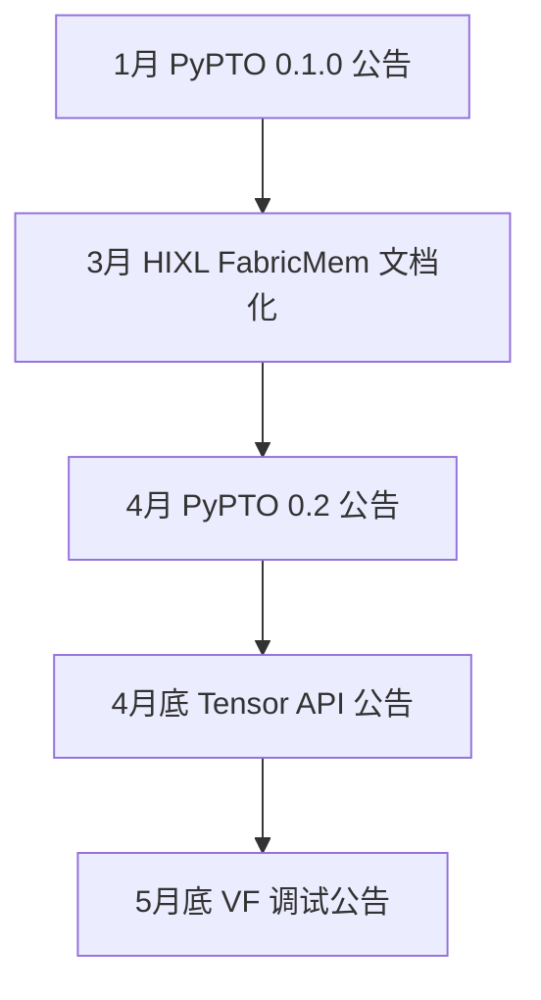

# 第28章 路线图与你的下一步

> 走到全书末尾，换最后一个视角：不看「某功能怎么用」，看「这条栈正往哪走，我该如何安排下一步」。

开源仓的 CHANGELOG、README 新闻区、issue 区每天都在产生信息。本章只回答一个问题：**读到一条发布或计划，如何判断它是否影响你的程序，下一步去哪看、怎样验证**。

先看这条信息能回答什么问题。发布说明告诉你项目宣布了什么，指南说明用法与限制，源码展示具体写法，运行记录则说明某个环境下实际发生了什么。它们相互补充：一次样例成功，不能证明所有架构都支持该能力。

| 来源 | 适合回答的问题 | 本章核验范围 |
| --- | --- | --- |
| 发布说明 | 项目宣布了哪些变化？ | 核对仓内公告 |
| 官方指南 | 接口怎么用，有什么条件？ | 核对相关指南与产品表 |
| 样例及实现 | 程序如何调用、组织数据与同步？ | 阅读相关代码片段 |
| 运行记录 | 在指定环境和输入下是否成功？ | 本章未编译或运行样例 |

日期有三种，不要混用：**公告日期**是文档标注的发布时点；**代码合入时点**需逐提交回溯，本书未做；**快照提交日**是本书证据的基准——2026-10-09 只读采集，各仓在 8 月 21 至 23 日间[^1]。引用任何实现，以对应 commit 为准；「目标日期已过」不能推出「功能已完成」。

## 28.1 半年时间线：这条栈在往哪走



*图 28-1 2026 上半年公开节点，按时间自上而下排列。相邻不代表依赖或因果，仅时间顺序；各节点证据见下文对应小节。*

半年里三条主线值得注意：编程接口走向更高层抽象（Tensor API），设备内调试工具变多（VF 路径打印与 dump），通信面出现新的机制公告（超节点内存统一编址）。方向判断是本章作者的归纳；节点本身可在仓内找到不同深度的佐证，下面逐条拆开。

## 28.2 变化一：Tensor API——新在抽象，不在「Tensor」这个词

asc-devkit v9.1.0-beta.1（公告日 2026-04-30）宣布「Tensor API 分支代码合入主线，正式提供 Tensor 编程支持」[^2]。读这条公告先问：新在哪？

官方编程指南区分基础 Tensor 与扩展 Tensor。**基础 Tensor**（`LocalTensor/GlobalTensor` 等）只封装数据指针与大小，搬运计算要手工传长度、算偏移——这代接口本书第 9、11 章早已出现，不是这次才有。

这次介绍的**扩展 Tensor**：引入 Layout 概念，携带 Shape 与 Stride，接口自动推导搬运长度与元素数，统一放在 `AscendC::Te` 命名空间下[^2]。指南同时写明边界：该能力「当前赋能于 Cube 矩阵计算，后续将逐步支持 Vector」；`RegTensor` 与三级存储的论述绑定架构版本 3510，那是 SIMD 编程视角，不代表芯片全局存储层级，也不暗示旧代没有寄存器。

同一任务有两个现成对照。MX-FP4 矩阵乘的老写法在 `matmul_mxfp4_high_performance`（`kernel_operator.h` 加 `matmul_intf`，手工管理 L1/L0 缓冲与同步）；新写法在 `matmul_mxfp4_tensor_api_high_performance`，同样是 GM 取数、L1 分块、L0 算子，但张量用一行声明排布：

```cpp
// 按样例简化的示意，非独立可编译程序；变量名与实参见原文件
auto gmA = AscendC::Te::MakeTensor(                     // Layout 即排布声明
    AscendC::Te::MakeMemPtr(a),
    AscendC::Te::MakeFrameLayout<AscendC::Te::NDExtLayoutPtn>(M, K));
auto piece = gmA.Slice(AscendC::Te::MakeCoord(r, c),    // 坐标与形状即切片
                       AscendC::Te::MakeShape(m, k));
```

原文件使用张量抽象表达 GM/L1/L0 各级数据，搬运用 `Te::Copy`、矩阵乘用 `Te::Mmad`；程序仍显式调用 `Mutex::Lock/Unlock` 管理流水线依赖，Layout 帮助表达排布与切片，程序仍需正确安排同步[^2]。

**给你的动作**：做 Cube 或 MX 类新算子，值得把两个对照样例各读一遍，体会「Layout 声明换手工传参」差在哪；第 14–18 章的手写范式仍是理解这套抽象的底座。**条件**：新写法样例的 README 单独标注 Ascend 950PR/DT、CANN 版本须**大于** 9.1.0、编译目标 `dav-3510`——注意老写法样例的 README 标的是「>= 9.1.0」，一个符号之差，以各自 README 为准[^2]。本书对两个样例只到「源码实读」层，未编译未运行。

## 28.3 变化二：VF 路径调试——公告新增了什么，怎么调用

beta.2（公告日 2026-05-31）公告了 SIMD VF 内 printf、reg dump 与基础 API NPU Check 等能力[^2]。VF 路径的可打印能力以样例为准：`simd_vf_printf.asc` 的设备核体（`extern "C" __global__ __vector__` 签名）内可直接 `AscendC::printf` 输出块号等标量，再以 `asc_vf_call<函数名>` 携带 UB 指针进入 `__simd_vf__` 子函数打印向量数据——核体与 VF 子函数都在设备侧执行；dump 样例提供 `asc_dump_ubuf/asc_dump/asc_dump_reg` 三个接口及 `Reg::LoadAlign` 等寄存器操作[^3]。公告与样例说明的都是「VF 路径新增了这些接口」；SIMT 路径此前已有 `asc_printf`（第 11 章），两条路径各自独立。

NPU Check：本章仅据公告转述，**未做实现核验**。因此这里只记录这条发布信息，不据此介绍使用方法[^4]。

**给你的动作**：写 SIMD VF 算子时，可把 VF printf/dump 列入调试手段；不依赖 NPU 的入门路径是 CPU Debug 直调样例——CPU 域编译后用 GDB 断点单步，**但仍需 CANN 工具链就位**，其 README 标注 950PR/DT≥9.1.0、A3≥9.0.0、A2≥9.0.0[^3]。VF printf/dump 样例本身仅标注 950PR/DT≥9.1.0；同目录另一 printf 样例支持面更宽（A2/A3/950）——**能力与架构的绑定要逐样例查 README**。本书未运行以上任何样例。

## 28.4 变化三：通信公告——值得跟踪，尚须条件

HIXL 半年内的公开动作：3 月文档化了超节点 FabricMem——**限定 Atlas 800T A3 超节点**，思路是超节点内各计算节点的 DRAM 统一编址、经 HCCS 直接访问远端内存，动机是 KVCache 分离部署下的内存压力；另有 Device UBoE 与 A2/A3/A5 异构的 issue 公告[^5]。

阅读这些信息时，需要保留几个边界：文档中的带宽数字是该项目自述，本书无实测，不转抄；issue 只有标题级信息，公告不等于通用跨代互通已可用；验证需要超节点环境，本书不具备。

**给你的动作**：做 KVCache 分离部署，把它列入选型观察项，先重读第 21–23 章的语义与拓扑再评估；其他人可先不动。

## 28.5 计划类信息：目标季度不等于完成

路线图表达的是项目意图。可以先看计划解决什么问题，再看目标时间；没有日期的方向性计划也值得了解，但不能据此安排确定的交付期限。pto-isa 的 README 就有一张路线图，明确列了目标时间为 2026 Q2 的条目，例如「集合通信扩展：新增 Ccu 及 Roce 异步通信指令及 AIV 直驱通信指令」与「CPU-SIM 随指令增强同步构建」，均标注 2026 Q2[^5]。

读法有二：其一，**目标季度是计划，完成情况需结合后续发布说明、对应代码和适用条件核对**——该项目 README 另注 master 分支可能与 CANN 版本不匹配，届时以 ReleaseNote 的版本条目为准；其二，进度栏写「持续演进/规划中」的条目连目标时间都没有，只能当方向参考。截至本书快照，这些条目处于何种完成状态，本书未验证。

同类的正式规划入口还有 asc-devkit README 指向的外部 issue（内容本书未读取，仅确认入口存在）[^2]。至于没有公开路线图的仓，本书不下「无规划」的结论——没检索到与不存在是两句话。

## 28.6 收束：把路线图读成你的下一步

三个问题串起来用。**证据**：这条信息有没有相应的指南、代码或运行记录，它们各自支持什么结论？**条件**：验证需要什么卡型、版本、工具链，我有没有？**波及**：它动摇了本书哪几章的预设？以 Tensor API 走一遍——样例与指南两层都有实存（28.2）；条件是 950 与 CANN>9.1.0，没有就止步读样例；波及的是第 14–18 章手写范式的对照理解，第 9 章的 API 地图可补一行索引。三问之后，动作自然浮现：**有条件就编译样例，没条件就把样例读进笔记，环境就绪再验**。

关于全书验证边界：各章示例的可靠度以**该章自己的验证声明**为准——本轮写作未进行 NPU 真机验证，CPU 侧验证与 PTO 仿真仅覆盖各自声明的范围；本章引用的样例全部止于源码实读。工具会更替，按证据分层采信的方法不会——这是全书想留下的东西。

## 陷阱与注意

- **层级别跳**：公告没落到样例/文档，就按公告转述，不写成「能力已具备」。
- **日期先问种类**：公告日、合入日、快照日是三个数；本书快照逐仓不同。
- **条件逐 README 核**：同一目录的样例支持面都不同，>= 与 > 也有别。
- **读过不等于跑过**：复现前先看该处声明止于哪一层。
- **计划看表格与后续版本**：目标季度非完成承诺；无路线图不下无规划结论。

## 本章来源

[^1]: 本书源码基线 `management/SOURCE-BASELINE.md`（2026-10-09 采集，只读 git log）：asc-devkit `28e7aba2`/2026-08-22、hixl `9ed283b`/2026-08-22、pypto `883e7dfb`/2026-08-22、pto-isa `dd3cb0fb`/2026-08-22、cann-learning-hub `a3989658`/2026-08-21、ops-transformer `e75072d7`/2026-08-23；各仓快照日不同。
[^2]: 公告：`asc-devkit/CHANGELOG.md` v9.1.0-beta.1（发布日期 2026-04-30）「Tensor API分支代码合入主线，正式提供Tensor编程支持」、v9.1.0-beta.2（2026-05-31）VF printf/reg dump 与 NPU Check 条目；规划入口 `asc-devkit/README.md`「📌相关规划」外链 issue（本书未读内容）。指南：`asc-devkit/docs/zh/guide/programming_guide/programming_model/ai_core_simd_programming/cpp_tensor_programming/cpp_tensor_programming_overview.md`（基础/扩展 Tensor 分层；「当前能力赋能于 Cube 矩阵计算，后续将逐步支持 Vector」；RegTensor 绑 3510）。样例：`asc-devkit/examples/01_simd_cpp_api/05_best_practices/01_matrix_compute/matmul_mxfp4_high_performance/`（老范式，`matmul_mx.h` include `kernel_operator.h` 与 `lib/matmul_intf.h`；README 产品表 Ascend 950PR/DT ≥9.1.0、编译 `dav-3510`）与 `asc-devkit/examples/01_simd_cpp_api/05_best_practices/01_matrix_compute/matmul_mxfp4_tensor_api_high_performance/mmad_mx.asc`（include `tensor_api/tensor.h`；`Te::MakeTensor/MakeFrameLayout` L71-84、`Slice/MakeCoord/MakeShape` L86-98、`Te::Mmad` L329、`Mutex::Unlock<PIPE_MTE1>` L312-322；同目录 README 产品表 Ascend 950PR/DT **>9.1.0**、`dav-3510`）。本书对两样例仅源码实读。
[^3]: `asc-devkit/examples/01_simd_cpp_api/01_utilities/00_printf/simd_vf_printf/simd_vf_printf.asc`——L72 `extern "C" __global__ __vector__ void simd_vf_printf_kernel()` 设备核体、L76-77/L84 核体内 `AscendC::printf`、L79-81 `asc_vf_call<…>` 进入 `__simd_vf__` 子函数；`asc-devkit/examples/01_simd_cpp_api/01_utilities/00_printf/simd_vf_printf/README.md` 产品表 950PR/DT ≥9.1.0。`asc-devkit/examples/01_simd_cpp_api/01_utilities/02_dump/simd_vf_dump/simd_vf_dump.asc`——`asc_dump_ubuf/asc_dump/asc_dump_reg` 与 `AscendC::Reg::LoadAlign/Duplicate`（L26-43 区段）；`asc-devkit/examples/01_simd_cpp_api/01_utilities/02_dump/simd_vf_dump/README.md` 产品表 950PR/DT ≥9.1.0。`asc-devkit/examples/01_simd_cpp_api/01_utilities/00_printf/README.md` L8-9：`simple_printf` 支持 A2/A3/950、`simd_vf_printf` 仅 950。`asc-devkit/examples/01_simd_cpp_api/01_utilities/06_cpu_debug/README.md` L11-13 与 L58：950PR/DT≥9.1.0、A3≥9.0.0、A2≥9.0.0，CPU 域编译+GDB 断点单步（仍需 CANN 工具链，`dav-2201`/`dav-3510` 二选）。本书未运行。
[^4]: 书内对账：`docs/03-ascendc/ch11-simd-simt.md` L210-215——SIMT `asc_printf`（`utils/debug/asc_printf.h`）与 DumpTensor/msSanitizer；NPU-Check 降级注记（本地基线未检索到该名工具，按「无出处不写」降级）。
[^5]: `hixl/README.md` Latest News（2026/01–05 条目：FabricMem 文档化、Device UBoE issue#275、A2/A3/A5 异构 issue#138/#115，标题级）；`hixl/docs/zh/FabricMem.md`（适用 Atlas 800T A3 超节点；带宽数字为该文自述，本书未转抄）。`pto-isa/README_zh.md`「🛣️ 路线图」表 L177-192（集合通信扩展、微指令、基础指令、CostModel、CPU-SIM 标 2026 Q2；其余「持续演进/规划中」）及 master 与 CANN 版本可能不匹配的提示；版本变更 `pto-isa/ReleaseNote_zh.md`（Unreleased 暂无、Added 初次公开发布）。PyPTO 版本公告 `pypto/README.md` 最新动态（2026-01-06 0.1.0 至 2026-04-10 0.2.0）。
